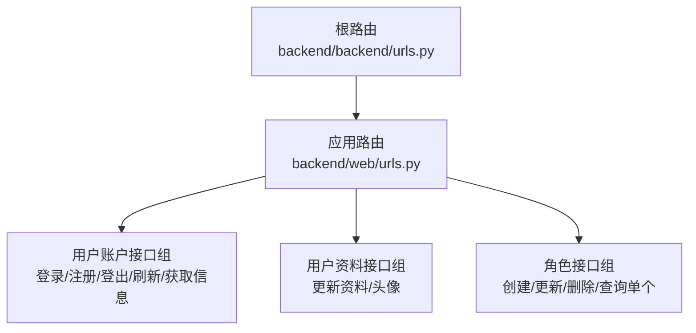
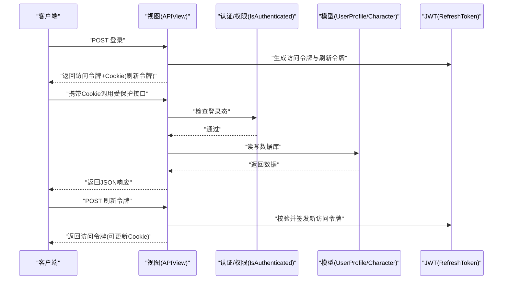
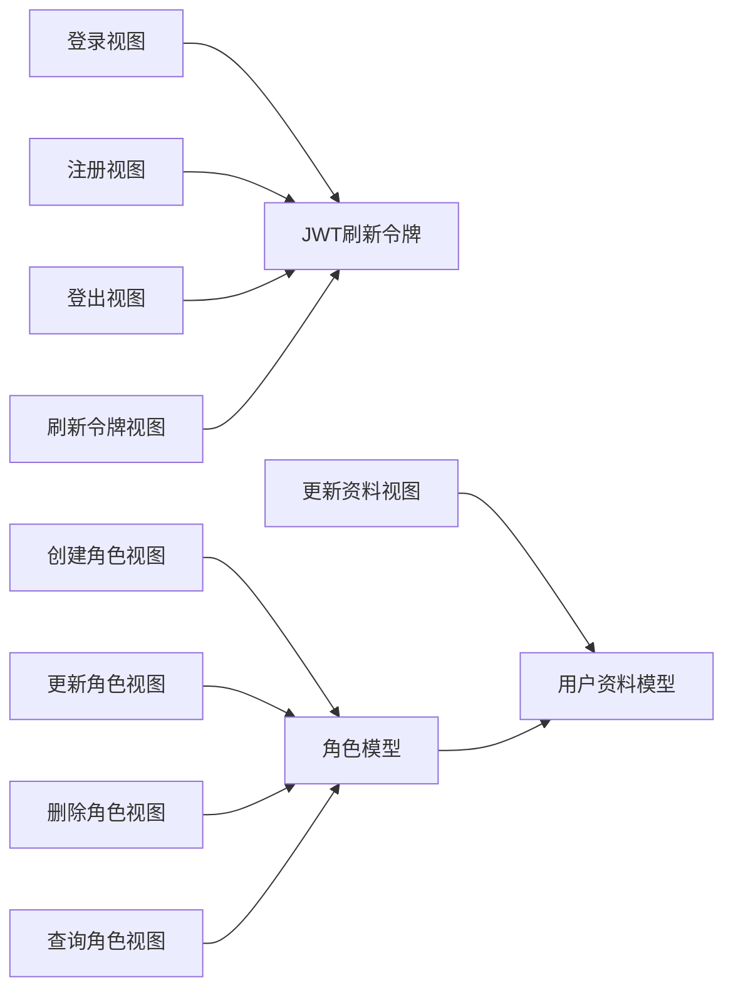
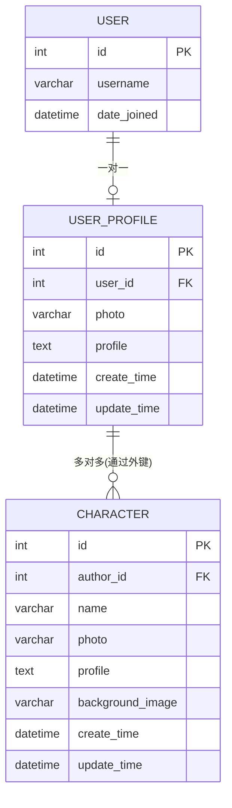

# API接口文档

<cite>
**本文引用的文件**
- [backend/backend/urls.py](file://backend/backend/urls.py)
- [backend/web/urls.py](file://backend/web/urls.py)
- [backend/web/views/user/account/login.py](file://backend/web/views/user/account/login.py)
- [backend/web/views/user/account/register.py](file://backend/web/views/user/account/register.py)
- [backend/web/views/user/account/logout.py](file://backend/web/views/user/account/logout.py)
- [backend/web/views/user/account/refresh_token.py](file://backend/web/views/user/account/refresh_token.py)
- [backend/web/views/user/account/get_user_info.py](file://backend/web/views/user/account/get_user_info.py)
- [backend/web/views/user/profile/update.py](file://backend/web/views/user/profile/update.py)
- [backend/web/views/create/character/create.py](file://backend/web/views/create/character/create.py)
- [backend/web/views/create/character/update.py](file://backend/web/views/create/character/update.py)
- [backend/web/views/create/character/remove.py](file://backend/web/views/create/character/remove.py)
- [backend/web/views/create/character/get_single.py](file://backend/web/views/create/character/get_single.py)
- [backend/web/models/user.py](file://backend/web/models/user.py)
- [backend/web/models/character.py](file://backend/web/models/character.py)
</cite>

## 目录
1. [简介](#简介)
2. [项目结构](#项目结构)
3. [核心组件](#核心组件)
4. [架构总览](#架构总览)
5. [详细组件分析](#详细组件分析)
6. [依赖分析](#依赖分析)
7. [性能考虑](#性能考虑)
8. [故障排除指南](#故障排除指南)
9. [结论](#结论)
10. [附录](#附录)

## 简介
本文件为 LLM_AIfriends 后端服务的完整 API 接口文档，覆盖用户认证（登录、注册、登出、Token 刷新）、个人信息与头像更新、以及角色（Character）的创建、更新、删除、查询等接口。文档提供每个端点的 HTTP 方法、URL 模式、请求参数、响应格式、状态码说明与错误处理策略，并给出认证机制说明、请求/响应示例与常见问题解答。同时说明 API 版本控制策略与向后兼容性保障。

## 项目结构
后端采用 Django + Django REST framework 架构，URL 路由通过两级路由组织：根路由将请求转发至 web 应用；web 应用内定义具体 API 路由，对应各功能模块的视图类。

图表来源
- [backend/backend/urls.py:22-25](file://backend/backend/urls.py#L22-L25)
- [backend/web/urls.py:16-32](file://backend/web/urls.py#L16-L32)

章节来源
- [backend/backend/urls.py:17-38](file://backend/backend/urls.py#L17-L38)
- [backend/web/urls.py:1-33](file://backend/web/urls.py#L1-L33)

## 核心组件
- 认证与授权
  - 使用 DRF 的 APIView 与 IsAuthenticated 权限类保护接口。
  - 使用 djangorestframework_simplejwt 提供 JWT 访问令牌与刷新令牌。
  - 登录成功后通过 Cookie 设置 refresh_token，有效期 7 天。
- 数据模型
  - 用户扩展信息 UserProfile：一对一关联 Django 内置 User，包含头像、简介、创建/更新时间。
  - 角色 Character：多对一关联 UserProfile，包含名称、头像、简介、背景图、创建/更新时间。
- 文件上传
  - 用户头像与角色头像/背景图均支持上传，存储路径按用户维度与类型区分，文件名使用 UUID 避免冲突。

章节来源
- [backend/web/views/user/account/login.py:9-46](file://backend/web/views/user/account/login.py#L9-L46)
- [backend/web/views/user/account/register.py:9-45](file://backend/web/views/user/account/register.py#L9-L45)
- [backend/web/views/user/account/logout.py:6-14](file://backend/web/views/user/account/logout.py#L6-L14)
- [backend/web/views/user/account/refresh_token.py:7-39](file://backend/web/views/user/account/refresh_token.py#L7-L39)
- [backend/web/models/user.py:14-23](file://backend/web/models/user.py#L14-L23)
- [backend/web/models/character.py:21-32](file://backend/web/models/character.py#L21-L32)

## 架构总览
下图展示从客户端到后端视图与模型的数据流，以及认证流程中的 Cookie 与 JWT 交互。

图表来源
- [backend/web/views/user/account/login.py:9-46](file://backend/web/views/user/account/login.py#L9-L46)
- [backend/web/views/user/account/refresh_token.py:7-39](file://backend/web/views/user/account/refresh_token.py#L7-L39)
- [backend/web/views/user/profile/update.py:11-53](file://backend/web/views/user/profile/update.py#L11-L53)
- [backend/web/models/user.py:14-23](file://backend/web/models/user.py#L14-L23)
- [backend/web/models/character.py:21-32](file://backend/web/models/character.py#L21-L32)

## 详细组件分析

### 认证接口

#### 登录
- 方法与路径
  - POST /api/user/account/login/
- 请求体字段
  - username: string, 必填
  - password: string, 必填
- 成功响应字段
  - result: string, 固定值 "success"
  - access: string, JWT 访问令牌
  - user_id: number, 用户标识
  - username: string, 用户名
  - photo: string, 头像URL
  - profile: string, 简介
- 失败响应字段
  - result: string, 错误原因
- 状态码
  - 200: 成功
  - 400: 参数缺失或用户名/密码错误
  - 500: 系统异常
- 认证机制
  - 成功后设置 Cookie: refresh_token（httponly、secure、sameSite=Lax、7天）
  - 客户端后续请求需携带该 Cookie
- 示例
  - 请求: POST /api/user/account/login/，Body: { "username": "...", "password": "..." }
  - 响应: { "result": "success", "access": "...", "user_id": 1, "username": "...", "photo": "/media/...", "profile": "..." }
- 常见问题
  - 未提供用户名/密码时返回参数缺失提示
  - 用户名或密码错误时返回认证失败提示
  - 服务器内部异常时返回系统异常提示

章节来源
- [backend/web/views/user/account/login.py:9-46](file://backend/web/views/user/account/login.py#L9-L46)

#### 注册
- 方法与路径
  - POST /api/user/account/register/
- 请求体字段
  - username: string, 必填
  - password: string, 必填
- 成功响应字段
  - result: string, 固定值 "success"
  - access: string, JWT 访问令牌
  - user_id: number, 用户标识
  - username: string, 用户名
  - photo: string, 默认头像URL
  - profile: string, 简介
- 失败响应字段
  - result: string, 错误原因
- 状态码
  - 200: 成功
  - 400: 参数缺失或用户名已存在
  - 500: 系统异常
- 认证机制
  - 成功后设置 Cookie: refresh_token（同上）
- 示例
  - 请求: POST /api/user/account/register/，Body: { "username": "...", "password": "..." }
  - 响应: { "result": "success", "access": "...", "user_id": 1, "username": "...", "photo": "/media/...", "profile": "..." }
- 常见问题
  - 重复用户名返回已存在提示
  - 服务器内部异常返回系统异常提示

章节来源
- [backend/web/views/user/account/register.py:9-45](file://backend/web/views/user/account/register.py#L9-L45)

#### 登出
- 方法与路径
  - POST /api/user/account/logout/
- 权限要求
  - 需已登录（IsAuthenticated）
- 成功响应字段
  - result: string, 固定值 "success"
- 失败响应字段
  - result: string, 错误原因
- 状态码
  - 200: 成功
  - 401: 未登录
  - 500: 系统异常
- 行为
  - 删除 refresh_token Cookie
- 示例
  - 请求: POST /api/user/account/logout/
  - 响应: { "result": "success" }
- 常见问题
  - 未登录调用返回未授权提示

章节来源
- [backend/web/views/user/account/logout.py:6-14](file://backend/web/views/user/account/logout.py#L6-L14)

#### 刷新访问令牌
- 方法与路径
  - POST /api/user/account/refresh_token/
- 权限要求
  - 需已登录（IsAuthenticated）
- 请求方式
  - 通过 Cookie 传递 refresh_token
- 成功响应字段
  - result: string, 固定值 "success"
  - access: string, 新的访问令牌
- 失败响应字段
  - result: string, 错误原因
- 状态码
  - 200: 成功
  - 400: 缺少 refresh_token
  - 401: refresh_token 过期或无效
  - 500: 系统异常
- 行为
  - 若 SIMPLE_JWT 配置允许轮换刷新令牌，则会签发新的 refresh_token 并更新 Cookie
- 示例
  - 请求: POST /api/user/account/refresh_token/（携带 refresh_token Cookie）
  - 响应: { "result": "success", "access": "..." }（可能包含更新后的 Cookie）
- 常见问题
  - 未携带 Cookie 返回缺少刷新令牌提示
  - 刷新令牌过期返回过期提示

章节来源
- [backend/web/views/user/account/refresh_token.py:7-39](file://backend/web/views/user/account/refresh_token.py#L7-L39)

#### 获取当前用户信息
- 方法与路径
  - GET /api/user/account/get_user_info/
- 权限要求
  - 需已登录（IsAuthenticated）
- 成功响应字段
  - result: string, 固定值 "success"
  - user_id: number, 用户标识
  - username: string, 用户名
  - photo: string, 头像URL
  - profile: string, 简介
- 失败响应字段
  - result: string, 错误原因
- 状态码
  - 200: 成功
  - 401: 未登录
  - 500: 系统异常
- 示例
  - 请求: GET /api/user/account/get_user_info/
  - 响应: { "result": "success", "user_id": 1, "username": "...", "photo": "/media/...", "profile": "..." }
- 常见问题
  - 服务器内部异常返回系统异常提示

章节来源
- [backend/web/views/user/account/get_user_info.py:8-24](file://backend/web/views/user/account/get_user_info.py#L8-L24)

### 个人资料与文件上传接口

#### 更新个人资料与头像
- 方法与路径
  - POST /api/user/profile/update/
- 权限要求
  - 需已登录（IsAuthenticated）
- 请求体字段
  - username: string, 必填
  - profile: string, 必填（最大长度 500）
  - photo: file, 可选（支持图片文件）
- 成功响应字段
  - result: string, 固定值 "success"
  - user_id: number, 用户标识
  - username: string, 用户名
  - profile: string, 简介
  - photo: string, 头像URL
- 失败响应字段
  - result: string, 错误原因
- 状态码
  - 200: 成功
  - 400: 参数缺失或用户名已存在
  - 401: 未登录
  - 500: 系统异常
- 行为
  - 当提供 photo 时，先清理旧头像再保存新头像
  - 更新时间字段自动写入
- 示例
  - 请求: POST /api/user/profile/update/（表单 multipart/form-data）
  - Body: username=...&profile=...&photo=文件
  - 响应: { "result": "success", "user_id": 1, "username": "...", "profile": "...", "photo": "/media/..." }
- 常见问题
  - 未提供 username 或 profile 返回参数缺失提示
  - 重复用户名返回已存在提示
  - 服务器内部异常返回系统异常提示

章节来源
- [backend/web/views/user/profile/update.py:11-53](file://backend/web/views/user/profile/update.py#L11-L53)

### 角色（Character）管理接口

#### 创建角色
- 方法与路径
  - POST /api/create/character/create/
- 权限要求
  - 需已登录（IsAuthenticated）
- 请求体字段
  - name: string, 必填
  - profile: string, 必填（最大长度 100000）
  - photo: file, 必填（头像）
  - background_image: file, 必填（背景图）
- 成功响应字段
  - result: string, 固定值 "success"
- 失败响应字段
  - result: string, 错误原因
- 状态码
  - 200: 成功
  - 400: 参数缺失
  - 401: 未登录
  - 500: 系统异常
- 行为
  - 自动绑定当前用户为作者
  - 保存头像与背景图
- 示例
  - 请求: POST /api/create/character/create/（multipart/form-data）
  - Body: name=...&profile=...&photo=...&background_image=...
  - 响应: { "result": "success" }
- 常见问题
  - 缺少必填字段返回参数缺失提示
  - 服务器内部异常返回系统异常提示

章节来源
- [backend/web/views/create/character/create.py:9-51](file://backend/web/views/create/character/create.py#L9-L51)

#### 更新角色
- 方法与路径
  - POST /api/create/character/update/
- 权限要求
  - 需已登录（IsAuthenticated）
- 请求体字段
  - character_id: number, 必填
  - name: string, 必填
  - profile: string, 必填（最大长度 100000）
  - photo: file, 可选
  - background_image: file, 可选
- 成功响应字段
  - result: string, 固定值 "success"
- 失败响应字段
  - result: string, 错误原因
- 状态码
  - 200: 成功
  - 400: 参数缺失或越权访问
  - 401: 未登录
  - 500: 系统异常
- 行为
  - 仅允许更新当前用户的角色
  - 提供文件时先清理旧资源再保存新资源
  - 更新时间字段自动写入
- 示例
  - 请求: POST /api/create/character/update/（multipart/form-data）
  - Body: character_id=...&name=...&profile=...&photo=...（可选）
  - 响应: { "result": "success" }
- 常见问题
  - 缺少必填字段返回参数缺失提示
  - 非本人角色返回越权提示
  - 服务器内部异常返回系统异常提示

章节来源
- [backend/web/views/create/character/update.py:10-46](file://backend/web/views/create/character/update.py#L10-L46)

#### 删除角色
- 方法与路径
  - POST /api/create/character/remove/
- 权限要求
  - 需已登录（IsAuthenticated）
- 请求体字段
  - character_id: number, 必填
- 成功响应字段
  - result: string, 固定值 "success"
- 失败响应字段
  - result: string, 错误原因
- 状态码
  - 200: 成功
  - 400: 参数缺失或越权访问
  - 401: 未登录
  - 500: 系统异常
- 行为
  - 仅允许删除当前用户的角色
  - 删除时清理头像与背景图资源
- 示例
  - 请求: POST /api/create/character/remove/，Body: { "character_id": 1 }
  - 响应: { "result": "success" }
- 常见问题
  - 非本人角色返回越权提示
  - 服务器内部异常返回系统异常提示

章节来源
- [backend/web/views/create/character/remove.py:9-25](file://backend/web/views/create/character/remove.py#L9-L25)

#### 查询单个角色
- 方法与路径
  - GET /api/create/character/get_single/
- 权限要求
  - 需已登录（IsAuthenticated）
- 查询参数
  - character_id: number, 必填
- 成功响应字段
  - result: string, 固定值 "success"
  - character: object
    - id: number
    - name: string
    - profile: string
    - photo: string, 头像URL
    - background_image: string, 背景图URL
- 失败响应字段
  - result: string, 错误原因
- 状态码
  - 200: 成功
  - 400: 参数缺失或越权访问
  - 401: 未登录
  - 500: 系统异常
- 示例
  - 请求: GET /api/create/character/get_single/?character_id=1
  - 响应: { "result": "success", "character": { "id": 1, "name": "...", "profile": "...", "photo": "/media/...", "background_image": "/media/..." } }
- 常见问题
  - 非本人角色返回越权提示
  - 服务器内部异常返回系统异常提示

章节来源
- [backend/web/views/create/character/get_single.py:8-28](file://backend/web/views/create/character/get_single.py#L8-L28)

## 依赖分析
- 组件耦合
  - 所有受保护接口均依赖 IsAuthenticated 权限类，确保仅登录用户可访问。
  - 登录/注册接口依赖 UserProfile 模型以初始化用户资料。
  - 角色接口依赖 Character 模型与 UserProfile 关联，实现“作者”约束。
- 外部依赖
  - djangorestframework_simplejwt：用于生成与验证 JWT。
  - Django 文件上传：ImageField 与 MEDIA_ROOT 配置共同决定文件存储与访问。
- 循环依赖
  - 未发现循环导入；视图与模型分层清晰。

图表来源
- [backend/web/views/user/account/login.py:9-46](file://backend/web/views/user/account/login.py#L9-L46)
- [backend/web/views/user/account/register.py:9-45](file://backend/web/views/user/account/register.py#L9-L45)
- [backend/web/views/user/account/logout.py:6-14](file://backend/web/views/user/account/logout.py#L6-L14)
- [backend/web/views/user/account/refresh_token.py:7-39](file://backend/web/views/user/account/refresh_token.py#L7-L39)
- [backend/web/views/user/profile/update.py:11-53](file://backend/web/views/user/profile/update.py#L11-L53)
- [backend/web/views/create/character/create.py:9-51](file://backend/web/views/create/character/create.py#L9-L51)
- [backend/web/views/create/character/update.py:10-46](file://backend/web/views/create/character/update.py#L10-L46)
- [backend/web/views/create/character/remove.py:9-25](file://backend/web/views/create/character/remove.py#L9-L25)
- [backend/web/views/create/character/get_single.py:8-28](file://backend/web/views/create/character/get_single.py#L8-L28)
- [backend/web/models/user.py:14-23](file://backend/web/models/user.py#L14-L23)
- [backend/web/models/character.py:21-32](file://backend/web/models/character.py#L21-L32)

章节来源
- [backend/web/models/user.py:14-23](file://backend/web/models/user.py#L14-L23)
- [backend/web/models/character.py:21-32](file://backend/web/models/character.py#L21-L32)

## 性能考虑
- 文件上传
  - 图片上传建议前端进行压缩与尺寸限制，减少带宽与存储压力。
  - 旧文件清理逻辑在更新/删除时执行，避免磁盘碎片化与冗余。
- Token 策略
  - 刷新令牌 Cookie 设置 httponly、secure、sameSite=Lax，兼顾安全与可用性。
  - 若开启刷新令牌轮换，可降低长期暴露风险。
- 数据库访问
  - 查询单个角色时使用外键过滤，避免跨用户数据泄露。
  - 批量操作建议后端增加分页与并发控制。

## 故障排除指南
- 400 参数错误
  - 常见于必填字段缺失或重复用户名。请检查请求体与查询参数。
- 401 未授权
  - 未登录或刷新令牌缺失/过期。请先登录并携带 refresh_token Cookie。
- 500 系统异常
  - 服务器内部错误。请重试或联系管理员。
- Cookie 问题
  - 生产环境需确保 HTTPS 与正确 SameSite 配置，避免浏览器拦截。
- 文件上传失败
  - 检查文件类型与大小限制，确认 MEDIA_ROOT 可写且路径可达。

章节来源
- [backend/web/views/user/account/login.py:14-17](file://backend/web/views/user/account/login.py#L14-L17)
- [backend/web/views/user/account/register.py:14-21](file://backend/web/views/user/account/register.py#L14-L21)
- [backend/web/views/user/profile/update.py:21-32](file://backend/web/views/user/profile/update.py#L21-L32)
- [backend/web/views/create/character/create.py:20-35](file://backend/web/views/create/character/create.py#L20-L35)
- [backend/web/views/user/account/refresh_token.py:10-14](file://backend/web/views/user/account/refresh_token.py#L10-L14)
- [backend/web/views/user/account/refresh_token.py:35-38](file://backend/web/views/user/account/refresh_token.py#L35-L38)

## 结论
本 API 文档覆盖了用户认证、个人资料与文件上传、角色管理等核心能力。通过 JWT 与 Cookie 的组合实现安全的会话管理，配合严格的权限控制与输入校验，确保接口稳定可靠。建议在生产环境中完善日志审计、速率限制与文件安全扫描，持续提升安全性与用户体验。

## 附录

### API 版本控制与兼容性
- 版本策略
  - 当前接口未显式标注版本号（如 /api/v1/），建议后续引入语义化版本控制，例如 /api/v1/...，并在变更时保持向后兼容或提供迁移指引。
- 兼容性保证
  - 新增字段建议默认可选，避免破坏现有客户端。
  - 对于破坏性变更，保留旧接口一段时间并提供明确弃用时间表。

### 数据模型概览

图表来源
- [backend/web/models/user.py:14-23](file://backend/web/models/user.py#L14-L23)
- [backend/web/models/character.py:21-32](file://backend/web/models/character.py#L21-L32)