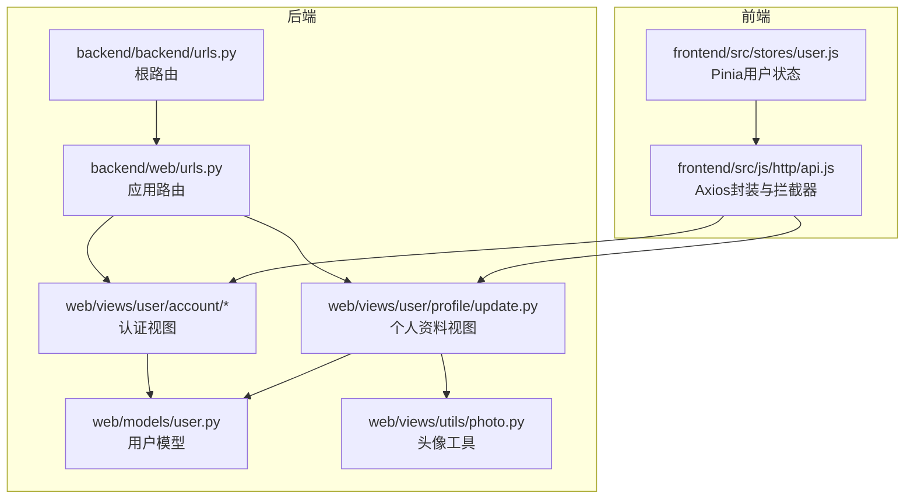
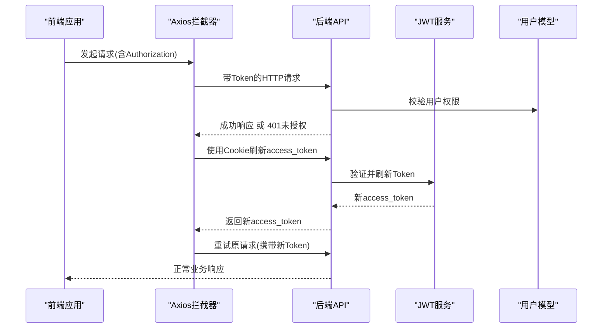
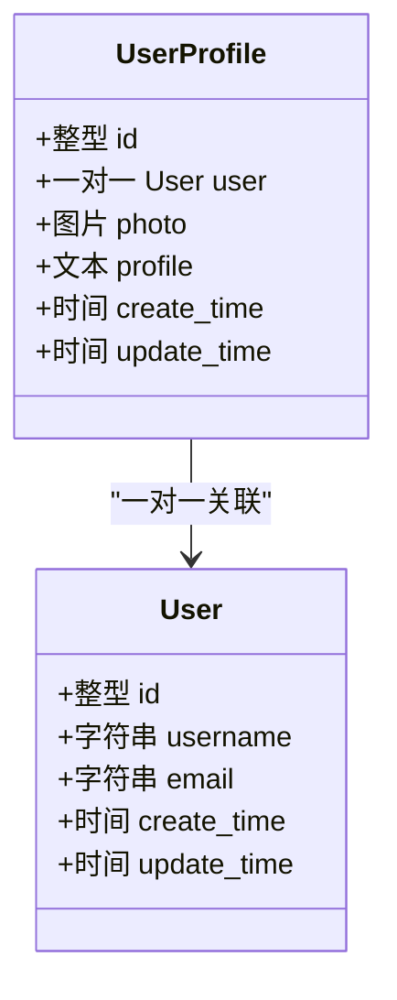
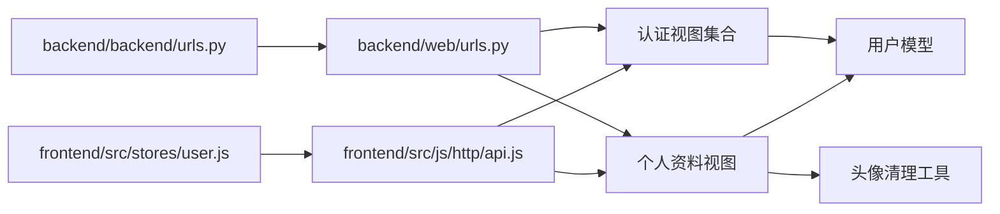

# API接口文档

<cite>
**本文档引用的文件**
- [backend/backend/urls.py](file://backend/backend/urls.py)
- [backend/web/urls.py](file://backend/web/urls.py)
- [backend/web/views/user/account/login.py](file://backend/web/views/user/account/login.py)
- [backend/web/views/user/account/register.py](file://backend/web/views/user/account/register.py)
- [backend/web/views/user/account/refresh_token.py](file://backend/web/views/user/account/refresh_token.py)
- [backend/web/views/user/account/logout.py](file://backend/web/views/user/account/logout.py)
- [backend/web/views/user/account/get_user_info.py](file://backend/web/views/user/account/get_user_info.py)
- [backend/web/views/user/profile/update.py](file://backend/web/views/user/profile/update.py)
- [backend/web/models/user.py](file://backend/web/models/user.py)
- [backend/web/views/utils/photo.py](file://backend/web/views/utils/photo.py)
- [backend/web/views/index.py](file://backend/web/views/index.py)
- [frontend/src/js/http/api.js](file://frontend/src/js/http/api.js)
- [frontend/src/stores/user.js](file://frontend/src/stores/user.js)
</cite>

## 目录
1. [简介](#简介)
2. [项目结构](#项目结构)
3. [核心组件](#核心组件)
4. [架构总览](#架构总览)
5. [详细组件分析](#详细组件分析)
6. [依赖分析](#依赖分析)
7. [性能考虑](#性能考虑)
8. [故障排除指南](#故障排除指南)
9. [结论](#结论)
10. [附录](#附录)

## 简介
本文件为 LLM_AIfriends 项目的完整 API 接口文档，覆盖用户认证（登录、注册、令牌刷新、登出）与个人资料（信息更新）两大模块。文档提供每个端点的 HTTP 方法、URL 模式、请求/响应结构、认证要求、参数说明、返回值定义、错误处理与状态码，并给出客户端实现建议、最佳实践、API 版本管理与安全注意事项。

## 项目结构
后端采用 Django + Django REST Framework 架构，路由通过两级 URL 配置分发至具体视图类。前端使用 Vue 3 + Pinia + Axios，统一通过拦截器处理鉴权与刷新流程。

**图表来源**
- [backend/backend/urls.py:23-26](file://backend/backend/urls.py#L23-L26)
- [backend/web/urls.py:10-23](file://backend/web/urls.py#L10-L23)
- [frontend/src/js/http/api.js:14-19](file://frontend/src/js/http/api.js#L14-L19)

**章节来源**
- [backend/backend/urls.py:23-26](file://backend/backend/urls.py#L23-L26)
- [backend/web/urls.py:10-23](file://backend/web/urls.py#L10-L23)

## 核心组件
- 认证模块：登录、注册、令牌刷新、登出、获取当前用户信息
- 个人资料模块：更新用户名、简介与头像
- 客户端模块：Axios 封装、拦截器、自动刷新 access token、Pinia 状态管理

**章节来源**
- [backend/web/views/user/account/login.py:9-46](file://backend/web/views/user/account/login.py#L9-L46)
- [backend/web/views/user/account/register.py:9-46](file://backend/web/views/user/account/register.py#L9-L46)
- [backend/web/views/user/account/refresh_token.py:7-41](file://backend/web/views/user/account/refresh_token.py#L7-L41)
- [backend/web/views/user/account/logout.py:7-16](file://backend/web/views/user/account/logout.py#L7-L16)
- [backend/web/views/user/account/get_user_info.py:8-25](file://backend/web/views/user/account/get_user_info.py#L8-L25)
- [backend/web/views/user/profile/update.py:12-63](file://backend/web/views/user/profile/update.py#L12-L63)
- [frontend/src/js/http/api.js:46-90](file://frontend/src/js/http/api.js#L46-L90)
- [frontend/src/stores/user.js:4-59](file://frontend/src/stores/user.js#L4-L59)

## 架构总览
下图展示前后端交互与鉴权流程：客户端通过 Axios 发起请求，自动携带 Bearer Token；当服务端返回 401 时，客户端使用 Cookie 中的 refresh_token 调用刷新接口，成功后重试原请求。

**图表来源**
- [frontend/src/js/http/api.js:21-90](file://frontend/src/js/http/api.js#L21-L90)
- [backend/web/views/user/account/refresh_token.py:7-41](file://backend/web/views/user/account/refresh_token.py#L7-L41)

## 详细组件分析

### 认证接口

#### 登录
- HTTP 方法：POST
- URL：/api/user/account/login/
- 认证：无需
- 请求体字段
  - username: 字符串，必填，去空白
  - password: 字符串，必填，去空白
- 成功响应字段
  - result: 字符串，固定为 success
  - access: 字符串，JWT Access Token
  - user_id: 整数，用户标识
  - username: 字符串，用户名
  - photo: 字符串，头像URL
  - profile: 字符串，个人简介
- 失败响应字段
  - result: 字符串，错误原因
- 状态码
  - 200 成功
  - 401 用户名或密码错误
  - 500 系统异常
- 安全与行为
  - 成功登录后设置 HttpOnly、Secure、SameSite=Lax 的 refresh_token Cookie，有效期约 7 天
  - access_token 作为响应体返回，供后续请求使用

**章节来源**
- [backend/web/views/user/account/login.py:9-46](file://backend/web/views/user/account/login.py#L9-L46)

#### 注册
- HTTP 方法：POST
- URL：/api/user/account/register/
- 认证：无需
- 请求体字段
  - username: 字符串，必填，去空白
  - password: 字符串，必填，去空白
- 成功响应字段
  - result: 字符串，固定为 success
  - access: 字符串，JWT Access Token
  - user_id: 整数，用户标识
  - username: 字符串，用户名
  - photo: 字符串，头像URL
  - profile: 字符串，个人简介
- 失败响应字段
  - result: 字符串，错误原因
- 状态码
  - 200 成功
  - 400 用户名已存在
  - 500 系统异常
- 行为说明
  - 创建用户与默认头像、简介的用户档案
  - 同步设置 refresh_token Cookie

**章节来源**
- [backend/web/views/user/account/register.py:9-46](file://backend/web/views/user/account/register.py#L9-L46)

#### 刷新令牌
- HTTP 方法：POST
- URL：/api/user/account/refresh_token/
- 认证：需携带 refresh_token Cookie
- 请求体：空
- 成功响应字段
  - result: 字符串，固定为 success
  - access: 字符串，新的 JWT Access Token
- 失败响应字段
  - result: 字符串，错误原因
- 状态码
  - 200 成功
  - 401 缺失或无效的 refresh_token
  - 500 系统异常
- 行为说明
  - 若启用刷新令牌轮换，同时刷新 refresh_token 并更新 Cookie
  - 保持 refresh_token 有效期约 7 天

**章节来源**
- [backend/web/views/user/account/refresh_token.py:7-41](file://backend/web/views/user/account/refresh_token.py#L7-L41)

#### 登出
- HTTP 方法：POST
- URL：/api/user/account/logout/
- 认证：需登录
- 请求体：空
- 成功响应字段
  - result: 字符串，固定为 success
- 行为说明
  - 删除 refresh_token Cookie，使用户退出登录

**章节来源**
- [backend/web/views/user/account/logout.py:7-16](file://backend/web/views/user/account/logout.py#L7-L16)

#### 获取当前用户信息
- HTTP 方法：GET
- URL：/api/user/account/get_user_info/
- 认证：需登录
- 请求体：空
- 成功响应字段
  - result: 字符串，固定为 success
  - user_id: 整数，用户标识
  - username: 字符串，用户名
  - photo: 字符串，头像URL
  - profile: 字符串，个人简介
- 失败响应字段
  - result: 字符串，错误原因
- 状态码
  - 200 成功
  - 500 系统异常

**章节来源**
- [backend/web/views/user/account/get_user_info.py:8-25](file://backend/web/views/user/account/get_user_info.py#L8-L25)

### 个人资料接口

#### 更新个人资料
- HTTP 方法：POST
- URL：/api/user/profile/update/
- 认证：需登录
- 请求体字段
  - username: 字符串，必填，去空白
  - profile: 字符串，必填，去空白，最大长度 500
  - photo: 文件，可选，支持替换头像
- 成功响应字段
  - result: 字符串，固定为 success
  - user_id: 整数，用户标识
  - username: 字符串，更新后的用户名
  - profile: 字符串，更新后的简介
  - photo: 字符串，更新后的头像URL
- 失败响应字段
  - result: 字符串，错误原因
- 状态码
  - 200 成功
  - 400 用户名为空/简介为空/用户名已存在
  - 500 系统异常
- 行为说明
  - 若提供新头像，删除旧头像（保留默认头像）
  - 更新时间戳与用户信息

**章节来源**
- [backend/web/views/user/profile/update.py:12-63](file://backend/web/views/user/profile/update.py#L12-L63)
- [backend/web/views/utils/photo.py:9-13](file://backend/web/views/utils/photo.py#L9-L13)

### 数据模型

**图表来源**
- [backend/web/models/user.py:15-23](file://backend/web/models/user.py#L15-L23)

## 依赖分析
- 路由层
  - 根路由将所有请求交由应用路由处理
  - 应用路由定义认证与个人资料相关端点
- 视图层
  - 认证视图依赖 Django 认证与 DRF SimpleJWT
  - 个人资料视图依赖用户模型与头像清理工具
- 客户端
  - Axios 拦截器负责自动注入 Authorization 与刷新 access_token
  - Pinia 管理用户状态与 access_token

**图表来源**
- [backend/backend/urls.py:23-26](file://backend/backend/urls.py#L23-L26)
- [backend/web/urls.py:10-23](file://backend/web/urls.py#L10-L23)
- [frontend/src/js/http/api.js:14-19](file://frontend/src/js/http/api.js#L14-L19)

**章节来源**
- [backend/backend/urls.py:23-26](file://backend/backend/urls.py#L23-L26)
- [backend/web/urls.py:10-23](file://backend/web/urls.py#L10-L23)

## 性能考虑
- 令牌轮换：启用刷新令牌轮换可提升安全性并延长会话生命周期
- 响应缓存：对只读接口（如获取用户信息）可在网关或 CDN 层进行短期缓存
- 图片优化：头像上传采用唯一文件名与媒体存储分离，避免磁盘碎片与冗余
- 请求合并：前端拦截器统一处理鉴权与重试，减少重复逻辑

## 故障排除指南
- 401 未授权
  - 可能原因：access_token 过期、未登录
  - 处理方式：客户端自动使用 refresh_token 刷新 access_token；若刷新失败则清空本地状态并引导重新登录
- refresh_token 缺失或无效
  - 可能原因：Cookie 未携带或已过期
  - 处理方式：引导用户重新登录
- 系统异常
  - 可能原因：数据库异常、文件操作失败
  - 处理方式：查看后端日志，确认 MEDIA_ROOT 权限与磁盘空间

**章节来源**
- [frontend/src/js/http/api.js:46-90](file://frontend/src/js/http/api.js#L46-L90)
- [backend/web/views/user/account/refresh_token.py:7-41](file://backend/web/views/user/account/refresh_token.py#L7-L41)

## 结论
本项目通过清晰的路由分层、严格的权限控制与完善的客户端拦截器机制，实现了安全、易用的认证与个人资料管理能力。建议在生产环境启用 HTTPS、CORS 与速率限制策略，并定期轮换密钥与审计日志。

## 附录

### 客户端实现指南与最佳实践
- 统一请求头
  - 自动在请求头注入 Authorization: Bearer <access_token>
- 自动刷新
  - 拦截 401 错误，使用 Cookie 中的 refresh_token 刷新 access_token
  - 成功后重试原请求
- 状态管理
  - 使用 Pinia 存储用户信息与 access_token，确保全局一致
- 错误处理
  - 对 401 明确区分“未登录”与“令牌过期”，分别引导相应流程
- 安全建议
  - 生产环境开启 SameSite=Strict/Lax、Secure、HttpOnly
  - 严格校验与清洗输入参数，防止注入与越权

**章节来源**
- [frontend/src/js/http/api.js:21-90](file://frontend/src/js/http/api.js#L21-L90)
- [frontend/src/stores/user.js:4-59](file://frontend/src/stores/user.js#L4-L59)

### API 版本管理与速率限制
- 版本管理
  - 当前未显式使用版本号前缀，建议在路由前增加 /api/v1/ 前缀，便于未来演进
- 速率限制
  - 建议在网关或中间件层引入基于 IP 的限流策略，保护登录与注册端点

### 安全考虑
- 传输安全：生产环境必须启用 HTTPS
- Cookie 安全：refresh_token 使用 HttpOnly、Secure、SameSite=Lax
- 输入验证：后端对用户名、密码、简介等字段进行非空与长度校验
- 文件上传：仅允许合规扩展，清理旧头像，避免磁盘膨胀