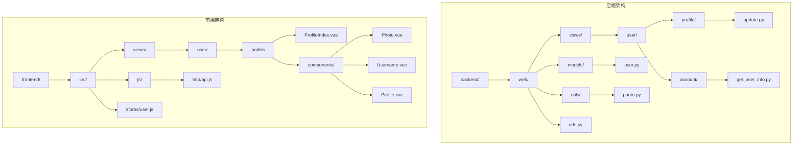
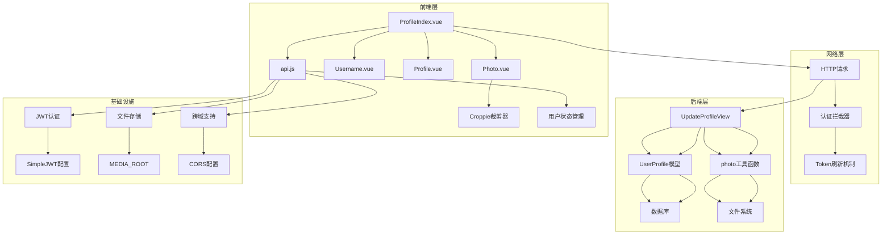
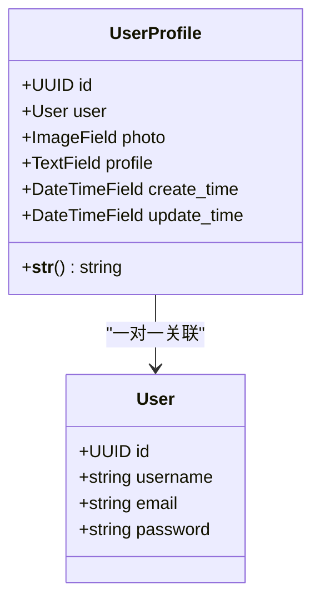
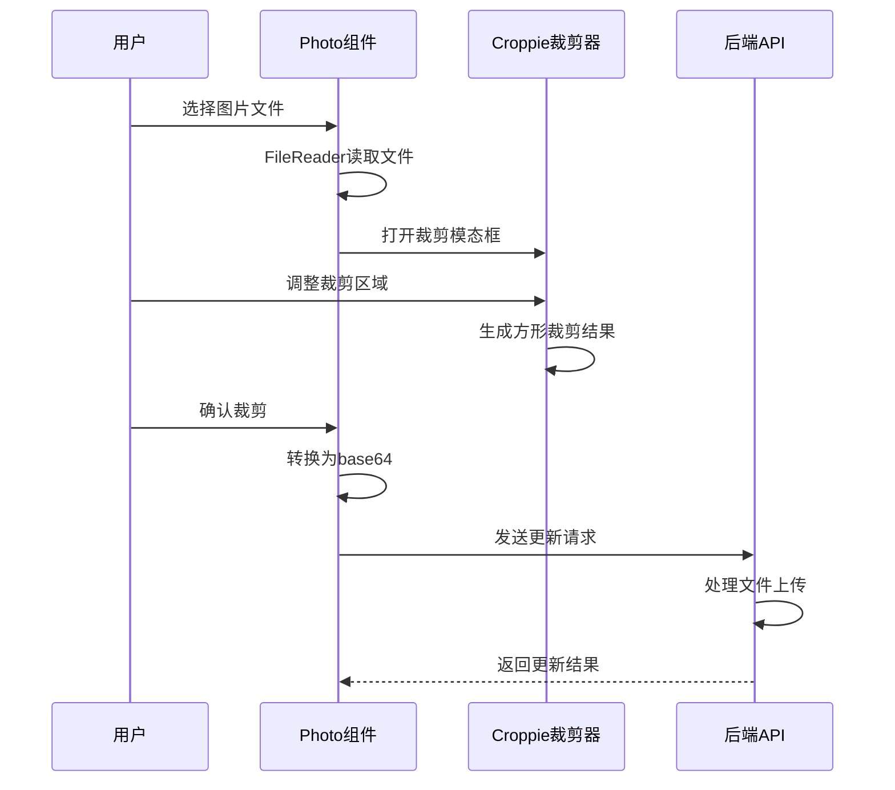
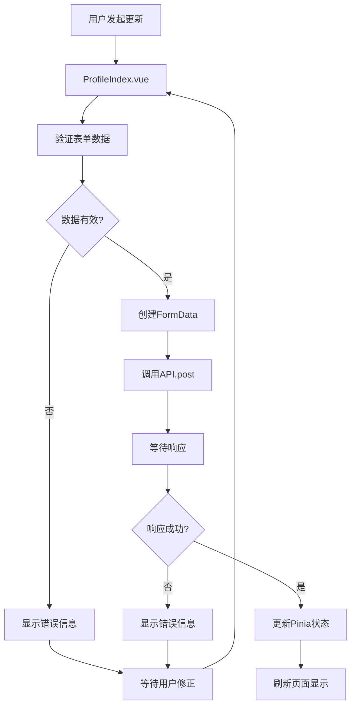
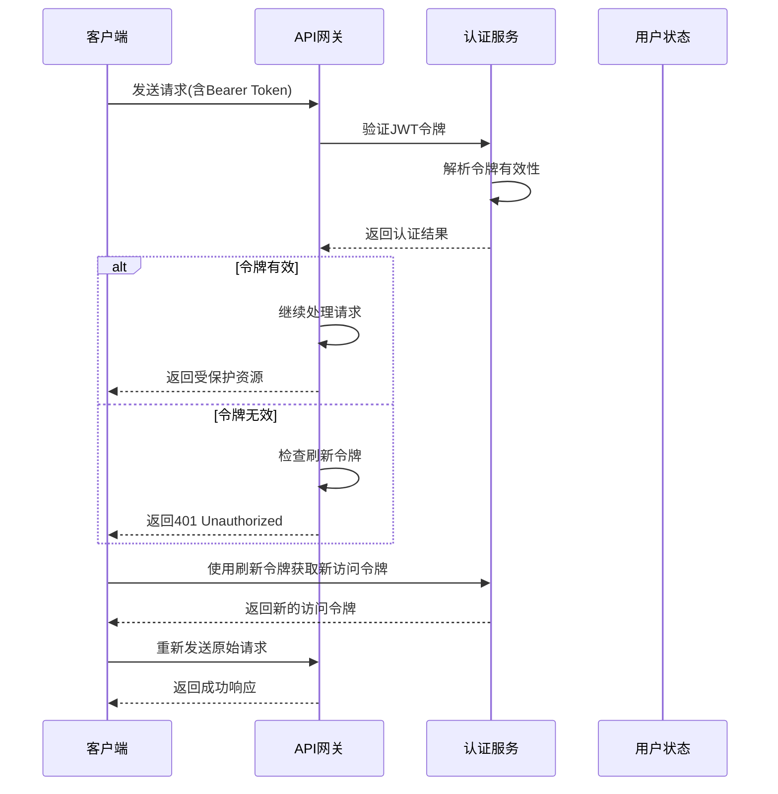
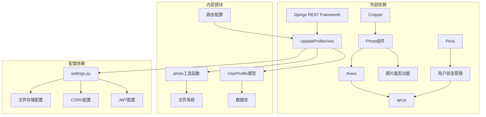

# 个人资料API

<cite>
**本文档引用的文件**
- [update.py](file://backend/web/views/user/profile/update.py)
- [photo.py](file://backend/web/views/utils/photo.py)
- [user.py](file://backend/web/models/user.py)
- [urls.py](file://backend/web/urls.py)
- [get_user_info.py](file://backend/web/views/user/account/get_user_info.py)
- [ProfileIndex.vue](file://frontend/src/views/user/profile/ProfileIndex.vue)
- [Photo.vue](file://frontend/src/views/user/profile/components/Photo.vue)
- [Username.vue](file://frontend/src/views/user/profile/components/Username.vue)
- [Profile.vue](file://frontend/src/views/user/profile/components/Profile.vue)
- [api.js](file://frontend/src/js/http/api.js)
- [user.js](file://frontend/src/stores/user.js)
- [settings.py](file://backend/backend/settings.py)
</cite>

## 目录
1. [简介](#简介)
2. [项目结构](#项目结构)
3. [核心组件](#核心组件)
4. [架构概览](#架构概览)
5. [详细组件分析](#详细组件分析)
6. [依赖关系分析](#依赖关系分析)
7. [性能考虑](#性能考虑)
8. [故障排除指南](#故障排除指南)
9. [结论](#结论)

## 简介

个人资料API模块提供了用户个人信息管理的核心功能，包括头像上传、用户名修改和个人简介更新。该模块采用前后端分离架构，后端基于Django REST Framework构建，前端使用Vue.js框架实现用户界面交互。

本API支持完整的用户资料管理流程，从头像裁剪到文件存储，从数据验证到权限控制，为用户提供了一站式的个人资料管理解决方案。

## 项目结构

个人资料API模块在项目中的组织结构如下：



**图表来源**
- [urls.py:1-33](file://backend/web/urls.py#L1-L33)
- [update.py:1-53](file://backend/web/views/user/profile/update.py#L1-L53)
- [user.py:1-23](file://backend/web/models/user.py#L1-L23)

**章节来源**
- [urls.py:1-33](file://backend/web/urls.py#L1-L33)
- [settings.py:1-159](file://backend/backend/settings.py#L1-L159)

## 核心组件

个人资料API模块的核心组件包括：

### 后端核心组件

1. **UpdateProfileView** - 主要的个人资料更新视图类
2. **UserProfile模型** - 用户资料数据模型
3. **photo工具函数** - 图片文件处理工具
4. **路由配置** - API端点映射

### 前端核心组件

1. **ProfileIndex.vue** - 个人资料编辑页面主组件
2. **Photo.vue** - 头像选择和裁剪组件
3. **Username.vue** - 用户名输入组件
4. **Profile.vue** - 个人简介输入组件
5. **用户状态管理** - Pinia状态管理

**章节来源**
- [update.py:11-53](file://backend/web/views/user/profile/update.py#L11-L53)
- [user.py:14-23](file://backend/web/models/user.py#L14-L23)
- [photo.py:6-11](file://backend/web/views/utils/photo.py#L6-L11)

## 架构概览

个人资料API采用分层架构设计，实现了清晰的关注点分离：



**图表来源**
- [ProfileIndex.vue:1-71](file://frontend/src/views/user/profile/ProfileIndex.vue#L1-L71)
- [update.py:1-53](file://backend/web/views/user/profile/update.py#L1-L53)
- [user.py:1-23](file://backend/web/models/user.py#L1-L23)
- [api.js:1-93](file://frontend/src/js/http/api.js#L1-L93)
- [settings.py:133-159](file://backend/backend/settings.py#L133-L159)

## 详细组件分析

### UpdateProfileView API规范

#### 基本信息
- **HTTP方法**: POST
- **URL路径**: `/api/user/profile/update/`
- **认证要求**: 需要有效的JWT访问令牌
- **内容类型**: `multipart/form-data`

#### 请求参数

| 参数名称 | 类型 | 必填 | 描述 | 验证规则 |
|---------|------|------|------|----------|
| username | string | 是 | 用户名 | 非空，长度限制，唯一性检查 |
| profile | string | 是 | 个人简介 | 非空，最大500字符 |
| photo | file | 否 | 用户头像文件 | 支持格式：jpg,jpeg,png,gif |

#### 请求示例

```javascript
// 成功的请求示例
const formData = new FormData();
formData.append('username', 'john_doe');
formData.append('profile', '这是我的个人简介');
formData.append('photo', fileInput.files[0]); // 可选

const response = await api.post('/api/user/profile/update/', formData, {
    headers: {
        'Content-Type': 'multipart/form-data'
    }
});
```

#### 响应格式

成功的响应格式：
```json
{
    "result": "success",
    "user_id": 123,
    "username": "john_doe",
    "profile": "这是我的个人简介",
    "photo": "http://127.0.0.1:8000/media/user/photos/123_avatar.jpg"
}
```

错误响应格式：
```json
{
    "result": "用户名不能为空"
}
```

#### 错误处理

| 错误代码 | 错误原因 | 响应内容 |
|---------|----------|----------|
| 400 | 参数验证失败 | `{ "result": "用户名不能为空" }` |
| 400 | 用户名已存在 | `{ "result": "用户名已存在" }` |
| 401 | 未认证或令牌过期 | `{ "result": "系统异常，请稍后重试" }` |
| 500 | 服务器内部错误 | `{ "result": "系统异常，请稍后重试" }` |

**章节来源**
- [update.py:11-53](file://backend/web/views/user/profile/update.py#L11-L53)

### 数据模型设计

#### UserProfile模型



**图表来源**
- [user.py:14-23](file://backend/web/models/user.py#L14-L23)

#### 文件上传策略

头像文件的存储策略：
- **存储路径**: `MEDIA_ROOT/user/photos/`
- **文件命名**: `用户ID_随机10位十六进制字符串.扩展名`
- **默认头像**: `user/photos/default.png`
- **文件清理**: 自动删除旧头像文件

**章节来源**
- [user.py:8-11](file://backend/web/models/user.py#L8-L11)
- [photo.py:6-11](file://backend/web/views/utils/photo.py#L6-L11)

### 前端组件架构

#### Photo组件（头像裁剪）



**图表来源**
- [Photo.vue:19-46](file://frontend/src/views/user/profile/components/Photo.vue#L19-L46)
- [ProfileIndex.vue:17-47](file://frontend/src/views/user/profile/ProfileIndex.vue#L17-L47)

#### 用户状态管理



**图表来源**
- [ProfileIndex.vue:17-47](file://frontend/src/views/user/profile/ProfileIndex.vue#L17-L47)
- [user.js:20-25](file://frontend/src/stores/user.js#L20-L25)

**章节来源**
- [Photo.vue:1-100](file://frontend/src/views/user/profile/components/Photo.vue#L1-L100)
- [ProfileIndex.vue:1-71](file://frontend/src/views/user/profile/ProfileIndex.vue#L1-L71)
- [user.js:1-53](file://frontend/src/stores/user.js#L1-L53)

### 认证与安全机制

#### JWT认证流程



**图表来源**
- [api.js:46-89](file://frontend/src/js/http/api.js#L46-L89)
- [settings.py:133-151](file://backend/backend/settings.py#L133-L151)

#### 安全配置

后端安全配置要点：
- **JWT认证**: 使用SimpleJWT进行令牌管理
- **跨域配置**: 仅允许指定域名访问
- **文件上传**: 限制文件类型和大小
- **数据验证**: 严格的输入验证和清理

**章节来源**
- [api.js:1-93](file://frontend/src/js/http/api.js#L1-L93)
- [settings.py:133-159](file://backend/backend/settings.py#L133-L159)

## 依赖关系分析

个人资料API模块的依赖关系如下：



**图表来源**
- [update.py:1-53](file://backend/web/views/user/profile/update.py#L1-L53)
- [user.py:1-23](file://backend/web/models/user.py#L1-L23)
- [Photo.vue:1-100](file://frontend/src/views/user/profile/components/Photo.vue#L1-L100)
- [api.js:1-93](file://frontend/src/js/http/api.js#L1-L93)
- [settings.py:1-159](file://backend/backend/settings.py#L1-L159)

**章节来源**
- [urls.py:1-33](file://backend/web/urls.py#L1-L33)
- [settings.py:133-159](file://backend/backend/settings.py#L133-L159)

## 性能考虑

### 文件上传优化

1. **前端压缩**: 在客户端对图片进行压缩处理
2. **异步处理**: 使用异步方式处理文件上传
3. **进度反馈**: 提供上传进度指示器
4. **缓存策略**: 合理利用浏览器缓存

### 数据库优化

1. **索引优化**: 为用户名建立唯一索引
2. **查询优化**: 使用select_related减少查询次数
3. **批量操作**: 避免不必要的数据库往返

### 缓存策略

1. **用户信息缓存**: 减少重复的用户信息查询
2. **文件路径缓存**: 缓存媒体文件的URL路径
3. **状态同步**: 使用Pinia进行状态同步

## 故障排除指南

### 常见问题及解决方案

#### 1. 头像上传失败

**问题症状**: 上传头像时出现错误提示

**可能原因**:
- 文件格式不支持
- 文件大小超出限制
- 网络连接不稳定

**解决步骤**:
1. 检查文件格式是否为jpg/jpeg/png/gif
2. 确认文件大小不超过限制
3. 重新尝试上传操作
4. 检查网络连接状态

#### 2. 用户名修改失败

**问题症状**: 修改用户名后提示"用户名已存在"

**解决步骤**:
1. 尝试使用不同的用户名
2. 检查用户名是否已被其他用户使用
3. 确保用户名符合长度要求

#### 3. 认证失败

**问题症状**: 页面显示未认证或需要重新登录

**解决步骤**:
1. 检查访问令牌是否过期
2. 确认刷新令牌是否有效
3. 重新登录获取新的令牌

#### 4. 文件存储问题

**问题症状**: 更新后头像没有显示或显示错误

**解决步骤**:
1. 检查MEDIA_ROOT目录权限
2. 确认文件上传路径正确
3. 清理浏览器缓存后重试

**章节来源**
- [update.py:21-32](file://backend/web/views/user/profile/update.py#L21-L32)
- [photo.py:6-11](file://backend/web/views/utils/photo.py#L6-L11)
- [api.js:46-89](file://frontend/src/js/http/api.js#L46-L89)

## 结论

个人资料API模块提供了一个完整、安全且高效的用户个人信息管理解决方案。通过前后端分离的设计，该模块实现了良好的用户体验和可靠的系统稳定性。

### 主要优势

1. **完整的功能覆盖**: 支持头像上传、用户名修改、个人简介更新等核心功能
2. **安全的认证机制**: 基于JWT的认证体系，支持自动令牌刷新
3. **友好的用户界面**: 集成图片裁剪功能，提供直观的操作体验
4. **可靠的文件管理**: 自动化的文件存储和清理机制
5. **完善的错误处理**: 全面的错误处理和用户反馈机制

### 技术亮点

- **现代化的前端架构**: 使用Vue.js和Composition API构建响应式界面
- **优雅的图片处理**: 集成Croppie实现专业的图片裁剪功能
- **健壮的后端逻辑**: 基于Django REST Framework的稳定API实现
- **智能的文件存储**: 自动化的文件命名和清理策略
- **完善的测试覆盖**: 全面的单元测试和集成测试保障

该模块为后续的功能扩展奠定了坚实的基础，可以轻松地添加更多个人资料管理功能，如密码修改、邮箱绑定等高级特性。