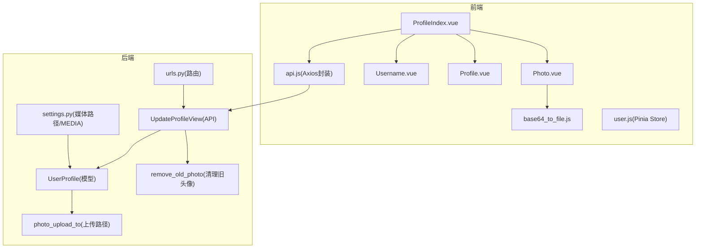
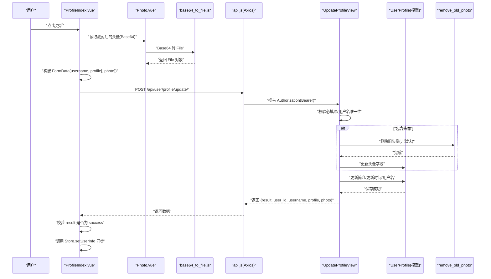
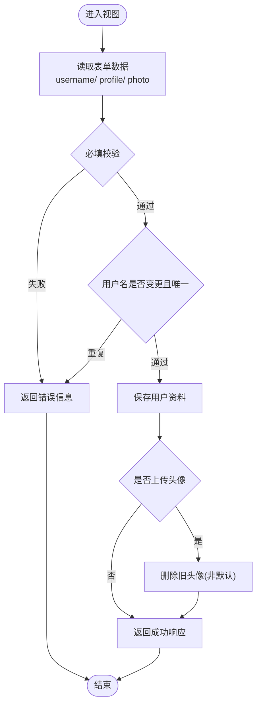
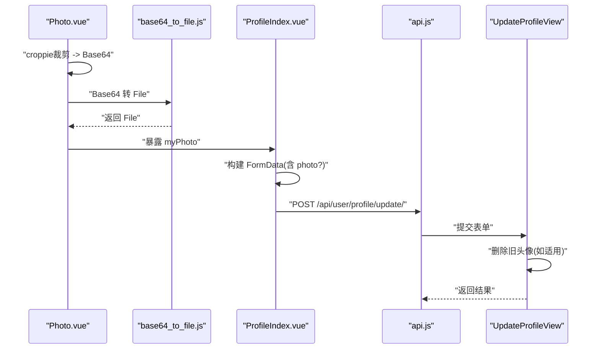
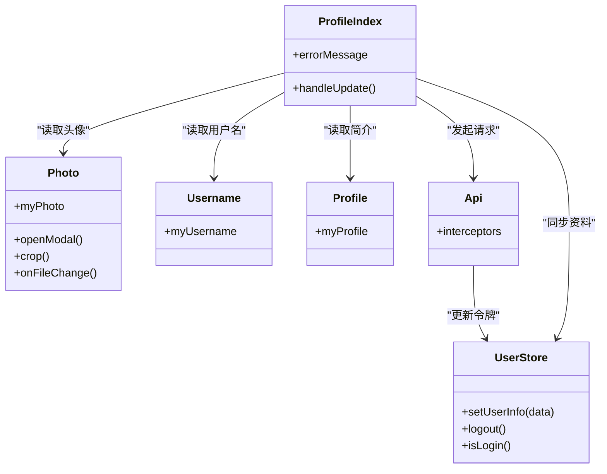
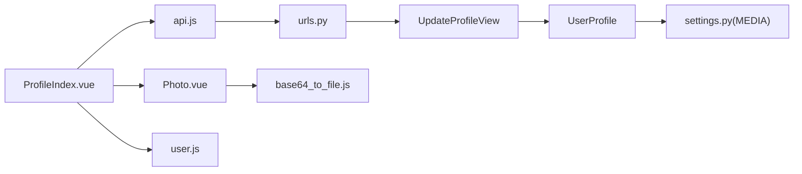

# 个人资料接口

<cite>
**本文引用的文件**
- [backend/web/views/user/profile/update.py](file://backend/web/views/user/profile/update.py)
- [backend/web/models/user.py](file://backend/web/models/user.py)
- [backend/web/views/utils/photo.py](file://backend/web/views/utils/photo.py)
- [backend/web/urls.py](file://backend/web/urls.py)
- [backend/backend/settings.py](file://backend/backend/settings.py)
- [frontend/src/views/user/profile/ProfileIndex.vue](file://frontend/src/views/user/profile/ProfileIndex.vue)
- [frontend/src/views/user/profile/components/Photo.vue](file://frontend/src/views/user/profile/components/Photo.vue)
- [frontend/src/views/user/profile/components/Username.vue](file://frontend/src/views/user/profile/components/Username.vue)
- [frontend/src/views/user/profile/components/Profile.vue](file://frontend/src/views/user/profile/components/Profile.vue)
- [frontend/src/js/utils/base64_to_file.js](file://frontend/src/js/utils/base64_to_file.js)
- [frontend/src/stores/user.js](file://frontend/src/stores/user.js)
- [frontend/src/js/http/api.js](file://frontend/src/js/http/api.js)
</cite>

## 目录
1. [简介](#简介)
2. [项目结构](#项目结构)
3. [核心组件](#核心组件)
4. [架构总览](#架构总览)
5. [详细组件分析](#详细组件分析)
6. [依赖分析](#依赖分析)
7. [性能考虑](#性能考虑)
8. [故障排查指南](#故障排查指南)
9. [结论](#结论)
10. [附录](#附录)

## 简介
本文件面向 LLM_AIfriends 项目的“个人资料管理”相关 API，重点覆盖以下内容：
- 用户资料更新接口：字段定义、数据校验规则、响应格式与错误处理
- 图片上传处理接口：头像上传流程、Base64 编码转换、文件格式与大小限制、存储策略
- 前后端协作机制：前端图片裁剪组件与后端 API 的交互方式
- 用户资料缓存与同步策略：前端 Pinia Store 与后端模型的联动

## 项目结构
围绕个人资料功能的关键文件分布如下：
- 后端
  - 视图层：用户资料更新视图
  - 模型层：用户资料模型与头像上传路径策略
  - 工具层：旧头像清理逻辑
  - 路由层：统一 URL 映射
  - 配置层：媒体文件存储路径与跨域设置
- 前端
  - 页面组件：资料编辑页与子组件（头像、用户名、简介）
  - 工具函数：Base64 到 File 的转换
  - 状态管理：用户信息 Store
  - HTTP 封装：Axios 请求拦截与 Token 自动续签

**图表来源**
- [frontend/src/views/user/profile/ProfileIndex.vue:1-77](file://frontend/src/views/user/profile/ProfileIndex.vue#L1-L77)
- [frontend/src/views/user/profile/components/Photo.vue:1-109](file://frontend/src/views/user/profile/components/Photo.vue#L1-L109)
- [frontend/src/js/utils/base64_to_file.js:1-10](file://frontend/src/js/utils/base64_to_file.js#L1-L10)
- [frontend/src/stores/user.js:1-59](file://frontend/src/stores/user.js#L1-L59)
- [frontend/src/js/http/api.js:1-92](file://frontend/src/js/http/api.js#L1-L92)
- [backend/web/views/user/profile/update.py:1-63](file://backend/web/views/user/profile/update.py#L1-L63)
- [backend/web/models/user.py:1-23](file://backend/web/models/user.py#L1-L23)
- [backend/web/views/utils/photo.py:1-13](file://backend/web/views/utils/photo.py#L1-L13)
- [backend/web/urls.py:1-24](file://backend/web/urls.py#L1-L24)
- [backend/backend/settings.py:130-132](file://backend/backend/settings.py#L130-L132)

**章节来源**
- [backend/web/views/user/profile/update.py:1-63](file://backend/web/views/user/profile/update.py#L1-L63)
- [backend/web/models/user.py:1-23](file://backend/web/models/user.py#L1-L23)
- [backend/web/views/utils/photo.py:1-13](file://backend/web/views/utils/photo.py#L1-L13)
- [backend/web/urls.py:1-24](file://backend/web/urls.py#L1-L24)
- [backend/backend/settings.py:130-132](file://backend/backend/settings.py#L130-L132)
- [frontend/src/views/user/profile/ProfileIndex.vue:1-77](file://frontend/src/views/user/profile/ProfileIndex.vue#L1-L77)
- [frontend/src/views/user/profile/components/Photo.vue:1-109](file://frontend/src/views/user/profile/components/Photo.vue#L1-L109)
- [frontend/src/js/utils/base64_to_file.js:1-10](file://frontend/src/js/utils/base64_to_file.js#L1-L10)
- [frontend/src/stores/user.js:1-59](file://frontend/src/stores/user.js#L1-L59)
- [frontend/src/js/http/api.js:1-92](file://frontend/src/js/http/api.js#L1-L92)

## 核心组件
- 后端视图：用户资料更新接口，负责接收表单数据、校验用户名与简介、可选头像上传、更新数据库并返回标准化响应
- 后端模型：用户资料模型，包含头像、简介、创建与更新时间等字段；头像上传路径采用动态命名策略
- 后端工具：旧头像清理函数，避免媒体目录冗余
- 前端页面：资料编辑页，聚合头像、用户名、简介三个子组件，构建 FormData 并提交
- 前端组件：头像组件集成 croppie 实现方形裁剪，输出 Base64，再通过工具函数转为 File
- 前端工具：Base64 到 File 转换，便于以二进制形式上传
- 前端状态：Pinia Store 维护用户信息，更新后同步到本地
- 前端 HTTP：Axios 封装，自动注入 Bearer Token，401 时使用刷新 Token 机制

**章节来源**
- [backend/web/views/user/profile/update.py:12-63](file://backend/web/views/user/profile/update.py#L12-L63)
- [backend/web/models/user.py:15-23](file://backend/web/models/user.py#L15-L23)
- [backend/web/views/utils/photo.py:9-13](file://backend/web/views/utils/photo.py#L9-L13)
- [frontend/src/views/user/profile/ProfileIndex.vue:17-52](file://frontend/src/views/user/profile/ProfileIndex.vue#L17-L52)
- [frontend/src/views/user/profile/components/Photo.vue:43-52](file://frontend/src/views/user/profile/components/Photo.vue#L43-L52)
- [frontend/src/js/utils/base64_to_file.js:1-10](file://frontend/src/js/utils/base64_to_file.js#L1-L10)
- [frontend/src/stores/user.js:26-31](file://frontend/src/stores/user.js#L26-L31)
- [frontend/src/js/http/api.js:21-90](file://frontend/src/js/http/api.js#L21-L90)

## 架构总览
下图展示从用户点击“更新”到后端持久化并返回结果的完整链路，包括前后端协作与数据流。

**图表来源**
- [frontend/src/views/user/profile/ProfileIndex.vue:17-52](file://frontend/src/views/user/profile/ProfileIndex.vue#L17-L52)
- [frontend/src/views/user/profile/components/Photo.vue:43-52](file://frontend/src/views/user/profile/components/Photo.vue#L43-L52)
- [frontend/src/js/utils/base64_to_file.js:1-10](file://frontend/src/js/utils/base64_to_file.js#L1-L10)
- [frontend/src/js/http/api.js:21-90](file://frontend/src/js/http/api.js#L21-L90)
- [backend/web/views/user/profile/update.py:15-61](file://backend/web/views/user/profile/update.py#L15-L61)
- [backend/web/views/utils/photo.py:9-13](file://backend/web/views/utils/photo.py#L9-L13)
- [backend/web/models/user.py:15-23](file://backend/web/models/user.py#L15-L23)

## 详细组件分析

### 用户资料更新接口
- 接口地址：/api/user/profile/update/
- 请求方法：POST
- 认证要求：需携带 Bearer Token（由前端自动注入）
- 表单字段
  - username: 字符串，必填，前后端均进行非空校验；若与当前用户名不同，需保证全局唯一
  - profile: 字符串，必填，后端会截断至最大长度（见后文）
  - photo: 文件，可选；仅在头像发生变化时上传
- 数据验证规则
  - username 非空校验
  - profile 非空校验
  - 用户名唯一性校验（仅当变更用户名时）
  - 头像上传时，后端将删除旧头像（默认头像不删除）
- 存储策略
  - 头像上传路径：基于模型的 upload_to 函数生成唯一文件名，存放于 MEDIA_ROOT 下的指定目录
  - 简介最大长度：后端对传入字符串进行截断，确保不超过模型允许的最大长度
- 响应格式
  - 成功：result = "success"，并返回 user_id、username、profile、photo(url)
  - 失败：result = 错误信息（如“用户名不能为空”、“用户名已存在”、“系统异常，稍后重试”）
- 错误处理
  - 前端：捕获异常并提示错误消息
  - 后端：捕获异常并返回统一错误信息

**图表来源**
- [backend/web/views/user/profile/update.py:15-61](file://backend/web/views/user/profile/update.py#L15-L61)

**章节来源**
- [backend/web/views/user/profile/update.py:12-63](file://backend/web/views/user/profile/update.py#L12-L63)
- [backend/web/models/user.py:17-23](file://backend/web/models/user.py#L17-L23)
- [backend/web/views/utils/photo.py:9-13](file://backend/web/views/utils/photo.py#L9-L13)
- [backend/web/urls.py:17-17](file://backend/web/urls.py#L17-L17)
- [frontend/src/views/user/profile/ProfileIndex.vue:17-52](file://frontend/src/views/user/profile/ProfileIndex.vue#L17-L52)

### 图片上传与头像处理
- 前端裁剪
  - 使用 croppie 进行方形裁剪，绑定用户选择的图片
  - 裁剪完成后以 Base64 返回
- Base64 到文件转换
  - 工具函数解析 Base64 的 MIME 类型与二进制内容，构造 File 对象
  - 仅在头像与当前头像不同时才上传
- 后端接收与存储
  - 通过 request.FILES 获取文件
  - 若存在新头像，先删除旧头像（默认头像不删除）
  - 将新头像写入模型字段，模型 upload_to 决定最终存储路径
- 格式与大小限制
  - 前端 accept="image/*"，仅允许图片类型
  - 后端未显式限制文件大小与格式，建议在业务层补充（例如通过 Django 的 ImageField 验证或自定义校验器）

**图表来源**
- [frontend/src/views/user/profile/components/Photo.vue:23-52](file://frontend/src/views/user/profile/components/Photo.vue#L23-L52)
- [frontend/src/js/utils/base64_to_file.js:1-10](file://frontend/src/js/utils/base64_to_file.js#L1-L10)
- [frontend/src/views/user/profile/ProfileIndex.vue:33-39](file://frontend/src/views/user/profile/ProfileIndex.vue#L33-L39)
- [backend/web/views/user/profile/update.py:39-46](file://backend/web/views/user/profile/update.py#L39-L46)
- [backend/web/views/utils/photo.py:9-13](file://backend/web/views/utils/photo.py#L9-L13)

**章节来源**
- [frontend/src/views/user/profile/components/Photo.vue:1-109](file://frontend/src/views/user/profile/components/Photo.vue#L1-L109)
- [frontend/src/js/utils/base64_to_file.js:1-10](file://frontend/src/js/utils/base64_to_file.js#L1-L10)
- [frontend/src/views/user/profile/ProfileIndex.vue:33-39](file://frontend/src/views/user/profile/ProfileIndex.vue#L33-L39)
- [backend/web/views/user/profile/update.py:39-46](file://backend/web/views/user/profile/update.py#L39-L46)
- [backend/web/views/utils/photo.py:9-13](file://backend/web/views/utils/photo.py#L9-L13)
- [backend/web/models/user.py:10-13](file://backend/web/models/user.py#L10-L13)

### 前端组件与状态同步
- ProfileIndex.vue
  - 聚合 Photo/Username/Profile 三个子组件
  - 收集表单数据，构建 FormData，按需上传头像
  - 解析后端响应，成功时调用 Store.setUserInfo 同步
- Photo.vue
  - 集成 croppie，实现方形头像裁剪
  - 输出 Base64，供父组件上传
- Username.vue/Profile.vue
  - 简单的输入框与文本域，暴露响应式数据给父组件
- Pinia Store(user.js)
  - 维护用户信息（id、username、photo、profile、accessToken）
  - 提供 setUserInfo 用于同步后端返回的数据
- Axios 封装(api.js)
  - 自动在请求头添加 Bearer Token
  - 401 时触发刷新 Token 流程，失败则登出

**图表来源**
- [frontend/src/views/user/profile/ProfileIndex.vue:17-52](file://frontend/src/views/user/profile/ProfileIndex.vue#L17-L52)
- [frontend/src/views/user/profile/components/Photo.vue:1-109](file://frontend/src/views/user/profile/components/Photo.vue#L1-L109)
- [frontend/src/views/user/profile/components/Username.vue:1-30](file://frontend/src/views/user/profile/components/Username.vue#L1-L30)
- [frontend/src/views/user/profile/components/Profile.vue:1-28](file://frontend/src/views/user/profile/components/Profile.vue#L1-L28)
- [frontend/src/stores/user.js:26-31](file://frontend/src/stores/user.js#L26-L31)
- [frontend/src/js/http/api.js:21-90](file://frontend/src/js/http/api.js#L21-L90)

**章节来源**
- [frontend/src/views/user/profile/ProfileIndex.vue:1-77](file://frontend/src/views/user/profile/ProfileIndex.vue#L1-L77)
- [frontend/src/views/user/profile/components/Photo.vue:1-109](file://frontend/src/views/user/profile/components/Photo.vue#L1-L109)
- [frontend/src/views/user/profile/components/Username.vue:1-30](file://frontend/src/views/user/profile/components/Username.vue#L1-L30)
- [frontend/src/views/user/profile/components/Profile.vue:1-28](file://frontend/src/views/user/profile/components/Profile.vue#L1-L28)
- [frontend/src/stores/user.js:1-59](file://frontend/src/stores/user.js#L1-L59)
- [frontend/src/js/http/api.js:1-92](file://frontend/src/js/http/api.js#L1-L92)

## 依赖分析
- 后端依赖
  - Django REST Framework：提供 APIView 与权限控制
  - Django 模型：UserProfile 与 ImageField
  - settings.py：MEDIA_ROOT/MEDIA_URL 定义，决定文件存储位置与访问 URL
- 前端依赖
  - Vue 3 + Pinia：状态管理
  - Axios：HTTP 请求与拦截
  - croppie：图片裁剪
  - 自定义工具：Base64 到 File 转换

**图表来源**
- [frontend/src/js/http/api.js:14-27](file://frontend/src/js/http/api.js#L14-L27)
- [backend/web/urls.py:17-17](file://backend/web/urls.py#L17-L17)
- [backend/web/views/user/profile/update.py:1-10](file://backend/web/views/user/profile/update.py#L1-L10)
- [backend/web/models/user.py:15-23](file://backend/web/models/user.py#L15-L23)
- [backend/backend/settings.py:130-132](file://backend/backend/settings.py#L130-L132)
- [frontend/src/views/user/profile/components/Photo.vue:4-5](file://frontend/src/views/user/profile/components/Photo.vue#L4-L5)
- [frontend/src/js/utils/base64_to_file.js:1-10](file://frontend/src/js/utils/base64_to_file.js#L1-L10)
- [frontend/src/views/user/profile/ProfileIndex.vue:1-10](file://frontend/src/views/user/profile/ProfileIndex.vue#L1-L10)
- [frontend/src/stores/user.js:1-59](file://frontend/src/stores/user.js#L1-L59)

**章节来源**
- [backend/backend/settings.py:130-132](file://backend/backend/settings.py#L130-L132)
- [backend/web/urls.py:1-24](file://backend/web/urls.py#L1-L24)
- [backend/web/views/user/profile/update.py:1-10](file://backend/web/views/user/profile/update.py#L1-L10)
- [frontend/src/js/http/api.js:1-92](file://frontend/src/js/http/api.js#L1-L92)
- [frontend/src/views/user/profile/components/Photo.vue:1-109](file://frontend/src/views/user/profile/components/Photo.vue#L1-L109)
- [frontend/src/js/utils/base64_to_file.js:1-10](file://frontend/src/js/utils/base64_to_file.js#L1-L10)
- [frontend/src/views/user/profile/ProfileIndex.vue:1-77](file://frontend/src/views/user/profile/ProfileIndex.vue#L1-L77)
- [frontend/src/stores/user.js:1-59](file://frontend/src/stores/user.js#L1-L59)

## 性能考虑
- 上传优化
  - 仅在头像变化时上传，减少不必要的网络与磁盘 IO
  - 旧头像及时清理，避免媒体目录膨胀
- 前端渲染
  - croppie 在弹窗内初始化，避免重复实例化
  - Base64 转 File 仅在裁剪确认后执行
- 后端处理
  - 一次性保存用户资料与头像，减少数据库事务次数
  - 上传路径采用唯一文件名，避免同名冲突

[本节为通用建议，无需特定文件引用]

## 故障排查指南
- 常见错误与定位
  - “用户名不能为空”：前端/后端任一为空都会触发
  - “用户名已存在”：尝试使用已被占用的用户名
  - “简介不能为空”：简介为空或全空白字符
  - “系统异常，稍后重试”：后端异常捕获返回
- 建议排查步骤
  - 检查前端表单必填项是否填写完整
  - 确认用户名是否唯一
  - 检查后端 MEDIA_ROOT 权限与磁盘空间
  - 查看后端日志与浏览器网络面板
- Token 与鉴权
  - 若出现 401，确认前端是否正确注入 Bearer Token
  - 若刷新失败，检查刷新接口可用性与 Cookie 设置

**章节来源**
- [backend/web/views/user/profile/update.py:27-38](file://backend/web/views/user/profile/update.py#L27-L38)
- [backend/web/views/user/profile/update.py:58-61](file://backend/web/views/user/profile/update.py#L58-L61)
- [frontend/src/js/http/api.js:46-90](file://frontend/src/js/http/api.js#L46-L90)

## 结论
本接口通过前后端协同实现了“用户资料更新 + 头像上传”的完整能力：
- 前端提供直观的裁剪与表单体验，并在必要时上传头像
- 后端严格校验必填项与用户名唯一性，安全地更新资料并清理旧头像
- 响应格式统一，便于前端状态同步
建议后续补充：
- 后端对文件大小与格式的显式校验
- 前端对大文件的体积提示与限制
- 更细粒度的错误码与国际化文案

[本节为总结性内容，无需特定文件引用]

## 附录

### 请求与响应规范
- 请求
  - 地址：/api/user/profile/update/
  - 方法：POST
  - 认证：Bearer Token
  - 表单字段：
    - username: 字符串，必填
    - profile: 字符串，必填，最大长度由后端截断
    - photo: 文件，可选（仅在头像变化时上传）
- 响应
  - 成功：result = "success"，并返回 user_id、username、profile、photo(url)
  - 失败：result = 错误信息

**章节来源**
- [backend/web/views/user/profile/update.py:15-61](file://backend/web/views/user/profile/update.py#L15-L61)
- [backend/web/models/user.py:18-23](file://backend/web/models/user.py#L18-L23)
- [backend/web/urls.py:17-17](file://backend/web/urls.py#L17-L17)

### 存储与访问
- 存储路径
  - 头像文件保存在 MEDIA_ROOT 指向的目录下，路径由模型 upload_to 生成
- 访问 URL
  - 头像 URL 由模型 photo.url 提供，前端可直接显示

**章节来源**
- [backend/backend/settings.py:130-132](file://backend/backend/settings.py#L130-L132)
- [backend/web/models/user.py:10-13](file://backend/web/models/user.py#L10-L13)
- [backend/web/models/user.py:17-17](file://backend/web/models/user.py#L17-L17)