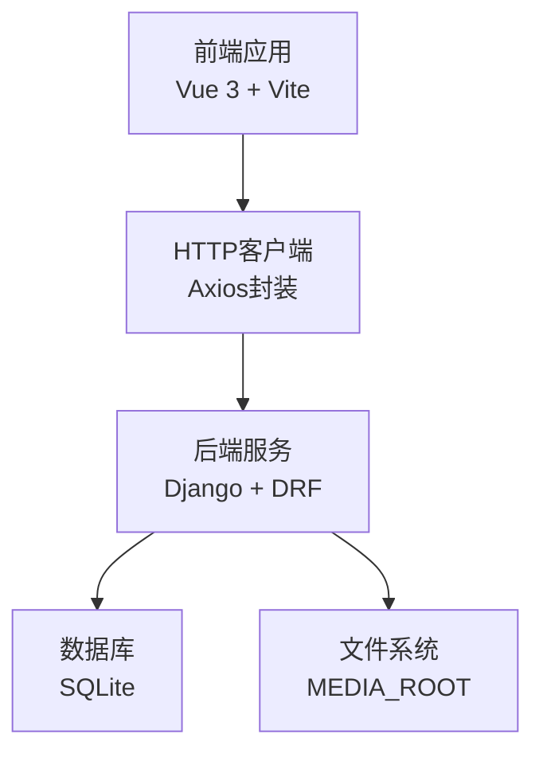
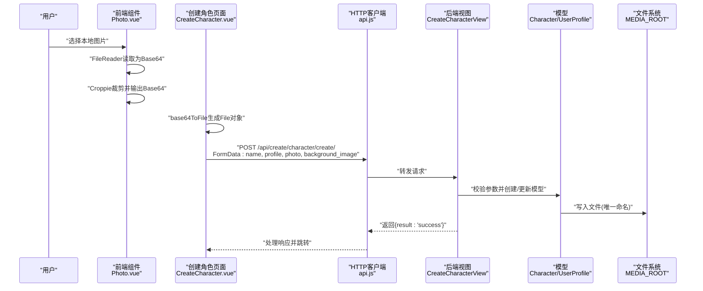
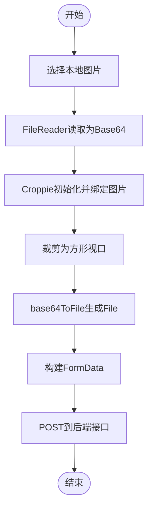
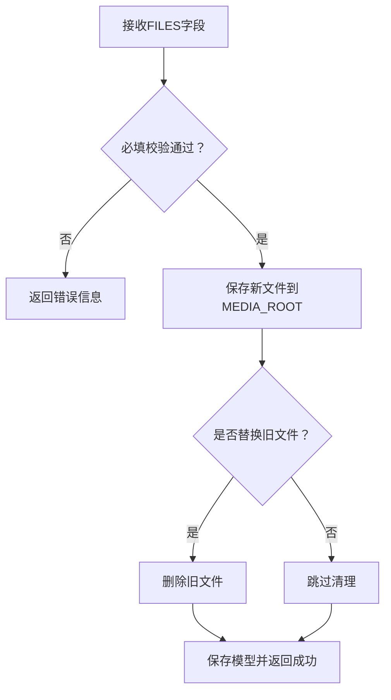
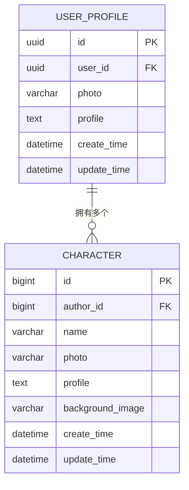
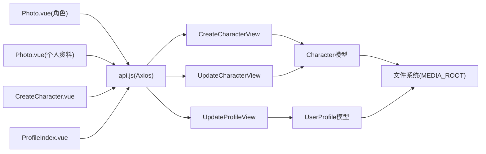

# 文件上传API

<cite>
**本文引用的文件**
- [backend/web/views/utils/photo.py](file://backend/web/views/utils/photo.py)
- [backend/web/models/character.py](file://backend/web/models/character.py)
- [backend/web/models/user.py](file://backend/web/models/user.py)
- [backend/web/views/create/character/create.py](file://backend/web/views/create/character/create.py)
- [backend/web/views/create/character/update.py](file://backend/web/views/create/character/update.py)
- [backend/web/views/user/profile/update.py](file://backend/web/views/user/profile/update.py)
- [backend/backend/settings.py](file://backend/backend/settings.py)
- [backend/web/urls.py](file://backend/web/urls.py)
- [frontend/src/views/create/character/components/Photo.vue](file://frontend/src/views/create/character/components/Photo.vue)
- [frontend/src/views/user/profile/components/Photo.vue](file://frontend/src/views/user/profile/components/Photo.vue)
- [frontend/src/views/create/character/CreateCharacter.vue](file://frontend/src/views/create/character/CreateCharacter.vue)
- [frontend/src/views/user/profile/ProfileIndex.vue](file://frontend/src/views/user/profile/ProfileIndex.vue)
- [frontend/src/js/utils/base64_to_file.js](file://frontend/src/js/utils/base64_to_file.js)
- [frontend/src/js/http/api.js](file://frontend/src/js/http/api.js)
</cite>

## 目录
1. [简介](#简介)
2. [项目结构](#项目结构)
3. [核心组件](#核心组件)
4. [架构总览](#架构总览)
5. [详细组件分析](#详细组件分析)
6. [依赖分析](#依赖分析)
7. [性能考虑](#性能考虑)
8. [故障排查指南](#故障排查指南)
9. [结论](#结论)
10. [附录](#附录)

## 简介
本文件上传API文档聚焦于图片上传与裁剪流程，覆盖前端Croppie图片裁剪组件的集成、前端Base64到文件的转换、后端Django模型与视图的处理逻辑、文件存储策略以及安全与清理机制。文档同时给出HTTP接口定义、请求格式、错误处理与性能优化建议，并提供端到端上传流程示例。

## 项目结构
该仓库采用前后端分离架构：
- 前端基于Vue 3 + Vite，通过Axios封装统一HTTP客户端，负责用户界面、图片裁剪与表单提交。
- 后端基于Django + Django REST Framework，提供REST接口，使用SQLite数据库与本地文件系统进行媒体资源存储。

**章节来源**
- [backend/backend/settings.py:129-131](file://backend/backend/settings.py#L129-L131)
- [backend/web/urls.py:17-33](file://backend/web/urls.py#L17-L33)

## 核心组件
- 前端图片裁剪组件
  - 角色创建页与个人资料页均使用Croppie组件，支持方形裁剪视口、边界约束与方向调整。
  - 组件通过FileReader读取本地图片，弹窗展示Croppie实例，最终以Base64形式暴露裁剪结果。
- 前端表单提交
  - 创建角色与更新个人资料页面将裁剪后的Base64转换为Blob File，组装FormData并通过Axios发送至后端。
- 后端模型与视图
  - 模型层定义上传路径规则，确保文件名唯一且按用户/角色维度组织目录。
  - 视图层接收FILES字段，执行校验、旧图清理与保存，返回统一响应。
- 存储与清理
  - MEDIA_ROOT用于存放上传文件；提供旧文件删除工具函数，避免磁盘冗余。

**章节来源**
- [frontend/src/views/create/character/components/Photo.vue:19-45](file://frontend/src/views/create/character/components/Photo.vue#L19-L45)
- [frontend/src/views/user/profile/components/Photo.vue:19-46](file://frontend/src/views/user/profile/components/Photo.vue#L19-L46)
- [frontend/src/js/utils/base64_to_file.js:1-10](file://frontend/src/js/utils/base64_to_file.js#L1-L10)
- [backend/web/models/character.py:9-18](file://backend/web/models/character.py#L9-L18)
- [backend/web/models/user.py:8-11](file://backend/web/models/user.py#L8-L11)
- [backend/web/views/utils/photo.py:6-11](file://backend/web/views/utils/photo.py#L6-L11)

## 架构总览
下图展示了从用户选择图片到后端保存文件的端到端流程。

**图表来源**
- [frontend/src/views/create/character/components/Photo.vue:47-59](file://frontend/src/views/create/character/components/Photo.vue#L47-L59)
- [frontend/src/views/create/character/CreateCharacter.vue:37-59](file://frontend/src/views/create/character/CreateCharacter.vue#L37-L59)
- [frontend/src/js/utils/base64_to_file.js:1-10](file://frontend/src/js/utils/base64_to_file.js#L1-L10)
- [backend/web/views/create/character/create.py:11-47](file://backend/web/views/create/character/create.py#L11-L47)
- [backend/web/models/character.py:21-32](file://backend/web/models/character.py#L21-L32)
- [backend/backend/settings.py:129-131](file://backend/backend/settings.py#L129-L131)

## 详细组件分析

### 接口定义与请求规范
- 角色创建接口
  - 方法: POST
  - 路径: /api/create/character/create/
  - 认证: 需要已登录（DRF JWT）
  - 请求体: multipart/form-data
    - 字段: name(string), profile(string), photo(file), background_image(file)
  - 响应: JSON
    - 成功: {"result":"success"}
    - 失败: {"result":"错误信息"}
- 角色更新接口
  - 方法: POST
  - 路径: /api/create/character/update/
  - 请求体: multipart/form-data
    - 字段: character_id(int), name(string), profile(string), photo(file可选), background_image(file可选)
  - 响应: JSON
    - 成功: {"result":"success"}
    - 失败: {"result":"系统异常，请稍后重试"}
- 个人资料更新接口
  - 方法: POST
  - 路径: /api/user/profile/update/
  - 请求体: multipart/form-data
    - 字段: username(string), profile(string), photo(file可选)
  - 响应: JSON
    - 成功: {"result":"success", "user_id":..., "username":..., "profile":..., "photo":...}
    - 失败: {"result":"系统异常，请稍后重试"}

注意
- 本项目未直接提供“获取媒体文件URL”的接口，但后端模型的ImageField.url可用于拼接访问地址。
- 上传字段均为FILES类型，前端需使用FormData提交。

**章节来源**
- [backend/web/urls.py:25-29](file://backend/web/urls.py#L25-L29)
- [backend/web/views/create/character/create.py:11-47](file://backend/web/views/create/character/create.py#L11-L47)
- [backend/web/views/create/character/update.py:12-45](file://backend/web/views/create/character/update.py#L12-L45)
- [backend/web/views/user/profile/update.py:12-52](file://backend/web/views/user/profile/update.py#L12-L52)

### 前端图片裁剪与上传流程
- 图片裁剪组件
  - 支持方形裁剪视口与边界约束，绑定本地Base64或图片URL，输出固定尺寸裁剪结果。
  - 组件暴露myPhoto引用，供父组件读取裁剪后的Base64。
- Base64到文件转换
  - 将裁剪得到的Base64字符串转换为File对象，便于加入FormData。
- 表单提交
  - 创建角色页面：收集名称、简介与两张图片（头像与背景），转换后提交。
  - 个人资料页面：可选更新头像，其余字段必填，提交时仅在头像变更时附带photo字段。

**图表来源**
- [frontend/src/views/create/character/components/Photo.vue:19-45](file://frontend/src/views/create/character/components/Photo.vue#L19-L45)
- [frontend/src/views/user/profile/components/Photo.vue:19-46](file://frontend/src/views/user/profile/components/Photo.vue#L19-L46)
- [frontend/src/js/utils/base64_to_file.js:1-10](file://frontend/src/js/utils/base64_to_file.js#L1-L10)
- [frontend/src/views/create/character/CreateCharacter.vue:37-59](file://frontend/src/views/create/character/CreateCharacter.vue#L37-L59)
- [frontend/src/views/user/profile/ProfileIndex.vue:29-46](file://frontend/src/views/user/profile/ProfileIndex.vue#L29-L46)

**章节来源**
- [frontend/src/views/create/character/components/Photo.vue:19-65](file://frontend/src/views/create/character/components/Photo.vue#L19-L65)
- [frontend/src/views/user/profile/components/Photo.vue:19-67](file://frontend/src/views/user/profile/components/Photo.vue#L19-L67)
- [frontend/src/js/utils/base64_to_file.js:1-10](file://frontend/src/js/utils/base64_to_file.js#L1-L10)
- [frontend/src/views/create/character/CreateCharacter.vue:21-59](file://frontend/src/views/create/character/CreateCharacter.vue#L21-L59)
- [frontend/src/views/user/profile/ProfileIndex.vue:17-47](file://frontend/src/views/user/profile/ProfileIndex.vue#L17-L47)

### 后端文件处理与存储策略
- 模型上传路径
  - 用户头像：user/photos/{user_id}_随机短串.ext
  - 角色头像：character/photos/{author_user_id}_随机短串.ext
  - 背景图：character/background_images/{author_user_id}_随机短串.ext
- 旧文件清理
  - 更新操作时，若新文件存在，会删除旧文件，防止磁盘累积。
- 视图处理
  - 创建：校验必填项，拒绝空文件；保存后返回成功。
  - 更新：可选更新头像/背景；保存后返回成功。
  - 统一异常兜底：捕获异常并返回系统异常提示。

**图表来源**
- [backend/web/models/user.py:8-11](file://backend/web/models/user.py#L8-L11)
- [backend/web/models/character.py:9-18](file://backend/web/models/character.py#L9-L18)
- [backend/web/views/utils/photo.py:6-11](file://backend/web/views/utils/photo.py#L6-L11)
- [backend/web/views/create/character/create.py:11-47](file://backend/web/views/create/character/create.py#L11-L47)
- [backend/web/views/create/character/update.py:12-45](file://backend/web/views/create/character/update.py#L12-L45)
- [backend/web/views/user/profile/update.py:12-52](file://backend/web/views/user/profile/update.py#L12-L52)

**章节来源**
- [backend/web/models/user.py:8-11](file://backend/web/models/user.py#L8-L11)
- [backend/web/models/character.py:9-18](file://backend/web/models/character.py#L9-L18)
- [backend/web/views/utils/photo.py:6-11](file://backend/web/views/utils/photo.py#L6-L11)
- [backend/web/views/create/character/create.py:11-47](file://backend/web/views/create/character/create.py#L11-L47)
- [backend/web/views/create/character/update.py:12-45](file://backend/web/views/create/character/update.py#L12-L45)
- [backend/web/views/user/profile/update.py:12-52](file://backend/web/views/user/profile/update.py#L12-L52)

### 数据模型与文件路径

**图表来源**
- [backend/web/models/user.py:14-22](file://backend/web/models/user.py#L14-L22)
- [backend/web/models/character.py:21-32](file://backend/web/models/character.py#L21-L32)

**章节来源**
- [backend/web/models/user.py:14-22](file://backend/web/models/user.py#L14-L22)
- [backend/web/models/character.py:21-32](file://backend/web/models/character.py#L21-L32)

## 依赖分析
- 前端依赖
  - Vue 3 + Croppie：负责图片裁剪与预览。
  - Axios：统一HTTP客户端，自动注入Authorization头并处理401刷新。
  - 自定义工具：base64ToFile用于将Base64转换为File。
- 后端依赖
  - Django + Django REST Framework：提供视图与序列化。
  - Django设置：MEDIA_ROOT/MEDIA_URL用于媒体文件访问。
  - 模型：ImageField与自定义upload_to函数决定文件存储位置。

**图表来源**
- [frontend/src/views/create/character/components/Photo.vue:1-65](file://frontend/src/views/create/character/components/Photo.vue#L1-L65)
- [frontend/src/views/user/profile/components/Photo.vue:1-67](file://frontend/src/views/user/profile/components/Photo.vue#L1-L67)
- [frontend/src/views/create/character/CreateCharacter.vue:1-84](file://frontend/src/views/create/character/CreateCharacter.vue#L1-L84)
- [frontend/src/views/user/profile/ProfileIndex.vue:1-71](file://frontend/src/views/user/profile/ProfileIndex.vue#L1-L71)
- [frontend/src/js/http/api.js:14-93](file://frontend/src/js/http/api.js#L14-L93)
- [backend/web/views/create/character/create.py:1-51](file://backend/web/views/create/character/create.py#L1-L51)
- [backend/web/views/create/character/update.py:1-46](file://backend/web/views/create/character/update.py#L1-L46)
- [backend/web/views/user/profile/update.py:1-53](file://backend/web/views/user/profile/update.py#L1-L53)
- [backend/web/models/character.py:21-32](file://backend/web/models/character.py#L21-L32)
- [backend/web/models/user.py:14-22](file://backend/web/models/user.py#L14-L22)
- [backend/backend/settings.py:129-131](file://backend/backend/settings.py#L129-L131)

**章节来源**
- [frontend/src/js/http/api.js:14-93](file://frontend/src/js/http/api.js#L14-L93)
- [backend/web/views/create/character/create.py:1-51](file://backend/web/views/create/character/create.py#L1-L51)
- [backend/web/views/create/character/update.py:1-46](file://backend/web/views/create/character/update.py#L1-L46)
- [backend/web/views/user/profile/update.py:1-53](file://backend/web/views/user/profile/update.py#L1-L53)
- [backend/web/models/character.py:21-32](file://backend/web/models/character.py#L21-L32)
- [backend/web/models/user.py:14-22](file://backend/web/models/user.py#L14-L22)
- [backend/backend/settings.py:129-131](file://backend/backend/settings.py#L129-L131)

## 性能考虑
- 前端
  - 在Croppie初始化前避免重复创建实例，减少DOM与JS开销。
  - 仅在头像实际变化时才提交photo字段，降低网络传输与后端处理压力。
  - 对大图在前端进行压缩（如Canvas缩放）后再裁剪，缩短上传时间。
- 后端
  - 使用流式写入与合适的块大小，避免一次性加载大文件到内存。
  - 控制并发上传数量，结合队列或限速策略。
  - 定期清理不再使用的旧文件，保持磁盘空间健康。
- 存储
  - 将MEDIA_ROOT指向高性能存储（如SSD或云存储挂载点）。
  - 对热点图片开启CDN加速，降低服务器带宽压力。

## 故障排查指南
- 常见错误与定位
  - 401未授权：检查前端是否正确注入Authorization头，确认JWT有效。
  - 400参数错误：确认请求体为multipart/form-data，字段名与类型正确。
  - 500系统异常：查看后端异常日志，确认数据库连接与文件权限。
- 具体问题
  - 无法显示图片：确认MEDIA_URL与MEDIA_ROOT配置一致，静态文件服务已启用。
  - 上传后文件未删除：检查remove_old_photo逻辑是否被调用（更新接口会触发）。
  - 路由匹配失败：确认URL正则与Django路由配置，避免静态资源被误拦截。

**章节来源**
- [frontend/src/js/http/api.js:46-90](file://frontend/src/js/http/api.js#L46-L90)
- [backend/web/views/utils/photo.py:6-11](file://backend/web/views/utils/photo.py#L6-L11)
- [backend/backend/settings.py:129-131](file://backend/backend/settings.py#L129-L131)
- [backend/web/urls.py:32-33](file://backend/web/urls.py#L32-L33)

## 结论
本项目通过Croppie前端裁剪与Django后端模型存储，实现了简洁高效的图片上传流程。前端仅在必要时提交文件，后端按用户/角色维度组织文件路径并清理旧文件，保证了良好的用户体验与系统整洁性。建议在生产环境中进一步完善文件类型校验、大小限制与CDN加速策略。

## 附录

### 完整上传流程示例（角色创建）
- 步骤
  - 打开角色创建页面，点击头像占位区域选择图片。
  - Croppie弹窗展示图片，完成方形裁剪。
  - 页面收集名称、简介与背景图，将裁剪结果转换为File并构建FormData。
  - 发送POST请求至/api/create/character/create/。
  - 后端校验通过后保存文件并返回成功。
- 关键路径
  - 前端裁剪与提交：[frontend/src/views/create/character/components/Photo.vue:19-65](file://frontend/src/views/create/character/components/Photo.vue#L19-L65)，[frontend/src/views/create/character/CreateCharacter.vue:21-59](file://frontend/src/views/create/character/CreateCharacter.vue#L21-L59)
  - 后端处理：[backend/web/views/create/character/create.py:11-47](file://backend/web/views/create/character/create.py#L11-L47)
  - 文件存储：[backend/web/models/character.py:9-18](file://backend/web/models/character.py#L9-L18)，[backend/backend/settings.py:129-131](file://backend/backend/settings.py#L129-L131)

**章节来源**
- [frontend/src/views/create/character/components/Photo.vue:19-65](file://frontend/src/views/create/character/components/Photo.vue#L19-L65)
- [frontend/src/views/create/character/CreateCharacter.vue:21-59](file://frontend/src/views/create/character/CreateCharacter.vue#L21-L59)
- [backend/web/views/create/character/create.py:11-47](file://backend/web/views/create/character/create.py#L11-L47)
- [backend/web/models/character.py:9-18](file://backend/web/models/character.py#L9-L18)
- [backend/backend/settings.py:129-131](file://backend/backend/settings.py#L129-L131)