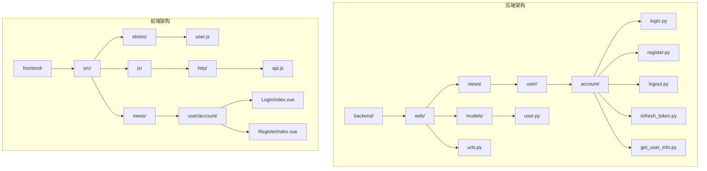
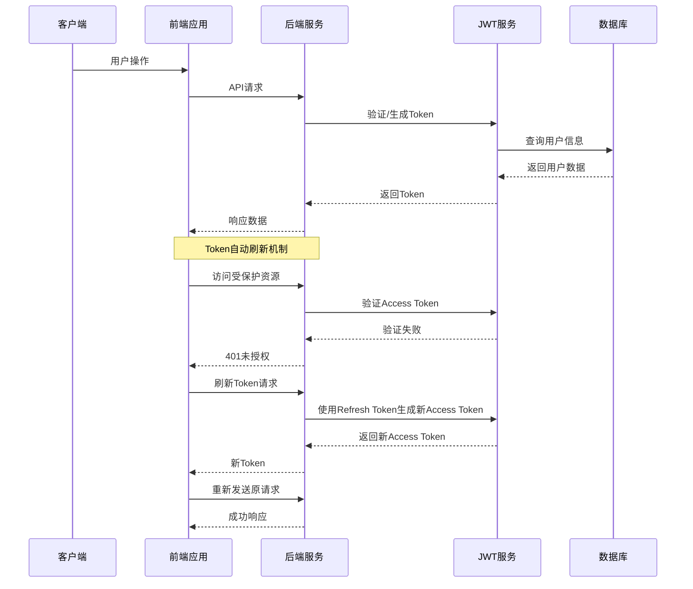
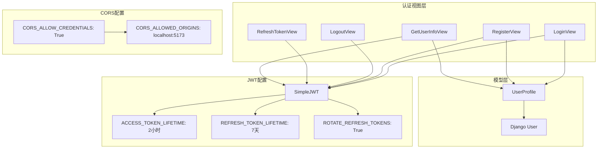
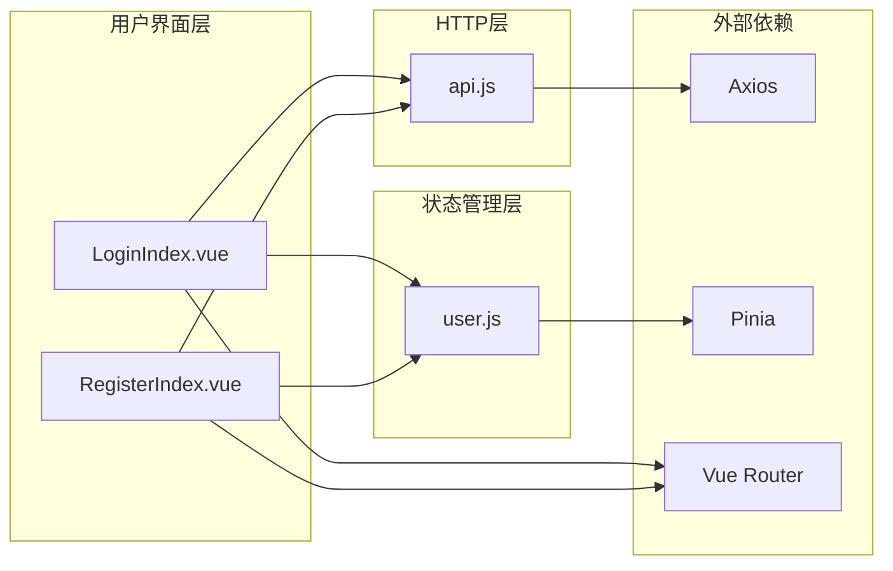

# 用户认证API

<cite>
**本文档引用的文件**
- [login.py](file://backend/web/views/user/account/login.py)
- [register.py](file://backend/web/views/user/account/register.py)
- [logout.py](file://backend/web/views/user/account/logout.py)
- [refresh_token.py](file://backend/web/views/user/account/refresh_token.py)
- [get_user_info.py](file://backend/web/views/user/account/get_user_info.py)
- [user.py](file://backend/web/models/user.py)
- [urls.py](file://backend/web/urls.py)
- [settings.py](file://backend/backend/settings.py)
- [user.js](file://frontend/src/stores/user.js)
- [api.js](file://frontend/src/js/http/api.js)
- [LoginIndex.vue](file://frontend/src/views/user/account/LoginIndex.vue)
- [RegisterIndex.vue](file://frontend/src/views/user/account/RegisterIndex.vue)
</cite>

## 更新摘要
**所做更改**
- 增强了登录认证功能的调试能力，在异常处理中添加traceback模块
- 提供更详细的错误堆栈信息以便故障排查
- 更新了异常处理机制的说明和故障排除指南

## 目录
1. [简介](#简介)
2. [项目结构](#项目结构)
3. [核心组件](#核心组件)
4. [架构概览](#架构概览)
5. [详细组件分析](#详细组件分析)
6. [依赖关系分析](#依赖关系分析)
7. [性能考虑](#性能考虑)
8. [故障排除指南](#故障排除指南)
9. [结论](#结论)

## 简介

本文件为用户认证模块的完整API文档，涵盖用户登录、注册、登出、Token刷新和获取用户信息等核心功能。该系统基于Django框架和Django REST Framework构建，采用JWT（JSON Web Token）进行身份认证，并通过Cookie存储刷新Token。系统支持CORS跨域访问，具备完善的错误处理机制和安全考虑。

**更新** 增强了异常处理和调试能力，为开发和运维人员提供更好的故障排查支持。

## 项目结构

用户认证模块位于后端项目的特定目录结构中，采用按功能分组的组织方式：



**图表来源**
- [urls.py:17-33](file://backend/web/urls.py#L17-L33)
- [user.py:14-22](file://backend/web/models/user.py#L14-L22)

**章节来源**
- [urls.py:1-34](file://backend/web/urls.py#L1-L34)
- [settings.py:33-43](file://backend/backend/settings.py#L33-L43)

## 核心组件

用户认证模块由以下核心组件构成：

### 后端视图组件
- **LoginView**: 处理用户登录请求，验证凭据并生成JWT令牌，包含增强的异常处理和调试功能
- **RegisterView**: 处理用户注册请求，创建新用户账户
- **LogoutView**: 处理用户登出请求，清除认证状态
- **RefreshTokenView**: 处理JWT刷新请求，使用Cookie中的刷新令牌
- **GetUserInfoView**: 获取当前认证用户的个人信息

### 前端组件
- **用户状态管理**: Pinia Store管理用户登录状态和Token
- **HTTP拦截器**: 自动处理Token刷新和认证错误
- **登录/注册界面**: Vue组件实现用户交互

**章节来源**
- [login.py:9-48](file://backend/web/views/user/account/login.py#L9-L48)
- [register.py:9-45](file://backend/web/views/user/account/register.py#L9-L45)
- [logout.py:6-14](file://backend/web/views/user/account/logout.py#L6-L14)
- [refresh_token.py:7-39](file://backend/web/views/user/account/refresh_token.py#L7-L39)
- [get_user_info.py:8-24](file://backend/web/views/user/account/get_user_info.py#L8-L24)

## 架构概览

系统采用前后端分离架构，通过RESTful API进行通信：



**图表来源**
- [api.js:46-90](file://frontend/src/js/http/api.js#L46-L90)
- [settings.py:136-151](file://backend/backend/settings.py#L136-L151)

## 详细组件分析

### 登录接口 (POST /api/user/account/login/)

#### 接口规范
- **HTTP方法**: POST
- **URL路径**: `/api/user/account/login/`
- **认证要求**: 无需认证
- **内容类型**: application/json

#### 请求参数
| 参数名 | 类型 | 必填 | 描述 |
|--------|------|------|------|
| username | string | 是 | 用户名，最小长度1字符 |
| password | string | 是 | 密码，最小长度1字符 |

#### 成功响应
**状态码**: 200 OK
**响应体**:
```json
{
  "result": "success",
  "access": "字符串形式的JWT访问令牌",
  "user_id": "用户唯一标识符",
  "username": "用户名",
  "photo": "用户头像URL",
  "profile": "用户个人简介"
}
```

#### 失败响应
**状态码**: 400 Bad Request 或 500 Internal Server Error
**响应体**:
```json
{
  "result": "错误消息描述"
}
```

#### Cookie设置
- **名称**: refresh_token
- **属性**: httponly=true, samesite=Lax, secure=true, max_age=604800秒(7天)
- **用途**: 存储刷新令牌用于后续Token刷新

#### 错误处理
- 用户名或密码为空：返回400状态码
- 用户名或密码错误：返回400状态码
- 系统异常：返回500状态码，包含详细的错误堆栈信息

**增强功能** 登录接口现在包含增强的异常处理机制：
- 使用 `import traceback` 模块捕获和记录详细的错误堆栈
- 在服务器日志中输出完整的异常信息，便于快速定位问题
- 提供更友好的错误消息："系统异常，请稍后重试"

**章节来源**
- [login.py:10-48](file://backend/web/views/user/account/login.py#L10-L48)

### 注册接口 (POST /api/user/account/register/)

#### 接口规范
- **HTTP方法**: POST
- **URL路径**: `/api/user/account/register/`
- **认证要求**: 无需认证
- **内容类型**: application/json

#### 请求参数
| 参数名 | 类型 | 必填 | 描述 |
|--------|------|------|------|
| username | string | 是 | 用户名，最小长度1字符 |
| password | string | 是 | 密码，最小长度1字符 |

#### 成功响应
**状态码**: 200 OK
**响应体**:
```json
{
  "result": "success",
  "access": "字符串形式的JWT访问令牌",
  "user_id": "新用户唯一标识符",
  "username": "用户名",
  "photo": "默认头像URL",
  "profile": "默认个人简介"
}
```

#### 失败响应
**状态码**: 400 Bad Request 或 500 Internal Server Error
**响应体**:
```json
{
  "result": "错误消息描述"
}
```

#### 错误处理
- 用户名或密码为空：返回400状态码
- 用户名已存在：返回400状态码
- 系统异常：返回500状态码

**章节来源**
- [register.py:10-45](file://backend/web/views/user/account/register.py#L10-L45)

### 登出接口 (POST /api/user/account/logout/)

#### 接口规范
- **HTTP方法**: POST
- **URL路径**: `/api/user/account/logout/`
- **认证要求**: 需要已认证用户
- **内容类型**: application/json

#### 权限控制
- **认证类**: `IsAuthenticated`
- **作用**: 确保只有已登录用户可以访问此接口

#### 成功响应
**状态码**: 200 OK
**响应体**:
```json
{
  "result": "success"
}
```

#### Cookie处理
- 删除名为 `refresh_token` 的Cookie
- 清除客户端的认证状态

**章节来源**
- [logout.py:7-14](file://backend/web/views/user/account/logout.py#L7-L14)

### Token刷新接口 (POST /api/user/account/refresh_token/)

#### 接口规范
- **HTTP方法**: POST
- **URL路径**: `/api/user/account/refresh_token/`
- **认证要求**: 无需认证
- **内容类型**: application/json

#### Cookie要求
- **必需**: 必须包含名为 `refresh_token` 的Cookie
- **用途**: 存储用户上次登录时获得的刷新令牌

#### 成功响应
**状态码**: 200 OK
**响应体**:
```json
{
  "result": "success",
  "access": "新的JWT访问令牌"
}
```

#### Cookie更新
- **可选**: 当配置启用刷新令牌轮换时，会更新Cookie中的刷新令牌
- **属性**: httponly=true, samesite=Lax, secure=true, max_age=604800秒(7天)

#### 错误处理
- 缺少刷新令牌Cookie：返回401状态码
- 刷新令牌过期：返回401状态码
- 系统异常：返回500状态码

**章节来源**
- [refresh_token.py:8-39](file://backend/web/views/user/account/refresh_token.py#L8-L39)

### 获取用户信息接口 (GET /api/user/account/get_user_info/)

#### 接口规范
- **HTTP方法**: GET
- **URL路径**: `/api/user/account/get_user_info/`
- **认证要求**: 需要已认证用户
- **内容类型**: application/json

#### 权限控制
- **认证类**: `IsAuthenticated`
- **作用**: 确保只有已登录用户可以访问此接口

#### 成功响应
**状态码**: 200 OK
**响应体**:
```json
{
  "result": "success",
  "user_id": "用户唯一标识符",
  "username": "用户名",
  "photo": "用户头像URL",
  "profile": "用户个人简介"
}
```

#### 错误处理
- 系统异常：返回500状态码

**章节来源**
- [get_user_info.py:9-24](file://backend/web/views/user/account/get_user_info.py#L9-L24)

## 依赖关系分析

### 后端依赖关系



**图表来源**
- [settings.py:136-159](file://backend/backend/settings.py#L136-L159)
- [user.py:14-22](file://backend/web/models/user.py#L14-L22)

### 前端依赖关系



**图表来源**
- [api.js:11-19](file://frontend/src/js/http/api.js#L11-L19)
- [user.js:1-53](file://frontend/src/stores/user.js#L1-L53)

**章节来源**
- [settings.py:133-159](file://backend/backend/settings.py#L133-L159)
- [api.js:1-93](file://frontend/src/js/http/api.js#L1-L93)

## 性能考虑

### Token生命周期管理
- **访问令牌**: 2小时有效期，确保安全性同时减少频繁刷新
- **刷新令牌**: 7天有效期，平衡用户体验和安全需求
- **自动刷新**: 前端检测401状态码时自动刷新访问令牌

### CORS配置优化
- **凭证允许**: `CORS_ALLOW_CREDENTIALS: True` 支持Cookie认证
- **源限制**: 仅允许开发环境的本地主机访问
- **安全策略**: 使用 `SameSite=Lax` 和 `Secure` 属性增强安全性

### 数据库查询优化
- **用户资料**: 每次登录和获取信息时只进行一次数据库查询
- **索引设计**: 用户名字段使用唯一索引避免重复注册

### 异常处理优化
- **增强调试**: 登录接口现在包含traceback模块，提供详细的错误堆栈信息
- **快速故障排查**: 开发者可以通过服务器日志快速定位问题
- **用户友好**: 保持对用户的友好错误消息，同时提供详细的后台日志

## 故障排除指南

### 常见问题及解决方案

#### 1. 跨域问题
**症状**: 浏览器控制台出现CORS错误
**原因**: 前端域名与后端CORS配置不匹配
**解决方案**: 
- 确认 `CORS_ALLOWED_ORIGINS` 包含前端域名
- 在开发环境中使用 `http://localhost:5173`

#### 2. Token过期问题
**症状**: API请求返回401未授权错误
**原因**: 访问令牌已过期
**解决方案**:
- 前端会自动尝试刷新令牌
- 检查刷新Cookie是否正确设置
- 确认 `ROTATE_REFRESH_TOKENS` 配置

#### 3. 登录失败问题
**症状**: 用户名或密码错误提示
**原因**: 凭据验证失败
**解决方案**:
- 检查用户名和密码格式
- 确认用户账户存在且未被禁用
- 验证密码哈希算法兼容性

#### 4. 注册失败问题
**症状**: 用户名已存在错误
**原因**: 用户名已被其他用户占用
**解决方案**:
- 提示用户选择其他用户名
- 实时检查用户名可用性

#### 5. 系统异常问题
**症状**: "系统异常，请稍后重试" 错误消息
**原因**: 服务器内部错误
**解决方案**:
- 查看服务器日志中的traceback堆栈信息
- 检查数据库连接和权限
- 验证JWT配置和密钥设置

**增强功能** 针对系统异常问题的专门处理：
- 登录接口现在包含 `import traceback` 语句
- 服务器会在日志中输出完整的异常堆栈跟踪
- 开发者可以快速定位具体的错误位置和原因
- 支持多层异常捕获和详细错误报告

**章节来源**
- [settings.py:153-159](file://backend/backend/settings.py#L153-L159)
- [api.js:46-90](file://frontend/src/js/http/api.js#L46-L90)
- [login.py:42-47](file://backend/web/views/user/account/login.py#L42-L47)

## 结论

用户认证模块提供了完整的用户身份管理功能，采用现代的JWT认证机制和前后端分离架构。系统具有以下特点：

### 安全特性
- 使用HTTPS传输加密
- Cookie设置安全属性（httponly、secure、sameSite）
- 访问令牌短生命周期
- 刷新令牌轮换机制

### 用户体验
- 自动Token刷新机制
- 实时用户名可用性检查
- 统一的错误处理和提示

### 技术优势
- 基于成熟的Django和DRF框架
- 完善的CORS配置
- 前后端职责清晰分离

### 开发支持增强
- **增强的调试能力**: 登录接口现在包含traceback模块，提供详细的错误堆栈信息
- **快速故障排查**: 开发者可以通过服务器日志快速定位和解决问题
- **用户友好**: 保持对用户的友好错误消息，同时提供详细的后台日志支持

该认证系统为后续的功能扩展奠定了良好的基础，建议在生产环境中进一步完善安全配置和监控机制。增强的异常处理功能将显著提升系统的可维护性和开发效率。