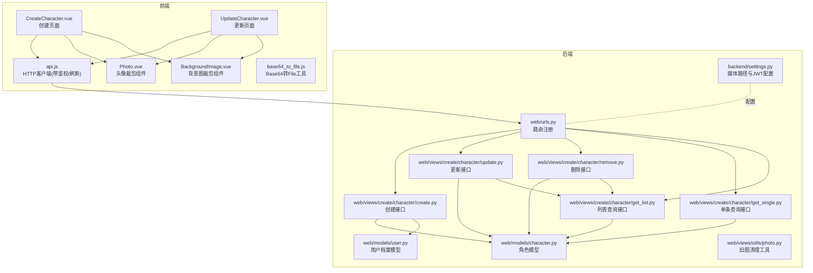
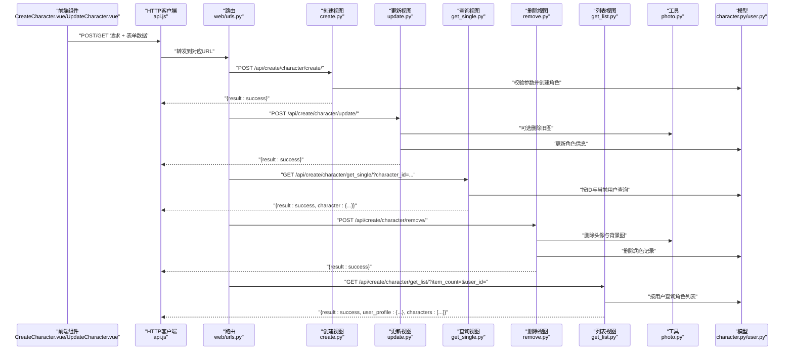
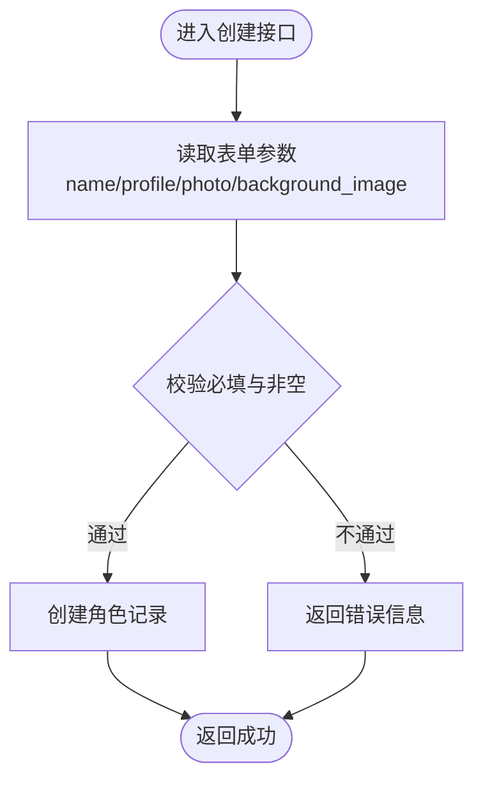
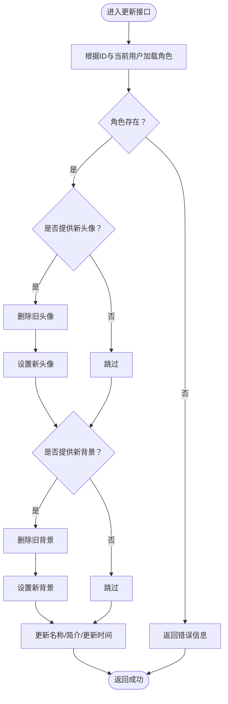
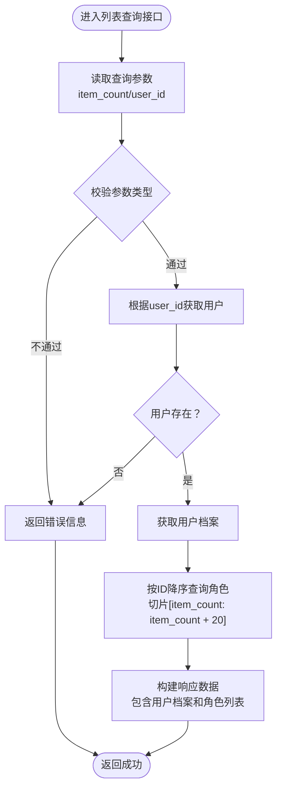
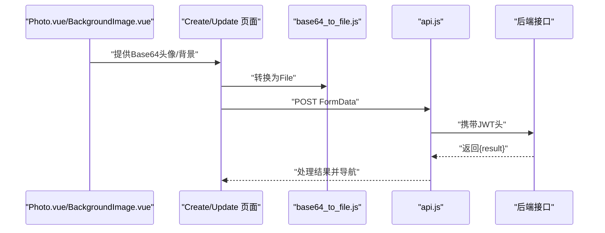
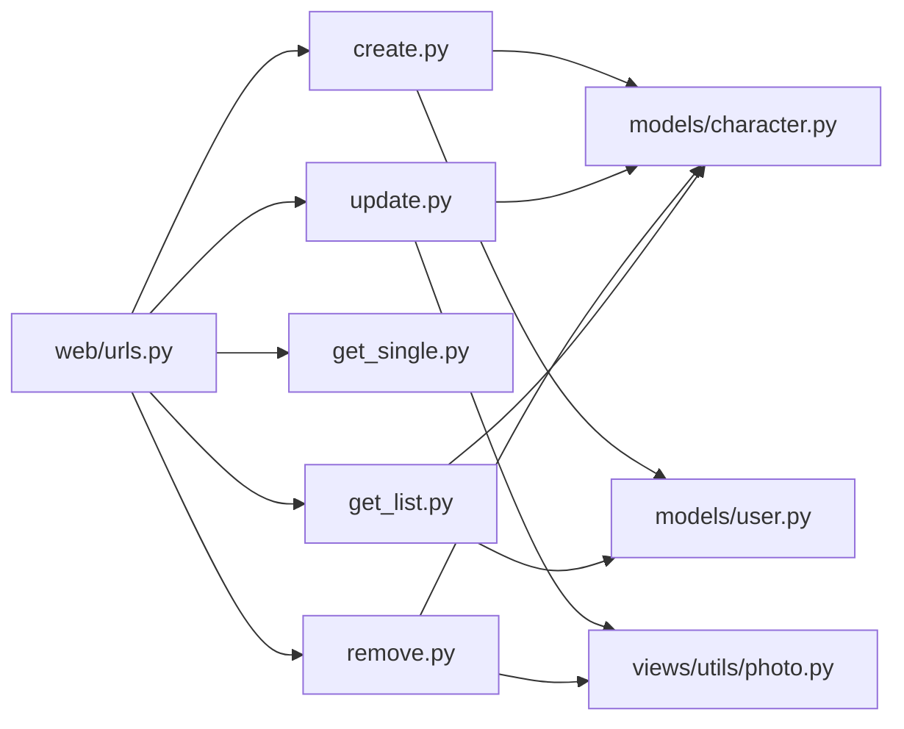
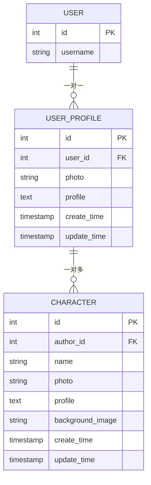

# 角色管理API

<cite>
**本文档引用的文件**
- [backend/web/models/character.py](file://backend/web/models/character.py)
- [backend/web/models/user.py](file://backend/web/models/user.py)
- [backend/web/views/create/character/create.py](file://backend/web/views/create/character/create.py)
- [backend/web/views/create/character/update.py](file://backend/web/views/create/character/update.py)
- [backend/web/views/create/character/remove.py](file://backend/web/views/create/character/remove.py)
- [backend/web/views/create/character/get_single.py](file://backend/web/views/create/character/get_single.py)
- [backend/web/views/create/character/get_list.py](file://backend/web/views/create/character/get_list.py)
- [backend/web/views/utils/photo.py](file://backend/web/views/utils/photo.py)
- [backend/web/urls.py](file://backend/web/urls.py)
- [backend/backend/settings.py](file://backend/backend/settings.py)
- [frontend/src/views/create/character/CreateCharacter.vue](file://frontend/src/views/create/character/CreateCharacter.vue)
- [frontend/src/views/create/character/UpdateCharacter.vue](file://frontend/src/views/create/character/UpdateCharacter.vue)
- [frontend/src/js/http/api.js](file://frontend/src/js/http/api.js)
- [frontend/src/views/create/character/components/Photo.vue](file://frontend/src/views/create/character/components/Photo.vue)
- [frontend/src/views/create/character/components/BackgroundImage.vue](file://frontend/src/views/create/character/components/BackgroundImage.vue)
- [frontend/src/js/utils/base64_to_file.js](file://frontend/src/js/utils/base64_to_file.js)
</cite>

## 目录
1. [简介](#简介)
2. [项目结构](#项目结构)
3. [核心组件](#核心组件)
4. [架构总览](#架构总览)
5. [详细组件分析](#详细组件分析)
6. [依赖分析](#依赖分析)
7. [性能考虑](#性能考虑)
8. [故障排查指南](#故障排查指南)
9. [结论](#结论)
10. [附录](#附录)

## 简介
本文件为"角色管理"模块的完整API文档，覆盖AI角色的创建、更新、删除、单条查询与列表查询接口。文档从接口定义、请求/响应格式、业务逻辑、数据模型、文件上传与媒体资源管理、错误处理与调试等方面进行系统化说明，并提供流程图与时序图帮助理解。

## 项目结构
角色管理API位于后端Django应用的web子应用下，采用DRF视图类实现REST接口；前端Vue组件负责表单采集、裁剪与文件转换，通过统一的HTTP客户端发送请求。

**图表来源**
- [backend/web/urls.py:16-32](file://backend/web/urls.py#L16-L32)
- [backend/web/views/create/character/create.py:9-50](file://backend/web/views/create/character/create.py#L9-L50)
- [backend/web/views/create/character/update.py:10-45](file://backend/web/views/create/character/update.py#L10-L45)
- [backend/web/views/create/character/remove.py:9-24](file://backend/web/views/create/character/remove.py#L9-L24)
- [backend/web/views/create/character/get_single.py:8-27](file://backend/web/views/create/character/get_single.py#L8-L27)
- [backend/web/views/create/character/get_list.py:9-47](file://backend/web/views/create/character/get_list.py#L9-L47)
- [backend/web/views/utils/photo.py:6-11](file://backend/web/views/utils/photo.py#L6-L11)
- [backend/web/models/character.py:21-31](file://backend/web/models/character.py#L21-L31)
- [backend/web/models/user.py:14-22](file://backend/web/models/user.py#L14-L22)
- [backend/backend/settings.py:129-130](file://backend/backend/settings.py#L129-L130)
- [frontend/src/views/create/character/CreateCharacter.vue:21-59](file://frontend/src/views/create/character/CreateCharacter.vue#L21-L59)
- [frontend/src/views/create/character/UpdateCharacter.vue:39-84](file://frontend/src/views/create/character/UpdateCharacter.vue#L39-L84)
- [frontend/src/js/http/api.js:14-89](file://frontend/src/js/http/api.js#L14-L89)
- [frontend/src/views/create/character/components/Photo.vue:19-45](file://frontend/src/views/create/character/components/Photo.vue#L19-L45)
- [frontend/src/views/create/character/components/BackgroundImage.vue:18-44](file://frontend/src/views/create/character/components/BackgroundImage.vue#L18-L44)
- [frontend/src/js/utils/base64_to_file.js:1-9](file://frontend/src/js/utils/base64_to_file.js#L1-L9)

**章节来源**
- [backend/web/urls.py:16-32](file://backend/web/urls.py#L16-L32)
- [backend/backend/settings.py:129-130](file://backend/backend/settings.py#L129-L130)

## 核心组件
- 角色模型：存储作者、名称、头像、个人简介、背景图及时间戳。
- 用户档案模型：与用户一对一关联，用于角色归属。
- 文件上传与命名：头像与背景图分别按作者用户ID与随机UUID组合命名，存放于MEDIA_ROOT下的指定目录。
- 媒体访问：MEDIA_URL为前端访问媒体资源的基础地址。
- 接口权限：所有角色接口均要求已通过JWT鉴权的已登录用户。

**章节来源**
- [backend/web/models/character.py:21-31](file://backend/web/models/character.py#L21-L31)
- [backend/web/models/user.py:14-22](file://backend/web/models/user.py#L14-L22)
- [backend/backend/settings.py:129-130](file://backend/backend/settings.py#L129-L130)

## 架构总览
角色管理API采用前后端分离架构：前端Vue组件负责UI与文件裁剪，后端DRF视图类处理业务逻辑与数据库操作，统一通过JWT进行鉴权与会话管理。

**图表来源**
- [backend/web/urls.py:24-29](file://backend/web/urls.py#L24-L29)
- [backend/web/views/create/character/create.py:11-46](file://backend/web/views/create/character/create.py#L11-L46)
- [backend/web/views/create/character/update.py:12-41](file://backend/web/views/create/character/update.py#L12-L41)
- [backend/web/views/create/character/get_single.py:10-23](file://backend/web/views/create/character/get_single.py#L10-L23)
- [backend/web/views/create/character/remove.py:11-20](file://backend/web/views/create/character/remove.py#L11-L20)
- [backend/web/views/create/character/get_list.py:10-43](file://backend/web/views/create/character/get_list.py#L10-L43)
- [backend/web/views/utils/photo.py:6-11](file://backend/web/views/utils/photo.py#L6-L11)
- [backend/web/models/character.py:21-31](file://backend/web/models/character.py#L21-L31)
- [backend/web/models/user.py:14-22](file://backend/web/models/user.py#L14-L22)

## 详细组件分析

### 数据模型与字段说明
- 角色模型字段
  - author: 外键，指向用户档案，表示角色作者
  - name: 字符串，最大长度50
  - photo: 图片字段，上传至character/photos/{author_user_id}_随机名
  - profile: 文本字段，最大长度100000
  - background_image: 图片字段，上传至character/background_images/{author_user_id}_随机名
  - create_time/update_time: 时间戳，默认为当前时间
- 用户档案模型字段
  - user: 一对一外键，指向Django内置User
  - photo: 图片字段，有默认值，上传至user/photos/{user_id}_随机名
  - profile: 文本字段，最大长度500
  - create_time/update_time: 时间戳，默认为当前时间

**章节来源**
- [backend/web/models/character.py:21-31](file://backend/web/models/character.py#L21-L31)
- [backend/web/models/user.py:14-22](file://backend/web/models/user.py#L14-L22)

### 创建角色接口
- 方法与URL
  - POST /api/create/character/create/
- 权限
  - 需要已登录用户（JWT）
- 请求体（multipart/form-data）
  - name: 字符串，必填，去空白，最大长度50
  - profile: 字符串，必填，去空白，最大长度100000
  - photo: 文件，必填，头像
  - background_image: 文件，必填，聊天背景
- 成功响应
  - { result: "success" }
- 失败响应
  - { result: "错误提示字符串" }
- 业务逻辑
  - 校验必填项与内容非空
  - 以当前登录用户对应的用户档案作为作者
  - 将上传的图片保存到各自目录，生成唯一文件名
  - 记录创建与更新时间
- 错误场景
  - 参数缺失或为空
  - 系统异常（捕获未分类异常）

**图表来源**
- [backend/web/views/create/character/create.py:11-46](file://backend/web/views/create/character/create.py#L11-L46)

**章节来源**
- [backend/web/views/create/character/create.py:9-50](file://backend/web/views/create/character/create.py#L9-L50)
- [backend/web/urls.py:24](file://backend/web/urls.py#L24)

### 更新角色接口
- 方法与URL
  - POST /api/create/character/update/
- 权限
  - 需要已登录用户（JWT）
- 请求体（multipart/form-data）
  - character_id: 整数，必填，目标角色ID
  - name: 字符串，可选，去空白
  - profile: 字符串，可选，去空白，最大长度100000
  - photo: 文件，可选，仅在提供时替换
  - background_image: 文件，可选，仅在提供时替换
- 成功响应
  - { result: "success" }
- 失败响应
  - { result: "错误提示字符串" }
- 业务逻辑
  - 校验角色存在且属于当前用户
  - 可选字段：若提供新图片，先删除旧图再赋新值
  - 更新名称、简介与更新时间
- 错误场景
  - 角色不存在或不属于当前用户
  - 系统异常（捕获未分类异常）

**图表来源**
- [backend/web/views/create/character/update.py:12-41](file://backend/web/views/create/character/update.py#L12-L41)
- [backend/web/views/utils/photo.py:6-11](file://backend/web/views/utils/photo.py#L6-L11)

**章节来源**
- [backend/web/views/create/character/update.py:10-46](file://backend/web/views/create/character/update.py#L10-L46)
- [backend/web/urls.py:25](file://backend/web/urls.py#L25)

### 删除角色接口
- 方法与URL
  - POST /api/create/character/remove/
- 权限
  - 需要已登录用户（JWT）
- 请求体
  - character_id: 整数，必填
- 成功响应
  - { result: "success" }
- 失败响应
  - { result: "错误提示字符串" }
- 业务逻辑
  - 校验角色存在且属于当前用户
  - 删除头像与背景图文件
  - 删除角色记录
- 错误场景
  - 角色不存在或不属于当前用户
  - 系统异常（捕获未分类异常）

**章节来源**
- [backend/web/views/create/character/remove.py:9-25](file://backend/web/views/create/character/remove.py#L9-L25)
- [backend/web/urls.py:26](file://backend/web/urls.py#L26)

### 单条查询接口
- 方法与URL
  - GET /api/create/character/get_single/?character_id=...
- 权限
  - 需要已登录用户（JWT）
- 查询参数
  - character_id: 整数，必填
- 成功响应
  - { result: "success", character: { id, name, profile, photo(url), background_image(url) } }
- 失败响应
  - { result: "错误提示字符串" }
- 业务逻辑
  - 根据ID与当前用户查询角色
  - 返回角色详情与媒体URL
- 错误场景
  - 角色不存在或不属于当前用户
  - 系统异常（捕获未分类异常）

**章节来源**
- [backend/web/views/create/character/get_single.py:8-28](file://backend/web/views/create/character/get_single.py#L8-L28)
- [backend/web/urls.py:27](file://backend/web/urls.py#L27)

### 角色列表查询接口
**新增** 支持分页获取角色数据，包括item_count和user_id参数，以及完整的角色信息返回结构

- 方法与URL
  - GET /api/create/character/get_list/?item_count=&user_id=
- 权限
  - 需要已登录用户（JWT）
- 查询参数
  - item_count: 整数，必填，分页起始位置
  - user_id: 整数，必填，目标用户ID
- 成功响应
  - { 
      result: "success",
      user_profile: {
        user_id: 整数,
        username: 字符串,
        profile: 字符串,
        photo: 图片URL
      },
      characters: [
        {
          id: 整数,
          name: 字符串,
          profile: 字符串,
          photo: 图片URL,
          background_image: 图片URL,
          author: {
            id: 整数,
            username: 字符串,
            photo: 图片URL
          }
        }
      ]
    }
- 失败响应
  - { result: "系统异常，请稍后重试" }
- 业务逻辑
  - 根据user_id获取目标用户及其档案
  - 按角色ID降序排列，使用切片[item_count: item_count + 20]实现分页
  - 返回用户档案信息和角色列表，每个角色包含作者信息
- 错误场景
  - user_id无效或不存在
  - 系统异常（捕获未分类异常）

**图表来源**
- [backend/web/views/create/character/get_list.py:10-43](file://backend/web/views/create/character/get_list.py#L10-L43)

**章节来源**
- [backend/web/views/create/character/get_list.py:9-47](file://backend/web/views/create/character/get_list.py#L9-L47)
- [backend/web/urls.py:29](file://backend/web/urls.py#L29)

### 前端交互与文件上传流程
- 前端组件
  - Photo.vue：头像选择与方形裁剪
  - BackgroundImage.vue：背景图选择与宽高比裁剪
  - CreateCharacter.vue / UpdateCharacter.vue：表单收集、校验与提交
- 文件转换
  - base64_to_file.js：将Base64转换为File对象，便于FormData上传
- 请求发送
  - api.js：统一设置Authorization头，拦截401并自动刷新令牌
- 提交策略
  - 创建：直接提交name/profile/photo/background_image
  - 更新：仅在变更时附加photo或background_image字段

**图表来源**
- [frontend/src/views/create/character/components/Photo.vue:19-45](file://frontend/src/views/create/character/components/Photo.vue#L19-L45)
- [frontend/src/views/create/character/components/BackgroundImage.vue:18-44](file://frontend/src/views/create/character/components/BackgroundImage.vue#L18-L44)
- [frontend/src/views/create/character/CreateCharacter.vue:37-59](file://frontend/src/views/create/character/CreateCharacter.vue#L37-L59)
- [frontend/src/views/create/character/UpdateCharacter.vue:55-84](file://frontend/src/views/create/character/UpdateCharacter.vue#L55-L84)
- [frontend/src/js/utils/base64_to_file.js:1-9](file://frontend/src/js/utils/base64_to_file.js#L1-L9)
- [frontend/src/js/http/api.js:14-89](file://frontend/src/js/http/api.js#L14-L89)

**章节来源**
- [frontend/src/views/create/character/CreateCharacter.vue:21-59](file://frontend/src/views/create/character/CreateCharacter.vue#L21-L59)
- [frontend/src/views/create/character/UpdateCharacter.vue:39-84](file://frontend/src/views/create/character/UpdateCharacter.vue#L39-L84)
- [frontend/src/js/utils/base64_to_file.js:1-9](file://frontend/src/js/utils/base64_to_file.js#L1-L9)
- [frontend/src/js/http/api.js:14-89](file://frontend/src/js/http/api.js#L14-L89)

## 依赖分析
- 组件耦合
  - 视图层依赖模型层与工具层
  - 工具层仅依赖Django设置中的MEDIA_ROOT
  - 路由层集中注册角色相关接口
- 外部依赖
  - DRF视图类、Django ORM、Django设置（MEDIA_URL/MEDIA_ROOT）、SimpleJWT
- 潜在风险
  - 所有接口使用通用异常捕获，建议细化异常类型以便更精确的错误反馈

**图表来源**
- [backend/web/urls.py:24-29](file://backend/web/urls.py#L24-L29)
- [backend/web/views/create/character/create.py:5-6](file://backend/web/views/create/character/create.py#L5-L6)
- [backend/web/views/create/character/update.py:6-7](file://backend/web/views/create/character/update.py#L6-L7)
- [backend/web/views/create/character/remove.py:5-6](file://backend/web/views/create/character/remove.py#L5-L6)
- [backend/web/views/create/character/get_list.py:5-6](file://backend/web/views/create/character/get_list.py#L5-L6)
- [backend/web/views/utils/photo.py:3](file://backend/web/views/utils/photo.py#L3)
- [backend/web/models/character.py:6](file://backend/web/models/character.py#L6)
- [backend/web/models/user.py:14-16](file://backend/web/models/user.py#L14-L16)

**章节来源**
- [backend/web/urls.py:16-32](file://backend/web/urls.py#L16-L32)

## 性能考虑
- 文件上传
  - 建议在前端对图片尺寸与体积做预限制，减少不必要的网络传输
  - 后端已使用随机文件名避免冲突，建议结合CDN缓存提升媒体访问性能
- 数据库
  - 角色查询按当前用户过滤，建议在author字段建立索引以优化查询
  - 列表查询使用切片分页，建议在ID字段建立索引以优化排序性能
- 缓存
  - 对热点角色详情可引入Redis缓存，降低数据库压力

## 故障排查指南
- 常见错误与定位
  - 401 未授权：确认前端是否正确携带Authorization头，以及access_token是否过期
  - 403 权限不足：检查当前用户是否为角色作者
  - 404 资源不存在：确认character_id或user_id是否正确
  - 500 服务器异常：查看后端日志，接口使用通用异常捕获，建议细化异常类型
- 调试步骤
  - 前端：打开浏览器开发者工具Network标签，观察请求头与响应体
  - 后端：开启DEBUG并查看控制台输出，确认MEDIA_ROOT与MEDIA_URL配置
  - 文件：确认上传目录权限与磁盘空间充足
- 建议
  - 在视图层增加更细粒度的异常处理与日志记录
  - 对必填字段增加显式的序列化器校验，提升一致性

**章节来源**
- [frontend/src/js/http/api.js:46-89](file://frontend/src/js/http/api.js#L46-L89)
- [backend/backend/settings.py:129-130](file://backend/backend/settings.py#L129-L130)

## 结论
角色管理API提供了完整的CRUD能力，配合前端裁剪与文件转换，实现了良好的用户体验。新增的角色列表查询功能支持分页获取角色数据，为前端展示和交互提供了更好的支持。建议后续增强异常类型与序列化校验，完善分页与批量操作能力，并加强媒体资源的版本与压缩策略以提升性能与稳定性。

## 附录

### 接口一览表
- 创建角色
  - 方法：POST
  - URL：/api/create/character/create/
  - 权限：已登录
  - 请求体：multipart/form-data，包含name、profile、photo、background_image
  - 响应：{ result: "success" }
- 更新角色
  - 方法：POST
  - URL：/api/create/character/update/
  - 权限：已登录
  - 请求体：multipart/form-data，包含character_id、name、profile、photo(可选)、background_image(可选)
  - 响应：{ result: "success" }
- 删除角色
  - 方法：POST
  - URL：/api/create/character/remove/
  - 权限：已登录
  - 请求体：application/json，包含character_id
  - 响应：{ result: "success" }
- 单条查询
  - 方法：GET
  - URL：/api/create/character/get_single/
  - 权限：已登录
  - 查询参数：character_id
  - 响应：{ result: "success", character: { id, name, profile, photo(url), background_image(url) } }
- 角色列表查询
  - 方法：GET
  - URL：/api/create/character/get_list/
  - 权限：已登录
  - 查询参数：item_count、user_id
  - 响应：{ result: "success", user_profile: {...}, characters: [...] }

**章节来源**
- [backend/web/urls.py:24-29](file://backend/web/urls.py#L24-L29)
- [backend/web/views/create/character/create.py:11-46](file://backend/web/views/create/character/create.py#L11-L46)
- [backend/web/views/create/character/update.py:12-41](file://backend/web/views/create/character/update.py#L12-L41)
- [backend/web/views/create/character/remove.py:11-20](file://backend/web/views/create/character/remove.py#L11-L20)
- [backend/web/views/create/character/get_single.py:10-23](file://backend/web/views/create/character/get_single.py#L10-L23)
- [backend/web/views/create/character/get_list.py:10-43](file://backend/web/views/create/character/get_list.py#L10-L43)

### 数据模型ER图

**图表来源**
- [backend/web/models/user.py:14-22](file://backend/web/models/user.py#L14-L22)
- [backend/web/models/character.py:21-31](file://backend/web/models/character.py#L21-L31)