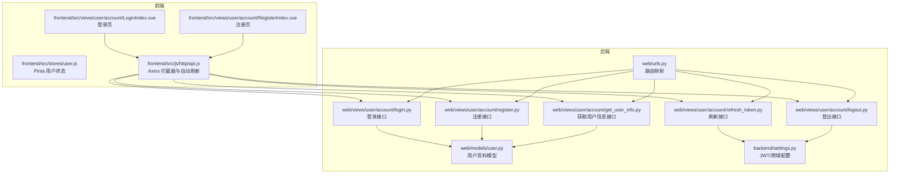
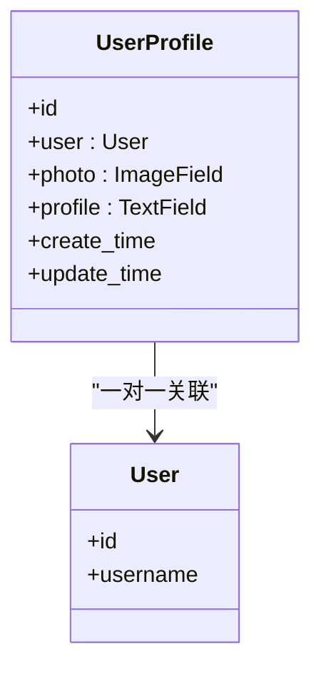
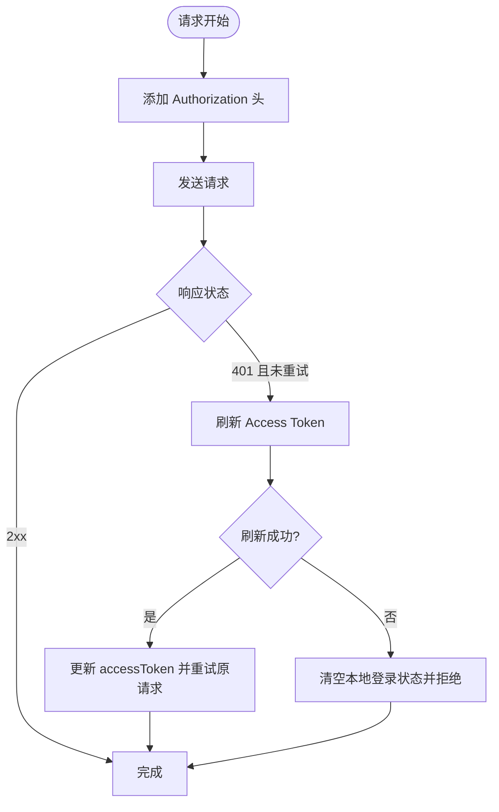
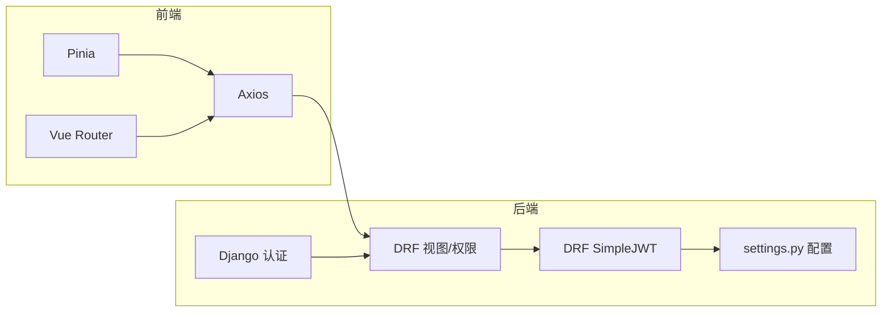

# 认证接口

<cite>
**本文引用的文件**
- [backend/web/views/user/account/login.py](file://backend/web/views/user/account/login.py)
- [backend/web/views/user/account/register.py](file://backend/web/views/user/account/register.py)
- [backend/web/views/user/account/refresh_token.py](file://backend/web/views/user/account/refresh_token.py)
- [backend/web/views/user/account/logout.py](file://backend/web/views/user/account/logout.py)
- [backend/web/views/user/account/get_user_info.py](file://backend/web/views/user/account/get_user_info.py)
- [backend/web/models/user.py](file://backend/web/models/user.py)
- [backend/web/urls.py](file://backend/web/urls.py)
- [backend/backend/settings.py](file://backend/backend/settings.py)
- [frontend/src/js/http/api.js](file://frontend/src/js/http/api.js)
- [frontend/src/stores/user.js](file://frontend/src/stores/user.js)
- [frontend/src/views/user/account/LoginIndex.vue](file://frontend/src/views/user/account/LoginIndex.vue)
- [frontend/src/views/user/account/RegisterIndex.vue](file://frontend/src/views/user/account/RegisterIndex.vue)
</cite>

## 目录
1. [简介](#简介)
2. [项目结构](#项目结构)
3. [核心组件](#核心组件)
4. [架构总览](#架构总览)
5. [详细组件分析](#详细组件分析)
6. [依赖分析](#依赖分析)
7. [性能考虑](#性能考虑)
8. [故障排查指南](#故障排查指南)
9. [结论](#结论)
10. [附录](#附录)

## 简介
本文件面向 LLM_AIfriends 项目的用户认证相关 API 接口，覆盖登录、注册、令牌刷新、登出与用户信息获取等核心能力。文档从接口定义、请求/响应规范、错误处理、JWT 令牌生成与验证机制、Cookie 策略、前端认证状态管理与自动刷新机制等方面进行系统化说明，并提供可视化流程图帮助理解。

## 项目结构
认证相关后端接口集中在 web 应用的 user/account 子模块，前端通过 Pinia 状态管理与 Axios 拦截器完成认证状态维护与自动刷新。



图表来源
- [backend/web/views/user/account/login.py:1-92](file://backend/web/views/user/account/login.py#L1-L92)
- [backend/web/views/user/account/register.py:1-46](file://backend/web/views/user/account/register.py#L1-L46)
- [backend/web/views/user/account/refresh_token.py:1-41](file://backend/web/views/user/account/refresh_token.py#L1-L41)
- [backend/web/views/user/account/logout.py:1-16](file://backend/web/views/user/account/logout.py#L1-L16)
- [backend/web/views/user/account/get_user_info.py:1-25](file://backend/web/views/user/account/get_user_info.py#L1-L25)
- [backend/web/models/user.py:1-23](file://backend/web/models/user.py#L1-L23)
- [backend/web/urls.py:1-24](file://backend/web/urls.py#L1-L24)
- [backend/backend/settings.py:133-151](file://backend/backend/settings.py#L133-L151)
- [frontend/src/stores/user.js:1-59](file://frontend/src/stores/user.js#L1-L59)
- [frontend/src/js/http/api.js:1-92](file://frontend/src/js/http/api.js#L1-L92)
- [frontend/src/views/user/account/LoginIndex.vue:1-69](file://frontend/src/views/user/account/LoginIndex.vue#L1-L69)
- [frontend/src/views/user/account/RegisterIndex.vue:1-76](file://frontend/src/views/user/account/RegisterIndex.vue#L1-L76)

章节来源
- [backend/web/urls.py:10-23](file://backend/web/urls.py#L10-L23)
- [backend/backend/settings.py:133-151](file://backend/backend/settings.py#L133-L151)

## 核心组件
- 登录接口：接收用户名/密码，校验通过后签发 JWT Access Token，并通过 Cookie 返回 Refresh Token。
- 注册接口：校验用户名唯一性后创建用户与默认用户资料，随后签发 Access/Refresh Token 并写入 Cookie。
- 刷新接口：从前端 Cookie 读取 Refresh Token，校验并签发新的 Access Token；可选轮换 Refresh Token 并更新 Cookie。
- 登出接口：强制要求已认证，清除 Refresh Cookie，使会话失效。
- 获取用户信息接口：强制要求已认证，返回当前用户的基本资料。

章节来源
- [backend/web/views/user/account/login.py:9-46](file://backend/web/views/user/account/login.py#L9-L46)
- [backend/web/views/user/account/register.py:9-46](file://backend/web/views/user/account/register.py#L9-L46)
- [backend/web/views/user/account/refresh_token.py:7-41](file://backend/web/views/user/account/refresh_token.py#L7-L41)
- [backend/web/views/user/account/logout.py:7-16](file://backend/web/views/user/account/logout.py#L7-L16)
- [backend/web/views/user/account/get_user_info.py:8-25](file://backend/web/views/user/account/get_user_info.py#L8-L25)

## 架构总览
下图展示认证全流程：前端发起登录/注册请求，后端返回 Access Token 与 Refresh Cookie；后续请求由前端自动附加 Authorization 头；当 Access Token 失效时，前端自动使用 Cookie 中的 Refresh Token 刷新 Access Token；登出时清除 Cookie 实现会话终止。

```mermaid
sequenceDiagram
participant FE as "前端应用"
participant API as "Axios 拦截器"
participant Auth as "认证服务"
participant JWT as "JWT 服务"
participant Store as "Pinia 用户状态"
FE->>Auth : "POST /api/user/account/login 或 register"
Auth->>JWT : "校验凭据并签发 Access/Refresh"
JWT-->>Auth : "Access Token + Refresh Token"
Auth-->>FE : "返回 {access, user_id, username, photo, profile}"
Auth-->>FE : "Set-Cookie : refresh_token=...; HttpOnly; SameSite=Lax; Max-Age=604800"
FE->>Store : "setAccessToken(access)"
FE->>Store : "setUserInfo(...)"
loop 后续请求
FE->>API : "携带 Authorization : Bearer access"
API-->>FE : "透传响应"
API-->>FE : "若 401 且未重试"
API->>Auth : "POST /api/user/account/refresh_token"
Auth->>JWT : "校验并刷新 Access Token"
JWT-->>Auth : "新 Access Token"
Auth-->>API : "{access}"
API->>Store : "setAccessToken(newAccess)"
API->>FE : "重试原请求"
end
FE->>Auth : "POST /api/user/account/logout"
Auth-->>FE : "清除 refresh_token Cookie"
```

图表来源
- [frontend/src/js/http/api.js:21-90](file://frontend/src/js/http/api.js#L21-L90)
- [backend/web/views/user/account/login.py:23-39](file://backend/web/views/user/account/login.py#L23-L39)
- [backend/web/views/user/account/register.py:27-42](file://backend/web/views/user/account/register.py#L27-L42)
- [backend/web/views/user/account/refresh_token.py:15-36](file://backend/web/views/user/account/refresh_token.py#L15-L36)
- [backend/web/views/user/account/logout.py:10-16](file://backend/web/views/user/account/logout.py#L10-L16)

## 详细组件分析

### 登录接口
- HTTP 方法与路径
  - POST /api/user/account/login/
- 请求体字段
  - username: string（必填，前后去空白）
  - password: string（必填，前后去空白）
- 成功响应字段
  - result: "success"
  - access: string（JWT Access Token）
  - user_id: number | string（用户标识）
  - username: string（用户名）
  - photo: string（头像 URL）
  - profile: string（个人简介）
- 错误响应字段
  - result: string（错误原因）
- Cookie 策略
  - refresh_token: string（HttpOnly, SameSite=Lax, Secure, Max-Age=604800）
- 安全注意事项
  - 使用 Django 内置 authenticate 校验凭据
  - Access Token 通过响应体返回，Refresh Token 通过 Cookie 返回
  - 建议仅在 HTTPS 环境部署以配合 Secure 属性

章节来源
- [backend/web/views/user/account/login.py:9-46](file://backend/web/views/user/account/login.py#L9-L46)
- [backend/web/urls.py:12-12](file://backend/web/urls.py#L12-L12)

### 注册接口
- HTTP 方法与路径
  - POST /api/user/account/register/
- 请求体字段
  - username: string（必填，前后去空白）
  - password: string（必填，前后去空白）
- 成功响应字段
  - result: "success"
  - access: string（JWT Access Token）
  - user_id: number | string
  - username: string
  - photo: string（默认头像 URL）
  - profile: string（默认简介）
- 错误响应字段
  - result: string（错误原因）
- Cookie 策略
  - refresh_token: string（HttpOnly, SameSite=Lax, Max-Age=604800）

章节来源
- [backend/web/views/user/account/register.py:9-46](file://backend/web/views/user/account/register.py#L9-L46)
- [backend/web/urls.py:13-13](file://backend/web/urls.py#L13-L13)

### 令牌刷新接口
- HTTP 方法与路径
  - POST /api/user/account/refresh_token/
- 请求
  - Cookie: refresh_token（HttpOnly）
- 成功响应字段
  - result: "success"
  - access: string（新的 Access Token）
- 错误响应字段
  - result: string（错误原因）
- 行为说明
  - 若 SIMPLE_JWT.ROTATE_REFRESH_TOKENS 为真，刷新时会轮换 Refresh Token 并更新 Cookie
  - 若无 Cookie 或刷新失败，返回 401 以便前端识别并触发登出

章节来源
- [backend/web/views/user/account/refresh_token.py:7-41](file://backend/web/views/user/account/refresh_token.py#L7-L41)
- [backend/backend/settings.py:147-148](file://backend/backend/settings.py#L147-L148)

### 登出接口
- HTTP 方法与路径
  - POST /api/user/account/logout/
- 权限要求
  - 需已认证（IsAuthenticated）
- 响应
  - result: "success"
- 行为说明
  - 清除 refresh_token Cookie，使后续请求无法刷新 Access Token

章节来源
- [backend/web/views/user/account/logout.py:7-16](file://backend/web/views/user/account/logout.py#L7-L16)
- [backend/web/urls.py:15-15](file://backend/web/urls.py#L15-L15)

### 获取用户信息接口
- HTTP 方法与路径
  - GET /api/user/account/get_user_info/
- 权限要求
  - 需已认证（IsAuthenticated）
- 成功响应字段
  - result: "success"
  - user_id: number | string
  - username: string
  - photo: string
  - profile: string
- 错误响应字段
  - result: string（错误原因）

章节来源
- [backend/web/views/user/account/get_user_info.py:8-25](file://backend/web/views/user/account/get_user_info.py#L8-L25)
- [backend/web/urls.py:16-16](file://backend/web/urls.py#L16-L16)

### 数据模型与关系
用户资料模型与 Django User 关联，一对一关系，包含头像与简介字段。



图表来源
- [backend/web/models/user.py:15-23](file://backend/web/models/user.py#L15-L23)

章节来源
- [backend/web/models/user.py:15-23](file://backend/web/models/user.py#L15-L23)

### 前端认证状态管理与自动刷新
- 状态管理
  - Pinia Store 维护 accessToken、用户信息与拉取状态
  - isLogin() 基于 accessToken 是否存在判断登录态
- 请求拦截
  - 自动在请求头添加 Authorization: Bearer access
  - 当响应为 401 且未重试过，触发刷新流程
- 刷新流程
  - 调用 POST /api/user/account/refresh_token/
  - 成功后更新 accessToken 并重试原请求
  - 失败则清空本地登录状态并拒绝请求
- 登录/注册页面
  - 登录页与注册页提交表单后，成功即设置 accessToken 与用户信息并跳转首页



图表来源
- [frontend/src/js/http/api.js:21-90](file://frontend/src/js/http/api.js#L21-L90)
- [frontend/src/stores/user.js:18-43](file://frontend/src/stores/user.js#L18-L43)
- [frontend/src/views/user/account/LoginIndex.vue:15-41](file://frontend/src/views/user/account/LoginIndex.vue#L15-L41)
- [frontend/src/views/user/account/RegisterIndex.vue:16-45](file://frontend/src/views/user/account/RegisterIndex.vue#L16-L45)

章节来源
- [frontend/src/js/http/api.js:1-92](file://frontend/src/js/http/api.js#L1-L92)
- [frontend/src/stores/user.js:1-59](file://frontend/src/stores/user.js#L1-L59)
- [frontend/src/views/user/account/LoginIndex.vue:1-69](file://frontend/src/views/user/account/LoginIndex.vue#L1-L69)
- [frontend/src/views/user/account/RegisterIndex.vue:1-76](file://frontend/src/views/user/account/RegisterIndex.vue#L1-L76)

## 依赖分析
- 后端依赖
  - Django 认证系统：authenticate、User 模型
  - DRF：APIView、Response、权限类 IsAuthenticated
  - DRF SimpleJWT：RefreshToken、JWTAuthentication
  - 配置：REST_FRAMEWORK.DEFAULT_AUTHENTICATION_CLASSES、SIMPLE_JWT 参数
- 前端依赖
  - Axios：请求封装与拦截器
  - Pinia：全局状态管理
  - Vue Router：页面跳转



图表来源
- [backend/backend/settings.py:133-151](file://backend/backend/settings.py#L133-L151)
- [frontend/src/js/http/api.js:11-19](file://frontend/src/js/http/api.js#L11-L19)

章节来源
- [backend/backend/settings.py:133-151](file://backend/backend/settings.py#L133-L151)
- [frontend/src/js/http/api.js:1-92](file://frontend/src/js/http/api.js#L1-L92)

## 性能考虑
- Access Token 生命周期短（默认 2 小时），减少泄露风险；Refresh Token 有效期长（默认 7 天），支持自动续期。
- 前端统一通过拦截器处理刷新，避免重复逻辑与并发刷新问题。
- 建议在高并发场景下对刷新接口增加幂等设计与速率限制，防止滥用。

## 故障排查指南
- 登录/注册返回“用户名或密码不能为空”
  - 检查前端表单输入是否为空或仅空白字符
- 登录/注册返回“用户名已存在”
  - 检查用户名是否已被占用
- 登录/注册返回“系统异常，请稍后重试”
  - 检查后端日志与数据库连接状态
- 刷新接口返回“refresh token 不存在”或 401
  - 检查浏览器 Cookie 中是否存在 refresh_token，确认 SameSite/Lax/Secure 配置是否影响跨站请求
- 访问受保护接口返回 401
  - 确认前端是否正确设置 Authorization 头；若频繁出现，检查刷新流程是否成功更新 accessToken
- 登出无效
  - 确认后端已返回清除 Cookie 的 Set-Cookie 响应头；检查浏览器 Cookie 是否被删除

章节来源
- [backend/web/views/user/account/login.py:14-17](file://backend/web/views/user/account/login.py#L14-L17)
- [backend/web/views/user/account/register.py:14-22](file://backend/web/views/user/account/register.py#L14-L22)
- [backend/web/views/user/account/refresh_token.py:10-14](file://backend/web/views/user/account/refresh_token.py#L10-L14)
- [frontend/src/js/http/api.js:46-90](file://frontend/src/js/http/api.js#L46-L90)

## 结论
本认证体系采用 JWT + Cookie 的混合方案：Access Token 通过请求头传递，Refresh Token 通过 HttpOnly Cookie 保障安全；前端通过拦截器实现透明刷新，提升用户体验。建议在生产环境启用 HTTPS 并完善 CORS 与 CSRF 防护策略。

## 附录

### 接口一览表
- 登录
  - 方法: POST
  - 路径: /api/user/account/login/
  - 请求体: {username, password}
  - 响应: {result, access, user_id, username, photo, profile}
  - Cookie: refresh_token
- 注册
  - 方法: POST
  - 路径: /api/user/account/register/
  - 请求体: {username, password}
  - 响应: {result, access, user_id, username, photo, profile}
  - Cookie: refresh_token
- 刷新
  - 方法: POST
  - 路径: /api/user/account/refresh_token/
  - 请求: Cookie refresh_token
  - 响应: {result, access}
- 登出
  - 方法: POST
  - 路径: /api/user/account/logout/
  - 权限: 已认证
  - 响应: {result}
- 获取用户信息
  - 方法: GET
  - 路径: /api/user/account/get_user_info/
  - 权限: 已认证
  - 响应: {result, user_id, username, photo, profile}

章节来源
- [backend/web/urls.py:10-17](file://backend/web/urls.py#L10-L17)
- [backend/web/views/user/account/login.py:9-46](file://backend/web/views/user/account/login.py#L9-L46)
- [backend/web/views/user/account/register.py:9-46](file://backend/web/views/user/account/register.py#L9-L46)
- [backend/web/views/user/account/refresh_token.py:7-41](file://backend/web/views/user/account/refresh_token.py#L7-L41)
- [backend/web/views/user/account/logout.py:7-16](file://backend/web/views/user/account/logout.py#L7-L16)
- [backend/web/views/user/account/get_user_info.py:8-25](file://backend/web/views/user/account/get_user_info.py#L8-L25)