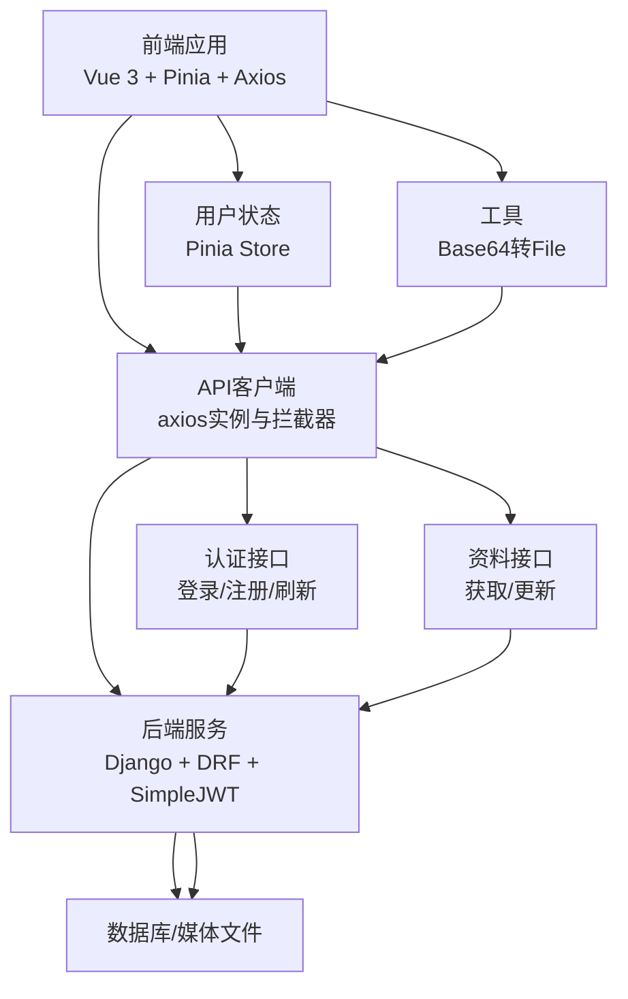
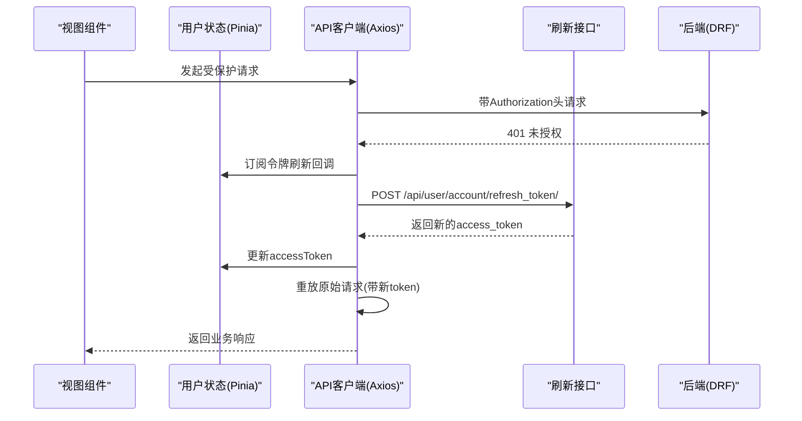
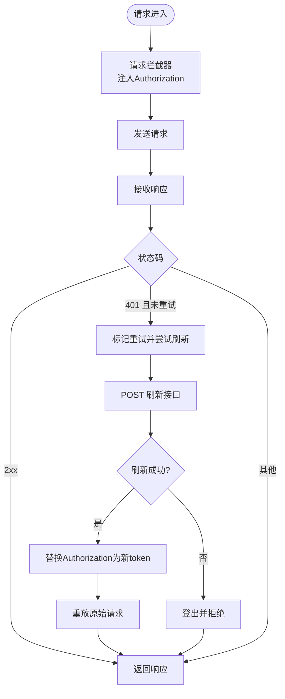
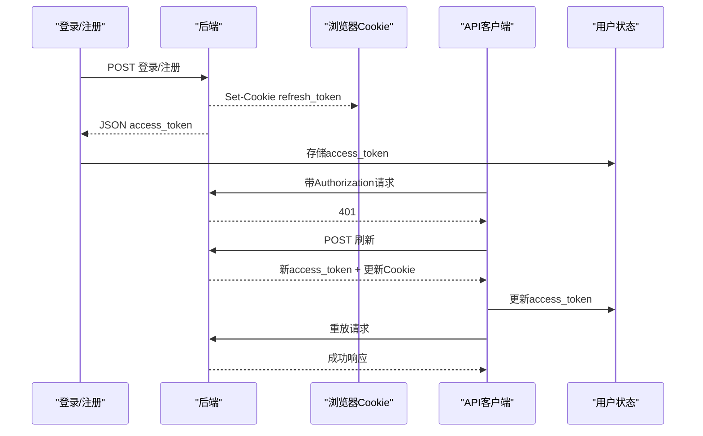
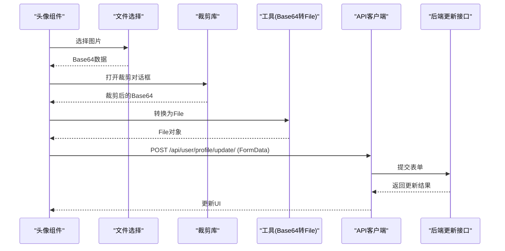
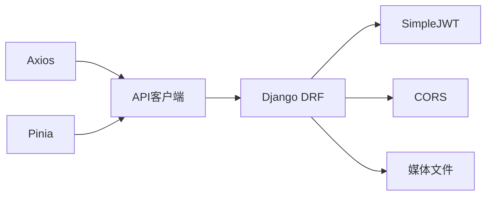

# API集成

<cite>
**本文引用的文件**
- [frontend/src/js/http/api.js](file://frontend/src/js/http/api.js)
- [frontend/src/stores/user.js](file://frontend/src/stores/user.js)
- [frontend/src/js/utils/base64_to_file.js](file://frontend/src/js/utils/base64_to_file.js)
- [frontend/src/views/user/account/LoginIndex.vue](file://frontend/src/views/user/account/LoginIndex.vue)
- [frontend/src/views/user/account/RegisterIndex.vue](file://frontend/src/views/user/account/RegisterIndex.vue)
- [frontend/src/views/user/profile/ProfileIndex.vue](file://frontend/src/views/user/profile/ProfileIndex.vue)
- [frontend/src/views/user/profile/components/Photo.vue](file://frontend/src/views/user/profile/components/Photo.vue)
- [frontend/package.json](file://frontend/package.json)
- [backend/web/views/user/account/login.py](file://backend/web/views/user/account/login.py)
- [backend/web/views/user/account/register.py](file://backend/web/views/user/account/register.py)
- [backend/web/views/user/account/refresh_token.py](file://backend/web/views/user/account/refresh_token.py)
- [backend/web/views/user/account/get_user_info.py](file://backend/web/views/user/account/get_user_info.py)
- [backend/web/views/user/profile/update.py](file://backend/web/views/user/profile/update.py)
- [backend/web/views/utils/photo.py](file://backend/web/views/utils/photo.py)
- [backend/backend/settings.py](file://backend/backend/settings.py)
- [frontend/src/main.js](file://frontend/src/main.js)
</cite>

## 目录
1. [引言](#引言)
2. [项目结构](#项目结构)
3. [核心组件](#核心组件)
4. [架构总览](#架构总览)
5. [详细组件分析](#详细组件分析)
6. [依赖分析](#依赖分析)
7. [性能考虑](#性能考虑)
8. [故障排查指南](#故障排查指南)
9. [结论](#结论)
10. [附录](#附录)

## 引言
本文件围绕前端API客户端的配置与封装、JWT令牌的自动管理、文件上传流程以及最佳实践进行系统化说明。内容覆盖Axios实例配置、请求/响应拦截器、GET/POST等HTTP方法的使用模式、令牌存储与注入、过期刷新机制、Base64到文件的转换、文件格式与上传进度管理，并给出错误处理、重试与性能优化建议。

## 项目结构
前端采用Vue 3 + Pinia + Axios，后端采用Django + Django REST Framework + SimpleJWT。API客户端集中于单文件封装，配合Pinia状态管理完成令牌与用户信息的全局维护；文件上传通过前端裁剪与Base64转换后提交至后端。

图示来源
- [frontend/src/js/http/api.js:1-92](file://frontend/src/js/http/api.js#L1-L92)
- [frontend/src/stores/user.js:1-59](file://frontend/src/stores/user.js#L1-L59)
- [frontend/src/js/utils/base64_to_file.js:1-10](file://frontend/src/js/utils/base64_to_file.js#L1-L10)
- [backend/backend/settings.py:133-158](file://backend/backend/settings.py#L133-L158)

章节来源
- [frontend/src/js/http/api.js:1-92](file://frontend/src/js/http/api.js#L1-L92)
- [frontend/src/stores/user.js:1-59](file://frontend/src/stores/user.js#L1-L59)
- [frontend/src/js/utils/base64_to_file.js:1-10](file://frontend/src/js/utils/base64_to_file.js#L1-L10)
- [backend/backend/settings.py:133-158](file://backend/backend/settings.py#L133-L158)

## 核心组件
- Axios客户端与拦截器：统一设置基础URL、携带Authorization头、处理401并自动刷新令牌、并发请求的刷新队列控制。
- 用户状态管理：集中维护accessToken、用户信息、登录态判断与登出清理。
- 文件上传工具：将Base64数据转换为File对象，便于FormData上传。
- 视图层调用：登录/注册/资料更新等页面通过API客户端发起请求，处理响应与错误。

章节来源
- [frontend/src/js/http/api.js:14-92](file://frontend/src/js/http/api.js#L14-L92)
- [frontend/src/stores/user.js:4-59](file://frontend/src/stores/user.js#L4-L59)
- [frontend/src/js/utils/base64_to_file.js:1-10](file://frontend/src/js/utils/base64_to_file.js#L1-L10)

## 架构总览
前后端通过Axios客户端进行通信，后端使用SimpleJWT进行认证，Cookie中保存refresh_token，访问令牌过期时由前端触发刷新流程，成功后重放原始请求。

图示来源
- [frontend/src/js/http/api.js:46-90](file://frontend/src/js/http/api.js#L46-L90)
- [frontend/src/stores/user.js:22-24](file://frontend/src/stores/user.js#L22-L24)
- [backend/web/views/user/account/refresh_token.py:7-36](file://backend/web/views/user/account/refresh_token.py#L7-L36)

章节来源
- [frontend/src/js/http/api.js:46-90](file://frontend/src/js/http/api.js#L46-L90)
- [backend/web/views/user/account/refresh_token.py:7-36](file://backend/web/views/user/account/refresh_token.py#L7-L36)

## 详细组件分析

### Axios客户端与拦截器
- 基础配置
  - 基础URL：统一前缀，便于迁移与测试。
  - 凭据携带：withCredentials开启，确保Cookie随请求发送。
- 请求拦截器
  - 从Pinia状态读取accessToken，注入Authorization头。
- 响应拦截器
  - 识别401未授权且非重试请求。
  - 并发刷新控制：使用标志位与订阅队列避免重复刷新。
  - 刷新流程：POST刷新接口，成功则更新accessToken并重放原始请求；失败则登出并拒绝重试。
  - 其他错误透传，保持原有Promise行为。

图示来源
- [frontend/src/js/http/api.js:16-90](file://frontend/src/js/http/api.js#L16-L90)

章节来源
- [frontend/src/js/http/api.js:14-92](file://frontend/src/js/http/api.js#L14-L92)

### JWT令牌的自动管理
- 前端
  - accessToken存入Pinia状态，请求拦截器自动注入。
  - 刷新订阅与并发控制，避免重复刷新。
  - 刷新成功后更新状态，失败则清空状态并中断后续请求。
- 后端
  - 登录/注册接口返回access_token，并设置HttpOnly Cookie保存refresh_token。
  - 刷新接口校验Cookie中的refresh_token，支持轮换与黑名单策略。
  - 受保护接口要求认证，未认证返回401。

图示来源
- [frontend/src/views/user/account/LoginIndex.vue:15-41](file://frontend/src/views/user/account/LoginIndex.vue#L15-L41)
- [frontend/src/views/user/account/RegisterIndex.vue:16-45](file://frontend/src/views/user/account/RegisterIndex.vue#L16-L45)
- [backend/web/views/user/account/login.py:9-46](file://backend/web/views/user/account/login.py#L9-L46)
- [backend/web/views/user/account/register.py:9-42](file://backend/web/views/user/account/register.py#L9-L42)
- [backend/web/views/user/account/refresh_token.py:7-36](file://backend/web/views/user/account/refresh_token.py#L7-L36)
- [frontend/src/js/http/api.js:46-90](file://frontend/src/js/http/api.js#L46-L90)

章节来源
- [frontend/src/stores/user.js:22-39](file://frontend/src/stores/user.js#L22-L39)
- [backend/web/views/user/account/login.py:9-46](file://backend/web/views/user/account/login.py#L9-L46)
- [backend/web/views/user/account/register.py:9-42](file://backend/web/views/user/account/register.py#L9-L42)
- [backend/web/views/user/account/refresh_token.py:7-36](file://backend/web/views/user/account/refresh_token.py#L7-L36)

### 文件上传与Base64转换
- 前端裁剪与转换
  - 图片选择后读取为Base64，弹窗裁剪后得到Base64结果。
  - 使用工具函数将Base64转换为File对象，再通过FormData上传。
- 后端处理
  - 受保护接口，仅允许认证用户更新资料。
  - 处理username/profile必填校验与唯一性校验。
  - 可选上传photo，若存在则删除旧头像并保存新头像。
- 上传进度
  - 当前实现未显式展示上传进度；可通过在Axios层面监听上传事件实现。

图示来源
- [frontend/src/views/user/profile/components/Photo.vue:43-66](file://frontend/src/views/user/profile/components/Photo.vue#L43-L66)
- [frontend/src/js/utils/base64_to_file.js:1-10](file://frontend/src/js/utils/base64_to_file.js#L1-L10)
- [frontend/src/views/user/profile/ProfileIndex.vue:33-52](file://frontend/src/views/user/profile/ProfileIndex.vue#L33-L52)
- [backend/web/views/user/profile/update.py:12-62](file://backend/web/views/user/profile/update.py#L12-L62)
- [backend/web/views/utils/photo.py:9-13](file://backend/web/views/utils/photo.py#L9-L13)

章节来源
- [frontend/src/views/user/profile/components/Photo.vue:43-66](file://frontend/src/views/user/profile/components/Photo.vue#L43-L66)
- [frontend/src/js/utils/base64_to_file.js:1-10](file://frontend/src/js/utils/base64_to_file.js#L1-L10)
- [frontend/src/views/user/profile/ProfileIndex.vue:33-52](file://frontend/src/views/user/profile/ProfileIndex.vue#L33-L52)
- [backend/web/views/user/profile/update.py:12-62](file://backend/web/views/user/profile/update.py#L12-L62)
- [backend/web/views/utils/photo.py:9-13](file://backend/web/views/utils/photo.py#L9-L13)

### API使用模式与参数处理
- GET/POST封装
  - 统一通过axios实例发起请求，自动携带Authorization与Cookie。
  - 参数通过JSON或FormData传递，后端按需解析。
- 错误处理
  - 响应拦截器捕获401并触发刷新；其他错误透传，由调用方处理。
- 页面调用示例
  - 登录/注册：向对应接口POST凭据，成功后写入accessToken与用户信息。
  - 资料更新：构造FormData，包含username/profile与可选photo。

章节来源
- [frontend/src/views/user/account/LoginIndex.vue:15-41](file://frontend/src/views/user/account/LoginIndex.vue#L15-L41)
- [frontend/src/views/user/account/RegisterIndex.vue:16-45](file://frontend/src/views/user/account/RegisterIndex.vue#L16-L45)
- [frontend/src/views/user/profile/ProfileIndex.vue:17-52](file://frontend/src/views/user/profile/ProfileIndex.vue#L17-L52)
- [frontend/src/js/http/api.js:46-90](file://frontend/src/js/http/api.js#L46-L90)

## 依赖分析
- 前端依赖
  - Vue 3、Pinia、Axios、vue-router、croppie、tailwindcss等。
- 后端依赖
  - Django、djangorestframework、django-cors-headers、简单JWT。
- 关键配置
  - CORS允许凭据，允许本地开发源。
  - SimpleJWT配置访问令牌与刷新令牌生命周期及轮换策略。
  - 媒体文件根路径与URL映射。

图示来源
- [frontend/package.json:11-24](file://frontend/package.json#L11-L24)
- [backend/backend/settings.py:133-158](file://backend/backend/settings.py#L133-L158)

章节来源
- [frontend/package.json:11-24](file://frontend/package.json#L11-L24)
- [backend/backend/settings.py:133-158](file://backend/backend/settings.py#L133-L158)

## 性能考虑
- 请求合并与去重
  - 对相同URL的并发请求，利用刷新队列避免重复刷新。
- 令牌预热
  - 在应用启动时检测Cookie中的refresh_token，必要时提前刷新，减少首请求延迟。
- 上传优化
  - 前端裁剪降低文件体积；后端对大文件可增加校验与分块策略。
- 缓存与节流
  - 对频繁读取的用户信息可在Pinia缓存；对高频请求增加防抖/节流。
- 网络超时与重试
  - 为刷新接口设置合理超时；对外部请求可引入指数退避重试。

## 故障排查指南
- 401未授权
  - 检查请求头Authorization是否存在；确认accessToken是否过期。
  - 若触发刷新仍失败，确认Cookie中refresh_token是否存在且未过期。
- 登录/注册失败
  - 校验用户名/密码是否为空；后端唯一性约束是否触发。
- 文件上传失败
  - 检查FormData字段命名与后端期望是否一致；确认文件类型与大小限制。
- CORS问题
  - 确认CORS允许凭据与开发源；后端是否正确设置Cookie属性。
- 令牌轮换与黑名单
  - 若启用ROTATE_REFRESH_TOKENS，注意刷新后旧refresh_token失效。

章节来源
- [frontend/src/js/http/api.js:46-90](file://frontend/src/js/http/api.js#L46-L90)
- [backend/web/views/user/account/login.py:9-46](file://backend/web/views/user/account/login.py#L9-L46)
- [backend/web/views/user/account/register.py:9-42](file://backend/web/views/user/account/register.py#L9-L42)
- [backend/web/views/user/account/refresh_token.py:7-36](file://backend/web/views/user/account/refresh_token.py#L7-L36)
- [backend/backend/settings.py:153-158](file://backend/backend/settings.py#L153-L158)

## 结论
本项目通过Axios统一客户端与拦截器、Pinia集中状态管理、后端SimpleJWT认证体系，实现了可靠的API集成方案。结合前端裁剪与Base64转换，满足头像上传场景；通过并发刷新控制与401自动恢复，提升用户体验。建议在生产环境进一步完善上传进度、网络重试与CORS策略配置。

## 附录
- 关键接口
  - 登录/注册：POST /api/user/account/login/、POST /api/user/account/register/
  - 刷新：POST /api/user/account/refresh_token/
  - 获取用户信息：GET /api/user/account/get_user_info/
  - 更新资料：POST /api/user/profile/update/
- 关键配置
  - 基础URL、CORS允许凭据、SimpleJWT生命周期与轮换策略、媒体文件路径与URL。

章节来源
- [backend/web/views/user/account/login.py:9-46](file://backend/web/views/user/account/login.py#L9-L46)
- [backend/web/views/user/account/register.py:9-42](file://backend/web/views/user/account/register.py#L9-L42)
- [backend/web/views/user/account/refresh_token.py:7-36](file://backend/web/views/user/account/refresh_token.py#L7-L36)
- [backend/web/views/user/account/get_user_info.py:8-24](file://backend/web/views/user/account/get_user_info.py#L8-L24)
- [backend/web/views/user/profile/update.py:12-62](file://backend/web/views/user/profile/update.py#L12-L62)
- [backend/backend/settings.py:133-158](file://backend/backend/settings.py#L133-L158)