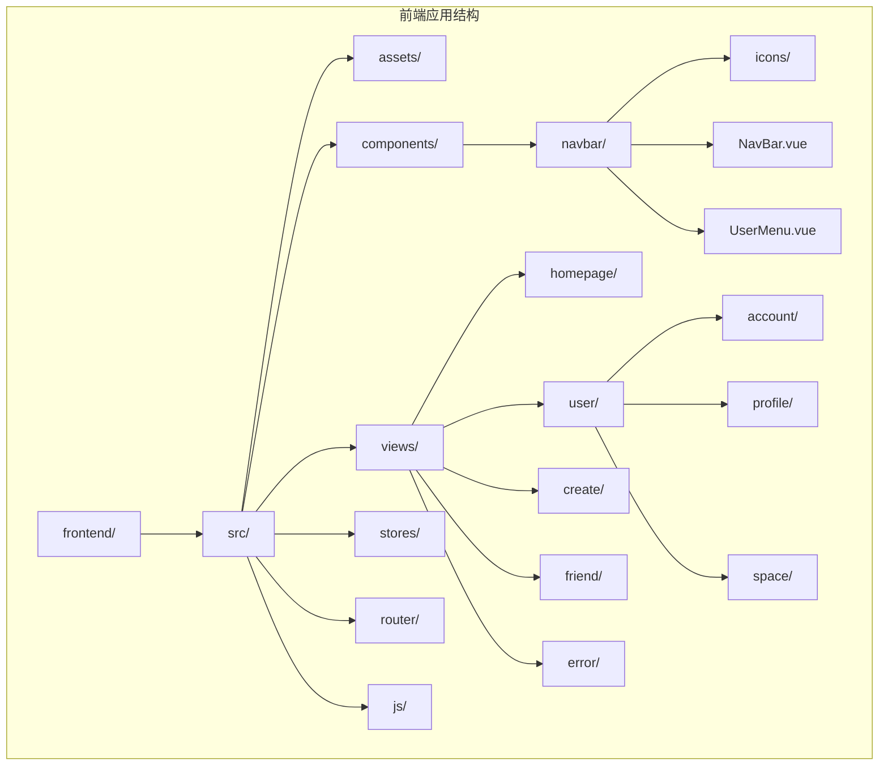
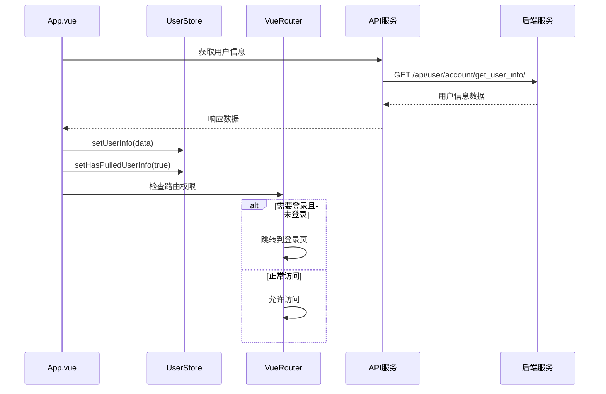
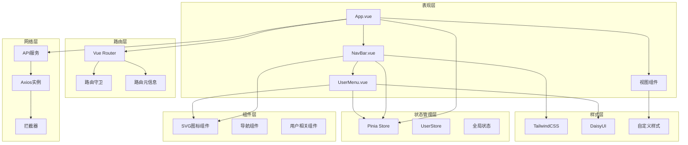
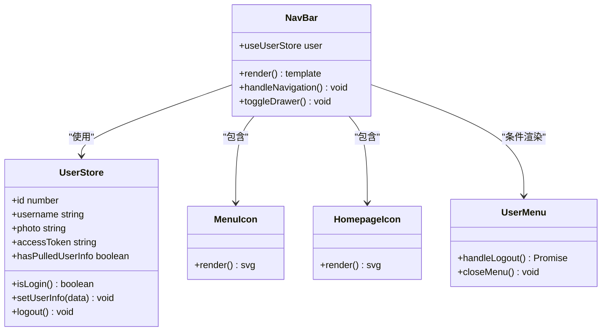
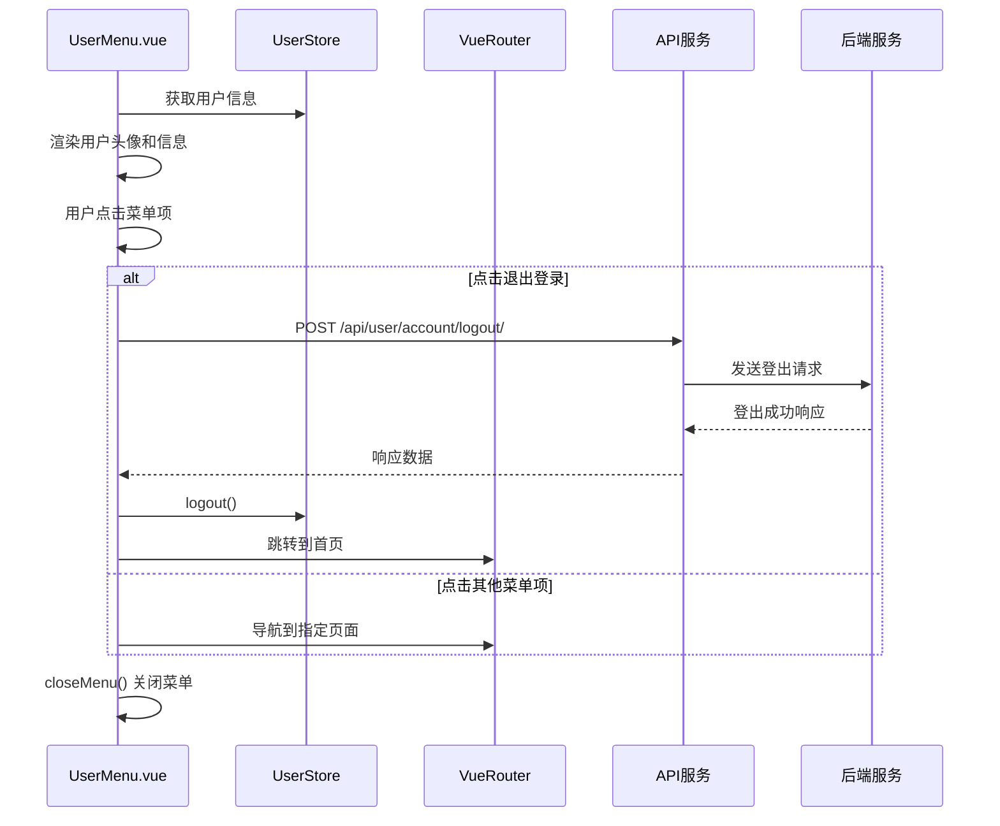
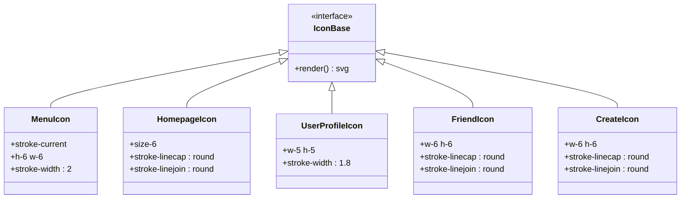
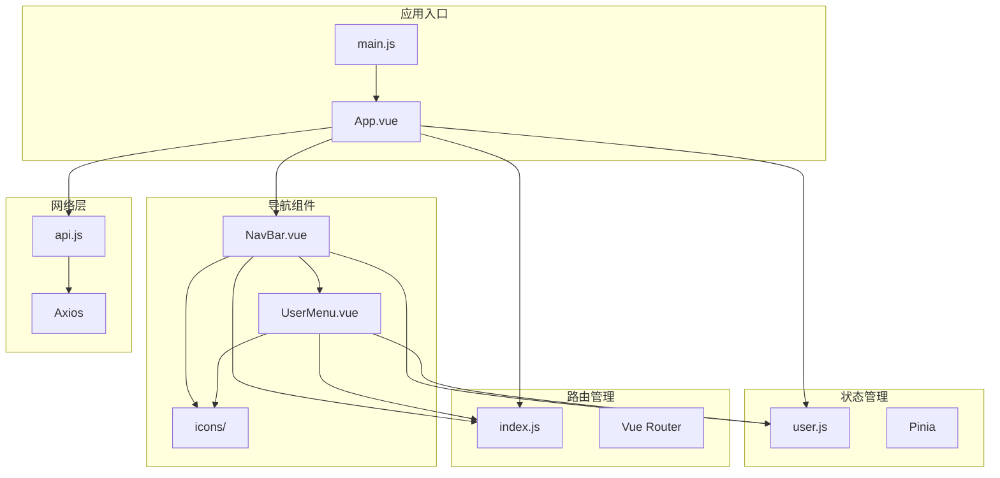

# Vue组件系统

<cite>
**本文档引用的文件**
- [App.vue](file://frontend/src/App.vue)
- [main.js](file://frontend/src/main.js)
- [NavBar.vue](file://frontend/src/components/navbar/NavBar.vue)
- [UserMenu.vue](file://frontend/src/components/navbar/UserMenu.vue)
- [user.js](file://frontend/src/stores/user.js)
- [api.js](file://frontend/src/js/http/api.js)
- [index.js](file://frontend/src/router/index.js)
- [MenuIcon.vue](file://frontend/src/components/navbar/icons/MenuIcon.vue)
- [HomepageIcon.vue](file://frontend/src/components/navbar/icons/HomepageIcon.vue)
- [UserProfileIcon.vue](file://frontend/src/components/navbar/icons/UserProfileIcon.vue)
- [main.css](file://frontend/src/assets/main.css)
- [package.json](file://frontend/package.json)
</cite>

## 目录
1. [简介](#简介)
2. [项目结构](#项目结构)
3. [核心组件](#核心组件)
4. [架构概览](#架构概览)
5. [详细组件分析](#详细组件分析)
6. [依赖关系分析](#依赖关系分析)
7. [性能考虑](#性能考虑)
8. [故障排除指南](#故障排除指南)
9. [结论](#结论)
10. [附录](#附录)

## 简介

这是一个基于Vue 3的现代化前端应用，采用Composition API和现代工具链构建。该系统实现了完整的用户认证流程、响应式导航栏和可复用的SVG图标组件系统。项目使用Vite作为构建工具，TailwindCSS和DaisyUI作为样式框架，Pinia作为状态管理，Vue Router进行路由管理。

## 项目结构

项目采用功能模块化的目录结构，主要分为以下层次：



**图表来源**
- [main.js:1-15](file://frontend/src/main.js#L1-L15)
- [App.vue:1-43](file://frontend/src/App.vue#L1-L43)

**章节来源**
- [main.js:1-15](file://frontend/src/main.js#L1-L15)
- [package.json:1-30](file://frontend/package.json#L1-L30)

## 核心组件

### 应用根组件 App.vue

App.vue作为整个应用的根组件，承担着初始化和全局状态管理的重要职责：



**图表来源**
- [App.vue:13-31](file://frontend/src/App.vue#L13-L31)
- [user.js:41-43](file://frontend/src/stores/user.js#L41-L43)
- [index.js:93-101](file://frontend/src/router/index.js#L93-L101)

App.vue的核心设计理念：
- **延迟初始化**：在挂载时才进行用户信息拉取，避免阻塞应用启动
- **权限控制**：通过路由元信息实现细粒度的访问控制
- **状态同步**：确保用户状态与路由状态保持一致

**章节来源**
- [App.vue:1-43](file://frontend/src/App.vue#L1-L43)
- [user.js:1-59](file://frontend/src/stores/user.js#L1-L59)

## 架构概览

整个应用采用分层架构设计，各层职责清晰分离：



**图表来源**
- [main.js:9-14](file://frontend/src/main.js#L9-L14)
- [App.vue:3-7](file://frontend/src/App.vue#L3-L7)
- [NavBar.vue:3-9](file://frontend/src/components/navbar/NavBar.vue#L3-L9)

## 详细组件分析

### 导航栏组件 NavBar.vue

NavBar.vue是应用的核心导航组件，实现了响应式布局和复杂的交互逻辑：



**图表来源**
- [NavBar.vue:1-83](file://frontend/src/components/navbar/NavBar.vue#L1-L83)
- [user.js:4-59](file://frontend/src/stores/user.js#L4-L59)
- [MenuIcon.vue:1-17](file://frontend/src/components/navbar/icons/MenuIcon.vue#L1-L17)
- [HomepageIcon.vue:1-22](file://frontend/src/components/navbar/icons/HomepageIcon.vue#L1-L22)

#### 组件通信模式

NavBar.vue采用了多种组件通信模式：

1. **状态共享**：通过Pinia Store实现跨组件状态共享
2. **条件渲染**：根据用户登录状态动态显示不同内容
3. **事件处理**：处理用户交互事件并触发相应动作

#### Props传递机制

虽然NavBar.vue没有显式的props定义，但通过以下方式实现数据传递：
- 直接从store读取用户状态
- 通过路由参数传递导航目标
- 使用插槽实现内容投影

**章节来源**
- [NavBar.vue:1-83](file://frontend/src/components/navbar/NavBar.vue#L1-L83)
- [user.js:18-20](file://frontend/src/stores/user.js#L18-L20)

### UserMenu.vue 用户菜单组件

UserMenu.vue实现了完整的用户下拉菜单功能：



**图表来源**
- [UserMenu.vue:19-31](file://frontend/src/components/navbar/UserMenu.vue#L19-L31)
- [user.js:33-39](file://frontend/src/stores/user.js#L33-L39)
- [api.js:20-27](file://frontend/src/js/http/api.js#L20-L27)

#### 下拉菜单逻辑

UserMenu.vue的下拉菜单逻辑具有以下特点：
- **条件渲染**：根据用户登录状态显示不同菜单项
- **动态内容**：菜单项内容根据用户信息动态更新
- **事件处理**：统一的事件处理机制管理所有用户交互

**章节来源**
- [UserMenu.vue:1-81](file://frontend/src/components/navbar/UserMenu.vue#L1-L81)
- [user.js:45-57](file://frontend/src/stores/user.js#L45-L57)

### 图标组件系统

图标组件系统采用SVG图标设计，具有高度的复用性和一致性：



**图表来源**
- [MenuIcon.vue:6-12](file://frontend/src/components/navbar/icons/MenuIcon.vue#L6-L12)
- [HomepageIcon.vue:6-17](file://frontend/src/components/navbar/icons/HomepageIcon.vue#L6-L17)
- [UserProfileIcon.vue:6-24](file://frontend/src/components/navbar/icons/UserProfileIcon.vue#L6-L24)

#### SVG图标设计模式

图标组件采用了统一的设计模式：
- **语义化SVG**：使用语义化的SVG元素和属性
- **尺寸标准化**：统一的尺寸规范（h-6/w-6, size-6等）
- **样式继承**：通过stroke-current继承父元素颜色
- **可扩展性**：易于添加新的图标类型

**章节来源**
- [MenuIcon.vue:1-17](file://frontend/src/components/navbar/icons/MenuIcon.vue#L1-L17)
- [HomepageIcon.vue:1-22](file://frontend/src/components/navbar/icons/HomepageIcon.vue#L1-L22)
- [UserProfileIcon.vue:1-29](file://frontend/src/components/navbar/icons/UserProfileIcon.vue#L1-L29)

## 依赖关系分析

### 外部依赖关系

```mermaid
graph LR
subgraph "核心依赖"
Vue[Vue 3.5.29]
Pinia[Pinia 3.0.4]
Router[Vue Router 5.0.3]
Axios[Axios 1.13.6]
end
subgraph "样式依赖"
Tailwind[TailwindCSS 4.2.1]
DaisyUI[DaisyUI 5.5.19]
Vite[Vite 7.3.1]
end
subgraph "开发工具"
VitePlugin[Vite Plugin Vue Devtools]
Croppie[Croppie 2.6.5]
end
App -> Vue
App -> Pinia
App -> Router
App -> Axios
NavBar -> Tailwind
UserMenu -> DaisyUI
Icons -> Vue
Build -> Vite
Build -> VitePlugin
```

**图表来源**
- [package.json:11-25](file://frontend/package.json#L11-L25)

### 内部依赖关系



**图表来源**
- [main.js:3-14](file://frontend/src/main.js#L3-L14)
- [App.vue:3-7](file://frontend/src/App.vue#L3-L7)
- [NavBar.vue:3-9](file://frontend/src/components/navbar/NavBar.vue#L3-L9)

**章节来源**
- [package.json:1-30](file://frontend/package.json#L1-L30)
- [main.js:1-15](file://frontend/src/main.js#L1-L15)

## 性能考虑

### 组件懒加载策略

应用采用了合理的组件懒加载策略来优化首屏加载性能：

1. **路由级别的懒加载**：通过动态导入实现按需加载
2. **图标组件的复用**：通过单一实例复用减少DOM节点
3. **条件渲染优化**：根据用户状态动态渲染组件

### 状态管理优化

- **细粒度状态**：将用户状态拆分为独立的响应式引用
- **状态缓存**：避免重复的API调用
- **状态同步**：确保全局状态的一致性

### 样式优化

- **原子化CSS**：使用TailwindCSS减少CSS体积
- **按需加载**：DaisyUI组件按需加载
- **样式作用域**：使用scoped样式避免样式冲突

## 故障排除指南

### 常见问题及解决方案

#### 用户认证问题

**问题**：用户登录后仍被重定向到登录页
**原因**：用户状态未正确设置或路由守卫逻辑问题
**解决方案**：
1. 检查UserStore的状态设置逻辑
2. 验证路由元信息配置
3. 确认API响应格式

#### 图标显示异常

**问题**：SVG图标不显示或样式错误
**原因**：CSS类名冲突或SVG属性设置错误
**解决方案**：
1. 检查图标组件的CSS类名
2. 验证SVG属性设置
3. 确认样式作用域配置

#### 菜单交互问题

**问题**：下拉菜单无法正常关闭
**原因**：事件处理逻辑或DOM操作问题
**解决方案**：
1. 检查closeMenu函数的实现
2. 验证事件监听器的绑定
3. 确认DOM元素的焦点管理

**章节来源**
- [user.js:18-20](file://frontend/src/stores/user.js#L18-L20)
- [UserMenu.vue:14-17](file://frontend/src/components/navbar/UserMenu.vue#L14-L17)
- [api.js:46-89](file://frontend/src/js/http/api.js#L46-L89)

## 结论

这个Vue组件系统展现了现代前端开发的最佳实践：

1. **架构清晰**：分层设计使得代码结构清晰，职责分离明确
2. **组件复用**：图标组件系统提供了良好的复用性
3. **状态管理**：Pinia的使用简化了状态管理复杂度
4. **用户体验**：响应式设计和流畅的交互提升了用户体验
5. **开发效率**：现代化的工具链提高了开发效率

系统在组件通信、状态管理、路由控制等方面都体现了成熟的前端架构设计思想，为后续的功能扩展奠定了良好的基础。

## 附录

### 组件开发最佳实践

#### 组件命名规范
- 使用PascalCase命名组件文件
- 采用语义化命名，避免缩写
- 相关组件放在同一目录下

#### 代码组织结构
- 将相关的组件放在同一目录
- 图标组件统一管理
- 视图组件按功能模块划分

#### 性能优化策略
- 合理使用计算属性和侦听器
- 避免不必要的响应式依赖
- 使用虚拟滚动处理大量数据
- 实现适当的缓存策略

#### 开发工具推荐
- 使用Vue Devtools进行调试
- 配置ESLint和Prettier保证代码质量
- 使用TypeScript提高类型安全
- 集成单元测试和集成测试