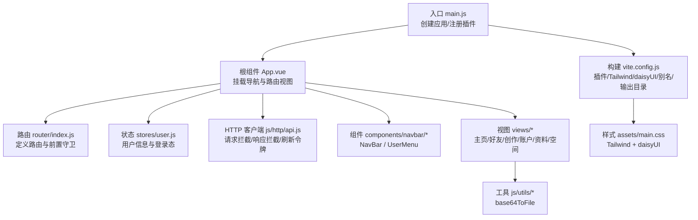
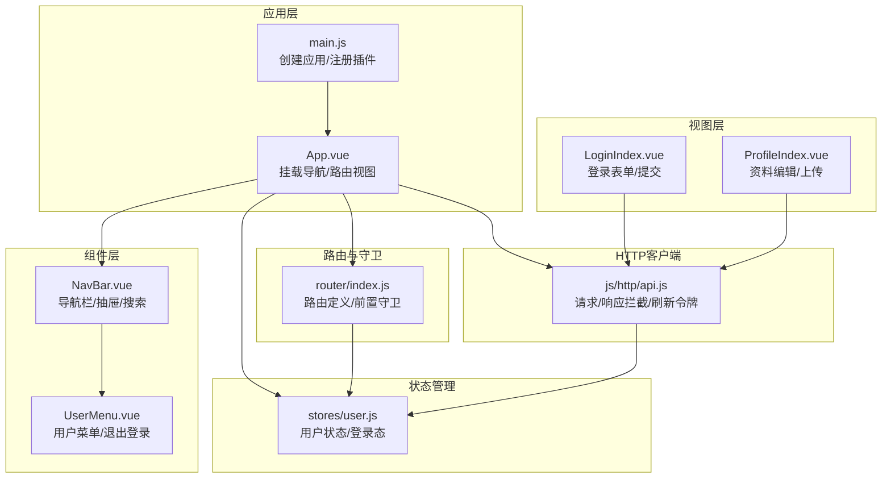
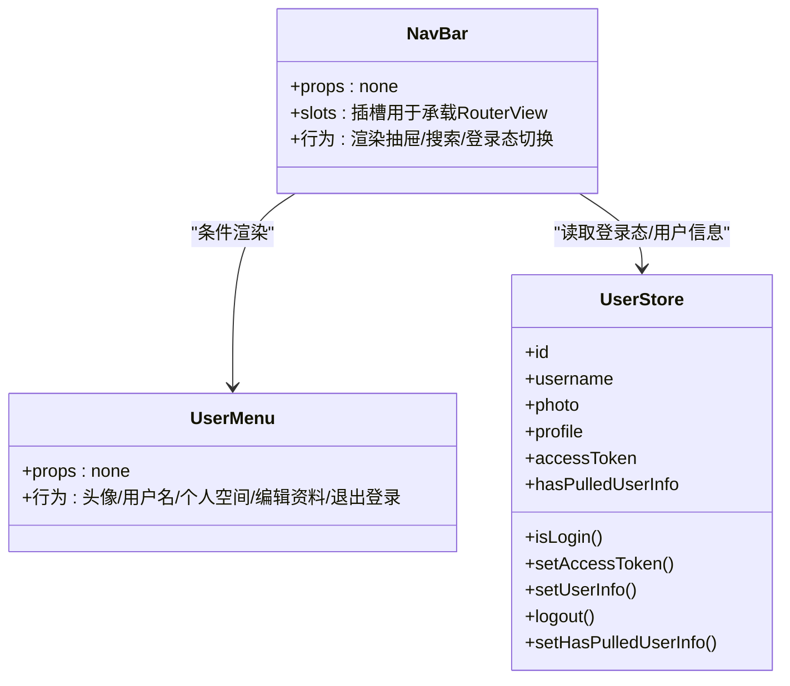
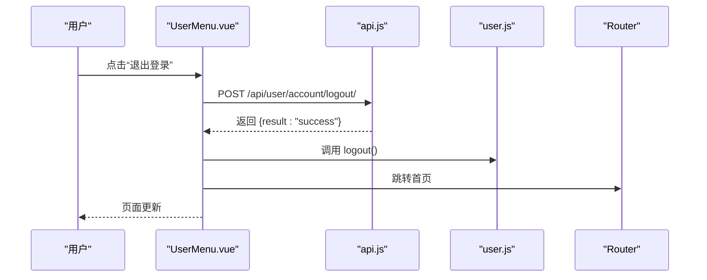
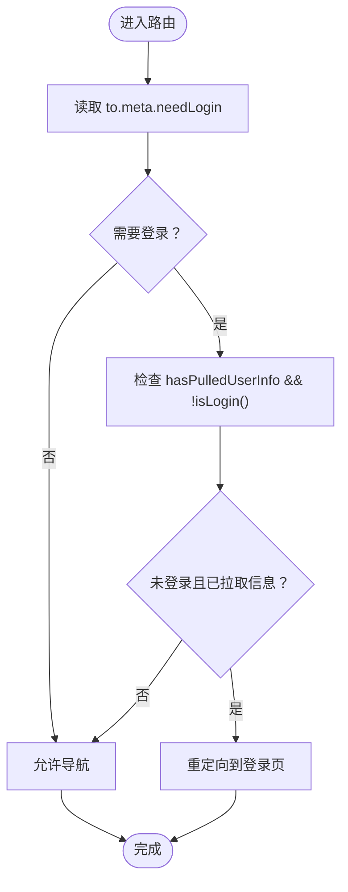
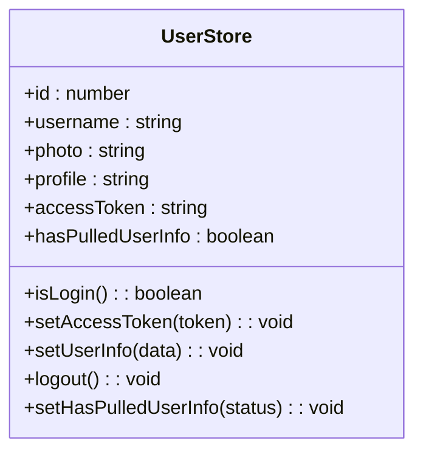
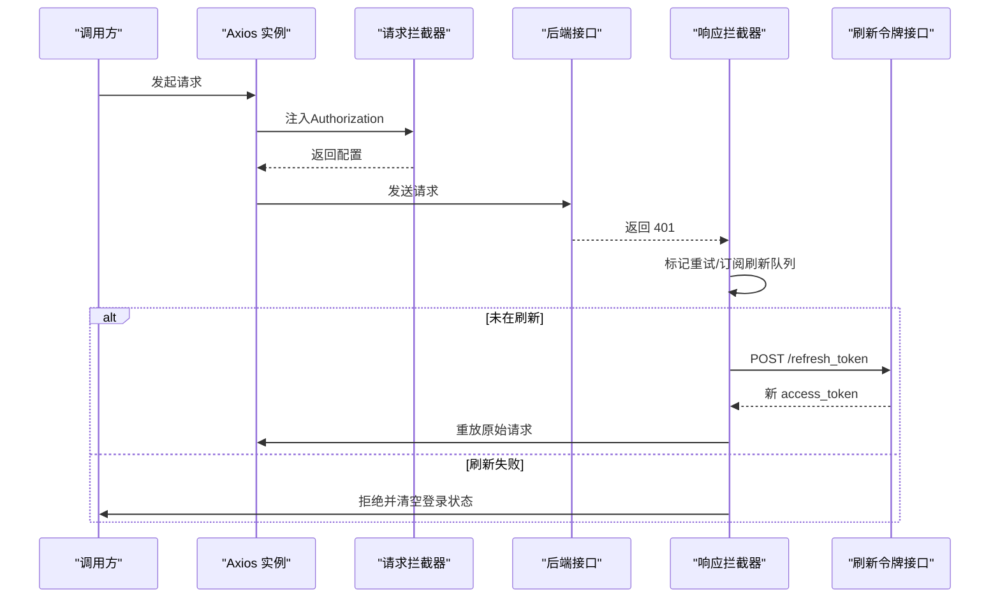
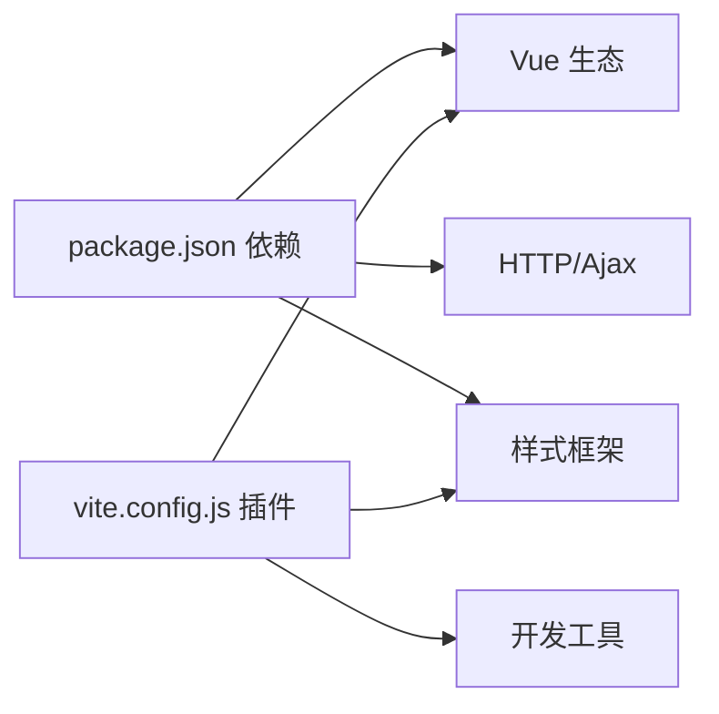

# 前端开发

<cite>
**本文引用的文件**
- [frontend/src/main.js](file://frontend/src/main.js)
- [frontend/src/App.vue](file://frontend/src/App.vue)
- [frontend/src/router/index.js](file://frontend/src/router/index.js)
- [frontend/src/stores/user.js](file://frontend/src/stores/user.js)
- [frontend/src/js/http/api.js](file://frontend/src/js/http/api.js)
- [frontend/src/components/navbar/NavBar.vue](file://frontend/src/components/navbar/NavBar.vue)
- [frontend/src/components/navbar/UserMenu.vue](file://frontend/src/components/navbar/UserMenu.vue)
- [frontend/src/views/user/account/LoginIndex.vue](file://frontend/src/views/user/account/LoginIndex.vue)
- [frontend/src/views/user/profile/ProfileIndex.vue](file://frontend/src/views/user/profile/ProfileIndex.vue)
- [frontend/src/js/utils/base64_to_file.js](file://frontend/src/js/utils/base64_to_file.js)
- [frontend/package.json](file://frontend/package.json)
- [frontend/vite.config.js](file://frontend/vite.config.js)
- [frontend/src/assets/main.css](file://frontend/src/assets/main.css)
- [frontend/README.md](file://frontend/README.md)
</cite>

## 目录
1. [引言](#引言)
2. [项目结构](#项目结构)
3. [核心组件](#核心组件)
4. [架构总览](#架构总览)
5. [详细组件分析](#详细组件分析)
6. [依赖关系分析](#依赖关系分析)
7. [性能考虑](#性能考虑)
8. [故障排查指南](#故障排查指南)
9. [结论](#结论)
10. [附录](#附录)

## 引言
本文件面向LLM_AIfriends项目的前端团队与协作开发者，系统性梳理基于Vue 3 + Vite的前端工程化实践，涵盖组件系统设计、路由配置、状态管理、API客户端与拦截器、组件通信与事件处理、错误处理策略，以及开发环境配置、调试技巧与性能优化建议。文档同时给出与实际源码映射的架构与流程图示，帮助不同技术背景的读者快速理解与高效迭代。

## 项目结构
前端采用标准的单页应用目录组织方式，核心模块包括：
- 应用入口与挂载：在入口文件中初始化Vue实例、注册Pinia与路由，并挂载根组件。
- 组件层：导航栏组件与用户菜单组件负责顶部导航与侧边抽屉式菜单，图标组件以可复用SVG形式提供。
- 视图层：按功能域划分视图，如主页、好友、创作、用户账户、个人资料、个人空间等。
- 路由层：集中定义路径、命名路由与登录态守卫。
- 状态层：使用Pinia实现轻量化的全局状态管理。
- HTTP层：封装Axios客户端，统一注入Authorization头、处理401刷新令牌与重试。
- 工具层：通用工具函数，如Base64转File。
- 构建层：Vite配置，集成TailwindCSS与daisyUI，构建产物输出至Django静态资源目录。

图表来源
- [frontend/src/main.js:1-15](file://frontend/src/main.js#L1-L15)
- [frontend/src/App.vue:1-43](file://frontend/src/App.vue#L1-L43)
- [frontend/src/router/index.js:1-104](file://frontend/src/router/index.js#L1-L104)
- [frontend/src/stores/user.js:1-59](file://frontend/src/stores/user.js#L1-L59)
- [frontend/src/js/http/api.js:1-92](file://frontend/src/js/http/api.js#L1-L92)
- [frontend/src/components/navbar/NavBar.vue:1-83](file://frontend/src/components/navbar/NavBar.vue#L1-L83)
- [frontend/src/components/navbar/UserMenu.vue:1-81](file://frontend/src/components/navbar/UserMenu.vue#L1-L81)
- [frontend/src/views/user/account/LoginIndex.vue:1-69](file://frontend/src/views/user/account/LoginIndex.vue#L1-L69)
- [frontend/src/views/user/profile/ProfileIndex.vue:1-77](file://frontend/src/views/user/profile/ProfileIndex.vue#L1-L77)
- [frontend/src/js/utils/base64_to_file.js:1-10](file://frontend/src/js/utils/base64_to_file.js#L1-L10)
- [frontend/vite.config.js:1-26](file://frontend/vite.config.js#L1-L26)
- [frontend/src/assets/main.css:1-2](file://frontend/src/assets/main.css#L1-L2)

章节来源
- [frontend/src/main.js:1-15](file://frontend/src/main.js#L1-L15)
- [frontend/src/App.vue:1-43](file://frontend/src/App.vue#L1-L43)
- [frontend/vite.config.js:1-26](file://frontend/vite.config.js#L1-L26)
- [frontend/src/assets/main.css:1-2](file://frontend/src/assets/main.css#L1-L2)

## 核心组件
- 应用入口与挂载：创建Vue应用，安装Pinia与路由，挂载根节点。
- 根组件：在挂载阶段拉取用户信息，设置“已拉取”标记，并根据路由meta与登录态决定是否跳转至登录页。
- 导航栏组件：左侧抽屉触发器、品牌名、中间搜索区；右侧根据登录态显示“创作”链接或用户菜单。
- 用户菜单组件：展示头像与用户名，提供个人空间、编辑资料、退出登录等入口。
- 路由：定义多条命名路由，含登录、注册、主页、好友、创作、个人空间、个人资料等；通过前置守卫控制访问权限。
- Pinia状态：集中存储用户id、用户名、头像、简介、访问令牌与“已拉取用户信息”标记，并提供登录态判断、设置令牌、设置用户信息、登出与标记方法。
- API客户端：统一基础地址、携带凭证、在请求头注入Bearer Token；对401错误进行刷新令牌处理，必要时回退到未登录状态。
- 工具函数：将Base64字符串转换为File对象，便于表单上传。

章节来源
- [frontend/src/main.js:1-15](file://frontend/src/main.js#L1-L15)
- [frontend/src/App.vue:1-43](file://frontend/src/App.vue#L1-L43)
- [frontend/src/components/navbar/NavBar.vue:1-83](file://frontend/src/components/navbar/NavBar.vue#L1-L83)
- [frontend/src/components/navbar/UserMenu.vue:1-81](file://frontend/src/components/navbar/UserMenu.vue#L1-L81)
- [frontend/src/router/index.js:1-104](file://frontend/src/router/index.js#L1-L104)
- [frontend/src/stores/user.js:1-59](file://frontend/src/stores/user.js#L1-L59)
- [frontend/src/js/http/api.js:1-92](file://frontend/src/js/http/api.js#L1-L92)
- [frontend/src/js/utils/base64_to_file.js:1-10](file://frontend/src/js/utils/base64_to_file.js#L1-L10)

## 架构总览
下图展示了从应用启动到路由导航、状态管理与HTTP交互的整体流程，以及组件间的依赖关系。

图表来源
- [frontend/src/main.js:1-15](file://frontend/src/main.js#L1-L15)
- [frontend/src/App.vue:1-43](file://frontend/src/App.vue#L1-L43)
- [frontend/src/router/index.js:1-104](file://frontend/src/router/index.js#L1-L104)
- [frontend/src/stores/user.js:1-59](file://frontend/src/stores/user.js#L1-L59)
- [frontend/src/js/http/api.js:1-92](file://frontend/src/js/http/api.js#L1-L92)
- [frontend/src/components/navbar/NavBar.vue:1-83](file://frontend/src/components/navbar/NavBar.vue#L1-L83)
- [frontend/src/components/navbar/UserMenu.vue:1-81](file://frontend/src/components/navbar/UserMenu.vue#L1-L81)
- [frontend/src/views/user/account/LoginIndex.vue:1-69](file://frontend/src/views/user/account/LoginIndex.vue#L1-L69)
- [frontend/src/views/user/profile/ProfileIndex.vue:1-77](file://frontend/src/views/user/profile/ProfileIndex.vue#L1-L77)

## 详细组件分析

### 组件系统设计与导航栏组件
- 设计要点
  - 抽屉式导航：左侧抽屉触发器与品牌名，右侧根据登录态动态渲染“创作”按钮或用户菜单。
  - 搜索区：居中放置搜索框与搜索按钮，支持占位提示。
  - 响应式：利用工具类实现移动端与桌面端的不同显示密度与提示文案。
- 关键交互
  - 登录态切换：当已拉取用户信息且未登录时，显示登录入口；登录后显示用户菜单。
  - 路由跳转：导航项与侧边菜单均通过命名路由跳转，确保路径变更与命名一致。
- 依赖关系
  - 使用用户状态判断登录态，依赖UserMenu组件展示用户操作菜单。

图表来源
- [frontend/src/components/navbar/NavBar.vue:1-83](file://frontend/src/components/navbar/NavBar.vue#L1-L83)
- [frontend/src/components/navbar/UserMenu.vue:1-81](file://frontend/src/components/navbar/UserMenu.vue#L1-L81)
- [frontend/src/stores/user.js:1-59](file://frontend/src/stores/user.js#L1-L59)

章节来源
- [frontend/src/components/navbar/NavBar.vue:1-83](file://frontend/src/components/navbar/NavBar.vue#L1-L83)
- [frontend/src/components/navbar/UserMenu.vue:1-81](file://frontend/src/components/navbar/UserMenu.vue#L1-L81)
- [frontend/src/stores/user.js:1-59](file://frontend/src/stores/user.js#L1-L59)

### 用户菜单组件
- 功能点
  - 展示当前用户头像与用户名，点击头像跳转个人空间。
  - 提供“个人空间”、“编辑资料”、“退出登录”入口。
  - 退出登录时调用后端接口，成功后清空本地状态并跳转首页。
- 事件处理
  - 关闭菜单：通过主动失焦实现下拉关闭。
  - 退出登录：异步调用后端接口，处理响应与错误。

图表来源
- [frontend/src/components/navbar/UserMenu.vue:19-31](file://frontend/src/components/navbar/UserMenu.vue#L19-L31)
- [frontend/src/js/http/api.js:20-30](file://frontend/src/js/http/api.js#L20-L30)
- [frontend/src/stores/user.js:33-39](file://frontend/src/stores/user.js#L33-L39)
- [frontend/src/router/index.js:14-23](file://frontend/src/router/index.js#L14-L23)

章节来源
- [frontend/src/components/navbar/UserMenu.vue:1-81](file://frontend/src/components/navbar/UserMenu.vue#L1-L81)
- [frontend/src/js/http/api.js:1-92](file://frontend/src/js/http/api.js#L1-L92)
- [frontend/src/stores/user.js:1-59](file://frontend/src/stores/user.js#L1-L59)
- [frontend/src/router/index.js:1-104](file://frontend/src/router/index.js#L1-L104)

### 路由配置与守卫
- 路由定义
  - 包含主页、好友、创作、404、登录、注册、个人空间、个人资料等命名路由。
  - 每个路由通过meta字段声明是否需要登录。
- 前置守卫
  - 在导航前检查目标路由是否需要登录，且用户已拉取信息但未登录时，强制跳转至登录页。
- 与根组件配合
  - 根组件在挂载时也会尝试拉取用户信息并校验登录态，避免重复逻辑。

图表来源
- [frontend/src/router/index.js:92-101](file://frontend/src/router/index.js#L92-L101)
- [frontend/src/App.vue:25-30](file://frontend/src/App.vue#L25-L30)
- [frontend/src/stores/user.js:18-20](file://frontend/src/stores/user.js#L18-L20)

章节来源
- [frontend/src/router/index.js:1-104](file://frontend/src/router/index.js#L1-L104)
- [frontend/src/App.vue:1-43](file://frontend/src/App.vue#L1-L43)
- [frontend/src/stores/user.js:1-59](file://frontend/src/stores/user.js#L1-L59)

### Pinia状态管理最佳实践
- Store设计
  - 使用组合式API风格的defineStore，集中管理用户信息与登录态。
  - 明确导出方法：登录态判断、设置令牌、设置用户信息、登出、标记“已拉取用户信息”。
- 数据绑定
  - 在组件中通过解构读取响应式数据，保证视图自动更新。
- 最佳实践
  - 将业务状态与UI状态分离；仅在Pinia中保存跨组件共享的核心状态。
  - 对于临时UI状态（如表单输入）可在组件内使用局部ref。

图表来源
- [frontend/src/stores/user.js:1-59](file://frontend/src/stores/user.js#L1-L59)

章节来源
- [frontend/src/stores/user.js:1-59](file://frontend/src/stores/user.js#L1-L59)

### API客户端配置、请求拦截与响应处理
- 基础配置
  - 基础URL指向后端服务，开启withCredentials以便携带Cookie。
- 请求拦截
  - 若存在访问令牌，则在请求头添加Authorization: Bearer。
- 响应拦截与刷新令牌
  - 当响应为401且未重试过时，进入刷新流程：
    - 订阅刷新回调队列，避免并发刷新。
    - 调用刷新接口，成功则更新访问令牌并重放原始请求；失败则清空登录状态并拒绝原始请求。
- 错误处理
  - 对异常进行日志记录与Promise链路透传，避免静默失败。

图表来源
- [frontend/src/js/http/api.js:16-92](file://frontend/src/js/http/api.js#L16-L92)
- [frontend/src/stores/user.js:22-24](file://frontend/src/stores/user.js#L22-L24)
- [frontend/src/stores/user.js:33-39](file://frontend/src/stores/user.js#L33-L39)

章节来源
- [frontend/src/js/http/api.js:1-92](file://frontend/src/js/http/api.js#L1-L92)
- [frontend/src/stores/user.js:1-59](file://frontend/src/stores/user.js#L1-L59)

### 组件通信模式与事件处理
- 父子通信
  - 通过模板引用在父组件中调用子组件公开方法，如资料编辑页通过模板引用收集子组件内部状态。
- 事件冒泡与自定义事件
  - 子组件向父组件传递数据时，采用模板引用+公开属性的方式，减少跨层级事件风暴。
- 路由与状态联动
  - 登录成功后设置令牌与用户信息，并通过路由跳转至首页；退出登录后清空状态并跳转首页。

章节来源
- [frontend/src/views/user/profile/ProfileIndex.vue:12-52](file://frontend/src/views/user/profile/ProfileIndex.vue#L12-L52)
- [frontend/src/views/user/account/LoginIndex.vue:15-41](file://frontend/src/views/user/account/LoginIndex.vue#L15-L41)
- [frontend/src/components/navbar/UserMenu.vue:19-31](file://frontend/src/components/navbar/UserMenu.vue#L19-L31)

### 错误处理策略
- 登录页
  - 前端对必填字段进行即时校验，后端返回错误信息时在页面提示。
- 资料编辑页
  - 前端对头像、用户名、简介进行非空校验，后端二次校验并返回结果。
- 通用错误
  - 对网络异常与后端错误进行日志打印，避免阻断用户操作。

章节来源
- [frontend/src/views/user/account/LoginIndex.vue:15-41](file://frontend/src/views/user/account/LoginIndex.vue#L15-L41)
- [frontend/src/views/user/profile/ProfileIndex.vue:17-52](file://frontend/src/views/user/profile/ProfileIndex.vue#L17-L52)
- [frontend/src/js/http/api.js:46-90](file://frontend/src/js/http/api.js#L46-L90)

## 依赖关系分析
- 运行时依赖
  - Vue 3、Vue Router、Pinia、Axios、TailwindCSS、daisyUI、croppie等。
- 开发时依赖
  - Vite、@vitejs/plugin-vue、vite-plugin-vue-devtools、@tailwindcss/vite等。
- 构建配置
  - 插件顺序：Vue → Vue DevTools → TailwindCSS；路径别名@指向src；构建输出至Django静态目录。

图表来源
- [frontend/package.json:11-25](file://frontend/package.json#L11-L25)
- [frontend/vite.config.js:10-25](file://frontend/vite.config.js#L10-L25)

章节来源
- [frontend/package.json:1-30](file://frontend/package.json#L1-L30)
- [frontend/vite.config.js:1-26](file://frontend/vite.config.js#L1-L26)

## 性能考虑
- 组件懒加载与路由分块
  - 将大型视图组件按需导入，减少首屏体积。
- 图片与资源优化
  - 使用合适的图片格式与尺寸，结合懒加载策略。
- 状态最小化
  - 将仅在组件内使用的状态保留在组件内，避免不必要的响应式开销。
- 请求缓存与去重
  - 对重复请求进行去重或短期缓存，降低后端压力。
- 构建优化
  - 启用生产构建压缩与Tree-shaking；合理拆分第三方库。

## 故障排查指南
- 登录后仍被重定向到登录页
  - 检查路由前置守卫条件与用户状态标记是否正确设置。
- 401频繁出现
  - 核对请求拦截器是否正确注入Authorization头；确认刷新令牌接口可用且返回新令牌。
- 退出登录无效
  - 确认后端logout接口返回成功并清理本地状态；检查路由跳转逻辑。
- 构建产物未更新
  - 确认Vite构建输出目录配置与Django静态资源目录一致；清理缓存后重新构建。

章节来源
- [frontend/src/router/index.js:92-101](file://frontend/src/router/index.js#L92-L101)
- [frontend/src/js/http/api.js:21-27](file://frontend/src/js/http/api.js#L21-L27)
- [frontend/src/js/http/api.js:46-90](file://frontend/src/js/http/api.js#L46-L90)
- [frontend/src/components/navbar/UserMenu.vue:19-31](file://frontend/src/components/navbar/UserMenu.vue#L19-L31)
- [frontend/vite.config.js:16-19](file://frontend/vite.config.js#L16-L19)

## 结论
本项目以Vue 3 + Vite为基础，结合Pinia与Axios实现了清晰的状态管理与HTTP拦截机制，配合路由守卫与组件化导航，形成了高内聚、低耦合的前端架构。通过模板引用与命名路由，组件通信简洁可靠；通过统一的请求/响应拦截与刷新令牌流程，提升了鉴权体验与健壮性。建议在后续迭代中进一步引入组件懒加载、状态持久化与更完善的错误边界处理，持续提升用户体验与可维护性。

## 附录
- 开发与调试
  - 推荐IDE与浏览器扩展见项目说明。
  - 使用Vite DevTools辅助调试组件与状态。
- 构建与部署
  - 开发：npm run dev；生产：npm run build；预览：npm run preview。
  - 构建产物输出至Django静态目录，便于后端统一托管。

章节来源
- [frontend/README.md:1-39](file://frontend/README.md#L1-L39)
- [frontend/vite.config.js:10-25](file://frontend/vite.config.js#L10-L25)