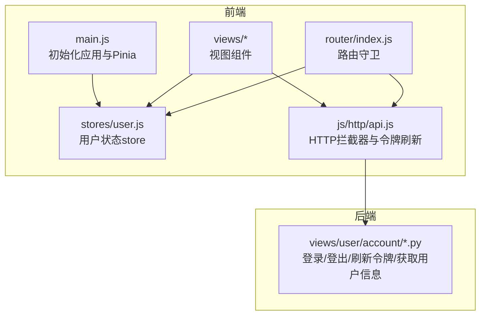
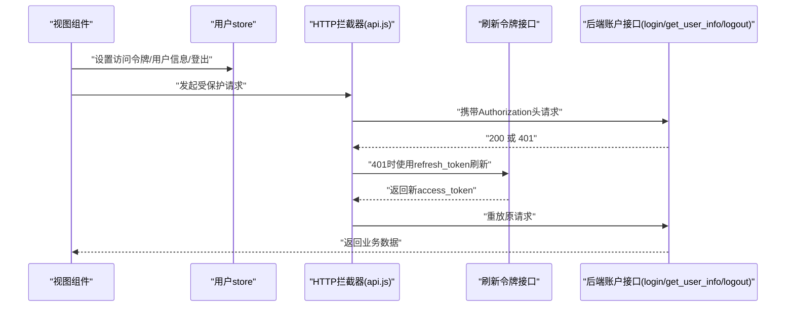
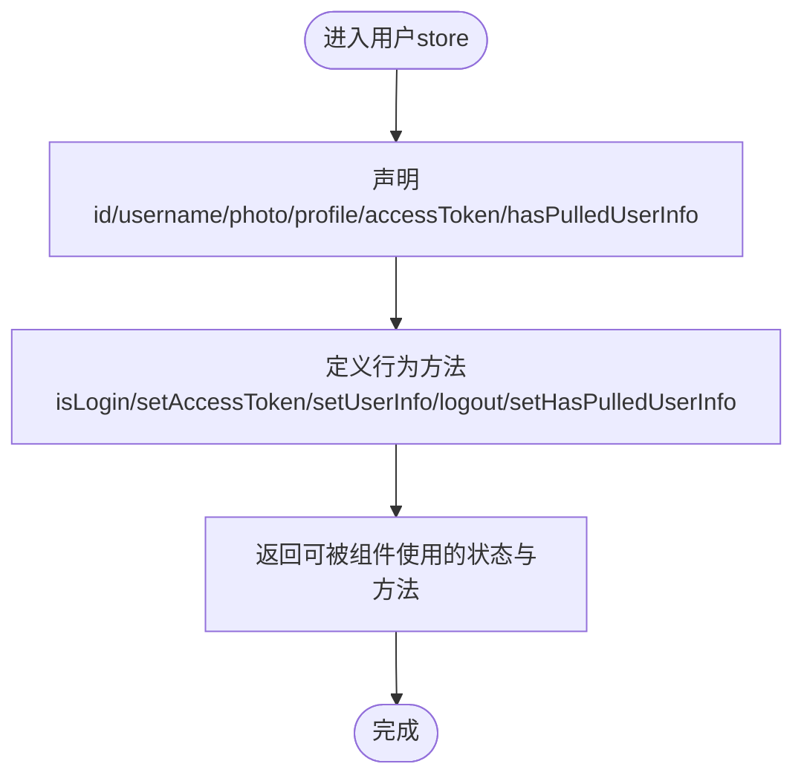
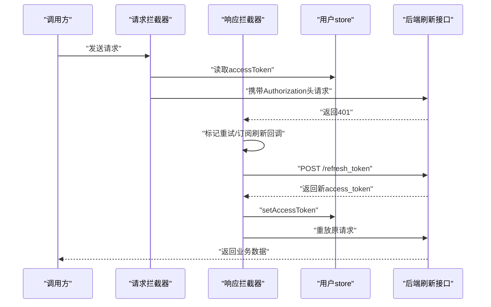
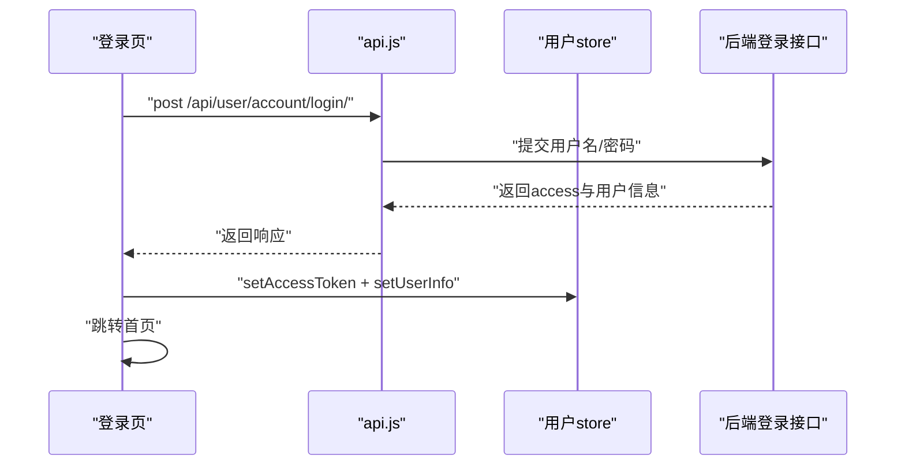
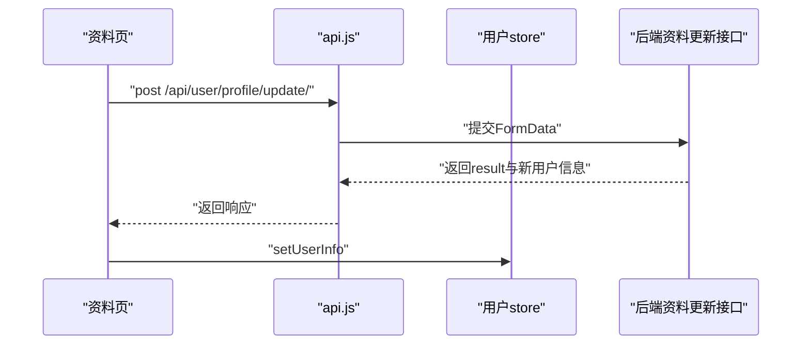
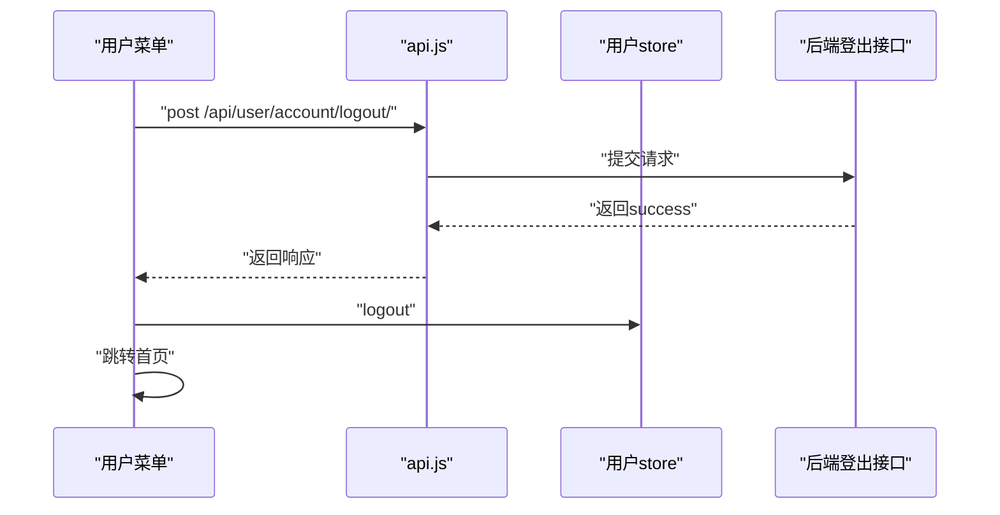
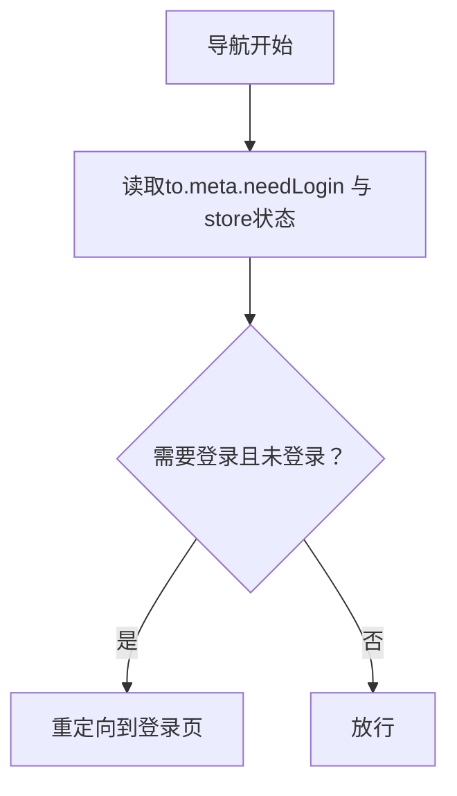
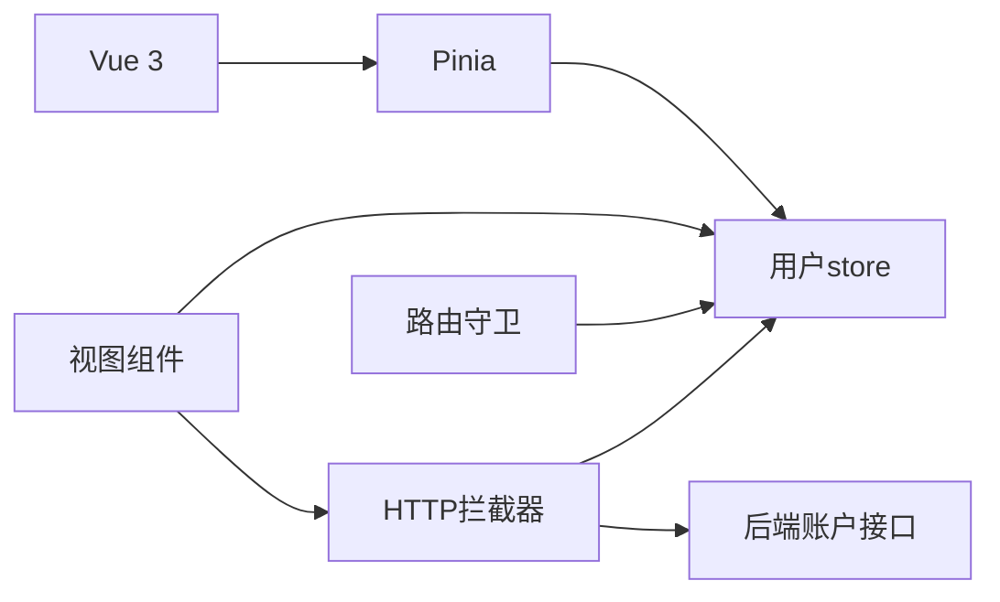

# 状态管理

<cite>
**本文引用的文件**
- [frontend/src/stores/user.js](file://frontend/src/stores/user.js)
- [frontend/src/main.js](file://frontend/src/main.js)
- [frontend/package.json](file://frontend/package.json)
- [frontend/src/js/http/api.js](file://frontend/src/js/http/api.js)
- [frontend/src/views/user/account/LoginIndex.vue](file://frontend/src/views/user/account/LoginIndex.vue)
- [frontend/src/views/user/profile/ProfileIndex.vue](file://frontend/src/views/user/profile/ProfileIndex.vue)
- [frontend/src/components/navbar/UserMenu.vue](file://frontend/src/components/navbar/UserMenu.vue)
- [frontend/src/router/index.js](file://frontend/src/router/index.js)
- [backend/web/views/user/account/login.py](file://backend/web/views/user/account/login.py)
- [backend/web/views/user/account/get_user_info.py](file://backend/web/views/user/account/get_user_info.py)
- [backend/web/views/user/account/logout.py](file://backend/web/views/user/account/logout.py)
- [backend/web/views/user/account/refresh_token.py](file://backend/web/views/user/account/refresh_token.py)
</cite>

## 目录
1. [引言](#引言)
2. [项目结构](#项目结构)
3. [核心组件](#核心组件)
4. [架构总览](#架构总览)
5. [详细组件分析](#详细组件分析)
6. [依赖分析](#依赖分析)
7. [性能考虑](#性能考虑)
8. [故障排查指南](#故障排查指南)
9. [结论](#结论)
10. [附录](#附录)

## 引言
本文件围绕前端状态管理展开，重点解析基于 Pinia 的用户状态管理实现，涵盖 store 定义、状态声明与 action 方法、与 API 的集成模式、异步数据获取与错误处理、响应式状态设计原则以及最佳实践。目标是帮助开发者快速理解并扩展用户态相关功能。

## 项目结构
前端采用 Vue 3 + Pinia 架构，状态集中在 stores 目录下的 user.js 中，通过全局挂载的 Pinia 实例提供响应式状态与方法。HTTP 请求通过 axios 封装的 api 模块统一注入 Authorization 头并在 401 时自动刷新令牌。路由守卫结合用户登录状态控制页面访问权限。

图表来源
- [frontend/src/main.js:1-15](file://frontend/src/main.js#L1-L15)
- [frontend/src/stores/user.js:1-59](file://frontend/src/stores/user.js#L1-L59)
- [frontend/src/js/http/api.js:1-92](file://frontend/src/js/http/api.js#L1-L92)
- [frontend/src/router/index.js:1-104](file://frontend/src/router/index.js#L1-L104)
- [backend/web/views/user/account/login.py:1-92](file://backend/web/views/user/account/login.py#L1-L92)
- [backend/web/views/user/account/logout.py:1-16](file://backend/web/views/user/account/logout.py#L1-L16)
- [backend/web/views/user/account/refresh_token.py:1-41](file://backend/web/views/user/account/refresh_token.py#L1-L41)
- [backend/web/views/user/account/get_user_info.py:1-25](file://backend/web/views/user/account/get_user_info.py#L1-L25)

章节来源
- [frontend/src/main.js:1-15](file://frontend/src/main.js#L1-L15)
- [frontend/package.json:1-30](file://frontend/package.json#L1-L30)

## 核心组件
- Pinia 全局实例：在入口文件中注册并挂载，为整个应用提供状态容器。
- 用户状态 store：集中管理用户标识、用户名、头像、简介、访问令牌与登录状态标记，并提供 setAccessToken、setUserInfo、logout、isLogin、setHasPulledUserInfo 等方法。
- HTTP 拦截器：统一注入 Authorization 头；当响应为 401 且未重试时，使用 cookie 中的 refresh_token 调用后端刷新接口，成功后重放原请求，失败则清空本地登录状态。
- 路由守卫：根据 meta.needLogin 与用户登录状态决定是否放行或重定向至登录页。
- 视图组件：登录页、资料页、用户菜单等组件通过 store 更新状态并驱动 UI。

章节来源
- [frontend/src/stores/user.js:1-59](file://frontend/src/stores/user.js#L1-L59)
- [frontend/src/js/http/api.js:1-92](file://frontend/src/js/http/api.js#L1-L92)
- [frontend/src/router/index.js:1-104](file://frontend/src/router/index.js#L1-L104)

## 架构总览
下图展示从前端组件到 HTTP 层再到后端接口的状态流转与鉴权链路。

图表来源
- [frontend/src/js/http/api.js:46-90](file://frontend/src/js/http/api.js#L46-L90)
- [frontend/src/stores/user.js:22-39](file://frontend/src/stores/user.js#L22-L39)
- [backend/web/views/user/account/login.py:9-46](file://backend/web/views/user/account/login.py#L9-L46)
- [backend/web/views/user/account/refresh_token.py:7-36](file://backend/web/views/user/account/refresh_token.py#L7-L36)
- [backend/web/views/user/account/get_user_info.py:8-24](file://backend/web/views/user/account/get_user_info.py#L8-L24)

## 详细组件分析

### 用户状态 store（user.js）
- 状态字段
  - id、username、photo、profile：用户基本信息
  - accessToken：当前访问令牌
  - hasPulledUserInfo：是否已拉取过用户信息（用于路由守卫判断）
- 行为方法
  - isLogin：基于 accessToken 是否存在判断登录态
  - setAccessToken：写入新令牌
  - setUserInfo：批量写入用户信息
  - logout：清空所有用户信息与令牌
  - setHasPulledUserInfo：切换“已拉取”标记
- 设计要点
  - 使用 ref 声明响应式状态，便于在模板与逻辑中直接使用
  - 将 isLogin 作为纯函数返回布尔值，避免在模板中重复读取 value
  - 提供 setHasPulledUserInfo 以配合路由守卫进行条件跳转

图表来源
- [frontend/src/stores/user.js:4-59](file://frontend/src/stores/user.js#L4-L59)

章节来源
- [frontend/src/stores/user.js:1-59](file://frontend/src/stores/user.js#L1-L59)

### HTTP 拦截器与令牌刷新（api.js）
- 请求阶段：从 store 读取 accessToken 并注入 Authorization 头
- 响应阶段：拦截 401 且未重试的请求
  - 订阅刷新回调，避免并发刷新
  - 调用后端刷新接口，成功则更新 store 中的 accessToken 并重放原请求
  - 刷新失败则调用 store.logout 清空本地状态
- 依赖
  - 后端刷新接口：/api/user/account/refresh_token/
  - store：setAccessToken、logout

图表来源
- [frontend/src/js/http/api.js:21-90](file://frontend/src/js/http/api.js#L21-L90)
- [frontend/src/stores/user.js:22-39](file://frontend/src/stores/user.js#L22-L39)
- [backend/web/views/user/account/refresh_token.py:7-36](file://backend/web/views/user/account/refresh_token.py#L7-L36)

章节来源
- [frontend/src/js/http/api.js:1-92](file://frontend/src/js/http/api.js#L1-L92)

### 登录流程（LoginIndex.vue）
- 输入校验：用户名/密码非空
- 发起登录请求：调用 api.post /api/user/account/login/
- 成功分支：将后端返回的 access、user_id、username、photo、profile 写入 store，并跳转首页
- 失败分支：显示后端返回的错误信息

图表来源
- [frontend/src/views/user/account/LoginIndex.vue:15-41](file://frontend/src/views/user/account/LoginIndex.vue#L15-L41)
- [frontend/src/stores/user.js:22-31](file://frontend/src/stores/user.js#L22-L31)
- [backend/web/views/user/account/login.py:9-46](file://backend/web/views/user/account/login.py#L9-L46)

章节来源
- [frontend/src/views/user/account/LoginIndex.vue:1-69](file://frontend/src/views/user/account/LoginIndex.vue#L1-L69)

### 资料更新流程（ProfileIndex.vue）
- 组装表单数据：包含 username、profile，仅在头像变更时上传图片
- 发起更新请求：调用 api.post /api/user/profile/update/
- 成功分支：使用后端返回的新信息更新 store
- 失败分支：显示后端返回的错误信息

图表来源
- [frontend/src/views/user/profile/ProfileIndex.vue:17-52](file://frontend/src/views/user/profile/ProfileIndex.vue#L17-L52)
- [frontend/src/stores/user.js:26-31](file://frontend/src/stores/user.js#L26-L31)

章节来源
- [frontend/src/views/user/profile/ProfileIndex.vue:1-77](file://frontend/src/views/user/profile/ProfileIndex.vue#L1-L77)

### 用户菜单与登出（UserMenu.vue）
- 展示用户头像与名称
- 触发登出：调用 api.post /api/user/account/logout/，成功后调用 store.logout 并跳转首页

图表来源
- [frontend/src/components/navbar/UserMenu.vue:19-31](file://frontend/src/components/navbar/UserMenu.vue#L19-L31)
- [frontend/src/stores/user.js:33-39](file://frontend/src/stores/user.js#L33-L39)
- [backend/web/views/user/account/logout.py:7-16](file://backend/web/views/user/account/logout.py#L7-L16)

章节来源
- [frontend/src/components/navbar/UserMenu.vue:1-81](file://frontend/src/components/navbar/UserMenu.vue#L1-L81)

### 路由守卫与登录态联动（router/index.js）
- 定义 meta.needLogin 控制页面是否需要登录
- beforeEach 中读取 store 的 hasPulledUserInfo 与 isLogin
- 若需要登录且未登录，则重定向到登录页

图表来源
- [frontend/src/router/index.js:93-101](file://frontend/src/router/index.js#L93-L101)
- [frontend/src/stores/user.js:18-20](file://frontend/src/stores/user.js#L18-L20)

章节来源
- [frontend/src/router/index.js:1-104](file://frontend/src/router/index.js#L1-L104)

## 依赖分析
- 前端依赖
  - Vue 3、Pinia、axios、vue-router
  - 开发工具：vite-plugin-vue-devtools（便于调试）
- 关键耦合点
  - 视图组件依赖 store 的方法与状态
  - HTTP 拦截器依赖 store 的 accessToken 与 logout
  - 路由守卫依赖 store 的 isLogin 与 hasPulledUserInfo
  - 后端接口提供登录、登出、刷新令牌、获取用户信息等能力

图表来源
- [frontend/package.json:11-25](file://frontend/package.json#L11-L25)
- [frontend/src/stores/user.js:1-59](file://frontend/src/stores/user.js#L1-L59)
- [frontend/src/js/http/api.js:1-92](file://frontend/src/js/http/api.js#L1-L92)
- [frontend/src/router/index.js:1-104](file://frontend/src/router/index.js#L1-L104)

章节来源
- [frontend/package.json:1-30](file://frontend/package.json#L1-L30)

## 性能考虑
- 响应式粒度：使用 ref 粒度化状态，避免不必要的组件重渲染
- 令牌刷新去重：通过 isRefreshing 与订阅队列避免并发刷新
- 条件更新：资料更新仅在头像变化时上传图片，减少网络开销
- 路由守卫：仅在 meta.needLogin 为真时才进行登录态判断，降低无谓计算
- 缓存策略：store 本身即轻量缓存，避免重复请求相同用户信息

## 故障排查指南
- 登录后仍提示未登录
  - 检查 store.hasPulledUserInfo 是否被置为 true
  - 确认 isLogin 返回值是否符合预期
  - 参考：[frontend/src/router/index.js:95-99](file://frontend/src/router/index.js#L95-L99)，[frontend/src/stores/user.js:18-20](file://frontend/src/stores/user.js#L18-L20)
- 401 但未自动刷新
  - 检查 HTTP 拦截器是否正确注入 Authorization 头
  - 确认后端 /api/user/account/refresh_token/ 是否可用且返回新 access_token
  - 参考：[frontend/src/js/http/api.js:21-90](file://frontend/src/js/http/api.js#L21-L90)，[backend/web/views/user/account/refresh_token.py:7-36](file://backend/web/views/user/account/refresh_token.py#L7-L36)
- 登出无效
  - 确认后端 /api/user/account/logout/ 已删除 refresh_token
  - 确认前端调用 store.logout 并跳转首页
  - 参考：[frontend/src/components/navbar/UserMenu.vue:19-31](file://frontend/src/components/navbar/UserMenu.vue#L19-L31)，[backend/web/views/user/account/logout.py:7-16](file://backend/web/views/user/account/logout.py#L7-L16)
- 资料更新失败
  - 检查后端 /api/user/profile/update/ 的参数与权限
  - 确认 store.setUserInfo 已被调用
  - 参考：[frontend/src/views/user/profile/ProfileIndex.vue:17-52](file://frontend/src/views/user/profile/ProfileIndex.vue#L17-L52)

章节来源
- [frontend/src/router/index.js:93-101](file://frontend/src/router/index.js#L93-L101)
- [frontend/src/js/http/api.js:21-90](file://frontend/src/js/http/api.js#L21-L90)
- [frontend/src/components/navbar/UserMenu.vue:19-31](file://frontend/src/components/navbar/UserMenu.vue#L19-L31)
- [frontend/src/views/user/profile/ProfileIndex.vue:17-52](file://frontend/src/views/user/profile/ProfileIndex.vue#L17-L52)

## 结论
本项目通过 Pinia 将用户状态与视图解耦，借助 axios 拦截器实现透明的令牌刷新与鉴权，配合路由守卫完成访问控制。整体设计遵循单一职责与最小暴露原则，具备良好的可维护性与扩展性。建议后续在 store 中引入持久化方案与类型约束，进一步提升稳定性与开发效率。

## 附录
- 最佳实践清单
  - store 模块化：按领域拆分 store，如 user、app 等，避免单 store 过大
  - 状态序列化：必要时引入持久化（如 localStorage/sessionStorage）并注意敏感信息
  - 开发工具：启用 vue-devtools 与 Pinia Devtools，便于观察状态变化
  - 错误处理：统一错误提示与日志上报，区分业务错误与网络错误
  - 性能优化：合理拆分组件、使用 computed 与浅拷贝、避免深层嵌套状态