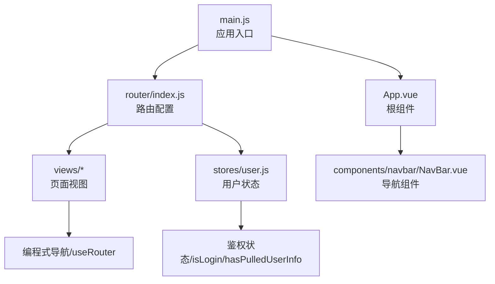
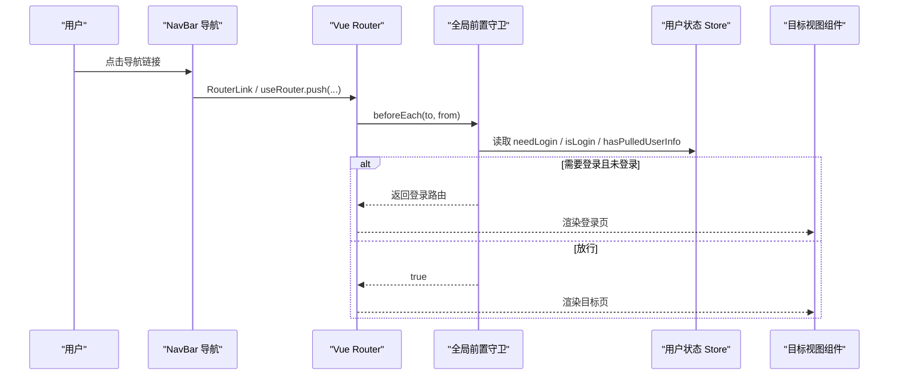
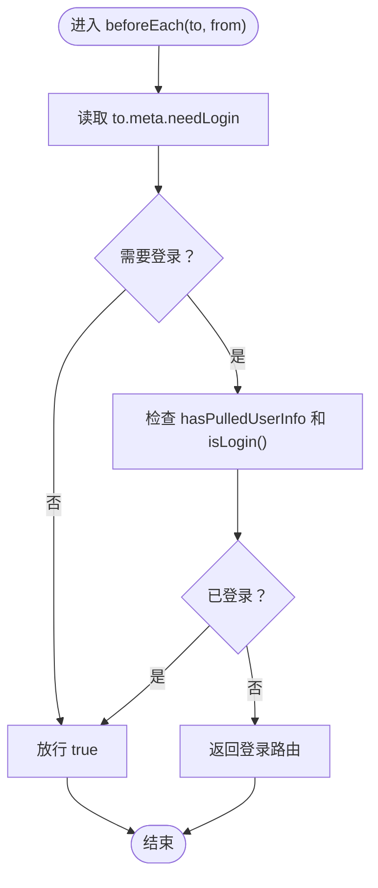
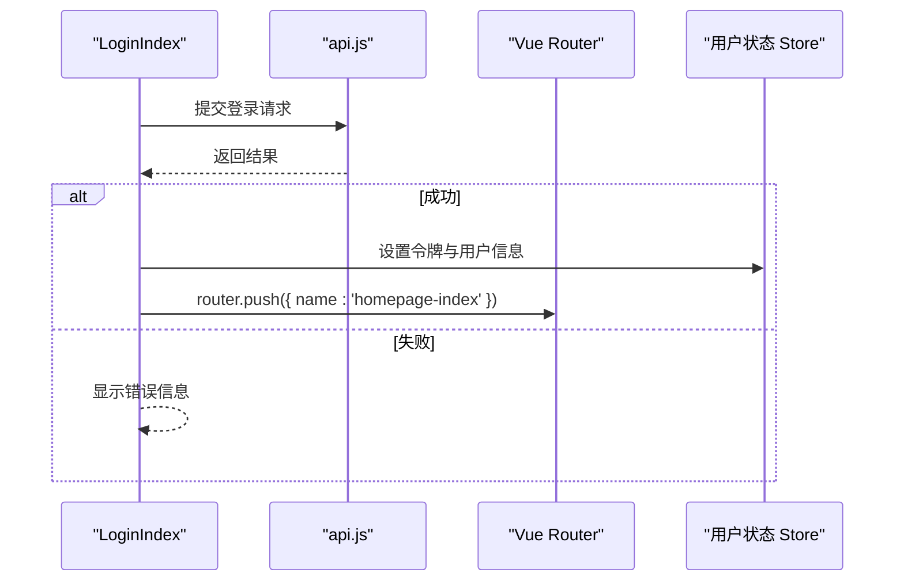
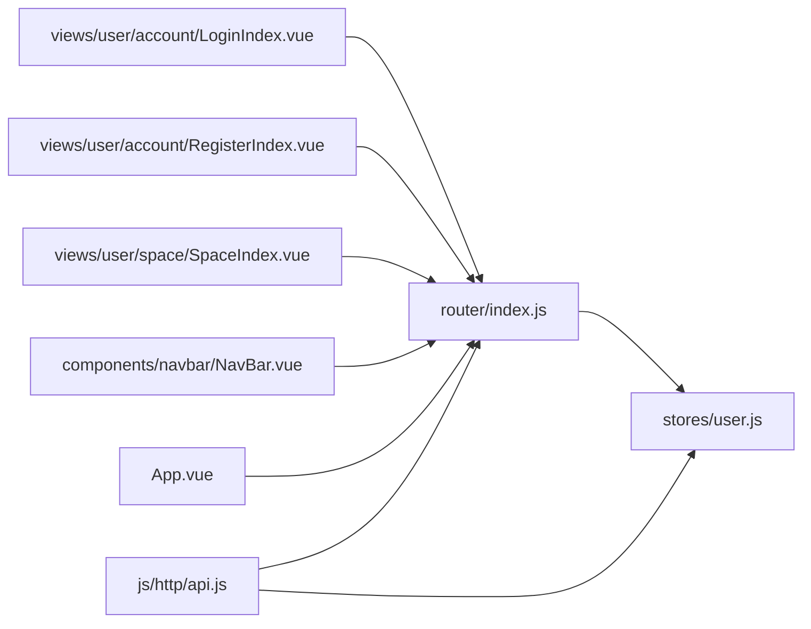

# 路由系统

<cite>
**本文引用的文件**
- [frontend/src/router/index.js](file://frontend/src/router/index.js)
- [frontend/src/main.js](file://frontend/src/main.js)
- [frontend/src/App.vue](file://frontend/src/App.vue)
- [frontend/src/stores/user.js](file://frontend/src/stores/user.js)
- [frontend/src/views/user/account/LoginIndex.vue](file://frontend/src/views/user/account/LoginIndex.vue)
- [frontend/src/views/user/account/RegisterIndex.vue](file://frontend/src/views/user/account/RegisterIndex.vue)
- [frontend/src/views/homepage/HomepageIndex.vue](file://frontend/src/views/homepage/HomepageIndex.vue)
- [frontend/src/views/friend/FriendIndex.vue](file://frontend/src/views/friend/FriendIndex.vue)
- [frontend/src/views/user/space/SpaceIndex.vue](file://frontend/src/views/user/space/SpaceIndex.vue)
- [frontend/src/views/user/profile/ProfileIndex.vue](file://frontend/src/views/user/profile/ProfileIndex.vue)
- [frontend/src/views/create/CreateIndex.vue](file://frontend/src/views/create/CreateIndex.vue)
- [frontend/src/views/error/NotFoundIndex.vue](file://frontend/src/views/error/NotFoundIndex.vue)
- [frontend/src/components/navbar/NavBar.vue](file://frontend/src/components/navbar/NavBar.vue)
- [frontend/src/js/http/api.js](file://frontend/src/js/http/api.js)
- [frontend/package.json](file://frontend/package.json)
</cite>

## 目录
1. [引言](#引言)
2. [项目结构](#项目结构)
3. [核心组件](#核心组件)
4. [架构总览](#架构总览)
5. [详细组件分析](#详细组件分析)
6. [依赖关系分析](#依赖关系分析)
7. [性能考虑](#性能考虑)
8. [故障排查指南](#故障排查指南)
9. [结论](#结论)
10. [附录](#附录)

## 引言
本文件系统性梳理前端路由系统的设计与实现，重点覆盖以下方面：
- 路由定义与命名、路径设计与匹配规则
- 嵌套路由与动态路由参数的使用
- 路由元信息（meta）与权限控制策略
- 各页面视图组件的路由映射关系
- 全局前置守卫与路由级守卫的协同机制
- 编程式导航、路由参数与查询字符串的最佳实践

## 项目结构
前端采用 Vue 3 + Vue Router 5 + Pinia 的现代组合，路由集中于单文件配置，应用入口统一挂载路由实例。

图表来源
- [frontend/src/main.js:1-15](file://frontend/src/main.js#L1-L15)
- [frontend/src/router/index.js:1-104](file://frontend/src/router/index.js#L1-L104)
- [frontend/src/App.vue:1-43](file://frontend/src/App.vue#L1-L43)
- [frontend/src/stores/user.js:1-59](file://frontend/src/stores/user.js#L1-L59)
- [frontend/src/components/navbar/NavBar.vue:1-83](file://frontend/src/components/navbar/NavBar.vue#L1-L83)

章节来源
- [frontend/src/main.js:1-15](file://frontend/src/main.js#L1-L15)
- [frontend/src/router/index.js:1-104](file://frontend/src/router/index.js#L1-L104)
- [frontend/package.json:1-30](file://frontend/package.json#L1-L30)

## 核心组件
- 路由配置与守卫
  - 路由表集中定义各页面路径、组件与元信息（如 needLogin）
  - 全局前置守卫在每次导航前检查目标路由的 needLogin 与用户登录状态
- 用户状态管理
  - 使用 Pinia Store 维护登录态、用户信息与“是否已拉取用户信息”的标记
- 页面视图
  - 登录、注册、主页、好友、创作、个人空间、资料页、404 等视图组件
- 导航组件
  - 顶部导航与抽屉菜单根据登录态显示不同链接
- HTTP 客户端
  - Axios 封装，自动注入 Bearer Token，统一处理 401 刷新逻辑

章节来源
- [frontend/src/router/index.js:12-101](file://frontend/src/router/index.js#L12-L101)
- [frontend/src/stores/user.js:4-59](file://frontend/src/stores/user.js#L4-L59)
- [frontend/src/App.vue:13-31](file://frontend/src/App.vue#L13-L31)
- [frontend/src/js/http/api.js:11-92](file://frontend/src/js/http/api.js#L11-L92)

## 架构总览
路由系统围绕“路由元信息 + 全局守卫 + 用户状态”构建权限控制闭环，同时通过编程式导航与模板绑定实现流畅的用户体验。

图表来源
- [frontend/src/router/index.js:92-101](file://frontend/src/router/index.js#L92-L101)
- [frontend/src/stores/user.js:18-20](file://frontend/src/stores/user.js#L18-L20)
- [frontend/src/components/navbar/NavBar.vue:40-47](file://frontend/src/components/navbar/NavBar.vue#L40-L47)

## 详细组件分析

### 路由定义与元信息
- 路由表包含首页、好友、创作、404、登录、注册、个人空间、资料页等
- 每个路由携带 meta 字段，其中 needLogin 决定是否需要登录
- 通配符路由将未匹配路径重定向至 404 视图

章节来源
- [frontend/src/router/index.js:14-89](file://frontend/src/router/index.js#L14-L89)

### 动态路由参数与个人空间
- 个人空间路由使用动态段 user_id，便于在视图内读取参数并渲染对应内容
- 视图通过 useRoute 获取 params 并展示

章节来源
- [frontend/src/router/index.js:65-71](file://frontend/src/router/index.js#L65-L71)
- [frontend/src/views/user/space/SpaceIndex.vue:3-10](file://frontend/src/views/user/space/SpaceIndex.vue#L3-L10)

### 嵌套路由与视图组织
- 当前路由表为扁平化设计，未见显式的 children 嵌套配置
- 顶层视图通过 RouterView 呈现，配合 App.vue 的布局容器实现嵌套视觉效果

章节来源
- [frontend/src/router/index.js:14-89](file://frontend/src/router/index.js#L14-L89)
- [frontend/src/App.vue:34-37](file://frontend/src/App.vue#L34-L37)

### 权限控制：元信息与守卫
- 全局前置守卫读取 to.meta.needLogin 与用户登录状态，必要时重定向至登录页
- 应用挂载阶段也进行一次校验，确保在用户信息拉取完成后进行兜底处理

图表来源
- [frontend/src/router/index.js:93-101](file://frontend/src/router/index.js#L93-L101)
- [frontend/src/stores/user.js:16-20](file://frontend/src/stores/user.js#L16-L20)
- [frontend/src/App.vue:25-29](file://frontend/src/App.vue#L25-L29)

章节来源
- [frontend/src/router/index.js:92-101](file://frontend/src/router/index.js#L92-L101)
- [frontend/src/App.vue:13-31](file://frontend/src/App.vue#L13-L31)
- [frontend/src/stores/user.js:16-20](file://frontend/src/stores/user.js#L16-L20)

### 登录与注册流程
- 登录/注册视图通过编程式导航 push 到首页
- 表单校验与错误提示在组件内完成，接口调用通过封装的 HTTP 客户端完成

图表来源
- [frontend/src/views/user/account/LoginIndex.vue:15-41](file://frontend/src/views/user/account/LoginIndex.vue#L15-L41)
- [frontend/src/js/http/api.js:11-92](file://frontend/src/js/http/api.js#L11-L92)
- [frontend/src/router/index.js:12-23](file://frontend/src/router/index.js#L12-L23)

章节来源
- [frontend/src/views/user/account/LoginIndex.vue:15-41](file://frontend/src/views/user/account/LoginIndex.vue#L15-L41)
- [frontend/src/views/user/account/RegisterIndex.vue:16-45](file://frontend/src/views/user/account/RegisterIndex.vue#L16-L45)

### 导航组件与路由联动
- 导航栏根据登录态显示“创作”、“登录”或用户菜单
- 所有导航均通过 RouterLink 或 useRouter 实现，保持一致的路由行为

章节来源
- [frontend/src/components/navbar/NavBar.vue:40-47](file://frontend/src/components/navbar/NavBar.vue#L40-L47)
- [frontend/src/components/navbar/NavBar.vue:58-74](file://frontend/src/components/navbar/NavBar.vue#L58-L74)

### 错误与兜底
- 通配符路由将所有未匹配路径导向 404 视图
- 404 视图作为兜底组件，保证用户体验一致性

章节来源
- [frontend/src/router/index.js:80-88](file://frontend/src/router/index.js#L80-L88)
- [frontend/src/views/error/NotFoundIndex.vue:1-11](file://frontend/src/views/error/NotFoundIndex.vue#L1-L11)

## 依赖关系分析
- 路由配置依赖用户状态 Store 以判断登录态
- 视图组件依赖路由实例进行编程式导航
- 导航组件依赖 RouterLink 与 useRouter 进行声明式与编程式导航
- HTTP 客户端依赖用户状态 Store 注入 Token 并处理刷新

图表来源
- [frontend/src/router/index.js:10-101](file://frontend/src/router/index.js#L10-L101)
- [frontend/src/stores/user.js:4-59](file://frontend/src/stores/user.js#L4-L59)
- [frontend/src/views/user/account/LoginIndex.vue:3-13](file://frontend/src/views/user/account/LoginIndex.vue#L3-L13)
- [frontend/src/views/user/account/RegisterIndex.vue:3-14](file://frontend/src/views/user/account/RegisterIndex.vue#L3-L14)
- [frontend/src/views/user/space/SpaceIndex.vue:3-6](file://frontend/src/views/user/space/SpaceIndex.vue#L3-L6)
- [frontend/src/components/navbar/NavBar.vue:40-47](file://frontend/src/components/navbar/NavBar.vue#L40-L47)
- [frontend/src/App.vue:9-11](file://frontend/src/App.vue#L9-L11)
- [frontend/src/js/http/api.js:11-27](file://frontend/src/js/http/api.js#L11-L27)

章节来源
- [frontend/src/router/index.js:10-101](file://frontend/src/router/index.js#L10-L101)
- [frontend/src/js/http/api.js:11-92](file://frontend/src/js/http/api.js#L11-L92)

## 性能考虑
- 路由守卫逻辑简单、开销低，建议避免在守卫中执行耗时操作
- 动态导入可按需加载大型视图组件，减少首屏体积（当前为直接导入）
- 通配符路由放在末尾，避免影响已有路由匹配效率
- 在高频导航场景下，尽量复用已缓存的用户信息，减少重复请求

## 故障排查指南
- 登录后仍被重定向到登录页
  - 检查用户状态 Store 是否正确设置登录态与用户信息
  - 确认应用挂载阶段的兜底校验逻辑是否触发
- 401 未授权频繁出现
  - 检查 HTTP 客户端拦截器是否正确注入 Bearer Token
  - 确认刷新流程是否成功更新 access token
- 动态路由参数为空
  - 确认导航时传入了正确的参数名与值
  - 检查视图内 useRoute 的 params 读取是否正确

章节来源
- [frontend/src/stores/user.js:18-20](file://frontend/src/stores/user.js#L18-L20)
- [frontend/src/App.vue:25-29](file://frontend/src/App.vue#L25-L29)
- [frontend/src/js/http/api.js:46-89](file://frontend/src/js/http/api.js#L46-L89)
- [frontend/src/views/user/space/SpaceIndex.vue:5-6](file://frontend/src/views/user/space/SpaceIndex.vue#L5-L6)

## 结论
该路由系统通过简洁的路由表与元信息驱动的权限控制，结合全局守卫与用户状态管理，实现了清晰、可维护的导航与鉴权机制。动态路由参数满足个性化需求，404 通配符保障了健壮性。建议后续引入路由懒加载与更细粒度的路由级守卫，进一步提升性能与安全性。

## 附录

### 路由与视图映射一览
- 首页：/ → HomepageIndex（needLogin=false）
- 好友：/friend/ → FriendIndex（needLogin=true）
- 创作：/create/ → CreateIndex（needLogin=false）
- 登录：/user/account/login/ → LoginIndex（needLogin=false）
- 注册：/user/account/register/ → RegisterIndex（needLogin=false）
- 个人空间：/user/space/:user_id/ → SpaceIndex（needLogin=false）
- 资料页：/user/profile/ → ProfileIndex（needLogin=true）
- 404：/:pathMatch(.*)* → NotFoundIndex（needLogin=false）

章节来源
- [frontend/src/router/index.js:14-89](file://frontend/src/router/index.js#L14-L89)

### 编程式导航最佳实践
- 使用 useRouter.push 或 replace 实现页面跳转
- 对需要登录保护的路由，优先在守卫中统一处理
- 动态路由参数通过对象形式传入，确保类型安全
- 查询字符串建议通过路由对象的 query 字段传递

章节来源
- [frontend/src/views/user/account/LoginIndex.vue:31-33](file://frontend/src/views/user/account/LoginIndex.vue#L31-L33)
- [frontend/src/views/user/account/RegisterIndex.vue:34-36](file://frontend/src/views/user/account/RegisterIndex.vue#L34-L36)
- [frontend/src/components/navbar/NavBar.vue:40-47](file://frontend/src/components/navbar/NavBar.vue#L40-L47)