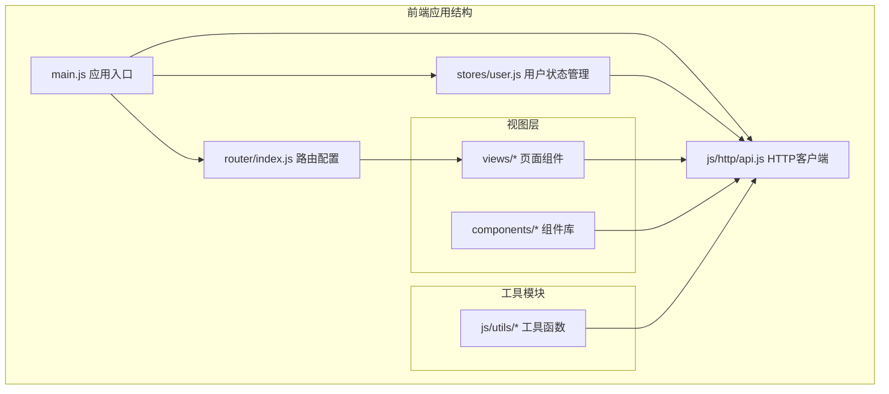
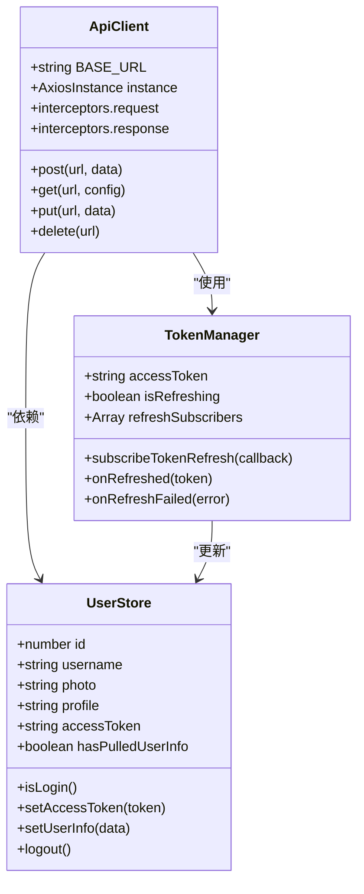
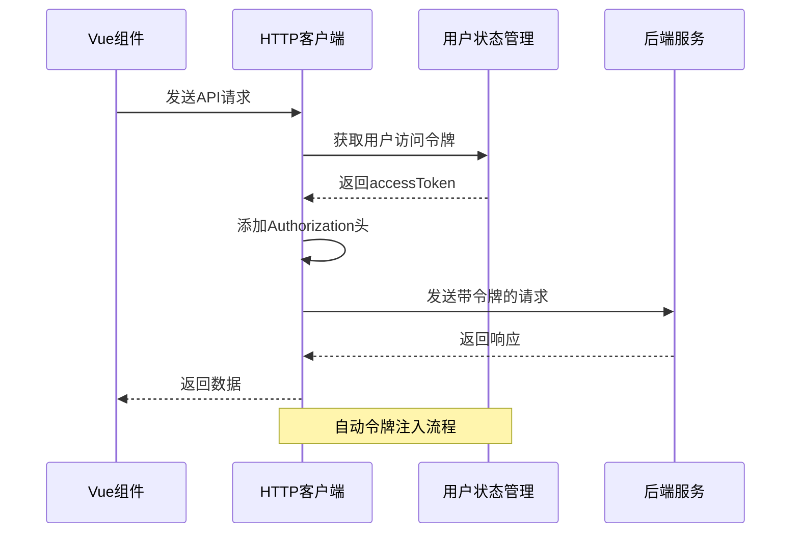
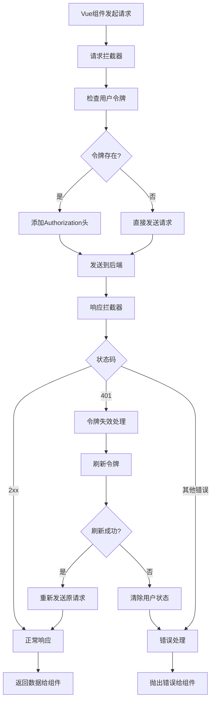
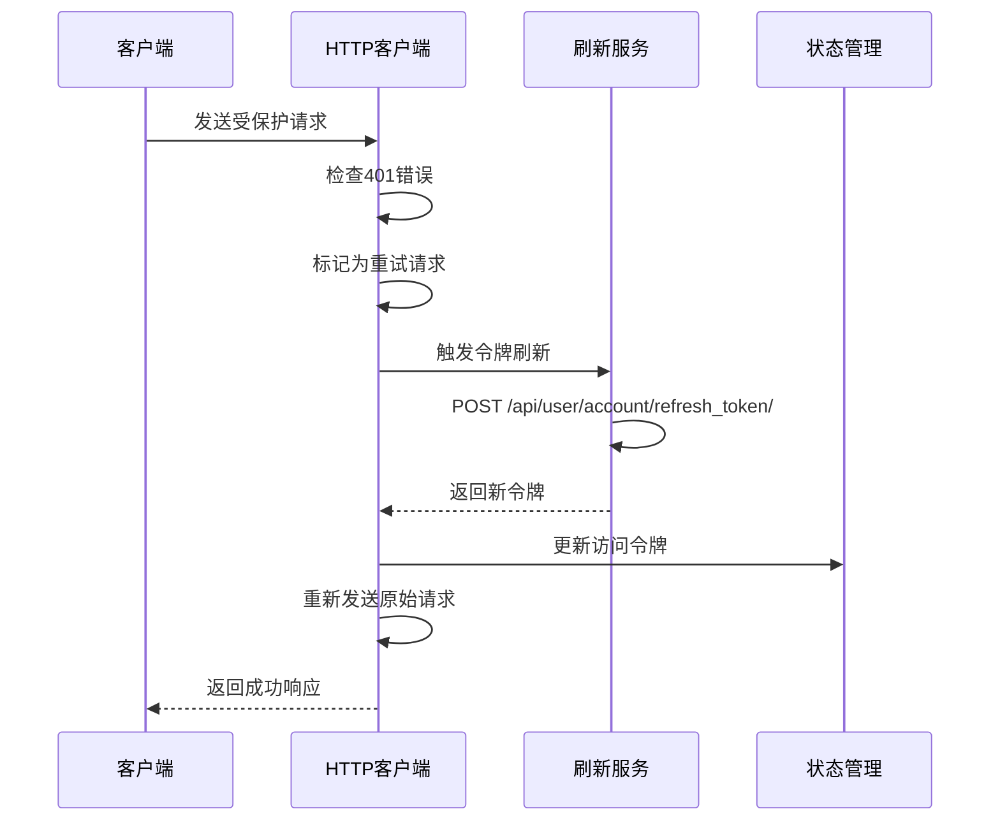
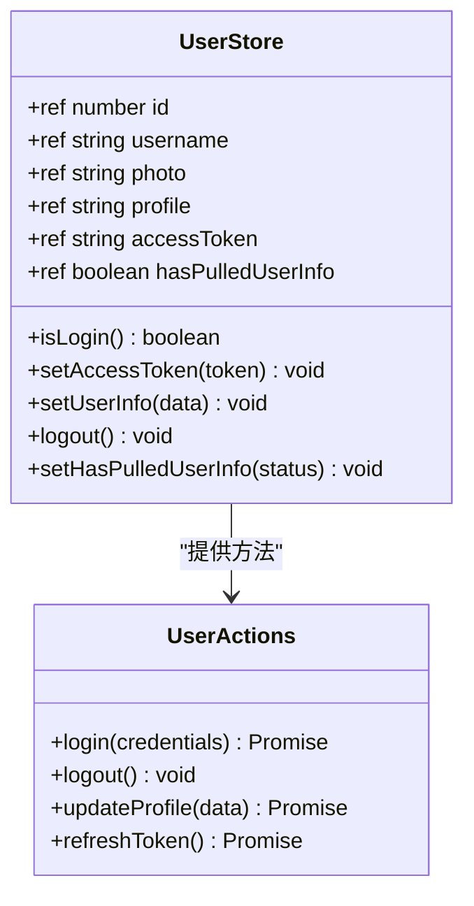
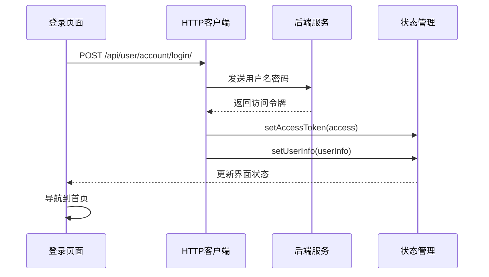
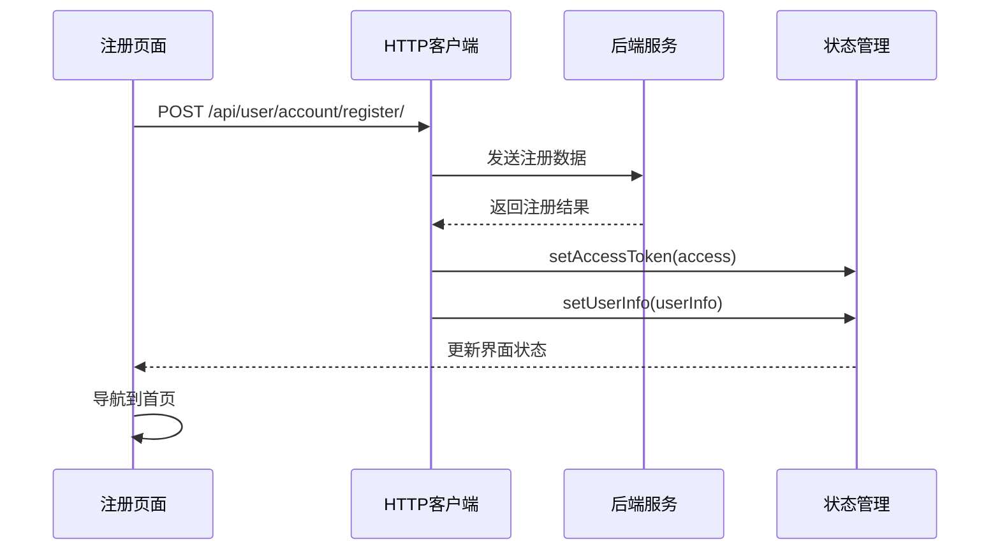
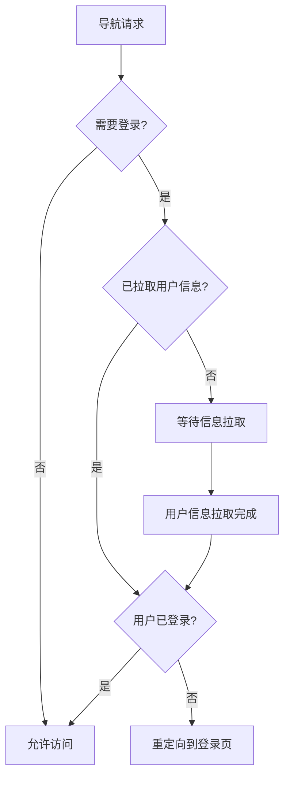
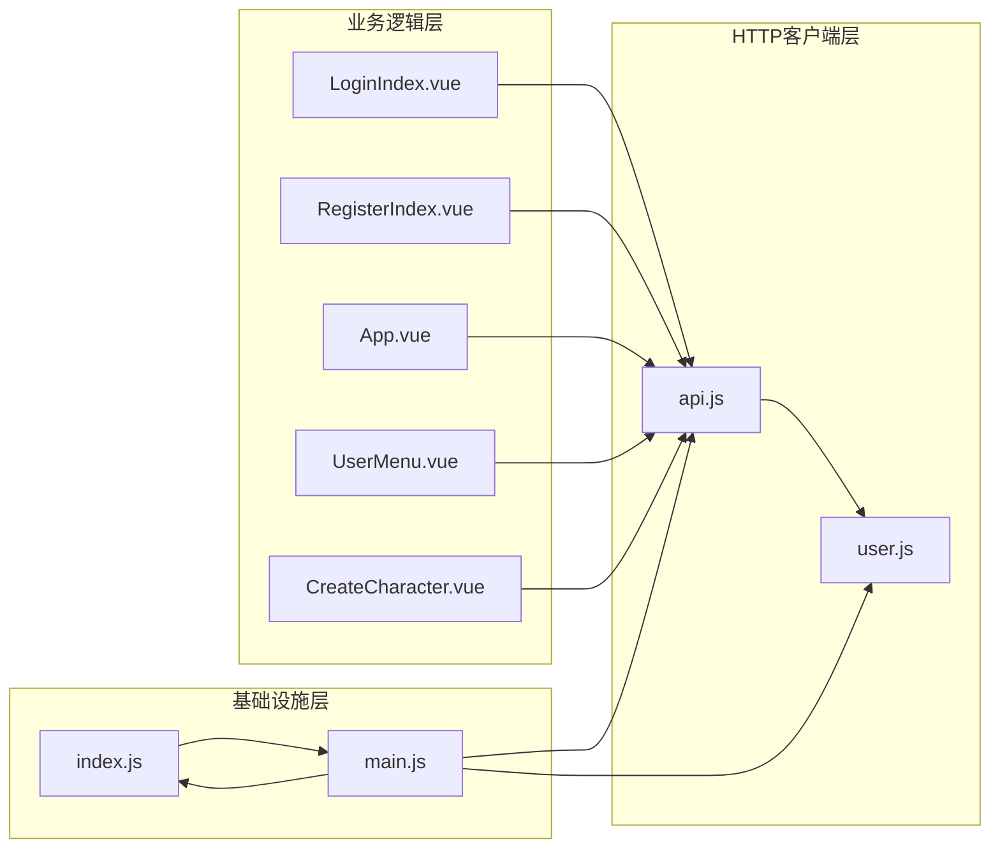

# HTTP客户端

<cite>
**本文档引用的文件**
- [api.js](file://frontend/src/js/http/api.js)
- [user.js](file://frontend/src/stores/user.js)
- [package.json](file://frontend/package.json)
- [main.js](file://frontend/src/main.js)
- [LoginIndex.vue](file://frontend/src/views/user/account/LoginIndex.vue)
- [RegisterIndex.vue](file://frontend/src/views/user/account/RegisterIndex.vue)
- [App.vue](file://frontend/src/App.vue)
- [UserMenu.vue](file://frontend/src/components/navbar/UserMenu.vue)
- [CreateCharacter.vue](file://frontend/src/views/create/character/CreateCharacter.vue)
- [index.js](file://frontend/src/router/index.js)
</cite>

## 目录
1. [简介](#简介)
2. [项目结构](#项目结构)
3. [核心组件](#核心组件)
4. [架构概览](#架构概览)
5. [详细组件分析](#详细组件分析)
6. [依赖关系分析](#依赖关系分析)
7. [性能考虑](#性能考虑)
8. [故障排除指南](#故障排除指南)
9. [结论](#结论)

## 简介

LLM_AIfriends项目的HTTP客户端是一个基于Axios的现代化封装，专为Vue 3单页应用设计。该客户端实现了完整的身份验证流程、自动令牌管理和错误处理机制，为整个前端应用提供了统一的API访问层。

本HTTP客户端的核心特性包括：
- 自动Token注入机制
- 智能的401错误处理和令牌刷新
- 响应拦截器的统一错误处理
- 并发请求的安全管理
- CORS兼容性支持
- 超时控制和重试机制

## 项目结构

前端项目采用标准的Vue 3 + Vite架构，HTTP客户端位于`frontend/src/js/http/`目录下，与业务逻辑分离，便于维护和测试。



**图表来源**
- [main.js:1-15](file://frontend/src/main.js#L1-L15)
- [index.js:1-110](file://frontend/src/router/index.js#L1-L110)

**章节来源**
- [main.js:1-15](file://frontend/src/main.js#L1-L15)
- [package.json:1-30](file://frontend/package.json#L1-L30)

## 核心组件

### Axios封装器设计

HTTP客户端基于Axios创建，配置了全局的基础URL和跨域凭证支持：



**图表来源**
- [api.js:14-93](file://frontend/src/js/http/api.js#L14-L93)
- [user.js:4-52](file://frontend/src/stores/user.js#L4-L52)

### 请求拦截器实现

请求拦截器负责在每个HTTP请求中自动添加Authorization头：



**图表来源**
- [api.js:21-27](file://frontend/src/js/http/api.js#L21-L27)
- [user.js:4-52](file://frontend/src/stores/user.js#L4-L52)

**章节来源**
- [api.js:14-93](file://frontend/src/js/http/api.js#L14-L93)
- [user.js:4-52](file://frontend/src/stores/user.js#L4-L52)

## 架构概览

HTTP客户端采用拦截器模式，实现了请求和响应的双向处理：



**图表来源**
- [api.js:46-90](file://frontend/src/js/http/api.js#L46-L90)

## 详细组件分析

### HTTP客户端核心实现

#### 基础配置
HTTP客户端初始化时设置了以下关键参数：
- `baseURL`: 指向后端API服务器地址
- `withCredentials`: 启用跨域携带Cookie功能
- 全局超时设置：5000毫秒

#### 请求拦截器机制
请求拦截器实现了智能的令牌注入逻辑：
1. 从Pinia状态管理器获取当前用户的访问令牌
2. 将令牌添加到Authorization头部
3. 支持Bearer令牌格式

#### 响应拦截器与错误处理
响应拦截器处理401未授权错误，实现了完整的令牌刷新流程：
1. 检测401状态码且非重试请求
2. 设置重试标记防止无限循环
3. 创建令牌刷新队列
4. 异步刷新访问令牌
5. 成功：更新令牌并重新发送原始请求
6. 失败：清除用户状态并拒绝Promise



**图表来源**
- [api.js:46-90](file://frontend/src/js/http/api.js#L46-L90)

**章节来源**
- [api.js:14-93](file://frontend/src/js/http/api.js#L14-L93)

### 用户状态管理集成

#### Pinia状态管理模式
用户状态管理采用Vue 3 Composition API风格，提供了响应式的用户信息存储：



**图表来源**
- [user.js:4-52](file://frontend/src/stores/user.js#L4-L52)

#### 状态同步机制
HTTP客户端与用户状态管理器保持实时同步：
- 访问令牌更新时自动同步到状态管理器
- 登出操作时清除所有用户信息
- 提供便捷的状态查询方法

**章节来源**
- [user.js:4-52](file://frontend/src/stores/user.js#L4-L52)

### API使用示例

#### 登录流程实现
登录页面展示了HTTP客户端的标准使用模式：



**图表来源**
- [LoginIndex.vue:14-39](file://frontend/src/views/user/account/LoginIndex.vue#L14-L39)

#### 注册流程实现
注册页面展示了类似的API交互模式：



**图表来源**
- [RegisterIndex.vue:15-42](file://frontend/src/views/user/account/RegisterIndex.vue#L15-L42)

**章节来源**
- [LoginIndex.vue:14-39](file://frontend/src/views/user/account/LoginIndex.vue#L14-L39)
- [RegisterIndex.vue:15-42](file://frontend/src/views/user/account/RegisterIndex.vue#L15-L42)

### 路由守卫与权限控制

#### 全局路由守卫
应用使用Vue Router的全局前置守卫实现权限控制：



**图表来源**
- [index.js:99-107](file://frontend/src/router/index.js#L99-L107)

**章节来源**
- [index.js:99-107](file://frontend/src/router/index.js#L99-L107)

## 依赖关系分析

### 外部依赖

项目使用以下关键依赖：

```mermaid
graph TB
subgraph "核心依赖"
A[axios ^1.13.2]
B[pinia ^3.0.4]
C[vue ^3.5.26]
D[vue-router ^4.6.4]
end
subgraph "开发依赖"
E[vite ^7.3.0]
F[tailwindcss ^4.1.18]
G[@vitejs/plugin-vue ^6.0.3]
end
subgraph "应用层"
H[HTTP客户端]
I[用户状态管理]
J[路由系统]
K[视图组件]
end
A --> H
B --> I
C --> J
D --> J
H --> K
I --> K
J --> K
```

**图表来源**
- [package.json:14-22](file://frontend/package.json#L14-L22)

### 内部模块依赖



**图表来源**
- [api.js:11-12](file://frontend/src/js/http/api.js#L11-L12)
- [user.js:1](file://frontend/src/stores/user.js#L1)

**章节来源**
- [package.json:14-22](file://frontend/package.json#L14-L22)

## 性能考虑

### 并发请求管理

HTTP客户端通过以下机制管理并发请求：
- 使用Promise链确保请求顺序执行
- 令牌刷新期间阻止新的请求
- 防止重复的令牌刷新请求

### 超时控制

- 请求超时：5000毫秒
- 令牌刷新超时：5000毫秒
- 统一的错误处理机制

### 缓存策略

当前实现未实现客户端缓存，但可以扩展：
- 可以为GET请求实现简单的内存缓存
- 支持缓存失效策略
- 考虑实现缓存键生成机制

## 故障排除指南

### 常见问题诊断

#### 401未授权错误
当遇到401错误时，检查以下要点：
1. 确认用户是否已登录
2. 检查访问令牌是否过期
3. 验证令牌刷新机制是否正常工作

#### CORS跨域问题
如果出现跨域错误，检查：
1. 后端是否正确配置CORS头
2. 前端是否启用withCredentials
3. 服务器域名是否在白名单中

#### 令牌刷新失败
令牌刷新失败可能由以下原因导致：
1. 刷新令牌过期
2. 网络连接问题
3. 后端服务异常

### 调试技巧

#### 开启Axios调试
可以在开发环境中启用Axios的调试模式：
- 检查网络面板中的请求详情
- 查看响应头中的认证信息
- 监控令牌的生命周期

#### 状态监控
使用Vue DevTools监控Pinia状态变化：
- 观察用户信息的更新
- 跟踪访问令牌的变化
- 检查路由守卫的执行情况

**章节来源**
- [api.js:46-90](file://frontend/src/js/http/api.js#L46-L90)

## 结论

LLM_AIfriends项目的HTTP客户端实现了一个完整、健壮的API访问层，具有以下优势：

### 设计优势
- **模块化设计**：HTTP客户端独立于业务逻辑，便于维护
- **自动化处理**：自动令牌注入和错误处理减少了样板代码
- **状态同步**：与Pinia状态管理器深度集成
- **安全性**：完整的401错误处理和令牌刷新机制

### 扩展性
- 易于添加新的拦截器
- 支持自定义错误处理策略
- 可扩展的认证机制
- 灵活的配置选项

### 最佳实践
- 遵循单一职责原则
- 实现了完整的错误处理
- 提供了清晰的API接口
- 保持了良好的性能特征

该HTTP客户端为LLM_AIfriends项目提供了坚实的技术基础，能够支持复杂的应用场景，并为未来的功能扩展奠定了良好基础。