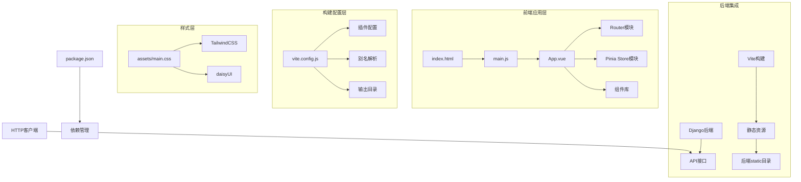
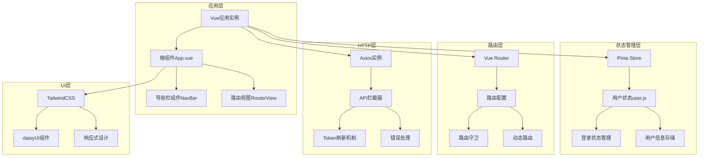
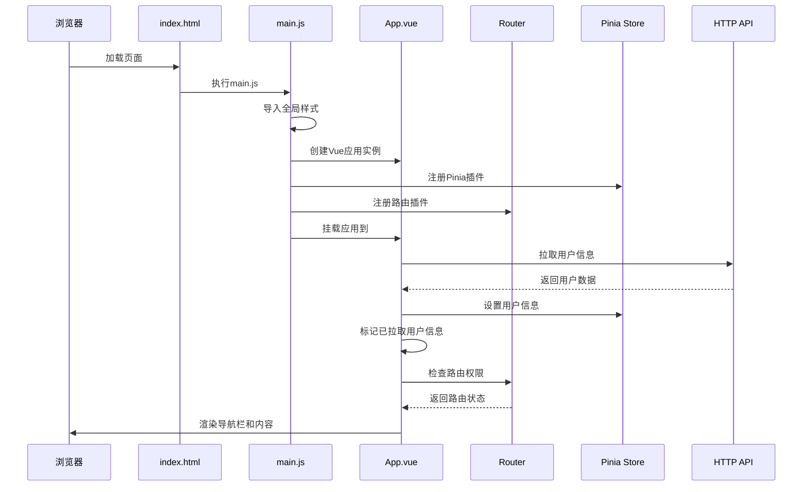
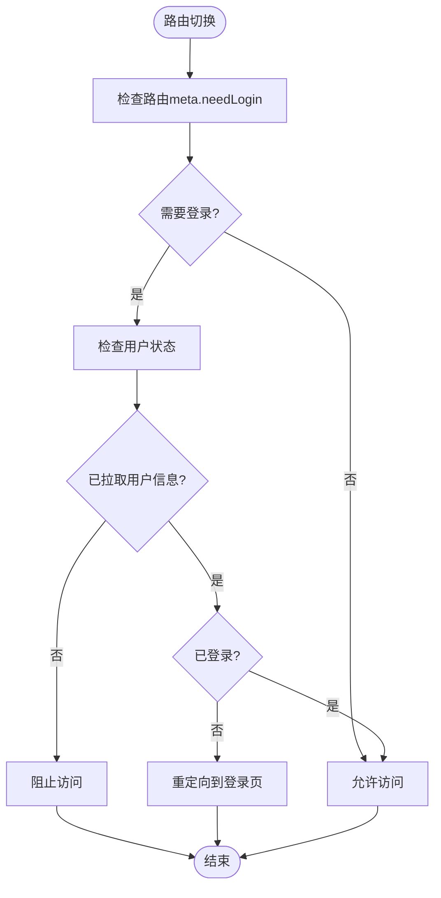
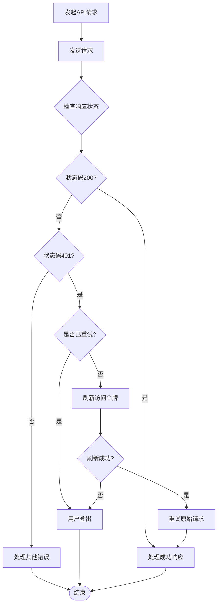

# Vue应用初始化

<cite>
**本文档引用的文件**
- [main.js](file://frontend/src/main.js)
- [App.vue](file://frontend/src/App.vue)
- [vite.config.js](file://frontend/vite.config.js)
- [package.json](file://frontend/package.json)
- [router/index.js](file://frontend/src/router/index.js)
- [stores/user.js](file://frontend/src/stores/user.js)
- [assets/main.css](file://frontend/src/assets/main.css)
- [js/http/api.js](file://frontend/src/js/http/api.js)
- [index.html](file://frontend/index.html)
- [components/navbar/NavBar.vue](file://frontend/src/components/navbar/NavBar.vue)
- [views/homepage/HomepageIndex.vue](file://frontend/src/views/homepage/HomepageIndex.vue)
- [views/user/account/LoginIndex.vue](file://frontend/src/views/user/account/LoginIndex.vue)
- [components/navbar/UserMenu.vue](file://frontend/src/components/navbar/UserMenu.vue)
</cite>

## 目录
1. [简介](#简介)
2. [项目结构](#项目结构)
3. [核心组件](#核心组件)
4. [架构概览](#架构概览)
5. [详细组件分析](#详细组件分析)
6. [依赖关系分析](#依赖关系分析)
7. [性能考虑](#性能考虑)
8. [故障排除指南](#故障排除指南)
9. [结论](#结论)

## 简介

LLM_AIfriends是一个基于Vue 3的前端应用，采用现代前端技术栈构建。本项目展示了完整的Vue应用初始化流程，包括应用创建、插件注册、全局配置以及与后端Django服务的集成。应用使用Vite作为构建工具，集成了Pinia状态管理、Vue Router路由系统，并通过TailwindCSS和daisyUI提供现代化的UI设计。

## 项目结构

该项目采用典型的Vue 3单页应用结构，主要分为以下层次：



**图表来源**
- [main.js:1-15](file://frontend/src/main.js#L1-L15)
- [vite.config.js:10-25](file://frontend/vite.config.js#L10-L25)
- [package.json:14-28](file://frontend/package.json#L14-L28)

**章节来源**
- [main.js:1-15](file://frontend/src/main.js#L1-L15)
- [vite.config.js:1-26](file://frontend/vite.config.js#L1-L26)
- [package.json:1-30](file://frontend/package.json#L1-L30)

## 核心组件

### 应用入口点 (main.js)

应用入口点负责初始化Vue应用实例、注册必要的插件并进行应用挂载。这是整个应用启动流程的核心文件。

**应用创建流程**：
1. 导入全局样式文件
2. 创建Vue应用实例
3. 注册Pinia状态管理插件
4. 注册Vue Router路由插件
5. 挂载到DOM元素

**插件注册顺序的重要性**：
- Pinia必须在Router之前注册，确保路由守卫能够访问到store实例
- Router必须在应用挂载前完成注册，保证路由导航正常工作

**章节来源**
- [main.js:1-15](file://frontend/src/main.js#L1-L15)

### 根组件设计 (App.vue)

App.vue作为应用的根组件，承担着用户信息初始化、路由守卫和全局导航栏展示的重要职责。

**核心功能特性**：
- 用户信息拉取和状态管理
- 路由守卫逻辑实现
- 全局导航栏集成
- 响应式布局设计

**生命周期管理**：
- 在mounted钩子中执行用户信息初始化
- 设置用户信息拉取状态标志
- 实现登录状态检查和路由重定向

**章节来源**
- [App.vue:1-41](file://frontend/src/App.vue#L1-L41)

### 构建配置 (vite.config.js)

Vite配置文件定义了开发服务器、插件系统和构建输出的完整配置。

**关键配置项**：
- 插件系统：Vue开发工具、TailwindCSS、Vue插件
- 路径别名：@指向src目录
- 构建输出：打包到Django的static目录
- 开发服务器：支持热重载和实时更新

**章节来源**
- [vite.config.js:10-25](file://frontend/vite.config.js#L10-L25)

## 架构概览

应用采用模块化架构设计，各组件职责明确，通过依赖注入和事件机制进行通信。



**图表来源**
- [main.js:3-14](file://frontend/src/main.js#L3-L14)
- [router/index.js:13-97](file://frontend/src/router/index.js#L13-L97)
- [stores/user.js:4-52](file://frontend/src/stores/user.js#L4-L52)
- [js/http/api.js:16-90](file://frontend/src/js/http/api.js#L16-L90)

## 详细组件分析

### 应用初始化流程



**图表来源**
- [main.js:9-14](file://frontend/src/main.js#L9-L14)
- [App.vue:12-29](file://frontend/src/App.vue#L12-L29)
- [router/index.js:99-107](file://frontend/src/router/index.js#L99-L107)

### 路由系统设计

应用的路由系统采用Vue Router 4.x，实现了完整的用户认证和权限控制机制。

**路由配置特点**：
- 基于元信息的权限控制 (`meta.needLogin`)
- 动态路由参数支持
- 全局前置守卫实现统一认证检查
- 404页面和通配符路由处理

**路由守卫逻辑**：


**图表来源**
- [router/index.js:99-107](file://frontend/src/router/index.js#L99-L107)
- [App.vue:23-27](file://frontend/src/App.vue#L23-L27)

**章节来源**
- [router/index.js:13-97](file://frontend/src/router/index.js#L13-L97)
- [router/index.js:99-107](file://frontend/src/router/index.js#L99-L107)

### 状态管理系统

应用使用Pinia作为状态管理解决方案，提供了响应式的状态管理和持久化能力。

**用户状态管理**：
- 用户基本信息存储（ID、用户名、头像、个人简介）
- 访问令牌管理
- 登录状态跟踪
- 用户信息拉取状态

**状态操作方法**：
- `isLogin()`: 检查用户是否已登录
- `setAccessToken(token)`: 设置访问令牌
- `setUserInfo(data)`: 设置用户信息
- `logout()`: 清除用户状态
- `setHasPulledUserInfo(status)`: 设置用户信息拉取状态

**章节来源**
- [stores/user.js:4-52](file://frontend/src/stores/user.js#L4-L52)

### HTTP客户端设计

应用的HTTP客户端实现了完整的认证和错误处理机制。

**核心功能**：
- 自动添加Authorization头部
- Token自动刷新机制
- 统一的错误处理
- 请求重试逻辑

**Token刷新流程**：


**图表来源**
- [js/http/api.js:46-89](file://frontend/src/js/http/api.js#L46-L89)

**章节来源**
- [js/http/api.js:16-90](file://frontend/src/js/http/api.js#L16-L90)

### UI组件架构

应用采用组件化的UI设计，主要包含导航栏、用户菜单和各种业务视图组件。

**导航栏组件设计**：
- 响应式布局设计
- 移动端抽屉式导航
- 条件渲染的用户菜单
- 图标和文本的组合显示

**组件交互模式**：
- 使用Vuex-like的状态管理模式
- 通过props和events进行组件间通信
- 基于TailwindCSS的样式系统

**章节来源**
- [components/navbar/NavBar.vue:13-72](file://frontend/src/components/navbar/NavBar.vue#L13-L72)
- [components/navbar/UserMenu.vue:17-28](file://frontend/src/components/navbar/UserMenu.vue#L17-L28)

## 依赖关系分析

应用的依赖关系体现了清晰的分层架构和模块化设计。

```mermaid
graph TB
subgraph "运行时依赖"
A[Vue 3.5.26] --> B[核心框架]
C[Vue Router 4.6.4] --> D[路由管理]
E[Pinia 3.0.4] --> F[状态管理]
G[Axios 1.13.2] --> H[HTTP客户端]
end
subgraph "构建时依赖"
I[Vite 7.3.0] --> J[开发服务器]
K[@vitejs/plugin-vue 6.0.3] --> L[Vue支持]
M[vite-plugin-vue-devtools 8.0.5] --> N[开发工具]
O[tailwindcss 4.1.18] --> P[CSS框架]
Q[@tailwindcss/vite 4.1.18] --> R[Tailwind集成]
S[daisyui 5.5.14] --> T[UI组件库]
end
subgraph "后端集成"
U[Django后端] --> V[API接口]
W[Vite构建] --> X[静态资源部署]
X --> Y[../backend/static/frontend]
end
Z[应用代码] --> A
Z --> C
Z --> E
Z --> G
Z --> I
Z --> O
Z --> S
```

**图表来源**
- [package.json:14-28](file://frontend/package.json#L14-L28)

**章节来源**
- [package.json:14-28](file://frontend/package.json#L14-L28)

## 性能考虑

### 构建优化策略

应用采用了多种性能优化措施：

**代码分割**：
- Vue Router的懒加载路由
- 动态导入组件
- 按需加载第三方库

**资源优化**：
- TailwindCSS的按需生成
- daisyUI组件的条件加载
- 图片资源的优化处理

**缓存策略**：
- 浏览器缓存配置
- API响应缓存
- Token本地存储

### 运行时性能

**响应式系统优化**：
- Pinia的组合式API
- Vue 3的性能改进
- 组件级别的细粒度更新

**网络请求优化**：
- 请求去重机制
- Token预检查
- 错误快速失败

## 故障排除指南

### 常见问题诊断

**应用无法启动**：
1. 检查Node.js版本是否满足要求
2. 确认所有依赖已正确安装
3. 验证Vite配置文件语法

**路由跳转异常**：
1. 检查路由元信息配置
2. 验证用户状态管理
3. 确认路由守卫逻辑

**API请求失败**：
1. 检查后端服务状态
2. 验证Token有效性
3. 查看网络请求日志

**样式加载问题**：
1. 确认TailwindCSS配置
2. 检查CSS文件路径
3. 验证构建输出目录

**章节来源**
- [vite.config.js:16-19](file://frontend/vite.config.js#L16-L19)
- [js/http/api.js:46-89](file://frontend/src/js/http/api.js#L46-L89)

## 结论

LLM_AIfriends的Vue应用初始化展现了现代前端开发的最佳实践。通过精心设计的应用架构、完善的插件系统集成和优化的构建配置，该应用为后续的功能扩展奠定了坚实的基础。

**关键优势**：
- 清晰的模块化架构
- 完善的认证和权限控制
- 现代化的UI设计系统
- 高效的构建和部署流程
- 良好的可维护性和扩展性

**未来发展方向**：
- 添加单元测试和集成测试
- 实现更完善的错误边界处理
- 优化移动端用户体验
- 添加国际化支持
- 实现离线缓存机制

该应用为Vue 3生态系统提供了一个优秀的参考实现，展示了如何在实际项目中有效整合各种现代前端技术。