# 前端架构

<cite>
**本文引用的文件**
- [frontend/package.json](file://frontend/package.json)
- [frontend/vite.config.js](file://frontend/vite.config.js)
- [frontend/src/main.js](file://frontend/src/main.js)
- [frontend/src/App.vue](file://frontend/src/App.vue)
- [frontend/src/router/index.js](file://frontend/src/router/index.js)
- [frontend/src/stores/user.js](file://frontend/src/stores/user.js)
- [frontend/src/js/http/api.js](file://frontend/src/js/http/api.js)
- [frontend/src/components/navbar/NavBar.vue](file://frontend/src/components/navbar/NavBar.vue)
- [frontend/src/views/user/account/LoginIndex.vue](file://frontend/src/views/user/account/LoginIndex.vue)
- [frontend/src/views/user/account/RegisterIndex.vue](file://frontend/src/views/user/account/RegisterIndex.vue)
- [frontend/src/views/user/profile/ProfileIndex.vue](file://frontend/src/views/user/profile/ProfileIndex.vue)
- [frontend/src/views/create/character/CreateCharacter.vue](file://frontend/src/views/create/character/CreateCharacter.vue)
- [frontend/src/js/utils/base64_to_file.js](file://frontend/src/js/utils/base6_to_file.js)
- [frontend/src/views/create/character/components/Photo.vue](file://frontend/src/views/create/character/components/Photo.vue)
- [frontend/src/views/user/profile/components/Photo.vue](file://frontend/src/views/user/profile/components/Photo.vue)
- [frontend/src/views/user/space/SpaceIndex.vue](file://frontend/src/views/user/space/SpaceIndex.vue)
</cite>

## 目录
1. [引言](#引言)
2. [项目结构](#项目结构)
3. [核心组件](#核心组件)
4. [架构总览](#架构总览)
5. [详细组件分析](#详细组件分析)
6. [依赖关系分析](#依赖关系分析)
7. [性能考虑](#性能考虑)
8. [故障排查指南](#故障排查指南)
9. [结论](#结论)
10. [附录](#附录)

## 引言
本文件面向 LLM_AIfriends 的前端工程，系统梳理基于 Vue 3 + Vite 的现代前端架构设计与实现细节。内容涵盖组件化开发模式、Composition API 使用、响应式数据管理、路由系统、状态管理（Pinia）、HTTP 请求封装与认证流程集成，并对目录结构设计原则、组件组织方式与代码规范进行总结。同时提供关键架构决策的技术考量、性能优化策略与可维护性设计建议，并通过多种图示展示组件交互流程。

## 项目结构
前端采用“功能域+分层”的目录组织方式：
- 根级构建与运行配置：Vite 插件链路、别名解析、打包输出路径等
- 应用入口与根组件：应用挂载、插件注册、全局布局与鉴权初始化
- 路由层：集中定义页面路由、登录守卫与 meta 元信息
- 状态层：Pinia Store 统一管理用户会话与全局状态
- 视图层：按业务域划分 views，内含子组件与复用模块
- 组件层：通用 UI 组件与业务组件，如导航栏、图标等
- 工具层：HTTP 封装、工具函数（如 Base64 转 File）

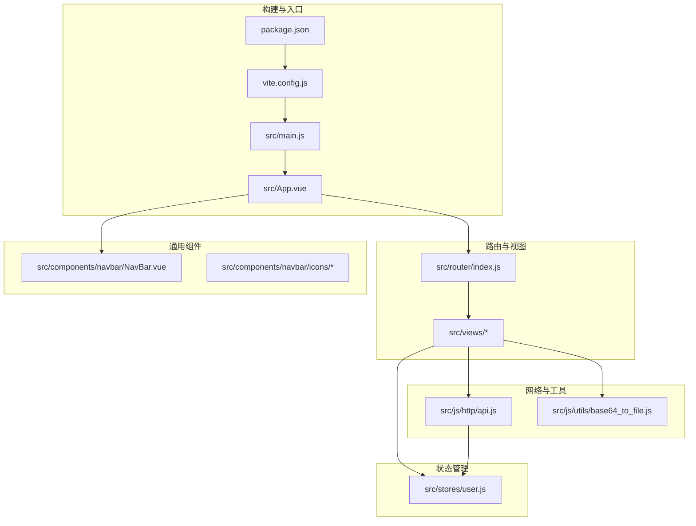

**图表来源**
- [frontend/vite.config.js:1-26](file://frontend/vite.config.js#L1-L26)
- [frontend/package.json:1-30](file://frontend/package.json#L1-L30)
- [frontend/src/main.js:1-15](file://frontend/src/main.js#L1-L15)
- [frontend/src/App.vue:1-41](file://frontend/src/App.vue#L1-L41)
- [frontend/src/router/index.js:1-110](file://frontend/src/router/index.js#L1-L110)
- [frontend/src/stores/user.js:1-53](file://frontend/src/stores/user.js#L1-L53)
- [frontend/src/js/http/api.js:1-93](file://frontend/src/js/http/api.js#L1-L93)
- [frontend/src/js/utils/base64_to_file.js:1-10](file://frontend/src/js/utils/base64_to_file.js#L1-L10)
- [frontend/src/components/navbar/NavBar.vue:1-77](file://frontend/src/components/navbar/NavBar.vue#L1-L77)

**章节来源**
- [frontend/package.json:1-30](file://frontend/package.json#L1-L30)
- [frontend/vite.config.js:1-26](file://frontend/vite.config.js#L1-L26)
- [frontend/src/main.js:1-15](file://frontend/src/main.js#L1-L15)
- [frontend/src/App.vue:1-41](file://frontend/src/App.vue#L1-L41)

## 核心组件
- 应用入口与挂载：创建 Vue 实例，注册 Pinia 与路由，挂载根组件
- 根组件：负责应用启动时的用户信息拉取、登录态校验与路由跳转
- 路由系统：集中声明路由表与全局前置守卫，结合 meta 控制访问权限
- 状态管理：Pinia Store 提供用户信息、令牌与登录态的统一存储与方法
- HTTP 封装：Axios 实例封装，自动注入 Authorization 头，处理 401 刷新令牌
- 导航栏组件：响应用户登录态，动态渲染菜单与侧边栏
- 视图组件：账户登录/注册、个人资料编辑、角色创建等业务页面
- 工具函数：Base64 图片转 File，用于上传场景

**章节来源**
- [frontend/src/main.js:1-15](file://frontend/src/main.js#L1-L15)
- [frontend/src/App.vue:1-41](file://frontend/src/App.vue#L1-L41)
- [frontend/src/router/index.js:1-110](file://frontend/src/router/index.js#L1-L110)
- [frontend/src/stores/user.js:1-53](file://frontend/src/stores/user.js#L1-L53)
- [frontend/src/js/http/api.js:1-93](file://frontend/src/js/http/api.js#L1-L93)
- [frontend/src/components/navbar/NavBar.vue:1-77](file://frontend/src/components/navbar/NavBar.vue#L1-L77)
- [frontend/src/views/user/account/LoginIndex.vue:1-65](file://frontend/src/views/user/account/LoginIndex.vue#L1-L65)
- [frontend/src/views/user/account/RegisterIndex.vue:1-71](file://frontend/src/views/user/account/RegisterIndex.vue#L1-L71)
- [frontend/src/views/user/profile/ProfileIndex.vue:1-71](file://frontend/src/views/user/profile/ProfileIndex.vue#L1-L71)
- [frontend/src/views/create/character/CreateCharacter.vue:1-84](file://frontend/src/views/create/character/CreateCharacter.vue#L1-L84)
- [frontend/src/js/utils/base64_to_file.js:1-10](file://frontend/src/js/utils/base64_to_file.js#L1-L10)

## 架构总览
整体采用“单页应用 + 后端静态资源托管”的混合部署模式：Vite 构建产物输出至 Django 的 static 目录，由后端统一提供静态资源服务。前端通过路由控制页面访问权限，Pinia 管理登录态，Axios 封装统一处理认证与刷新逻辑。

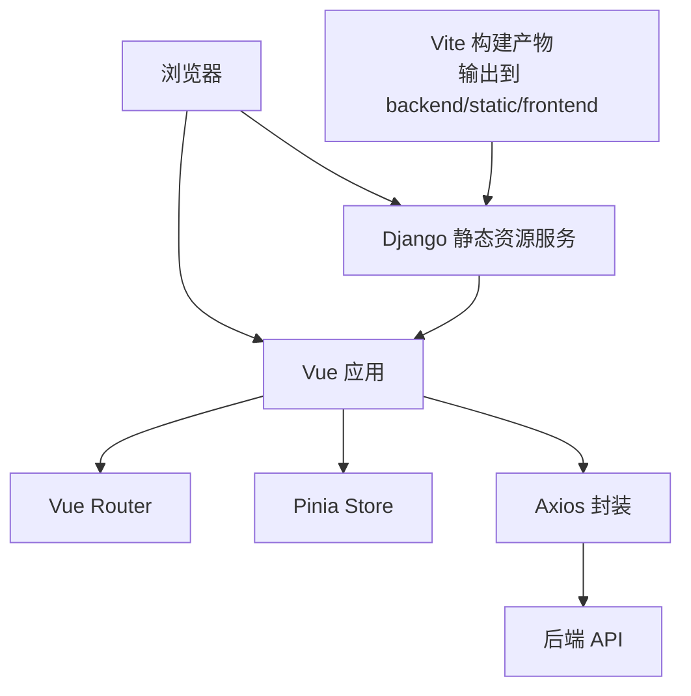

**图表来源**
- [frontend/vite.config.js:16-19](file://frontend/vite.config.js#L16-L19)
- [frontend/src/main.js:1-15](file://frontend/src/main.js#L1-L15)
- [frontend/src/router/index.js:1-110](file://frontend/src/router/index.js#L1-L110)
- [frontend/src/stores/user.js:1-53](file://frontend/src/stores/user.js#L1-L53)
- [frontend/src/js/http/api.js:1-93](file://frontend/src/js/http/api.js#L1-L93)

## 详细组件分析

### 路由系统与登录守卫
- 路由表集中定义，包含首页、好友、创作、个人空间、账户登录/注册、404 等页面
- 通过 meta 字段标记页面是否需要登录；全局前置守卫在进入路由前检查登录态
- 根组件在挂载时尝试拉取用户信息，并根据 needLogin 与 isLogin 决定跳转

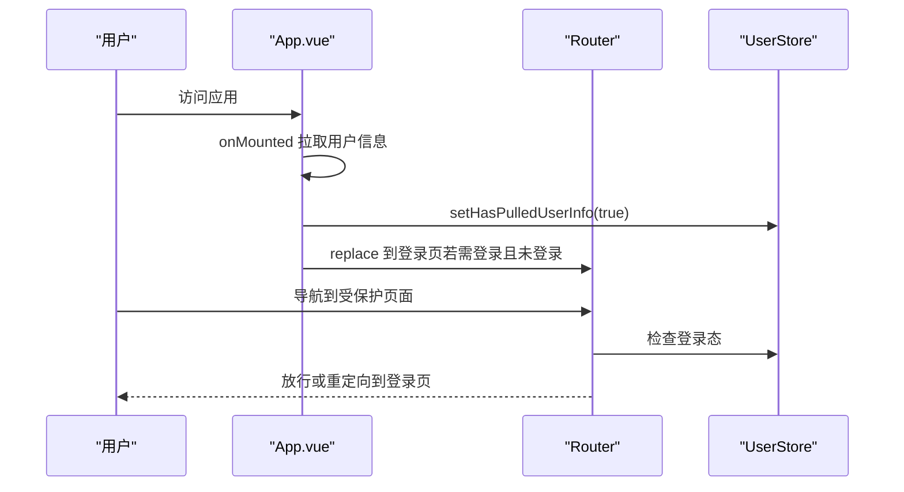

**图表来源**
- [frontend/src/App.vue:12-29](file://frontend/src/App.vue#L12-L29)
- [frontend/src/router/index.js:99-107](file://frontend/src/router/index.js#L99-L107)
- [frontend/src/stores/user.js:35-37](file://frontend/src/stores/user.js#L35-L37)

**章节来源**
- [frontend/src/router/index.js:1-110](file://frontend/src/router/index.js#L1-L110)
- [frontend/src/App.vue:1-41](file://frontend/src/App.vue#L1-L41)
- [frontend/src/stores/user.js:1-53](file://frontend/src/stores/user.js#L1-L53)

### 状态管理（Pinia）
- 用户信息：id、username、photo、profile、accessToken
- 方法：isLogin、setAccessToken、setUserInfo、logout、setHasPulledUserInfo
- 设计要点：以 ref 定义响应式状态，导出只读 getter 与可变 setter，避免跨模块直接修改

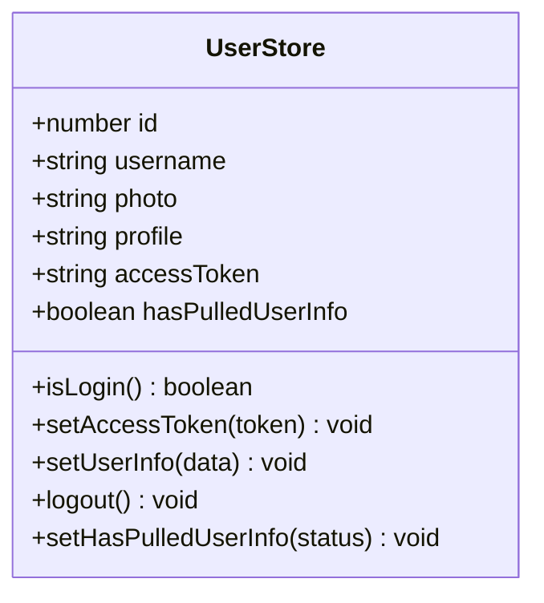

**图表来源**
- [frontend/src/stores/user.js:1-53](file://frontend/src/stores/user.js#L1-L53)

**章节来源**
- [frontend/src/stores/user.js:1-53](file://frontend/src/stores/user.js#L1-L53)

### HTTP 请求封装与认证流程
- Axios 实例：设置 baseURL、withCredentials，自动在请求头注入 Bearer Token
- 响应拦截器：捕获 401 未授权，触发刷新令牌流程；支持并发请求排队与重试
- 刷新令牌：通过 post /api/user/account/refresh_token/ 获取新 access token，失败则登出
- 上传场景：Base64 转 File 后通过 FormData 上传

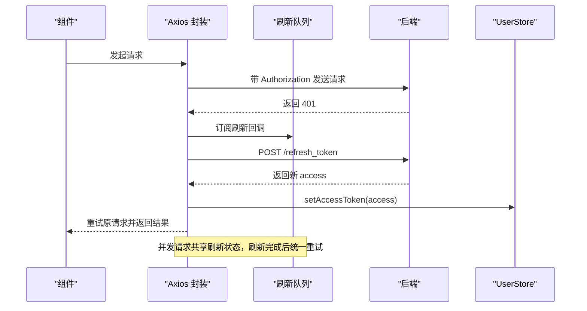

**图表来源**
- [frontend/src/js/http/api.js:21-89](file://frontend/src/js/http/api.js#L21-L89)
- [frontend/src/stores/user.js:16-18](file://frontend/src/stores/user.js#L16-L18)

**章节来源**
- [frontend/src/js/http/api.js:1-93](file://frontend/src/js/http/api.js#L1-L93)
- [frontend/src/js/utils/base64_to_file.js:1-10](file://frontend/src/js/utils/base64_to_file.js#L1-L10)

### 导航栏与菜单
- 响应用户登录态，动态显示“创作”、“登录”或用户菜单
- 侧边栏菜单项与 RouterLink 绑定，支持抽屉式展开/收起
- 图标组件以 SVG 渲染，保持体积小、可扩展性强

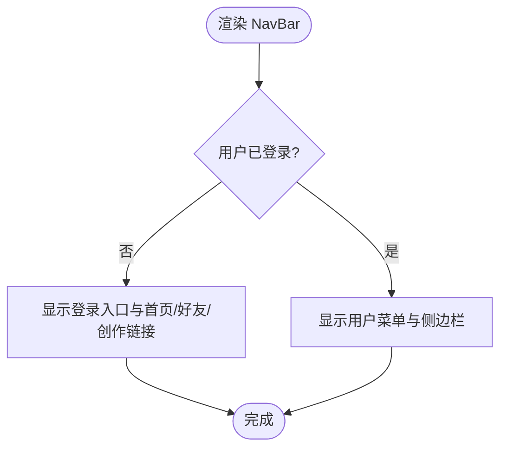

**图表来源**
- [frontend/src/components/navbar/NavBar.vue:1-77](file://frontend/src/components/navbar/NavBar.vue#L1-L77)
- [frontend/src/stores/user.js:12-14](file://frontend/src/stores/user.js#L12-L14)

**章节来源**
- [frontend/src/components/navbar/NavBar.vue:1-77](file://frontend/src/components/navbar/NavBar.vue#L1-L77)
- [frontend/src/stores/user.js:1-53](file://frontend/src/stores/user.js#L1-L53)

### 视图组件与业务流程

#### 登录与注册
- 表单校验：用户名/密码非空、两次密码一致
- 成功后写入 accessToken 与用户信息，跳转首页
- 错误提示统一显示在表单内

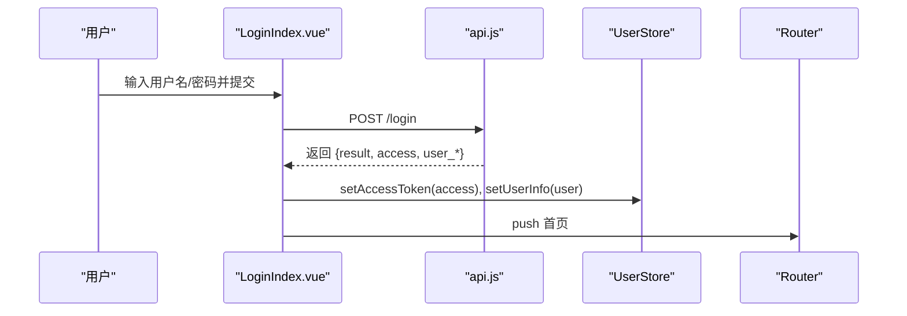

**图表来源**
- [frontend/src/views/user/account/LoginIndex.vue:14-39](file://frontend/src/views/user/account/LoginIndex.vue#L14-L39)
- [frontend/src/js/http/api.js:14-19](file://frontend/src/js/http/api.js#L14-L19)
- [frontend/src/stores/user.js:16-25](file://frontend/src/stores/user.js#L16-L25)
- [frontend/src/router/index.js:13-96](file://frontend/src/router/index.js#L13-L96)

**章节来源**
- [frontend/src/views/user/account/LoginIndex.vue:1-65](file://frontend/src/views/user/account/LoginIndex.vue#L1-L65)
- [frontend/src/views/user/account/RegisterIndex.vue:1-71](file://frontend/src/views/user/account/RegisterIndex.vue#L1-L71)

#### 个人资料编辑
- 使用子组件 Photo/Username/Profile 汇聚输入值
- 通过 base64ToFile 将头像转换为 File，再通过 FormData 提交
- 更新成功后同步 Pinia 中的用户信息

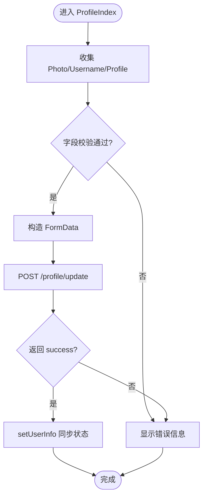

**图表来源**
- [frontend/src/views/user/profile/ProfileIndex.vue:17-47](file://frontend/src/views/user/profile/ProfileIndex.vue#L17-L47)
- [frontend/src/js/utils/base64_to_file.js:1-10](file://frontend/src/js/utils/base64_to_file.js#L1-L10)
- [frontend/src/stores/user.js:20-25](file://frontend/src/stores/user.js#L20-L25)

**章节来源**
- [frontend/src/views/user/profile/ProfileIndex.vue:1-71](file://frontend/src/views/user/profile/ProfileIndex.vue#L1-L71)
- [frontend/src/views/user/profile/components/Photo.vue:1-100](file://frontend/src/views/user/profile/components/Photo.vue#L1-L100)
- [frontend/src/js/utils/base64_to_file.js:1-10](file://frontend/src/js/utils/base64_to_file.js#L1-L10)

#### 角色创建
- 子组件 Photo/Name/Profile/BackgroundImage 负责输入与裁剪
- 通过 base64ToFile 转换图片，提交创建接口
- 成功后跳转到个人空间

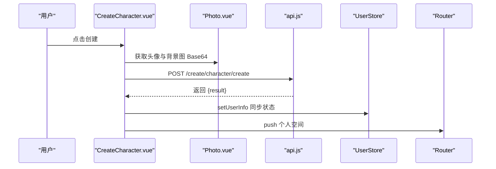

**图表来源**
- [frontend/src/views/create/character/CreateCharacter.vue:21-59](file://frontend/src/views/create/character/CreateCharacter.vue#L21-L59)
- [frontend/src/views/create/character/components/Photo.vue:19-45](file://frontend/src/views/create/character/components/Photo.vue#L19-L45)
- [frontend/src/js/http/api.js:14-19](file://frontend/src/js/http/api.js#L14-L19)
- [frontend/src/router/index.js:73-79](file://frontend/src/router/index.js#L73-L79)

**章节来源**
- [frontend/src/views/create/character/CreateCharacter.vue:1-84](file://frontend/src/views/create/character/CreateCharacter.vue#L1-L84)
- [frontend/src/views/create/character/components/Photo.vue:1-99](file://frontend/src/views/create/character/components/Photo.vue#L1-L99)

### 组件交互与数据流

#### 头像选择与裁剪流程
- 文件选择 -> FileReader 读取 -> Croppie 弹窗裁剪 -> Base64 输出 -> 父组件接收
- 组件销毁时释放 Croppie 资源，避免内存泄漏

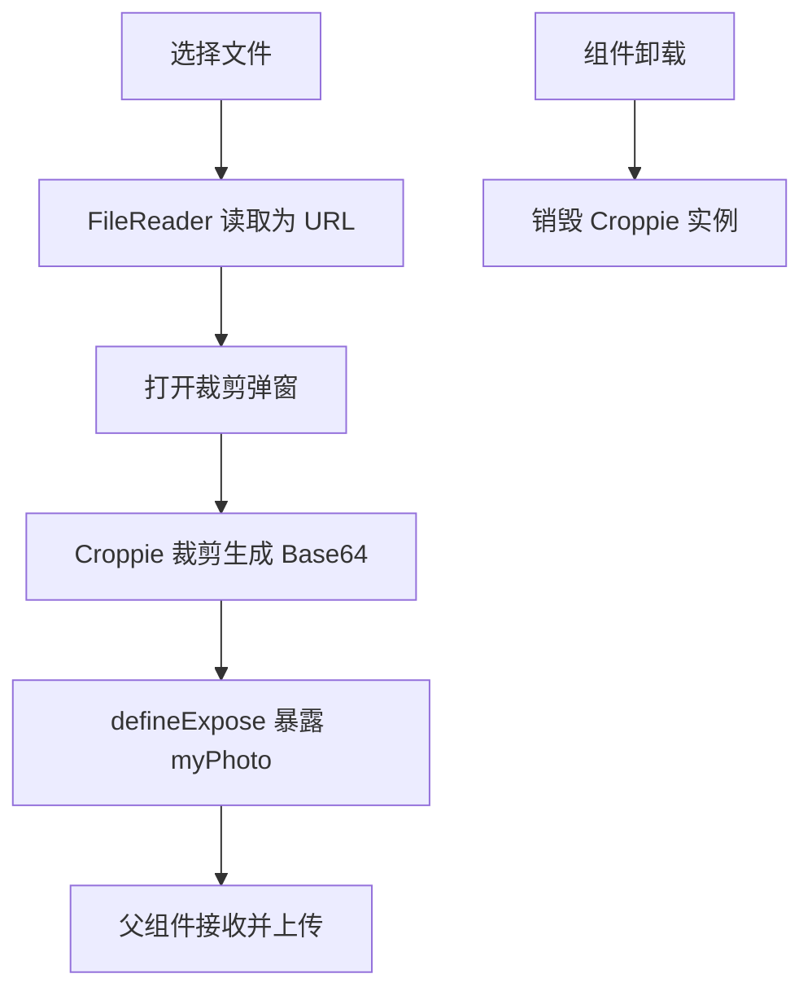

**图表来源**
- [frontend/src/views/user/profile/components/Photo.vue:48-63](file://frontend/src/views/user/profile/components/Photo.vue#L48-L63)
- [frontend/src/views/create/character/components/Photo.vue:59-61](file://frontend/src/views/create/character/components/Photo.vue#L59-L61)

**章节来源**
- [frontend/src/views/user/profile/components/Photo.vue:1-100](file://frontend/src/views/user/profile/components/Photo.vue#L1-L100)
- [frontend/src/views/create/character/components/Photo.vue:1-99](file://frontend/src/views/create/character/components/Photo.vue#L1-L99)

## 依赖关系分析
- 构建与运行：Vite + Vue 插件 + TailwindCSS + DevTools
- 运行时依赖：Vue 3、Vue Router、Pinia、Axios、TailwindCSS
- 业务耦合：视图组件依赖 HTTP 封装与 Pinia；导航栏依赖用户状态；路由依赖守卫与 meta

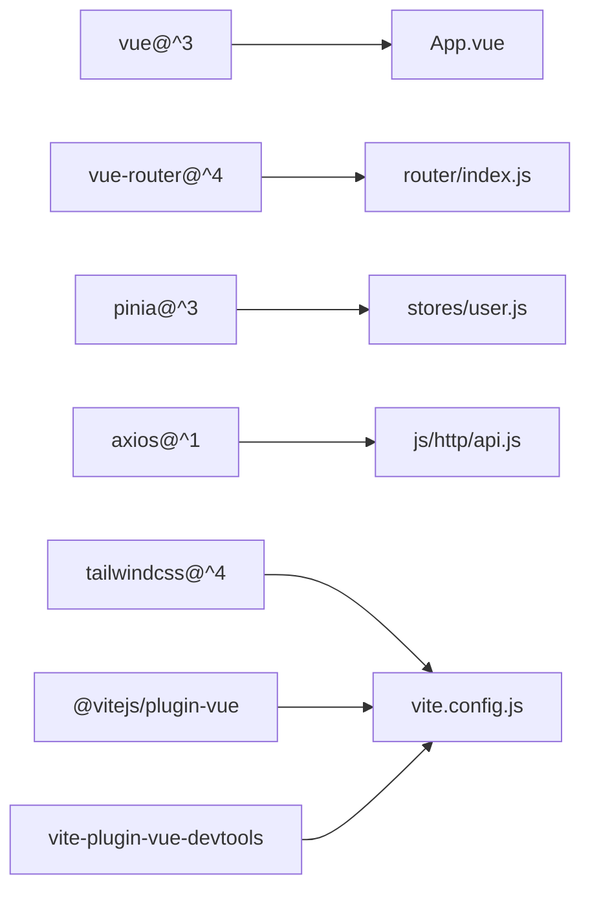

**图表来源**
- [frontend/package.json:14-28](file://frontend/package.json#L14-L28)
- [frontend/vite.config.js:1-26](file://frontend/vite.config.js#L1-L26)
- [frontend/src/App.vue:1-41](file://frontend/src/App.vue#L1-L41)
- [frontend/src/router/index.js:1-110](file://frontend/src/router/index.js#L1-L110)
- [frontend/src/stores/user.js:1-53](file://frontend/src/stores/user.js#L1-L53)
- [frontend/src/js/http/api.js:1-93](file://frontend/src/js/http/api.js#L1-L93)

**章节来源**
- [frontend/package.json:1-30](file://frontend/package.json#L1-L30)
- [frontend/vite.config.js:1-26](file://frontend/vite.config.js#L1-L26)

## 性能考虑
- 构建产物输出到 Django 静态目录，减少跨域与额外代理配置
- 路由懒加载：当前路由集中导入，可进一步拆分为按需加载以降低首屏体积
- 组件裁剪：Croppie 在组件卸载时销毁实例，避免内存泄漏
- 请求缓存：可引入 axios 缓存策略或本地缓存用户信息，减少重复请求
- 图片优化：Base64 仅用于小尺寸头像裁剪，大图建议直传或压缩后再上传

[本节为通用性能建议，无需特定文件引用]

## 故障排查指南
- 登录后仍被重定向到登录页
  - 检查路由守卫是否正确读取登录态与 meta 标记
  - 确认根组件 onMounted 是否执行并设置 hasPulledUserInfo
- 401 未授权频繁出现
  - 检查刷新令牌接口是否可用，刷新队列是否正确重试
  - 确认 withCredentials 与 Cookie 传递
- 头像裁剪异常
  - 确保 Croppie 实例在组件销毁时正确释放
  - 检查 FileReader 读取与 Base64 转 File 的兼容性
- 上传失败
  - 检查 FormData 字段名与后端接口一致
  - 确认 Base64ToFile 生成的 File 类型匹配后端期望

**章节来源**
- [frontend/src/router/index.js:99-107](file://frontend/src/router/index.js#L99-L107)
- [frontend/src/App.vue:12-29](file://frontend/src/App.vue#L12-L29)
- [frontend/src/js/http/api.js:46-89](file://frontend/src/js/http/api.js#L46-L89)
- [frontend/src/views/user/profile/components/Photo.vue:59-63](file://frontend/src/views/user/profile/components/Photo.vue#L59-L63)
- [frontend/src/js/utils/base64_to_file.js:1-10](file://frontend/src/js/utils/base64_to_file.js#L1-L10)

## 结论
该前端架构以 Vue 3 Composition API 为核心，结合 Vite 的高效开发体验与 Pinia 的轻量状态管理，实现了清晰的路由权限控制与完善的认证刷新机制。通过模块化的视图与组件组织、统一的 HTTP 封装以及可维护的目录结构，满足了多页面业务场景下的可扩展性与可维护性需求。后续可在路由懒加载、请求缓存与图片优化等方面进一步提升性能与用户体验。

## 附录
- 目录结构设计原则
  - 按功能域划分 views，便于团队协作与职责分离
  - 组件按复用度拆分，通用 UI 放置于 components，业务组件放置于对应 views 下
  - 工具函数集中于 js/utils，避免散落
- 代码规范建议
  - 统一使用 Composition API 与 script setup
  - 组件命名语义化，props 与 expose 明确
  - 路由 meta 标记访问权限，守卫逻辑集中
  - HTTP 封装统一错误处理与重试策略

[本节为通用规范建议，无需特定文件引用]