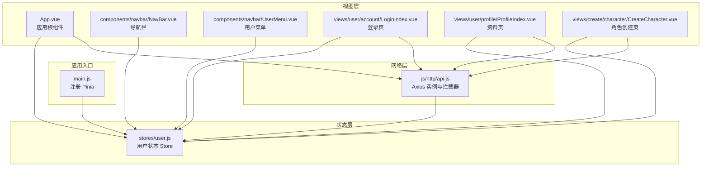
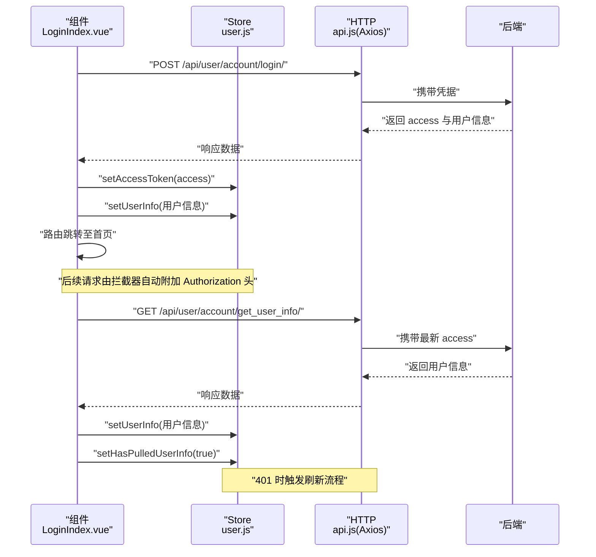
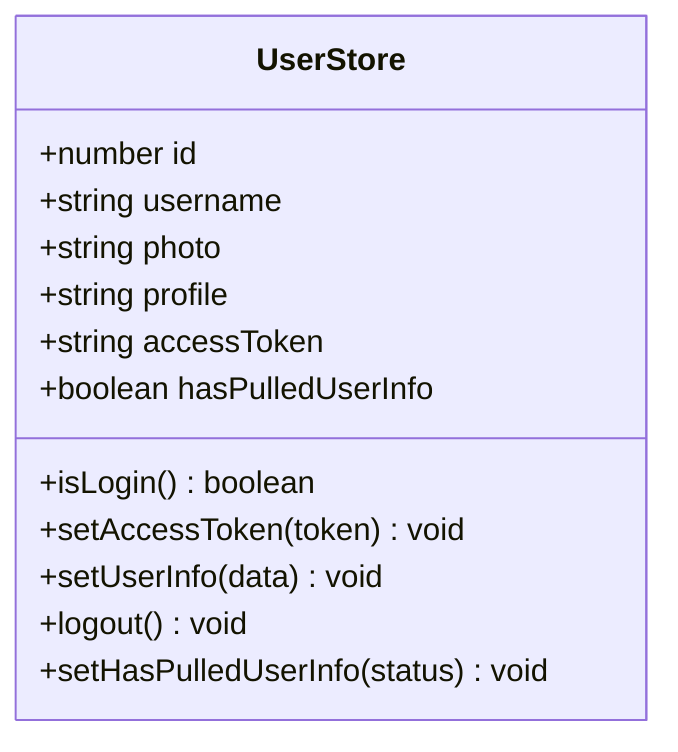
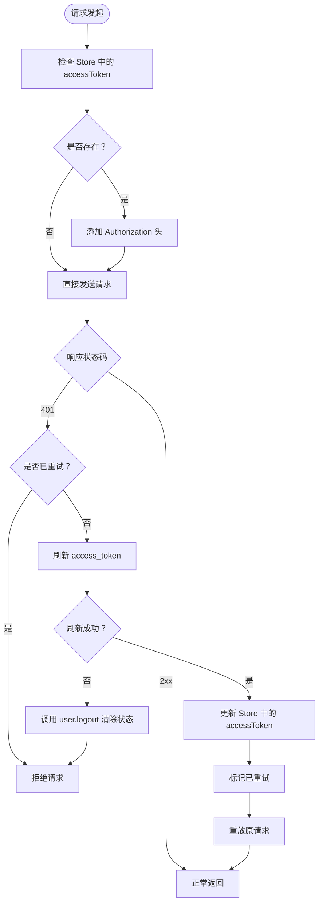
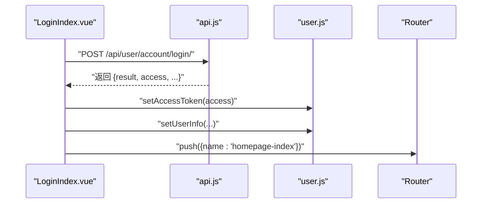
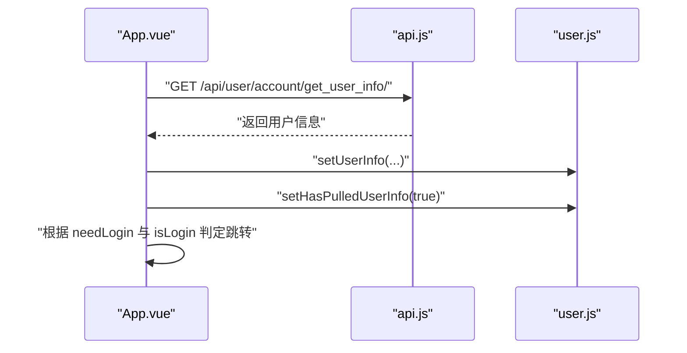
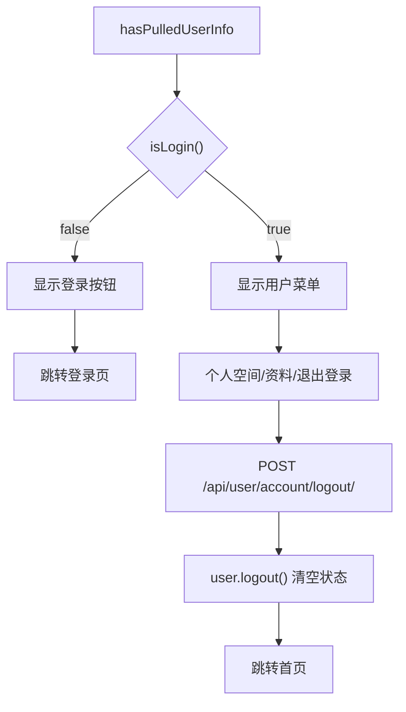
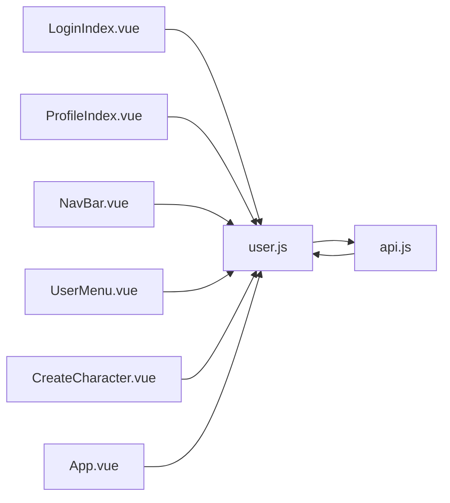

# 状态管理

<cite>
**本文引用的文件**
- [frontend/src/stores/user.js](file://frontend/src/stores/user.js)
- [frontend/src/main.js](file://frontend/src/main.js)
- [frontend/package.json](file://frontend/package.json)
- [frontend/src/App.vue](file://frontend/src/App.vue)
- [frontend/src/js/http/api.js](file://frontend/src/js/http/api.js)
- [frontend/src/views/user/account/LoginIndex.vue](file://frontend/src/views/user/account/LoginIndex.vue)
- [frontend/src/views/user/profile/ProfileIndex.vue](file://frontend/src/views/user/profile/ProfileIndex.vue)
- [frontend/src/components/navbar/NavBar.vue](file://frontend/src/components/navbar/NavBar.vue)
- [frontend/src/components/navbar/UserMenu.vue](file://frontend/src/components/navbar/UserMenu.vue)
- [frontend/src/views/create/character/CreateCharacter.vue](file://frontend/src/views/create/character/CreateCharacter.vue)
</cite>

## 目录
1. [引言](#引言)
2. [项目结构](#项目结构)
3. [核心组件](#核心组件)
4. [架构总览](#架构总览)
5. [详细组件分析](#详细组件分析)
6. [依赖分析](#依赖分析)
7. [性能考虑](#性能考虑)
8. [故障排查指南](#故障排查指南)
9. [结论](#结论)
10. [附录](#附录)

## 引言
本文件面向 LLM_AIfriends 前端的 Pinia 状态管理子系统，聚焦用户状态 Store 的设计与使用。内容涵盖：
- Pinia 核心概念与 Store 设计模式
- 用户状态 Store 的结构、状态持久化策略与状态同步机制
- Action 的异步处理、Getter 的计算属性与状态订阅模式
- 状态模块化设计、命名空间管理与跨组件状态共享
- Store 定义示例、状态更新流程与实际使用场景

## 项目结构
前端采用 Vue 3 + Pinia 架构，状态管理集中在 stores 目录；应用入口在 main.js 中注册 Pinia；HTTP 层通过 axios 拦截器实现 Token 自动注入与刷新。

图表来源
- [frontend/src/main.js:1-15](file://frontend/src/main.js#L1-L15)
- [frontend/src/stores/user.js:1-53](file://frontend/src/stores/user.js#L1-L53)
- [frontend/src/App.vue:1-41](file://frontend/src/App.vue#L1-L41)
- [frontend/src/js/http/api.js:1-93](file://frontend/src/js/http/api.js#L1-L93)
- [frontend/src/views/user/account/LoginIndex.vue:1-65](file://frontend/src/views/user/account/LoginIndex.vue#L1-L65)
- [frontend/src/views/user/profile/ProfileIndex.vue:1-71](file://frontend/src/views/user/profile/ProfileIndex.vue#L1-L71)
- [frontend/src/components/navbar/NavBar.vue:1-77](file://frontend/src/components/navbar/NavBar.vue#L1-L77)
- [frontend/src/components/navbar/UserMenu.vue:1-74](file://frontend/src/components/navbar/UserMenu.vue#L1-L74)
- [frontend/src/views/create/character/CreateCharacter.vue:1-84](file://frontend/src/views/create/character/CreateCharacter.vue#L1-L84)

章节来源
- [frontend/src/main.js:1-15](file://frontend/src/main.js#L1-L15)
- [frontend/package.json:1-30](file://frontend/package.json#L1-L30)

## 核心组件
- 用户状态 Store（user.js）
  - 状态字段：id、username、photo、profile、accessToken、hasPulledUserInfo
  - 行为方法：isLogin、setAccessToken、setUserInfo、logout、setHasPulledUserInfo
  - 返回值：将状态与方法以对象形式暴露，供组件直接解构使用
- 应用入口（main.js）
  - 创建并挂载 Pinia，确保全局可用
- HTTP 模块（api.js）
  - 请求拦截：自动在 Authorization 头注入 Bearer Token
  - 响应拦截：401 时触发刷新流程，成功后重试原请求，失败则登出并拒绝请求
- 视图组件
  - 登录页：提交凭据后写入 accessToken 与用户信息，并跳转首页
  - 资料页：读取用户信息并提交更新，成功后写回 Store
  - 导航栏与用户菜单：根据 isLogin 与 hasPulledUserInfo 控制渲染与路由跳转
  - 角色创建页：读取当前用户 id，用于创建完成后跳转个人空间

章节来源
- [frontend/src/stores/user.js:1-53](file://frontend/src/stores/user.js#L1-L53)
- [frontend/src/main.js:1-15](file://frontend/src/main.js#L1-L15)
- [frontend/src/js/http/api.js:1-93](file://frontend/src/js/http/api.js#L1-L93)
- [frontend/src/views/user/account/LoginIndex.vue:1-65](file://frontend/src/views/user/account/LoginIndex.vue#L1-L65)
- [frontend/src/views/user/profile/ProfileIndex.vue:1-71](file://frontend/src/views/user/profile/ProfileIndex.vue#L1-L71)
- [frontend/src/components/navbar/NavBar.vue:1-77](file://frontend/src/components/navbar/NavBar.vue#L1-L77)
- [frontend/src/components/navbar/UserMenu.vue:1-74](file://frontend/src/components/navbar/UserMenu.vue#L1-L74)
- [frontend/src/views/create/character/CreateCharacter.vue:1-84](file://frontend/src/views/create/character/CreateCharacter.vue#L1-L84)

## 架构总览
下图展示从组件到 Store、再到 HTTP 层的整体交互路径，以及 Token 刷新与状态同步的关键节点。

图表来源
- [frontend/src/views/user/account/LoginIndex.vue:14-39](file://frontend/src/views/user/account/LoginIndex.vue#L14-L39)
- [frontend/src/App.vue:12-29](file://frontend/src/App.vue#L12-L29)
- [frontend/src/js/http/api.js:21-90](file://frontend/src/js/http/api.js#L21-L90)
- [frontend/src/stores/user.js:16-37](file://frontend/src/stores/user.js#L16-L37)

## 详细组件分析

### 用户状态 Store（user.js）
- 设计模式
  - 使用组合式 Store（setup 函数风格），返回响应式状态与方法
  - 将状态与行为封装在同一 Store 内，便于维护与复用
- 状态字段
  - id、username、photo、profile：用户基本信息
  - accessToken：认证令牌
  - hasPulledUserInfo：是否已拉取过用户信息（用于控制导航栏显示逻辑）
- 方法
  - isLogin：基于 accessToken 是否存在判断登录态
  - setAccessToken：设置访问令牌
  - setUserInfo：批量写入用户信息
  - logout：清空所有用户状态
  - setHasPulledUserInfo：标记用户信息拉取完成
- Getter 与订阅
  - isLogin 可视为“计算属性”式的 getter，供模板与逻辑条件使用
  - 组件通过直接读取响应式 ref 实现订阅，无需额外订阅 API

图表来源
- [frontend/src/stores/user.js:4-52](file://frontend/src/stores/user.js#L4-L52)

章节来源
- [frontend/src/stores/user.js:1-53](file://frontend/src/stores/user.js#L1-L53)

### 应用入口与全局初始化（main.js）
- 在应用启动时创建并安装 Pinia 插件，使任意组件可通过 useUserStore 访问 Store
- 保证全局状态可用性与生命周期一致性

章节来源
- [frontend/src/main.js:1-15](file://frontend/src/main.js#L1-L15)

### HTTP 拦截器与 Token 刷新（api.js）
- 请求拦截
  - 若 Store 中存在 accessToken，则自动在请求头添加 Authorization: Bearer
- 响应拦截
  - 遇到 401 且未重试过时：
    - 串行化后续请求，等待刷新完成
    - 使用后端刷新接口换取新 access
    - 成功：更新 Store 中的 accessToken 并重放原请求
    - 失败：调用 user.logout 清除本地状态，拒绝原请求
- 订阅模式
  - 通过订阅队列在刷新期间排队等待，避免并发刷新与重复刷新

图表来源
- [frontend/src/js/http/api.js:21-90](file://frontend/src/js/http/api.js#L21-L90)
- [frontend/src/stores/user.js:16-37](file://frontend/src/stores/user.js#L16-L37)

章节来源
- [frontend/src/js/http/api.js:1-93](file://frontend/src/js/http/api.js#L1-L93)

### 登录流程（LoginIndex.vue）
- 输入校验与错误提示
- 调用后端登录接口，接收 access 与用户信息
- 写入 Store：setAccessToken 与 setUserInfo
- 跳转首页

图表来源
- [frontend/src/views/user/account/LoginIndex.vue:14-39](file://frontend/src/views/user/account/LoginIndex.vue#L14-L39)
- [frontend/src/stores/user.js:16-25](file://frontend/src/stores/user.js#L16-L25)

章节来源
- [frontend/src/views/user/account/LoginIndex.vue:1-65](file://frontend/src/views/user/account/LoginIndex.vue#L1-L65)

### 获取与更新用户信息（App.vue、ProfileIndex.vue）
- 首屏拉取
  - 应用挂载后调用获取用户信息接口
  - 成功后 setUserInfo 写入 Store，并 setHasPulledUserInfo(true)
  - 根据路由元信息与 isLogin 判断是否需要跳转登录
- 资料更新
  - 收集表单数据，必要时上传图片
  - 调用更新接口，成功后再次 setUserInfo 同步 Store

图表来源
- [frontend/src/App.vue:12-29](file://frontend/src/App.vue#L12-L29)
- [frontend/src/stores/user.js:20-25](file://frontend/src/stores/user.js#L20-L25)

章节来源
- [frontend/src/App.vue:1-41](file://frontend/src/App.vue#L1-L41)
- [frontend/src/views/user/profile/ProfileIndex.vue:17-47](file://frontend/src/views/user/profile/ProfileIndex.vue#L17-L47)

### 导航栏与用户菜单（NavBar.vue、UserMenu.vue）
- 导航栏根据 hasPulledUserInfo 与 isLogin 控制“创作”、“登录”、“用户菜单”的显示
- 用户菜单展示头像、用户名，并提供个人空间、编辑资料、退出登录等操作
- 退出登录时调用后端接口并执行 user.logout 清空本地状态

图表来源
- [frontend/src/components/navbar/NavBar.vue:34-41](file://frontend/src/components/navbar/NavBar.vue#L34-L41)
- [frontend/src/components/navbar/UserMenu.vue:17-28](file://frontend/src/components/navbar/UserMenu.vue#L17-L28)
- [frontend/src/stores/user.js:27-33](file://frontend/src/stores/user.js#L27-L33)

章节来源
- [frontend/src/components/navbar/NavBar.vue:1-77](file://frontend/src/components/navbar/NavBar.vue#L1-L77)
- [frontend/src/components/navbar/UserMenu.vue:1-74](file://frontend/src/components/navbar/UserMenu.vue#L1-L74)

### 角色创建流程（CreateCharacter.vue）
- 读取当前用户 id，用于创建完成后跳转个人空间
- 收集角色信息与图片，提交创建接口
- 成功后路由跳转至个人空间

章节来源
- [frontend/src/views/create/character/CreateCharacter.vue:1-84](file://frontend/src/views/create/character/CreateCharacter.vue#L1-L84)

## 依赖分析
- 组件对 Store 的依赖
  - 所有涉及用户态的页面均导入并使用 useUserStore
  - Store 仅被组件与 HTTP 拦截器间接依赖
- Store 对外部的依赖
  - 通过 HTTP 模块进行认证与用户信息同步
  - 无持久化存储（如 localStorage/sessionStorage）的直接依赖
- 模块耦合度
  - 组件与 Store 解耦，通过函数调用解耦合
  - HTTP 拦截器与 Store 强耦合（读取/写入 accessToken），但职责清晰

图表来源
- [frontend/src/views/user/account/LoginIndex.vue:3](file://frontend/src/views/user/account/LoginIndex.vue#L3)
- [frontend/src/views/user/profile/ProfileIndex.vue:5](file://frontend/src/views/user/profile/ProfileIndex.vue#L5)
- [frontend/src/components/navbar/NavBar.vue:7](file://frontend/src/components/navbar/NavBar.vue#L7)
- [frontend/src/components/navbar/UserMenu.vue:2](file://frontend/src/components/navbar/UserMenu.vue#L2)
- [frontend/src/views/create/character/CreateCharacter.vue:10](file://frontend/src/views/create/character/CreateCharacter.vue#L10)
- [frontend/src/App.vue:4](file://frontend/src/App.vue#L4)
- [frontend/src/js/http/api.js:12](file://frontend/src/js/http/api.js#L12)
- [frontend/src/stores/user.js:1](file://frontend/src/stores/user.js#L1)

章节来源
- [frontend/src/stores/user.js:1-53](file://frontend/src/stores/user.js#L1-L53)
- [frontend/src/js/http/api.js:1-93](file://frontend/src/js/http/api.js#L1-L93)

## 性能考虑
- 响应式粒度
  - Store 使用细粒度 ref，组件按需读取，减少不必要渲染
- 请求去重
  - HTTP 拦截器中通过 isRefreshing 与订阅队列避免并发刷新
- 初始化策略
  - 首屏拉取用户信息后设置 hasPulledUserInfo，避免重复请求与闪烁
- 图片处理
  - 资料更新时仅在头像变更时上传，降低网络开销

## 故障排查指南
- 登录后仍显示未登录
  - 检查登录页是否正确调用 setAccessToken 与 setUserInfo
  - 确认导航栏 hasPulledUserInfo 已置为 true
- 401 频繁出现
  - 检查拦截器是否正确附加 Authorization 头
  - 确认刷新接口可用且返回新的 access
  - 查看刷新失败分支是否触发了 user.logout
- 退出登录无效
  - 确认后端登出接口返回成功
  - 检查 user.logout 是否被调用
  - 确认路由跳转逻辑生效

章节来源
- [frontend/src/views/user/account/LoginIndex.vue:14-39](file://frontend/src/views/user/account/LoginIndex.vue#L14-L39)
- [frontend/src/js/http/api.js:46-90](file://frontend/src/js/http/api.js#L46-L90)
- [frontend/src/components/navbar/UserMenu.vue:17-28](file://frontend/src/components/navbar/UserMenu.vue#L17-L28)

## 结论
本项目采用 Pinia 组合式 Store 管理用户状态，结合 axios 拦截器实现 Token 自动注入与刷新，形成“组件 -> Store -> HTTP -> 后端”的清晰链路。Store 提供最小可变单元与明确的行为接口，组件通过直接读取响应式状态实现订阅，无需额外订阅 API。整体设计简洁、内聚、易扩展，适合中小型项目的前端状态管理需求。

## 附录
- Store 定义示例（参考路径）
  - [frontend/src/stores/user.js:4-52](file://frontend/src/stores/user.js#L4-L52)
- 状态更新流程（参考路径）
  - 登录写入：[frontend/src/views/user/account/LoginIndex.vue:27-29](file://frontend/src/views/user/account/LoginIndex.vue#L27-L29)
  - 首屏拉取：[frontend/src/App.vue:14-21](file://frontend/src/App.vue#L14-L21)
  - 资料更新：[frontend/src/views/user/profile/ProfileIndex.vue:39-40](file://frontend/src/views/user/profile/ProfileIndex.vue#L39-L40)
- 实际使用场景（参考路径）
  - 导航栏登录态判定：[frontend/src/components/navbar/NavBar.vue:34-41](file://frontend/src/components/navbar/NavBar.vue#L34-L41)
  - 用户菜单退出登录：[frontend/src/components/navbar/UserMenu.vue:17-28](file://frontend/src/components/navbar/UserMenu.vue#L17-L28)
  - 角色创建使用用户 id：[frontend/src/views/create/character/CreateCharacter.vue:47-52](file://frontend/src/views/create/character/CreateCharacter.vue#L47-L52)