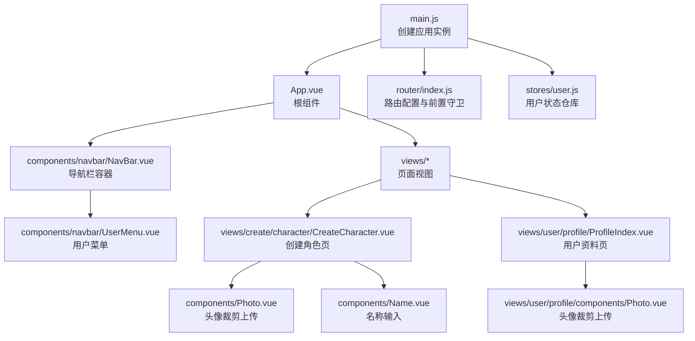
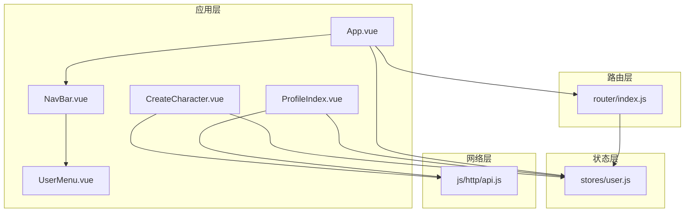
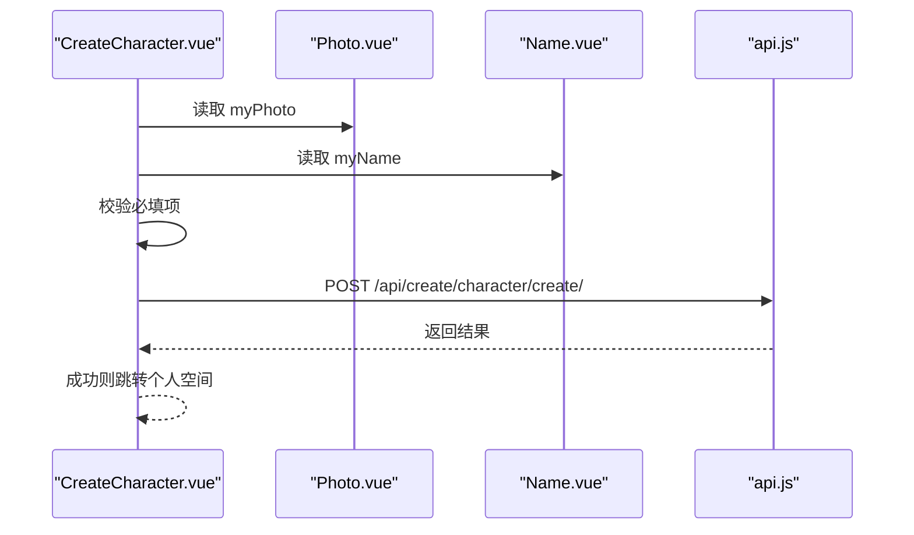
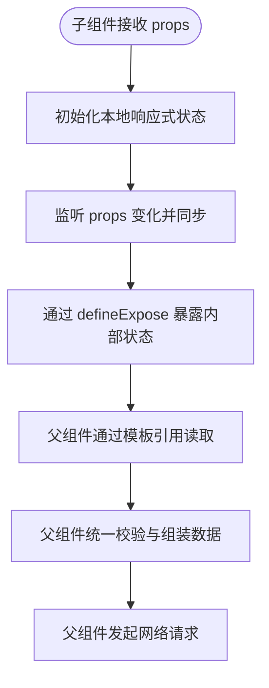
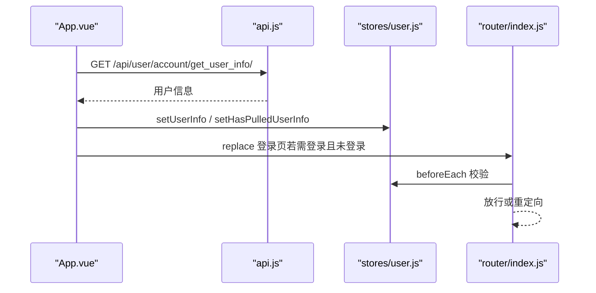
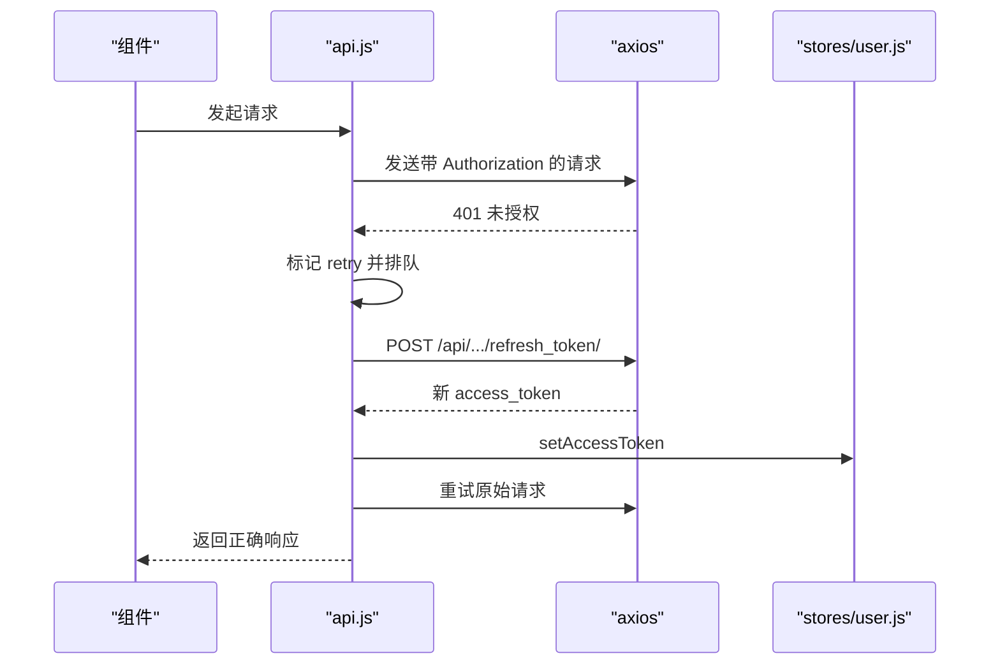
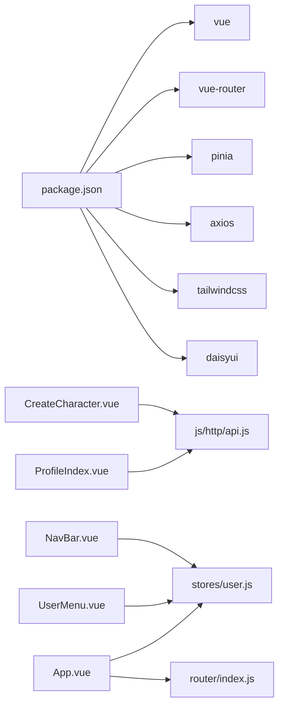

# 组件架构

<cite>
**本文引用的文件**
- [App.vue](file://frontend/src/App.vue)
- [main.js](file://frontend/src/main.js)
- [router/index.js](file://frontend/src/router/index.js)
- [stores/user.js](file://frontend/src/stores/user.js)
- [components/navbar/NavBar.vue](file://frontend/src/components/navbar/NavBar.vue)
- [components/navbar/UserMenu.vue](file://frontend/src/components/navbar/UserMenu.vue)
- [views/create/character/CreateCharacter.vue](file://frontend/src/views/create/character/CreateCharacter.vue)
- [views/create/character/components/Photo.vue](file://frontend/src/views/create/character/components/Photo.vue)
- [views/create/character/components/Name.vue](file://frontend/src/views/create/character/components/Name.vue)
- [views/user/profile/ProfileIndex.vue](file://frontend/src/views/user/profile/ProfileIndex.vue)
- [views/user/profile/components/Photo.vue](file://frontend/src/views/user/profile/components/Photo.vue)
- [js/http/api.js](file://frontend/src/js/http/api.js)
- [js/utils/base64_to_file.js](file://frontend/src/js/utils/base64_to_file.js)
- [assets/main.css](file://frontend/src/assets/main.css)
- [package.json](file://frontend/package.json)
</cite>

## 目录
1. [引言](#引言)
2. [项目结构](#项目结构)
3. [核心组件](#核心组件)
4. [架构总览](#架构总览)
5. [详细组件分析](#详细组件分析)
6. [依赖关系分析](#依赖关系分析)
7. [性能考量](#性能考量)
8. [故障排查指南](#故障排查指南)
9. [结论](#结论)
10. [附录](#附录)

## 引言
本文件面向 LLM_AIfriends 前端的 Vue 3 组件架构，系统性梳理 Composition API 使用模式、组件设计原则与复用策略，重点覆盖：
- 组件层次结构、父子与兄弟协作方式
- 可复用组件的设计规范、Props 规范与事件处理机制
- 生命周期管理、模板语法优化与性能考虑
- 路由守卫、全局状态与网络层拦截器的协同
- 设计模式、最佳实践与常见问题排查

## 项目结构
前端采用 Vite + Vue 3 + Pinia + Vue Router 的现代单页应用架构。入口通过 main.js 创建应用实例，挂载路由与状态管理；App.vue 作为根组件，承载导航栏与路由视图；各功能页面以视图组件为中心，内部组合可复用子组件。

图表来源
- [main.js:1-15](file://frontend/src/main.js#L1-L15)
- [App.vue:1-41](file://frontend/src/App.vue#L1-L41)
- [router/index.js:1-110](file://frontend/src/router/index.js#L1-L110)
- [stores/user.js:1-53](file://frontend/src/stores/user.js#L1-L53)
- [components/navbar/NavBar.vue:1-77](file://frontend/src/components/navbar/NavBar.vue#L1-L77)
- [components/navbar/UserMenu.vue:1-74](file://frontend/src/components/navbar/UserMenu.vue#L1-L74)
- [views/create/character/CreateCharacter.vue:1-84](file://frontend/src/views/create/character/CreateCharacter.vue#L1-L84)
- [views/create/character/components/Photo.vue:1-99](file://frontend/src/views/create/character/components/Photo.vue#L1-L99)
- [views/create/character/components/Name.vue:1-25](file://frontend/src/views/create/character/components/Name.vue#L1-L25)
- [views/user/profile/ProfileIndex.vue:1-71](file://frontend/src/views/user/profile/ProfileIndex.vue#L1-L71)
- [views/user/profile/components/Photo.vue:1-100](file://frontend/src/views/user/profile/components/Photo.vue#L1-L100)

章节来源
- [main.js:1-15](file://frontend/src/main.js#L1-L15)
- [App.vue:1-41](file://frontend/src/App.vue#L1-L41)
- [router/index.js:1-110](file://frontend/src/router/index.js#L1-L110)
- [stores/user.js:1-53](file://frontend/src/stores/user.js#L1-L53)
- [assets/main.css:1-3](file://frontend/src/assets/main.css#L1-L3)
- [package.json:1-30](file://frontend/package.json#L1-L30)

## 核心组件
- 应用入口与初始化
  - main.js：创建应用实例，注册 Pinia 与路由，挂载到 DOM。
  - App.vue：在挂载阶段拉取用户信息、设置登录态，根据路由元信息进行登录校验跳转。
- 导航与用户态
  - NavBar.vue：响应式抽屉式导航，条件渲染“创作”、“登录”或用户菜单。
  - UserMenu.vue：用户头像下拉菜单，支持跳转个人空间、编辑资料与退出登录。
- 页面与表单
  - CreateCharacter.vue：聚合 Photo、Name、Profile、BackgroundImage 子组件，收集数据并提交。
  - ProfileIndex.vue：聚合用户资料相关子组件，支持头像裁剪与资料更新。
- 状态与网络
  - user.js：Pinia 组合式 Store，集中管理用户信息与登录态。
  - api.js：Axios 实例封装，统一注入 Authorization 头，处理 401 自动刷新与重试。

章节来源
- [main.js:1-15](file://frontend/src/main.js#L1-L15)
- [App.vue:1-41](file://frontend/src/App.vue#L1-L41)
- [components/navbar/NavBar.vue:1-77](file://frontend/src/components/navbar/NavBar.vue#L1-L77)
- [components/navbar/UserMenu.vue:1-74](file://frontend/src/components/navbar/UserMenu.vue#L1-L74)
- [views/create/character/CreateCharacter.vue:1-84](file://frontend/src/views/create/character/CreateCharacter.vue#L1-L84)
- [views/user/profile/ProfileIndex.vue:1-71](file://frontend/src/views/user/profile/ProfileIndex.vue#L1-L71)
- [stores/user.js:1-53](file://frontend/src/stores/user.js#L1-L53)
- [js/http/api.js:1-93](file://frontend/src/js/http/api.js#L1-L93)

## 架构总览
整体采用“容器-展示”分层与“组合式复用”的设计思路：
- 容器层：App.vue、NavBar.vue、CreateCharacter.vue、ProfileIndex.vue 负责业务流程与状态协调。
- 展示层：Photo、Name 等子组件负责单一职责的数据输入与 UI 呈现。
- 状态层：Pinia Store 提供跨组件共享的状态，避免重复请求与状态漂移。
- 路由层：router/index.js 定义路由与前置守卫，结合用户状态控制访问权限。
- 网络层：api.js 封装请求拦截与响应拦截，自动处理鉴权与刷新。

图表来源
- [App.vue:1-41](file://frontend/src/App.vue#L1-L41)
- [components/navbar/NavBar.vue:1-77](file://frontend/src/components/navbar/NavBar.vue#L1-L77)
- [components/navbar/UserMenu.vue:1-74](file://frontend/src/components/navbar/UserMenu.vue#L1-L74)
- [views/create/character/CreateCharacter.vue:1-84](file://frontend/src/views/create/character/CreateCharacter.vue#L1-L84)
- [views/user/profile/ProfileIndex.vue:1-71](file://frontend/src/views/user/profile/ProfileIndex.vue#L1-L71)
- [stores/user.js:1-53](file://frontend/src/stores/user.js#L1-L53)
- [router/index.js:1-110](file://frontend/src/router/index.js#L1-L110)
- [js/http/api.js:1-93](file://frontend/src/js/http/api.js#L1-L93)

## 详细组件分析

### 组件层次与父子通信
- 容器-子组件模式
  - CreateCharacter.vue 作为容器，聚合多个子组件并通过模板引用收集数据，最终发起网络请求。
  - ProfileIndex.vue 同样作为容器，聚合 Photo、Username、Profile 子组件，实现资料更新。
- 父传子 Props 与子暴露 Expose
  - Photo、Name 等子组件通过 defineProps 接收初始值，并通过 defineExpose 暴露内部响应式数据，便于父组件读取。
  - watch 监听 props 变化，保证外部更新能同步到子组件内部状态，提升复用性与一致性。
- 兄弟组件协作
  - 通过父组件模板引用与统一校验逻辑，实现多子组件间的协同与错误提示统一管理。

图表来源
- [views/create/character/CreateCharacter.vue:1-84](file://frontend/src/views/create/character/CreateCharacter.vue#L1-L84)
- [views/create/character/components/Photo.vue:1-99](file://frontend/src/views/create/character/components/Photo.vue#L1-L99)
- [views/create/character/components/Name.vue:1-25](file://frontend/src/views/create/character/components/Name.vue#L1-L25)
- [js/http/api.js:1-93](file://frontend/src/js/http/api.js#L1-L93)

章节来源
- [views/create/character/CreateCharacter.vue:1-84](file://frontend/src/views/create/character/CreateCharacter.vue#L1-L84)
- [views/create/character/components/Photo.vue:1-99](file://frontend/src/views/create/character/components/Photo.vue#L1-L99)
- [views/create/character/components/Name.vue:1-25](file://frontend/src/views/create/character/components/Name.vue#L1-L25)
- [views/user/profile/ProfileIndex.vue:1-71](file://frontend/src/views/user/profile/ProfileIndex.vue#L1-L71)
- [views/user/profile/components/Photo.vue:1-100](file://frontend/src/views/user/profile/components/Photo.vue#L1-L100)

### 可复用组件设计规范与 Props/事件
- Props 规范
  - 所有子组件均通过 defineProps 接收初始值，避免硬编码，增强可复用性。
  - 子组件内部维护本地响应式状态，通过 watch 同步 props 变化，确保外部状态变更时组件内部一致。
- Expose 暴露
  - 子组件通过 defineExpose 暴露内部状态（如 myPhoto、myName），父组件通过模板引用读取，形成“只读数据流 + 可读写引用”的协作模式。
- 事件处理
  - 子组件内部处理用户交互（如文件选择、裁剪确认），不直接向外派发复杂事件，而是通过 Expose 暴露状态，由父组件统一调度，降低耦合。

图表来源
- [views/create/character/components/Photo.vue:1-99](file://frontend/src/views/create/character/components/Photo.vue#L1-L99)
- [views/create/character/components/Name.vue:1-25](file://frontend/src/views/create/character/components/Name.vue#L1-L25)
- [views/user/profile/components/Photo.vue:1-100](file://frontend/src/views/user/profile/components/Photo.vue#L1-L100)

章节来源
- [views/create/character/components/Photo.vue:1-99](file://frontend/src/views/create/character/components/Photo.vue#L1-L99)
- [views/create/character/components/Name.vue:1-25](file://frontend/src/views/create/character/components/Name.vue#L1-L25)
- [views/user/profile/components/Photo.vue:1-100](file://frontend/src/views/user/profile/components/Photo.vue#L1-L100)

### 生命周期管理与模板优化
- 生命周期
  - Photo/Name 等子组件在 onBeforeUnmount 中清理第三方库资源（如 Croppie 实例），防止内存泄漏。
  - 在打开裁剪对话框前，必要时使用 nextTick 确保 DOM 已就绪，提升稳定性。
- 模板优化
  - 使用 v-if 控制导航按钮显示，减少不必要的渲染。
  - 使用 slot 插槽承载 RouterView，保持 NavBar 的通用性与可扩展性。
  - 条件渲染与类名动态绑定，配合 TailwindCSS 与 daisyUI，提升样式一致性与可维护性。

章节来源
- [views/create/character/components/Photo.vue:59-65](file://frontend/src/views/create/character/components/Photo.vue#L59-L65)
- [views/user/profile/components/Photo.vue:61-67](file://frontend/src/views/user/profile/components/Photo.vue#L61-L67)
- [components/navbar/NavBar.vue:13-77](file://frontend/src/components/navbar/NavBar.vue#L13-L77)

### 路由守卫与登录态校验
- App.vue 在挂载阶段拉取用户信息并设置“已拉取”标记，随后根据路由 meta.needLogin 与用户登录态决定是否跳转至登录页。
- router/index.js 的 beforeEach 守卫在路由切换前检查用户状态，未登录且需要登录的路由将被重定向到登录页。

图表来源
- [App.vue:12-29](file://frontend/src/App.vue#L12-L29)
- [router/index.js:99-107](file://frontend/src/router/index.js#L99-L107)
- [stores/user.js:20-37](file://frontend/src/stores/user.js#L20-L37)
- [js/http/api.js:1-93](file://frontend/src/js/http/api.js#L1-L93)

章节来源
- [App.vue:12-29](file://frontend/src/App.vue#L12-L29)
- [router/index.js:99-107](file://frontend/src/router/index.js#L99-L107)
- [stores/user.js:20-37](file://frontend/src/stores/user.js#L20-L37)

### 网络层拦截与鉴权刷新
- 请求拦截：自动在请求头注入 Bearer Token。
- 响应拦截：捕获 401 未授权，使用 refresh_token 接口刷新 access_token，并对排队请求进行重试。
- 失败回退：刷新失败则清除登录态，中断后续请求。

图表来源
- [js/http/api.js:21-90](file://frontend/src/js/http/api.js#L21-L90)
- [stores/user.js:16-18](file://frontend/src/stores/user.js#L16-L18)

章节来源
- [js/http/api.js:21-90](file://frontend/src/js/http/api.js#L21-L90)
- [stores/user.js:16-18](file://frontend/src/stores/user.js#L16-L18)

## 依赖关系分析
- 运行时依赖
  - Vue 3、Vue Router、Pinia、Axios、TailwindCSS、daisyUI、croppie。
- 关键耦合点
  - 组件与状态：所有页面与子组件依赖 user.js 管理登录态与用户信息。
  - 组件与网络：CreateCharacter.vue 与 ProfileIndex.vue 通过 api.js 发起业务请求。
  - 组件与路由：App.vue 与 router/index.js 协同完成登录态校验与跳转。

图表来源
- [package.json:14-29](file://frontend/package.json#L14-L29)
- [views/create/character/CreateCharacter.vue:1-84](file://frontend/src/views/create/character/CreateCharacter.vue#L1-L84)
- [views/user/profile/ProfileIndex.vue:1-71](file://frontend/src/views/user/profile/ProfileIndex.vue#L1-L71)
- [js/http/api.js:1-93](file://frontend/src/js/http/api.js#L1-L93)
- [components/navbar/NavBar.vue:1-77](file://frontend/src/components/navbar/NavBar.vue#L1-L77)
- [components/navbar/UserMenu.vue:1-74](file://frontend/src/components/navbar/UserMenu.vue#L1-L74)
- [stores/user.js:1-53](file://frontend/src/stores/user.js#L1-L53)
- [router/index.js:1-110](file://frontend/src/router/index.js#L1-L110)

章节来源
- [package.json:14-29](file://frontend/package.json#L14-L29)

## 性能考量
- 渲染与计算
  - 使用 v-if 控制条件渲染，避免不必要的子树构建。
  - 将复杂计算与异步操作集中在容器组件，子组件保持纯展示，降低重渲染频率。
- 资源释放
  - 子组件在卸载时销毁第三方库实例，避免内存泄漏。
- 网络与缓存
  - 通过拦截器统一处理鉴权与刷新，减少重复请求与错误处理分支。
- 样式与体积
  - TailwindCSS 与 daisyUI 提升开发效率，建议在生产环境按需引入与摇树优化。

## 故障排查指南
- 登录态异常
  - 检查 App.vue 是否在挂载阶段完成用户信息拉取与 hasPulledUserInfo 标记。
  - 确认 router.beforeEach 是否正确判断 needLogin 与 isLogin。
- 401 未授权
  - 查看 api.js 的响应拦截逻辑，确认 refresh_token 流程是否触发与成功。
  - 若刷新失败，确认后端接口与 Cookie 配置。
- 文件上传与裁剪
  - 确认 Photo 子组件的 Croppie 初始化时机与 DOM 就绪（必要时使用 nextTick）。
  - 检查 base64ToFile 工具函数生成的 File 对象类型与大小。
- 路由跳转问题
  - 确认路由 name 与 params 是否匹配，以及 meta.needLogin 设置是否正确。

章节来源
- [App.vue:12-29](file://frontend/src/App.vue#L12-L29)
- [router/index.js:99-107](file://frontend/src/router/index.js#L99-L107)
- [js/http/api.js:46-90](file://frontend/src/js/http/api.js#L46-L90)
- [views/create/character/components/Photo.vue:19-35](file://frontend/src/views/create/character/components/Photo.vue#L19-L35)
- [js/utils/base64_to_file.js:1-10](file://frontend/src/js/utils/base64_to_file.js#L1-L10)

## 结论
本项目通过 Composition API 与 Pinia 实现清晰的组件分层与状态管理，借助路由守卫与网络拦截器保障登录态与鉴权体验。子组件以单一职责与可复用为目标，通过模板引用与暴露状态实现容器-子组件的低耦合协作。建议在后续迭代中进一步完善 Props 类型约束、错误边界与国际化支持，持续优化首屏性能与可访问性。

## 附录
- 最佳实践清单
  - 子组件尽量无副作用，通过 Props 输入、Expose 输出，避免隐式依赖。
  - 在容器组件统一校验与组装数据，减少子组件间重复逻辑。
  - 第三方库实例在 onBeforeUnmount 中销毁，确保内存安全。
  - 使用路由 meta 控制访问权限，结合 beforeEach 与页面级校验。
  - 网络层统一处理鉴权与刷新，避免分散的错误处理。