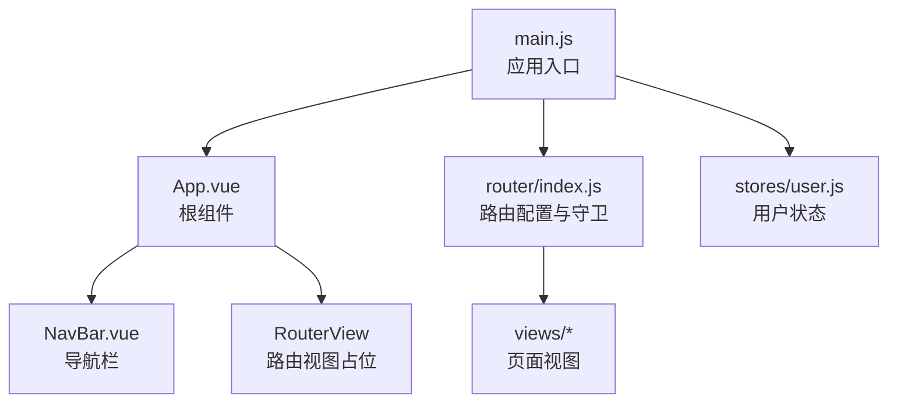
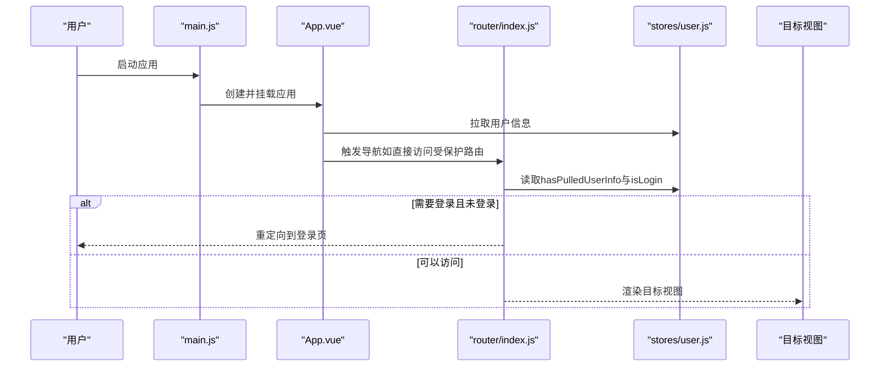
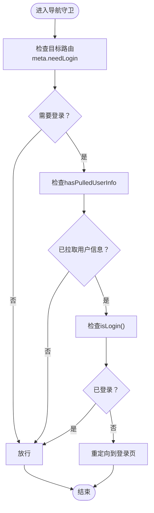
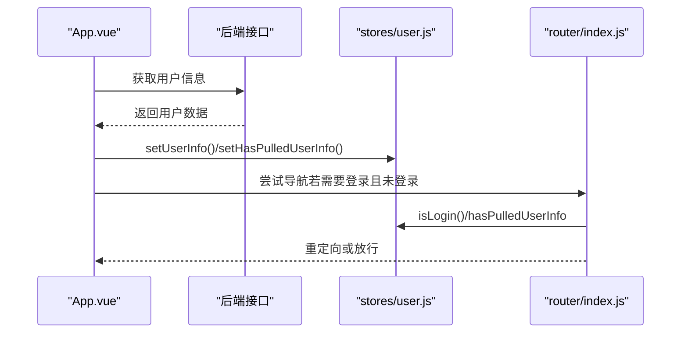
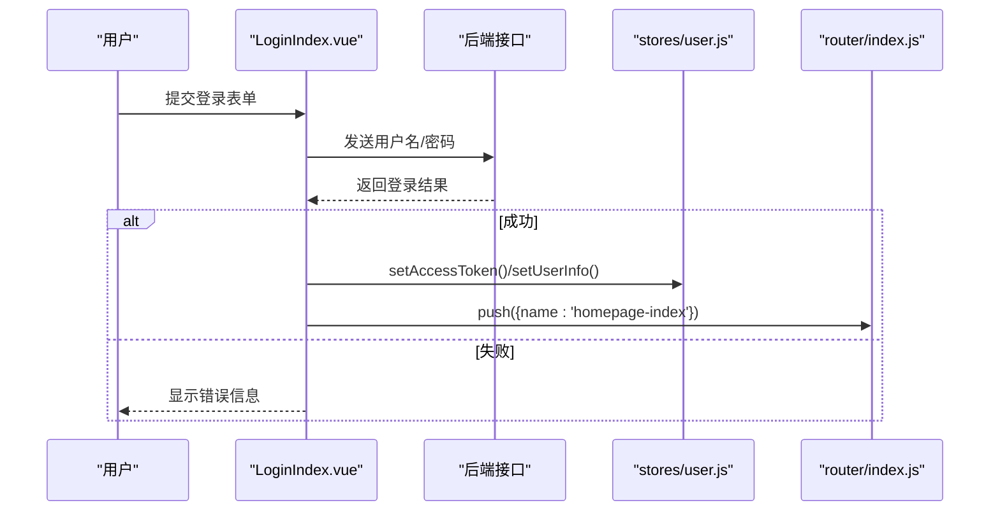
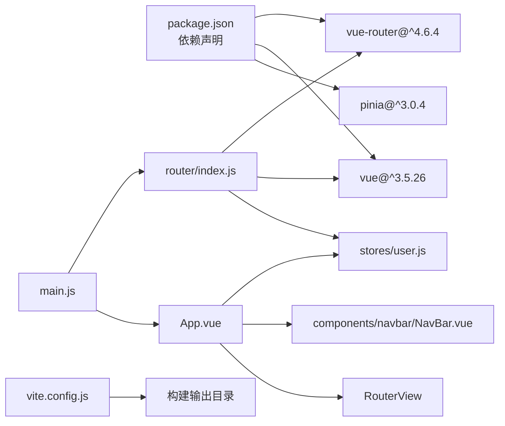

# 路由系统

<cite>
**本文引用的文件**
- [frontend/src/router/index.js](file://frontend/src/router/index.js)
- [frontend/src/main.js](file://frontend/src/main.js)
- [frontend/src/App.vue](file://frontend/src/App.vue)
- [frontend/src/stores/user.js](file://frontend/src/stores/user.js)
- [frontend/src/views/homepage/HomepageIndex.vue](file://frontend/src/views/homepage/HomepageIndex.vue)
- [frontend/src/views/error/NotFoundIndex.vue](file://frontend/src/views/error/NotFoundIndex.vue)
- [frontend/src/views/user/account/LoginIndex.vue](file://frontend/src/views/user/account/LoginIndex.vue)
- [frontend/src/views/user/space/SpaceIndex.vue](file://frontend/src/views/user/space/SpaceIndex.vue)
- [frontend/src/components/navbar/NavBar.vue](file://frontend/src/components/navbar/NavBar.vue)
- [frontend/package.json](file://frontend/package.json)
- [frontend/vite.config.js](file://frontend/vite.config.js)
</cite>

## 目录
1. [简介](#简介)
2. [项目结构](#项目结构)
3. [核心组件](#核心组件)
4. [架构总览](#架构总览)
5. [详细组件分析](#详细组件分析)
6. [依赖关系分析](#依赖关系分析)
7. [性能考虑](#性能考虑)
8. [故障排查指南](#故障排查指南)
9. [结论](#结论)
10. [附录](#附录)

## 简介
本文件面向 LLM_AIfriends 的前端路由系统，基于 Vue Router 4 进行技术文档整理。内容涵盖路由配置结构、路由定义规则、导航守卫机制、路由层级与动态参数处理、嵌套路由现状、路由元信息与权限控制、导航拦截逻辑、懒加载与代码分割现状、路由过渡动画建议，以及实际应用场景演示与最佳实践。

## 项目结构
前端采用 Vite + Vue 3 + Pinia + Vue Router 4 的组合。路由配置集中在 router/index.js 中，应用入口在 main.js 中注册路由；用户状态通过 Pinia store 管理；页面视图位于 views 下按功能模块划分；导航栏组件 NavBar.vue 提供全局导航与菜单。

图表来源
- [frontend/src/main.js:1-15](file://frontend/src/main.js#L1-L15)
- [frontend/src/App.vue:1-41](file://frontend/src/App.vue#L1-L41)
- [frontend/src/router/index.js:1-110](file://frontend/src/router/index.js#L1-L110)
- [frontend/src/stores/user.js:1-53](file://frontend/src/stores/user.js#L1-L53)

章节来源
- [frontend/src/main.js:1-15](file://frontend/src/main.js#L1-L15)
- [frontend/src/router/index.js:1-110](file://frontend/src/router/index.js#L1-L110)
- [frontend/src/App.vue:1-41](file://frontend/src/App.vue#L1-L41)

## 核心组件
- 路由器实例与配置：在 router/index.js 中创建并导出路由器，定义路径、组件映射、命名路由与元信息。
- 导航守卫：在 router/index.js 中使用 beforeEach 全局前置守卫进行权限校验。
- 用户状态管理：在 stores/user.js 中定义用户登录态、访问令牌、是否已拉取用户信息等状态与方法。
- 应用根组件：App.vue 在挂载时尝试拉取用户信息，并在必要时重定向至登录页。
- 页面视图：views 下各模块视图，如首页、好友、创作、个人空间、登录、注册、404 等。
- 导航栏组件：NavBar.vue 提供全局导航链接与侧边菜单，结合 RouterLink 使用命名路由。

章节来源
- [frontend/src/router/index.js:1-110](file://frontend/src/router/index.js#L1-L110)
- [frontend/src/stores/user.js:1-53](file://frontend/src/stores/user.js#L1-L53)
- [frontend/src/App.vue:1-41](file://frontend/src/App.vue#L1-L41)
- [frontend/src/components/navbar/NavBar.vue:1-77](file://frontend/src/components/navbar/NavBar.vue#L1-L77)

## 架构总览
下图展示了从应用启动到路由导航的整体流程，包括用户信息拉取、权限判断与登录跳转的关键节点。

图表来源
- [frontend/src/main.js:1-15](file://frontend/src/main.js#L1-L15)
- [frontend/src/App.vue:12-29](file://frontend/src/App.vue#L12-L29)
- [frontend/src/router/index.js:99-107](file://frontend/src/router/index.js#L99-L107)
- [frontend/src/stores/user.js:12-14](file://frontend/src/stores/user.js#L12-L14)

## 详细组件分析

### 路由配置与定义规则
- 历史模式：使用 HTML5 History 模式，基于浏览器历史栈进行导航。
- 路由表：集中定义在 router/index.js 中，包含多条静态路由与一条通配符兜底路由。
- 命名路由：为每个路由设置唯一 name，便于编程式导航与守卫中使用。
- 元信息：每条路由包含 meta.needLogin 字段，用于控制是否需要登录态。
- 动态路由参数：
  - 个人空间路由包含 user_id 参数，可在视图中通过 route.params.user_id 获取。
  - 更新角色路由包含 character_id 参数，用于编辑场景。
- 通配符兜底：使用全匹配正则捕获所有未匹配路径，统一指向 404 视图。

章节来源
- [frontend/src/router/index.js:13-97](file://frontend/src/router/index.js#L13-L97)
- [frontend/src/views/user/space/SpaceIndex.vue:1-13](file://frontend/src/views/user/space/SpaceIndex.vue#L1-L13)

### 导航守卫机制
- 全局前置守卫：在 router/index.js 中定义 beforeEach(to, from)，根据 to.meta.needLogin 与用户登录态决定是否放行或重定向。
- 守卫触发时机：每次路由切换都会触发，确保受保护路由在未登录时被拦截。
- 重定向策略：当目标路由需要登录且用户未登录时，守卫返回登录页命名路由，完成自动跳转。

图表来源
- [frontend/src/router/index.js:99-107](file://frontend/src/router/index.js#L99-L107)
- [frontend/src/stores/user.js:12-14](file://frontend/src/stores/user.js#L12-L14)

章节来源
- [frontend/src/router/index.js:99-107](file://frontend/src/router/index.js#L99-L107)
- [frontend/src/stores/user.js:12-14](file://frontend/src/stores/user.js#L12-L14)

### 权限控制与拦截逻辑
- 用户信息拉取：App.vue 在挂载阶段调用后端接口获取用户信息，并标记 hasPulledUserInfo。
- 登录态判断：stores/user.js 提供 isLogin 方法，基于 accessToken 是否存在判断登录状态。
- 组合拦截：守卫与 App.vue 的协同确保在用户信息拉取完成后进行权限判断，避免重复请求与误判。

图表来源
- [frontend/src/App.vue:12-29](file://frontend/src/App.vue#L12-L29)
- [frontend/src/stores/user.js:20-37](file://frontend/src/stores/user.js#L20-L37)
- [frontend/src/router/index.js:99-107](file://frontend/src/router/index.js#L99-L107)

章节来源
- [frontend/src/App.vue:12-29](file://frontend/src/App.vue#L12-L29)
- [frontend/src/stores/user.js:20-37](file://frontend/src/stores/user.js#L20-L37)
- [frontend/src/router/index.js:99-107](file://frontend/src/router/index.js#L99-L107)

### 路由层级设计与嵌套路由
- 当前路由表采用扁平化设计，未见显式的嵌套路由配置（如 children）。所有路由均在根级定义。
- 若未来需要引入布局组件或子路由，可在某一级路由下添加 children 并配合 RouterView 实现嵌套视图。

章节来源
- [frontend/src/router/index.js:15-96](file://frontend/src/router/index.js#L15-L96)

### 动态路由参数处理
- 个人空间路由：包含 user_id 参数，视图中可通过 route.params.user_id 获取当前用户 ID。
- 更新角色路由：包含 character_id 参数，用于编辑特定角色。
- 参数使用：在 SpaceIndex.vue 中直接展示 user_id，体现参数传递与渲染。

章节来源
- [frontend/src/router/index.js:72-79](file://frontend/src/router/index.js#L72-L79)
- [frontend/src/views/user/space/SpaceIndex.vue:8](file://frontend/src/views/user/space/SpaceIndex.vue#L8)

### 路由元信息与权限控制
- 元信息字段：每条路由包含 meta.needLogin，true 表示需要登录态，false 表示无需登录。
- 控制点：守卫与 App.vue 的 onMounted 阶段共同作用，确保受保护路由在未登录时被拦截。

章节来源
- [frontend/src/router/index.js:20-22](file://frontend/src/router/index.js#L20-L22)
- [frontend/src/router/index.js:99-107](file://frontend/src/router/index.js#L99-L107)

### 导航拦截逻辑与登录流程
- 登录页视图：LoginIndex.vue 提供表单与提交逻辑，成功后写入访问令牌与用户信息并跳转首页。
- 登录拦截：守卫检测到需要登录且未登录时，自动重定向至登录页。
- 登录后回跳：可扩展在登录成功后记录来源路由并在登录后跳转回去。

图表来源
- [frontend/src/views/user/account/LoginIndex.vue:14-39](file://frontend/src/views/user/account/LoginIndex.vue#L14-L39)
- [frontend/src/stores/user.js:16-25](file://frontend/src/stores/user.js#L16-L25)
- [frontend/src/router/index.js:99-107](file://frontend/src/router/index.js#L99-L107)

章节来源
- [frontend/src/views/user/account/LoginIndex.vue:14-39](file://frontend/src/views/user/account/LoginIndex.vue#L14-L39)
- [frontend/src/stores/user.js:16-25](file://frontend/src/stores/user.js#L16-L25)
- [frontend/src/router/index.js:99-107](file://frontend/src/router/index.js#L99-L107)

### 路由懒加载策略与代码分割现状
- 当前实现：路由组件导入均为同步导入（import ... from ...），未使用动态 import() 进行懒加载。
- 优化建议：将大型视图组件改为动态导入，利用 Vite 的代码分割能力，减少首屏体积与提升加载速度。
- 适配性：Vite 已启用按需打包与输出目录配置，便于后续懒加载产物的组织与部署。

章节来源
- [frontend/src/router/index.js:2-11](file://frontend/src/router/index.js#L2-L11)
- [frontend/vite.config.js:16-19](file://frontend/vite.config.js#L16-L19)

### 路由过渡动画
- 当前实现：未在路由层配置过渡动画（如 RouterView 的 transition）。
- 建议：在 RouterView 上添加 transition 属性，并配合 CSS 或第三方动画库实现页面切换动画，提升用户体验。

## 依赖关系分析
- 路由器依赖：router/index.js 依赖 Vue Router 4 与各页面视图组件。
- 用户状态依赖：守卫与 App.vue 依赖 stores/user.js 的状态与方法。
- 应用入口依赖：main.js 依赖 router/index.js 与 App.vue。
- 构建工具依赖：vite.config.js 配置了插件与输出目录，与 package.json 的依赖版本保持一致。

图表来源
- [frontend/package.json:14-21](file://frontend/package.json#L14-L21)
- [frontend/src/main.js:7](file://frontend/src/main.js#L7)
- [frontend/src/router/index.js:1-110](file://frontend/src/router/index.js#L1-L110)
- [frontend/src/App.vue:1-41](file://frontend/src/App.vue#L1-L41)
- [frontend/src/stores/user.js:1-53](file://frontend/src/stores/user.js#L1-L53)
- [frontend/vite.config.js:10-25](file://frontend/vite.config.js#L10-L25)

章节来源
- [frontend/package.json:14-21](file://frontend/package.json#L14-L21)
- [frontend/src/main.js:7](file://frontend/src/main.js#L7)
- [frontend/src/router/index.js:1-110](file://frontend/src/router/index.js#L1-L110)
- [frontend/src/App.vue:1-41](file://frontend/src/App.vue#L1-L41)
- [frontend/src/stores/user.js:1-53](file://frontend/src/stores/user.js#L1-L53)
- [frontend/vite.config.js:10-25](file://frontend/vite.config.js#L10-L25)

## 性能考虑
- 代码分割：将大型视图组件替换为动态导入，利用 Vite 的分块策略减少首屏 JS 体积。
- 路由预加载：对高频访问的路由可考虑预加载，平衡首屏与后续交互体验。
- 缓存策略：结合浏览器缓存与服务端缓存，减少重复请求。
- 构建优化：保持 Vite 默认优化项开启，关注输出目录与静态资源路径，确保与后端部署一致。

## 故障排查指南
- 登录后仍被重定向到登录页
  - 检查守卫条件与用户状态：确认 hasPulledUserInfo 已标记为 true，isLogin 返回 true。
  - 章节来源
    - [frontend/src/router/index.js:99-107](file://frontend/src/router/index.js#L99-L107)
    - [frontend/src/stores/user.js:12-14](file://frontend/src/stores/user.js#L12-L14)
- 访问受保护路由报 404
  - 检查通配符兜底路由是否生效，确认目标路由名称与 meta.needLogin 设置正确。
  - 章节来源
    - [frontend/src/router/index.js:88-95](file://frontend/src/router/index.js#L88-L95)
- 动态参数无法获取
  - 确认路由定义中的参数名与视图中使用的 route.params 名称一致。
  - 章节来源
    - [frontend/src/router/index.js:72-79](file://frontend/src/router/index.js#L72-L79)
    - [frontend/src/views/user/space/SpaceIndex.vue:8](file://frontend/src/views/user/space/SpaceIndex.vue#L8)
- 登录页跳转失败
  - 检查登录成功后的路由跳转逻辑与命名路由名称是否一致。
  - 章节来源
    - [frontend/src/views/user/account/LoginIndex.vue:30-32](file://frontend/src/views/user/account/LoginIndex.vue#L30-L32)

## 结论
当前路由系统以简洁的扁平化路由表与全局守卫为核心，实现了基础的权限控制与导航拦截。通过 App.vue 的用户信息拉取与守卫的协同，保证了受保护路由的安全访问。未来可在保持现有结构的基础上，引入动态导入实现懒加载与代码分割，增强首屏性能；同时可为 RouterView 添加过渡动画，提升用户体验。对于更复杂的布局需求，可逐步引入嵌套路由与子路由，进一步优化路由层次与复用性。

## 附录
- 路由配置示例（路径与命名）
  - 首页：/ -> homepage-index
  - 好友：/friend/ -> friend-index
  - 创作：/create/ -> create-index
  - 更新角色：/create/character/update/:character_id/ -> update-character
  - 登录：/user/account/login/ -> user-account-login-index
  - 注册：/user/account/register/ -> user-account-register-index
  - 个人空间：/user/space/:user_id/ -> user-space-index
  - 用户资料：/user/profile/ -> user-profile-index
  - 404：/:pathMatch(.*)* -> not-found
- 导航守卫代码位置
  - [frontend/src/router/index.js:99-107](file://frontend/src/router/index.js#L99-L107)
- 用户状态与登录判断
  - [frontend/src/stores/user.js:12-14](file://frontend/src/stores/user.js#L12-L14)
- 应用入口与路由注册
  - [frontend/src/main.js:7](file://frontend/src/main.js#L7)
- 构建与输出配置
  - [frontend/vite.config.js:16-19](file://frontend/vite.config.js#L16-L19)