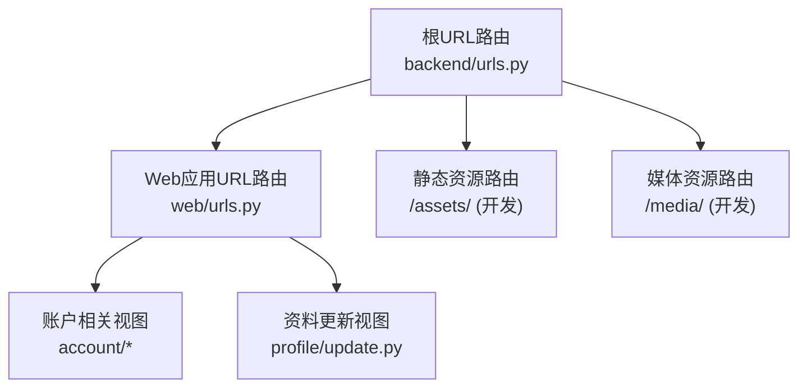
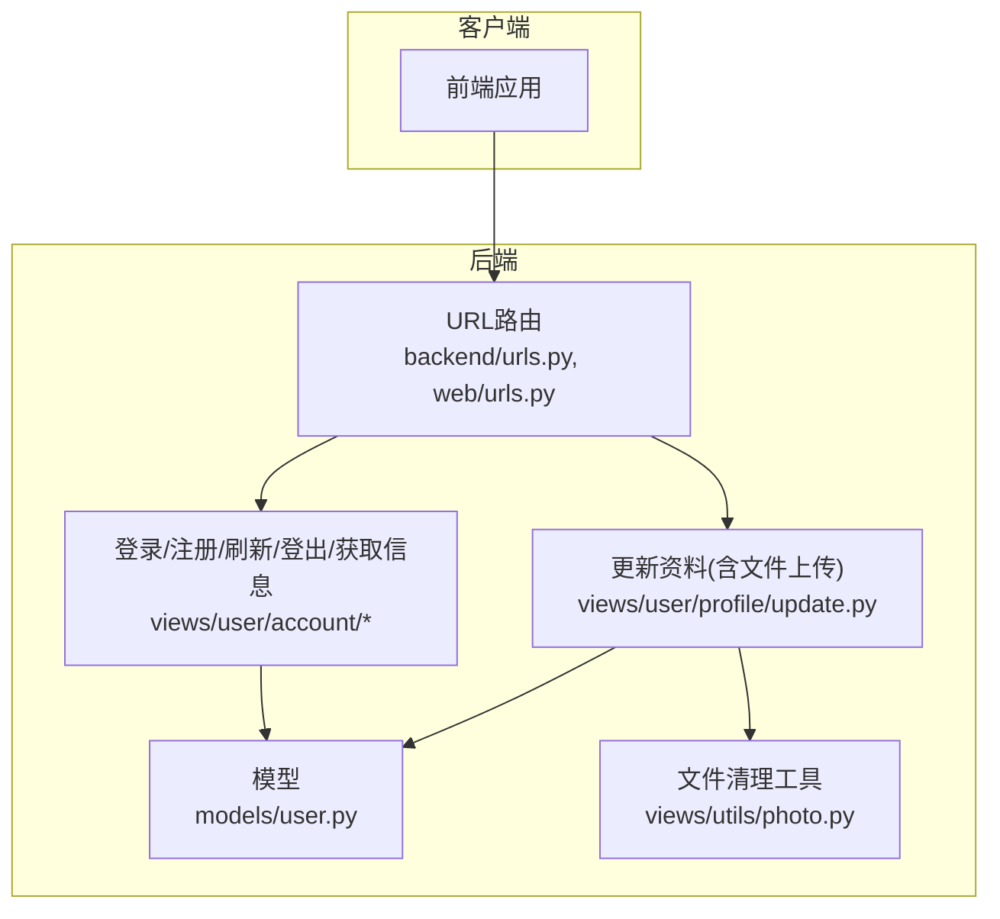
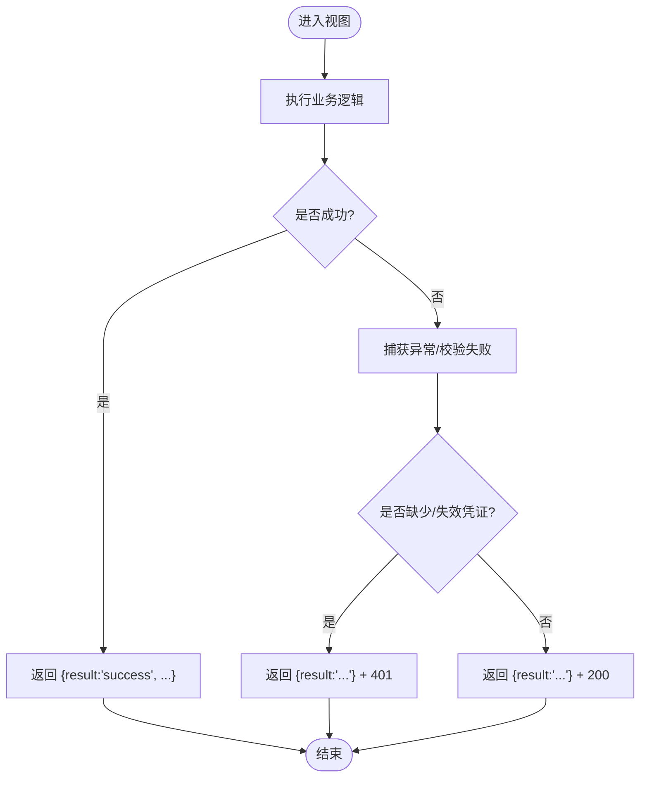
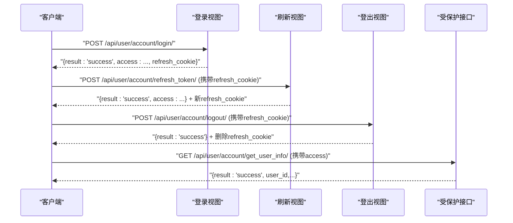
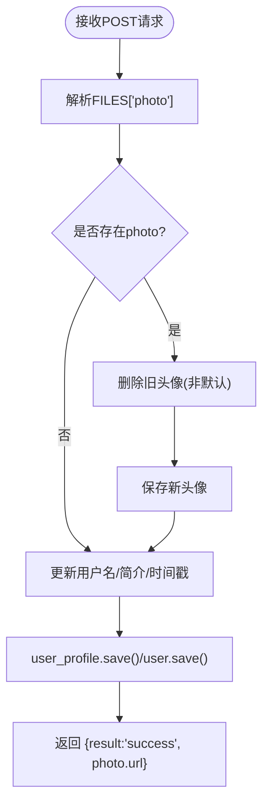
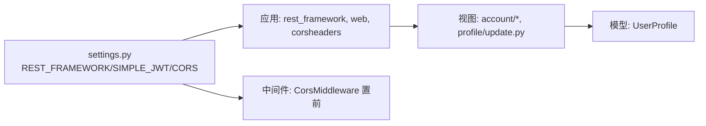
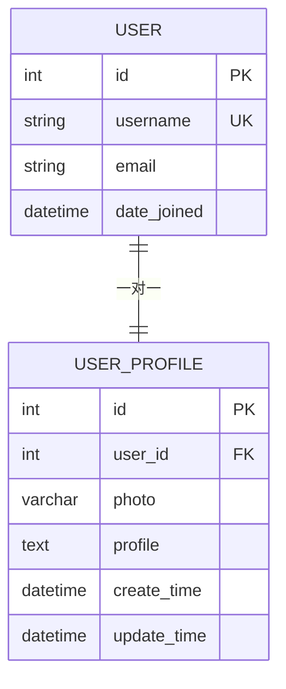

# API实现模式

<cite>
**本文引用的文件**
- [settings.py](file://backend/backend/settings.py)
- [urls.py](file://backend/backend/urls.py)
- [urls.py](file://backend/web/urls.py)
- [login.py](file://backend/web/views/user/account/login.py)
- [register.py](file://backend/web/views/user/account/register.py)
- [refresh_token.py](file://backend/web/views/user/account/refresh_token.py)
- [logout.py](file://backend/web/views/user/account/logout.py)
- [get_user_info.py](file://backend/web/views/user/account/get_user_info.py)
- [update.py](file://backend/web/views/user/profile/update.py)
- [photo.py](file://backend/web/views/utils/photo.py)
- [user.py](file://backend/web/models/user.py)
- [0001_initial.py](file://backend/web/migrations/0001_initial.py)
- [index.py](file://backend/web/views/index.py)
- [manage.py](file://backend/manage.py)
</cite>

## 目录
1. [引言](#引言)
2. [项目结构](#项目结构)
3. [核心组件](#核心组件)
4. [架构总览](#架构总览)
5. [组件详解](#组件详解)
6. [依赖关系分析](#依赖关系分析)
7. [性能考量](#性能考量)
8. [故障排查指南](#故障排查指南)
9. [结论](#结论)
10. [附录](#附录)

## 引言
本文件系统性梳理本项目的API实现模式，围绕Django REST Framework（DRF）的使用进行深入解析，覆盖视图类选择、序列化器替代方案、响应格式标准化、错误处理机制、鉴权流程、文件上传与验证、版本控制策略、文档与测试建议、性能监控与日志记录、以及安全防护要点。文档面向不同技术背景读者，既提供高层概览也给出代码级映射。

## 项目结构
后端采用标准Django应用组织方式，核心业务位于web应用下，通过DRF提供REST接口；根URL将请求转发至web.urls；静态与媒体资源在开发环境通过Django路由暴露。

图表来源
- [urls.py:23-37](file://backend/backend/urls.py#L23-L37)
- [urls.py:10-23](file://backend/web/urls.py#L10-L23)

章节来源
- [urls.py:17-37](file://backend/backend/urls.py#L17-L37)
- [urls.py:1-23](file://backend/web/urls.py#L1-L23)

## 核心组件
- 认证与鉴权
  - 默认认证：SimpleJWT（Bearer Token）
  - 会话保持：后端通过设置HttpOnly Cookie存放refresh token，前端负责携带access token访问受保护资源
- 视图层
  - 基于APIView的类视图，统一返回结构化的result字段
- 模型层
  - 用户扩展资料模型，支持头像上传与简介字段
- 文件上传
  - 头像上传采用ImageField，结合自定义清理逻辑避免磁盘冗余

章节来源
- [settings.py:136-151](file://backend/backend/settings.py#L136-L151)
- [login.py:9-46](file://backend/web/views/user/account/login.py#L9-L46)
- [register.py:9-46](file://backend/web/views/user/account/register.py#L9-L46)
- [refresh_token.py:7-41](file://backend/web/views/user/account/refresh_token.py#L7-L41)
- [logout.py:7-16](file://backend/web/views/user/account/logout.py#L7-L16)
- [get_user_info.py:8-25](file://backend/web/views/user/account/get_user_info.py#L8-L25)
- [update.py:12-63](file://backend/web/views/user/profile/update.py#L12-L63)
- [user.py:15-23](file://backend/web/models/user.py#L15-L23)

## 架构总览
下图展示从客户端到后端视图、模型与文件系统的交互路径，以及鉴权与Cookie流转。

图表来源
- [urls.py:23-26](file://backend/backend/urls.py#L23-L26)
- [urls.py:10-17](file://backend/web/urls.py#L10-L17)
- [login.py:9-46](file://backend/web/views/user/account/login.py#L9-L46)
- [register.py:9-46](file://backend/web/views/user/account/register.py#L9-L46)
- [refresh_token.py:7-41](file://backend/web/views/user/account/refresh_token.py#L7-L41)
- [logout.py:7-16](file://backend/web/views/user/account/logout.py#L7-L16)
- [get_user_info.py:8-25](file://backend/web/views/user/account/get_user_info.py#L8-L25)
- [update.py:12-63](file://backend/web/views/user/profile/update.py#L12-L63)
- [user.py:15-23](file://backend/web/models/user.py#L15-L23)
- [photo.py:9-13](file://backend/web/views/utils/photo.py#L9-L13)

## 组件详解

### 视图类选择与响应格式标准化
- 采用APIView而非Generic View或ViewSet的原因
  - 明确控制请求处理流程与异常分支，便于统一返回结构
  - 登录、注册、刷新、登出等场景均为一次性操作，无需复杂CRUD抽象
- 响应格式约定
  - 统一包含result字段，成功时为“success”，失败时为具体提示
  - 成功场景附加业务字段（如用户标识、头像URL、简介等）
  - 错误场景返回result与HTTP状态码（如401）

章节来源
- [login.py:14-17](file://backend/web/views/user/account/login.py#L14-L17)
- [login.py:23-30](file://backend/web/views/user/account/login.py#L23-L30)
- [register.py:19-22](file://backend/web/views/user/account/register.py#L19-L22)
- [register.py:27-34](file://backend/web/views/user/account/register.py#L27-L34)
- [get_user_info.py:14-20](file://backend/web/views/user/account/get_user_info.py#L14-L20)
- [update.py:49-57](file://backend/web/views/user/profile/update.py#L49-L57)
- [refresh_token.py:14-14](file://backend/web/views/user/account/refresh_token.py#L14-L14)

### 序列化器实现与替代方案
- 当前实现未使用DRF序列化器，而是直接读取request.data并手工校验
- 替代建议
  - 对于登录/注册等简单场景，可引入Serializer进行参数校验与反序列化，提升可维护性与可测试性
  - 对于复杂列表/分页场景，推荐使用ModelSerializer与ListSerializer组合

章节来源
- [login.py:12-13](file://backend/web/views/user/account/login.py#L12-L13)
- [register.py:12-13](file://backend/web/views/user/account/register.py#L12-L13)
- [update.py:20-23](file://backend/web/views/user/profile/update.py#L20-L23)

### API错误处理机制
- 异常捕获策略
  - 视图内部使用try/except包裹关键逻辑，统一返回result字段
  - 对于缺少refresh token的刷新场景，显式返回401状态码
- 错误响应格式
  - result字段承载错误信息
  - 401用于明确表示未授权（如refresh token缺失或过期）
- HTTP状态码使用
  - 400：参数非法或业务校验失败（如用户名/密码为空、用户名已存在）
  - 401：未授权（如refresh token缺失或无效）
  - 200：成功（result为success）

图表来源
- [login.py:43-46](file://backend/web/views/user/account/login.py#L43-L46)
- [register.py:43-46](file://backend/web/views/user/account/register.py#L43-L46)
- [get_user_info.py:21-24](file://backend/web/views/user/account/get_user_info.py#L21-L24)
- [update.py:58-61](file://backend/web/views/user/profile/update.py#L58-L61)
- [refresh_token.py:14-14](file://backend/web/views/user/account/refresh_token.py#L14-L14)
- [refresh_token.py:38-41](file://backend/web/views/user/account/refresh_token.py#L38-L41)

章节来源
- [login.py:43-46](file://backend/web/views/user/account/login.py#L43-L46)
- [register.py:43-46](file://backend/web/views/user/account/register.py#L43-L46)
- [get_user_info.py:21-24](file://backend/web/views/user/account/get_user_info.py#L21-L24)
- [update.py:58-61](file://backend/web/views/user/profile/update.py#L58-L61)
- [refresh_token.py:14-14](file://backend/web/views/user/account/refresh_token.py#L14-L14)
- [refresh_token.py:38-41](file://backend/web/views/user/account/refresh_token.py#L38-L41)

### 鉴权装饰器与流程
- 鉴权装饰器
  - 使用permission_classes = [IsAuthenticated]强制要求已登录
- 流程
  - 登录成功：下发access token（响应体），同时设置HttpOnly refresh cookie
  - 刷新：从前端cookie读取refresh token，生成新的access token，并按需刷新cookie
  - 登出：删除refresh cookie
  - 受保护接口：依赖JWT中间件校验access token有效性

图表来源
- [login.py:23-39](file://backend/web/views/user/account/login.py#L23-L39)
- [refresh_token.py:15-32](file://backend/web/views/user/account/refresh_token.py#L15-L32)
- [logout.py:10-16](file://backend/web/views/user/account/logout.py#L10-L16)
- [get_user_info.py:10-20](file://backend/web/views/user/account/get_user_info.py#L10-L20)

章节来源
- [login.py:9-46](file://backend/web/views/user/account/login.py#L9-L46)
- [refresh_token.py:7-41](file://backend/web/views/user/account/refresh_token.py#L7-L41)
- [logout.py:7-16](file://backend/web/views/user/account/logout.py#L7-L16)
- [get_user_info.py:8-25](file://backend/web/views/user/account/get_user_info.py#L8-L25)

### 文件上传API实现模式
- 上传入口
  - 更新资料接口支持多部分表单上传，读取FILES中的photo字段
- 存储与命名
  - 使用ImageField与自定义upload_to函数生成唯一文件名，避免冲突
- 安全与清理
  - 若存在新头像，先调用remove_old_photo删除旧文件（非默认头像）
  - 仅在save()后持久化变更
- 响应
  - 返回头像URL（通过model字段.url属性）

图表来源
- [update.py:23-48](file://backend/web/views/user/profile/update.py#L23-L48)
- [photo.py:9-13](file://backend/web/views/utils/photo.py#L9-L13)
- [user.py:10-13](file://backend/web/models/user.py#L10-L13)

章节来源
- [update.py:12-63](file://backend/web/views/user/profile/update.py#L12-L63)
- [photo.py:9-13](file://backend/web/views/utils/photo.py#L9-L13)
- [user.py:15-23](file://backend/web/models/user.py#L15-L23)

### API版本控制策略
- 路由层面版本化
  - 建议在URL中加入版本前缀（如/api/v1/user/...），便于未来演进与向后兼容
- 配置层面版本化
  - 可通过DRF的DEFAULT_VERSION与ALLOWED_VERSIONS控制版本范围
- 文档与测试
  - 为每个版本维护独立文档与测试套件，确保变更影响面可控

[本节为通用实践建议，不直接分析具体文件]

### 文档生成与测试方法
- 文档生成
  - 使用drf-spectacular或drf-yasg基于视图注释与模型生成OpenAPI/Swagger文档
- 测试方法
  - 单元测试：针对视图的鉴权、参数校验、异常分支
  - 集成测试：端到端验证登录、刷新、登出、文件上传与读取链路
  - 性能测试：并发压测与慢查询分析

[本节为通用实践建议，不直接分析具体文件]

## 依赖关系分析
- 应用与中间件
  - INSTALLED_APPS启用rest_framework、web与corsheaders
  - CORS中间件置于首位，保证跨域预检优先处理
- 认证与跨域
  - DEFAULT_AUTHENTICATION_CLASSES指定JWT
  - SIMPLE_JWT配置生命周期与头部类型
  - CORS_ALLOW_CREDENTIALS与CORS_ALLOWED_ORIGINS限定可信源

图表来源
- [settings.py:33-43](file://backend/backend/settings.py#L33-L43)
- [settings.py:45-54](file://backend/backend/settings.py#L45-L54)
- [settings.py:136-151](file://backend/backend/settings.py#L136-L151)
- [urls.py:10-17](file://backend/web/urls.py#L10-L17)

章节来源
- [settings.py:33-54](file://backend/backend/settings.py#L33-L54)
- [settings.py:136-158](file://backend/backend/settings.py#L136-L158)

## 性能考量
- 视图层
  - 尽量减少ORM查询次数，批量读取与select_related/defer优化
  - 对频繁访问的字段建立索引（如用户名唯一性）
- 文件上传
  - 控制文件大小与类型白名单，避免过大文件占用带宽与磁盘
  - 使用CDN托管媒体资源，降低服务器压力
- 缓存
  - 对只读接口（如用户公开资料）增加缓存层，缩短热路径延迟
- 并发与限流
  - 对登录/注册等热点接口实施速率限制，防刷与DDoS

[本节为通用实践建议，不直接分析具体文件]

## 故障排查指南
- 常见问题定位
  - 401未授权：检查前端是否正确携带access token；确认refresh cookie是否存在且未过期
  - 文件上传失败：确认multipart/form-data格式；检查MEDIA_ROOT权限与磁盘空间
  - 用户名冲突：注册/更新时校验用户名唯一性
- 日志与监控
  - 启用DRF与Django日志，记录异常堆栈与关键请求上下文
  - 结合APM工具（如Sentry）捕获未处理异常与性能瓶颈
- 安全加固
  - 强制HTTPS传输，Secure=True配合HttpOnly Cookie
  - 严格CORS配置，避免泄露敏感数据
  - 定期轮换密钥与审计JWT黑名单

章节来源
- [refresh_token.py:14-14](file://backend/web/views/user/account/refresh_token.py#L14-L14)
- [refresh_token.py:38-41](file://backend/web/views/user/account/refresh_token.py#L38-L41)
- [update.py:35-38](file://backend/web/views/user/profile/update.py#L35-L38)
- [photo.py:9-13](file://backend/web/views/utils/photo.py#L9-L13)

## 结论
本项目以APIView为核心构建REST接口，结合SimpleJWT实现鉴权与Cookie管理，统一响应结构与错误处理策略，满足用户登录、注册、刷新、登出与资料更新（含文件上传）等核心需求。建议后续引入序列化器、版本化路由、自动化文档与测试体系，并强化性能与安全措施，以支撑更复杂的业务演进。

## 附录
- 数据模型概览

图表来源
- [user.py:15-23](file://backend/web/models/user.py#L15-L23)
- [0001_initial.py:18-29](file://backend/web/migrations/0001_initial.py#L18-L29)

- 启动与部署要点
  - 开发环境通过manage.py启动，静态与媒体资源在DEBUG=True时由Django路由提供
  - 生产环境建议在Nginx中提供静态与媒体资源，Django仅处理动态请求

章节来源
- [manage.py:7-18](file://backend/manage.py#L7-L18)
- [urls.py:29-37](file://backend/backend/urls.py#L29-L37)
- [index.py:3-4](file://backend/web/views/index.py#L3-L4)