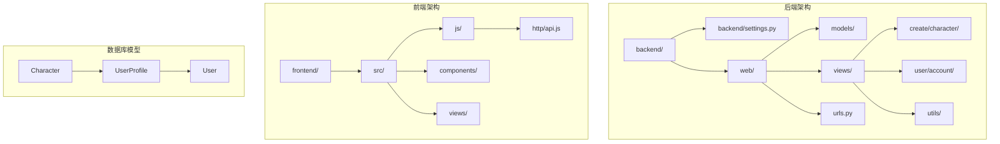
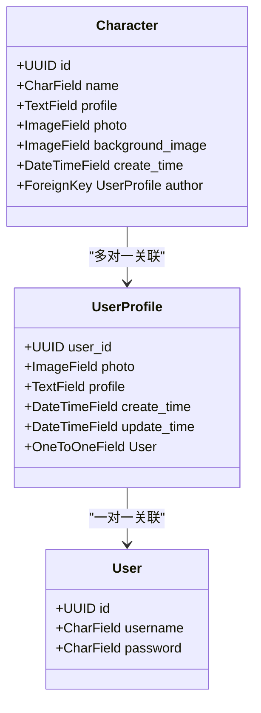
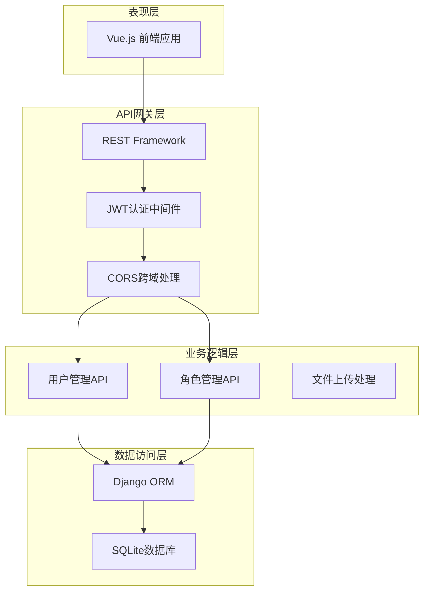
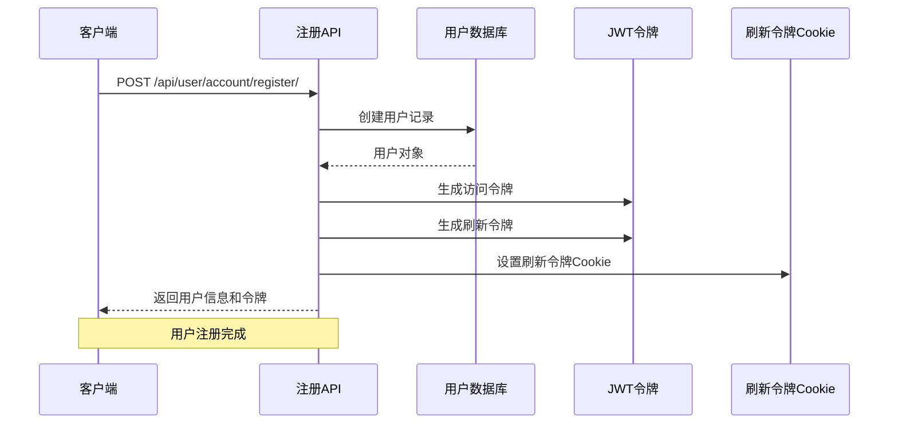
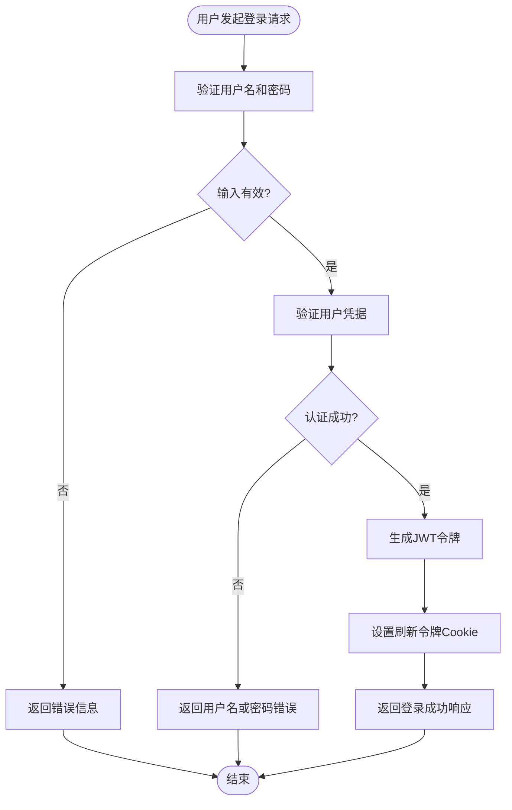
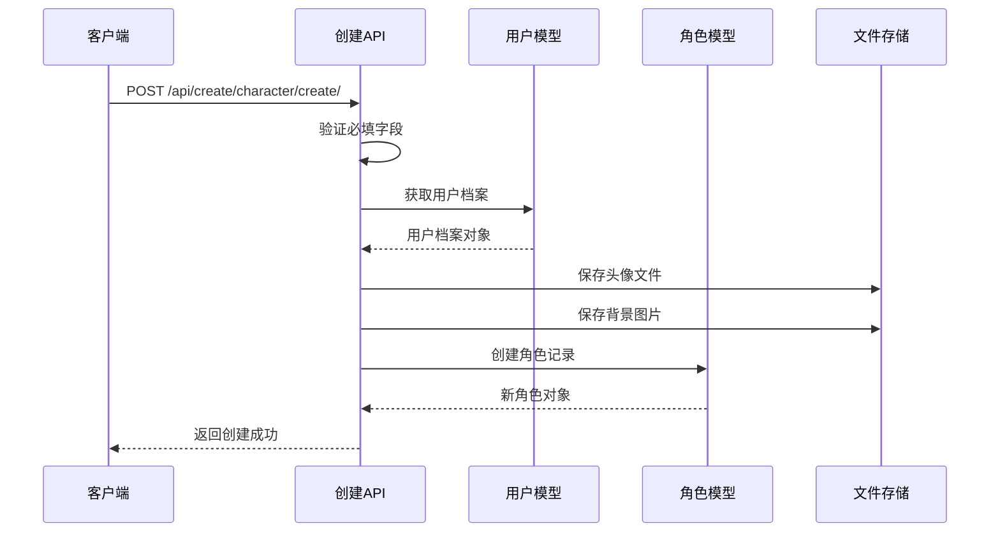
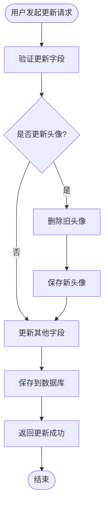
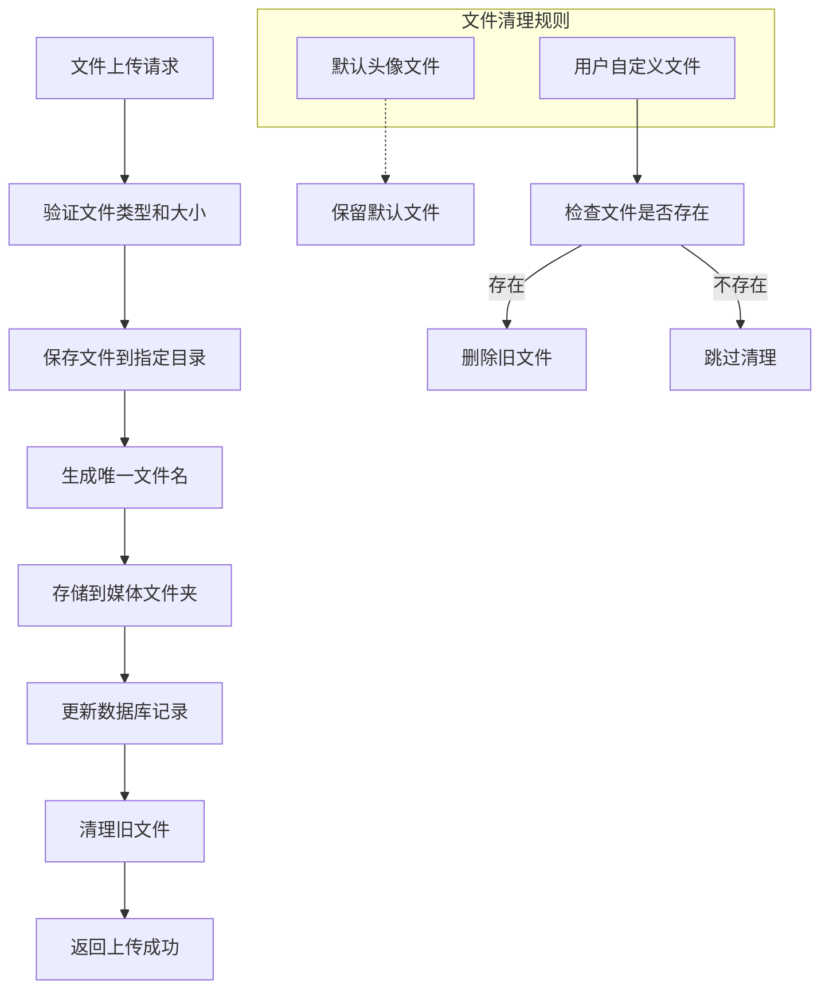
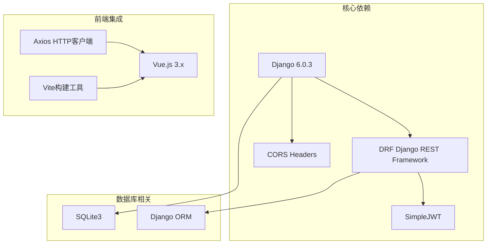

# 虚拟角色API实现

<cite>
**本文档引用的文件**
- [settings.py](file://backend/backend/settings.py)
- [urls.py](file://backend/backend/urls.py)
- [character.py](file://backend/web/models/character.py)
- [user.py](file://backend/web/models/user.py)
- [create.py](file://backend/web/views/create/character/create.py)
- [get_single.py](file://backend/web/views/create/character/get_single.py)
- [update.py](file://backend/web/views/create/character/update.py)
- [remove.py](file://backend/web/views/create/character/remove.py)
- [register.py](file://backend/web/views/user/account/register.py)
- [login.py](file://backend/web/views/user/account/login.py)
- [photo.py](file://backend/web/views/utils/photo.py)
- [urls.py](file://backend/web/urls.py)
- [index.py](file://backend/web/views/index.py)
- [api.js](file://frontend/src/js/http/api.js)
</cite>

## 目录
1. [项目概述](#项目概述)
2. [项目结构](#项目结构)
3. [核心组件](#核心组件)
4. [架构概览](#架构概览)
5. [详细组件分析](#详细组件分析)
6. [依赖关系分析](#依赖关系分析)
7. [性能考虑](#性能考虑)
8. [故障排除指南](#故障排除指南)
9. [结论](#结论)

## 项目概述

这是一个基于Django和Vue.js构建的虚拟角色管理系统，主要功能包括用户注册登录、个人资料管理以及虚拟角色的创建、更新、删除和查询。项目采用前后端分离架构，后端使用Django REST Framework提供API服务，前端使用Vue.js构建用户界面。

## 项目结构

项目采用典型的Django项目结构，分为后端和前端两个主要部分：

**图表来源**
- [settings.py:1-158](file://backend/backend/settings.py#L1-158)
- [urls.py:1-32](file://backend/web/urls.py#L1-32)

**章节来源**
- [settings.py:1-158](file://backend/backend/settings.py#L1-158)
- [urls.py:1-38](file://backend/backend/urls.py#L1-38)

## 核心组件

### 数据模型层

系统包含两个核心数据模型：用户档案模型和角色模型。

**图表来源**
- [character.py:18-27](file://backend/web/models/character.py#L18-27)
- [user.py:15-23](file://backend/web/models/user.py#L15-23)

### 视图层API

系统提供完整的CRUD操作API，包括用户管理和角色管理两大模块。

**章节来源**
- [character.py:1-27](file://backend/web/models/character.py#L1-27)
- [user.py:1-23](file://backend/web/models/user.py#L1-23)

## 架构概览

系统采用分层架构设计，实现了清晰的关注点分离：

**图表来源**
- [settings.py:45-54](file://backend/backend/settings.py#L45-54)
- [urls.py:15-31](file://backend/web/urls.py#L15-31)

## 详细组件分析

### 用户认证系统

用户认证系统实现了完整的注册、登录、登出和令牌刷新机制。

**图表来源**
- [register.py:9-46](file://backend/web/views/user/account/register.py#L9-46)
- [login.py:9-46](file://backend/web/views/user/account/login.py#L9-46)

#### 登录流程

**图表来源**
- [login.py:10-46](file://backend/web/views/user/account/login.py#L10-46)

**章节来源**
- [register.py:1-46](file://backend/web/views/user/account/register.py#L1-46)
- [login.py:1-92](file://backend/web/views/user/account/login.py#L1-92)

### 虚拟角色管理系统

角色管理系统提供了完整的生命周期管理功能。

#### 角色创建流程

**图表来源**
- [create.py:10-51](file://backend/web/views/create/character/create.py#L10-51)

#### 角色更新流程

**图表来源**
- [update.py:13-46](file://backend/web/views/create/character/update.py#L13-46)

**章节来源**
- [create.py:1-51](file://backend/web/views/create/character/create.py#L1-51)
- [get_single.py:1-30](file://backend/web/views/create/character/get_single.py#L1-30)
- [update.py:1-46](file://backend/web/views/create/character/update.py#L1-46)
- [remove.py:1-18](file://backend/web/views/create/character/remove.py#L1-18)

### 文件上传和存储

系统实现了智能的文件上传和清理机制。

**图表来源**
- [photo.py:9-13](file://backend/web/views/utils/photo.py#L9-13)
- [character.py:8-16](file://backend/web/models/character.py#L8-16)

**章节来源**
- [photo.py:1-13](file://backend/web/views/utils/photo.py#L1-13)

## 依赖关系分析

系统依赖关系清晰，遵循Django的最佳实践：

**图表来源**
- [settings.py:40-43](file://backend/backend/settings.py#L40-43)
- [settings.py:136-151](file://backend/backend/settings.py#L136-151)

**章节来源**
- [settings.py:1-158](file://backend/backend/settings.py#L1-158)

## 性能考虑

### 认证令牌管理

系统采用JWT令牌机制，具有以下性能特点：

- **访问令牌**：短期有效（2小时），减少频繁认证开销
- **刷新令牌**：长期有效（7天），支持令牌续期
- **自动刷新**：前端实现透明令牌刷新，提升用户体验

### 文件存储优化

- **智能清理**：自动删除不再使用的旧文件，节省存储空间
- **默认文件策略**：避免删除系统默认资源
- **路径规范化**：统一文件命名和存储结构

### CORS配置

系统配置了专门的CORS中间件，确保跨域请求的安全性和性能。

## 故障排除指南

### 常见问题及解决方案

#### 1. 认证相关问题

**问题**：登录后无法访问受保护的API
**原因**：访问令牌过期或未正确设置
**解决方案**：
- 检查前端是否正确设置Authorization头
- 验证JWT配置是否正确
- 确认令牌刷新机制正常工作

#### 2. 文件上传问题

**问题**：头像或背景图片上传失败
**原因**：文件格式不支持或存储权限问题
**解决方案**：
- 检查文件类型和大小限制
- 验证MEDIA_ROOT目录权限
- 确认文件路径生成逻辑

#### 3. 跨域请求问题

**问题**：前端无法访问后端API
**原因**：CORS配置不正确
**解决方案**：
- 检查CORS_ALLOWED_ORIGINS配置
- 验证CORS中间件加载顺序
- 确认withCredentials设置

**章节来源**
- [api.js:1-92](file://frontend/src/js/http/api.js#L1-92)

## 结论

该虚拟角色API实现项目展现了现代Web应用开发的最佳实践：

### 技术亮点

1. **完整的认证体系**：基于JWT的现代化认证机制
2. **清晰的架构设计**：分层架构确保代码可维护性
3. **完善的文件管理**：智能文件上传和清理机制
4. **前后端分离**：现代化的开发模式

### 改进建议

1. **错误处理优化**：细化异常处理和错误信息
2. **性能监控**：添加API性能监控和日志记录
3. **安全加固**：实施更严格的数据验证和输入过滤
4. **测试覆盖**：增加单元测试和集成测试

该项目为虚拟角色管理提供了一个功能完整、架构清晰的解决方案，适合进一步扩展和生产部署。