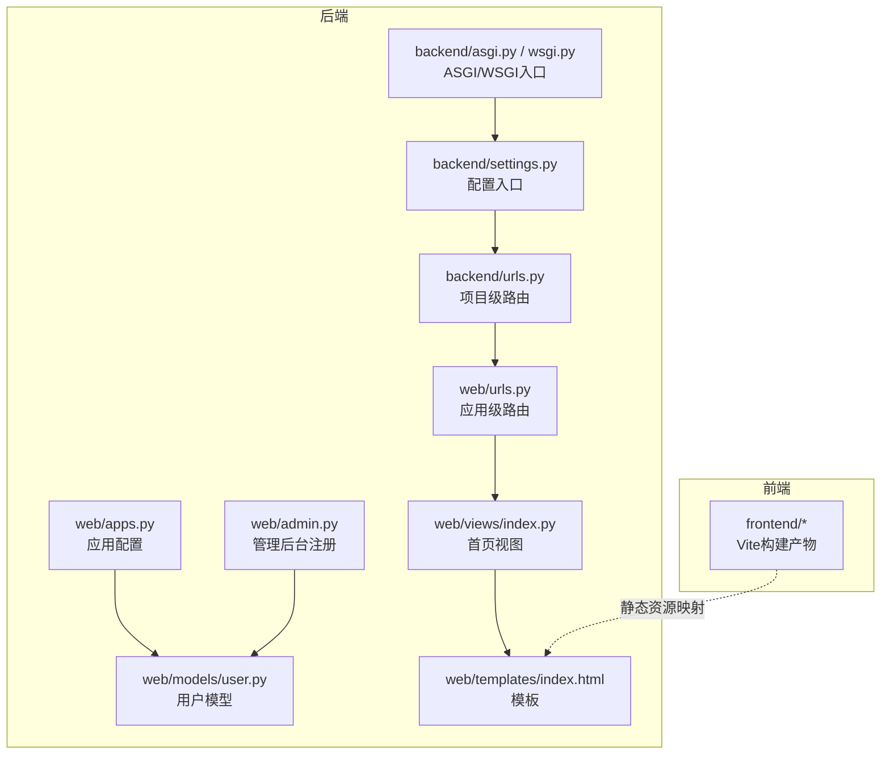
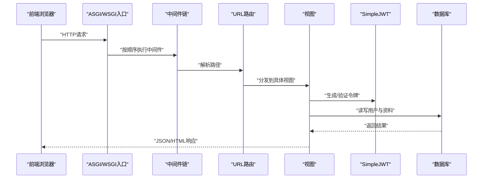
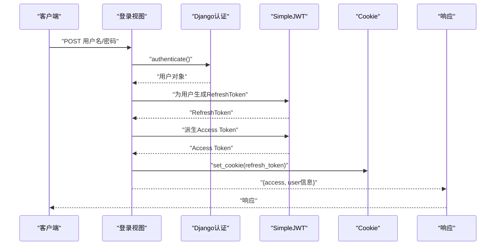
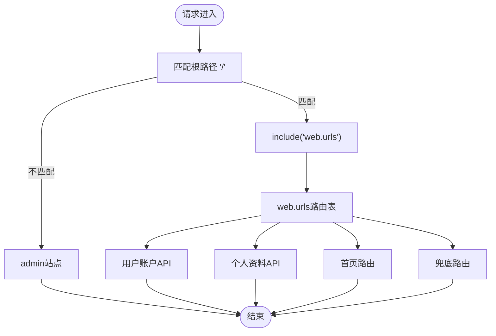
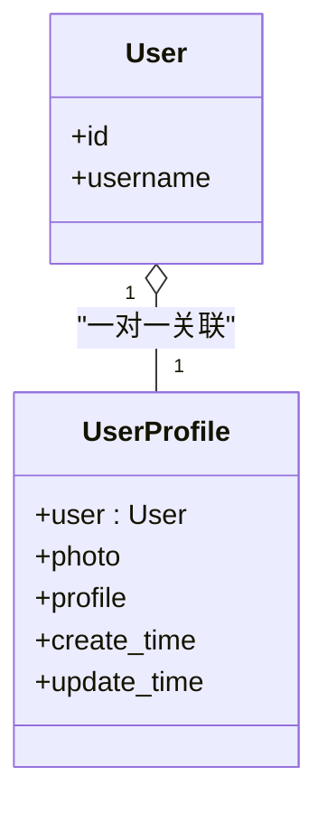
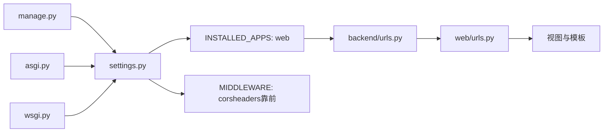

# Django项目配置

<cite>
**本文引用的文件**
- [settings.py](file://backend/backend/settings.py)
- [urls.py（项目级）](file://backend/backend/urls.py)
- [urls.py（应用级）](file://backend/web/urls.py)
- [apps.py](file://backend/web/apps.py)
- [admin.py](file://backend/web/admin.py)
- [models/user.py](file://backend/web/models/user.py)
- [views/user/account/login.py](file://backend/web/views/user/account/login.py)
- [views/user/account/register.py](file://backend/web/views/user/account/register.py)
- [views/index.py](file://backend/web/views/index.py)
- [templates/index.html](file://backend/web/templates/index.html)
- [manage.py](file://backend/manage.py)
- [asgi.py](file://backend/backend/asgi.py)
- [wsgi.py](file://backend/backend/wsgi.py)
</cite>

## 目录
1. [简介](#简介)
2. [项目结构](#项目结构)
3. [核心组件](#核心组件)
4. [架构总览](#架构总览)
5. [详细组件分析](#详细组件分析)
6. [依赖分析](#依赖分析)
7. [性能考虑](#性能考虑)
8. [故障排查指南](#故障排查指南)
9. [结论](#结论)
10. [附录：开发与生产配置差异](#附录开发与生产配置差异)

## 简介
本文件面向Django项目的配置与部署，围绕settings.py中的JWT认证、CORS跨域、静态文件与数据库配置，结合URL路由、应用注册与管理后台，系统梳理中间件的作用与配置顺序，并给出开发与生产环境的差异对比、最佳实践与常见问题解决方案。内容以仓库现有实现为依据，避免臆测。

## 项目结构
后端采用标准Django分层组织：根目录backend下包含项目配置模块backend与业务应用web；前端位于独立目录frontend，通过静态资源与路由兜底策略与后端协同。

图表来源
- [settings.py:13-158](file://backend/backend/settings.py#L13-L158)
- [urls.py（项目级）:17-38](file://backend/backend/urls.py#L17-L38)
- [urls.py（应用级）:1-24](file://backend/web/urls.py#L1-L24)
- [apps.py:1-6](file://backend/web/apps.py#L1-L6)
- [admin.py:1-9](file://backend/web/admin.py#L1-L9)
- [models/user.py:1-23](file://backend/web/models/user.py#L1-L23)
- [views/index.py:1-4](file://backend/web/views/index.py#L1-L4)
- [templates/index.html:1-17](file://backend/web/templates/index.html#L1-L17)
- [asgi.py:1-17](file://backend/backend/asgi.py#L1-L17)
- [wsgi.py:1-17](file://backend/backend/wsgi.py#L1-L17)

章节来源
- [settings.py:13-158](file://backend/backend/settings.py#L13-L158)
- [urls.py（项目级）:17-38](file://backend/backend/urls.py#L17-L38)
- [urls.py（应用级）:1-24](file://backend/web/urls.py#L1-L24)
- [apps.py:1-6](file://backend/web/apps.py#L1-L6)
- [admin.py:1-9](file://backend/web/admin.py#L1-L9)
- [models/user.py:1-23](file://backend/web/models/user.py#L1-L23)
- [views/index.py:1-4](file://backend/web/views/index.py#L1-L4)
- [templates/index.html:1-17](file://backend/web/templates/index.html#L1-L17)
- [asgi.py:1-17](file://backend/backend/asgi.py#L1-L17)
- [wsgi.py:1-17](file://backend/backend/wsgi.py#L1-L17)

## 核心组件
- 应用注册与中间件
  - INSTALLED_APPS包含Django内置应用、REST框架、自定义web应用与CORS插件。
  - MIDDLEWARE顺序严格控制：CORS需尽量靠前，随后是安全、会话、通用、CSRF、认证、消息与点击劫持保护。
- 认证与令牌
  - DEFAULT_AUTHENTICATION_CLASSES启用REST Framework SimpleJWT的JWTAuthentication。
  - SIMPLE_JWT配置了访问令牌与刷新令牌生命周期、轮换与黑名单、请求头类型等。
- 跨域与静态资源
  - CORS_ALLOW_CREDENTIALS与CORS_ALLOWED_ORIGINS开启凭据与指定源白名单。
  - STATICFILES_DIRS用于开发阶段，MEDIA_URL/MEDIA_ROOT指向媒体文件目录。
- 数据库与国际化
  - 默认SQLite数据库；时区设为亚洲/上海；国际化开关与UTC统一时间处理。
- 模板与入口
  - TEMPLATES启用Django模板引擎；ASGI/WSGI入口加载settings模块。

章节来源
- [settings.py:33-43](file://backend/backend/settings.py#L33-L43)
- [settings.py:45-54](file://backend/backend/settings.py#L45-L54)
- [settings.py:136-151](file://backend/backend/settings.py#L136-L151)
- [settings.py:153-158](file://backend/backend/settings.py#L153-L158)
- [settings.py:79-84](file://backend/backend/settings.py#L79-L84)
- [settings.py:109-116](file://backend/backend/settings.py#L109-L116)
- [settings.py:58-71](file://backend/backend/settings.py#L58-L71)
- [asgi.py:10-16](file://backend/backend/asgi.py#L10-L16)
- [wsgi.py:10-16](file://backend/backend/wsgi.py#L10-L16)

## 架构总览
Django请求从ASGI/WSGI进入，按中间件链处理，匹配URL路由，调用视图，返回响应。前端通过静态资源与模板渲染接入，应用级路由聚合到项目级路由，再由管理后台注册模型。

图表来源
- [asgi.py:10-16](file://backend/backend/asgi.py#L10-L16)
- [settings.py:45-54](file://backend/backend/settings.py#L45-L54)
- [urls.py（项目级）:23-26](file://backend/backend/urls.py#L23-L26)
- [urls.py（应用级）:10-23](file://backend/web/urls.py#L10-L23)
- [views/user/account/login.py:9-46](file://backend/web/views/user/account/login.py#L9-L46)
- [views/user/account/register.py:9-46](file://backend/web/views/user/account/register.py#L9-L46)
- [models/user.py:15-23](file://backend/web/models/user.py#L15-L23)

## 详细组件分析

### JWT认证与令牌配置
- 认证类
  - 启用REST Framework SimpleJWT的JWTAuthentication作为默认认证类，确保API接口基于JWT进行鉴权。
- 令牌生命周期与策略
  - 访问令牌有效期、刷新令牌有效期、刷新令牌轮换与黑名单、请求头类型（Bearer）等均在SIMPLE_JWT中集中配置。
- 登录流程要点
  - 视图对用户名/密码进行校验，成功后生成RefreshToken并派生Access Token，同时通过Cookie下发刷新令牌，便于后续刷新与持久化登录体验。
- 注册流程要点
  - 创建用户与用户资料，随后发放JWT与刷新令牌，并通过Cookie下发刷新令牌。

图表来源
- [settings.py:136-151](file://backend/backend/settings.py#L136-L151)
- [views/user/account/login.py:9-46](file://backend/web/views/user/account/login.py#L9-L46)

章节来源
- [settings.py:136-151](file://backend/backend/settings.py#L136-L151)
- [views/user/account/login.py:9-46](file://backend/web/views/user/account/login.py#L9-L46)
- [views/user/account/register.py:9-46](file://backend/web/views/user/account/register.py#L9-L46)

### CORS跨域配置
- 凭据允许
  - CORS_ALLOW_CREDENTIALS启用，允许携带Cookie与Authorization头。
- 源白名单
  - CORS_ALLOWED_ORIGINS限定允许访问的前端源，当前为本地开发端口。
- 中间件顺序
  - CORS中间件必须尽量靠前，以确保跨域预检与后续中间件正确处理。

章节来源
- [settings.py:153-158](file://backend/backend/settings.py#L153-L158)
- [settings.py:45-54](file://backend/backend/settings.py#L45-L54)

### 静态文件与媒体文件配置
- 开发阶段
  - STATICFILES_DIRS指向项目根目录下的static目录，便于收集静态资源。
  - 媒体文件通过项目级URL路由在DEBUG模式下直接映射至MEDIA_ROOT。
- 生产阶段
  - 建议通过Web服务器（如Nginx）提供静态与媒体文件服务，settings中可调整为STATIC_ROOT与绝对URL。

章节来源
- [settings.py:122-132](file://backend/backend/settings.py#L122-L132)
- [urls.py（项目级）:28-37](file://backend/backend/urls.py#L28-L37)

### 数据库连接设置
- 默认SQLite
  - DATABASES.default使用sqlite3引擎，数据库文件位于项目根目录的db.sqlite3。
- 生产建议
  - 切换至PostgreSQL/MySQL等生产数据库，设置主机、端口、库名、账号与密码，并启用连接池与超时参数。

章节来源
- [settings.py:79-84](file://backend/backend/settings.py#L79-L84)

### URL路由配置、应用注册与管理后台
- 应用注册
  - INSTALLED_APPS包含web应用，确保其URL与模板可用。
- 项目级路由
  - ROOT_URLCONF指向backend.urls，根路径映射到web.urls；DEBUG模式下额外挂载静态与媒体文件的开发服务。
- 应用级路由
  - web.urls定义用户账户与个人资料相关API路由，并提供首页与兜底路由，保证前端单页应用可正常接管。
- 管理后台
  - admin.py注册UserProfile模型，raw_id_fields优化列表页加载性能。

图表来源
- [urls.py（项目级）:23-26](file://backend/backend/urls.py#L23-L26)
- [urls.py（应用级）:10-23](file://backend/web/urls.py#L10-L23)

章节来源
- [settings.py:33-43](file://backend/backend/settings.py#L33-L43)
- [urls.py（项目级）:23-37](file://backend/backend/urls.py#L23-L37)
- [urls.py（应用级）:10-23](file://backend/web/urls.py#L10-L23)
- [admin.py:6-9](file://backend/web/admin.py#L6-L9)

### 中间件的作用与配置方法
- CORS中间件
  - 位置靠前，负责处理跨域请求头与预检。
- 安全中间件
  - 提供安全头、HTTPS重定向提示与敏感信息保护。
- 会话与通用中间件
  - 维护会话状态与通用请求处理。
- CSRF中间件
  - 防范跨站请求伪造。
- 认证中间件
  - 将已认证用户注入request.user。
- 消息与点击劫持中间件
  - 提供消息框架支持与X-Frame-Options防护。

章节来源
- [settings.py:45-54](file://backend/backend/settings.py#L45-L54)

### 模型与视图示例
- 用户资料模型
  - OneToOne关联Django内置User，提供头像上传与个人简介字段，上传路径按辅助函数生成唯一文件名。
- 登录/注册视图
  - 基于APIView实现，使用authenticate与RefreshToken.for_user生成JWT，返回用户信息并设置Cookie刷新令牌。

图表来源
- [models/user.py:15-23](file://backend/web/models/user.py#L15-L23)

章节来源
- [models/user.py:15-23](file://backend/web/models/user.py#L15-L23)
- [views/user/account/login.py:9-46](file://backend/web/views/user/account/login.py#L9-L46)
- [views/user/account/register.py:9-46](file://backend/web/views/user/account/register.py#L9-L46)

## 依赖分析
- 入口与配置
  - manage.py、asgi.py、wsgi.py均通过环境变量设置DJANGO_SETTINGS_MODULE为backend.settings，确保Django启动时加载正确配置。
- 应用与中间件耦合
  - web应用依赖REST Framework与SimpleJWT进行认证，依赖CORS中间件处理跨域；CORS中间件需置于链路前端。
- 路由依赖
  - 项目级路由include应用级路由，应用级路由进一步分发到具体视图；模板index.html依赖静态资源路径。

图表来源
- [manage.py:7-18](file://backend/manage.py#L7-L18)
- [asgi.py:10-16](file://backend/backend/asgi.py#L10-L16)
- [wsgi.py:10-16](file://backend/backend/wsgi.py#L10-L16)
- [settings.py:33-43](file://backend/backend/settings.py#L33-L43)
- [settings.py:45-54](file://backend/backend/settings.py#L45-L54)
- [urls.py（项目级）:23-26](file://backend/backend/urls.py#L23-L26)
- [urls.py（应用级）:10-23](file://backend/web/urls.py#L10-L23)

章节来源
- [manage.py:7-18](file://backend/manage.py#L7-L18)
- [asgi.py:10-16](file://backend/backend/asgi.py#L10-L16)
- [wsgi.py:10-16](file://backend/backend/wsgi.py#L10-L16)
- [settings.py:33-43](file://backend/backend/settings.py#L33-L43)
- [settings.py:45-54](file://backend/backend/settings.py#L45-L54)
- [urls.py（项目级）:23-26](file://backend/backend/urls.py#L23-L26)
- [urls.py（应用级）:10-23](file://backend/web/urls.py#L10-L23)

## 性能考虑
- 管理后台列表页优化
  - 对UserProfile使用raw_id_fields减少外键查询开销，提升列表页加载速度。
- 静态与媒体文件
  - 开发阶段使用Django内置静态映射；生产阶段建议由Web服务器直接提供静态与媒体文件，降低Django负载。
- 令牌轮换与黑名单
  - 启用刷新令牌轮换与黑名单有助于安全与资源回收，但需注意数据库写入与缓存策略。

章节来源
- [admin.py:6-9](file://backend/web/admin.py#L6-L9)
- [settings.py:122-132](file://backend/backend/settings.py#L122-L132)
- [settings.py:147-148](file://backend/backend/settings.py#L147-L148)

## 故障排查指南
- 登录失败或无法获取Access Token
  - 确认用户名/密码非空且正确；检查视图中是否成功生成RefreshToken并提取access_token；确认前端请求头类型与SIMPLE_JWT配置一致。
- 跨域问题
  - 确认CORS中间件位置靠前；核对CORS_ALLOWED_ORIGINS是否包含前端地址；若需要携带Cookie，确保CORS_ALLOW_CREDENTIALS为True。
- 静态资源404
  - 开发环境仅在DEBUG=True时通过Django映射静态与媒体文件；生产环境请在Web服务器中配置静态与媒体文件路径。
- 管理后台列表卡顿
  - 对相关模型启用raw_id_fields，减少外键查询压力。
- 令牌过期或刷新失败
  - 检查SIMPLE_JWT的访问与刷新令牌生命周期；确认刷新令牌Cookie是否正确下发与携带。

章节来源
- [views/user/account/login.py:9-46](file://backend/web/views/user/account/login.py#L9-L46)
- [settings.py:153-158](file://backend/backend/settings.py#L153-L158)
- [urls.py（项目级）:28-37](file://backend/backend/urls.py#L28-L37)
- [admin.py:6-9](file://backend/web/admin.py#L6-L9)
- [settings.py:143-151](file://backend/backend/settings.py#L143-L151)

## 结论
本项目以Django为核心，结合REST Framework与SimpleJWT实现API认证，通过CORS中间件与配置保障前后端跨域协作，利用SQLite快速起步并提供清晰的路由与管理后台。遵循中间件顺序、合理配置静态与媒体文件、以及生产环境的Web服务器托管策略，可获得稳定高效的开发与运行体验。

## 附录：开发与生产配置差异
- 环境变量与调试
  - 开发：DEBUG=True，ALLOWED_HOSTS可为空，便于本地联调。
  - 生产：DEBUG=False，设置ALLOWED_HOSTS与安全密钥，禁用开发专用静态映射。
- 静态与媒体
  - 开发：通过Django在DEBUG=True时提供静态与媒体文件。
  - 生产：由Web服务器（如Nginx）提供静态与媒体文件，settings中配置绝对URL与STATIC_ROOT。
- 数据库
  - 开发：SQLite轻量易用。
  - 生产：切换至高性能数据库（如PostgreSQL/MySQL），并配置连接池与高可用。
- 中间件与安全
  - 生产：确保CORS白名单精准、安全中间件生效、CSRF与HTTPS策略完整。

章节来源
- [settings.py:22-28](file://backend/backend/settings.py#L22-L28)
- [settings.py:122-132](file://backend/backend/settings.py#L122-L132)
- [urls.py（项目级）:28-37](file://backend/backend/urls.py#L28-L37)
- [settings.py:79-84](file://backend/backend/settings.py#L79-L84)
- [settings.py:45-54](file://backend/backend/settings.py#L45-L54)