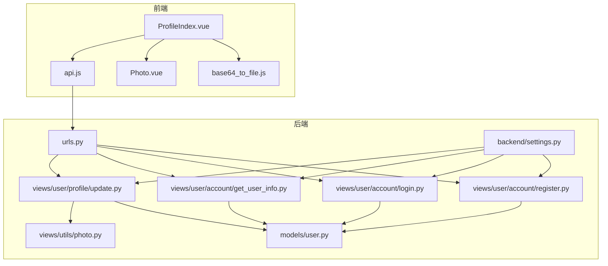
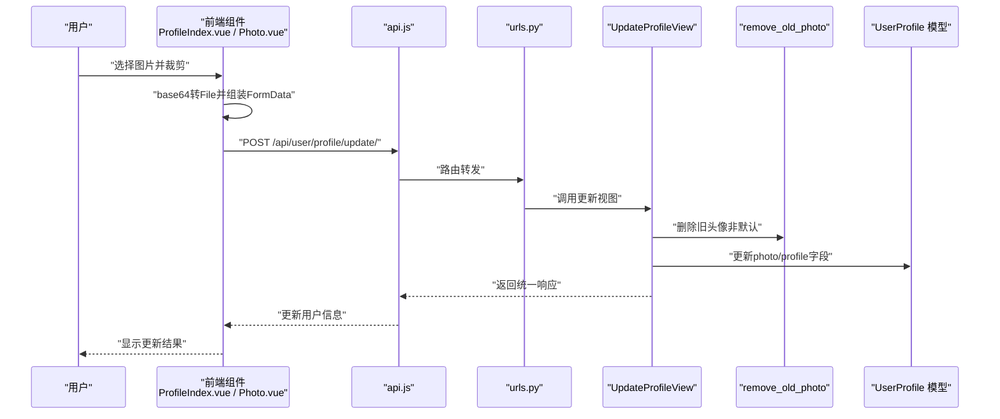
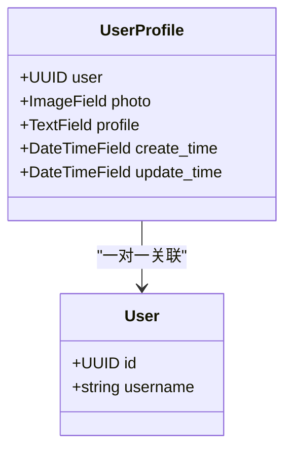
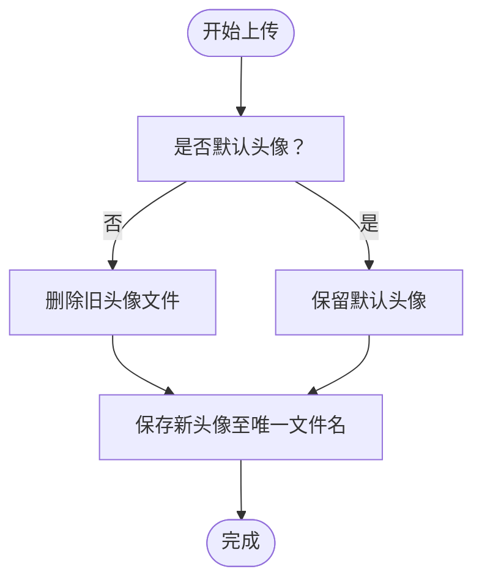
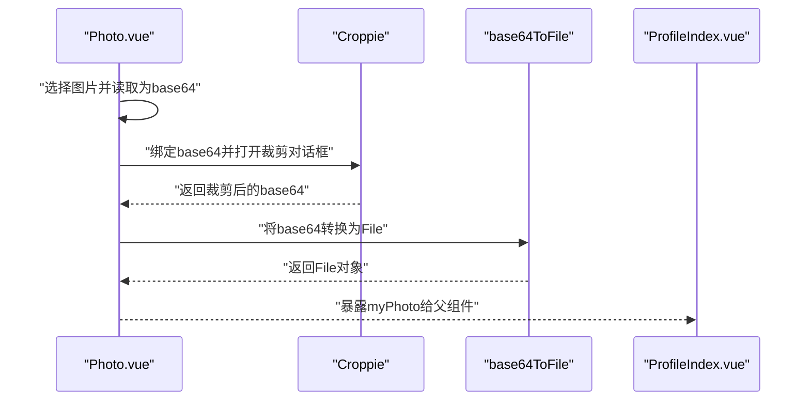
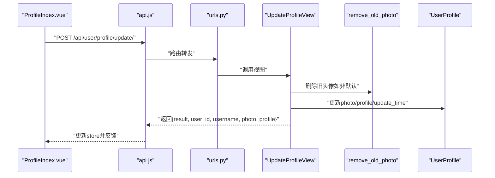
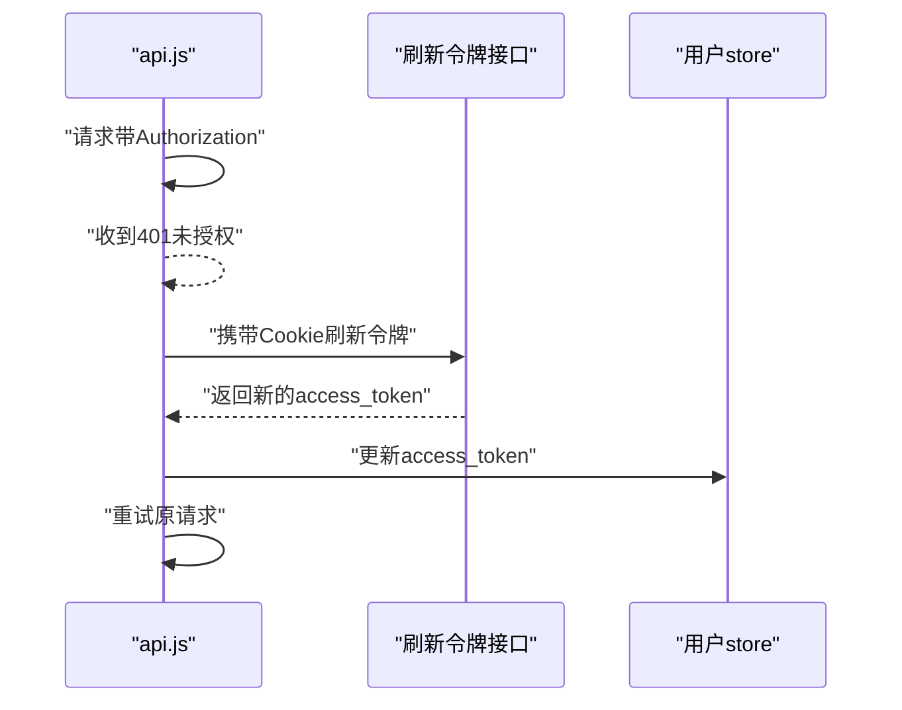
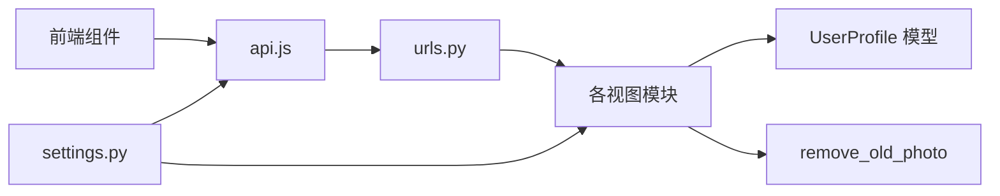

# 个人资料管理系统

<cite>
**本文引用的文件**
- [backend/web/models/user.py](file://backend/web/models/user.py)
- [backend/web/migrations/0001_initial.py](file://backend/web/migrations/0001_initial.py)
- [backend/web/views/user/account/get_user_info.py](file://backend/web/views/user/account/get_user_info.py)
- [backend/web/views/user/account/register.py](file://backend/web/views/user/account/register.py)
- [backend/web/views/user/account/login.py](file://backend/web/views/user/account/login.py)
- [backend/web/views/user/profile/update.py](file://backend/web/views/user/profile/update.py)
- [backend/web/views/utils/photo.py](file://backend/web/views/utils/photo.py)
- [backend/web/urls.py](file://backend/web/urls.py)
- [backend/backend/settings.py](file://backend/backend/settings.py)
- [frontend/src/views/user/profile/ProfileIndex.vue](file://frontend/src/views/user/profile/ProfileIndex.vue)
- [frontend/src/views/user/profile/components/Photo.vue](file://frontend/src/views/user/profile/components/Photo.vue)
- [frontend/src/js/http/api.js](file://frontend/src/js/http/api.js)
- [frontend/src/js/utils/base64_to_file.js](file://frontend/src/js/utils/base64_to_file.js)
</cite>

## 目录
1. [引言](#引言)
2. [项目结构](#项目结构)
3. [核心组件](#核心组件)
4. [架构总览](#架构总览)
5. [详细组件分析](#详细组件分析)
6. [依赖分析](#依赖分析)
7. [性能考虑](#性能考虑)
8. [故障排查指南](#故障排查指南)
9. [结论](#结论)
10. [附录](#附录)

## 引言
本文件面向“个人资料管理系统”，围绕用户资料模型设计、资料更新API实现、图片上传与裁剪处理、存储与缓存策略、错误处理与安全验证、以及用户体验优化进行系统化说明。文档以仓库现有代码为依据，结合前后端交互流程，帮助开发者快速理解与扩展系统。

## 项目结构
系统采用前后端分离架构：
- 后端基于 Django + Django REST Framework，提供用户认证、资料查询与更新等接口。
- 前端基于 Vue 3 + Vite，负责用户界面与交互，包含头像裁剪、表单提交等功能。
- 数据模型通过 Django ORM 定义，图片存储于本地 MEDIA_ROOT 目录，支持默认头像与动态命名。

图表来源
- [backend/web/urls.py:1-24](file://backend/web/urls.py#L1-L24)
- [backend/web/models/user.py:1-23](file://backend/web/models/user.py#L1-L23)
- [backend/web/views/user/profile/update.py](file://backend/web/views/user/profile/update.py)
- [backend/web/views/user/account/get_user_info.py:1-25](file://backend/web/views/user/account/get_user_info.py#L1-L25)
- [backend/web/views/user/account/login.py:1-92](file://backend/web/views/user/account/login.py#L1-L92)
- [backend/web/views/user/account/register.py:1-46](file://backend/web/views/user/account/register.py#L1-L46)
- [backend/web/views/utils/photo.py:1-13](file://backend/web/views/utils/photo.py#L1-L13)
- [backend/backend/settings.py:1-158](file://backend/backend/settings.py#L1-L158)
- [frontend/src/views/user/profile/ProfileIndex.vue:1-77](file://frontend/src/views/user/profile/ProfileIndex.vue#L1-L77)
- [frontend/src/views/user/profile/components/Photo.vue:1-109](file://frontend/src/views/user/profile/components/Photo.vue#L1-L109)
- [frontend/src/js/http/api.js:1-92](file://frontend/src/js/http/api.js#L1-L92)
- [frontend/src/js/utils/base64_to_file.js:1-10](file://frontend/src/js/utils/base64_to_file.js#L1-L10)

章节来源
- [backend/web/urls.py:1-24](file://backend/web/urls.py#L1-L24)
- [backend/backend/settings.py:1-158](file://backend/backend/settings.py#L1-L158)

## 核心组件
- 用户资料模型：包含一对一关联用户、头像字段、简介字段、创建与更新时间戳。
- 图片上传与命名：自定义 upload_to 回调，生成唯一文件名并按用户ID分类存储。
- 资料更新视图：接收表单数据，执行字段校验与更新，返回统一响应格式。
- 头像裁剪与缩放：前端使用 croppie 实现方形裁剪，输出 base64，再转换为 File 上传。
- 认证与鉴权：JWT 认证，配合刷新令牌与 Cookie 存储刷新令牌。
- 存储与静态资源：MEDIA_ROOT 作为图片存储根目录，MEDIA_URL 提供访问路径。

章节来源
- [backend/web/models/user.py:1-23](file://backend/web/models/user.py#L1-L23)
- [backend/web/migrations/0001_initial.py:1-30](file://backend/web/migrations/0001_initial.py#L1-L30)
- [backend/web/views/utils/photo.py:1-13](file://backend/web/views/utils/photo.py#L1-L13)
- [backend/web/views/user/profile/update.py](file://backend/web/views/user/profile/update.py)
- [frontend/src/views/user/profile/components/Photo.vue:1-109](file://frontend/src/views/user/profile/components/Photo.vue#L1-L109)
- [frontend/src/js/utils/base64_to_file.js:1-10](file://frontend/src/js/utils/base64_to_file.js#L1-L10)
- [backend/backend/settings.py:130-131](file://backend/backend/settings.py#L130-L131)

## 架构总览
下图展示从用户操作到后端处理与存储的整体流程：

图表来源
- [frontend/src/views/user/profile/ProfileIndex.vue:17-52](file://frontend/src/views/user/profile/ProfileIndex.vue#L17-L52)
- [frontend/src/views/user/profile/components/Photo.vue:42-76](file://frontend/src/views/user/profile/components/Photo.vue#L42-L76)
- [frontend/src/js/utils/base64_to_file.js:1-10](file://frontend/src/js/utils/base64_to_file.js#L1-L10)
- [frontend/src/js/http/api.js:1-92](file://frontend/src/js/http/api.js#L1-L92)
- [backend/web/urls.py:17-17](file://backend/web/urls.py#L17-L17)
- [backend/web/views/user/profile/update.py](file://backend/web/views/user/profile/update.py)
- [backend/web/views/utils/photo.py:9-13](file://backend/web/views/utils/photo.py#L9-L13)
- [backend/web/models/user.py:15-23](file://backend/web/models/user.py#L15-L23)

## 详细组件分析

### 用户资料模型与迁移
- 字段设计
  - 头像字段：ImageField，默认值指向默认头像，upload_to 使用自定义回调，确保按用户ID分类存储并生成唯一文件名。
  - 简介字段：TextField，最大长度限制，提供默认文案。
  - 时间戳字段：create_time 与 update_time，均使用当前时间默认值。
- 迁移脚本
  - 初始迁移创建 UserProfile 表，包含上述字段与一对一外键关联。

图表来源
- [backend/web/models/user.py:15-23](file://backend/web/models/user.py#L15-L23)
- [backend/web/migrations/0001_initial.py:18-27](file://backend/web/migrations/0001_initial.py#L18-L27)

章节来源
- [backend/web/models/user.py:15-23](file://backend/web/models/user.py#L15-L23)
- [backend/web/migrations/0001_initial.py:18-27](file://backend/web/migrations/0001_initial.py#L18-L27)

### 图片上传与命名策略
- 命名策略
  - 通过 upload_to 回调生成唯一文件名（前缀取 UUID 的一部分），避免同名覆盖。
  - 文件路径按用户ID分目录，便于管理与清理。
- 删除旧头像
  - 更新头像时，若非默认头像则删除旧文件，节省存储空间。
- 存储路径
  - MEDIA_ROOT 为存储根目录，MEDIA_URL 为访问前缀，配合 Django 的静态资源服务。

图表来源
- [backend/web/views/utils/photo.py:9-13](file://backend/web/views/utils/photo.py#L9-L13)
- [backend/web/models/user.py:10-13](file://backend/web/models/user.py#L10-L13)
- [backend/backend/settings.py:130-131](file://backend/backend/settings.py#L130-L131)

章节来源
- [backend/web/views/utils/photo.py:9-13](file://backend/web/views/utils/photo.py#L9-L13)
- [backend/web/models/user.py:10-13](file://backend/web/models/user.py#L10-L13)
- [backend/backend/settings.py:130-131](file://backend/backend/settings.py#L130-L131)

### 头像裁剪与缩放实现
- 前端裁剪
  - 使用 croppie 组件，设置方形视口与边界，支持旋转与强制边界。
  - 读取文件为 base64，绑定到 croppie，裁剪后以 base64 返回。
- base64 转 File
  - 将 base64 转换为 File 对象，附带 MIME 类型与文件名，用于表单上传。
- 上传策略
  - 仅当头像发生变化时才上传，减少不必要的网络传输。

图表来源
- [frontend/src/views/user/profile/components/Photo.vue:23-76](file://frontend/src/views/user/profile/components/Photo.vue#L23-L76)
- [frontend/src/js/utils/base64_to_file.js:1-10](file://frontend/src/js/utils/base64_to_file.js#L1-L10)
- [frontend/src/views/user/profile/ProfileIndex.vue:19-41](file://frontend/src/views/user/profile/ProfileIndex.vue#L19-L41)

章节来源
- [frontend/src/views/user/profile/components/Photo.vue:23-76](file://frontend/src/views/user/profile/components/Photo.vue#L23-L76)
- [frontend/src/js/utils/base64_to_file.js:1-10](file://frontend/src/js/utils/base64_to_file.js#L1-L10)
- [frontend/src/views/user/profile/ProfileIndex.vue:19-41](file://frontend/src/views/user/profile/ProfileIndex.vue#L19-L41)

### 资料更新API实现
- 请求入口
  - 路由映射到 UpdateProfileView，使用 JWT 认证。
- 数据验证与更新
  - 前端对必填项进行基础校验；后端接收 FormData，解析并更新头像与简介。
  - 若上传新头像，先删除旧头像（非默认），再保存新头像。
  - 更新时间戳字段，保证记录最新修改时间。
- 响应格式
  - 成功时返回统一结构，包含状态码、用户信息与头像URL；失败返回错误提示。

图表来源
- [backend/web/urls.py:17-17](file://backend/web/urls.py#L17-L17)
- [backend/web/views/user/profile/update.py](file://backend/web/views/user/profile/update.py)
- [backend/web/views/utils/photo.py:9-13](file://backend/web/views/utils/photo.py#L9-L13)
- [backend/web/models/user.py:15-23](file://backend/web/models/user.py#L15-L23)
- [frontend/src/views/user/profile/ProfileIndex.vue:40-51](file://frontend/src/views/user/profile/ProfileIndex.vue#L40-L51)

章节来源
- [backend/web/urls.py:17-17](file://backend/web/urls.py#L17-L17)
- [backend/web/views/user/profile/update.py](file://backend/web/views/user/profile/update.py)
- [backend/web/views/utils/photo.py:9-13](file://backend/web/views/utils/photo.py#L9-L13)
- [backend/web/models/user.py:15-23](file://backend/web/models/user.py#L15-L23)
- [frontend/src/views/user/profile/ProfileIndex.vue:40-51](file://frontend/src/views/user/profile/ProfileIndex.vue#L40-L51)

### 认证与安全验证
- JWT 认证
  - 默认认证类为 JWT，访问令牌有效期短，刷新令牌有效期长。
  - 前端拦截器自动注入 Authorization 头，处理 401 未授权并刷新令牌。
- 刷新令牌
  - 通过独立接口刷新访问令牌，刷新成功后重试原请求。
- Cookie 安全
  - 刷新令牌以 HttpOnly、SameSite/Lax、Secure 标记存储，降低 XSS 风险。
- 跨域配置
  - 允许指定前端源，启用凭据传递。

图表来源
- [frontend/src/js/http/api.js:46-89](file://frontend/src/js/http/api.js#L46-L89)
- [backend/backend/settings.py:136-151](file://backend/backend/settings.py#L136-L151)

章节来源
- [frontend/src/js/http/api.js:1-92](file://frontend/src/js/http/api.js#L1-L92)
- [backend/backend/settings.py:136-151](file://backend/backend/settings.py#L136-L151)

### 资料查询与注册/登录
- 查询资料
  - 已登录用户可查询自身资料，返回头像URL与简介。
- 注册/登录
  - 注册时创建用户与默认资料，返回访问令牌与初始资料。
  - 登录时返回访问令牌与用户资料，同时写入刷新令牌 Cookie。

章节来源
- [backend/web/views/user/account/get_user_info.py:1-25](file://backend/web/views/user/account/get_user_info.py#L1-L25)
- [backend/web/views/user/account/register.py:1-46](file://backend/web/views/user/account/register.py#L1-L46)
- [backend/web/views/user/account/login.py:1-92](file://backend/web/views/user/account/login.py#L1-L92)

## 依赖分析
- 组件耦合
  - 视图层依赖模型层与工具层；前端组件通过 HTTP 客户端与后端交互。
- 外部依赖
  - Django ORM、Django REST Framework、Croppie、Axios、JWT。
- 路由与中间件
  - 路由集中管理；CORS 中间件需靠前加载，确保跨域与鉴权正常工作。

图表来源
- [backend/web/urls.py:1-24](file://backend/web/urls.py#L1-L24)
- [backend/web/views/user/profile/update.py](file://backend/web/views/user/profile/update.py)
- [backend/web/views/utils/photo.py:1-13](file://backend/web/views/utils/photo.py#L1-L13)
- [backend/web/models/user.py:1-23](file://backend/web/models/user.py#L1-L23)
- [backend/backend/settings.py:1-158](file://backend/backend/settings.py#L1-L158)
- [frontend/src/js/http/api.js:1-92](file://frontend/src/js/http/api.js#L1-L92)

章节来源
- [backend/web/urls.py:1-24](file://backend/web/urls.py#L1-L24)
- [backend/backend/settings.py:45-54](file://backend/backend/settings.py#L45-L54)

## 性能考虑
- 图片处理
  - 建议在上传前限制图片尺寸与体积，减少服务器压力与带宽占用。
  - 可引入异步任务队列（如 Celery）进行缩略图生成与压缩。
- 存储与缓存
  - 使用 CDN 加速头像访问；对常用头像设置短期缓存头。
  - 定期清理默认头像以外的冗余文件，控制磁盘占用。
- 前端优化
  - 裁剪前预览缩略图，避免大图传输；仅在确认后上传。
  - 使用懒加载与骨架屏提升列表渲染体验。
- 数据库
  - 为 UserProfile 的 user 字段建立索引，加速查询。
  - 合理设置 update_time 的索引，支持按更新时间排序。

## 故障排查指南
- 常见问题与定位
  - 401 未授权：检查前端是否正确注入 Authorization 头，刷新令牌是否有效。
  - 上传失败：确认文件类型与大小限制，检查 MEDIA_ROOT 权限与磁盘空间。
  - 头像未更新：确认前端仅在头像变更时上传；后端是否正确删除旧头像。
  - 路由不生效：核对 urls.py 中的路由前缀与正则兜底规则。
- 错误处理建议
  - 后端对异常进行捕获并返回统一错误信息，避免泄露内部细节。
  - 前端对网络错误与业务错误分别处理，提供明确提示。

章节来源
- [frontend/src/js/http/api.js:46-89](file://frontend/src/js/http/api.js#L46-L89)
- [backend/web/views/user/profile/update.py](file://backend/web/views/user/profile/update.py)
- [backend/web/urls.py:17-23](file://backend/web/urls.py#L17-L23)

## 结论
本系统以简洁清晰的方式实现了用户资料管理的核心能力：模型设计合理、上传与裁剪流程顺畅、认证与安全机制完备。后续可在图片处理、CDN 缓存、异步任务与前端体验方面进一步优化，以满足更高并发与更佳用户体验的需求。

## 附录
- 关键路径参考
  - 用户资料模型与迁移：[models/user.py:15-23](file://backend/web/models/user.py#L15-L23)，[migrations/0001_initial.py:18-27](file://backend/web/migrations/0001_initial.py#L18-L27)
  - 资料更新视图与工具：[views/user/profile/update.py](file://backend/web/views/user/profile/update.py)，[views/utils/photo.py:9-13](file://backend/web/views/utils/photo.py#L9-L13)
  - 前端裁剪与上传：[views/user/profile/components/Photo.vue:23-76](file://frontend/src/views/user/profile/components/Photo.vue#L23-L76)，[views/user/profile/ProfileIndex.vue:19-51](file://frontend/src/views/user/profile/ProfileIndex.vue#L19-L51)，[js/utils/base64_to_file.js:1-10](file://frontend/src/js/utils/base64_to_file.js#L1-L10)
  - 认证与路由：[backend/settings.py:136-151](file://backend/backend/settings.py#L136-L151)，[web/urls.py:17-17](file://backend/web/urls.py#L17-L17)