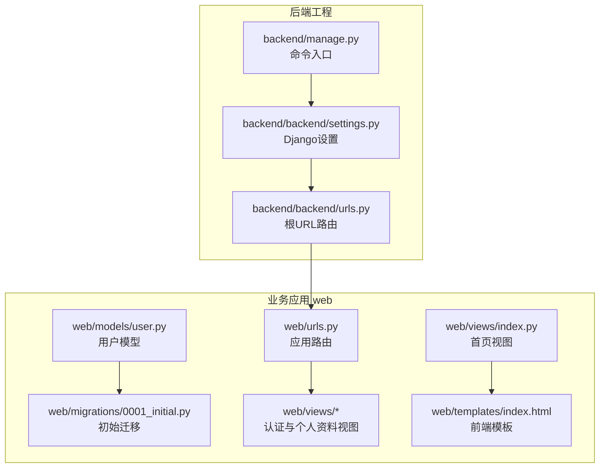
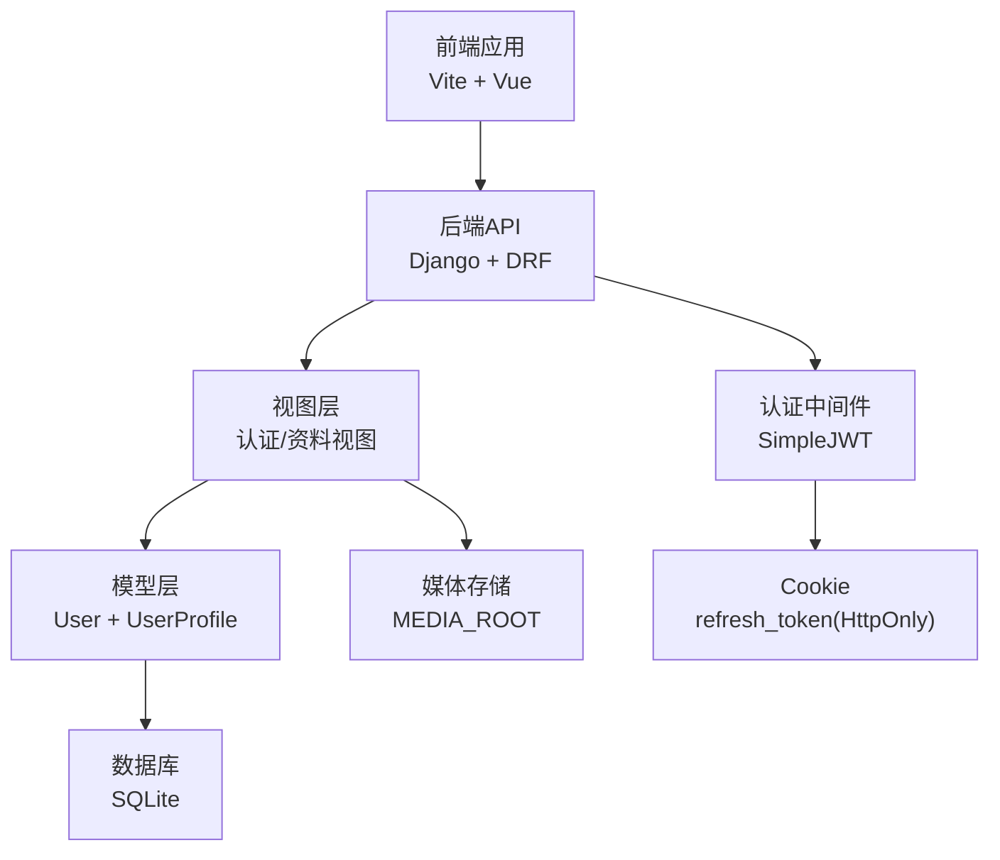
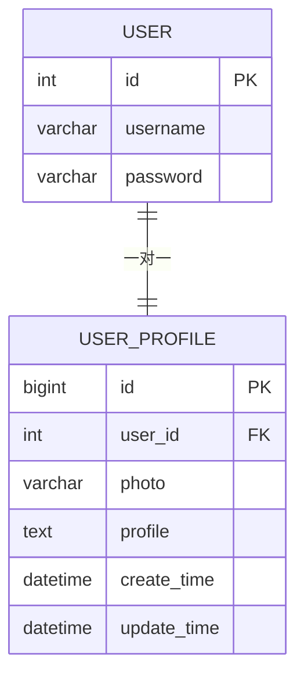
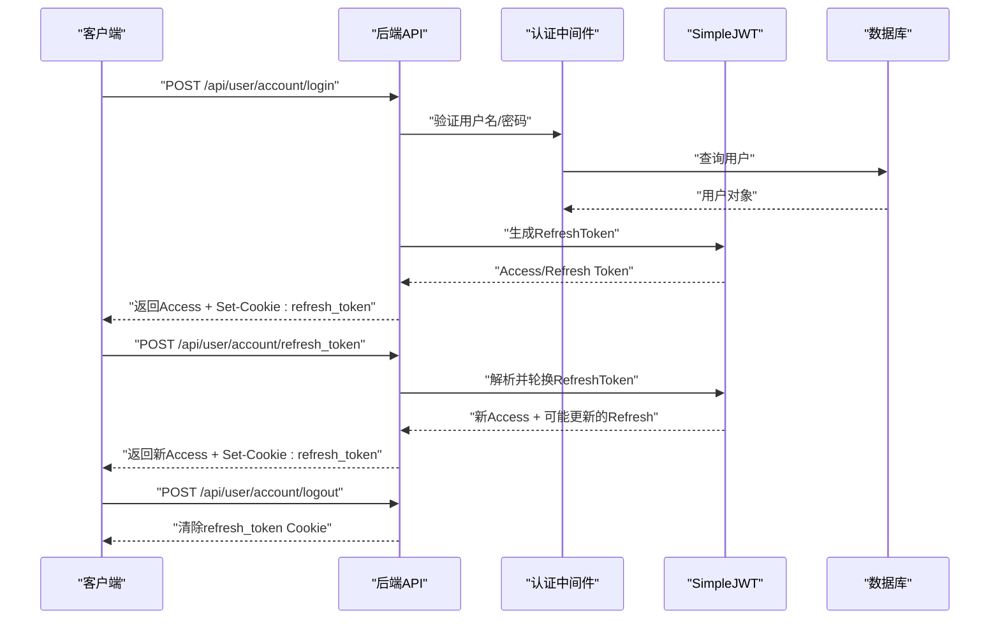
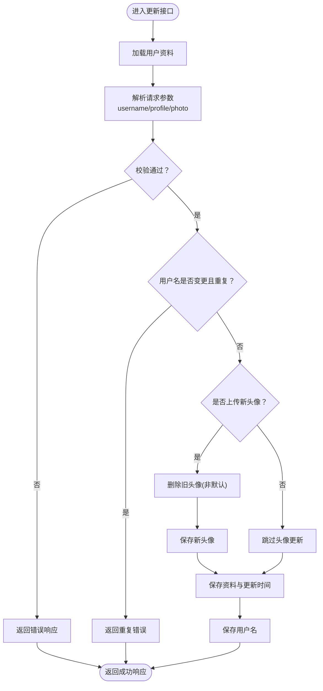
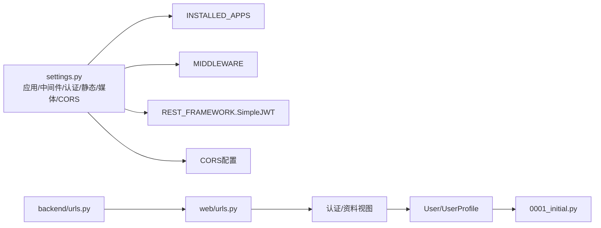

# 后端开发

<cite>
**本文引用的文件**
- [settings.py](file://backend/backend/settings.py)
- [urls.py](file://backend/backend/urls.py)
- [user.py](file://backend/web/models/user.py)
- [0001_initial.py](file://backend/web/migrations/0001_initial.py)
- [login.py](file://backend/web/views/user/account/login.py)
- [register.py](file://backend/web/views/user/account/register.py)
- [refresh_token.py](file://backend/web/views/user/account/refresh_token.py)
- [logout.py](file://backend/web/views/user/account/logout.py)
- [get_user_info.py](file://backend/web/views/user/account/get_user_info.py)
- [update.py](file://backend/web/views/user/profile/update.py)
- [photo.py](file://backend/web/views/utils/photo.py)
- [urls.py](file://backend/web/urls.py)
- [index.py](file://backend/web/views/index.py)
- [index.html](file://backend/web/templates/index.html)
- [manage.py](file://backend/manage.py)
</cite>

## 目录
1. [引言](#引言)
2. [项目结构](#项目结构)
3. [核心组件](#核心组件)
4. [架构总览](#架构总览)
5. [详细组件分析](#详细组件分析)
6. [依赖分析](#依赖分析)
7. [性能考虑](#性能考虑)
8. [故障排查指南](#故障排查指南)
9. [结论](#结论)
10. [附录](#附录)

## 引言
本文件面向LLM_AIfriends后端开发，系统性梳理Django项目结构与配置、用户模型设计、认证视图实现、文件上传处理、JWT令牌管理机制、用户认证流程与会话状态维护、个人资料管理（头像上传、数据校验与存储策略）、API设计原则、错误处理与安全考量，以及数据库模型关系、迁移管理与性能优化策略。文档兼顾技术深度与可读性，适合具备基础前端经验的开发者快速上手与深入扩展。

## 项目结构
后端采用Django应用分层：根目录包含Django工程配置与命令入口，web应用承载业务逻辑与视图；静态与媒体资源通过设置统一管理；前端构建产物由模板渲染托管。

**图表来源**
- [settings.py:1-158](file://backend/backend/settings.py#L1-L158)
- [urls.py:1-38](file://backend/backend/urls.py#L1-L38)
- [user.py:1-23](file://backend/web/models/user.py#L1-L23)
- [0001_initial.py:1-30](file://backend/web/migrations/0001_initial.py#L1-L30)
- [urls.py:1-24](file://backend/web/urls.py#L1-L24)
- [index.py:1-4](file://backend/web/views/index.py#L1-L4)
- [index.html:1-17](file://backend/web/templates/index.html#L1-L17)
- [manage.py:1-23](file://backend/manage.py#L1-L23)

**章节来源**
- [settings.py:1-158](file://backend/backend/settings.py#L1-L158)
- [urls.py:1-38](file://backend/backend/urls.py#L1-L38)
- [urls.py:1-24](file://backend/web/urls.py#L1-L24)
- [index.py:1-4](file://backend/web/views/index.py#L1-L4)
- [index.html:1-17](file://backend/web/templates/index.html#L1-L17)
- [manage.py:1-23](file://backend/manage.py#L1-L23)

## 核心组件
- 认证与会话
  - 基于REST Framework SimpleJWT的无状态认证，使用Bearer Token进行鉴权。
  - 登录成功发放Access Token与Refresh Token，并将Refresh Token以HttpOnly Cookie持久化，提升安全性。
  - 刷新接口从Cookie读取Refresh Token，支持轮换与黑名单策略，保障长期会话稳定性。
- 用户模型与个人资料
  - 继承Django内置User，一对一关联UserProfile，包含头像、简介、创建与更新时间。
  - 头像上传路径按用户ID与随机文件名组织，避免冲突与重复。
- 文件上传与清理
  - 支持multipart/form-data上传头像，更新时自动清理旧头像文件，保留默认头像不删除。
- API路由与静态资源
  - 应用路由统一前缀“/api”，首页兜底路由确保SPA单页应用正常运行。
  - 开发环境静态资源与媒体资源通过Django服务，生产环境建议交由反向代理。

**章节来源**
- [settings.py:133-151](file://backend/backend/settings.py#L133-L151)
- [user.py:1-23](file://backend/web/models/user.py#L1-L23)
- [photo.py:1-13](file://backend/web/views/utils/photo.py#L1-L13)
- [urls.py:1-24](file://backend/web/urls.py#L1-L24)
- [urls.py:23-38](file://backend/backend/urls.py#L23-L38)

## 架构总览
下图展示从客户端到后端的关键交互：前端通过HTTP请求访问后端API，后端基于SimpleJWT进行认证与授权，用户资料与头像存储于数据库与文件系统。

**图表来源**
- [settings.py:133-151](file://backend/backend/settings.py#L133-L151)
- [urls.py:1-24](file://backend/web/urls.py#L1-L24)
- [user.py:1-23](file://backend/web/models/user.py#L1-L23)
- [urls.py:23-38](file://backend/backend/urls.py#L23-L38)

## 详细组件分析

### 用户模型与迁移
- 模型设计
  - UserProfile与User一对一关联，字段包含头像ImageField、简介TextField、创建与更新时间。
  - 头像上传路径函数按用户ID与随机短码生成唯一文件名，避免同名覆盖。
- 迁移
  - 初始迁移创建UserProfile表，包含用户外键、头像、简介、时间戳等字段。

**图表来源**
- [user.py:15-23](file://backend/web/models/user.py#L15-L23)
- [0001_initial.py:17-29](file://backend/web/migrations/0001_initial.py#L17-L29)

**章节来源**
- [user.py:1-23](file://backend/web/models/user.py#L1-L23)
- [0001_initial.py:1-30](file://backend/web/migrations/0001_initial.py#L1-L30)

### JWT与认证流程
- 登录流程
  - 校验用户名与密码，成功则生成RefreshToken并发放Access Token，同时写入HttpOnly Cookie。
  - 返回用户基本信息与头像URL，便于前端即时展示。
- 刷新流程
  - 从Cookie读取refresh_token，若启用轮换则刷新并回写Cookie，否则仅返回新的Access Token。
- 注销流程
  - 清除refresh_token Cookie，使后续刷新失败，达到登出效果。
- 会话状态维护
  - Access Token短期有效，Refresh Token长期有效但受轮换与黑名单策略约束，结合Cookie实现无感续期。

**图表来源**
- [login.py:9-46](file://backend/web/views/user/account/login.py#L9-L46)
- [refresh_token.py:7-41](file://backend/web/views/user/account/refresh_token.py#L7-L41)
- [logout.py:7-16](file://backend/web/views/user/account/logout.py#L7-L16)
- [settings.py:133-151](file://backend/backend/settings.py#L133-L151)

**章节来源**
- [login.py:1-92](file://backend/web/views/user/account/login.py#L1-L92)
- [refresh_token.py:1-41](file://backend/web/views/user/account/refresh_token.py#L1-L41)
- [logout.py:1-16](file://backend/web/views/user/account/logout.py#L1-L16)
- [settings.py:133-151](file://backend/backend/settings.py#L133-L151)

### 个人资料管理
- 更新接口职责
  - 校验用户名与简介非空，检查用户名唯一性。
  - 支持头像文件上传，更新时删除旧头像（保留默认头像）。
  - 更新用户模型与资料模型，记录更新时间。
- 数据验证与存储策略
  - 后端严格校验输入，拒绝空值与重复用户名。
  - 头像文件名采用随机短码，路径按用户ID与扩展名组织，避免冲突。
  - 旧头像清理避免磁盘冗余，仅当非默认头像时执行删除。

**图表来源**
- [update.py:12-63](file://backend/web/views/user/profile/update.py#L12-L63)
- [photo.py:7-13](file://backend/web/views/utils/photo.py#L7-L13)

**章节来源**
- [update.py:1-63](file://backend/web/views/user/profile/update.py#L1-L63)
- [photo.py:1-13](file://backend/web/views/utils/photo.py#L1-L13)

### API设计原则与错误处理
- 设计原则
  - 路由统一前缀“/api”，便于与静态资源与前端路由分离。
  - 视图类遵循REST风格，GET用于查询，POST用于提交与变更。
  - 认证视图强制IsAuthenticated权限，确保受保护接口的安全性。
- 错误处理
  - 对空参数、重复用户名、认证失败、系统异常等情况返回明确提示。
  - 刷新与注销场景对401状态进行显式返回，便于前端识别与处理。

**章节来源**
- [urls.py:10-17](file://backend/web/urls.py#L10-L17)
- [get_user_info.py:8-25](file://backend/web/views/user/account/get_user_info.py#L8-L25)
- [register.py:9-46](file://backend/web/views/user/account/register.py#L9-L46)
- [refresh_token.py:7-41](file://backend/web/views/user/account/refresh_token.py#L7-L41)
- [logout.py:7-16](file://backend/web/views/user/account/logout.py#L7-L16)

### 安全考虑
- 认证与会话
  - 使用HttpOnly Cookie存放Refresh Token，降低XSS风险。
  - Access Token短期有效，配合Refresh Token轮换与黑名单策略。
- 输入校验
  - 后端对用户名、密码、简介进行必填与唯一性校验，拒绝恶意输入。
- 跨域与传输
  - CORS允许凭据与指定源，生产环境需收紧允许源列表。
  - 登录Cookie设置secure标志，提升HTTPS传输安全。

**章节来源**
- [settings.py:153-158](file://backend/backend/settings.py#L153-L158)
- [login.py:31-38](file://backend/web/views/user/account/login.py#L31-L38)
- [refresh_token.py:25-31](file://backend/web/views/user/account/refresh_token.py#L25-L31)
- [update.py:25-38](file://backend/web/views/user/profile/update.py#L25-L38)

## 依赖分析
- 应用与中间件
  - INSTALLED_APPS包含Django核心、REST Framework、自定义web应用与CORS。
  - 中间件顺序影响跨域、会话与CSRF行为，CORS需尽量靠前。
- 路由与静态资源
  - 根URL包含admin与web应用路由；开发模式下静态与媒体资源由Django提供。
- 模型与迁移
  - UserProfile依赖User模型，迁移创建表结构并建立外键关系。

**图表来源**
- [settings.py:33-54](file://backend/backend/settings.py#L33-L54)
- [urls.py:23-38](file://backend/backend/urls.py#L23-L38)
- [urls.py:10-23](file://backend/web/urls.py#L10-L23)
- [0001_initial.py:17-29](file://backend/web/migrations/0001_initial.py#L17-L29)

**章节来源**
- [settings.py:33-54](file://backend/backend/settings.py#L33-L54)
- [urls.py:1-38](file://backend/backend/urls.py#L1-L38)
- [urls.py:1-24](file://backend/web/urls.py#L1-L24)
- [0001_initial.py:1-30](file://backend/web/migrations/0001_initial.py#L1-L30)

## 性能考虑
- 数据库访问
  - 使用select_related或prefetch_related减少查询次数（当前实现为一次性查询，可按需优化）。
  - 简单字段查询走索引，避免全表扫描。
- 文件存储
  - 头像上传采用随机短码命名，避免热点与冲突；定期清理旧头像，控制磁盘占用。
- 缓存与会话
  - 当前为无状态JWT，未引入缓存；如需提升高并发下的令牌校验性能，可在网关层引入Redis缓存黑名单。
- 静态资源
  - 开发阶段Django提供静态与媒体资源；生产环境建议由Nginx/CDN提供，减轻服务器压力。

[本节为通用指导，无需特定文件引用]

## 故障排查指南
- 登录失败
  - 检查用户名与密码是否为空，确认用户是否存在且密码正确。
  - 查看响应中是否返回Access Token与Cookie设置。
- 刷新失败
  - 确认浏览器是否携带refresh_token Cookie，检查其是否过期或被清除。
  - 若启用轮换，确认后端日志与黑名单状态。
- 注销无效
  - 确认后端是否返回删除Cookie指令，前端是否正确处理响应。
- 头像更新异常
  - 检查上传文件类型与大小限制，确认旧头像清理逻辑是否执行。
- 跨域问题
  - 核对CORS允许源与凭据设置，确保前端请求携带凭证。

**章节来源**
- [login.py:10-46](file://backend/web/views/user/account/login.py#L10-L46)
- [refresh_token.py:8-41](file://backend/web/views/user/account/refresh_token.py#L8-L41)
- [logout.py:7-16](file://backend/web/views/user/account/logout.py#L7-L16)
- [update.py:12-63](file://backend/web/views/user/profile/update.py#L12-L63)
- [settings.py:153-158](file://backend/backend/settings.py#L153-L158)

## 结论
本项目以Django + DRF + SimpleJWT为核心，构建了清晰的认证与个人资料管理体系。通过严格的输入校验、安全的Cookie策略与文件清理机制，保障了系统的可用性与安全性。建议在生产环境中进一步完善CORS与安全头配置、引入缓存与CDN、规范日志与监控体系，并持续优化数据库与文件存储策略以满足更高并发需求。

[本节为总结性内容，无需特定文件引用]

## 附录

### API一览（路径与用途）
- POST /api/user/account/login：登录并发放Token与Cookie
- POST /api/user/account/register：注册并初始化用户资料
- POST /api/user/account/refresh_token：刷新Access Token
- POST /api/user/account/logout：清除Cookie实现登出
- GET /api/user/account/get_user_info：获取当前用户信息
- POST /api/user/profile/update：更新用户名、简介与头像

**章节来源**
- [urls.py:10-17](file://backend/web/urls.py#L10-L17)

### 配置要点速览
- 认证：REST_FRAMEWORK.SimpleJWT启用JWT认证
- 令牌生命周期：Access 2小时，Refresh 7天，支持轮换与黑名单
- 静态与媒体：STATIC/MEDIA路径与开发环境服务
- 跨域：CORS允许凭据与本地前端源

**章节来源**
- [settings.py:133-158](file://backend/backend/settings.py#L133-L158)
- [urls.py:29-37](file://backend/backend/urls.py#L29-L37)