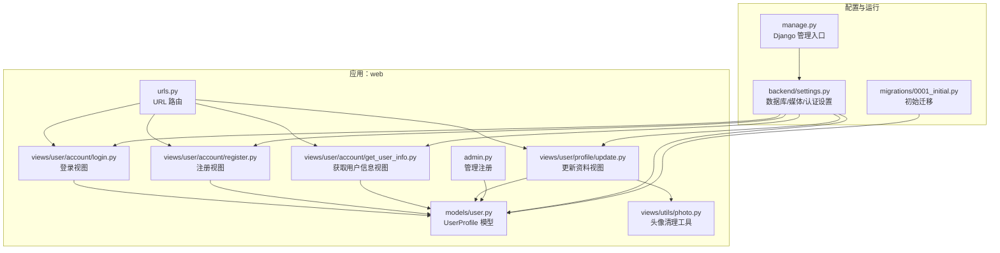
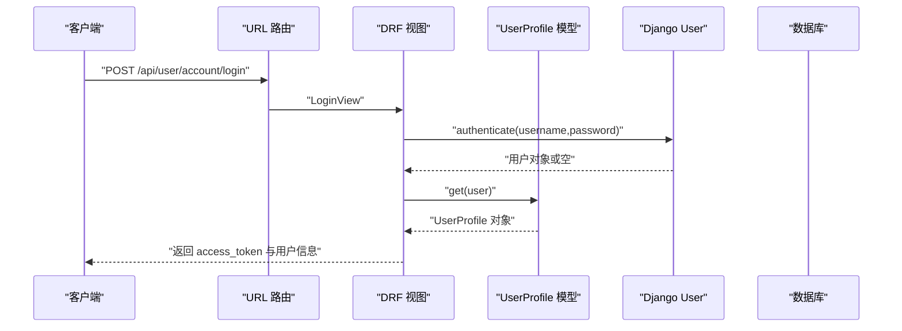
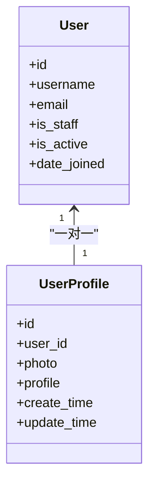
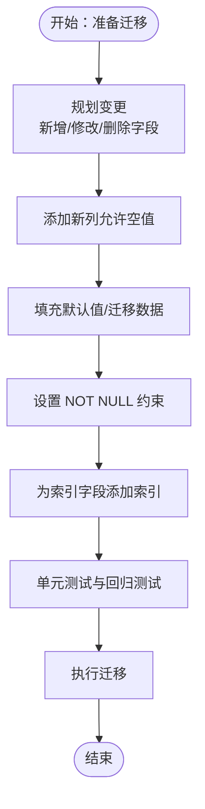
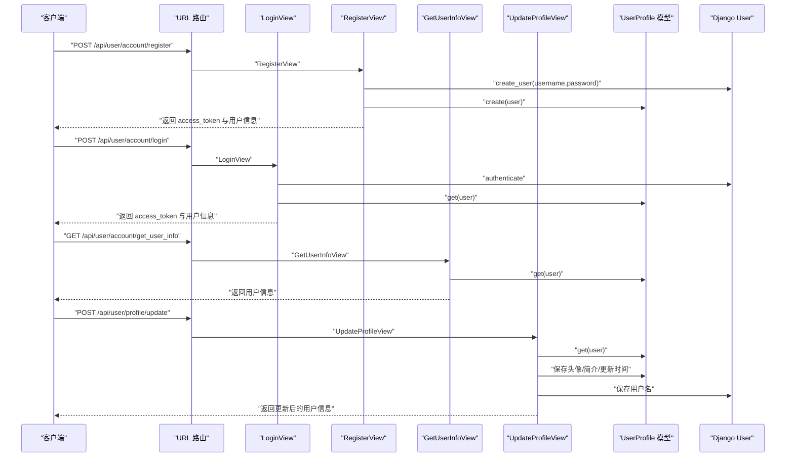
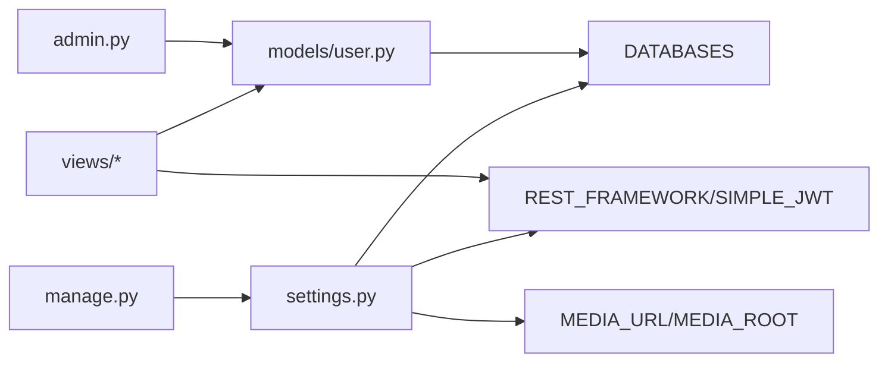

# 数据库模型设计

<cite>
**本文引用的文件**
- [backend/web/models/user.py](file://backend/web/models/user.py)
- [backend/web/migrations/0001_initial.py](file://backend/web/migrations/0001_initial.py)
- [backend/web/admin.py](file://backend/web/admin.py)
- [backend/web/views/user/account/get_user_info.py](file://backend/web/views/user/account/get_user_info.py)
- [backend/web/views/user/profile/update.py](file://backend/web/views/user/profile/update.py)
- [backend/web/views/user/account/register.py](file://backend/web/views/user/account/register.py)
- [backend/web/views/user/account/login.py](file://backend/web/views/user/account/login.py)
- [backend/web/views/utils/photo.py](file://backend/web/views/utils/photo.py)
- [backend/web/urls.py](file://backend/web/urls.py)
- [backend/backend/settings.py](file://backend/backend/settings.py)
- [backend/manage.py](file://backend/manage.py)
</cite>

## 目录
1. [简介](#简介)
2. [项目结构](#项目结构)
3. [核心组件](#核心组件)
4. [架构总览](#架构总览)
5. [详细组件分析](#详细组件分析)
6. [依赖分析](#依赖分析)
7. [性能考虑](#性能考虑)
8. [故障排查指南](#故障排查指南)
9. [结论](#结论)
10. [附录](#附录)

## 简介
本文件聚焦于用户相关数据库模型的设计与实现，围绕 UserProfile 模型的字段定义、数据类型选择、约束条件展开；阐明模型间关系映射（一对一、外键与级联删除）；解析迁移机制（初始迁移内容与策略）；并给出模型扩展最佳实践（索引、查询优化、数据完整性）、性能调优建议、备份策略与版本管理方案。

## 项目结构
后端采用 Django 应用“web”，用户模型位于 models/user.py，初始迁移位于 web/migrations/0001_initial.py。视图层通过 DRF 提供用户账户与资料更新接口，管理员后台注册了 UserProfile 以提升管理体验。数据库默认使用 SQLite，媒体文件路径在设置中集中配置。

图表来源
- [backend/web/models/user.py:15-23](file://backend/web/models/user.py#L15-L23)
- [backend/web/migrations/0001_initial.py:9-29](file://backend/web/migrations/0001_initial.py#L9-L29)
- [backend/web/views/user/account/login.py:9-46](file://backend/web/views/user/account/login.py#L9-L46)
- [backend/web/views/user/account/register.py:9-42](file://backend/web/views/user/account/register.py#L9-L42)
- [backend/web/views/user/account/get_user_info.py:8-24](file://backend/web/views/user/account/get_user_info.py#L8-L24)
- [backend/web/views/user/profile/update.py:12-61](file://backend/web/views/user/profile/update.py#L12-L61)
- [backend/web/views/utils/photo.py:7-13](file://backend/web/views/utils/photo.py#L7-L13)
- [backend/web/urls.py:10-23](file://backend/web/urls.py#L10-L23)
- [backend/backend/settings.py:79-132](file://backend/backend/settings.py#L79-L132)
- [backend/manage.py:7-18](file://backend/manage.py#L7-L18)

章节来源
- [backend/web/models/user.py:15-23](file://backend/web/models/user.py#L15-L23)
- [backend/web/migrations/0001_initial.py:9-29](file://backend/web/migrations/0001_initial.py#L9-L29)
- [backend/web/urls.py:10-23](file://backend/web/urls.py#L10-L23)
- [backend/backend/settings.py:79-132](file://backend/backend/settings.py#L79-L132)
- [backend/manage.py:7-18](file://backend/manage.py#L7-L18)

## 核心组件
- UserProfile 模型：承载用户扩展资料，包含一对一关联到 Django 内置 User，并维护头像、简介、创建与更新时间等字段。
- 初始迁移：创建 UserProfile 表及字段，建立 user 字段的一对一关系与级联删除策略。
- 视图层：登录、注册、获取用户信息、更新资料等接口均围绕 UserProfile 读写。
- 管理后台：注册 UserProfile 并启用 raw_id_fields 优化大字段列表页加载。
- 媒体与存储：头像上传路径与默认值、旧头像清理逻辑。

章节来源
- [backend/web/models/user.py:15-23](file://backend/web/models/user.py#L15-L23)
- [backend/web/migrations/0001_initial.py:17-29](file://backend/web/migrations/0001_initial.py#L17-L29)
- [backend/web/admin.py:6-9](file://backend/web/admin.py#L6-L9)
- [backend/web/views/user/account/get_user_info.py:8-24](file://backend/web/views/user/account/get_user_info.py#L8-L24)
- [backend/web/views/user/profile/update.py:12-61](file://backend/web/views/user/profile/update.py#L12-L61)
- [backend/web/views/utils/photo.py:7-13](file://backend/web/views/utils/photo.py#L7-L13)

## 架构总览
下图展示用户相关数据流：客户端请求经由 URL 路由到达 DRF 视图，视图访问 UserProfile 模型进行读写；模型依赖 Django User 的一对一关系；媒体文件路径由设置统一管理。

图表来源
- [backend/web/urls.py:12-13](file://backend/web/urls.py#L12-L13)
- [backend/web/views/user/account/login.py:9-46](file://backend/web/views/user/account/login.py#L9-L46)
- [backend/web/models/user.py:15-23](file://backend/web/models/user.py#L15-L23)

## 详细组件分析

### UserProfile 模型设计
- 字段与类型
  - user: OneToOneField 关联到 AUTH_USER_MODEL，on_delete=CASCADE，确保用户删除时同步删除资料。
  - photo: ImageField，默认值指向默认头像路径，upload_to 由辅助函数生成带前缀的唯一文件名，便于按用户分目录存储。
  - profile: TextField，带最大长度限制与默认值，适合存储用户简介。
  - create_time / update_time: DateTimeField，默认值为当前时间，便于审计与排序。
- 约束与行为
  - 一对一关系天然保证每个 User 仅对应一条 UserProfile。
  - 级联删除：删除 User 将删除其对应的 UserProfile。
  - 默认值与上传策略：默认头像与唯一命名减少冲突与冗余。
- 可扩展性
  - 建议增加索引：对 user_id、create_time、update_time 建立索引以优化查询与排序。
  - 建议增加唯一约束：对 username（通过 User 模型保证）与 profile 的长度控制可结合业务需求评估是否需要额外约束。

图表来源
- [backend/web/models/user.py:15-23](file://backend/web/models/user.py#L15-L23)
- [backend/web/migrations/0001_initial.py:26](file://backend/web/migrations/0001_initial.py#L26)

章节来源
- [backend/web/models/user.py:15-23](file://backend/web/models/user.py#L15-L23)
- [backend/web/migrations/0001_initial.py:18-26](file://backend/web/migrations/0001_initial.py#L18-L26)

### 迁移机制与策略
- 初始迁移
  - 创建 UserProfile 表，字段包含主键、photo、profile、create_time、update_time、user（一对一外键）。
  - user 外键 on_delete=CASCADE，体现级联删除策略。
  - 依赖 AUTH_USER_MODEL，确保与实际 User 模型一致。
- 迁移策略建议
  - 新增字段优先使用非空默认值或可选字段，避免全表回填。
  - 对高频查询字段（如 user_id、create_time）尽早添加索引。
  - 批量变更时先添加列，再补默认值，最后设为 NOT NULL，降低锁表时间。
  - 大字段（如 profile）变更需谨慎，必要时拆分为独立表或使用压缩存储。

图表来源
- [backend/web/migrations/0001_initial.py:9-29](file://backend/web/migrations/0001_initial.py#L9-L29)

章节来源
- [backend/web/migrations/0001_initial.py:9-29](file://backend/web/migrations/0001_initial.py#L9-L29)

### 视图与模型交互流程
- 登录/注册
  - 登录成功后从 UserProfile 中读取头像与简介；注册时自动创建 UserProfile。
- 获取用户信息
  - 通过 request.user 获取当前用户，查询其 UserProfile 返回必要字段。
- 更新资料
  - 支持修改用户名、简介与头像；涉及旧头像清理与保存顺序。

图表来源
- [backend/web/urls.py:12-17](file://backend/web/urls.py#L12-L17)
- [backend/web/views/user/account/register.py:9-42](file://backend/web/views/user/account/register.py#L9-L42)
- [backend/web/views/user/account/login.py:9-46](file://backend/web/views/user/account/login.py#L9-L46)
- [backend/web/views/user/account/get_user_info.py:8-24](file://backend/web/views/user/account/get_user_info.py#L8-L24)
- [backend/web/views/user/profile/update.py:12-61](file://backend/web/views/user/profile/update.py#L12-L61)
- [backend/web/models/user.py:15-23](file://backend/web/models/user.py#L15-L23)

章节来源
- [backend/web/views/user/account/register.py:9-42](file://backend/web/views/user/account/register.py#L9-L42)
- [backend/web/views/user/account/login.py:9-46](file://backend/web/views/user/account/login.py#L9-L46)
- [backend/web/views/user/account/get_user_info.py:8-24](file://backend/web/views/user/account/get_user_info.py#L8-L24)
- [backend/web/views/user/profile/update.py:12-61](file://backend/web/views/user/profile/update.py#L12-L61)

### 管理后台与媒体配置
- 管理后台
  - 注册 UserProfile，并启用 raw_id_fields 以避免列表页加载时的性能问题。
- 媒体配置
  - MEDIA_URL/MEDIA_ROOT 统一管理静态媒体资源路径，配合 ImageField 存储头像。
- 头像清理
  - 上传新头像时删除旧文件（除默认头像），节省存储空间。

章节来源
- [backend/web/admin.py:6-9](file://backend/web/admin.py#L6-L9)
- [backend/backend/settings.py:130-131](file://backend/backend/settings.py#L130-L131)
- [backend/web/views/utils/photo.py:7-13](file://backend/web/views/utils/photo.py#L7-L13)

## 依赖分析
- 模型依赖
  - UserProfile 依赖 AUTH_USER_MODEL（默认为 django.contrib.auth.models.User）。
- 视图依赖
  - 登录/注册/获取信息/更新资料视图均依赖 UserProfile 模型。
- 配置依赖
  - 数据库引擎与路径、媒体路径、认证方式（JWT）均由 settings.py 集中配置。
- 运行依赖
  - manage.py 作为 Django 管理入口，加载 settings 并执行命令。

图表来源
- [backend/backend/settings.py:79-151](file://backend/backend/settings.py#L79-L151)
- [backend/web/models/user.py:15-23](file://backend/web/models/user.py#L15-L23)
- [backend/web/views/user/account/login.py:9-46](file://backend/web/views/user/account/login.py#L9-L46)
- [backend/web/views/user/account/register.py:9-42](file://backend/web/views/user/account/register.py#L9-L42)
- [backend/web/views/user/account/get_user_info.py:8-24](file://backend/web/views/user/account/get_user_info.py#L8-L24)
- [backend/web/views/user/profile/update.py:12-61](file://backend/web/views/user/profile/update.py#L12-L61)
- [backend/web/admin.py:6-9](file://backend/web/admin.py#L6-L9)
- [backend/manage.py:7-18](file://backend/manage.py#L7-L18)

章节来源
- [backend/backend/settings.py:79-151](file://backend/backend/settings.py#L79-L151)
- [backend/web/models/user.py:15-23](file://backend/web/models/user.py#L15-L23)
- [backend/web/views/user/account/login.py:9-46](file://backend/web/views/user/account/login.py#L9-L46)
- [backend/web/views/user/account/register.py:9-42](file://backend/web/views/user/account/register.py#L9-L42)
- [backend/web/views/user/account/get_user_info.py:8-24](file://backend/web/views/user/account/get_user_info.py#L8-L24)
- [backend/web/views/user/profile/update.py:12-61](file://backend/web/views/user/profile/update.py#L12-L61)
- [backend/web/admin.py:6-9](file://backend/web/admin.py#L6-L9)
- [backend/manage.py:7-18](file://backend/manage.py#L7-L18)

## 性能考虑
- 查询优化
  - 为 user_id、create_time、update_time 添加索引，提升筛选与排序效率。
  - 使用 select_related 或 prefetch_related 减少 N+1 查询（如登录/获取信息时）。
- 存储与 IO
  - 头像尺寸与格式控制，避免过大图片；开启 CDN 加速媒体资源。
  - 定期清理默认头像以外的旧头像文件，保持 MEDIA_ROOT 清洁。
- 数据库引擎
  - SQLite 适合开发/小规模场景；生产建议迁移到 PostgreSQL/MySQL，获得更好的并发与稳定性。
- 缓存策略
  - 对热点用户资料（如头像、简介）增加缓存层，降低数据库压力。
- 并发与事务
  - 更新资料时使用原子事务，避免中间状态被读取。

[本节为通用指导，无需特定文件引用]

## 故障排查指南
- 常见问题定位
  - 登录失败：检查用户名/密码是否为空、authenticate 是否返回用户对象、UserProfile 是否存在。
  - 注册失败：检查用户名是否已存在、User 是否创建成功、UserProfile 是否创建成功。
  - 获取信息失败：确认 request.user 是否认证通过、UserProfile 是否存在。
  - 更新资料失败：检查用户名/简介是否为空、用户名是否重复、头像保存与旧头像清理是否成功。
- 日志与调试
  - 在视图中捕获异常并返回统一错误信息，便于前端提示与后端排查。
  - 管理后台启用 raw_id_fields，避免列表页卡顿。
- 数据一致性
  - 级联删除策略确保用户删除时资料同步删除；若需保留资料，应调整为 SET_NULL 或其它策略。

章节来源
- [backend/web/views/user/account/login.py:9-46](file://backend/web/views/user/account/login.py#L9-L46)
- [backend/web/views/user/account/register.py:9-42](file://backend/web/views/user/account/register.py#L9-L42)
- [backend/web/views/user/account/get_user_info.py:8-24](file://backend/web/views/user/account/get_user_info.py#L8-L24)
- [backend/web/views/user/profile/update.py:12-61](file://backend/web/views/user/profile/update.py#L12-L61)
- [backend/web/admin.py:6-9](file://backend/web/admin.py#L6-L9)

## 结论
本设计以 UserProfile 为核心，通过与 Django User 的一对一关系实现用户扩展信息的稳定存储；初始迁移清晰定义了表结构与外键约束；视图层围绕模型提供完整的账户与资料管理能力；媒体与管理后台配置完善。建议后续在索引、查询优化、数据库引擎与缓存方面持续改进，以满足更高并发与可靠性要求。

[本节为总结，无需特定文件引用]

## 附录
- 最佳实践清单
  - 索引：user_id、create_time、update_time
  - 查询：select_related/prefetch_related，避免 N+1
  - 存储：控制头像大小与格式，定期清理旧文件
  - 引擎：SQLite 仅限开发；生产迁移至 PostgreSQL/MySQL
  - 缓存：热点数据加缓存
  - 备份：定期导出数据库与媒体文件
  - 版本管理：迁移脚本不可回改，变更前做好备份与灰度

[本节为通用指导，无需特定文件引用]