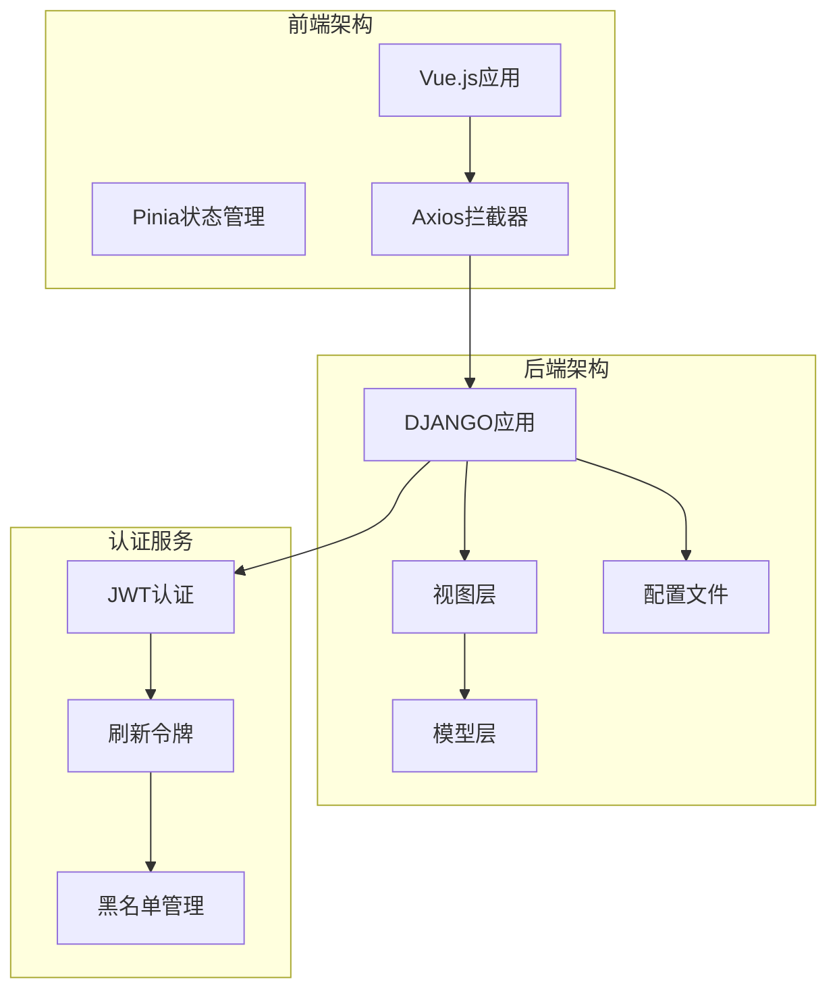
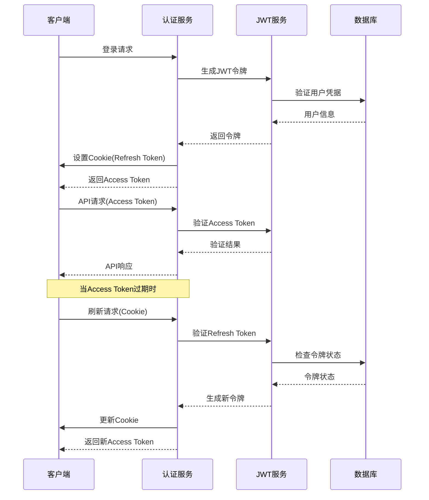
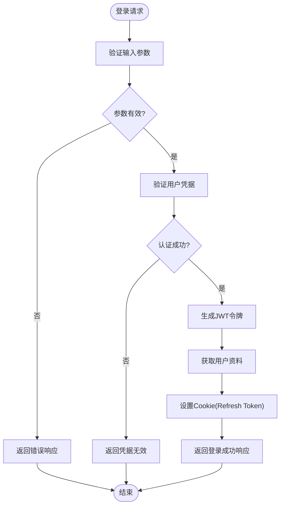
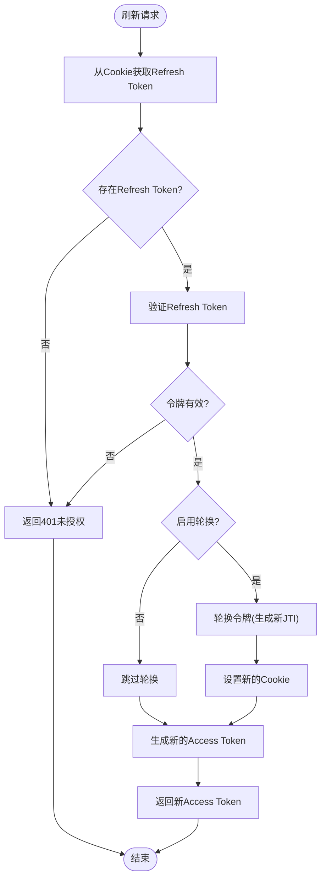
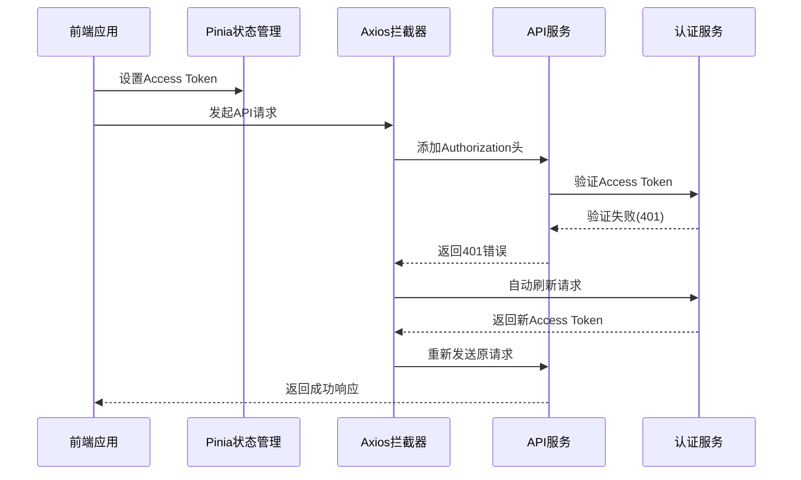
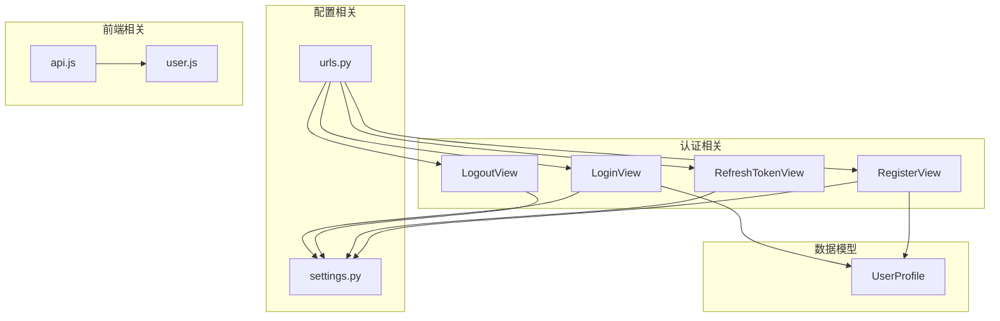

# 令牌管理

<cite>
**本文档引用的文件**
- [backend/web/views/user/account/login.py](file://backend/web/views/user/account/login.py)
- [backend/web/views/user/account/logout.py](file://backend/web/views/user/account/logout.py)
- [backend/web/views/user/account/refresh_token.py](file://backend/web/views/user/account/refresh_token.py)
- [backend/web/views/user/account/register.py](file://backend/web/views/user/account/register.py)
- [backend/web/views/index.py](file://backend/web/views/index.py)
- [backend/web/urls.py](file://backend/web/urls.py)
- [backend/backend/settings.py](file://backend/backend/settings.py)
- [frontend/src/js/http/api.js](file://frontend/src/js/http/api.js)
- [frontend/src/stores/user.js](file://frontend/src/stores/user.js)
- [backend/web/models/user.py](file://backend/web/models/user.py)
</cite>

## 目录
1. [简介](#简介)
2. [项目结构](#项目结构)
3. [核心组件](#核心组件)
4. [架构概览](#架构概览)
5. [详细组件分析](#详细组件分析)
6. [依赖关系分析](#依赖关系分析)
7. [性能考量](#性能考量)
8. [故障排除指南](#故障排除指南)
9. [结论](#结论)
10. [附录](#附录)

## 简介

本项目实现了基于JWT（JSON Web Token）的完整令牌管理系统，包括令牌生成、验证、刷新和失效处理。系统采用Django框架和Django REST Framework，结合Django REST Framework SimpleJWT库实现现代化的身份认证机制。

该令牌管理系统提供了以下核心功能：
- 基于Cookie的refresh token存储机制
- 自动化的access token刷新流程
- 安全的令牌轮换策略
- 多设备登录支持
- 完整的登出处理机制

## 项目结构

项目采用前后端分离架构，后端使用Django，前端使用Vue.js和Pinia状态管理。

**图表来源**
- [backend/web/urls.py:10-23](file://backend/web/urls.py#L10-L23)
- [backend/backend/settings.py:136-151](file://backend/backend/settings.py#L136-L151)

**章节来源**
- [backend/web/urls.py:1-24](file://backend/web/urls.py#L1-24)
- [backend/backend/settings.py:132-158](file://backend/backend/settings.py#L132-L158)

## 核心组件

### 认证配置

系统使用Django REST Framework SimpleJWT进行JWT认证配置，主要参数如下：

- **ACCESS_TOKEN_LIFETIME**: 2小时（短期访问令牌）
- **REFRESH_TOKEN_LIFETIME**: 7天（长期刷新令牌）
- **ROTATE_REFRESH_TOKENS**: 启用令牌轮换
- **BLACKLIST_AFTER_ROTATION**: 轮换后加入黑名单
- **AUTH_HEADER_TYPES**: 支持的认证头类型

### 令牌存储策略

系统采用Cookie存储refresh token，实现以下安全特性：
- HttpOnly标志防止XSS攻击
- SameSite=Lax防止CSRF攻击
- Secure标志确保HTTPS传输
- 7天有效期设置

**章节来源**
- [backend/backend/settings.py:142-151](file://backend/backend/settings.py#L142-L151)
- [backend/web/views/user/account/login.py:31-38](file://backend/web/views/user/account/login.py#L31-L38)

## 架构概览

系统采用客户端-服务器架构，通过HTTP Cookie和Bearer Token实现双向认证。

**图表来源**
- [backend/web/views/user/account/login.py:22-39](file://backend/web/views/user/account/login.py#L22-L39)
- [backend/web/views/user/account/refresh_token.py:15-32](file://backend/web/views/user/account/refresh_token.py#L15-L32)

## 详细组件分析

### 登录组件 (LoginView)

登录组件负责用户身份验证和令牌发放。

**图表来源**
- [backend/web/views/user/account/login.py:9-46](file://backend/web/views/user/account/login.py#L9-L46)

**章节来源**
- [backend/web/views/user/account/login.py:1-92](file://backend/web/views/user/account/login.py#L1-L92)

### 注册组件 (RegisterView)

注册组件实现新用户创建和初始令牌发放。

**章节来源**
- [backend/web/views/user/account/register.py:1-46](file://backend/web/views/user/account/register.py#L1-L46)

### 刷新令牌组件 (RefreshTokenView)

刷新令牌组件处理access token的自动刷新机制。

**图表来源**
- [backend/web/views/user/account/refresh_token.py:7-41](file://backend/web/views/user/account/refresh_token.py#L7-L41)

**章节来源**
- [backend/web/views/user/account/refresh_token.py:1-41](file://backend/web/views/user/account/refresh_token.py#L1-L41)

### 登出组件 (LogoutView)

登出组件处理用户退出登录的令牌清理。

**章节来源**
- [backend/web/views/user/account/logout.py:1-16](file://backend/web/views/user/account/logout.py#L1-L16)

### 前端令牌管理

前端使用Axios拦截器实现自动令牌刷新机制。

**图表来源**
- [frontend/src/js/http/api.js:46-90](file://frontend/src/js/http/api.js#L46-L90)

**章节来源**
- [frontend/src/js/http/api.js:1-92](file://frontend/src/js/http/api.js#L1-L92)
- [frontend/src/stores/user.js:1-59](file://frontend/src/stores/user.js#L1-L59)

## 依赖关系分析

系统各组件之间的依赖关系如下：

**图表来源**
- [backend/web/views/user/account/login.py:1-92](file://backend/web/views/user/account/login.py#L1-L92)
- [backend/web/views/user/account/logout.py:1-16](file://backend/web/views/user/account/logout.py#L1-L16)
- [backend/web/views/user/account/refresh_token.py:1-41](file://backend/web/views/user/account/refresh_token.py#L1-L41)
- [backend/web/views/user/account/register.py:1-46](file://backend/web/views/user/account/register.py#L1-L46)
- [backend/web/models/user.py:15-23](file://backend/web/models/user.py#L15-L23)

**章节来源**
- [backend/web/urls.py:1-24](file://backend/web/urls.py#L1-L24)
- [backend/backend/settings.py:136-151](file://backend/backend/settings.py#L136-L151)

## 性能考量

### 令牌生命周期优化

系统通过合理的令牌配置实现性能平衡：

- **Access Token**: 2小时有效期，减少频繁认证开销
- **Refresh Token**: 7天有效期，提供良好的用户体验
- **令牌轮换**: 启用轮换机制，增强安全性的同时保持可用性

### 并发处理机制

系统采用以下策略处理并发访问：

- **请求去重**: 前端使用`isRefreshing`标志避免重复刷新
- **队列机制**: 多个并发请求共享同一个刷新操作
- **超时控制**: 刷新请求设置5秒超时，防止阻塞

**章节来源**
- [backend/backend/settings.py:144-148](file://backend/backend/settings.py#L144-L148)
- [frontend/src/js/http/api.js:29-44](file://frontend/src/js/http/api.js#L29-L44)

## 故障排除指南

### 常见问题及解决方案

#### 1. 刷新令牌过期
**症状**: 401未授权错误且无法自动刷新
**原因**: Refresh Token超过7天有效期
**解决**: 用户需要重新登录获取新的Refresh Token

#### 2. CSRF保护问题
**症状**: 登录后无法正常访问API
**原因**: SameSite设置或跨域配置问题
**解决**: 检查CORS配置和Cookie SameSite设置

#### 3. 令牌轮换冲突
**症状**: 多设备登录时令牌冲突
**原因**: 令牌轮换导致旧令牌失效
**解决**: 系统自动处理令牌轮换，无需额外配置

#### 4. 前端状态同步问题
**症状**: 登出后仍显示登录状态
**原因**: 前端状态未及时更新
**解决**: 确保调用`user.logout()`清除本地状态

**章节来源**
- [backend/web/views/user/account/logout.py:14-15](file://backend/web/views/user/account/logout.py#L14-L15)
- [frontend/src/js/http/api.js:77-80](file://frontend/src/js/http/api.js#L77-L80)

## 结论

本令牌管理系统实现了现代Web应用所需的完整认证机制。通过合理的令牌配置、安全的存储策略和智能的刷新机制，系统在保证安全性的同时提供了良好的用户体验。

### 主要优势

1. **安全性**: 采用HttpOnly Cookie存储Refresh Token，防止XSS攻击
2. **用户体验**: 自动刷新机制减少用户手动登录频率
3. **可扩展性**: 模块化设计便于功能扩展和维护
4. **并发处理**: 智能的并发请求处理机制

### 改进建议

1. **增强日志记录**: 添加详细的认证日志便于审计
2. **监控指标**: 实现令牌使用情况的监控
3. **多因素认证**: 考虑集成MFA提升安全性
4. **令牌撤销**: 实现更细粒度的令牌撤销机制

## 附录

### 配置参数详解

| 参数名称 | 默认值 | 说明 |
|---------|--------|------|
| ACCESS_TOKEN_LIFETIME | 2小时 | Access Token有效期 |
| REFRESH_TOKEN_LIFETIME | 7天 | Refresh Token有效期 |
| ROTATE_REFRESH_TOKENS | True | 是否启用令牌轮换 |
| BLACKLIST_AFTER_ROTATION | True | 轮换后是否加入黑名单 |
| AUTH_HEADER_TYPES | ('Bearer',) | 支持的认证头类型 |

### 最佳实践

1. **安全存储**: 始终使用HttpOnly Cookie存储敏感令牌
2. **合理配置**: 根据业务需求调整令牌有效期
3. **错误处理**: 实现完善的错误处理和重试机制
4. **监控告警**: 建立令牌使用情况的监控体系
5. **定期审计**: 定期检查和更新安全配置