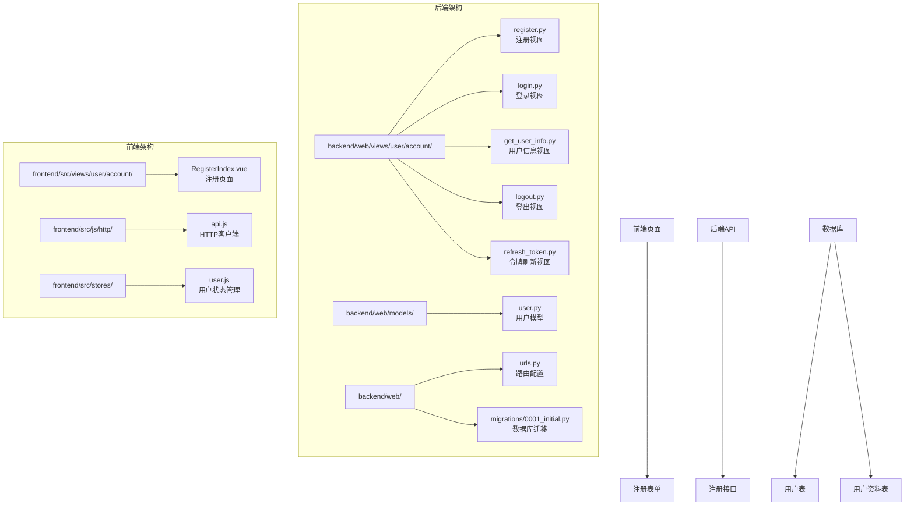
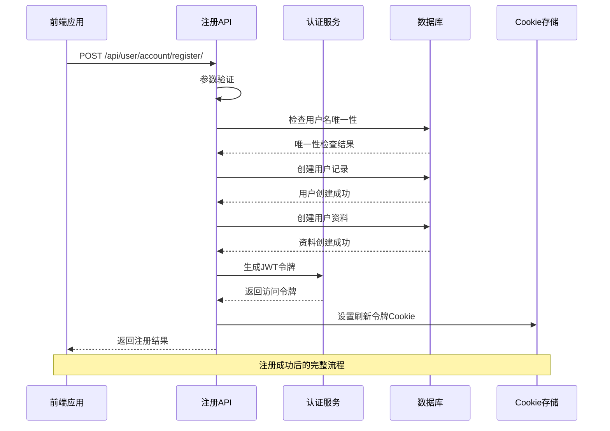
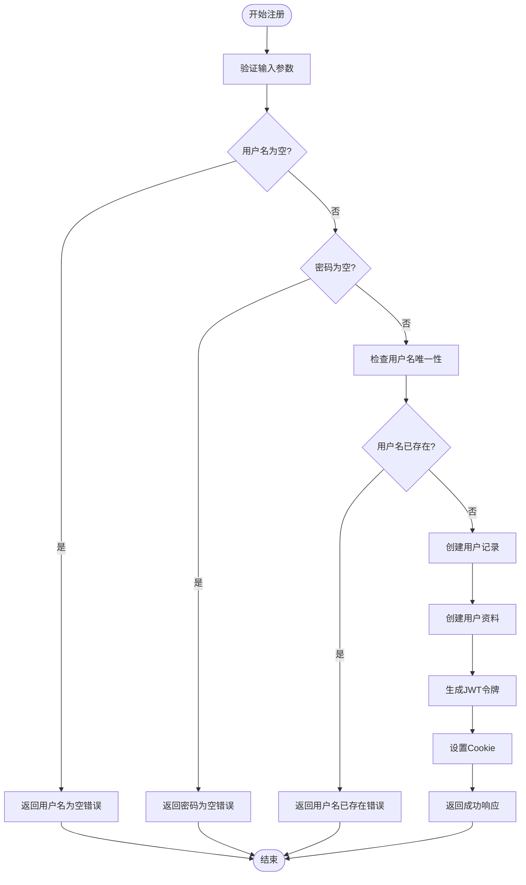
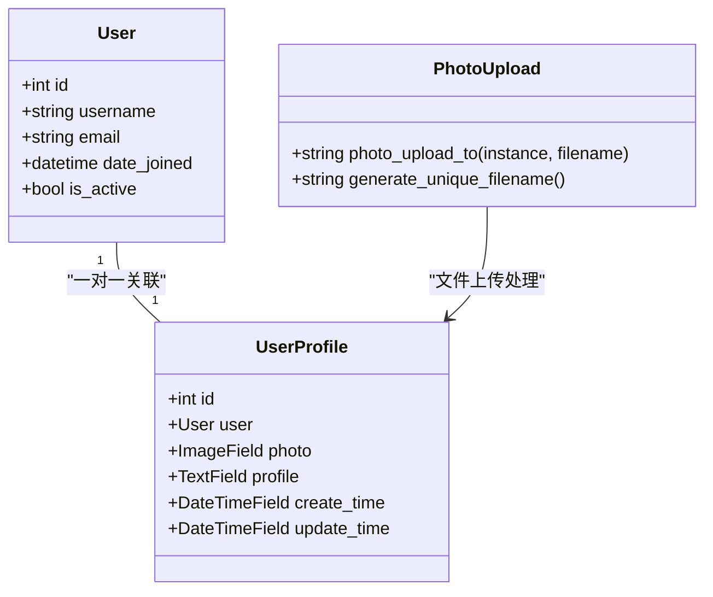
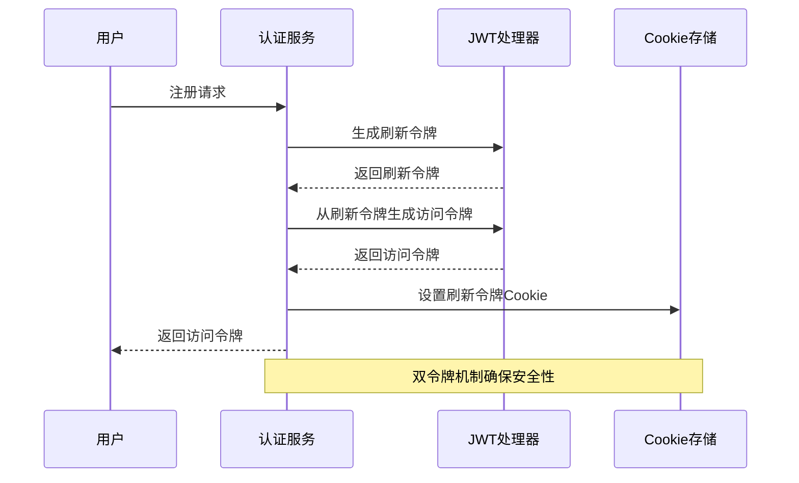
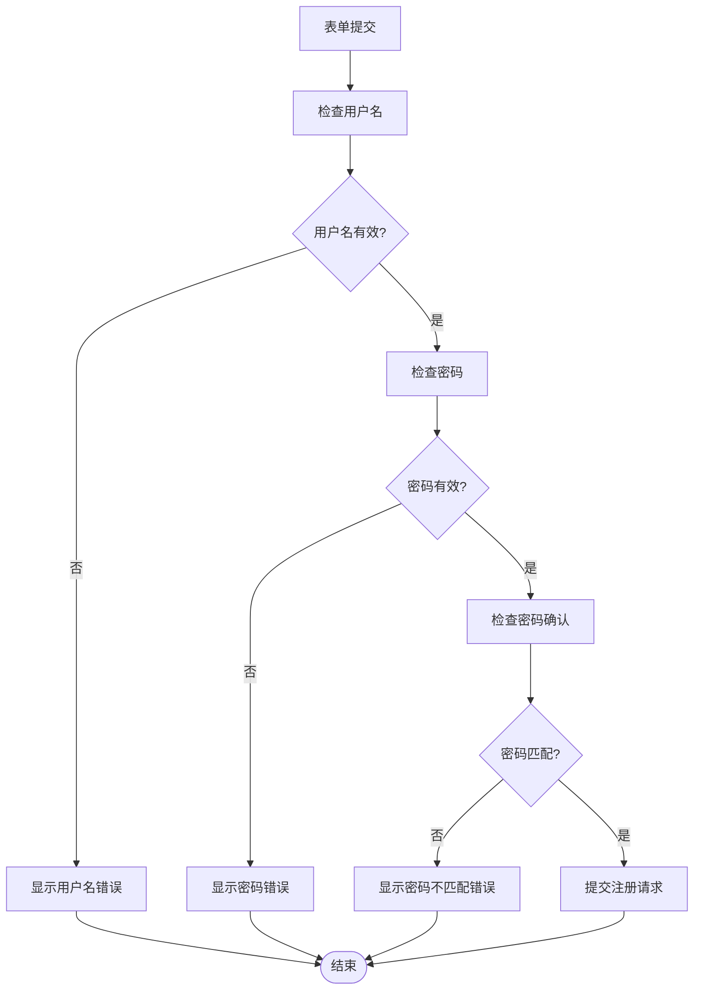
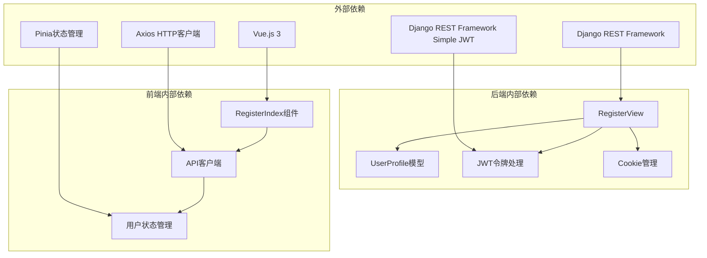

# 注册功能实现

<cite>
**本文档引用的文件**
- [register.py](file://backend/web/views/user/account/register.py)
- [user.py](file://backend/web/models/user.py)
- [login.py](file://backend/web/views/user/account/login.py)
- [get_user_info.py](file://backend/web/views/user/account/get_user_info.py)
- [urls.py](file://backend/web/urls.py)
- [RegisterIndex.vue](file://frontend/src/views/user/account/RegisterIndex.vue)
- [api.js](file://frontend/src/js/http/api.js)
- [user.js](file://frontend/src/stores/user.js)
- [0001_initial.py](file://backend/web/migrations/0001_initial.py)
- [logout.py](file://backend/web/views/user/account/logout.py)
- [refresh_token.py](file://backend/web/views/user/account/refresh_token.py)
</cite>

## 目录
1. [简介](#简介)
2. [项目结构](#项目结构)
3. [核心组件](#核心组件)
4. [架构概览](#架构概览)
5. [详细组件分析](#详细组件分析)
6. [依赖关系分析](#依赖关系分析)
7. [性能考虑](#性能考虑)
8. [故障排除指南](#故障排除指南)
9. [结论](#结论)

## 简介

本文档详细介绍了AI朋友平台的注册功能实现。该系统采用Django + Django REST Framework + Vue.js的技术栈，实现了完整的用户注册、认证和会话管理功能。注册功能涵盖了请求参数验证、用户名唯一性检查、密码安全处理、默认用户资料创建、JWT令牌生成以及前后端交互等核心特性。

## 项目结构

注册功能涉及前后端分离的架构设计，主要包含以下关键目录和文件：

**图表来源**
- [urls.py:10-23](file://backend/web/urls.py#L10-L23)
- [register.py:9-46](file://backend/web/views/user/account/register.py#L9-L46)
- [user.py:15-23](file://backend/web/models/user.py#L15-L23)

**章节来源**
- [urls.py:1-24](file://backend/web/urls.py#L1-L24)
- [register.py:1-46](file://backend/web/views/user/account/register.py#L1-L46)

## 核心组件

注册功能由多个核心组件协同工作，形成完整的用户注册生态系统：

### 后端核心组件

1. **注册视图类 (RegisterView)**: 处理用户注册请求的核心控制器
2. **用户模型 (UserProfile)**: 定义用户资料的数据结构
3. **JWT令牌管理**: 基于Django REST Framework Simple JWT的认证机制
4. **路由配置**: 定义REST API的URL映射

### 前端核心组件

1. **注册页面组件**: 提供用户友好的注册界面
2. **HTTP客户端**: 处理API请求和响应
3. **用户状态管理**: 维护用户登录状态和认证信息

**章节来源**
- [register.py:9-46](file://backend/web/views/user/account/register.py#L9-L46)
- [user.py:15-23](file://backend/web/models/user.py#L15-L23)
- [RegisterIndex.vue:1-76](file://frontend/src/views/user/account/RegisterIndex.vue#L1-L76)

## 架构概览

注册系统的整体架构采用分层设计，确保了良好的可维护性和扩展性：

**图表来源**
- [register.py:10-42](file://backend/web/views/user/account/register.py#L10-L42)
- [login.py:20-39](file://backend/web/views/user/account/login.py#L20-L39)

## 详细组件分析

### 注册视图类实现

注册视图类是整个注册流程的核心控制器，负责处理用户注册请求并执行完整的业务逻辑。

#### 请求参数验证

注册视图对输入参数进行严格的验证：

**图表来源**
- [register.py:12-25](file://backend/web/views/user/account/register.py#L12-L25)

#### 密码安全处理

系统使用Django内置的用户认证框架处理密码安全：

- **自动哈希**: 使用Django的密码哈希机制自动加密存储
- **盐值随机化**: 每个密码都使用随机盐值进行哈希
- **安全存储**: 密码以不可逆的方式存储在数据库中

#### 默认用户资料创建

注册成功后，系统自动为新用户创建默认资料：

**章节来源**
- [register.py:9-46](file://backend/web/views/user/account/register.py#L9-L46)

### 用户模型设计

用户资料模型采用一对一关联设计，确保每个用户都有对应的资料记录。

**图表来源**
- [user.py:15-23](file://backend/web/models/user.py#L15-L23)
- [0001_initial.py:18-29](file://backend/web/migrations/0001_initial.py#L18-L29)

#### 文件上传处理

系统实现了智能的文件上传机制：

- **唯一文件名**: 使用UUID生成唯一的文件名，避免冲突
- **目录结构**: 按用户ID和时间戳组织文件存储
- **默认头像**: 提供默认头像作为后备方案

**章节来源**
- [user.py:10-13](file://backend/web/models/user.py#L10-L13)
- [user.py:17-18](file://backend/web/models/user.py#L17-L18)

### JWT令牌管理系统

注册系统采用JWT（JSON Web Token）进行认证管理，提供安全的会话控制机制。

#### 令牌生成流程

**图表来源**
- [register.py:26-41](file://backend/web/views/user/account/register.py#L26-L41)
- [refresh_token.py:15-32](file://backend/web/views/user/account/refresh_token.py#L15-L32)

#### 令牌安全策略

- **访问令牌**: 短期有效的访问令牌，用于API认证
- **刷新令牌**: 长期有效的刷新令牌，存储在HttpOnly Cookie中
- **自动轮换**: 支持刷新令牌的自动轮换机制
- **安全传输**: 所有令牌通过HTTPS传输

**章节来源**
- [register.py:26-41](file://backend/web/views/user/account/register.py#L26-L41)
- [refresh_token.py:19-32](file://backend/web/views/user/account/refresh_token.py#L19-L32)

### 前端集成实现

前端注册页面提供了完整的用户交互体验：

#### 表单验证逻辑

前端实现了多层次的表单验证：

**图表来源**
- [RegisterIndex.vue:16-45](file://frontend/src/views/user/account/RegisterIndex.vue#L16-L45)

#### 状态管理集成

前端使用Pinia进行状态管理，确保用户状态的一致性：

**章节来源**
- [RegisterIndex.vue:16-45](file://frontend/src/views/user/account/RegisterIndex.vue#L16-L45)
- [user.js:22-31](file://frontend/src/stores/user.js#L22-L31)

## 依赖关系分析

注册功能的依赖关系体现了清晰的分层架构：

**图表来源**
- [register.py:1-6](file://backend/web/views/user/account/register.py#L1-L6)
- [RegisterIndex.vue:3-6](file://frontend/src/views/user/account/RegisterIndex.vue#L3-L6)

### 关键依赖说明

1. **Django REST Framework**: 提供REST API的基础框架
2. **Django REST Framework Simple JWT**: 实现JWT认证机制
3. **Axios**: 处理HTTP请求和响应
4. **Vue.js + Pinia**: 实现前端状态管理和组件通信

**章节来源**
- [register.py:1-6](file://backend/web/views/user/account/register.py#L1-L6)
- [RegisterIndex.vue:3-6](file://frontend/src/views/user/account/RegisterIndex.vue#L3-L6)

## 性能考虑

注册系统的性能优化策略包括：

### 数据库优化

- **索引设计**: 用户名字段建立唯一索引，确保查询效率
- **批量操作**: 用户创建和资料创建采用原子操作
- **缓存策略**: 用户信息在会话期间缓存，减少数据库查询

### 网络优化

- **Cookie持久化**: 刷新令牌7天有效期，减少频繁认证
- **HTTP/2支持**: 利用现代HTTP协议的多路复用特性
- **压缩传输**: 启用Gzip压缩减少传输体积

### 前端优化

- **异步加载**: 注册表单异步提交，提升用户体验
- **错误处理**: 客户端错误处理减少不必要的重试
- **状态缓存**: 用户状态在内存中缓存，避免重复获取

## 故障排除指南

### 常见错误类型及解决方案

#### 注册失败错误

| 错误类型 | 错误代码 | 可能原因 | 解决方案 |
|---------|---------|---------|---------|
| 用户名为空 | 400 | 用户名参数缺失 | 确保用户名字段非空 |
| 密码为空 | 400 | 密码参数缺失 | 确保密码字段非空 |
| 用户名已存在 | 400 | 用户名重复 | 更换唯一用户名 |
| 系统异常 | 500 | 服务器内部错误 | 检查服务器日志 |

#### 认证相关错误

| 错误类型 | 错误代码 | 可能原因 | 解决方案 |
|---------|---------|---------|---------|
| 刷新令牌不存在 | 401 | Cookie中缺少刷新令牌 | 检查浏览器Cookie设置 |
| 刷新令牌过期 | 401 | 刷新令牌已过期 | 引导用户重新登录 |
| 访问令牌无效 | 401 | 访问令牌已过期 | 自动刷新令牌 |

#### 前端集成问题

| 问题类型 | 症状 | 解决方案 |
|---------|------|---------|
| CORS错误 | 跨域请求被阻止 | 配置Django CORS中间件 |
| Cookie未设置 | 登录状态丢失 | 检查Cookie SameSite设置 |
| 状态不同步 | 用户信息显示错误 | 清除浏览器缓存和Cookie |

**章节来源**
- [register.py:14-17](file://backend/web/views/user/account/register.py#L14-L17)
- [register.py:20-22](file://backend/web/views/user/account/register.py#L20-L22)
- [refresh_token.py:11-14](file://backend/web/views/user/account/refresh_token.py#L11-L14)

## 结论

注册功能实现了完整的用户注册流程，具有以下特点：

### 技术优势

1. **安全性**: 采用JWT双令牌机制，结合HttpOnly Cookie保护
2. **可扩展性**: 模块化设计便于功能扩展和维护
3. **用户体验**: 前后端分离架构提供流畅的用户交互
4. **可靠性**: 完善的错误处理和异常恢复机制

### 最佳实践

1. **参数验证**: 前后端双重验证确保数据完整性
2. **错误处理**: 统一的错误响应格式便于调试
3. **状态管理**: 前端状态管理确保用户体验一致性
4. **安全策略**: 令牌轮换和Cookie安全设置

### 改进建议

1. **邮件验证**: 添加邮箱验证机制增强账户安全性
2. **速率限制**: 实现注册频率限制防止滥用
3. **日志审计**: 添加详细的注册日志便于追踪
4. **国际化**: 支持多语言错误消息

该注册系统为AI朋友平台提供了坚实的基础，为后续功能扩展奠定了良好的技术基础。