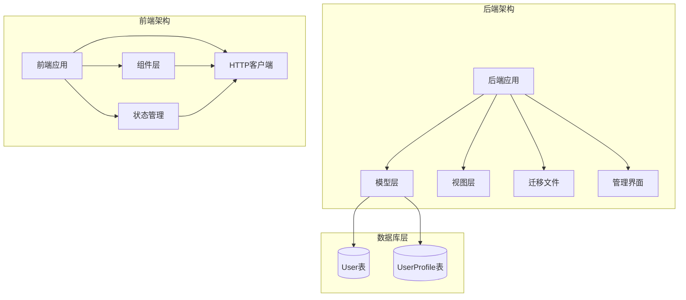
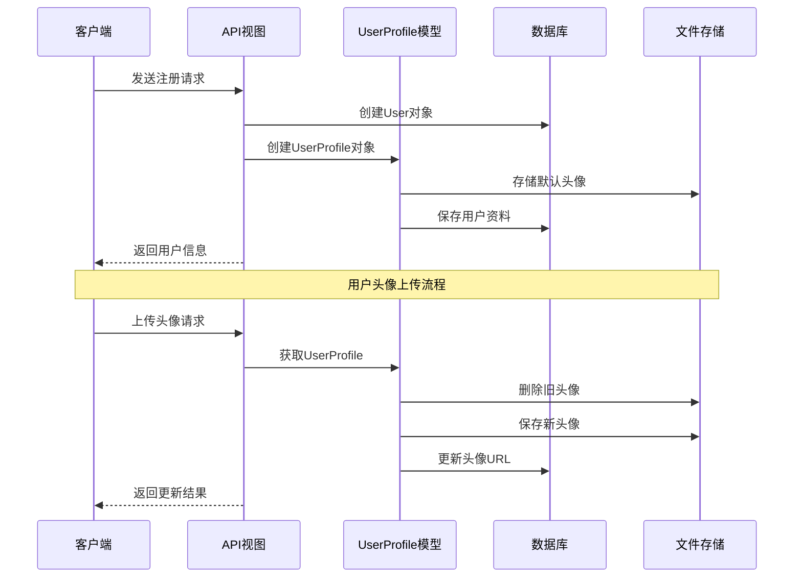
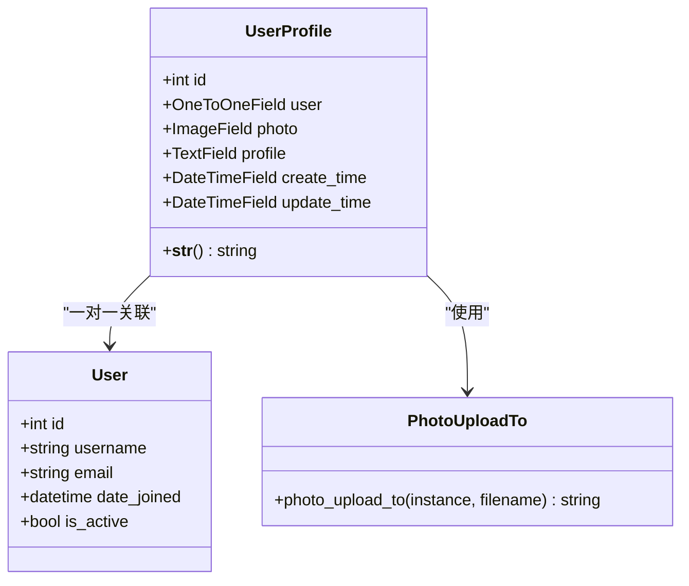
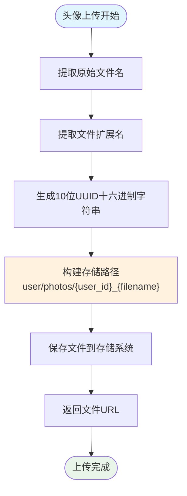
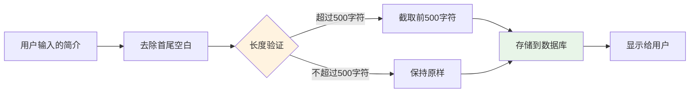
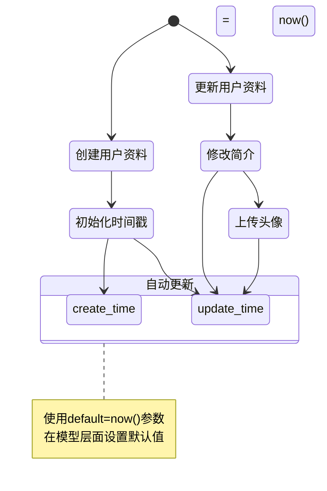
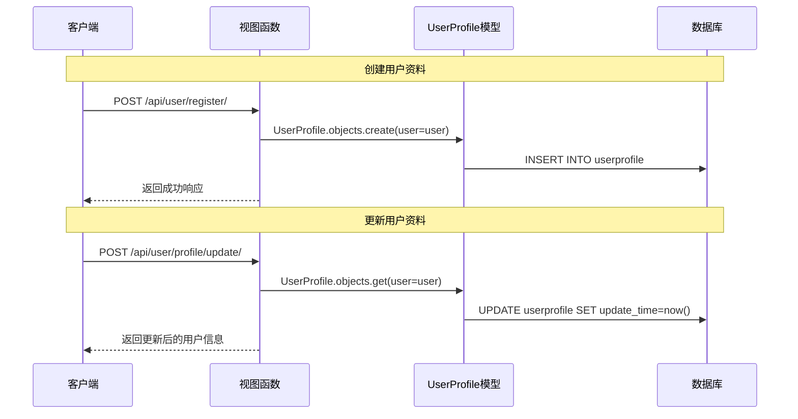
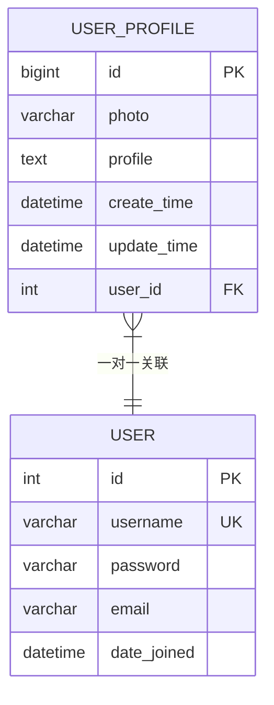
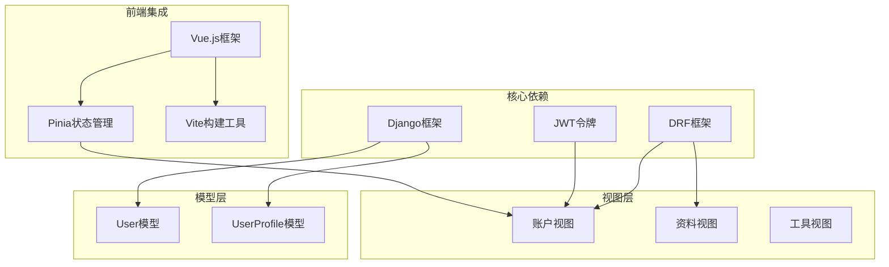
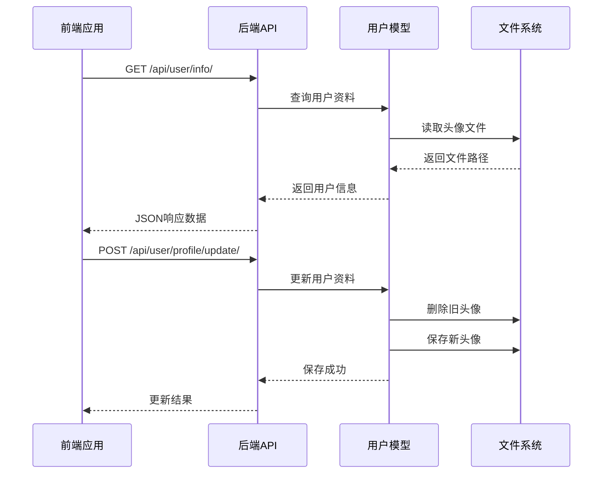

# 用户模型设计

<cite>
**本文档引用的文件**
- [user.py](file://backend/web/models/user.py)
- [0001_initial.py](file://backend/web/migrations/0001_initial.py)
- [photo.py](file://backend/web/views/utils/photo.py)
- [get_user_info.py](file://backend/web/views/user/account/get_user_info.py)
- [update.py](file://backend/web/views/user/profile/update.py)
- [register.py](file://backend/web/views/user/account/register.py)
- [login.py](file://backend/web/views/user/account/login.py)
- [admin.py](file://backend/web/admin.py)
- [apps.py](file://backend/web/apps.py)
- [ProfileIndex.vue](file://frontend/src/views/user/profile/ProfileIndex.vue)
- [user.js](file://frontend/src/stores/user.js)
</cite>

## 目录
1. [简介](#简介)
2. [项目结构](#项目结构)
3. [核心组件](#核心组件)
4. [架构概览](#架构概览)
5. [详细组件分析](#详细组件分析)
6. [依赖关系分析](#依赖关系分析)
7. [性能考虑](#性能考虑)
8. [故障排除指南](#故障排除指南)
9. [结论](#结论)

## 简介

本文件详细阐述了基于Django框架构建的用户模型设计，重点分析UserProfile模型的数据库结构设计、OneToOneField关联机制、头像上传路径生成策略、用户简介字段设计以及时间戳字段的自动管理机制。该设计采用简洁高效的架构模式，确保用户数据的一致性和可维护性。

## 项目结构

该项目采用Django标准的三层架构设计，主要分为后端Web应用和前端Vue.js应用两大部分：

**图表来源**
- [user.py:15-23](file://backend/web/models/user.py#L15-L23)
- [0001_initial.py:18-29](file://backend/web/migrations/0001_initial.py#L18-L29)

**章节来源**
- [user.py:1-23](file://backend/web/models/user.py#L1-L23)
- [apps.py:4-6](file://backend/web/apps.py#L4-L6)

## 核心组件

### UserProfile模型概述

UserProfile模型作为User模型的扩展，提供了用户个人资料管理功能。该模型继承自Django的models.Model基类，通过OneToOneField与内置的User模型建立一对一关联关系。

### 数据库字段设计

模型包含以下核心字段：

| 字段名称 | 数据类型 | 默认值 | 约束条件 | 描述 |
|---------|---------|--------|----------|------|
| user | OneToOneField | - | CASCADE删除 | 与User模型的一对一关联 |
| photo | ImageField | 'user/photos/default.png' | upload_to函数 | 用户头像存储字段 |
| profile | TextField | "谢谢你的关注" | max_length=500 | 用户个人简介 |
| create_time | DateTimeField | now() | default设置 | 用户资料创建时间 |
| update_time | DateTimeField | now() | default设置 | 用户资料最后更新时间 |

**章节来源**
- [user.py:15-23](file://backend/web/models/user.py#L15-L23)
- [0001_initial.py:21-26](file://backend/web/migrations/0001_initial.py#L21-L26)

## 架构概览

用户模型采用分层架构设计，实现了清晰的关注点分离：

**图表来源**
- [register.py:24-25](file://backend/web/views/user/account/register.py#L24-L25)
- [update.py:39-48](file://backend/web/views/user/profile/update.py#L39-L48)

## 详细组件分析

### OneToOneField关联机制

UserProfile模型通过OneToOneField与Django内置的User模型建立了强关联关系：

**图表来源**
- [user.py:15-23](file://backend/web/models/user.py#L15-L23)
- [user.py:10-13](file://backend/web/models/user.py#L10-L13)

#### 关联实现原理

1. **CASCADE删除策略**：当User对象被删除时，对应的UserProfile对象也会自动删除
2. **唯一性保证**：每个User只能对应一个UserProfile实例
3. **反向访问**：可以通过`user.userprofile`访问UserProfile对象

**章节来源**
- [user.py:16](file://backend/web/models/user.py#L16)
- [0001_initial.py:26](file://backend/web/migrations/0001_initial.py#L26)

### 头像上传路径动态生成机制

头像上传路径采用动态生成策略，确保文件存储的组织性和安全性：

**图表来源**
- [user.py:10-13](file://backend/web/models/user.py#L10-L13)

#### 文件命名策略

1. **UUID去重**：使用10位UUID十六进制字符串确保文件名唯一性
2. **扩展名保留**：保持原始文件的扩展名不变
3. **路径组织**：按用户ID组织文件夹结构，便于管理和清理

**章节来源**
- [user.py:10-13](file://backend/web/models/user.py#L10-L13)
- [photo.py:9-13](file://backend/web/views/utils/photo.py#L9-L13)

### 用户简介字段设计

简介字段采用TextField类型，具有以下设计特点：

**图表来源**
- [update.py:21-22](file://backend/web/views/user/profile/update.py#L21-L22)

#### 设计考虑因素

1. **长度限制**：最大500字符，平衡信息丰富度和存储效率
2. **内容净化**：自动去除首尾空白字符
3. **安全防护**：前后端双重验证，防止恶意输入

**章节来源**
- [user.py:18](file://backend/web/models/user.py#L18)
- [update.py:21-38](file://backend/web/views/user/profile/update.py#L21-L38)

### 时间戳字段自动管理机制

系统实现了完整的自动时间戳管理：

**图表来源**
- [user.py:19-20](file://backend/web/models/user.py#L19-L20)

#### 自动管理特性

1. **创建时间**：用户资料创建时自动设置当前时间
2. **更新时间**：每次资料更新时自动刷新时间戳
3. **时区处理**：使用Django的timezone.now()确保时区一致性

**章节来源**
- [user.py:19-20](file://backend/web/models/user.py#L19-L20)

### 模型使用示例和最佳实践

#### 基本CRUD操作

**图表来源**
- [register.py:25](file://backend/web/views/user/account/register.py#L25)
- [update.py:19-48](file://backend/web/views/user/profile/update.py#L19-L48)

#### 最佳实践建议

1. **数据验证**：始终进行前后端双重验证
2. **错误处理**：使用try-catch块处理可能的异常
3. **资源清理**：及时删除旧的头像文件
4. **权限控制**：确保只有认证用户才能访问

**章节来源**
- [get_user_info.py:8-24](file://backend/web/views/user/account/get_user_info.py#L8-L24)
- [update.py:12-62](file://backend/web/views/user/profile/update.py#L12-L62)

### 数据库迁移文件分析

#### 初始迁移文件结构

迁移文件定义了UserProfile模型的完整数据库结构：

**图表来源**
- [0001_initial.py:18-29](file://backend/web/migrations/0001_initial.py#L18-L29)

#### 迁移演进历史

当前项目仅包含初始迁移文件，表明用户模型设计相对稳定。未来可能的演进方向：

1. **索引优化**：为常用查询字段添加数据库索引
2. **字段扩展**：根据业务需求添加新的用户属性
3. **数据迁移**：从现有数据中填充默认值

**章节来源**
- [0001_initial.py:9-29](file://backend/web/migrations/0001_initial.py#L9-L29)

## 依赖关系分析

### 后端依赖关系

**图表来源**
- [user.py:4-6](file://backend/web/models/user.py#L4-L6)
- [register.py:1-6](file://backend/web/views/user/account/register.py#L1-L6)

### 前后端交互流程

**图表来源**
- [get_user_info.py:10-20](file://backend/web/views/user/account/get_user_info.py#L10-L20)
- [update.py:39-57](file://backend/web/views/user/profile/update.py#L39-L57)

**章节来源**
- [admin.py:6-9](file://backend/web/admin.py#L6-L9)
- [user.js:26-31](file://frontend/src/stores/user.js#L26-L31)

## 性能考虑

### 数据库优化策略

1. **索引设计**：考虑为user_id字段添加索引以优化查询性能
2. **缓存机制**：实现用户资料的Redis缓存减少数据库查询
3. **批量操作**：对于大量用户数据的处理采用批量操作

### 文件存储优化

1. **CDN集成**：将头像文件存储在CDN上提高加载速度
2. **压缩处理**：对上传的图片进行压缩处理减小存储空间
3. **清理策略**：定期清理未使用的旧头像文件释放存储空间

### 前后端性能优化

1. **懒加载**：前端采用懒加载策略延迟加载用户头像
2. **状态缓存**：使用Pinia缓存用户状态避免重复请求
3. **错误边界**：实现错误边界处理提升用户体验

## 故障排除指南

### 常见问题及解决方案

#### 头像上传失败

**问题症状**：
- 上传头像后无法显示
- 控制台出现文件路径错误

**解决步骤**：
1. 检查MEDIA_ROOT配置是否正确
2. 验证文件权限设置
3. 确认upload_to函数返回的路径格式正确

**章节来源**
- [photo.py:9-13](file://backend/web/views/utils/photo.py#L9-L13)

#### 用户名重复错误

**问题症状**：
- 注册时提示用户名已存在
- 登录时认证失败

**解决步骤**：
1. 检查用户名唯一性验证逻辑
2. 清理数据库中的重复用户名
3. 实现用户名冲突检测机制

#### 权限认证问题

**问题症状**：
- 401未授权错误
- JWT令牌无效

**解决步骤**：
1. 验证JWT令牌生成和验证流程
2. 检查Cookie配置和安全设置
3. 确认权限装饰器正确应用

**章节来源**
- [login.py:20-39](file://backend/web/views/user/account/login.py#L20-L39)
- [get_user_info.py:9](file://backend/web/views/user/account/get_user_info.py#L9)

### 调试技巧

1. **日志记录**：启用Django日志记录功能
2. **数据库查询**：使用Django Debug Toolbar监控SQL查询
3. **前端调试**：利用浏览器开发者工具检查API响应
4. **单元测试**：编写测试用例验证模型行为

## 结论

用户模型设计采用了简洁而高效的技术方案，成功实现了用户资料管理的核心功能。该设计的主要优势包括：

1. **架构清晰**：采用分层架构，职责分离明确
2. **扩展性强**：OneToOneField设计便于后续功能扩展
3. **安全性高**：前后端双重验证机制保障数据安全
4. **性能优化**：合理的文件存储策略和缓存机制

未来可以考虑的改进方向：
- 添加更多的用户属性字段
- 实现更完善的权限控制系统
- 集成第三方认证服务
- 优化文件存储和CDN集成

该用户模型设计为整个应用提供了坚实的数据基础，为后续的功能开发奠定了良好的技术基础。