# 用户认证系统

<cite>
**本文引用的文件**
- [backend/web/models/user.py](file://backend/web/models/user.py)
- [backend/web/views/user/account/login.py](file://backend/web/views/user/account/login.py)
- [backend/web/views/user/account/register.py](file://backend/web/views/user/account/register.py)
- [backend/web/views/user/account/refresh_token.py](file://backend/web/views/user/account/refresh_token.py)
- [backend/web/views/user/account/logout.py](file://backend/web/views/user/account/logout.py)
- [backend/web/views/user/account/get_user_info.py](file://backend/web/views/user/account/get_user_info.py)
- [backend/web/views/user/profile/update.py](file://backend/web/views/user/profile/update.py)
- [backend/web/urls.py](file://backend/web/urls.py)
- [backend/backend/settings.py](file://backend/backend/settings.py)
- [frontend/src/js/http/api.js](file://frontend/src/js/http/api.js)
- [frontend/src/stores/user.js](file://frontend/src/stores/user.js)
- [frontend/src/views/user/account/LoginIndex.vue](file://frontend/src/views/user/account/LoginIndex.vue)
- [frontend/src/views/user/account/RegisterIndex.vue](file://frontend/src/views/user/account/RegisterIndex.vue)
- [frontend/src/router/index.js](file://frontend/src/router/index.js)
</cite>

## 目录
1. [简介](#简介)
2. [项目结构](#项目结构)
3. [核心组件](#核心组件)
4. [架构总览](#架构总览)
5. [详细组件分析](#详细组件分析)
6. [依赖分析](#依赖分析)
7. [性能考虑](#性能考虑)
8. [故障排查指南](#故障排查指南)
9. [结论](#结论)
10. [附录](#附录)

## 简介
本文件面向“用户认证系统”的整体设计与实现，覆盖用户模型、JWT 令牌生成与管理、会话状态维护、登录与注册流程、令牌刷新机制、认证中间件原理与使用、错误处理、安全策略与性能优化建议。系统采用 Django + Django REST Framework + Django REST Framework SimpleJWT 实现后端认证，Vue + Pinia + Axios 构建前端交互与自动刷新。

## 项目结构
后端采用分层组织：应用层负责视图与路由，模型层负责用户扩展资料，前端通过 HTTP 拦截器统一注入 Authorization 头并在 401 时自动刷新令牌。

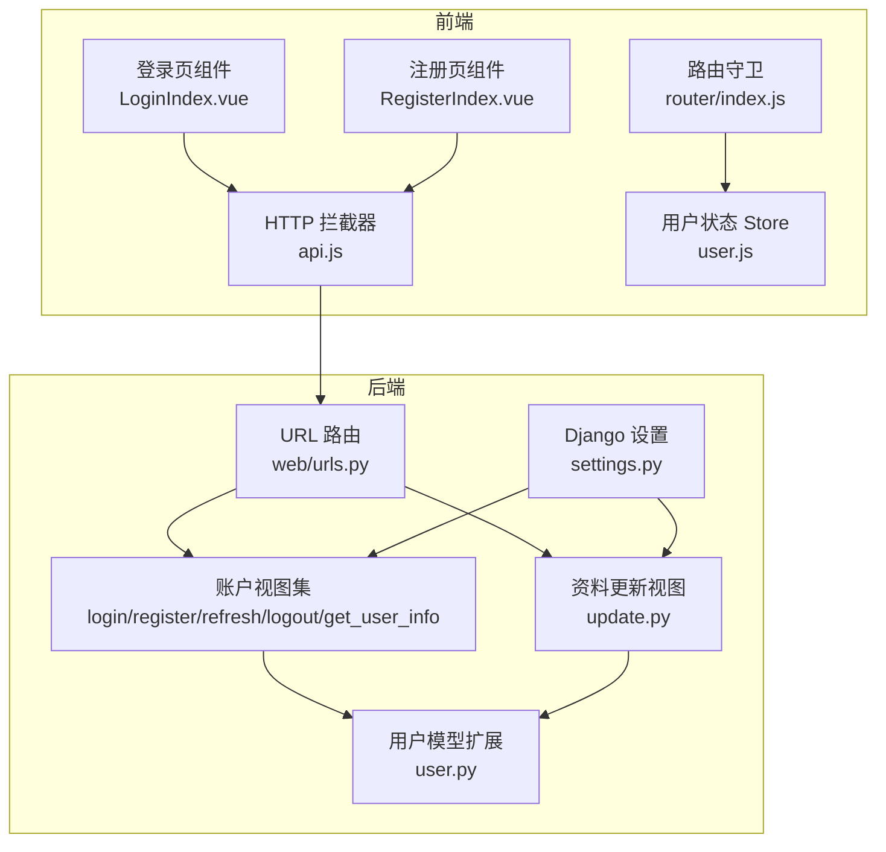

图表来源
- [frontend/src/js/http/api.js:1-92](file://frontend/src/js/http/api.js#L1-L92)
- [frontend/src/stores/user.js:1-59](file://frontend/src/stores/user.js#L1-L59)
- [frontend/src/views/user/account/LoginIndex.vue:1-69](file://frontend/src/views/user/account/LoginIndex.vue#L1-L69)
- [frontend/src/views/user/account/RegisterIndex.vue:1-76](file://frontend/src/views/user/account/RegisterIndex.vue#L1-L76)
- [frontend/src/router/index.js:1-104](file://frontend/src/router/index.js#L1-L104)
- [backend/backend/settings.py:133-151](file://backend/backend/settings.py#L133-L151)
- [backend/web/urls.py:1-24](file://backend/web/urls.py#L1-L24)
- [backend/web/views/user/account/login.py:1-92](file://backend/web/views/user/account/login.py#L1-L92)
- [backend/web/views/user/account/register.py:1-46](file://backend/web/views/user/account/register.py#L1-L46)
- [backend/web/views/user/account/refresh_token.py:1-41](file://backend/web/views/user/account/refresh_token.py#L1-L41)
- [backend/web/views/user/account/logout.py:1-16](file://backend/web/views/user/account/logout.py#L1-L16)
- [backend/web/views/user/account/get_user_info.py:1-25](file://backend/web/views/user/account/get_user_info.py#L1-L25)
- [backend/web/views/user/profile/update.py:1-63](file://backend/web/views/user/profile/update.py#L1-L63)
- [backend/web/models/user.py:1-23](file://backend/web/models/user.py#L1-L23)

章节来源
- [backend/web/urls.py:1-24](file://backend/web/urls.py#L1-L24)
- [backend/backend/settings.py:133-151](file://backend/backend/settings.py#L133-L151)

## 核心组件
- 用户模型扩展：UserProfile 关联 Django 内置 User，扩展头像、简介、创建/更新时间等字段，并提供图片上传路径规则。
- 认证视图：
  - 登录：校验凭据、签发 JWT 并设置 HttpOnly Cookie。
  - 注册：用户名唯一性校验、创建用户与用户资料、签发 JWT 并设置 Cookie。
  - 刷新：从 Cookie 读取 refresh_token，必要时轮换并刷新 access_token。
  - 登出：删除 refresh_token Cookie。
  - 获取用户信息：基于已认证用户返回基础资料。
- 前端：
  - HTTP 拦截器：统一注入 Authorization 头，拦截 401 自动刷新 access_token。
  - 用户状态 Store：持久化用户登录态与资料。
  - 登录/注册组件：表单校验与提交。
  - 路由守卫：根据 meta.needLogin 控制访问权限。

章节来源
- [backend/web/models/user.py:15-23](file://backend/web/models/user.py#L15-L23)
- [backend/web/views/user/account/login.py:9-46](file://backend/web/views/user/account/login.py#L9-L46)
- [backend/web/views/user/account/register.py:9-42](file://backend/web/views/user/account/register.py#L9-L42)
- [backend/web/views/user/account/refresh_token.py:7-36](file://backend/web/views/user/account/refresh_token.py#L7-L36)
- [backend/web/views/user/account/logout.py:7-16](file://backend/web/views/user/account/logout.py#L7-L16)
- [backend/web/views/user/account/get_user_info.py:8-24](file://backend/web/views/user/account/get_user_info.py#L8-L24)
- [frontend/src/js/http/api.js:10-92](file://frontend/src/js/http/api.js#L10-L92)
- [frontend/src/stores/user.js:1-59](file://frontend/src/stores/user.js#L1-L59)
- [frontend/src/views/user/account/LoginIndex.vue:1-69](file://frontend/src/views/user/account/LoginIndex.vue#L1-L69)
- [frontend/src/views/user/account/RegisterIndex.vue:1-76](file://frontend/src/views/user/account/RegisterIndex.vue#L1-L76)
- [frontend/src/router/index.js:92-101](file://frontend/src/router/index.js#L92-L101)

## 架构总览
系统采用“Cookie + JWT”方案：后端通过 SimpleJWT 生成 access_token 与 refresh_token，access_token 通过请求头携带，refresh_token 通过 HttpOnly Cookie 存储，前端拦截器在 401 时自动刷新 access_token 并重试原请求。

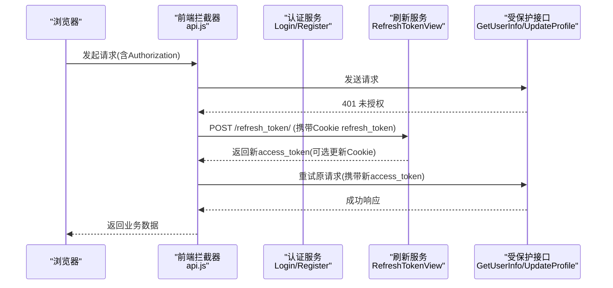

图表来源
- [frontend/src/js/http/api.js:46-90](file://frontend/src/js/http/api.js#L46-L90)
- [backend/web/views/user/account/refresh_token.py:7-36](file://backend/web/views/user/account/refresh_token.py#L7-L36)
- [backend/web/views/user/account/get_user_info.py:8-24](file://backend/web/views/user/account/get_user_info.py#L8-L24)

## 详细组件分析

### 用户模型设计
- 继承关系：UserProfile 一对一关联 Django User。
- 字段要点：头像 ImageField（默认值与上传路径）、简介文本、创建/更新时间。
- 图片上传命名：使用随机十六进制串作为文件名，避免冲突并便于检索。

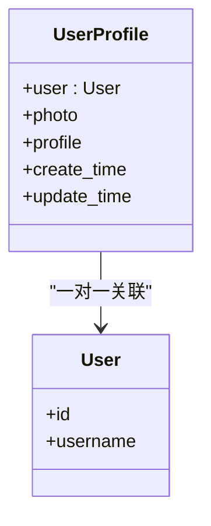

图表来源
- [backend/web/models/user.py:15-23](file://backend/web/models/user.py#L15-L23)

章节来源
- [backend/web/models/user.py:15-23](file://backend/web/models/user.py#L15-L23)

### 登录流程
- 输入校验：用户名与密码非空。
- 凭据验证：authenticate 校验成功后获取用户资料。
- 令牌签发：为用户生成 RefreshToken，提取 access_token。
- 响应返回：返回用户基础信息与 access_token，并设置 HttpOnly refresh_token Cookie（安全、同站策略、有效期）。

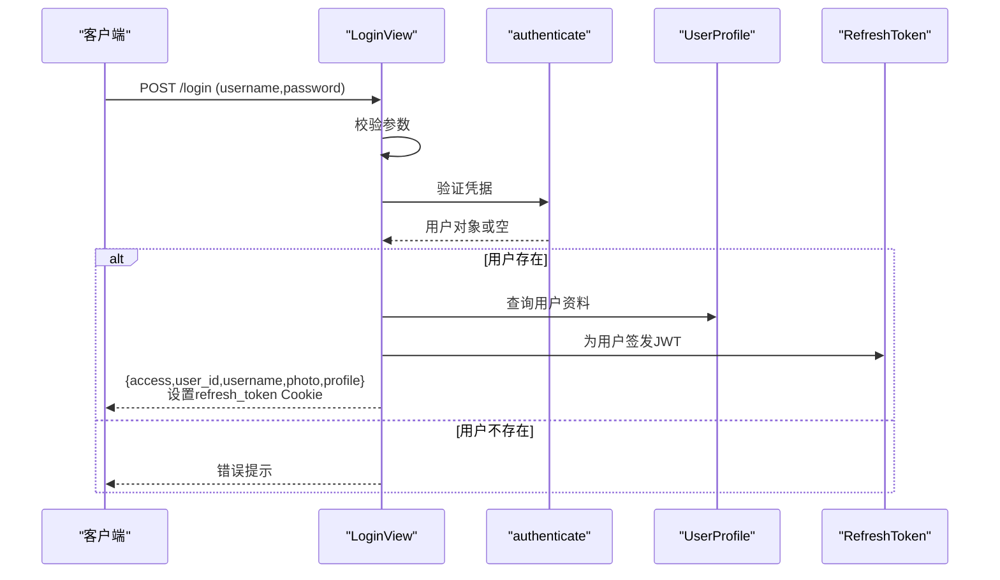

图表来源
- [backend/web/views/user/account/login.py:9-46](file://backend/web/views/user/account/login.py#L9-L46)

章节来源
- [backend/web/views/user/account/login.py:9-46](file://backend/web/views/user/account/login.py#L9-L46)

### 注册流程
- 输入校验：用户名与密码非空。
- 唯一性校验：用户名不可重复。
- 账户创建：使用 create_user 创建 Django User。
- 资料初始化：创建 UserProfile 默认记录。
- 令牌签发：签发 JWT 并设置 refresh_token Cookie。
- 响应返回：返回用户基础信息与 access_token。

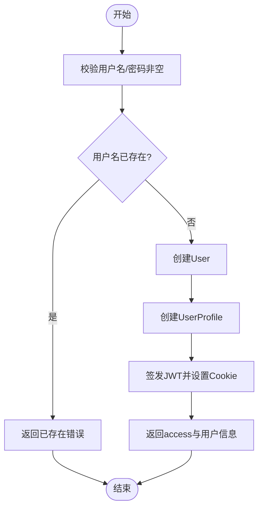

图表来源
- [backend/web/views/user/account/register.py:9-42](file://backend/web/views/user/account/register.py#L9-L42)

章节来源
- [backend/web/views/user/account/register.py:9-42](file://backend/web/views/user/account/register.py#L9-L42)

### 令牌刷新机制与安全策略
- 刷新入口：POST /refresh_token/，从 Cookie 读取 refresh_token。
- 有效性校验：SimpleJWT 自动校验 refresh_token 是否过期。
- 轮换策略：若开启 ROTATE_REFRESH_TOKENS，则刷新后更新 jti 并可选择加入黑名单。
- 响应行为：返回新的 access_token；如轮换则更新 refresh_token Cookie。
- 安全配置：ACCESS_TOKEN_LIFETIME 2 小时，REFRESH_TOKEN_LIFETIME 7 天，仅允许 Bearer 头部类型。

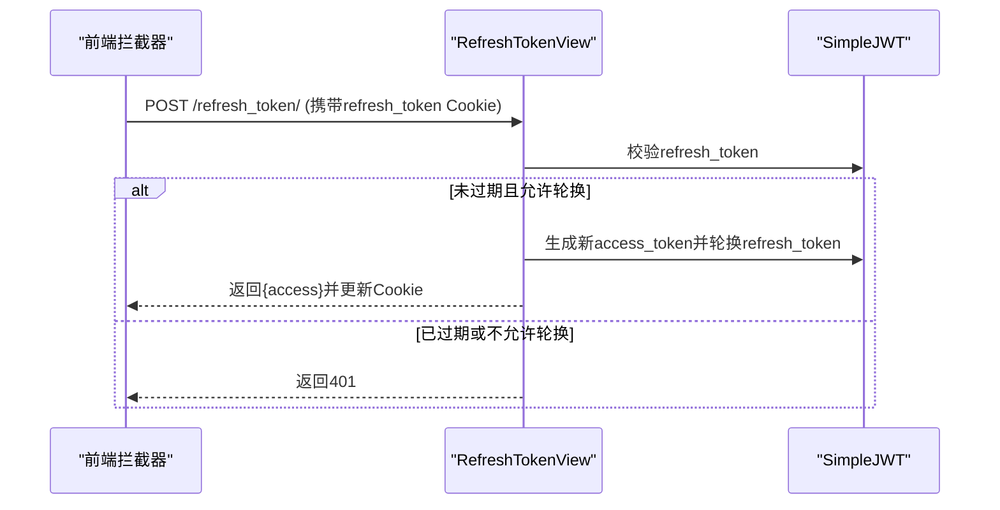

图表来源
- [backend/web/views/user/account/refresh_token.py:7-36](file://backend/web/views/user/account/refresh_token.py#L7-L36)
- [backend/backend/settings.py:142-151](file://backend/backend/settings.py#L142-L151)

章节来源
- [backend/web/views/user/account/refresh_token.py:7-36](file://backend/web/views/user/account/refresh_token.py#L7-L36)
- [backend/backend/settings.py:142-151](file://backend/backend/settings.py#L142-L151)

### 会话状态维护与登出
- 登出：强制已认证访问，删除 refresh_token Cookie，使后续请求无法刷新 access_token。
- 前端状态：调用 Store 清除本地用户信息与 access_token。

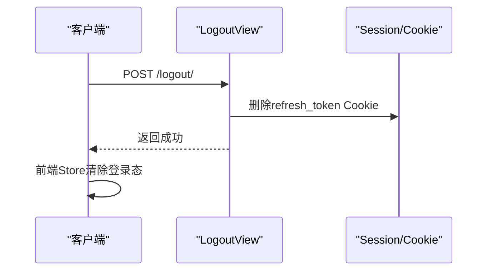

图表来源
- [backend/web/views/user/account/logout.py:7-16](file://backend/web/views/user/account/logout.py#L7-L16)
- [frontend/src/stores/user.js:33-39](file://frontend/src/stores/user.js#L33-L39)

章节来源
- [backend/web/views/user/account/logout.py:7-16](file://backend/web/views/user/account/logout.py#L7-L16)
- [frontend/src/stores/user.js:33-39](file://frontend/src/stores/user.js#L33-L39)

### 认证中间件与权限控制
- 中间件链：CORS、会话、CSRF、认证、消息等按序加载。
- 默认认证类：REST_FRAMEWORK 使用 SimpleJWT 的 JWTAuthentication。
- 视图权限：部分视图使用 IsAuthenticated 限制访问。

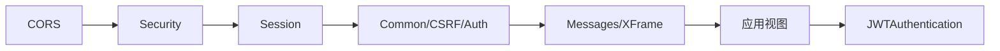

图表来源
- [backend/backend/settings.py:45-54](file://backend/backend/settings.py#L45-L54)
- [backend/backend/settings.py:136-140](file://backend/backend/settings.py#L136-L140)
- [backend/web/views/user/account/get_user_info.py:8-9](file://backend/web/views/user/account/get_user_info.py#L8-L9)

章节来源
- [backend/backend/settings.py:45-54](file://backend/backend/settings.py#L45-L54)
- [backend/backend/settings.py:136-140](file://backend/backend/settings.py#L136-L140)
- [backend/web/views/user/account/get_user_info.py:8-9](file://backend/web/views/user/account/get_user_info.py#L8-L9)

### 前端认证集成与路由守卫
- 请求拦截：统一注入 Authorization: Bearer <access_token>。
- 401 自动刷新：拦截 401 后用 refresh_token 刷新 access_token，重试原请求。
- 登录/注册：提交表单后写入 Store 并跳转首页。
- 路由守卫：meta.needLogin 为真时，若未登录则重定向至登录页。

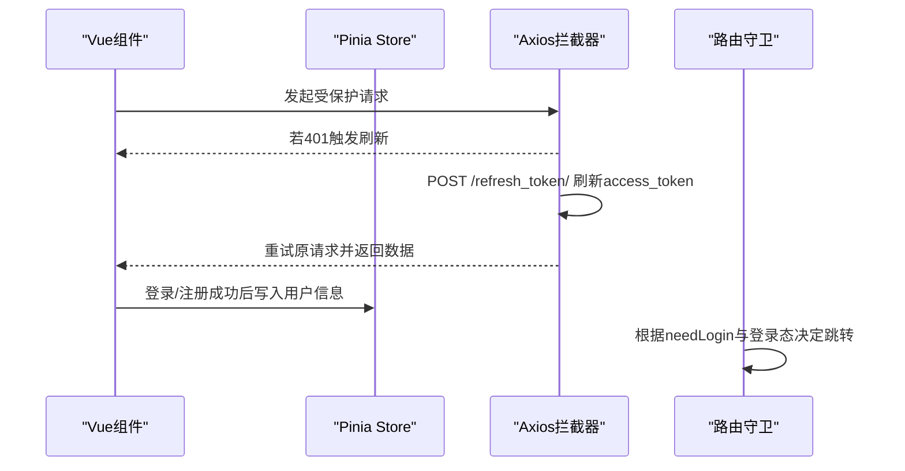

图表来源
- [frontend/src/js/http/api.js:10-92](file://frontend/src/js/http/api.js#L10-L92)
- [frontend/src/views/user/account/LoginIndex.vue:15-41](file://frontend/src/views/user/account/LoginIndex.vue#L15-L41)
- [frontend/src/views/user/account/RegisterIndex.vue:16-45](file://frontend/src/views/user/account/RegisterIndex.vue#L16-L45)
- [frontend/src/router/index.js:92-101](file://frontend/src/router/index.js#L92-L101)

章节来源
- [frontend/src/js/http/api.js:10-92](file://frontend/src/js/http/api.js#L10-L92)
- [frontend/src/views/user/account/LoginIndex.vue:15-41](file://frontend/src/views/user/account/LoginIndex.vue#L15-L41)
- [frontend/src/views/user/account/RegisterIndex.vue:16-45](file://frontend/src/views/user/account/RegisterIndex.vue#L16-L45)
- [frontend/src/router/index.js:92-101](file://frontend/src/router/index.js#L92-L101)

### 资料更新与安全校验
- 权限：仅认证用户可访问。
- 校验：用户名非空且唯一；简介非空且截断至最大长度；可选上传头像并清理旧图。
- 保存：更新 User 与 UserProfile 并返回最新资料。

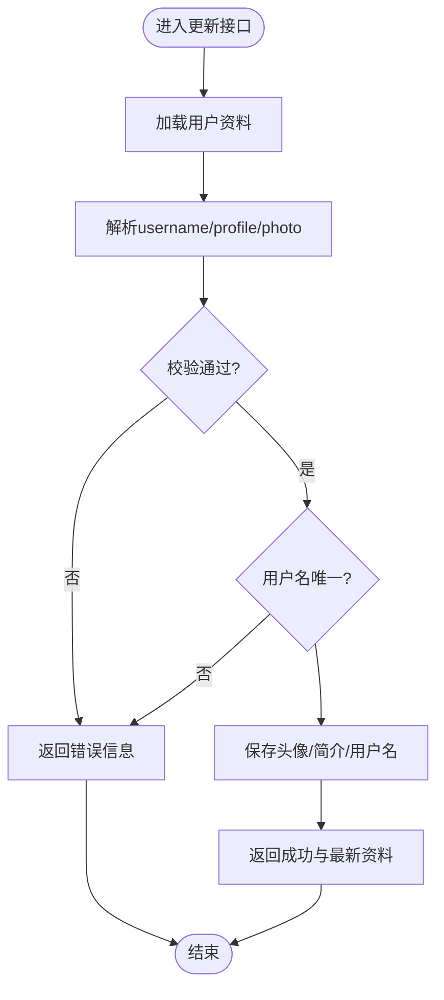

图表来源
- [backend/web/views/user/profile/update.py:12-62](file://backend/web/views/user/profile/update.py#L12-L62)

章节来源
- [backend/web/views/user/profile/update.py:12-62](file://backend/web/views/user/profile/update.py#L12-L62)

## 依赖分析
- 后端依赖：
  - Django + REST Framework + SimpleJWT：提供认证、令牌与路由。
  - CORS：允许前端域名跨域并携带凭证。
- 前端依赖：
  - Axios：HTTP 客户端，配合拦截器实现统一鉴权。
  - Pinia：集中式状态管理。
  - Vue Router：路由守卫与页面导航。

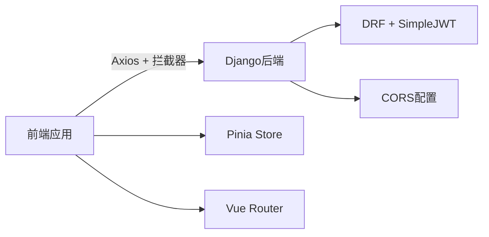

图表来源
- [backend/backend/settings.py:153-158](file://backend/backend/settings.py#L153-L158)
- [frontend/src/js/http/api.js:10-19](file://frontend/src/js/http/api.js#L10-L19)
- [frontend/src/stores/user.js:1-59](file://frontend/src/stores/user.js#L1-L59)
- [frontend/src/router/index.js:1-104](file://frontend/src/router/index.js#L1-L104)

章节来源
- [backend/backend/settings.py:153-158](file://backend/backend/settings.py#L153-L158)
- [frontend/src/js/http/api.js:10-19](file://frontend/src/js/http/api.js#L10-L19)

## 性能考虑
- 令牌生命周期：access_token 短寿命（2 小时）降低泄露风险；refresh_token 长效（7 天）提升体验。
- 轮换与黑名单：开启 ROTATE_REFRESH_TOKENS 与 BLACKLIST_AFTER_ROTATION，可在刷新后使旧 refresh_token 失效，增强安全性。
- 请求去重：前端拦截器中 isRefreshing 与订阅队列避免并发刷新风暴。
- 数据库查询：登录/注册/刷新均只做必要查询，避免 N+1；Profile 更新按需保存。
- 静态资源与媒体：合理配置 MEDIA_URL/MEDIA_ROOT，避免不必要的静态文件扫描。

## 故障排查指南
- 登录失败：
  - 检查用户名/密码非空与正确性。
  - 查看后端返回的错误提示与状态码。
- 401 未授权：
  - 确认前端是否正确注入 Authorization 头。
  - 检查 refresh_token Cookie 是否存在且未过期。
  - 观察后端 SIMPLE_JWT 配置是否启用轮换与黑名单。
- 刷新失败：
  - 确认 Cookie 中 refresh_token 是否被删除或过期。
  - 检查后端刷新视图返回状态与错误信息。
- 资料更新失败：
  - 检查用户名唯一性与简介长度限制。
  - 确认上传头像格式与大小符合预期。

章节来源
- [backend/web/views/user/account/login.py:14-17](file://backend/web/views/user/account/login.py#L14-L17)
- [backend/web/views/user/account/register.py:18-22](file://backend/web/views/user/account/register.py#L18-L22)
- [backend/web/views/user/account/refresh_token.py:10-14](file://backend/web/views/user/account/refresh_token.py#L10-L14)
- [frontend/src/js/http/api.js:46-90](file://frontend/src/js/http/api.js#L46-L90)

## 结论
本认证系统通过“Cookie + JWT”的组合实现了安全、易用的用户认证与会话管理：后端以 SimpleJWT 提供令牌签发与校验，前端以拦截器实现透明刷新与统一鉴权，配合路由守卫与 Pinia Store 形成完整的登录态闭环。通过合理的生命周期与轮换策略，兼顾了安全性与用户体验。

## 附录
- 关键路由映射（后端）
  - 登录：POST /api/user/account/login/
  - 注册：POST /api/user/account/register/
  - 刷新：POST /api/user/account/refresh_token/
  - 登出：POST /api/user/account/logout/
  - 获取用户信息：GET /api/user/account/get_user_info/
  - 更新资料：POST /api/user/profile/update/

章节来源
- [backend/web/urls.py:10-17](file://backend/web/urls.py#L10-L17)