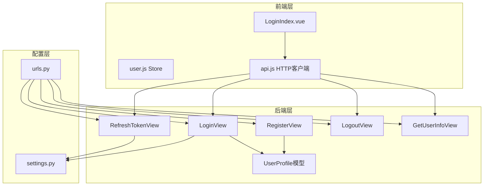
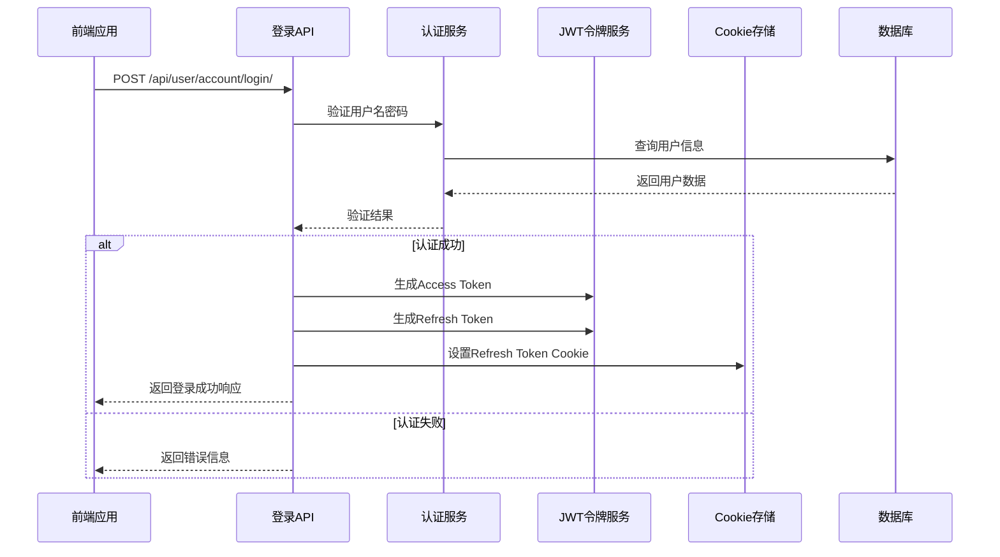
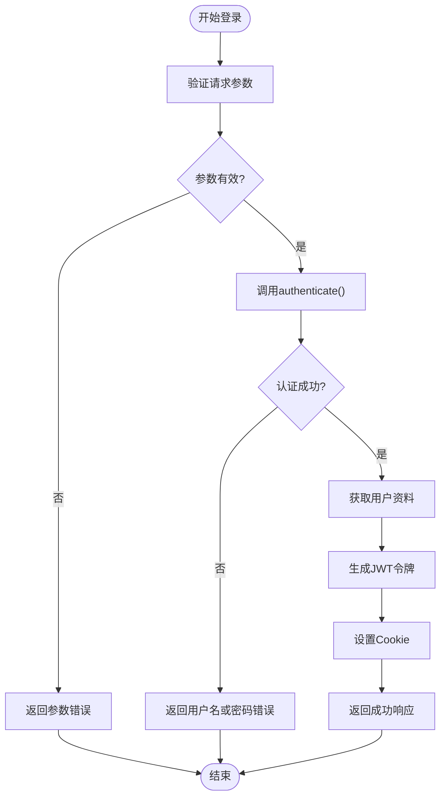
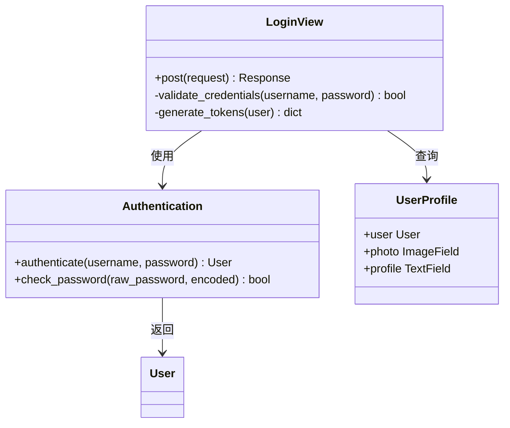
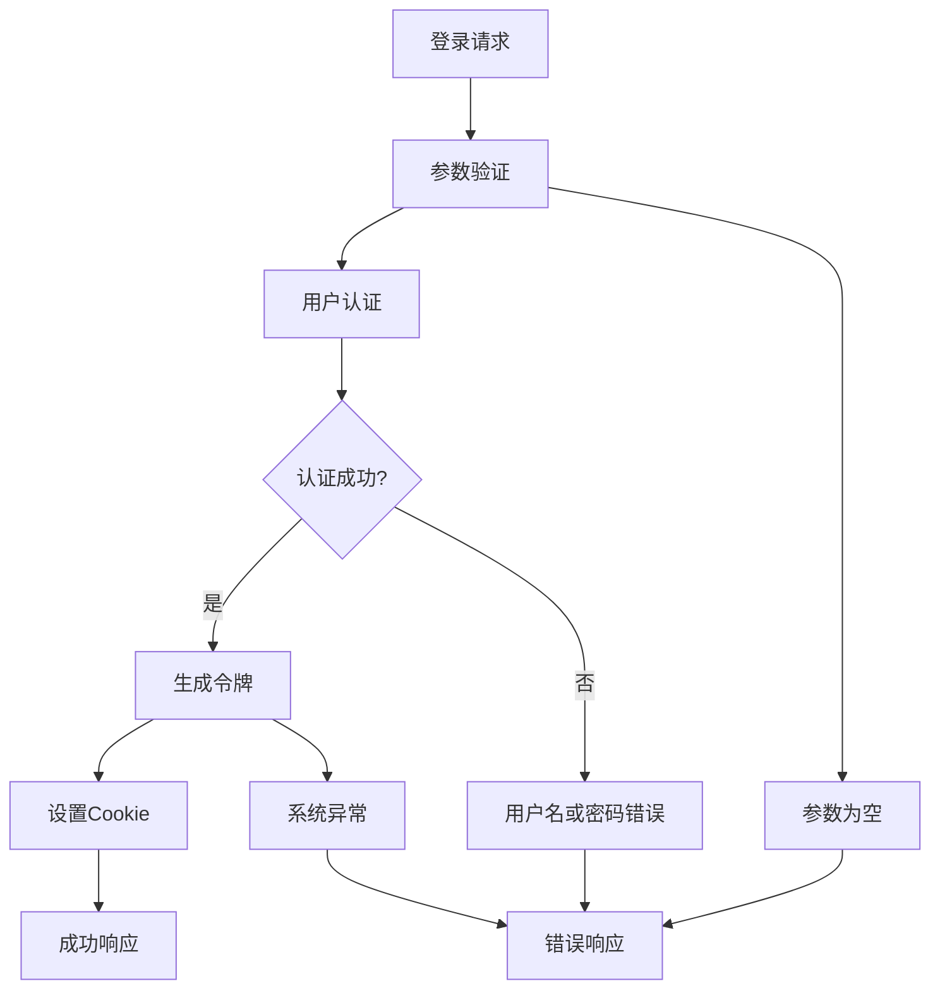
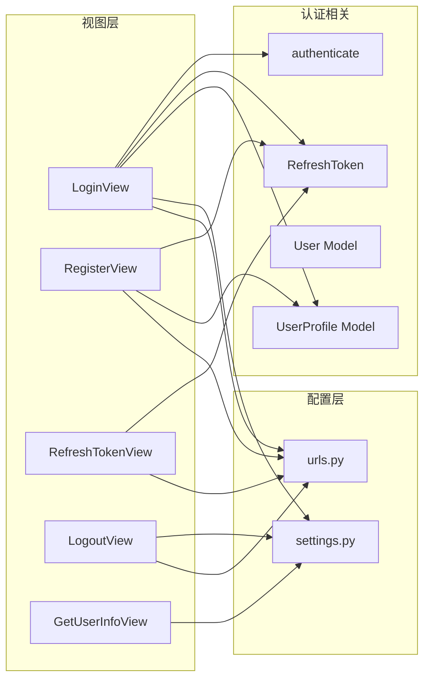

# 登录功能实现

<cite>
**本文档引用的文件**
- [login.py](file://backend/web/views/user/account/login.py)
- [user.py](file://backend/web/models/user.py)
- [register.py](file://backend/web/views/user/account/register.py)
- [get_user_info.py](file://backend/web/views/user/account/get_user_info.py)
- [logout.py](file://backend/web/views/user/account/logout.py)
- [refresh_token.py](file://backend/web/views/user/account/refresh_token.py)
- [urls.py](file://backend/web/urls.py)
- [settings.py](file://backend/backend/settings.py)
- [LoginIndex.vue](file://frontend/src/views/user/account/LoginIndex.vue)
- [user.js](file://frontend/src/stores/user.js)
- [api.js](file://frontend/src/js/http/api.js)
</cite>

## 目录
1. [简介](#简介)
2. [项目结构](#项目结构)
3. [核心组件](#核心组件)
4. [架构概览](#架构概览)
5. [详细组件分析](#详细组件分析)
6. [依赖关系分析](#依赖关系分析)
7. [性能考虑](#性能考虑)
8. [故障排除指南](#故障排除指南)
9. [结论](#结论)

## 简介

本文件详细阐述了基于Django和Vue.js的登录功能实现。该系统采用JWT（JSON Web Token）进行身份认证，结合Django REST Framework和Django Simple JWT库实现完整的用户认证流程。系统支持用户名密码登录、自动令牌刷新、会话管理和安全防护机制。

## 项目结构

登录功能涉及前后端分离架构，主要包含以下组件：

**图表来源**
- [login.py:1-92](file://backend/web/views/user/account/login.py#L1-L92)
- [urls.py:1-24](file://backend/web/urls.py#L1-L24)
- [settings.py:136-151](file://backend/backend/settings.py#L136-L151)

**章节来源**
- [urls.py:10-23](file://backend/web/urls.py#L10-L23)
- [settings.py:136-151](file://backend/backend/settings.py#L136-L151)

## 核心组件

### 登录视图组件

登录功能的核心实现位于`LoginView`类中，负责处理用户认证请求并生成相应的响应。

**章节来源**
- [login.py:9-46](file://backend/web/views/user/account/login.py#L9-L46)

### 用户资料模型

`UserProfile`模型扩展了Django默认的User模型，存储额外的用户信息如头像和简介。

**章节来源**
- [user.py:15-23](file://backend/web/models/user.py#L15-L23)

### JWT配置管理

系统通过Django Simple JWT库实现JWT令牌的生成、验证和刷新机制。

**章节来源**
- [settings.py:143-151](file://backend/backend/settings.py#L143-L151)

## 架构概览

登录系统的整体架构采用分层设计，确保了良好的可维护性和安全性：

**图表来源**
- [login.py:10-46](file://backend/web/views/user/account/login.py#L10-L46)
- [settings.py:143-151](file://backend/backend/settings.py#L143-L151)

## 详细组件分析

### 登录流程实现

#### 请求参数验证

登录流程首先进行参数验证，确保用户名和密码都不为空：

**图表来源**
- [login.py:12-46](file://backend/web/views/user/account/login.py#L12-L46)

#### 用户凭据检查机制

系统使用Django的`authenticate()`函数进行用户凭据验证，该函数会：
- 检查用户名是否存在
- 验证密码是否正确
- 返回对应的用户对象或None

**章节来源**
- [login.py:18-20](file://backend/web/views/user/account/login.py#L18-L20)

#### 密码解密过程

密码验证通过Django的认证系统自动完成，无需手动解密：

**图表来源**
- [login.py:1-6](file://backend/web/views/user/account/login.py#L1-L6)
- [user.py:15-23](file://backend/web/models/user.py#L15-L23)

### JWT令牌生成机制

#### Access Token生成

系统为每个成功登录的用户生成短期有效的Access Token：

**章节来源**
- [login.py:22-25](file://backend/web/views/user/account/login.py#L22-L25)
- [settings.py](file://backend/backend/settings.py#L144)

#### Refresh Token生成与存储

Refresh Token用于刷新Access Token，具有较长的有效期：

**章节来源**
- [login.py:22-38](file://backend/web/views/user/account/login.py#L22-L38)
- [settings.py](file://backend/backend/settings.py#L145)

#### Cookie配置策略

Refresh Token通过安全的Cookie存储，包含多种安全属性：

**章节来源**
- [login.py:31-38](file://backend/web/views/user/account/login.py#L31-L38)

### 登录响应格式

成功的登录响应包含以下字段：

| 字段名 | 类型 | 描述 | 示例值 |
|--------|------|------|--------|
| result | string | 操作结果状态 | "success" |
| access | string | JWT访问令牌 | "eyJhbGciOiJIUzI1..." |
| user_id | integer | 用户唯一标识符 | 123 |
| username | string | 用户名 | "john_doe" |
| photo | string | 用户头像URL | "/media/user/photos/..." |
| profile | string | 用户简介 | "谢谢你的关注" |

**章节来源**
- [login.py:23-30](file://backend/web/views/user/account/login.py#L23-L30)

### 错误处理与异常情况

系统实现了多层次的错误处理机制：

**图表来源**
- [login.py:14-46](file://backend/web/views/user/account/login.py#L14-L46)

**章节来源**
- [login.py:14-46](file://backend/web/views/user/account/login.py#L14-L46)

### 前端集成实现

#### Vue.js登录组件

前端使用Vue.js实现登录界面，包含表单验证和错误处理：

**章节来源**
- [LoginIndex.vue:15-41](file://frontend/src/views/user/account/LoginIndex.vue#L15-L41)

#### Pinia状态管理

用户状态通过Pinia进行集中管理，包括访问令牌和用户信息：

**章节来源**
- [user.js:22-31](file://frontend/src/stores/user.js#L22-L31)

#### Axios拦截器

HTTP客户端实现自动令牌刷新机制：

**章节来源**
- [api.js:46-89](file://frontend/src/js/http/api.js#L46-L89)

### 安全考虑与防护措施

#### 会话安全配置

系统采用多种安全措施保护用户会话：

**章节来源**
- [login.py:34-38](file://backend/web/views/user/account/login.py#L34-L38)
- [settings.py:147-148](file://backend/backend/settings.py#L147-L148)

#### 防暴力破解机制

虽然当前实现未包含专门的防暴力破解逻辑，但可以通过以下方式增强安全性：

1. **速率限制**：在API网关层面实现IP级请求频率限制
2. **账户锁定**：连续失败多次后暂时锁定账户
3. **CAPTCHA验证**：在多次失败后要求验证码验证
4. **日志监控**：记录可疑登录尝试

#### 令牌生命周期管理

系统实现了完整的令牌生命周期管理：

**章节来源**
- [refresh_token.py:19-32](file://backend/web/views/user/account/refresh_token.py#L19-L32)
- [settings.py:144-145](file://backend/backend/settings.py#L144-L145)

## 依赖关系分析

登录功能涉及多个组件间的复杂依赖关系：

**图表来源**
- [login.py:1-6](file://backend/web/views/user/account/login.py#L1-L6)
- [urls.py:10-16](file://backend/web/urls.py#L10-L16)
- [settings.py:136-151](file://backend/backend/settings.py#L136-L151)

**章节来源**
- [login.py:1-6](file://backend/web/views/user/account/login.py#L1-L6)
- [urls.py:10-16](file://backend/web/urls.py#L10-L16)
- [settings.py:136-151](file://backend/backend/settings.py#L136-L151)

## 性能考虑

### 令牌生成性能

JWT令牌生成是一个轻量级操作，通常在毫秒级别完成。Access Token的短期有效期设计有助于减少服务器负载。

### 数据库查询优化

用户资料查询通过`OneToOneField`关联实现，避免了复杂的JOIN操作，提高了查询效率。

### Cookie传输优化

Refresh Token通过Cookie传输，减少了请求头大小，提升了网络传输效率。

## 故障排除指南

### 常见问题诊断

#### 登录失败问题

1. **用户名或密码错误**
   - 检查用户名大小写
   - 确认密码正确性
   - 验证用户是否已激活

2. **系统异常**
   - 查看服务器日志
   - 检查数据库连接
   - 验证JWT配置

#### 令牌过期问题

1. **Access Token过期**
   - 自动触发Refresh Token刷新
   - 检查Cookie设置
   - 验证服务器时间同步

2. **Refresh Token失效**
   - 用户需要重新登录
   - 检查令牌黑名单配置
   - 验证旋转设置

**章节来源**
- [login.py:43-46](file://backend/web/views/user/account/login.py#L43-L46)
- [refresh_token.py:38-41](file://backend/web/views/user/account/refresh_token.py#L38-L41)

### 调试建议

1. **启用详细日志**：在开发环境中启用Django和JWT的详细日志
2. **检查网络请求**：使用浏览器开发者工具查看API请求和响应
3. **验证令牌格式**：确保JWT令牌格式正确且未被篡改
4. **测试边界条件**：验证空参数、特殊字符等边界情况

## 结论

该登录功能实现采用了现代Web应用的最佳实践，结合了Django的强大功能和Vue.js的用户体验优势。系统具备以下特点：

1. **安全性**：采用JWT令牌、HTTPS传输、Cookie安全属性等多重安全措施
2. **可靠性**：完善的错误处理、自动令牌刷新、会话管理
3. **可维护性**：清晰的代码结构、模块化设计、详细的文档
4. **可扩展性**：基于标准协议的架构，便于功能扩展和集成

通过合理的架构设计和安全配置，该登录系统能够满足大多数Web应用的身份认证需求，并为后续的功能扩展奠定了坚实的基础。