# Django项目配置

<cite>
**本文档引用的文件**
- [settings.py](file://backend/backend/settings.py)
- [urls.py](file://backend/backend/urls.py)
- [urls.py](file://backend/web/urls.py)
- [apps.py](file://backend/web/apps.py)
- [user.py](file://backend/web/models/user.py)
- [character.py](file://backend/web/models/character.py)
- [login.py](file://backend/web/views/user/account/login.py)
- [register.py](file://backend/web/views/user/account/register.py)
- [refresh_token.py](file://backend/web/views/user/account/refresh_token.py)
- [logout.py](file://backend/web/views/user/account/logout.py)
- [get_user_info.py](file://backend/web/views/user/account/get_user_info.py)
- [api.js](file://frontend/src/js/http/api.js)
- [vite.config.js](file://frontend/vite.config.js)
</cite>

## 目录
1. [简介](#简介)
2. [项目结构](#项目结构)
3. [核心组件](#核心组件)
4. [架构概览](#架构概览)
5. [详细组件分析](#详细组件分析)
6. [依赖分析](#依赖分析)
7. [性能考虑](#性能考虑)
8. [故障排除指南](#故障排除指南)
9. [结论](#结论)

## 简介

LLM_AIfriends是一个基于Django和Vue.js的全栈项目，专注于AI角色创建和管理。本项目采用现代Web技术栈，结合Django的DRF框架实现RESTful API服务，并通过SimpleJWT实现JWT认证机制。项目配置涵盖了完整的开发环境设置，包括数据库、静态文件、认证和跨域配置。

## 项目结构

该项目采用前后端分离的架构设计，主要包含以下目录结构：

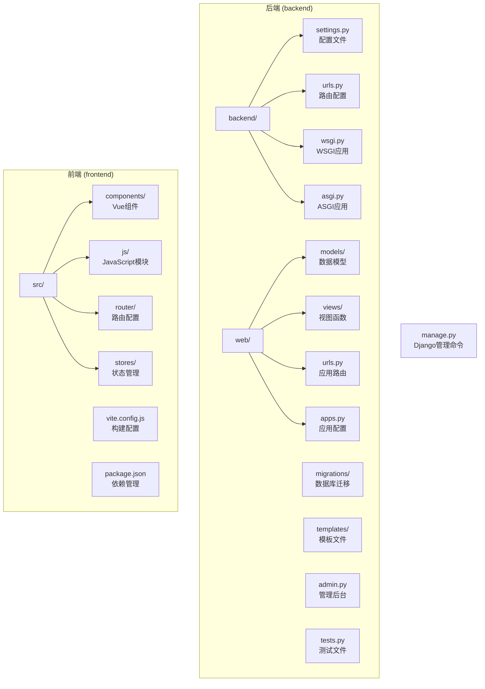

**图表来源**
- [settings.py:1-159](file://backend/backend/settings.py#L1-L159)
- [urls.py:1-38](file://backend/backend/urls.py#L1-L38)
- [urls.py:1-33](file://backend/web/urls.py#L1-L33)

**章节来源**
- [settings.py:1-159](file://backend/backend/settings.py#L1-L159)
- [urls.py:1-38](file://backend/backend/urls.py#L1-L38)

## 核心组件

### 应用安装配置 (INSTALLED_APPS)

项目的核心应用配置如下：

| 应用名称 | 类型 | 功能描述 |
|---------|------|----------|
| django.contrib.admin | 内置应用 | Django管理后台界面 |
| django.contrib.auth | 内置应用 | 用户认证和权限管理 |
| django.contrib.contenttypes | 内置应用 | 内容类型框架支持 |
| django.contrib.sessions | 内置应用 | 会话管理支持 |
| django.contrib.messages | 内置应用 | 消息框架 |
| django.contrib.staticfiles | 内置应用 | 静态文件管理 |
| rest_framework | 第三方应用 | DRF框架，提供API功能 |
| web | 自定义应用 | 业务逻辑应用，包含用户和角色管理 |
| corsheaders | 第三方应用 | 跨域资源共享支持 |

**章节来源**
- [settings.py:33-43](file://backend/backend/settings.py#L33-L43)
- [apps.py:1-6](file://backend/web/apps.py#L1-L6)

### 中间件配置 (MIDDLEWARE)

中间件执行顺序严格遵循安全优先原则：

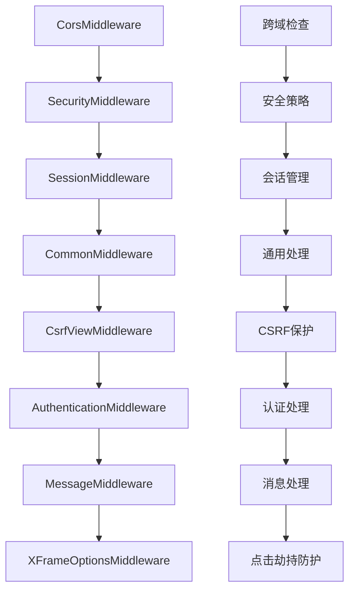

**图表来源**
- [settings.py:45-54](file://backend/backend/settings.py#L45-L54)

**章节来源**
- [settings.py:45-54](file://backend/backend/settings.py#L45-L54)

### 数据库配置

项目默认使用SQLite数据库，适用于开发和测试环境：

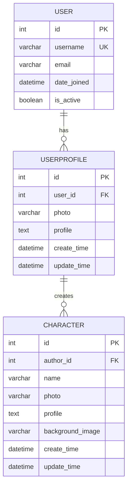

**图表来源**
- [user.py:14-22](file://backend/web/models/user.py#L14-L22)
- [character.py:21-31](file://backend/web/models/character.py#L21-L31)

**章节来源**
- [settings.py:79-84](file://backend/backend/settings.py#L79-L84)
- [user.py:1-23](file://backend/web/models/user.py#L1-L23)
- [character.py:1-32](file://backend/web/models/character.py#L1-L32)

### 静态文件配置

静态文件配置支持开发和生产两种模式：

| 配置项 | 开发模式 | 生产模式 |
|--------|----------|----------|
| STATIC_URL | 'static/' | 'static/' |
| STATICFILES_DIRS | 包含BASE_DIR/static | 注释掉 |
| STATIC_ROOT | 未设置 | 由服务器配置 |
| MEDIA_URL | 'http://127.0.0.1:8000/media/' | 服务器配置 |
| MEDIA_ROOT | BASE_DIR/media | 服务器配置 |

**章节来源**
- [settings.py:121-131](file://backend/backend/settings.py#L121-L131)
- [urls.py:28-37](file://backend/backend/urls.py#L28-L37)

## 架构概览

项目采用前后端分离架构，通过RESTful API进行通信：

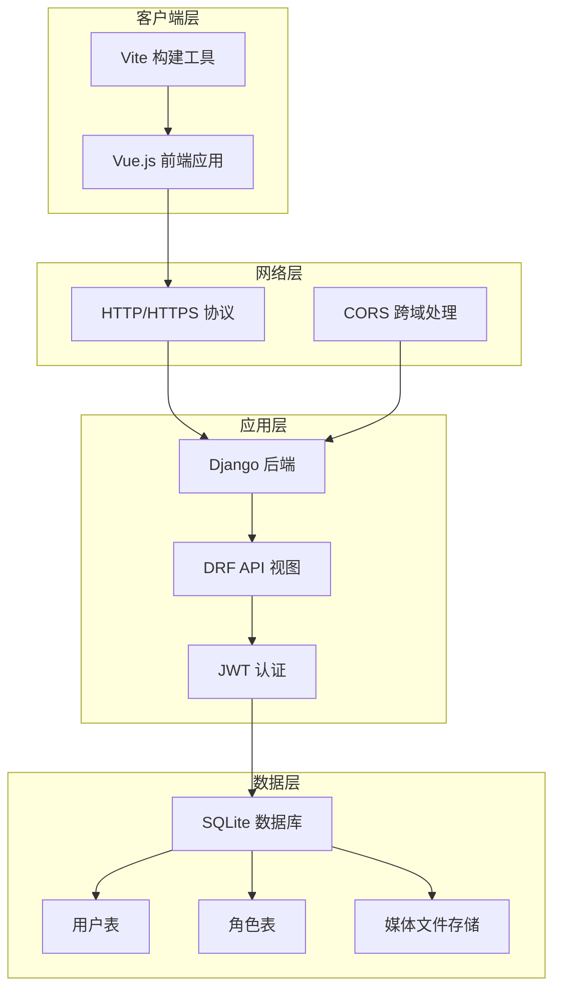

**图表来源**
- [settings.py:133-159](file://backend/backend/settings.py#L133-L159)
- [urls.py:1-33](file://backend/web/urls.py#L1-L33)

## 详细组件分析

### JWT认证配置

项目使用SimpleJWT实现JWT认证机制，配置参数如下：

#### REST_FRAMEWORK配置

- **DEFAULT_AUTHENTICATION_CLASSES**: 配置为JWTAuthentication，确保所有API端点都使用JWT认证
- **认证流程**: 自动拦截所有请求，验证JWT令牌的有效性

#### SIMPLE_JWT配置详解

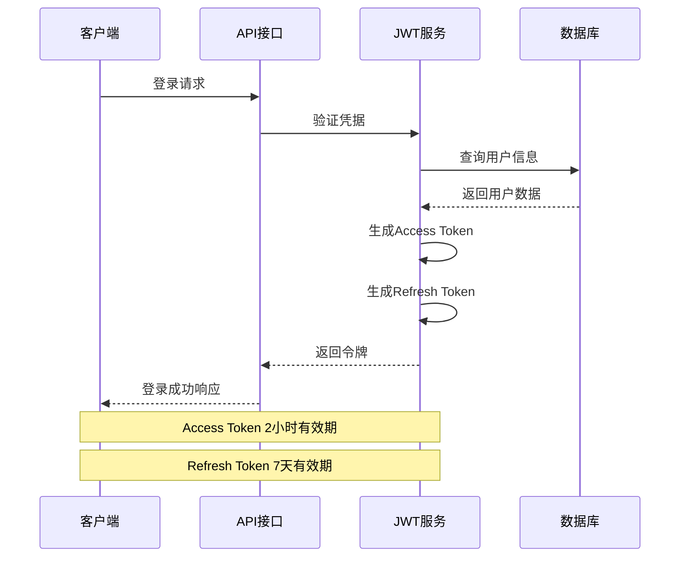

**图表来源**
- [login.py:20-38](file://backend/web/views/user/account/login.py#L20-L38)
- [settings.py:142-151](file://backend/backend/settings.py#L142-L151)

**章节来源**
- [settings.py:136-151](file://backend/backend/settings.py#L136-L151)
- [login.py:1-46](file://backend/web/views/user/account/login.py#L1-L46)

### CORS跨域配置

项目配置了严格的跨域策略，确保开发环境的安全性：

#### CORS配置参数

| 参数 | 值 | 说明 |
|------|-----|------|
| CORS_ALLOW_CREDENTIALS | True | 允许携带Cookie凭证 |
| CORS_ALLOWED_ORIGINS | ["http://localhost:5173"] | 仅允许Vite开发服务器 |

#### CORS执行流程

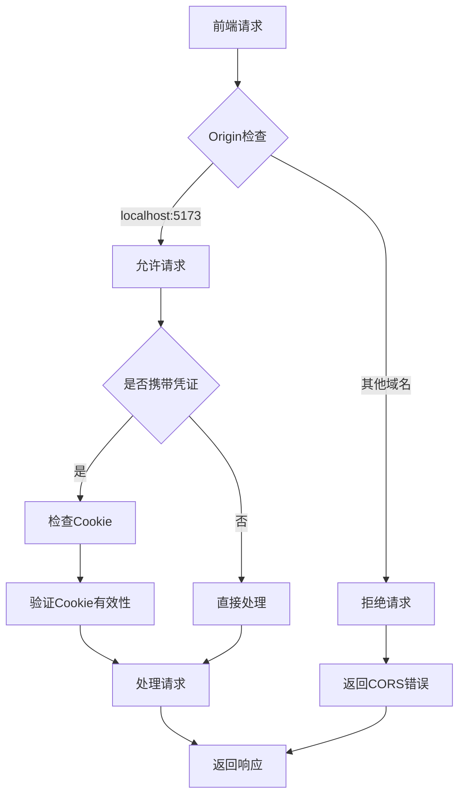

**图表来源**
- [settings.py:153-159](file://backend/backend/settings.py#L153-L159)

**章节来源**
- [settings.py:153-159](file://backend/backend/settings.py#L153-L159)

### 认证流程详解

#### 用户注册流程

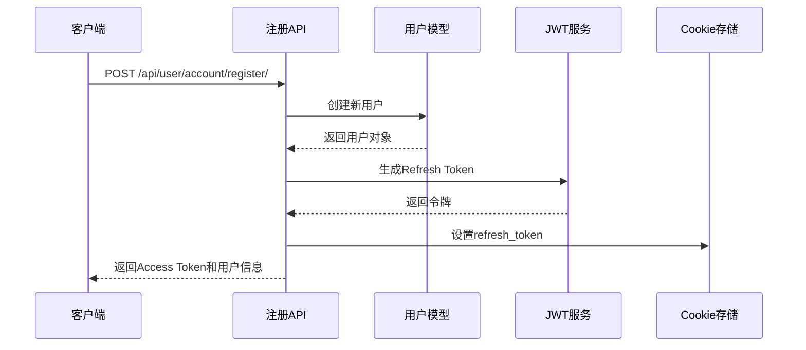

**图表来源**
- [register.py:22-41](file://backend/web/views/user/account/register.py#L22-L41)

#### 用户登录流程

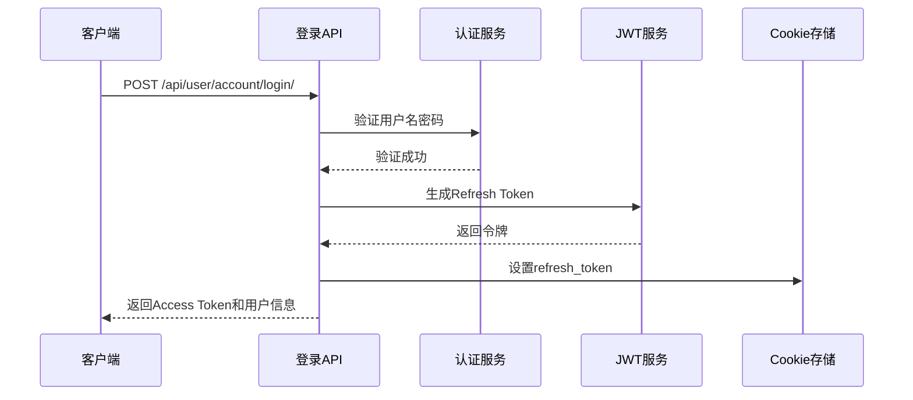

**图表来源**
- [login.py:18-38](file://backend/web/views/user/account/login.py#L18-L38)

#### Token刷新流程

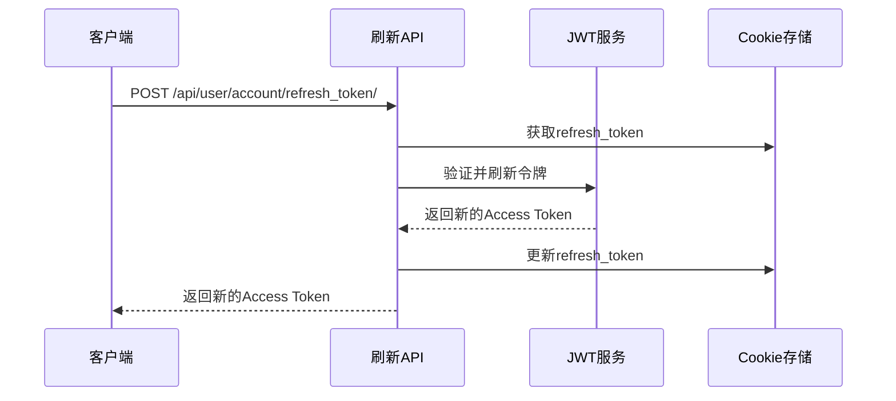

**图表来源**
- [refresh_token.py:15-30](file://backend/web/views/user/account/refresh_token.py#L15-L30)

**章节来源**
- [register.py:1-45](file://backend/web/views/user/account/register.py#L1-L45)
- [login.py:1-46](file://backend/web/views/user/account/login.py#L1-L46)
- [refresh_token.py:1-39](file://backend/web/views/user/account/refresh_token.py#L1-L39)

### API路由配置

项目采用模块化的路由组织方式：

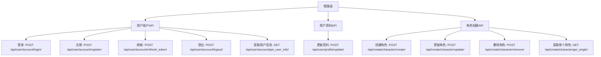

**图表来源**
- [urls.py:16-32](file://backend/web/urls.py#L16-L32)

**章节来源**
- [urls.py:1-33](file://backend/web/urls.py#L1-L33)

## 依赖分析

### 外部依赖关系

```mermaid
graph TB
subgraph "核心框架"
A[Django 6.0.1]
B[DRF (Django REST Framework)]
C[SimpleJWT]
end
subgraph "前端集成"
D[Vue.js]
E[Axios]
F[CORS Headers]
end
subgraph "开发工具"
G[Vite]
H[TailwindCSS]
I[SQLite]
end
A --> B
B --> C
D --> E
E --> F
A --> I
G --> D
H --> D
```

**图表来源**
- [settings.py:40-42](file://backend/backend/settings.py#L40-L42)
- [api.js:11-19](file://frontend/src/js/http/api.js#L11-L19)

### 内部模块依赖

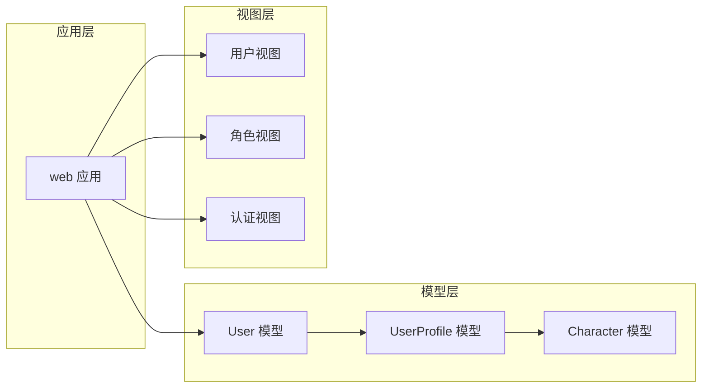

**图表来源**
- [user.py:14-22](file://backend/web/models/user.py#L14-L22)
- [character.py:21-31](file://backend/web/models/character.py#L21-L31)

**章节来源**
- [settings.py:1-159](file://backend/backend/settings.py#L1-L159)

## 性能考虑

### 缓存策略

- **静态文件缓存**: 生产环境中应配置适当的缓存头
- **数据库查询优化**: 使用select_related和prefetch_related减少查询次数
- **图片处理**: 建议使用CDN加速媒体文件访问

### 安全最佳实践

1. **生产环境安全配置**
   - 设置DEBUG=False
   - 配置ALLOWED_HOSTS
   - 使用HTTPS协议
   - 配置安全的Cookie设置

2. **JWT安全配置**
   - 启用令牌轮换
   - 设置合理的过期时间
   - 使用HTTPS传输令牌

3. **CORS安全配置**
   - 限制允许的源
   - 仅在必要时允许凭证
   - 定期审查配置

## 故障排除指南

### 常见问题及解决方案

#### CORS错误
**问题**: 跨域请求被拒绝
**原因**: CORS_ALLOWED_ORIGINS配置不正确
**解决**: 确保前端开发服务器地址与配置一致

#### 认证失败
**问题**: JWT认证失败
**原因**: 令牌过期或无效
**解决**: 调用刷新令牌API获取新令牌

#### 静态文件无法加载
**问题**: 开发环境下静态文件404
**原因**: 静态文件路径配置错误
**解决**: 检查STATICFILES_DIRS和MEDIA配置

#### 数据库连接问题
**问题**: SQLite数据库锁定
**原因**: 并发访问导致
**解决**: 在生产环境使用更强大的数据库

**章节来源**
- [settings.py:153-159](file://backend/backend/settings.py#L153-L159)
- [login.py:14-17](file://backend/web/views/user/account/login.py#L14-L17)
- [urls.py:28-37](file://backend/backend/urls.py#L28-L37)

## 结论

LLM_AIfriends项目的Django配置展现了现代Web应用的最佳实践。项目采用了：

1. **清晰的架构分层**: 前后端分离，职责明确
2. **安全的认证机制**: JWT配合CORS实现安全的跨域认证
3. **灵活的配置管理**: 支持开发和生产环境的不同需求
4. **完善的错误处理**: 提供详细的错误信息和处理流程

建议在生产环境中进一步完善：
- 配置专业的数据库和缓存系统
- 实施更严格的CORS和安全策略
- 添加监控和日志记录
- 配置负载均衡和反向代理