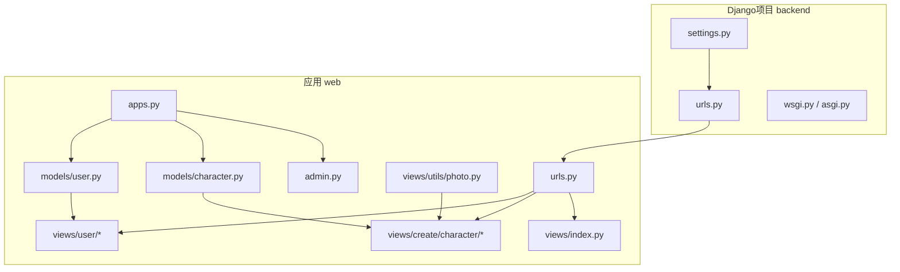
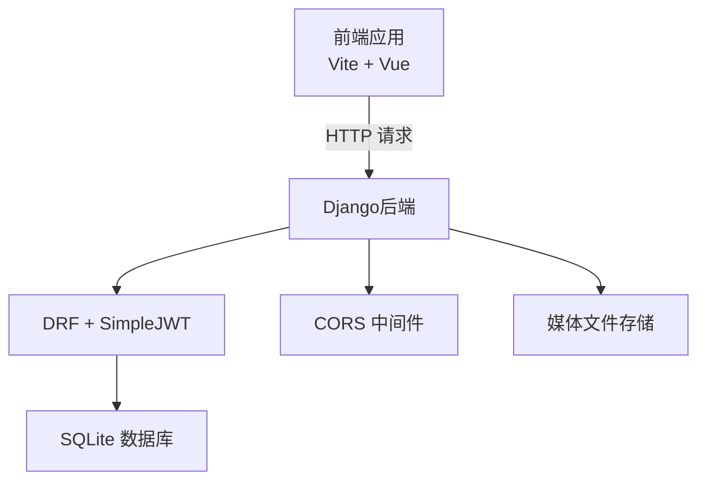
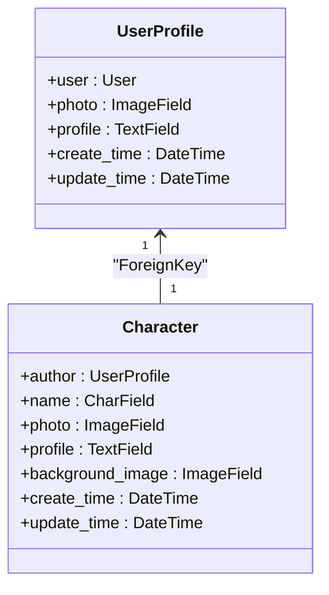
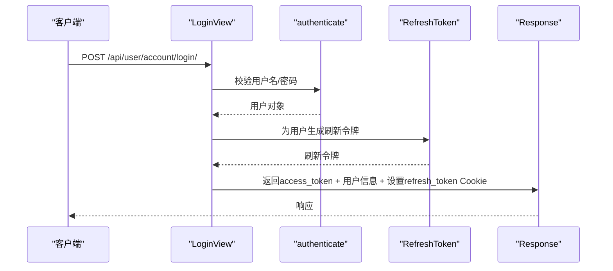
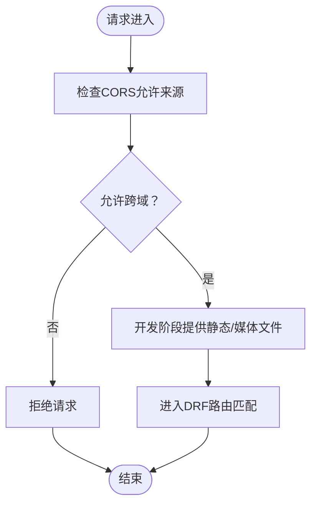
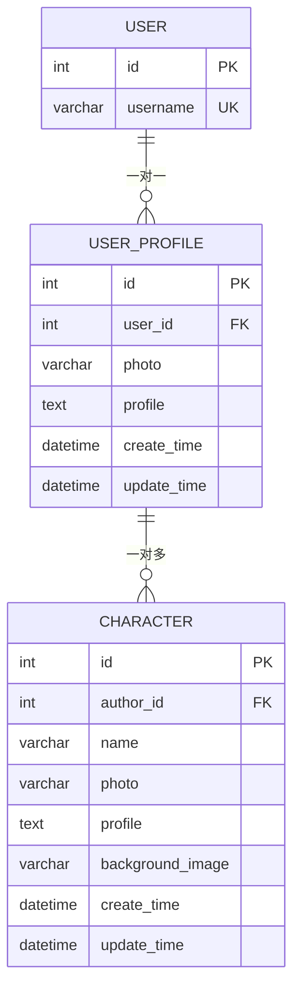
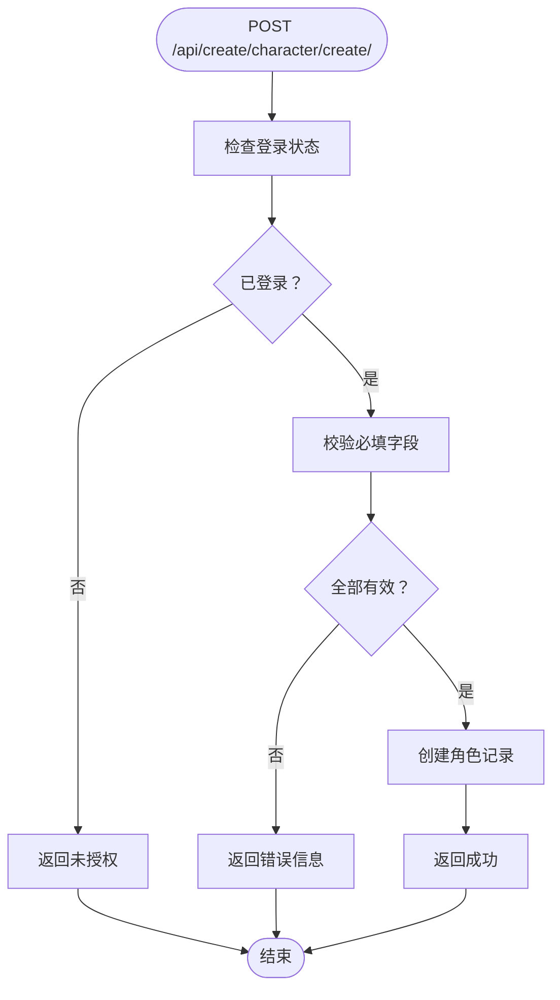
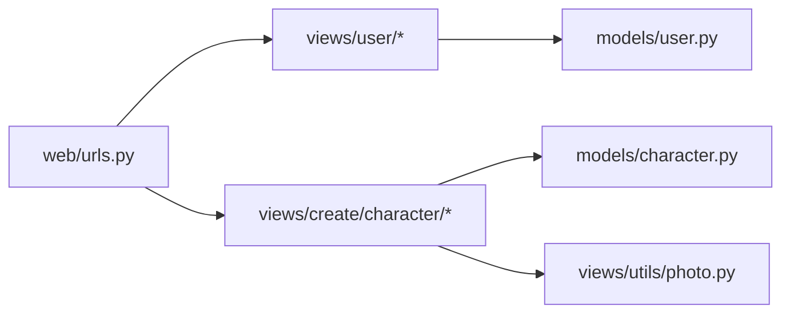

# 后端架构

<cite>
**本文引用的文件**
- [settings.py](file://backend/backend/settings.py)
- [urls.py](file://backend/backend/urls.py)
- [wsgi.py](file://backend/backend/wsgi.py)
- [asgi.py](file://backend/backend/asgi.py)
- [apps.py](file://backend/web/apps.py)
- [models/user.py](file://backend/web/models/user.py)
- [models/character.py](file://backend/web/models/character.py)
- [admin.py](file://backend/web/admin.py)
- [urls.py](file://backend/web/urls.py)
- [views/index.py](file://backend/web/views/index.py)
- [views/user/account/login.py](file://backend/web/views/user/account/login.py)
- [views/user/account/register.py](file://backend/web/views/user/account/register.py)
- [views/user/account/logout.py](file://backend/web/views/user/account/logout.py)
- [views/user/account/get_user_info.py](file://backend/web/views/user/account/get_user_info.py)
- [views/create/character/create.py](file://backend/web/views/create/character/create.py)
- [views/utils/photo.py](file://backend/web/views/utils/photo.py)
- [manage.py](file://backend/manage.py)
</cite>

## 目录
1. [简介](#简介)
2. [项目结构](#项目结构)
3. [核心组件](#核心组件)
4. [架构总览](#架构总览)
5. [详细组件分析](#详细组件分析)
6. [依赖分析](#依赖分析)
7. [性能考虑](#性能考虑)
8. [故障排查指南](#故障排查指南)
9. [结论](#结论)
10. [附录](#附录)

## 简介
本文件面向LLM_AIfriends后端，系统性梳理基于Django + Django REST Framework（DRF）的架构设计与实现要点，覆盖MVC模式落地、ORM模型设计、API视图层组织、JWT认证机制、CORS配置、数据库模型关系、管理员后台、模块化与中间件配置、安全策略、RESTful设计原则、错误处理与性能优化，并提供系统架构图、数据流图与组件依赖关系说明。

## 项目结构
后端采用“单工程多应用”布局：顶层backend目录包含Django项目配置与应用web；web应用下按功能域划分models、views、templates等子目录，视图层以DRF的APIView组织REST接口，配合URL路由集中管理。

图表来源
- [settings.py:33-43](file://backend/backend/settings.py#L33-L43)
- [urls.py:17-25](file://backend/backend/urls.py#L17-L25)
- [apps.py:4-6](file://backend/web/apps.py#L4-L6)
- [models/user.py:14-22](file://backend/web/models/user.py#L14-L22)
- [models/character.py:21-31](file://backend/web/models/character.py#L21-L31)
- [admin.py:6-13](file://backend/web/admin.py#L6-L13)
- [urls.py:16-32](file://backend/web/urls.py#L16-L32)
- [views/index.py:4-5](file://backend/web/views/index.py#L4-L5)
- [views/user/account/login.py:9-45](file://backend/web/views/user/account/login.py#L9-L45)
- [views/create/character/create.py:9-50](file://backend/web/views/create/character/create.py#L9-L50)
- [views/utils/photo.py:6-10](file://backend/web/views/utils/photo.py#L6-L10)

章节来源
- [settings.py:33-43](file://backend/backend/settings.py#L33-L43)
- [urls.py:17-25](file://backend/backend/urls.py#L17-L25)
- [apps.py:4-6](file://backend/web/apps.py#L4-L6)

## 核心组件
- 配置与中间件
  - 应用注册与中间件顺序：启用CORS、会话、CSRF、认证、消息、X-Frame-Options等，其中CORS需尽量靠前。
  - 认证与令牌：默认使用DRF SimpleJWT进行认证，配置访问令牌与刷新令牌生命周期、轮换与黑名单、请求头类型。
  - 跨域：允许凭据、指定前端本地开发源。
  - 静态资源与媒体：静态文件开发阶段直接映射，媒体路径指向项目根下的media目录。
- 数据库与模型
  - 用户扩展：UserProfile一对一关联Django内置User，含头像、个人简介、时间戳。
  - 角色模型：Character外键关联UserProfile，含名称、头像、简介、背景图与时间戳。
  - 文件上传：自定义upload_to函数，结合UUID生成唯一文件名，避免冲突与路径暴露。
- 管理后台
  - 注册UserProfile与Character，使用raw_id_fields提升大表筛选体验。
- 视图层
  - 用户账户：登录、注册、登出、刷新令牌、获取用户信息。
  - 角色创建：创建角色（含图片上传）、更新、删除、查询单个角色。
  - 工具：清理旧图片文件辅助逻辑。
- 路由
  - 后端根路由聚合web.urls，后者定义所有/api/*接口与SPA回退路由。

章节来源
- [settings.py:45-54](file://backend/backend/settings.py#L45-L54)
- [settings.py:136-151](file://backend/backend/settings.py#L136-L151)
- [settings.py:153-159](file://backend/backend/settings.py#L153-L159)
- [models/user.py:14-22](file://backend/web/models/user.py#L14-L22)
- [models/character.py:21-31](file://backend/web/models/character.py#L21-L31)
- [admin.py:6-13](file://backend/web/admin.py#L6-L13)
- [urls.py:16-32](file://backend/web/urls.py#L16-L32)

## 架构总览
整体采用前后端分离：前端Vite构建，后端Django提供REST API与静态资源服务。CORS在后端统一放行，JWT负责鉴权，SQLite用于开发环境，静态与媒体文件通过Django在开发阶段提供。

图表来源
- [settings.py:45-54](file://backend/backend/settings.py#L45-L54)
- [settings.py:136-151](file://backend/backend/settings.py#L136-L151)
- [urls.py:17-25](file://backend/backend/urls.py#L17-L25)

## 详细组件分析

### MVC模式与视图层组织
- 模型（Model）
  - UserProfile与Character遵循Django ORM约定，字段明确、约束清晰，时间戳统一使用UTC+8时区本地化展示。
- 视图（View）
  - 全部采用DRF的APIView类视图，按功能域分层组织于web/views下，权限控制集中在permission_classes中。
- 控制器（Controller）
  - URL路由集中于web/urls.py，将/api/*映射到对应视图类，支持SPA回退路由。

图表来源
- [models/user.py:14-22](file://backend/web/models/user.py#L14-L22)
- [models/character.py:21-31](file://backend/web/models/character.py#L21-L31)

章节来源
- [models/user.py:14-22](file://backend/web/models/user.py#L14-L22)
- [models/character.py:21-31](file://backend/web/models/character.py#L21-L31)

### JWT认证与令牌管理
- 登录流程
  - 校验用户名与密码，认证成功后生成RefreshToken并派生Access Token，同时设置httponly、secure刷新令牌Cookie。
- 刷新与登出
  - 提供刷新令牌接口；登出时删除刷新令牌Cookie，配合SimpleJWT黑名单可实现即时失效。
- 安全要点
  - Access Token短周期、Refresh Token长周期且支持轮换与黑名单；请求头使用Bearer类型。

图表来源
- [views/user/account/login.py:9-45](file://backend/web/views/user/account/login.py#L9-L45)
- [settings.py:136-151](file://backend/backend/settings.py#L136-L151)

章节来源
- [views/user/account/login.py:9-45](file://backend/web/views/user/account/login.py#L9-L45)
- [views/user/account/register.py:9-44](file://backend/web/views/user/account/register.py#L9-L44)
- [views/user/account/logout.py:6-13](file://backend/web/views/user/account/logout.py#L6-L13)
- [settings.py:136-151](file://backend/backend/settings.py#L136-L151)

### CORS与静态/媒体资源
- CORS
  - 允许凭据，放行前端本地开发地址，确保Cookie与跨域请求协同工作。
- 静态与媒体
  - 开发阶段通过Django路由直接提供静态资源与媒体文件，生产环境建议由反向代理统一处理。

图表来源
- [settings.py:153-159](file://backend/backend/settings.py#L153-L159)
- [urls.py:29-37](file://backend/backend/urls.py#L29-L37)

章节来源
- [settings.py:153-159](file://backend/backend/settings.py#L153-L159)
- [urls.py:29-37](file://backend/backend/urls.py#L29-L37)

### 数据模型关系与文件上传策略
- 关系
  - UserProfile一对一User；Character外键UserProfile；一对多关系清晰，便于按作者检索角色。
- 文件上传
  - 自定义upload_to函数，使用UUID截断拼接新文件名，避免同名冲突与路径泄露；媒体URL通过模型字段.url自动拼接。

图表来源
- [models/user.py:14-22](file://backend/web/models/user.py#L14-L22)
- [models/character.py:21-31](file://backend/web/models/character.py#L21-L31)

章节来源
- [models/user.py:8-11](file://backend/web/models/user.py#L8-L11)
- [models/character.py:9-18](file://backend/web/models/character.py#L9-L18)
- [models/character.py:21-31](file://backend/web/models/character.py#L21-L31)

### 角色创建流程与错误处理
- 创建流程
  - 需要登录（IsAuthenticated），校验必填字段（名称、简介、头像、背景图），保存至数据库。
- 错误处理
  - 对空值、缺失参数、系统异常进行统一响应，返回result字段提示信息。

图表来源
- [views/create/character/create.py:9-50](file://backend/web/views/create/character/create.py#L9-L50)

章节来源
- [views/create/character/create.py:9-50](file://backend/web/views/create/character/create.py#L9-L50)

### 管理后台配置
- 注册模型：UserProfile与Character均注册到admin后台。
- raw_id_fields：在大量数据场景下提升筛选与编辑效率。

章节来源
- [admin.py:6-13](file://backend/web/admin.py#L6-L13)

## 依赖分析
- 组件耦合
  - 视图层依赖模型层（UserProfile、Character），工具层提供文件清理辅助。
  - 路由层集中导入各视图类，降低控制器分散度。
- 外部依赖
  - DRF提供视图与权限体系；SimpleJWT提供令牌生成与校验；CORS提供跨域支持；SQLite作为默认数据库。

图表来源
- [urls.py:4-14](file://backend/web/urls.py#L4-L14)
- [models/user.py:14-22](file://backend/web/models/user.py#L14-L22)
- [models/character.py:21-31](file://backend/web/models/character.py#L21-L31)
- [views/utils/photo.py:6-10](file://backend/web/views/utils/photo.py#L6-L10)

章节来源
- [urls.py:16-32](file://backend/web/urls.py#L16-L32)

## 性能考虑
- 数据库
  - 使用外键与索引字段（如时间戳）提升查询效率；必要时在管理后台开启raw_id_fields优化筛选。
- 文件存储
  - 图片上传采用UUID命名，避免重复与路径冲突；建议生产环境接入CDN与缩略图策略。
- 缓存与会话
  - 开发阶段使用内存缓存；生产建议引入Redis缓存热点数据与令牌黑名单。
- 接口与序列化
  - 控制响应体大小，避免一次性返回过多字段；对列表接口分页处理。
- 部署
  - 静态与媒体文件交由反向代理统一提供，减少Django负载。

## 故障排查指南
- 认证失败
  - 检查请求头是否携带Bearer Token；确认SimpleJWT配置的请求头类型与前端一致；核对刷新令牌Cookie是否正确设置。
- 跨域问题
  - 确认CORS_ALLOWED_ORIGINS包含前端地址；若使用Cookie，确保CORS_ALLOW_CREDENTIALS为True。
- 文件上传失败
  - 检查MEDIA_ROOT与MEDIA_URL配置；确认上传字段名称与FILES键一致；查看upload_to生成的新文件名是否符合预期。
- 权限错误
  - 确认IsAuthenticated已生效；检查用户是否被禁用或令牌是否过期。
- 数据库异常
  - 查看迁移是否完成；核对模型字段与数据库一致性；避免并发写入导致的唯一约束冲突。

章节来源
- [settings.py:136-151](file://backend/backend/settings.py#L136-L151)
- [settings.py:153-159](file://backend/backend/settings.py#L153-L159)
- [views/user/account/login.py:9-45](file://backend/web/views/user/account/login.py#L9-L45)
- [views/create/character/create.py:9-50](file://backend/web/views/create/character/create.py#L9-L50)

## 结论
本后端以Django + DRF为核心，结合SimpleJWT与CORS，形成清晰的MVC落地与REST接口组织。模型设计简洁、视图职责单一、路由集中管理，具备良好的可维护性与扩展性。建议在生产环境中完善静态资源托管、CDN加速、缓存与监控体系，并持续优化接口与数据库查询性能。

## 附录
- 启动与运行
  - 使用项目根目录的manage.py执行命令行任务，设置环境变量指向backend.settings后即可启动开发服务器。
- 目录速览
  - 配置：backend/backend/settings.py、backend/backend/urls.py
  - 应用：backend/web/apps.py
  - 模型：backend/web/models/user.py、backend/web/models/character.py
  - 视图：backend/web/views/user/account/*、backend/web/views/create/character/*
  - 路由：backend/web/urls.py、backend/backend/urls.py
  - 工具：backend/web/views/utils/photo.py
  - 启动：backend/manage.py

章节来源
- [manage.py:7-18](file://backend/manage.py#L7-L18)
- [apps.py:4-6](file://backend/web/apps.py#L4-L6)
- [urls.py:16-32](file://backend/web/urls.py#L16-L32)
- [urls.py:17-25](file://backend/backend/urls.py#L17-L25)