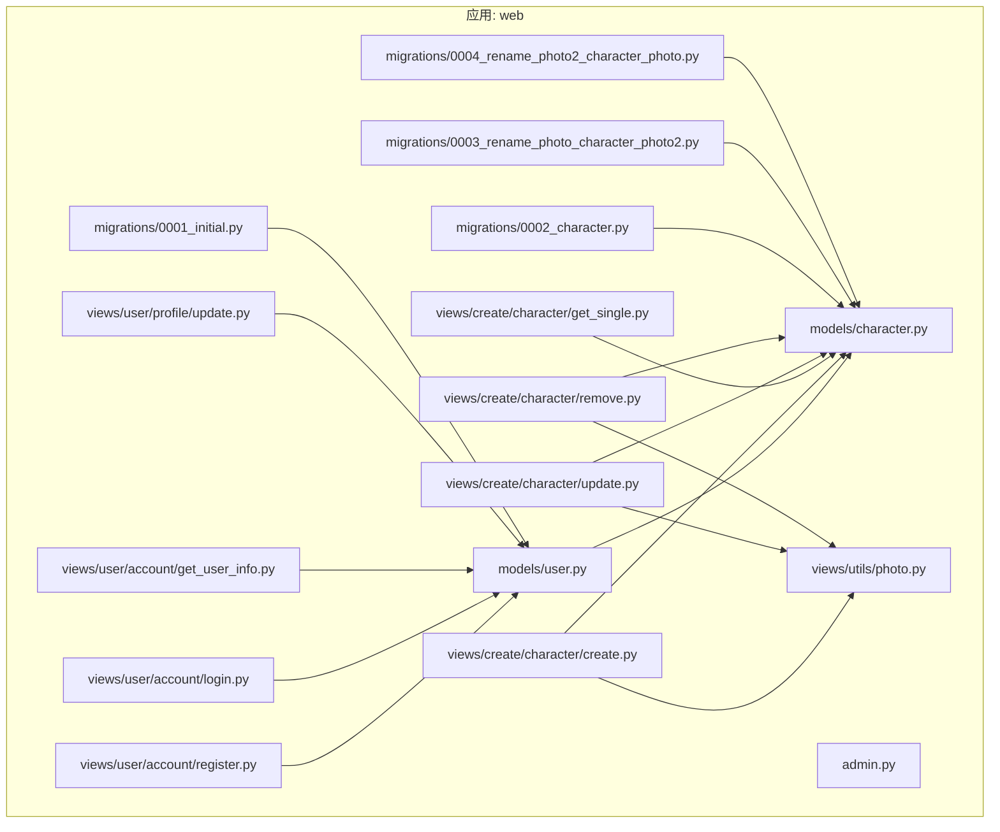
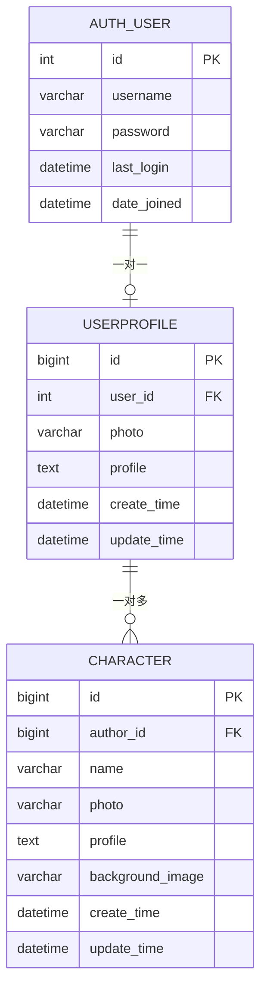
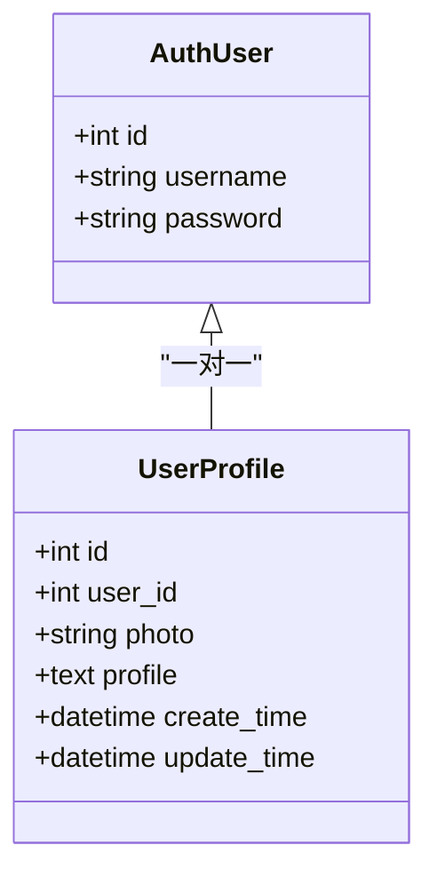
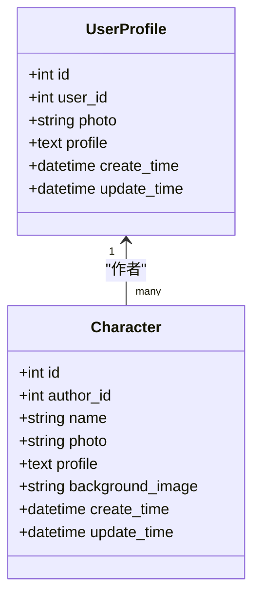
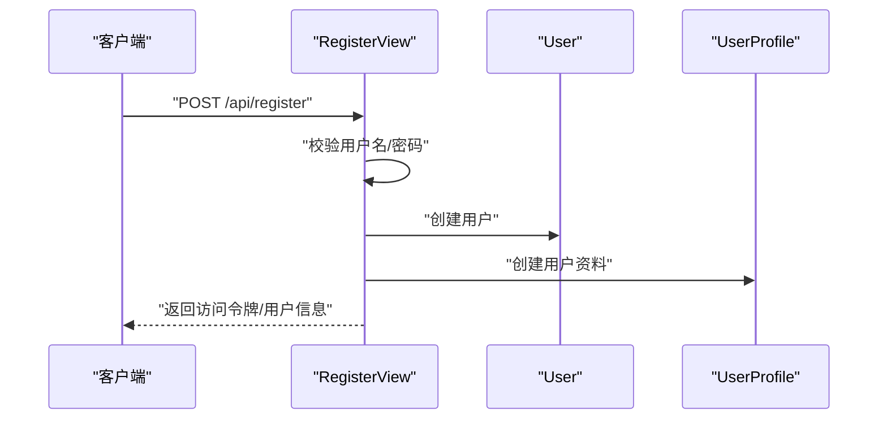
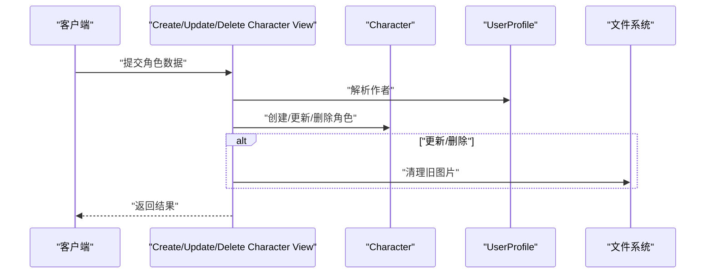
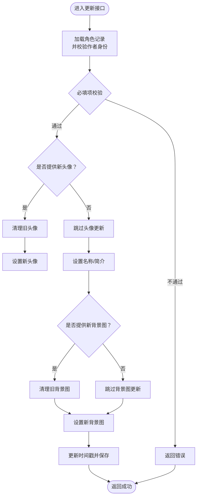
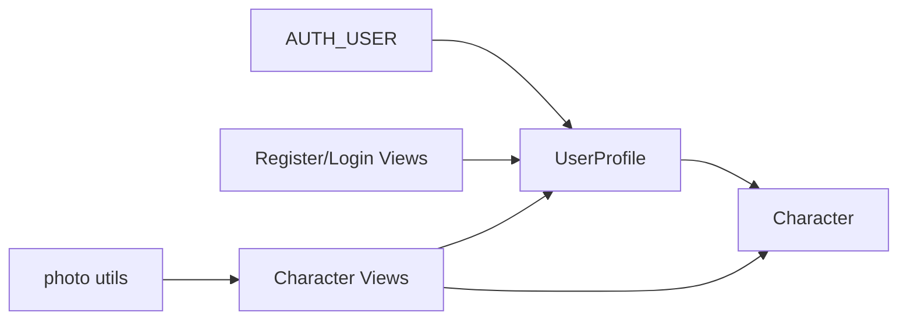

# 数据库模型设计

<cite>
**本文引用的文件**
- [backend/web/models/user.py](file://backend/web/models/user.py)
- [backend/web/models/character.py](file://backend/web/models/character.py)
- [backend/web/admin.py](file://backend/web/admin.py)
- [backend/web/migrations/0001_initial.py](file://backend/web/migrations/0001_initial.py)
- [backend/web/migrations/0002_character.py](file://backend/web/migrations/0002_character.py)
- [backend/web/migrations/0003_rename_photo_character_photo2.py](file://backend/web/migrations/0003_rename_photo_character_photo2.py)
- [backend/web/migrations/0004_rename_photo2_character_photo.py](file://backend/web/migrations/0004_rename_photo2_character_photo.py)
- [backend/web/views/user/account/register.py](file://backend/web/views/user/account/register.py)
- [backend/web/views/user/account/login.py](file://backend/web/views/user/account/login.py)
- [backend/web/views/user/account/get_user_info.py](file://backend/web/views/user/account/get_user_info.py)
- [backend/web/views/user/profile/update.py](file://backend/web/views/user/profile/update.py)
- [backend/web/views/create/character/create.py](file://backend/web/views/create/character/create.py)
- [backend/web/views/create/character/get_single.py](file://backend/web/views/create/character/get_single.py)
- [backend/web/views/create/character/update.py](file://backend/web/views/create/character/update.py)
- [backend/web/views/create/character/remove.py](file://backend/web/views/create/character/remove.py)
- [backend/web/views/utils/photo.py](file://backend/web/views/utils/photo.py)
</cite>

## 目录
1. [简介](#简介)
2. [项目结构](#项目结构)
3. [核心组件](#核心组件)
4. [架构总览](#架构总览)
5. [详细组件分析](#详细组件分析)
6. [依赖分析](#依赖分析)
7. [性能考虑](#性能考虑)
8. [故障排查指南](#故障排查指南)
9. [结论](#结论)
10. [附录](#附录)

## 简介
本文件面向 LLM_AIfriends 的数据库模型设计，重点围绕用户与角色两大实体：User 模型（通过 Django 内置 User）与 UserProfile 模型、Character 模型。文档从模型设计思路、字段定义、业务逻辑、外键关系与数据完整性约束出发，结合迁移策略、索引与查询优化建议，给出可操作的实践方案，并展示 Django Admin 中的管理界面配置。

## 项目结构
本项目采用 Django 应用层组织方式，模型位于 web/models 下，迁移文件位于 web/migrations，视图层位于 web/views，后台管理位于 web/admin。模型与视图之间通过权限控制与序列化返回进行交互。

图表来源
- [backend/web/models/user.py:1-23](file://backend/web/models/user.py#L1-L23)
- [backend/web/models/character.py:1-32](file://backend/web/models/character.py#L1-L32)
- [backend/web/admin.py:1-14](file://backend/web/admin.py#L1-L14)
- [backend/web/migrations/0001_initial.py:1-31](file://backend/web/migrations/0001_initial.py#L1-L31)
- [backend/web/migrations/0002_character.py:1-30](file://backend/web/migrations/0002_character.py#L1-L30)
- [backend/web/migrations/0003_rename_photo_character_photo2.py:1-19](file://backend/web/migrations/0003_rename_photo_character_photo2.py#L1-L19)
- [backend/web/migrations/0004_rename_photo2_character_photo.py:1-19](file://backend/web/migrations/0004_rename_photo2_character_photo.py#L1-L19)
- [backend/web/views/user/account/register.py:1-45](file://backend/web/views/user/account/register.py#L1-L45)
- [backend/web/views/user/account/login.py:1-46](file://backend/web/views/user/account/login.py#L1-L46)
- [backend/web/views/user/account/get_user_info.py:1-24](file://backend/web/views/user/account/get_user_info.py#L1-L24)
- [backend/web/views/user/profile/update.py:1-53](file://backend/web/views/user/profile/update.py#L1-L53)
- [backend/web/views/create/character/create.py:1-51](file://backend/web/views/create/character/create.py#L1-L51)
- [backend/web/views/create/character/get_single.py:1-28](file://backend/web/views/create/character/get_single.py#L1-L28)
- [backend/web/views/create/character/update.py:1-46](file://backend/web/views/create/character/update.py#L1-L46)
- [backend/web/views/create/character/remove.py:1-25](file://backend/web/views/create/character/remove.py#L1-L25)
- [backend/web/views/utils/photo.py:1-11](file://backend/web/views/utils/photo.py#L1-L11)

章节来源
- [backend/web/models/user.py:1-23](file://backend/web/models/user.py#L1-L23)
- [backend/web/models/character.py:1-32](file://backend/web/models/character.py#L1-L32)
- [backend/web/admin.py:1-14](file://backend/web/admin.py#L1-L14)
- [backend/web/migrations/0001_initial.py:1-31](file://backend/web/migrations/0001_initial.py#L1-L31)
- [backend/web/migrations/0002_character.py:1-30](file://backend/web/migrations/0002_character.py#L1-L30)
- [backend/web/migrations/0003_rename_photo_character_photo2.py:1-19](file://backend/web/migrations/0003_rename_photo_character_photo2.py#L1-L19)
- [backend/web/migrations/0004_rename_photo2_character_photo.py:1-19](file://backend/web/migrations/0004_rename_photo2_character_photo.py#L1-L19)

## 核心组件
- User 模型：使用 Django 内置的 User，作为认证主体，不直接在本项目中自定义。
- UserProfile 模型：一对一关联 User，扩展用户资料，包含头像、个人简介、创建/更新时间戳。
- Character 模型：多对一关联 UserProfile（作者），存储角色信息、头像、背景图、简介与时间戳。

字段与类型选择要点
- 头像与背景图：ImageField，上传路径通过自定义函数按作者 user_id 与随机文件名生成，避免冲突与便于归档。
- 文本字段：简介使用 TextField，限制长度以平衡灵活性与数据库性能；字符名使用 CharField 并设置合理上限。
- 时间戳：DateTimeField，默认值为当前时间，用于排序与审计。

业务规则
- 注册时自动创建 UserProfile。
- 登录/注册成功后返回用户头像与简介的 URL。
- 更新用户资料时，支持替换头像并清理旧文件。
- 创建/更新角色时，严格校验必填字段；更新时可选择性替换图片并清理旧资源。
- 删除角色时，同时删除媒体文件与记录。

章节来源
- [backend/web/models/user.py:14-23](file://backend/web/models/user.py#L14-L23)
- [backend/web/models/character.py:21-32](file://backend/web/models/character.py#L21-L32)
- [backend/web/views/user/account/register.py:9-45](file://backend/web/views/user/account/register.py#L9-L45)
- [backend/web/views/user/account/login.py:9-46](file://backend/web/views/user/account/login.py#L9-L46)
- [backend/web/views/user/profile/update.py:11-53](file://backend/web/views/user/profile/update.py#L11-L53)
- [backend/web/views/create/character/create.py:9-51](file://backend/web/views/create/character/create.py#L9-L51)
- [backend/web/views/create/character/update.py:10-46](file://backend/web/views/create/character/update.py#L10-L46)
- [backend/web/views/create/character/remove.py:9-25](file://backend/web/views/create/character/remove.py#L9-L25)
- [backend/web/views/utils/photo.py:6-11](file://backend/web/views/utils/photo.py#L6-L11)

## 架构总览
下图展示了模型间的关系、外键约束与典型请求流程。

图表来源
- [backend/web/models/user.py:14-23](file://backend/web/models/user.py#L14-L23)
- [backend/web/models/character.py:21-32](file://backend/web/models/character.py#L21-L32)
- [backend/web/migrations/0001_initial.py:19-30](file://backend/web/migrations/0001_initial.py#L19-L30)
- [backend/web/migrations/0002_character.py:16-29](file://backend/web/migrations/0002_character.py#L16-L29)

## 详细组件分析

### User 模型与 UserProfile 模型
- 设计思路
  - 使用 Django 内置 User 进行认证，UserProfile 作为扩展表，承载头像、简介等非认证必要信息。
  - 一对一关系确保每个用户仅有一个资料档案，删除用户会级联删除资料（on_delete=CASCADE）。
- 字段定义
  - user: OneToOneField 到 AUTH_USER，级联删除。
  - photo: ImageField，上传至 user/photos/，默认头像路径固定。
  - profile: TextField，最大长度限制，含默认文案。
  - create_time/update_time: DateTimeField，默认当前时间。
- 业务逻辑
  - 注册时自动创建 UserProfile；登录/注册成功后返回头像 URL 与简介。
  - 更新资料时可更换头像，旧文件通过工具方法清理。
- Django Admin 配置
  - raw_id_fields 优化用户选择体验。

图表来源
- [backend/web/models/user.py:14-23](file://backend/web/models/user.py#L14-L23)
- [backend/web/migrations/0001_initial.py:19-30](file://backend/web/migrations/0001_initial.py#L19-L30)

章节来源
- [backend/web/models/user.py:14-23](file://backend/web/models/user.py#L14-L23)
- [backend/web/admin.py:6-13](file://backend/web/admin.py#L6-L13)
- [backend/web/migrations/0001_initial.py:19-30](file://backend/web/migrations/0001_initial.py#L19-L30)
- [backend/web/views/user/account/register.py:22-32](file://backend/web/views/user/account/register.py#L22-L32)
- [backend/web/views/user/account/login.py:18-29](file://backend/web/views/user/account/login.py#L18-L29)
- [backend/web/views/user/account/get_user_info.py:8-24](file://backend/web/views/user/account/get_user_info.py#L8-L24)
- [backend/web/views/user/profile/update.py:15-48](file://backend/web/views/user/profile/update.py#L15-L48)

### Character 模型
- 设计思路
  - 角色属于用户，通过 ForeignKey 关联到 UserProfile，形成“用户-角色”的一对多关系。
  - 图片字段分别存储角色头像与背景图，上传路径包含作者 user_id，便于隔离与归档。
- 字段定义
  - author: ForeignKey(UserProfile)，级联删除。
  - name: CharField，角色名称。
  - photo/background_image: ImageField，分别指向头像与背景图。
  - profile: TextField，角色简介，限制长度。
  - create_time/update_time: DateTimeField，默认当前时间。
- 业务逻辑
  - 创建角色时校验名称、简介、头像与背景图必填。
  - 更新角色时可选更新图片，更新后刷新 update_time。
  - 删除角色时清理媒体文件与记录。
- Django Admin 配置
  - raw_id_fields 优化作者选择体验。

图表来源
- [backend/web/models/character.py:21-32](file://backend/web/models/character.py#L21-L32)
- [backend/web/migrations/0002_character.py:16-29](file://backend/web/migrations/0002_character.py#L16-L29)

章节来源
- [backend/web/models/character.py:21-32](file://backend/web/models/character.py#L21-L32)
- [backend/web/admin.py:11-14](file://backend/web/admin.py#L11-L14)
- [backend/web/migrations/0002_character.py:16-29](file://backend/web/migrations/0002_character.py#L16-L29)
- [backend/web/views/create/character/create.py:11-46](file://backend/web/views/create/character/create.py#L11-L46)
- [backend/web/views/create/character/get_single.py:8-27](file://backend/web/views/create/character/get_single.py#L8-L27)
- [backend/web/views/create/character/update.py:10-41](file://backend/web/views/create/character/update.py#L10-L41)
- [backend/web/views/create/character/remove.py:9-21](file://backend/web/views/create/character/remove.py#L9-L21)

### 典型流程：注册与登录

图表来源
- [backend/web/views/user/account/register.py:9-45](file://backend/web/views/user/account/register.py#L9-L45)

章节来源
- [backend/web/views/user/account/register.py:9-45](file://backend/web/views/user/account/register.py#L9-L45)

### 典型流程：创建/更新/删除角色

图表来源
- [backend/web/views/create/character/create.py:9-51](file://backend/web/views/create/character/create.py#L9-L51)
- [backend/web/views/create/character/update.py:10-46](file://backend/web/views/create/character/update.py#L10-L46)
- [backend/web/views/create/character/remove.py:9-25](file://backend/web/views/create/character/remove.py#L9-L25)
- [backend/web/views/utils/photo.py:6-11](file://backend/web/views/utils/photo.py#L6-L11)

章节来源
- [backend/web/views/create/character/create.py:9-51](file://backend/web/views/create/character/create.py#L9-L51)
- [backend/web/views/create/character/update.py:10-46](file://backend/web/views/create/character/update.py#L10-L46)
- [backend/web/views/create/character/remove.py:9-25](file://backend/web/views/create/character/remove.py#L9-L25)
- [backend/web/views/utils/photo.py:6-11](file://backend/web/views/utils/photo.py#L6-L11)

### 复杂逻辑：更新角色流程

图表来源
- [backend/web/views/create/character/update.py:10-46](file://backend/web/views/create/character/update.py#L10-L46)
- [backend/web/views/utils/photo.py:6-11](file://backend/web/views/utils/photo.py#L6-L11)

章节来源
- [backend/web/views/create/character/update.py:10-46](file://backend/web/views/create/character/update.py#L10-L46)
- [backend/web/views/utils/photo.py:6-11](file://backend/web/views/utils/photo.py#L6-L11)

## 依赖分析
- 模型依赖
  - Character.author -> UserProfile
  - UserProfile.user -> AUTH_USER（Django 内置）
- 视图依赖
  - 用户相关视图依赖 UserProfile
  - 角色相关视图依赖 Character 与 UserProfile
  - 文件清理依赖 utils.photo 工具
- 迁移依赖
  - 0002_character 依赖 0001_initial
  - 后续重命名迁移依赖前序状态

图表来源
- [backend/web/models/character.py:21-32](file://backend/web/models/character.py#L21-L32)
- [backend/web/models/user.py:14-23](file://backend/web/models/user.py#L14-L23)
- [backend/web/migrations/0001_initial.py:19-30](file://backend/web/migrations/0001_initial.py#L19-L30)
- [backend/web/migrations/0002_character.py:16-29](file://backend/web/migrations/0002_character.py#L16-L29)

章节来源
- [backend/web/models/character.py:21-32](file://backend/web/models/character.py#L21-L32)
- [backend/web/models/user.py:14-23](file://backend/web/models/user.py#L14-L23)
- [backend/web/migrations/0001_initial.py:19-30](file://backend/web/migrations/0001_initial.py#L19-L30)
- [backend/web/migrations/0002_character.py:16-29](file://backend/web/migrations/0002_character.py#L16-L29)

## 性能考虑
- 索引建议
  - UserProfile.user 建立唯一索引（默认 OneToOneField 已具备唯一性，但如需复合查询可考虑）。
  - Character.author 建立索引（默认 ForeignKey 已有索引）。
  - 如需按 create_time 排序或筛选，可在 Character 与 UserProfile 上建立索引。
- 查询优化
  - 在视图中使用 select_related('author__user') 或 prefetch_related 减少 N+1 查询。
  - 对于频繁读取的头像/背景图，可考虑缓存策略（如 CDN）。
- 存储与清理
  - 通过工具方法统一清理旧文件，避免磁盘膨胀。
- 迁移策略
  - 新增字段建议使用空值允许 + 后续数据填充，避免大表阻塞。
  - 批量更新时间戳等场景，优先使用原生 SQL 或批量 ORM 提升效率。

## 故障排查指南
- 常见问题
  - 上传文件失败：检查 MEDIA_ROOT 权限与 upload_to 路径生成逻辑。
  - 头像未更新：确认前端传入文件与后端清理逻辑是否执行。
  - 删除角色后仍占用空间：确认 remove_old_photo 是否被调用。
- 定位手段
  - 查看视图返回的 result 字段与异常分支。
  - 检查迁移历史与模型字段变更。
  - 在 Django Admin 中核对记录数量与外键一致性。

章节来源
- [backend/web/views/utils/photo.py:6-11](file://backend/web/views/utils/photo.py#L6-L11)
- [backend/web/views/create/character/remove.py:9-25](file://backend/web/views/create/character/remove.py#L9-L25)
- [backend/web/views/user/profile/update.py:15-53](file://backend/web/views/user/profile/update.py#L15-L53)

## 结论
本设计以 Django 内置 User 为核心，通过 UserProfile 与 Character 形成清晰的一对一与一对多关系，满足用户资料与角色管理需求。通过严格的字段校验、统一的文件清理策略与合理的迁移步骤，保证了数据完整性与可维护性。配合 Django Admin 的 raw_id_fields 优化，提升了后台管理效率。

## 附录
- 迁移历史
  - 0001_initial：创建 UserProfile 表。
  - 0002_character：创建 Character 表并添加外键。
  - 0003_rename_photo_character_photo2：临时字段重命名。
  - 0004_rename_photo2_character_photo：最终字段重命名。
- Admin 配置
  - UserProfile 与 Character 均启用 raw_id_fields，提升作者/作者关联字段的选择效率。

章节来源
- [backend/web/migrations/0001_initial.py:10-31](file://backend/web/migrations/0001_initial.py#L10-L31)
- [backend/web/migrations/0002_character.py:9-30](file://backend/web/migrations/0002_character.py#L9-L30)
- [backend/web/migrations/0003_rename_photo_character_photo2.py:6-19](file://backend/web/migrations/0003_rename_photo_character_photo2.py#L6-L19)
- [backend/web/migrations/0004_rename_photo2_character_photo.py:6-19](file://backend/web/migrations/0004_rename_photo2_character_photo.py#L6-L19)
- [backend/web/admin.py:6-14](file://backend/web/admin.py#L6-L14)