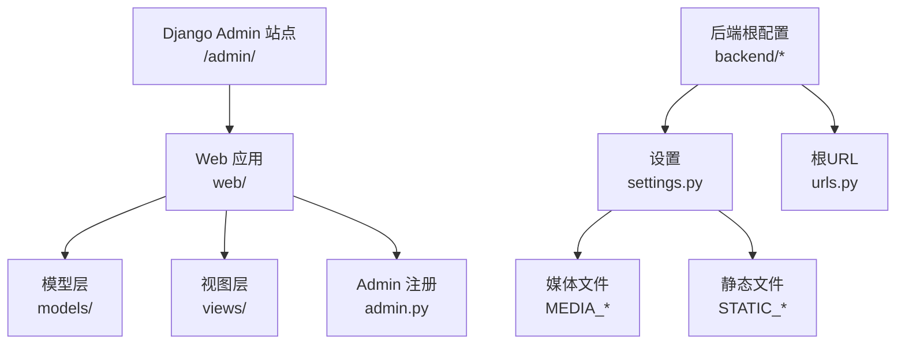
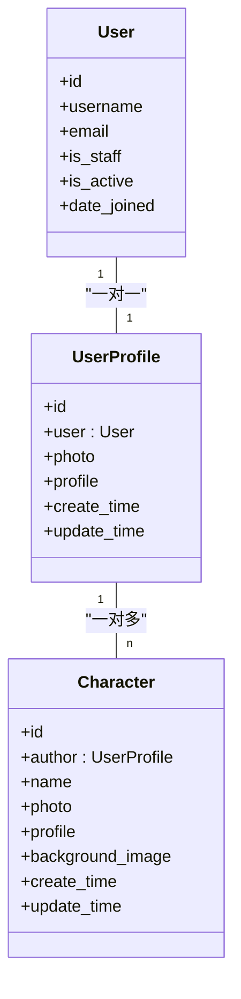
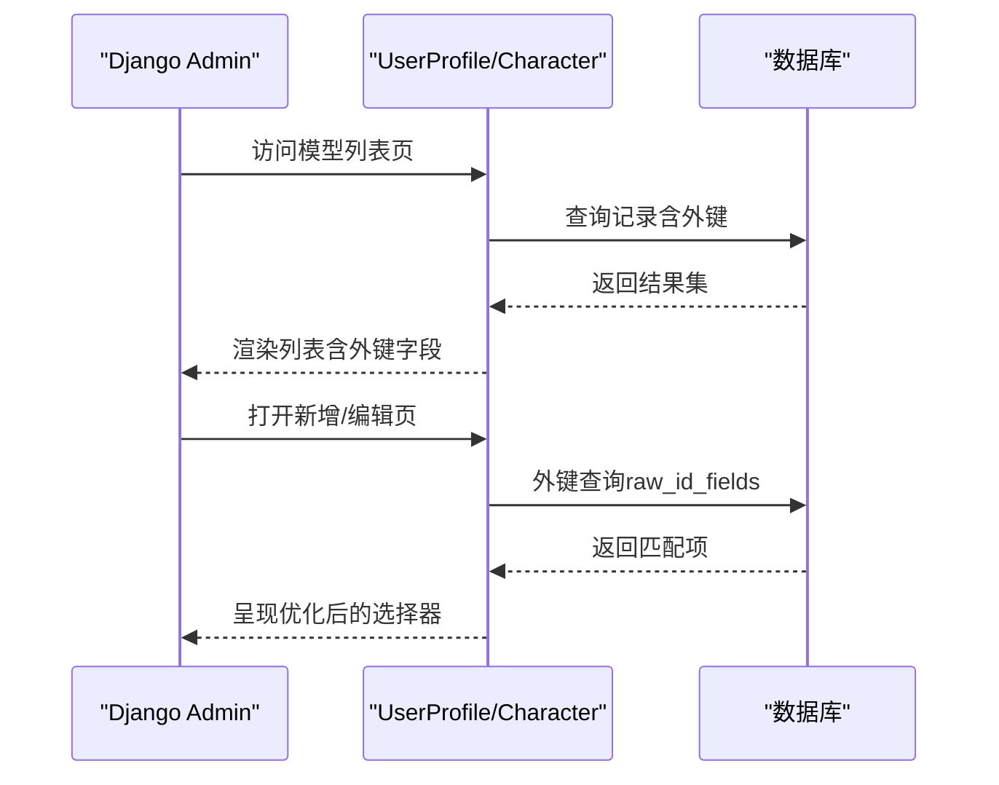
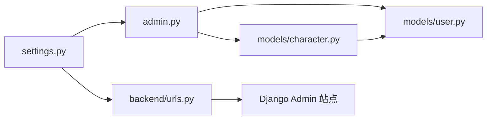

# 管理员后台配置

<cite>
**本文档引用的文件**
- [backend/web/admin.py](file://backend/web/admin.py)
- [backend/web/models/user.py](file://backend/web/models/user.py)
- [backend/web/models/character.py](file://backend/web/models/character.py)
- [backend/web/migrations/0001_initial.py](file://backend/web/migrations/0001_initial.py)
- [backend/web/migrations/0002_character.py](file://backend/web/migrations/0002_character.py)
- [backend/backend/settings.py](file://backend/backend/settings.py)
- [backend/backend/urls.py](file://backend/backend/urls.py)
- [backend/web/views/create/character/create.py](file://backend/web/views/create/character/create.py)
</cite>

## 目录
1. [简介](#简介)
2. [项目结构](#项目结构)
3. [核心组件](#核心组件)
4. [架构总览](#架构总览)
5. [详细组件分析](#详细组件分析)
6. [依赖分析](#依赖分析)
7. [性能考虑](#性能考虑)
8. [故障排除指南](#故障排除指南)
9. [结论](#结论)
10. [附录](#附录)

## 简介
本文件面向LLM_AIfriends项目的Django管理员后台，聚焦于admin.py中User模型与Character模型的注册配置，解释管理界面的显示方式、自定义配置（列表字段、搜索、过滤、排序）、权限控制与用户组管理、自定义操作与批量导出能力、国际化与主题定制、密码重置与会话安全，以及如何扩展管理界面以满足业务需求。由于当前仓库中admin.py的实现较为精简，本文将基于现有代码进行严谨分析，并提供可落地的扩展建议。

## 项目结构
管理员后台位于Django应用web内，通过Django内置的admin站点对外提供管理界面。项目采用前后端分离架构：前端由Vue构建，后端提供REST API与Django Admin；静态资源与媒体文件在settings中统一配置；URL路由在backend/urls.py中聚合到admin与web应用。

图表来源
- [backend/backend/urls.py:22-25](file://backend/backend/urls.py#L22-L25)
- [backend/backend/settings.py:119-131](file://backend/backend/settings.py#L119-L131)

章节来源
- [backend/backend/urls.py:17-25](file://backend/backend/urls.py#L17-L25)
- [backend/backend/settings.py:33-43](file://backend/backend/settings.py#L33-L43)

## 核心组件
- 模型层
  - UserProfile：一对一关联Django内置User，用于存储用户头像、个人简介等信息。
  - Character：角色模型，外键关联UserProfile，用于存储角色头像、背景图、简介等。
- Admin注册
  - UserProfileAdmin：通过装饰器注册，启用raw_id_fields优化外键选择。
  - CharacterAdmin：通过装饰器注册，启用raw_id_fields优化外键选择。
- 路由与静态资源
  - 根URL将/admin/路由至Django admin站点。
  - 开发环境开启/media/静态文件服务，便于图片上传预览。

章节来源
- [backend/web/admin.py:6-13](file://backend/web/admin.py#L6-L13)
- [backend/web/models/user.py:14-22](file://backend/web/models/user.py#L14-L22)
- [backend/web/models/character.py:21-31](file://backend/web/models/character.py#L21-L31)
- [backend/backend/urls.py:22-25](file://backend/backend/urls.py#L22-L25)
- [backend/backend/settings.py:129-131](file://backend/backend/settings.py#L129-L131)

## 架构总览
Django Admin通过admin.py注册模型，结合settings.py中的应用与中间件配置，形成完整的管理界面。模型间的关系通过外键约束体现，Admin层通过raw_id_fields提升大表外键选择效率。

图表来源
- [backend/web/models/user.py:14-22](file://backend/web/models/user.py#L14-L22)
- [backend/web/models/character.py:21-31](file://backend/web/models/character.py#L21-L31)

## 详细组件分析

### 模型与Admin注册
- UserProfileAdmin
  - 使用装饰器注册UserProfile模型，启用raw_id_fields以优化外键选择体验。
  - 当外键字段数量较大时，raw_id_fields能显著降低下拉框渲染开销。
- CharacterAdmin
  - 使用装饰器注册Character模型，启用raw_id_fields以优化author外键选择。
  - 该字段通常指向UserProfile，通过raw_id_fields减少查询压力。

图表来源
- [backend/web/admin.py:6-13](file://backend/web/admin.py#L6-L13)

章节来源
- [backend/web/admin.py:6-13](file://backend/web/admin.py#L6-L13)

### 列表显示字段、搜索、过滤与排序
- 当前实现未显式声明list_display、search_fields、list_filter、ordering等Admin选项。
- 建议扩展方向：
  - 列表字段：在UserProfileAdmin中增加user.username、user.email、create_time等常用字段；在CharacterAdmin中增加author.user.username、name、create_time等。
  - 搜索字段：在UserProfileAdmin中加入user.username、user.email；在CharacterAdmin中加入name、author.user.username。
  - 过滤器：按create_time或update_time添加DateHierarchy；按author.user.username添加list_filter。
  - 排序：默认按create_time降序，确保最新数据优先展示。
- 以上扩展均通过在Admin类中添加相应属性完成，无需修改模型定义。

章节来源
- [backend/web/admin.py:6-13](file://backend/web/admin.py#L6-L13)

### 权限控制、用户组与权限分配
- Django Admin默认基于Django内置的auth权限体系工作。
- 建议策略：
  - 将管理员用户设置为is_staff=True，使其可登录Admin站点。
  - 通过用户组或直接赋予模型级权限（如web | userprofile | 可添加/更改/删除）精细化控制。
  - 对敏感操作（如批量删除）可限制为超级用户或特定组成员。
- 注意：当前仓库未见自定义权限或组的配置代码，上述为通用实践建议。

章节来源
- [backend/backend/settings.py:33-43](file://backend/backend/settings.py#L33-L43)

### 自定义操作按钮、批量操作与导出
- 当前未实现自定义动作或批量导出功能。
- 可选扩展：
  - 自定义动作：在Admin类中定义actions列表，绑定处理函数（如“标记已审核”、“发送通知”）。
  - 批量操作：利用Django Admin的勾选批量删除/更新能力，结合自定义动作实现。
  - 导出功能：可集成django-import-export或自定义CSV导出视图，配合Admin动作触发。
- 实施时需注意数据量与性能，建议分批导出或异步任务处理。

章节来源
- [backend/web/admin.py:6-13](file://backend/web/admin.py#L6-L13)

### 国际化与主题定制
- 国际化
  - settings.py中已配置LANGUAGE_CODE、TIME_ZONE、USE_I18N、USE_TZ等基础国际化参数。
  - 若需Admin界面本地化，可在settings中调整LANGUAGE_CODE为zh-hans等，并确保翻译文件可用。
- 主题定制
  - Django Admin支持通过自定义模板与静态资源覆盖默认样式。
  - 建议在项目中新增templates/admin/目录，复制默认Admin模板并进行局部修改，同时在settings.py中配置TEMPLATES以优先加载自定义模板。
  - 静态资源方面，可将自定义CSS/JS放置于static目录并通过Admin类的Media或自定义模板引入。

章节来源
- [backend/backend/settings.py:109-115](file://backend/backend/settings.py#L109-L115)
- [backend/backend/settings.py:58-71](file://backend/backend/settings.py#L58-L71)

### 密码重置、会话管理与安全防护
- 密码重置
  - Django Admin自带“忘记密码”流程，可通过站点管理页面重置管理员密码。
- 会话管理
  - settings.py中启用了会话中间件与CSRF保护，建议在生产环境启用HTTPS与安全Cookie标志。
- 安全防护
  - 已启用SecurityMiddleware、CSRF校验、X-Frame-Options等基础安全中间件。
  - 建议在生产环境加固：限制登录尝试次数、启用强密码验证、定期轮换SECRET_KEY、严格配置ALLOWED_HOSTS。

章节来源
- [backend/backend/settings.py:45-54](file://backend/backend/settings.py#L45-L54)
- [backend/backend/settings.py:22-28](file://backend/backend/settings.py#L22-L28)

### 扩展管理界面以满足业务需求
- 基于现有模型关系，可扩展如下功能：
  - 在UserProfileAdmin中嵌入CharacterInline，实现角色与用户的关联编辑。
  - 在CharacterAdmin中增加富文本编辑器、图片预览、时间范围筛选等。
  - 添加统计面板（如每日新增角色数），通过自定义Admin视图或第三方插件实现。
- 实施步骤：
  - 在admin.py中定义Inline类与自定义Admin视图。
  - 在urls.py中为Admin扩展添加独立URL入口（如需要）。
  - 在settings.py中确保静态资源与模板路径正确配置。

章节来源
- [backend/web/admin.py:6-13](file://backend/web/admin.py#L6-L13)
- [backend/backend/urls.py:22-25](file://backend/backend/urls.py#L22-L25)

## 依赖分析
- 模型依赖
  - Character.author -> UserProfile.id
  - UserProfile.user -> Django User.id
- Admin依赖
  - admin.py注册UserProfile与Character，依赖对应模型定义。
- 路由依赖
  - backend/urls.py将/admin/路由至Django admin站点，web/urls.py提供API路由。
- 配置依赖
  - settings.py中的INSTALLED_APPS、MIDDLEWARE、TEMPLATES、MEDIA_*等决定Admin行为与静态资源访问。

图表来源
- [backend/web/admin.py:6-13](file://backend/web/admin.py#L6-L13)
- [backend/web/models/user.py:14-22](file://backend/web/models/user.py#L14-L22)
- [backend/web/models/character.py:21-31](file://backend/web/models/character.py#L21-L31)
- [backend/backend/urls.py:22-25](file://backend/backend/urls.py#L22-L25)
- [backend/backend/settings.py:33-43](file://backend/backend/settings.py#L33-L43)

章节来源
- [backend/web/admin.py:6-13](file://backend/web/admin.py#L6-L13)
- [backend/web/models/user.py:14-22](file://backend/web/models/user.py#L14-L22)
- [backend/web/models/character.py:21-31](file://backend/web/models/character.py#L21-L31)
- [backend/backend/urls.py:22-25](file://backend/backend/urls.py#L22-L25)
- [backend/backend/settings.py:33-43](file://backend/backend/settings.py#L33-L43)

## 性能考虑
- raw_id_fields优化
  - 在UserProfileAdmin与CharacterAdmin中已启用raw_id_fields，有助于减少外键下拉框渲染成本。
- 列表页性能
  - 建议在Admin类中添加select_related或prefetch_related，避免N+1查询。
  - 控制list_display字段数量，避免过多数据库JOIN。
- 媒体文件
  - MEDIA_URL与MEDIA_ROOT在开发环境直接映射，生产环境应由反向代理提供，避免Django处理静态文件带来的性能损耗。

章节来源
- [backend/web/admin.py:8](file://backend/web/admin.py#L8)
- [backend/web/admin.py:13](file://backend/web/admin.py#L13)
- [backend/backend/settings.py:129-131](file://backend/backend/settings.py#L129-L131)

## 故障排除指南
- 管理员无法登录
  - 检查用户是否为is_staff=True；确认密码重置流程正常；核对登录IP与ALLOWED_HOSTS。
- 外键选择卡顿
  - 确认raw_id_fields已生效；检查外键字段所在表数据量；必要时添加索引或分页。
- 图片无法显示
  - 确认MEDIA_URL与MEDIA_ROOT配置正确；开发环境已开启/media/静态文件服务；生产环境需由Nginx提供静态资源。
- 自定义动作不生效
  - 确认Admin类中actions列表已正确定义；检查函数签名与返回值；确保Admin类已注册。

章节来源
- [backend/backend/settings.py:22-28](file://backend/backend/settings.py#L22-L28)
- [backend/backend/settings.py:129-131](file://backend/backend/settings.py#L129-L131)
- [backend/web/admin.py:6-13](file://backend/web/admin.py#L6-L13)

## 结论
当前仓库的Django Admin配置简洁而实用：通过装饰器注册模型并启用raw_id_fields优化外键选择。为进一步提升管理效率与安全性，建议补充列表字段、搜索、过滤与排序配置，完善权限与用户组管理，引入自定义动作与批量导出能力，并结合国际化与主题定制优化用户体验。同时，强化安全与性能配置，确保在生产环境稳定运行。

## 附录
- 数据库迁移
  - UserProfile与Character的初始迁移已在migrations目录中生成，确保Admin界面与数据库结构一致。
- API与Admin的关系
  - 后端API与Admin互不冲突：Admin用于内容管理，API用于前端交互。两者共享同一模型与数据库。

章节来源
- [backend/web/migrations/0001_initial.py:18-30](file://backend/web/migrations/0001_initial.py#L18-L30)
- [backend/web/migrations/0002_character.py:15-29](file://backend/web/migrations/0002_character.py#L15-L29)