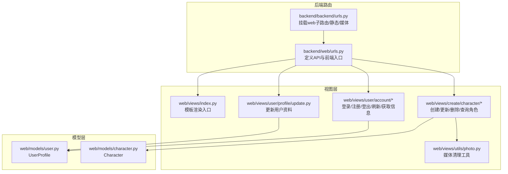
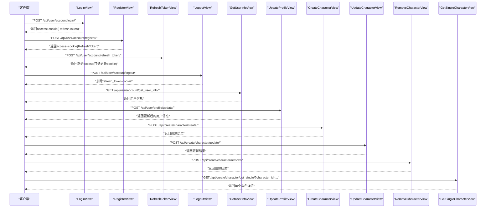
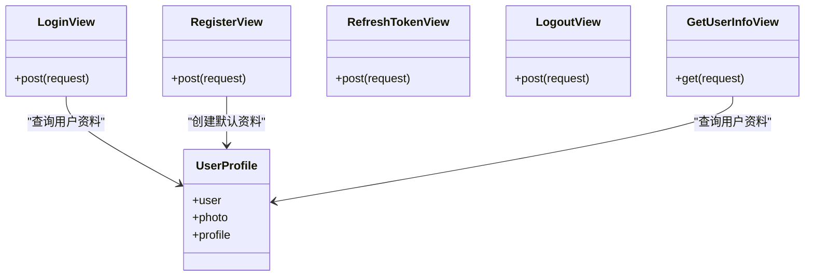
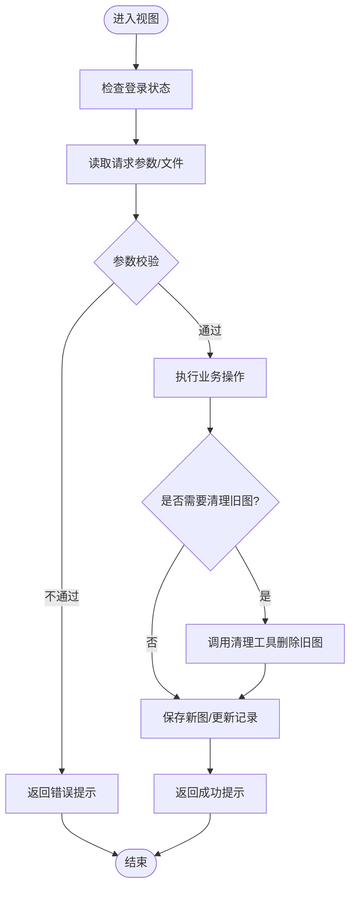
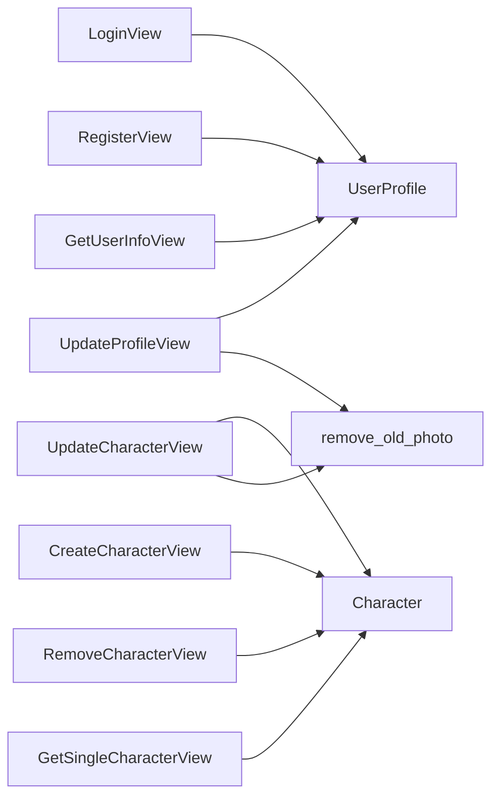

# 视图层设计

<cite>
**本文引用的文件**
- [backend/web/views/index.py](file://backend/web/views/index.py)
- [backend/web/views/user/account/login.py](file://backend/web/views/user/account/login.py)
- [backend/web/views/user/account/register.py](file://backend/web/views/user/account/register.py)
- [backend/web/views/user/account/logout.py](file://backend/web/views/user/account/logout.py)
- [backend/web/views/user/account/refresh_token.py](file://backend/web/views/user/account/refresh_token.py)
- [backend/web/views/user/account/get_user_info.py](file://backend/web/views/user/account/get_user_info.py)
- [backend/web/views/user/profile/update.py](file://backend/web/views/user/profile/update.py)
- [backend/web/views/create/character/create.py](file://backend/web/views/create/character/create.py)
- [backend/web/views/create/character/get_single.py](file://backend/web/views/create/character/get_single.py)
- [backend/web/views/create/character/update.py](file://backend/web/views/create/character/update.py)
- [backend/web/views/create/character/remove.py](file://backend/web/views/create/character/remove.py)
- [backend/web/views/utils/photo.py](file://backend/web/views/utils/photo.py)
- [backend/web/models/user.py](file://backend/web/models/user.py)
- [backend/web/models/character.py](file://backend/web/models/character.py)
- [backend/web/urls.py](file://backend/web/urls.py)
- [backend/backend/urls.py](file://backend/backend/urls.py)
</cite>

## 目录
1. [引言](#引言)
2. [项目结构](#项目结构)
3. [核心组件](#核心组件)
4. [架构总览](#架构总览)
5. [详细组件分析](#详细组件分析)
6. [依赖分析](#依赖分析)
7. [性能考虑](#性能考虑)
8. [故障排查指南](#故障排查指南)
9. [结论](#结论)
10. [附录](#附录)

## 引言
本文件面向LLM_AIfriends项目的Django视图层，聚焦基于类的视图（CBV）设计模式，系统梳理请求处理、响应格式化、异常处理与权限控制。文档重点覆盖用户认证相关视图（登录、注册、登出、Token刷新、获取用户信息）、角色管理视图（创建、更新、删除、查询单个角色），以及文件上传与媒体资源管理的实现细节。同时给出最佳实践建议，帮助开发者在保持业务逻辑清晰的同时，提升系统的可维护性与安全性。

## 项目结构
后端采用Django应用“web”承载业务视图与模型，路由通过“web/urls.py”集中定义；根路由“backend/backend/urls.py”挂载web子路由并配置静态与媒体资源服务。视图层以功能域划分：用户账户（account）、用户资料（profile）、角色创建（create/character）与通用工具（utils）。模板渲染入口位于“web/views/index.py”。

图表来源
- [backend/backend/urls.py:17-38](file://backend/backend/urls.py#L17-L38)
- [backend/web/urls.py:17-34](file://backend/web/urls.py#L17-L34)

章节来源
- [backend/backend/urls.py:17-38](file://backend/backend/urls.py#L17-L38)
- [backend/web/urls.py:17-34](file://backend/web/urls.py#L17-L34)

## 核心组件
- 基于类的视图（APIView）：统一使用REST框架的APIView作为基类，便于集成权限控制、序列化与响应封装。
- 权限控制：通过permission_classes强制登录校验，确保敏感操作仅对已认证用户开放。
- JWT与Cookie：登录成功发放Access Token并在响应体中返回；刷新Token时从Cookie读取Refresh Token并按需轮换，同时设置安全的HttpOnly Cookie。
- 文件上传与媒体管理：角色与用户头像均支持图片上传，采用自定义upload_to策略生成唯一文件名；提供旧图清理工具，避免磁盘冗余。
- 统一响应结构：所有视图返回包含“result”字段的标准响应，便于前端统一处理；错误场景返回明确提示文本。

章节来源
- [backend/web/views/user/account/login.py:9-46](file://backend/web/views/user/account/login.py#L9-L46)
- [backend/web/views/user/account/register.py:9-45](file://backend/web/views/user/account/register.py#L9-L45)
- [backend/web/views/user/account/logout.py:6-14](file://backend/web/views/user/account/logout.py#L6-L14)
- [backend/web/views/user/account/refresh_token.py:7-39](file://backend/web/views/user/account/refresh_token.py#L7-L39)
- [backend/web/views/user/profile/update.py:11-53](file://backend/web/views/user/profile/update.py#L11-L53)
- [backend/web/views/create/character/create.py:9-51](file://backend/web/views/create/character/create.py#L9-L51)
- [backend/web/views/utils/photo.py:6-11](file://backend/web/views/utils/photo.py#L6-L11)

## 架构总览
下图展示了用户认证与角色管理两大模块的视图交互流程，包括请求进入、权限校验、业务处理与响应返回的关键节点。

图表来源
- [backend/web/views/user/account/login.py:9-46](file://backend/web/views/user/account/login.py#L9-L46)
- [backend/web/views/user/account/register.py:9-45](file://backend/web/views/user/account/register.py#L9-L45)
- [backend/web/views/user/account/refresh_token.py:7-39](file://backend/web/views/user/account/refresh_token.py#L7-L39)
- [backend/web/views/user/account/logout.py:6-14](file://backend/web/views/user/account/logout.py#L6-L14)
- [backend/web/views/user/account/get_user_info.py:8-24](file://backend/web/views/user/account/get_user_info.py#L8-L24)
- [backend/web/views/user/profile/update.py:11-53](file://backend/web/views/user/profile/update.py#L11-L53)
- [backend/web/views/create/character/create.py:9-51](file://backend/web/views/create/character/create.py#L9-L51)
- [backend/web/views/create/character/update.py:10-46](file://backend/web/views/create/character/update.py#L10-L46)
- [backend/web/views/create/character/remove.py:9-25](file://backend/web/views/create/character/remove.py#L9-L25)
- [backend/web/views/create/character/get_single.py:8-28](file://backend/web/views/create/character/get_single.py#L8-L28)

## 详细组件分析

### 用户认证视图
- 登录（LoginView）
  - 请求处理：从请求体读取用户名与密码，去除空白字符；若为空则返回明确提示。
  - 身份验证：调用Django内置authenticate进行校验；成功后查询UserProfile并生成JWT Refresh Token。
  - 响应格式：返回“result”、“access”、“user_id”、“username”、“photo”、“profile”等字段；同时设置HttpOnly、Secure、SameSite=Lax的RefreshToken Cookie。
  - 异常处理：捕获异常并返回系统异常提示。
- 注册（RegisterView）
  - 请求处理：校验用户名与密码非空；检查用户名是否已存在。
  - 创建流程：创建User与UserProfile；生成JWT Refresh Token并返回access与用户信息；设置RefreshToken Cookie。
  - 异常处理：捕获异常并返回系统异常提示。
- 刷新（RefreshTokenView）
  - 请求处理：从Cookie读取RefreshToken；若缺失返回401与提示。
  - 刷新逻辑：构造RefreshToken对象；根据配置决定是否轮换JTI；返回新的access；必要时更新Cookie。
  - 异常处理：捕获异常并返回401与过期提示。
- 登出（LogoutView）
  - 权限控制：强制登录；未登录直接拒绝。
  - 行为：返回成功提示并删除RefreshToken Cookie。
- 获取用户信息（GetUserInfoView）
  - 权限控制：强制登录。
  - 返回：用户基本信息与头像URL、简介。

图表来源
- [backend/web/views/user/account/login.py:9-46](file://backend/web/views/user/account/login.py#L9-L46)
- [backend/web/views/user/account/register.py:9-45](file://backend/web/views/user/account/register.py#L9-L45)
- [backend/web/views/user/account/refresh_token.py:7-39](file://backend/web/views/user/account/refresh_token.py#L7-L39)
- [backend/web/views/user/account/logout.py:6-14](file://backend/web/views/user/account/logout.py#L6-L14)
- [backend/web/views/user/account/get_user_info.py:8-24](file://backend/web/views/user/account/get_user_info.py#L8-L24)
- [backend/web/models/user.py:14-23](file://backend/web/models/user.py#L14-L23)

章节来源
- [backend/web/views/user/account/login.py:9-46](file://backend/web/views/user/account/login.py#L9-L46)
- [backend/web/views/user/account/register.py:9-45](file://backend/web/views/user/account/register.py#L9-L45)
- [backend/web/views/user/account/logout.py:6-14](file://backend/web/views/user/account/logout.py#L6-L14)
- [backend/web/views/user/account/refresh_token.py:7-39](file://backend/web/views/user/account/refresh_token.py#L7-L39)
- [backend/web/views/user/account/get_user_info.py:8-24](file://backend/web/views/user/account/get_user_info.py#L8-L24)

### 角色管理视图
- 创建角色（CreateCharacterView）
  - 权限控制：强制登录。
  - 参数校验：名称、简介、头像、聊天背景均不能为空。
  - 业务逻辑：创建Character记录，返回成功提示。
- 更新角色（UpdateCharacterView）
  - 权限控制：强制登录。
  - 参数校验：名称与简介非空；可选更新头像与背景图。
  - 旧图清理：当提供新图片时，先调用工具清理旧图，再保存新图。
  - 时间戳：更新时间字段。
- 删除角色（RemoveCharacterView）
  - 权限控制：强制登录。
  - 业务逻辑：删除前清理头像与背景图，再删除记录。
- 查询单个角色（GetSingleCharacterView）
  - 权限控制：强制登录。
  - 安全约束：仅允许查询当前用户作者下的角色。
  - 返回：角色详情（含图片URL）。

图表来源
- [backend/web/views/create/character/create.py:9-51](file://backend/web/views/create/character/create.py#L9-L51)
- [backend/web/views/create/character/update.py:10-46](file://backend/web/views/create/character/update.py#L10-L46)
- [backend/web/views/create/character/remove.py:9-25](file://backend/web/views/create/character/remove.py#L9-L25)
- [backend/web/views/utils/photo.py:6-11](file://backend/web/views/utils/photo.py#L6-L11)

章节来源
- [backend/web/views/create/character/create.py:9-51](file://backend/web/views/create/character/create.py#L9-L51)
- [backend/web/views/create/character/get_single.py:8-28](file://backend/web/views/create/character/get_single.py#L8-L28)
- [backend/web/views/create/character/update.py:10-46](file://backend/web/views/create/character/update.py#L10-L46)
- [backend/web/views/create/character/remove.py:9-25](file://backend/web/views/create/character/remove.py#L9-L25)
- [backend/web/views/utils/photo.py:6-11](file://backend/web/views/utils/photo.py#L6-L11)

### 用户资料视图
- 更新用户资料（UpdateProfileView）
  - 权限控制：强制登录。
  - 参数校验：用户名与简介非空；用户名唯一性检查。
  - 图片更新：可选更新头像，旧图清理后保存新图。
  - 返回：更新后的用户信息（含头像URL）。

章节来源
- [backend/web/views/user/profile/update.py:11-53](file://backend/web/views/user/profile/update.py#L11-L53)

### 模板入口与前端路由
- 模板入口（index）
  - 渲染“index.html”，用于SPA前端接管。
- 路由配置
  - 根路由挂载web子路由；开发环境开启静态与媒体资源服务；未匹配到API路径时回退到前端入口，交由前端路由处理。

章节来源
- [backend/web/views/index.py:1-6](file://backend/web/views/index.py#L1-L6)
- [backend/web/urls.py:17-34](file://backend/web/urls.py#L17-L34)
- [backend/backend/urls.py:17-38](file://backend/backend/urls.py#L17-L38)

## 依赖分析
- 视图与模型
  - 用户相关视图依赖UserProfile模型；角色相关视图依赖Character模型。
  - 两者均通过外键关联到Django内置User模型。
- 视图与工具
  - 角色与用户资料的图片更新均依赖“remove_old_photo”工具，确保旧图清理。
- 路由与视图
  - 所有API路由集中在web/urls.py中，根路由backend/urls.py统一挂载。

图表来源
- [backend/web/views/user/account/login.py:9-46](file://backend/web/views/user/account/login.py#L9-L46)
- [backend/web/views/user/account/register.py:9-45](file://backend/web/views/user/account/register.py#L9-L45)
- [backend/web/views/user/account/get_user_info.py:8-24](file://backend/web/views/user/account/get_user_info.py#L8-L24)
- [backend/web/views/user/profile/update.py:11-53](file://backend/web/views/user/profile/update.py#L11-L53)
- [backend/web/views/create/character/create.py:9-51](file://backend/web/views/create/character/create.py#L9-L51)
- [backend/web/views/create/character/update.py:10-46](file://backend/web/views/create/character/update.py#L10-L46)
- [backend/web/views/create/character/remove.py:9-25](file://backend/web/views/create/character/remove.py#L9-L25)
- [backend/web/views/create/character/get_single.py:8-28](file://backend/web/views/create/character/get_single.py#L8-L28)
- [backend/web/views/utils/photo.py:6-11](file://backend/web/views/utils/photo.py#L6-L11)
- [backend/web/models/user.py:14-23](file://backend/web/models/user.py#L14-L23)
- [backend/web/models/character.py:21-32](file://backend/web/models/character.py#L21-L32)

章节来源
- [backend/web/models/user.py:14-23](file://backend/web/models/user.py#L14-L23)
- [backend/web/models/character.py:21-32](file://backend/web/models/character.py#L21-L32)

## 性能考虑
- 文件上传
  - 使用流式写入与唯一文件名策略，避免同名冲突；建议在生产环境限制文件大小与类型，并启用CDN加速媒体资源。
- 数据库查询
  - 角色查询严格限定作者为当前用户，避免越权；建议在Character表上为author与create_time建立索引以优化查询。
- 缓存与Cookie
  - Access Token短时有效，Refresh Token通过Cookie存储；建议在网关层缓存常用用户信息，减少数据库压力。
- 异常处理
  - 统一捕获异常并返回友好提示，避免泄露内部错误；对频繁失败的登录尝试可引入速率限制。

## 故障排查指南
- 登录失败
  - 确认用户名与密码非空且正确；检查UserProfile是否存在；查看Cookie是否被浏览器阻止。
- 注册失败
  - 检查用户名是否重复；确认用户与资料表创建流程是否完整。
- 刷新失败
  - 检查Cookie中RefreshToken是否存在且未过期；确认settings中的JWT配置（如轮换开关）。
- 更新/删除角色失败
  - 确认当前用户是否为角色作者；检查文件上传是否成功；查看旧图清理是否执行。
- 获取用户信息失败
  - 确认已登录且用户资料存在；检查返回字段是否正确解析。

章节来源
- [backend/web/views/user/account/login.py:9-46](file://backend/web/views/user/account/login.py#L9-L46)
- [backend/web/views/user/account/register.py:9-45](file://backend/web/views/user/account/register.py#L9-L45)
- [backend/web/views/user/account/refresh_token.py:7-39](file://backend/web/views/user/account/refresh_token.py#L7-L39)
- [backend/web/views/create/character/update.py:10-46](file://backend/web/views/create/character/update.py#L10-L46)
- [backend/web/views/create/character/remove.py:9-25](file://backend/web/views/create/character/remove.py#L9-L25)
- [backend/web/views/user/account/get_user_info.py:8-24](file://backend/web/views/user/account/get_user_info.py#L8-L24)

## 结论
本项目视图层采用统一的CBV模式与REST风格设计，结合权限控制、JWT与Cookie管理、文件上传与媒体清理，形成了清晰的用户认证与角色管理能力。通过标准化的响应结构与完善的异常处理，提升了系统的稳定性与可维护性。建议在生产环境中进一步完善速率限制、资源压缩与CDN配置，持续优化用户体验与系统性能。

## 附录
- 响应数据结构约定
  - 成功响应：包含“result”: “success”与业务字段（如access、user_id、username、photo、profile、character等）。
  - 失败响应：包含“result”: “...”的错误提示文本；刷新Token失败时返回401状态码。
- HTTP状态码使用
  - 401：缺少或无效的RefreshToken；登出/刷新等需要登录的操作在未登录时也应返回401。
  - 200：正常成功响应。
- 最佳实践
  - 业务逻辑与视图解耦：将复杂逻辑下沉至模型或服务层，视图仅负责参数接收、校验与响应。
  - 权限前置：尽量在permission_classes中完成基础鉴权，减少分支判断。
  - 错误统一：集中处理异常，避免裸异常传播；对敏感信息进行脱敏。
  - 文件安全：限制文件类型与大小，定期清理无效文件，避免磁盘膨胀。