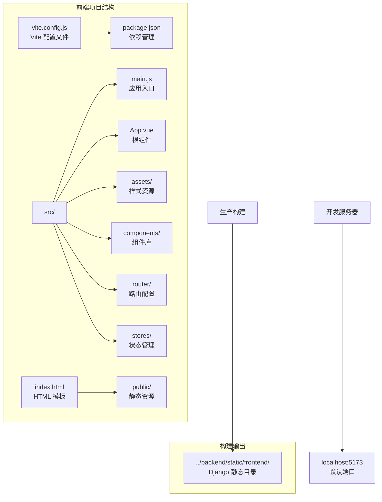
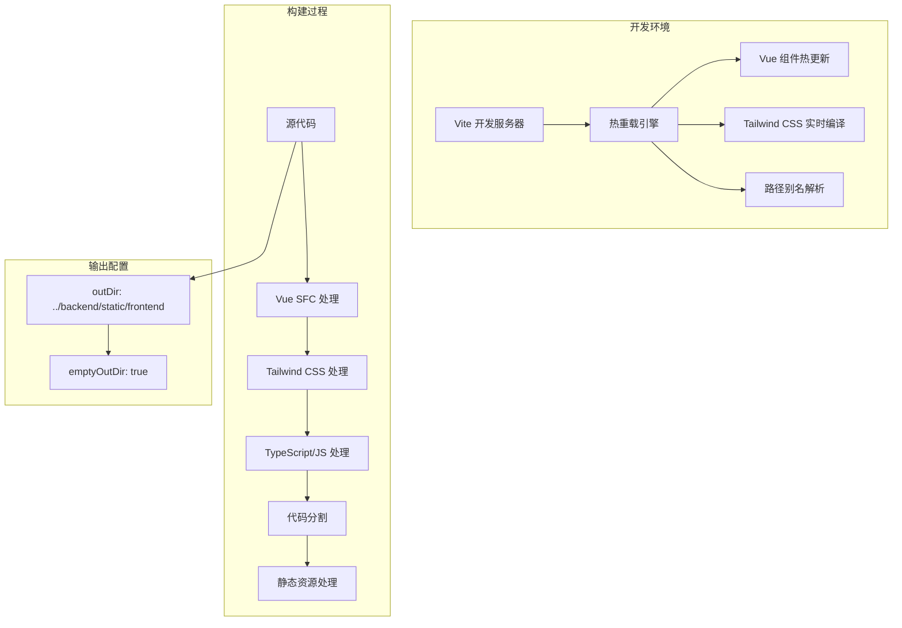
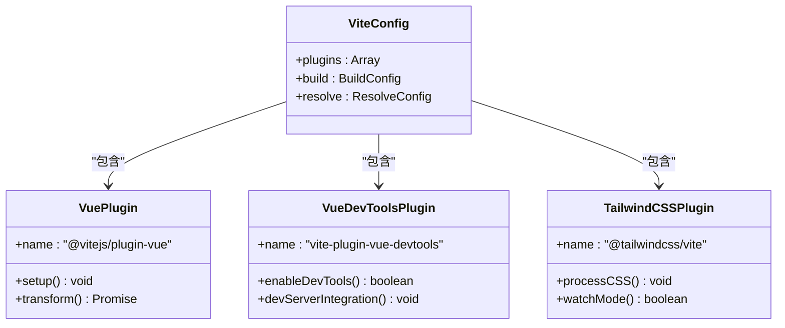
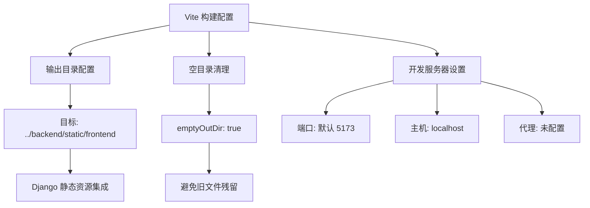
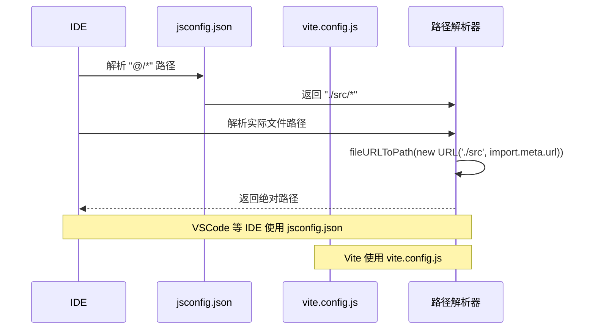
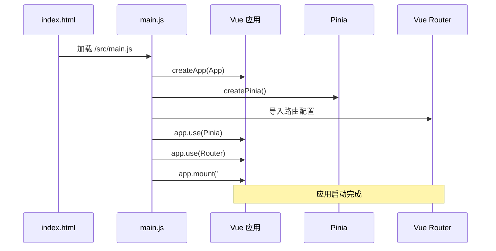
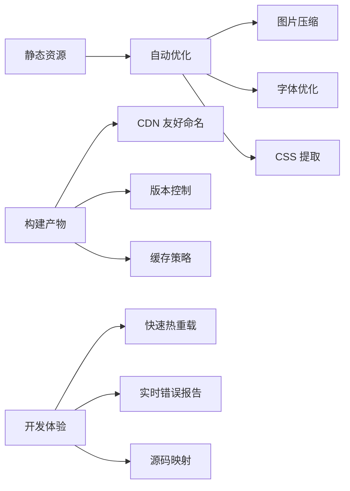

# 前端构建配置

<cite>
**本文档引用的文件**
- [vite.config.js](file://frontend/vite.config.js)
- [package.json](file://frontend/package.json)
- [jsconfig.json](file://frontend/jsconfig.json)
- [main.js](file://frontend/src/main.js)
- [index.html](file://frontend/index.html)
- [App.vue](file://frontend/src/App.vue)
- [main.css](file://frontend/src/assets/main.css)
</cite>

## 目录
1. [简介](#简介)
2. [项目结构](#项目结构)
3. [核心组件](#核心组件)
4. [架构概览](#架构概览)
5. [详细组件分析](#详细组件分析)
6. [依赖关系分析](#依赖关系分析)
7. [性能考虑](#性能考虑)
8. [故障排除指南](#故障排除指南)
9. [结论](#结论)

## 简介

本文件为 LLM_AIfriends 项目的前端构建配置详细文档，专注于 Vite 构建系统的配置与使用。该配置采用现代化的前端开发工具链，集成了 Vue 3、Tailwind CSS 和开发工具支持，为项目提供了高效的开发体验和优化的生产构建。

该项目采用前后端分离架构，前端通过 Vite 进行构建，输出到 Django 后端的静态资源目录中，实现了无缝的全栈集成。

## 项目结构

LLM_AIfriends 前端项目采用标准的 Vite + Vue 3 项目结构，主要目录组织如下：



**图表来源**
- [vite.config.js:1-26](file://frontend/vite.config.js#L1-L26)
- [package.json:1-30](file://frontend/package.json#L1-L30)

**章节来源**
- [vite.config.js:1-26](file://frontend/vite.config.js#L1-L26)
- [package.json:1-30](file://frontend/package.json#L1-L30)

## 核心组件

### Vite 构建系统配置

Vite 作为现代前端构建工具，提供了快速的开发服务器和高效的生产构建能力。在本项目中，Vite 配置经过精心优化以适应 Vue 3 应用的需求。

#### 插件生态系统

项目集成了三个核心插件，每个都发挥着重要作用：

1. **@vitejs/plugin-vue**: Vue 3 单文件组件支持
2. **vite-plugin-vue-devtools**: Vue 开发者工具集成
3. **@tailwindcss/vite**: Tailwind CSS 工具集支持

#### 路径别名配置

项目使用 `@` 作为源代码的根路径别名，简化了模块导入路径：

```mermaid
flowchart LR
A[源代码路径] --> B[@ 别名解析]
B --> C[fileURLToPath(new URL('./src', import.meta.url))]
C --> D[实际文件路径映射]
E[jsconfig.json] --> F[IDE 路径提示]
F --> G["@/* -> ./src/*"]
```

**图表来源**
- [vite.config.js:20-24](file://frontend/vite.config.js#L20-L24)
- [jsconfig.json:3-5](file://frontend/jsconfig.json#L3-L5)

**章节来源**
- [vite.config.js:10-25](file://frontend/vite.config.js#L10-L25)
- [jsconfig.json:1-9](file://frontend/jsconfig.json#L1-L9)

## 架构概览

### 构建系统架构



**图表来源**
- [vite.config.js:10-25](file://frontend/vite.config.js#L10-L25)

### 依赖关系图

```mermaid
graph LR
subgraph "运行时依赖"
A[vue@^3.5.26] --> B[Vue 3 核心]
C[vue-router@^4.6.4] --> D[路由管理]
E[pinia@^3.0.4] --> F[状态管理]
G[axios@^1.13.2] --> H[HTTP 客户端]
I[tailwindcss@^4.1.18] --> J[CSS 框架]
K[croppie@^2.6.5] --> L[图片裁剪]
M[daisyui@^5.5.14] --> N[UI 组件库]
end
subgraph "开发依赖"
O[@vitejs/plugin-vue@^6.0.3] --> P[Vue 支持]
Q[vite@^7.3.0] --> R[构建工具]
S[vite-plugin-vue-devtools@^8.0.5] --> T[开发者工具]
U[@tailwindcss/vite@^4.1.18] --> V[Tailwind 集成]
end
```

**图表来源**
- [package.json:14-28](file://frontend/package.json#L14-L28)

**章节来源**
- [package.json:1-30](file://frontend/package.json#L1-L30)

## 详细组件分析

### Vite 配置详解

#### 插件配置分析



**图表来源**
- [vite.config.js:11-15](file://frontend/vite.config.js#L11-L15)

#### 构建配置分析



**图表来源**
- [vite.config.js:16-19](file://frontend/vite.config.js#L16-L19)

**章节来源**
- [vite.config.js:10-25](file://frontend/vite.config.js#L10-L25)

### 路径别名系统

#### 别名配置实现



**图表来源**
- [jsconfig.json:3-5](file://frontend/jsconfig.json#L3-L5)
- [vite.config.js:20-24](file://frontend/vite.config.js#L20-L24)

#### 路径解析流程

```mermaid
flowchart LR
A[import '@/components/Example'] --> B[IDE 解析]
B --> C[jsconfig.json: "@/*": ["./src/*"]]
C --> D[VSCode 路径补全]
A --> E[Vite 解析]
E --> F[vite.config.js: alias '@': ...]
F --> G[fileURLToPath URL 映射]
G --> H[实际文件路径]
D --> I[开发体验优化]
H --> J[构建时正确解析]
```

**图表来源**
- [jsconfig.json:3-5](file://frontend/jsconfig.json#L3-L5)
- [vite.config.js:20-24](file://frontend/vite.config.js#L20-L24)

**章节来源**
- [jsconfig.json:1-9](file://frontend/jsconfig.json#L1-L9)
- [vite.config.js:20-24](file://frontend/vite.config.js#L20-L24)

### 样式系统配置

#### Tailwind CSS 集成

```mermaid
graph TB
A[main.css] --> B[@import "tailwindcss"]
A --> C[@plugin "daisyui"]
D[Tailwind 配置] --> E[基础样式]
D --> F[响应式设计]
D --> G[组件系统]
H[DaisyUI 集成] --> I[预设组件]
H --> J[主题定制]
H --> K[交互效果]
E --> L[构建输出]
F --> L
G --> L
I --> L
J --> L
K --> L
```

**图表来源**
- [main.css:1-3](file://frontend/src/assets/main.css#L1-L3)

**章节来源**
- [main.css:1-3](file://frontend/src/assets/main.css#L1-L3)

### 应用入口配置

#### 主应用初始化流程



**图表来源**
- [index.html:11](file://frontend/index.html#L11)
- [main.js:1-15](file://frontend/src/main.js#L1-L15)

**章节来源**
- [index.html:1-14](file://frontend/index.html#L1-L14)
- [main.js:1-15](file://frontend/src/main.js#L1-L15)

## 依赖关系分析

### 依赖层次结构

```mermaid
graph TD
subgraph "应用层"
A[Vue 应用] --> B[Vue Router]
A --> C[Pinia 状态管理]
A --> D[Axios HTTP 客户端]
end
subgraph "样式层"
E[Vue 应用] --> F[Tailwind CSS]
F --> G[DaisyUI 组件库]
end
subgraph "构建层"
H[Vite] --> I[@vitejs/plugin-vue]
H --> J[vite-plugin-vue-devtools]
H --> K[@tailwindcss/vite]
end
subgraph "开发工具"
L[Node.js ^20.19.0 || >=22.12.0] --> M[Vite 开发服务器]
M --> N[热重载功能]
end
subgraph "后端集成"
O[构建输出] --> P[Django static/frontend]
P --> Q[静态资源服务]
end
A --> O
I --> H
J --> H
K --> H
```

**图表来源**
- [package.json:14-28](file://frontend/package.json#L14-L28)

### 版本兼容性分析

项目对 Node.js 版本有明确要求，确保开发环境的一致性：

- **Node.js**: ^20.19.0 || >=22.12.0
- **Vite**: ^7.3.0
- **Vue**: ^3.5.26
- **Vue DevTools**: ^8.0.5

**章节来源**
- [package.json:6-8](file://frontend/package.json#L6-L8)

## 性能考虑

### 构建优化策略

虽然当前配置相对简洁，但已具备良好的性能基础：

1. **代码分割**: Vite 自动进行代码分割，按需加载路由组件
2. **Tree Shaking**: 通过 ES 模块系统实现无用代码消除
3. **缓存策略**: 开发服务器内存缓存，提升热重载速度
4. **压缩优化**: 生产构建自动进行代码压缩和资源优化

### 资源处理优化



## 故障排除指南

### 常见问题及解决方案

#### 路径解析问题

**问题**: 导入路径无法解析
**原因**: 路径别名配置不匹配
**解决方案**:
1. 检查 `jsconfig.json` 中的路径映射
2. 验证 `vite.config.js` 中的别名配置
3. 确保路径大小写正确

#### 开发服务器问题

**问题**: 开发服务器无法启动
**原因**: 端口被占用或 Node.js 版本不兼容
**解决方案**:
1. 检查 Node.js 版本是否满足要求
2. 更改开发服务器端口配置
3. 清理 npm 缓存并重新安装依赖

#### 样式加载问题

**问题**: Tailwind CSS 样式未生效
**原因**: CSS 导入顺序或配置问题
**解决方案**:
1. 确认 `main.css` 中的 @import 语句
2. 检查 Tailwind 配置文件是否存在
3. 验证 daisyui 插件正确集成

**章节来源**
- [vite.config.js:10-25](file://frontend/vite.config.js#L10-L25)
- [package.json:6-8](file://frontend/package.json#L6-L8)

## 结论

LLM_AIfriends 项目的前端构建配置展现了现代前端开发的最佳实践。通过精心设计的 Vite 配置，项目实现了：

1. **高效的开发体验**: 快速的热重载和实时错误反馈
2. **现代化的技术栈**: Vue 3 + TypeScript + Tailwind CSS 的完美结合
3. **无缝的后端集成**: 直接输出到 Django 静态资源目录
4. **清晰的项目结构**: 合理的模块化和路径别名配置

该配置为后续的功能扩展和性能优化奠定了坚实的基础。建议在保持现有配置优势的同时，根据项目发展需要逐步引入更高级的构建优化策略。