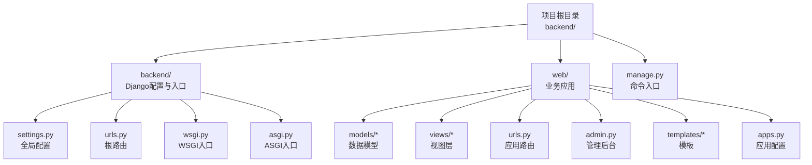
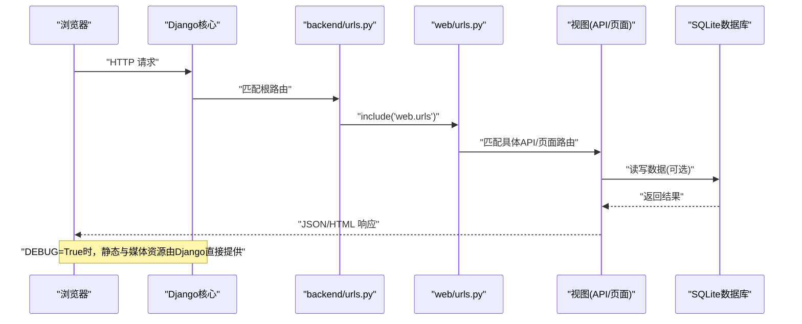
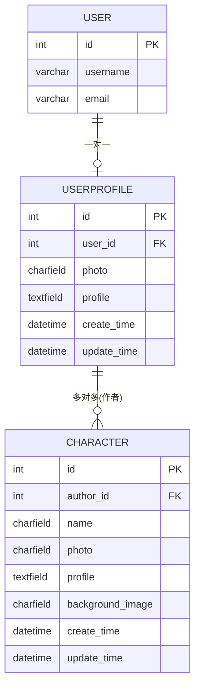
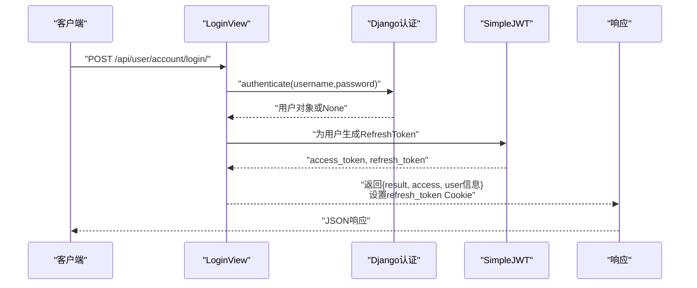
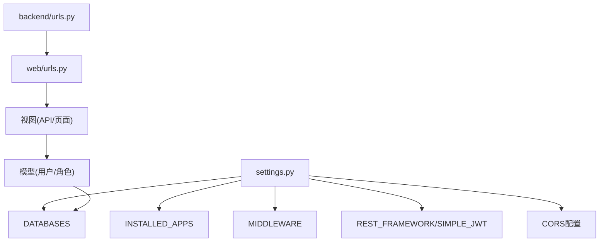

# 后端开发环境

<cite>
**本文引用的文件**
- [manage.py](file://backend/manage.py)
- [settings.py](file://backend/backend/settings.py)
- [urls.py](file://backend/backend/urls.py)
- [wsgi.py](file://backend/backend/wsgi.py)
- [asgi.py](file://backend/backend/asgi.py)
- [apps.py](file://backend/web/apps.py)
- [admin.py](file://backend/web/admin.py)
- [user.py](file://backend/web/models/user.py)
- [character.py](file://backend/web/models/character.py)
- [urls.py](file://backend/web/urls.py)
- [index.py](file://backend/web/views/index.py)
- [login.py](file://backend/web/views/user/account/login.py)
- [create.py](file://backend/web/views/create/character/create.py)
- [tests.py](file://backend/web/tests.py)
</cite>

## 目录
1. [简介](#简介)
2. [项目结构](#项目结构)
3. [核心组件](#核心组件)
4. [架构总览](#架构总览)
5. [详细组件分析](#详细组件分析)
6. [依赖分析](#依赖分析)
7. [性能考虑](#性能考虑)
8. [故障排查指南](#故障排查指南)
9. [结论](#结论)
10. [附录](#附录)

## 简介
本文件面向LLM_AIfriends后端开发团队，提供从零到一的开发环境搭建与运维指南。内容覆盖Django管理命令（如runserver、migrate、createsuperuser）的使用方法；开发环境配置、调试工具与数据库配置；Django应用启动流程、中间件与开发服务器特性；环境变量管理、日志配置与性能监控工具；以及开发工作流程优化与常见问题解决方案。目标是帮助开发者快速上手、稳定运行并高效迭代。

## 项目结构
后端采用标准Django项目布局，核心目录如下：
- backend：Django项目根目录
  - backend：Django配置与入口
  - web：业务应用，包含模型、视图、URL路由、管理后台等
  - manage.py：Django命令入口脚本
- frontend：前端资源（与后端联调时用于静态资源映射）

图表来源
- [settings.py:1-159](file://backend/backend/settings.py#L1-L159)
- [urls.py:1-38](file://backend/backend/urls.py#L1-L38)
- [wsgi.py:1-17](file://backend/backend/wsgi.py#L1-L17)
- [asgi.py:1-17](file://backend/backend/asgi.py#L1-L17)
- [apps.py:1-6](file://backend/web/apps.py#L1-L6)
- [admin.py:1-14](file://backend/web/admin.py#L1-L14)
- [user.py:1-23](file://backend/web/models/user.py#L1-L23)
- [character.py:1-32](file://backend/web/models/character.py#L1-L32)
- [urls.py:1-34](file://backend/web/urls.py#L1-L34)

章节来源
- [settings.py:1-159](file://backend/backend/settings.py#L1-L159)
- [urls.py:1-38](file://backend/backend/urls.py#L1-L38)
- [wsgi.py:1-17](file://backend/backend/wsgi.py#L1-L17)
- [asgi.py:1-17](file://backend/backend/asgi.py#L1-L17)
- [apps.py:1-6](file://backend/web/apps.py#L1-L6)
- [admin.py:1-14](file://backend/web/admin.py#L1-L14)
- [user.py:1-23](file://backend/web/models/user.py#L1-L23)
- [character.py:1-32](file://backend/web/models/character.py#L1-L32)
- [urls.py:1-34](file://backend/web/urls.py#L1-L34)

## 核心组件
- 命令入口与环境变量
  - manage.py负责设置DJANGO_SETTINGS_MODULE并执行命令行参数，确保在虚拟环境中正确加载settings。
- 全局配置
  - settings.py定义了应用列表、中间件、数据库、国际化、静态/媒体文件、REST框架与JWT、CORS等。
- 路由与根URL
  - backend/urls.py将/admin/与web应用路由聚合，并在DEBUG模式下提供静态与媒体文件服务。
- WSGI/ASGI入口
  - wsgi.py与asgi.py分别暴露WSGI与ASGI应用实例，供开发服务器与部署平台使用。
- 应用配置与管理后台
  - web/apps.py声明应用名称；web/admin.py注册用户档案与角色模型，提升管理效率。
- 数据模型
  - user.py定义用户档案模型，支持头像上传与个人简介；character.py定义角色模型，支持头像与背景图上传。
- 视图与路由
  - web/urls.py定义账户、资料与角色相关API路由；index.py提供SPA回退渲染；登录视图返回JWT与用户信息。

章节来源
- [manage.py:1-23](file://backend/manage.py#L1-L23)
- [settings.py:1-159](file://backend/backend/settings.py#L1-L159)
- [urls.py:1-38](file://backend/backend/urls.py#L1-L38)
- [wsgi.py:1-17](file://backend/backend/wsgi.py#L1-L17)
- [asgi.py:1-17](file://backend/backend/asgi.py#L1-L17)
- [apps.py:1-6](file://backend/web/apps.py#L1-L6)
- [admin.py:1-14](file://backend/web/admin.py#L1-L14)
- [user.py:1-23](file://backend/web/models/user.py#L1-L23)
- [character.py:1-32](file://backend/web/models/character.py#L1-L32)
- [urls.py:1-34](file://backend/web/urls.py#L1-L34)
- [index.py:1-6](file://backend/web/views/index.py#L1-L6)
- [login.py:1-46](file://backend/web/views/user/account/login.py#L1-L46)
- [create.py:1-51](file://backend/web/views/create/character/create.py#L1-L51)

## 架构总览
下图展示从浏览器请求到后端响应的关键路径，涵盖路由分发、视图处理与静态资源服务。

图表来源
- [urls.py:17-38](file://backend/backend/urls.py#L17-L38)
- [urls.py:17-34](file://backend/web/urls.py#L17-L34)
- [login.py:9-46](file://backend/web/views/user/account/login.py#L9-L46)
- [create.py:9-51](file://backend/web/views/create/character/create.py#L9-L51)
- [settings.py:79-84](file://backend/backend/settings.py#L79-L84)

## 详细组件分析

### Django管理命令与开发服务器
- 常用命令
  - 运行开发服务器：python manage.py runserver
  - 数据库迁移：python manage.py migrate
  - 创建超级用户：python manage.py createsuperuser
  - 收集静态文件（生产阶段）：python manage.py collectstatic
  - 创建应用：python manage.py startapp <app_name>
  - 执行测试：python manage.py test
- 环境变量
  - DJANGO_SETTINGS_MODULE：通过manage.py设置为backend.settings，确保Django加载正确的配置模块。
- 开发服务器特性
  - 自动重启：代码变更后自动重启开发服务器（Django内置）
  - 静态资源：DEBUG=True时，根路由中已挂载静态与媒体资源服务，便于前端联调
- 调试工具
  - DEBUG=True启用Django调试页与详细错误栈
  - 可结合IDE断点调试（PyCharm/VSCode等），或使用Django Debug Toolbar（需安装与配置）

章节来源
- [manage.py:7-18](file://backend/manage.py#L7-L18)
- [urls.py:28-38](file://backend/backend/urls.py#L28-L38)
- [settings.py:25-28](file://backend/backend/settings.py#L25-L28)

### 配置与中间件
- 中间件顺序
  - CORS中间件置于首位，确保跨域预检优先处理
  - 安全中间件、会话中间件、CSRF中间件、认证中间件、消息中间件、点击劫持防护按Django默认顺序排列
- 认证与权限
  - 默认认证类为REST Framework SimpleJWT
  - JWT访问令牌与刷新令牌生命周期可配置
- CORS与静态/媒体文件
  - 允许凭据与指定源
  - 开发阶段静态资源映射至BASE_DIR/static/frontend/assets与媒体资源映射至MEDIA_ROOT

章节来源
- [settings.py:45-54](file://backend/backend/settings.py#L45-L54)
- [settings.py:136-151](file://backend/backend/settings.py#L136-L151)
- [settings.py:153-159](file://backend/backend/settings.py#L153-L159)
- [urls.py:28-37](file://backend/backend/urls.py#L28-L37)

### 数据库与模型
- 数据库
  - 默认SQLite，数据库文件位于项目根目录下的db.sqlite3
- 模型设计
  - 用户档案UserProfile：一对一关联Django内置User，支持头像上传与个人简介
  - 角色Character：多对一关联UserProfile，支持头像与背景图上传
- 上传策略
  - 文件名使用UUID截断拼接，避免冲突与路径过长
  - 头像与背景图分别存放在user/photos与character/photos目录

图表来源
- [user.py:14-23](file://backend/web/models/user.py#L14-L23)
- [character.py:21-32](file://backend/web/models/character.py#L21-L32)

章节来源
- [settings.py:79-84](file://backend/backend/settings.py#L79-L84)
- [user.py:1-23](file://backend/web/models/user.py#L1-L23)
- [character.py:1-32](file://backend/web/models/character.py#L1-L32)

### 视图与路由
- 登录视图
  - 接收用户名与密码，鉴权成功后签发JWT并设置安全Cookie
  - 返回用户基本信息与头像URL
- 角色创建视图
  - 需要已认证用户，接收名称、简介、头像与背景图，校验必填项后创建记录
- 根路由与应用路由
  - 根路由聚合admin与web应用；web应用路由包含账户、资料与角色相关API
  - SPA回退路由匹配非媒体/静态资源请求，交由index视图渲染

图表来源
- [login.py:9-46](file://backend/web/views/user/account/login.py#L9-L46)
- [settings.py:136-151](file://backend/backend/settings.py#L136-L151)

章节来源
- [urls.py:17-34](file://backend/web/urls.py#L17-L34)
- [login.py:1-46](file://backend/web/views/user/account/login.py#L1-L46)
- [create.py:1-51](file://backend/web/views/create/character/create.py#L1-L51)
- [index.py:1-6](file://backend/web/views/index.py#L1-L6)

### 管理后台
- 注册模型
  - UserProfile与Character均注册到Django Admin，使用raw_id_fields提升大表查询体验
- 使用建议
  - 在本地开发环境通过createsuperuser创建管理员账号后，访问http://127.0.0.1:8000/admin/

章节来源
- [admin.py:6-14](file://backend/web/admin.py#L6-L14)

## 依赖分析
- 组件耦合
  - web应用依赖Django内置auth、contenttypes、sessions、messages等；同时集成REST Framework与SimpleJWT
  - 根URL包含web应用路由，形成清晰的分层
- 外部依赖
  - SQLite（默认）、CORSHeaders、Django REST Framework、SimpleJWT
- 潜在风险
  - DEBUG=True时，静态/媒体资源由Django提供，生产环境需改为Nginx代理
  - SQLite适合开发，生产建议迁移到PostgreSQL/MySQL

图表来源
- [settings.py:33-43](file://backend/backend/settings.py#L33-L43)
- [settings.py:45-54](file://backend/backend/settings.py#L45-L54)
- [settings.py:79-84](file://backend/backend/settings.py#L79-L84)
- [settings.py:136-151](file://backend/backend/settings.py#L136-L151)
- [settings.py:153-159](file://backend/backend/settings.py#L153-L159)
- [urls.py:22-25](file://backend/backend/urls.py#L22-L25)
- [urls.py:17-34](file://backend/web/urls.py#L17-L34)

章节来源
- [settings.py:1-159](file://backend/backend/settings.py#L1-L159)
- [urls.py:1-38](file://backend/backend/urls.py#L1-L38)
- [urls.py:1-34](file://backend/web/urls.py#L1-L34)

## 性能考虑
- 数据库
  - SQLite适合开发与小规模数据；如并发较高，建议迁移至PostgreSQL/MySQL
  - 对于频繁查询的字段（如UserProfile.user_id、Character.author_id）可考虑建立索引
- 静态与媒体
  - 开发阶段DEBUG=True时由Django提供；生产阶段务必由Nginx/Apache提供，减少Python进程压力
- 缓存
  - 可引入Redis缓存热点数据与会话（需额外配置）
- 日志
  - 建议配置文件日志与结构化日志，区分INFO/WARNING/ERROR级别，便于定位问题
- 监控
  - 可集成APM工具（如Sentry）捕获未处理异常与性能瓶颈
- 前端联调
  - 利用根路由中的静态与媒体资源映射，减少前后端分离带来的调试成本

[本节为通用指导，不直接分析具体文件]

## 故障排查指南
- 环境与依赖
  - ImportError: “无法导入Django”：确认已在虚拟环境中安装Django，且PYTHONPATH包含Django路径
  - 无法找到settings模块：检查manage.py中的DJANGO_SETTINGS_MODULE是否指向backend.settings
- 数据库
  - 迁移失败：执行migrate前先确认数据库连接字符串有效；必要时删除db.sqlite3重建
  - 权限问题：确保项目目录对当前用户可读写
- 跨域与认证
  - CORS报错：核对CORS_ALLOWED_ORIGINS与CORS_ALLOW_CREDENTIALS配置
  - 登录失败：确认用户名/密码正确；检查SimpleJWT配置与Cookie安全标志
- 静态与媒体
  - 媒体资源无法访问：确认MEDIA_URL/MEDIA_ROOT与根URL中的静态/媒体映射一致
- 开发服务器
  - 修改代码不生效：确认DEBUG=True；检查文件保存与自动重启机制

章节来源
- [manage.py:10-18](file://backend/manage.py#L10-L18)
- [settings.py:25-28](file://backend/backend/settings.py#L25-L28)
- [settings.py:153-159](file://backend/backend/settings.py#L153-L159)
- [urls.py:28-37](file://backend/backend/urls.py#L28-L37)

## 结论
本开发环境以Django为核心，结合REST Framework与SimpleJWT实现认证授权，配合SQLite与CORS满足快速迭代需求。通过明确的命令入口、清晰的路由分层与合理的中间件顺序，开发者可以高效完成功能开发与联调。建议在进入生产前完善数据库、缓存、日志与监控体系，并将静态/媒体资源切换至Nginx代理。

[本节为总结性内容，不直接分析具体文件]

## 附录
- 开发工作流程建议
  - 使用虚拟环境隔离依赖
  - 提交前执行migrate与test，确保迁移与测试通过
  - 使用版本控制管理settings.local.py（敏感配置）与.env（如需）
  - 将静态资源与媒体资源的生产部署交由Nginx处理
- 常用命令清单
  - 启动：python manage.py runserver
  - 迁移：python manage.py migrate
  - 创建超级用户：python manage.py createsuperuser
  - 收集静态：python manage.py collectstatic
  - 测试：python manage.py test

[本节为通用指导，不直接分析具体文件]