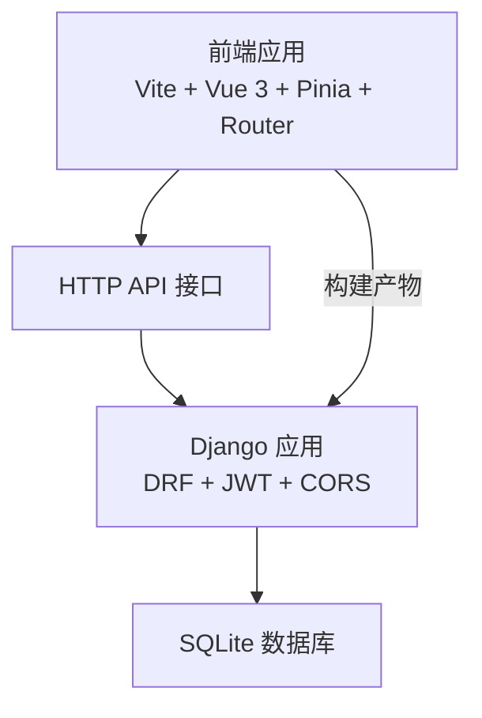
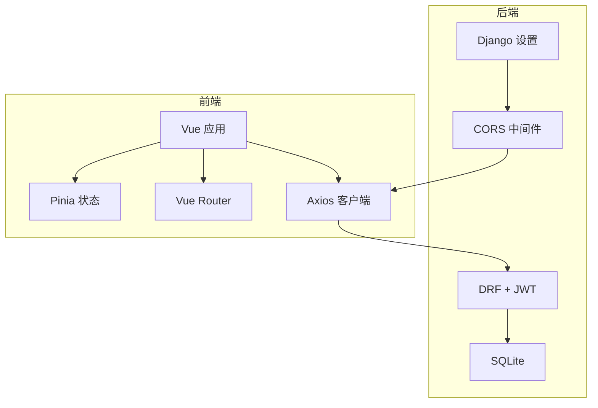
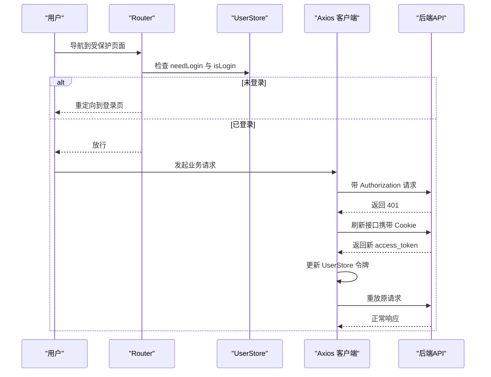
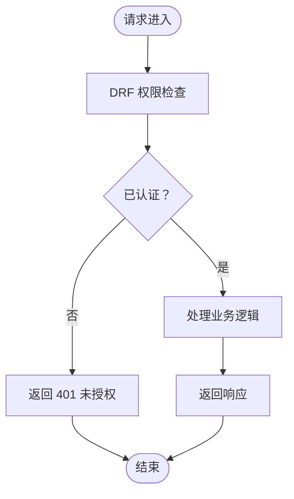
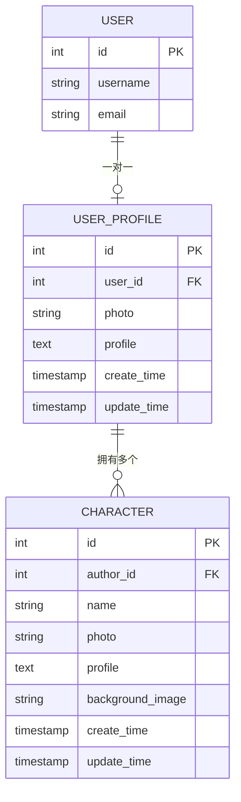
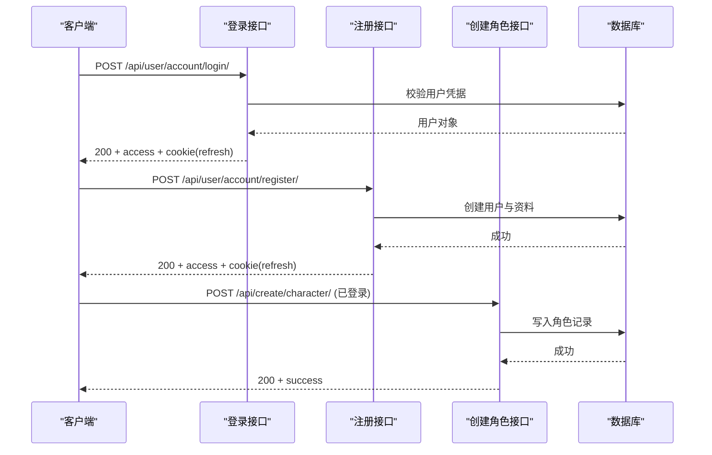
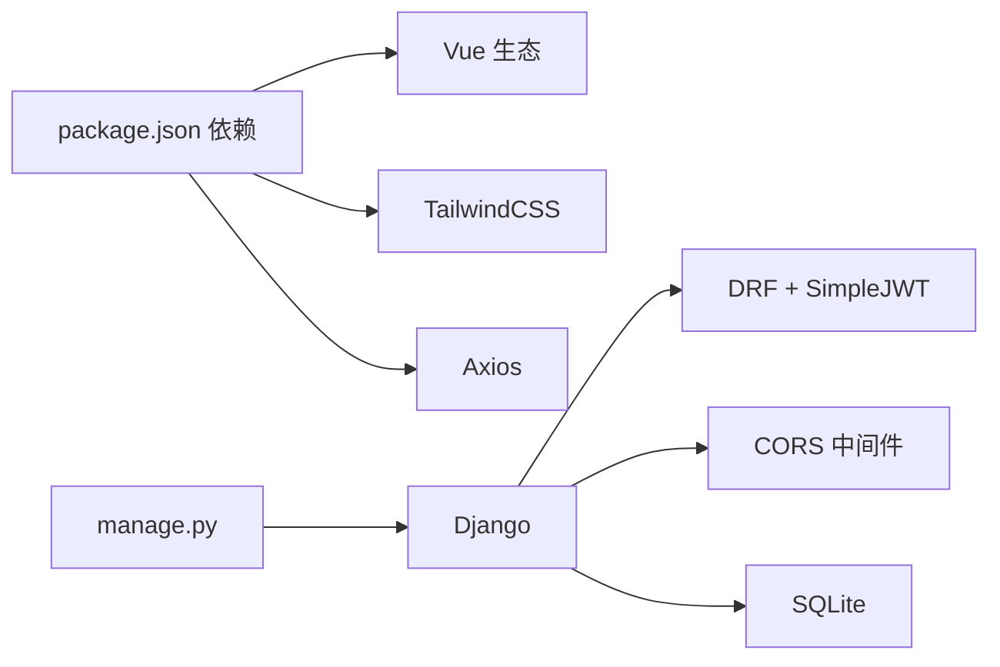

# 开发工作流程

<cite>
**本文引用的文件**
- [backend/backend/settings.py](file://backend/backend/settings.py)
- [backend/manage.py](file://backend/manage.py)
- [frontend/package.json](file://frontend/package.json)
- [frontend/vite.config.js](file://frontend/vite.config.js)
- [frontend/src/js/http/api.js](file://frontend/src/js/http/api.js)
- [frontend/src/router/index.js](file://frontend/src/router/index.js)
- [frontend/src/stores/user.js](file://frontend/src/stores/user.js)
- [frontend/src/main.js](file://frontend/src/main.js)
- [backend/web/views/index.py](file://backend/web/views/index.py)
- [backend/web/models/user.py](file://backend/web/models/user.py)
- [backend/web/models/character.py](file://backend/web/models/character.py)
- [backend/web/views/user/account/login.py](file://backend/web/views/user/account/login.py)
- [backend/web/views/user/account/register.py](file://backend/web/views/user/account/register.py)
- [backend/web/views/create/character/create.py](file://backend/web/views/create/character/create.py)
</cite>

## 目录
1. [简介](#简介)
2. [项目结构](#项目结构)
3. [核心组件](#核心组件)
4. [架构总览](#架构总览)
5. [详细组件分析](#详细组件分析)
6. [依赖分析](#依赖分析)
7. [性能考虑](#性能考虑)
8. [故障排查指南](#故障排查指南)
9. [结论](#结论)
10. [附录](#附录)

## 简介
本指南面向LLM_AIfriends项目的前后端协同开发，围绕代码组织、版本控制与协作流程、开发环境同步、API联调与测试策略、代码质量保障（ESLint、Prettier、Django检查工具）、从本地到生产的部署流程以及CI/CD建议进行系统化梳理，并提供提升开发效率与团队协作规范的实操建议。

## 项目结构
- 前端采用Vite + Vue 3 + Pinia + Vue Router，构建产物输出至后端静态目录，便于Django统一托管。
- 后端基于Django + Django REST Framework，使用SQLite开发数据库，启用CORS与JWT认证，路由指向Django模板渲染首页。
- 前后端通过HTTP API交互，前端通过Axios封装统一请求与鉴权刷新逻辑，后端通过SimpleJWT颁发访问/刷新令牌并通过Cookie持久化刷新令牌。

图表来源
- [frontend/vite.config.js:1-26](file://frontend/vite.config.js#L1-L26)
- [backend/backend/settings.py:136-159](file://backend/backend/settings.py#L136-L159)
- [backend/web/views/index.py:1-6](file://backend/web/views/index.py#L1-L6)

章节来源
- [frontend/vite.config.js:1-26](file://frontend/vite.config.js#L1-L26)
- [backend/backend/settings.py:136-159](file://backend/backend/settings.py#L136-L159)
- [backend/web/views/index.py:1-6](file://backend/web/views/index.py#L1-L6)

## 核心组件
- 前端应用入口与状态管理
  - 应用挂载与插件注册：[frontend/src/main.js:1-15](file://frontend/src/main.js#L1-L15)
  - 用户状态存储（登录态、用户信息、访问令牌）：[frontend/src/stores/user.js:1-53](file://frontend/src/stores/user.js#L1-L53)
  - 路由守卫（登录态校验与跳转）：[frontend/src/router/index.js:1-110](file://frontend/src/router/index.js#L1-L110)
  - 统一HTTP客户端（请求头注入、401自动刷新、重试）：[frontend/src/js/http/api.js:1-93](file://frontend/src/js/http/api.js#L1-L93)
- 后端设置与认证
  - 认证与CORS配置、静态资源与媒体文件路径、JWT参数：[backend/backend/settings.py:136-159](file://backend/backend/settings.py#L136-L159)
  - 管理命令入口：[backend/manage.py:1-23](file://backend/manage.py#L1-23)
- 模型与业务接口
  - 用户资料模型与头像上传路径策略：[backend/web/models/user.py:1-23](file://backend/web/models/user.py#L1-L23)
  - 角色模型与图片上传路径策略：[backend/web/models/character.py:1-32](file://backend/web/models/character.py#L1-L32)
  - 登录/注册接口（JWT颁发与Cookie设置）：[backend/web/views/user/account/login.py:1-46](file://backend/web/views/user/account/login.py#L1-L46)、[backend/web/views/user/account/register.py:1-45](file://backend/web/views/user/account/register.py#L1-L45)
  - 创建角色接口（文件上传与权限校验）：[backend/web/views/create/character/create.py:1-51](file://backend/web/views/create/character/create.py#L1-L51)

章节来源
- [frontend/src/main.js:1-15](file://frontend/src/main.js#L1-L15)
- [frontend/src/stores/user.js:1-53](file://frontend/src/stores/user.js#L1-L53)
- [frontend/src/router/index.js:1-110](file://frontend/src/router/index.js#L1-L110)
- [frontend/src/js/http/api.js:1-93](file://frontend/src/js/http/api.js#L1-L93)
- [backend/backend/settings.py:136-159](file://backend/backend/settings.py#L136-L159)
- [backend/manage.py:1-23](file://backend/manage.py#L1-23)
- [backend/web/models/user.py:1-23](file://backend/web/models/user.py#L1-L23)
- [backend/web/models/character.py:1-32](file://backend/web/models/character.py#L1-L32)
- [backend/web/views/user/account/login.py:1-46](file://backend/web/views/user/account/login.py#L1-L46)
- [backend/web/views/user/account/register.py:1-45](file://backend/web/views/user/account/register.py#L1-L45)
- [backend/web/views/create/character/create.py:1-51](file://backend/web/views/create/character/create.py#L1-L51)

## 架构总览
前后端分离架构下，前端负责UI与交互，后端提供REST API与静态资源托管。前端通过Axios统一处理鉴权与刷新，后端通过SimpleJWT与CORS实现跨域与认证。

图表来源
- [frontend/src/main.js:1-15](file://frontend/src/main.js#L1-L15)
- [frontend/src/router/index.js:1-110](file://frontend/src/router/index.js#L1-L110)
- [frontend/src/stores/user.js:1-53](file://frontend/src/stores/user.js#L1-L53)
- [frontend/src/js/http/api.js:1-93](file://frontend/src/js/http/api.js#L1-L93)
- [backend/backend/settings.py:45-54](file://backend/backend/settings.py#L45-L54)
- [backend/backend/settings.py:136-159](file://backend/backend/settings.py#L136-L159)

## 详细组件分析

### 前端应用与状态管理
- 应用初始化：注册Pinia与Router，挂载根组件。
- 用户状态：集中维护用户ID、用户名、头像、个人简介、访问令牌与拉取状态；提供登录判断、设置令牌、设置用户信息与登出方法。
- 路由守卫：根据meta.needLogin决定是否重定向至登录页；结合hasPulledUserInfo避免重复拉取。
- HTTP客户端：统一设置基础URL与withCredentials；请求头自动附加Bearer Token；响应拦截器处理401并触发刷新流程；刷新成功后重放原请求。

图表来源
- [frontend/src/router/index.js:99-107](file://frontend/src/router/index.js#L99-L107)
- [frontend/src/stores/user.js:12-33](file://frontend/src/stores/user.js#L12-L33)
- [frontend/src/js/http/api.js:21-89](file://frontend/src/js/http/api.js#L21-L89)

章节来源
- [frontend/src/main.js:1-15](file://frontend/src/main.js#L1-L15)
- [frontend/src/stores/user.js:1-53](file://frontend/src/stores/user.js#L1-L53)
- [frontend/src/router/index.js:1-110](file://frontend/src/router/index.js#L1-L110)
- [frontend/src/js/http/api.js:1-93](file://frontend/src/js/http/api.js#L1-L93)

### 后端认证与CORS/JWT配置
- 认证方式：DRF + SimpleJWT，访问令牌有效期与刷新令牌轮换策略在设置中定义。
- CORS：允许凭证传输，指定前端开发源地址。
- 静态与媒体：开发阶段使用STATICFILES_DIRS，媒体文件通过MEDIA_URL/MEDIA_ROOT暴露。
- 管理命令：通过manage.py启动Django命令行任务。

图表来源
- [backend/backend/settings.py:136-159](file://backend/backend/settings.py#L136-L159)
- [backend/web/views/create/character/create.py:10](file://backend/web/views/create/character/create.py#L10)

章节来源
- [backend/backend/settings.py:136-159](file://backend/backend/settings.py#L136-L159)
- [backend/manage.py:1-23](file://backend/manage.py#L1-23)

### 模型设计与文件上传策略
- 用户资料模型：一对一关联Django内置User，头像上传路径按UUID重命名并按用户ID分桶。
- 角色模型：外键关联用户资料，头像与背景图分别按作者ID分桶，支持大文本描述字段。

图表来源
- [backend/web/models/user.py:14-23](file://backend/web/models/user.py#L14-L23)
- [backend/web/models/character.py:21-32](file://backend/web/models/character.py#L21-L32)

章节来源
- [backend/web/models/user.py:1-23](file://backend/web/models/user.py#L1-L23)
- [backend/web/models/character.py:1-32](file://backend/web/models/character.py#L1-L32)

### 登录/注册与创建角色接口
- 登录：校验用户名与密码，成功后颁发JWT并以Cookie下发刷新令牌，同时返回用户信息。
- 注册：校验用户名唯一性，创建用户与用户资料，随后颁发JWT并下发刷新令牌。
- 创建角色：校验已认证，接收名称、简介、头像与背景图，写入数据库。

图表来源
- [backend/web/views/user/account/login.py:9-46](file://backend/web/views/user/account/login.py#L9-L46)
- [backend/web/views/user/account/register.py:9-45](file://backend/web/views/user/account/register.py#L9-L45)
- [backend/web/views/create/character/create.py:9-51](file://backend/web/views/create/character/create.py#L9-L51)

章节来源
- [backend/web/views/user/account/login.py:1-46](file://backend/web/views/user/account/login.py#L1-L46)
- [backend/web/views/user/account/register.py:1-45](file://backend/web/views/user/account/register.py#L1-L45)
- [backend/web/views/create/character/create.py:1-51](file://backend/web/views/create/character/create.py#L1-L51)

## 依赖分析
- 前端依赖
  - 运行时：Vue 3、Vue Router、Pinia、Axios、TailwindCSS。
  - 开发时：Vite、@vitejs/plugin-vue、vite-plugin-vue-devtools。
  - 构建目标：打包到后端静态目录，供Django统一托管。
- 后端依赖
  - Django、DRF、SimpleJWT、CORS中间件、SQLite（开发）。
  - 静态与媒体路径、CORS白名单、JWT生命周期等在设置中集中配置。

图表来源
- [frontend/package.json:14-29](file://frontend/package.json#L14-L29)
- [backend/manage.py:1-23](file://backend/manage.py#L1-23)
- [backend/backend/settings.py:45-54](file://backend/backend/settings.py#L45-L54)

章节来源
- [frontend/package.json:1-30](file://frontend/package.json#L1-L30)
- [backend/manage.py:1-23](file://backend/manage.py#L1-23)
- [backend/backend/settings.py:45-54](file://backend/backend/settings.py#L45-L54)

## 性能考虑
- 前端
  - 代码分割与懒加载：对非首屏路由组件采用异步导入，减少初始包体。
  - 图片优化：头像与背景图建议压缩与WebP格式，按需加载。
  - 缓存策略：利用浏览器缓存与CDN，静态资源版本化。
- 后端
  - 查询优化：避免N+1查询，必要时使用select_related/ prefetch_related。
  - 文件存储：开发可用本地磁盘，生产建议对象存储（如S3），并开启CDN。
  - 并发与超时：合理设置Gunicorn/ASGI并发与请求超时，避免慢查询拖垮服务。
- 共同点
  - 本地与生产环境差异：通过环境变量区分数据库、静态/媒体路径、CORS白名单与日志级别。

## 故障排查指南
- 常见问题定位
  - 401未授权：确认前端是否正确注入Authorization头，后端JWT签名与过期时间配置是否一致。
  - 刷新失败：检查后端刷新接口是否正常，Cookie是否随请求携带且未被同站策略阻断。
  - 跨域失败：核对CORS_ALLOWED_ORIGINS与CORS_ALLOW_CREDENTIALS配置。
  - 文件上传失败：确认MEDIA_URL/MEDIA_ROOT与前端上传字段一致，后端模型upload_to路径可写。
- 日志与调试
  - 前端：开启Vue DevTools，观察Pinia状态变化与网络请求。
  - 后端：开启DEBUG与详细日志，定位序列化与权限类问题。
- 错误处理
  - 前端：统一拦截401并触发刷新；刷新失败则清空本地登录态并跳转登录。
  - 后端：接口层捕获异常并返回统一结构，避免泄露敏感信息。

章节来源
- [frontend/src/js/http/api.js:46-89](file://frontend/src/js/http/api.js#L46-L89)
- [backend/backend/settings.py:154-159](file://backend/backend/settings.py#L154-L159)

## 结论
本项目采用前后端分离架构，前端通过Axios统一处理鉴权与刷新，后端以DRF + SimpleJWT提供认证与CORS支持。遵循本文的开发流程、质量保障与部署建议，可在保证开发效率的同时提升协作一致性与系统稳定性。

## 附录

### 版本控制与协作流程
- 分支策略
  - develop：集成主分支，合并feature分支。
  - feature/*：功能开发分支，完成后合并至develop。
  - hotfix/*：紧急修复分支，直接合并至main并打标签发布。
- 提交规范
  - 类型：feat、fix、docs、style、refactor、test、chore。
  - 示例：feat(web): 添加角色列表页；fix(auth): 修正刷新令牌过期逻辑。
- 合并与审查
  - Pull Request必须包含测试与变更说明，至少一名同事审查通过后合并。

### 开发环境同步
- 前端
  - 使用package.json中脚本启动开发服务器，确保Node版本满足engines要求。
  - 构建产物输出到后端静态目录，避免手动拷贝。
- 后端
  - 使用manage.py运行开发服务器，确保settings模块正确指向backend.settings。
  - SQLite适合本地开发，生产迁移至PostgreSQL/MySQL并配置连接池。

章节来源
- [frontend/package.json:6-13](file://frontend/package.json#L6-L13)
- [frontend/vite.config.js:16-19](file://frontend/vite.config.js#L16-L19)
- [backend/manage.py:9](file://backend/manage.py#L9)

### API联调与测试策略
- 接口联调
  - 前后端约定：明确请求/响应结构、鉴权方式与错误码。
  - Mock：后端可提供Mock数据，前端可使用Mock拦截器模拟接口。
- 测试
  - 前端：组件单元测试与E2E测试（如Cypress/Vitest），覆盖登录态与路由守卫。
  - 后端：DRF测试框架，覆盖认证、权限与文件上传场景。

### 代码质量保障
- 前端
  - ESLint：统一规则集，建议禁用console.warn/console.error，保留warn提示。
  - Prettier：统一缩进、引号与尾逗号风格，与ESLint配合。
  - Vue单文件组件：按功能拆分，保持模板/脚本/样式清晰。
- 后端
  - Python：使用flake8、pylint或ruff进行静态检查，统一PEP8风格。
  - Django：使用django-check-migrations与自定义管理命令进行数据库一致性检查。
  - 文档与注释：接口与复杂逻辑补充文档字符串与注释。

### 本地到生产部署
- 本地
  - 前端：npm run build，产物位于后端static/frontend。
  - 后端：收集静态资源，准备SQLite或迁移至生产数据库。
- 生产
  - 反向代理：Nginx/HAProxy转发静态与动态请求。
  - Web服务器：Gunicorn/uwsgi + ASGI（Daphne）或Django内置服务器仅用于开发。
  - 存储：对象存储（S3）与CDN加速静态资源与媒体文件。
  - 安全：HTTPS、CORS白名单、CSRF防护、敏感信息通过环境变量管理。

### CI/CD配置建议
- 触发条件
  - push到develop触发集成测试；push到main触发构建与发布。
- 步骤
  - 前端：安装依赖 → Lint/Prettier → 单测 → 构建 → 上传制品。
  - 后端：安装依赖 → Lint → 单元测试 → 数据库迁移检查 → 构建 → 上传制品。
  - 部署：制品下载 → 配置替换 → 数据库迁移 → 重启服务 → 健康检查。
- 工具
  - GitHub Actions/GitLab CI/自建Jenkins，结合Docker镜像与Kubernetes编排。