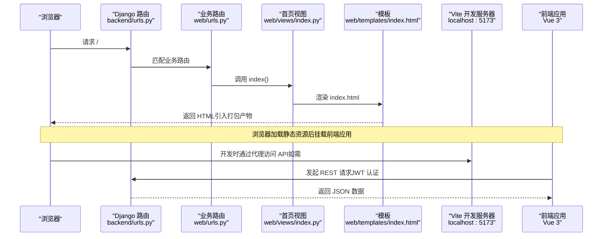
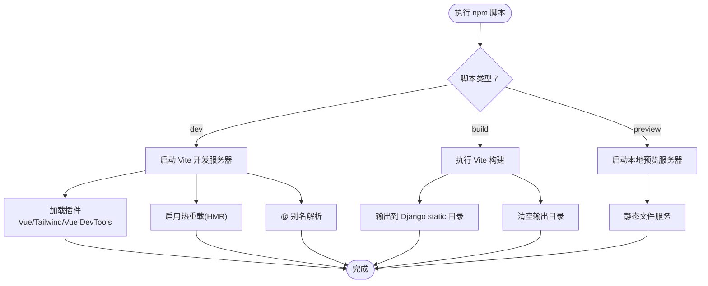
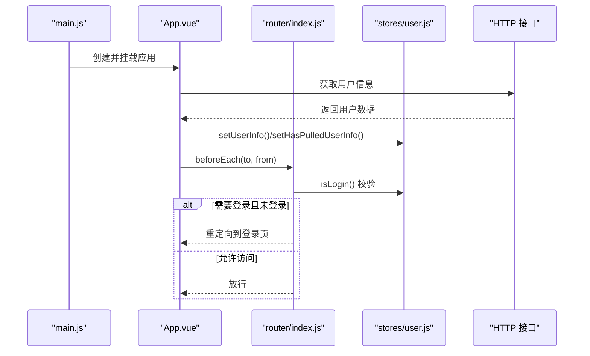
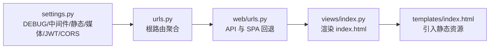
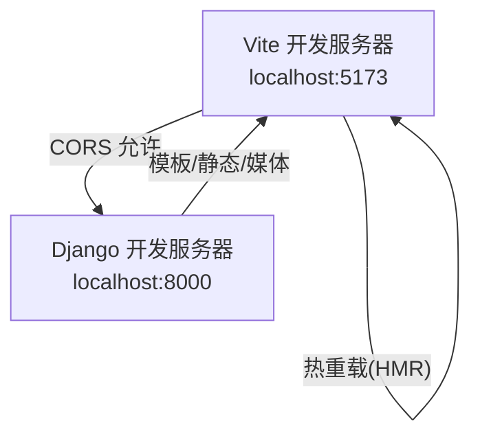
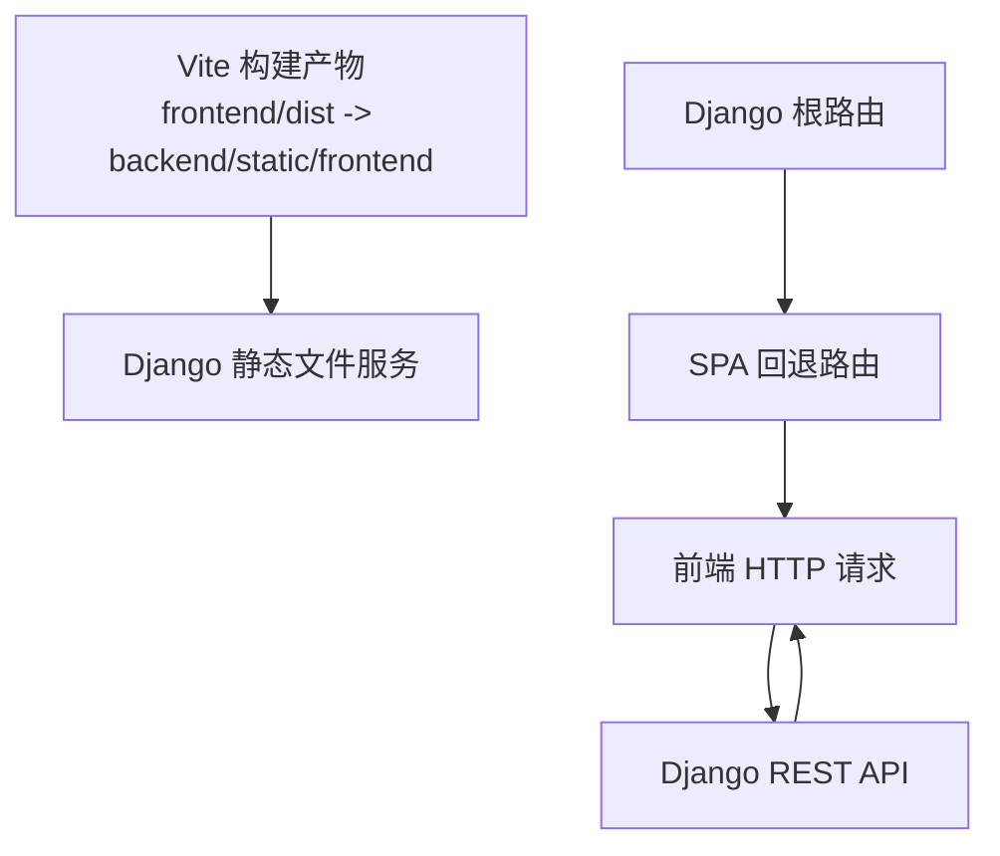

# 开发工具与构建

<cite>
**本文引用的文件**
- [frontend/vite.config.js](file://frontend/vite.config.js)
- [frontend/package.json](file://frontend/package.json)
- [frontend/jsconfig.json](file://frontend/jsconfig.json)
- [frontend/src/main.js](file://frontend/src/main.js)
- [frontend/src/App.vue](file://frontend/src/App.vue)
- [frontend/src/router/index.js](file://frontend/src/router/index.js)
- [frontend/src/stores/user.js](file://frontend/src/stores/user.js)
- [frontend/src/assets/main.css](file://frontend/src/assets/main.css)
- [backend/backend/settings.py](file://backend/backend/settings.py)
- [backend/backend/urls.py](file://backend/backend/urls.py)
- [backend/web/urls.py](file://backend/web/urls.py)
- [backend/manage.py](file://backend/manage.py)
- [backend/web/views/index.py](file://backend/web/views/index.py)
- [backend/web/templates/index.html](file://backend/web/templates/index.html)
</cite>

## 目录
1. [简介](#简介)
2. [项目结构](#项目结构)
3. [核心组件](#核心组件)
4. [架构总览](#架构总览)
5. [详细组件分析](#详细组件分析)
6. [依赖关系分析](#依赖关系分析)
7. [性能考虑](#性能考虑)
8. [故障排查指南](#故障排查指南)
9. [结论](#结论)
10. [附录](#附录)

## 简介
本文件面向 LLM_AIfriends 的开发团队，系统化梳理前后端开发工具与构建体系，重点覆盖：
- 前端：Vite 构建配置、开发服务器与热重载、依赖管理、脚本命令与构建优化策略
- 后端：Django 开发环境配置、URL 路由与静态资源映射、管理命令与调试要点
- 工作流与质量：开发流程、代码质量工具与持续集成建议
- 运维与部署：性能监控、错误追踪与生产部署准备

## 项目结构
项目采用“前后端分离”的双工程模式：
- 前端工程位于 frontend 目录，基于 Vue 3 + Vite + Pinia + Vue Router
- 后端工程位于 backend 目录，基于 Django + Django REST Framework + SimpleJWT + CORS

```mermaid
graph TB
subgraph "前端工程 frontend"
FE_Vite["Vite 配置<br/>vite.config.js"]
FE_Pkg["包管理与脚本<br/>package.json"]
FE_Main["应用入口<br/>src/main.js"]
FE_App["根组件<br/>src/App.vue"]
FE_Router["路由定义<br/>src/router/index.js"]
FE_Store["状态管理<br/>src/stores/user.js"]
FE_CSS["样式入口<br/>src/assets/main.css"]
end
subgraph "后端工程 backend"
BE_Settings["Django 设置<br/>backend/settings.py"]
BE_URLs["根路由<br/>backend/urls.py"]
BE_WebURLs["业务路由<br/>web/urls.py"]
BE_Manage["管理命令入口<br/>manage.py"]
BE_IndexView["首页视图<br/>web/views/index.py"]
BE_Template["模板渲染<br/>web/templates/index.html"]
end
FE_Vite --> BE_Settings
FE_Pkg --> FE_Vite
FE_Main --> FE_App
FE_App --> FE_Router
FE_App --> FE_Store
FE_Router --> BE_WebURLs
BE_URLs --> BE_WebURLs
BE_Manage --> BE_Settings
BE_IndexView --> BE_Template
```

图表来源
- [frontend/vite.config.js:1-26](file://frontend/vite.config.js#L1-L26)
- [frontend/package.json:1-30](file://frontend/package.json#L1-L30)
- [frontend/src/main.js:1-15](file://frontend/src/main.js#L1-L15)
- [frontend/src/App.vue:1-41](file://frontend/src/App.vue#L1-L41)
- [frontend/src/router/index.js:1-110](file://frontend/src/router/index.js#L1-L110)
- [frontend/src/stores/user.js:1-53](file://frontend/src/stores/user.js#L1-L53)
- [frontend/src/assets/main.css:1-3](file://frontend/src/assets/main.css#L1-L3)
- [backend/backend/settings.py:1-159](file://backend/backend/settings.py#L1-L159)
- [backend/backend/urls.py:1-38](file://backend/backend/urls.py#L1-L38)
- [backend/web/urls.py:1-33](file://backend/web/urls.py#L1-L33)
- [backend/manage.py:1-23](file://backend/manage.py#L1-L23)
- [backend/web/views/index.py:1-6](file://backend/web/views/index.py#L1-L6)
- [backend/web/templates/index.html:1-17](file://backend/web/templates/index.html#L1-L17)

章节来源
- [frontend/vite.config.js:1-26](file://frontend/vite.config.js#L1-L26)
- [frontend/package.json:1-30](file://frontend/package.json#L1-L30)
- [backend/backend/settings.py:1-159](file://backend/backend/settings.py#L1-L159)
- [backend/backend/urls.py:1-38](file://backend/backend/urls.py#L1-L38)
- [backend/web/urls.py:1-33](file://backend/web/urls.py#L1-L33)
- [backend/manage.py:1-23](file://backend/manage.py#L1-L23)
- [backend/web/views/index.py:1-6](file://backend/web/views/index.py#L1-L6)
- [backend/web/templates/index.html:1-17](file://backend/web/templates/index.html#L1-L17)

## 核心组件
- 前端构建与开发工具
  - Vite：插件化构建、开发服务器与热重载；打包输出至 Django static 目录
  - Vue 3 + Vue Router + Pinia：单页应用框架与状态管理
  - TailwindCSS + daisyUI：原子化样式与组件库
- 后端开发环境
  - Django：中间件、认证、CORS、静态资源与媒体资源配置
  - REST 框架与 JWT：SimpleJWT 认证与刷新令牌
  - URL 路由：根路由聚合业务路由，SPA 回退处理

章节来源
- [frontend/vite.config.js:1-26](file://frontend/vite.config.js#L1-L26)
- [frontend/package.json:1-30](file://frontend/package.json#L1-L30)
- [frontend/src/main.js:1-15](file://frontend/src/main.js#L1-L15)
- [frontend/src/router/index.js:1-110](file://frontend/src/router/index.js#L1-L110)
- [frontend/src/stores/user.js:1-53](file://frontend/src/stores/user.js#L1-L53)
- [frontend/src/assets/main.css:1-3](file://frontend/src/assets/main.css#L1-L3)
- [backend/backend/settings.py:1-159](file://backend/backend/settings.py#L1-L159)
- [backend/web/urls.py:1-33](file://backend/web/urls.py#L1-L33)

## 架构总览
下图展示从浏览器请求到后端渲染模板、再到前端应用挂载的完整链路。

图表来源
- [backend/backend/urls.py:1-38](file://backend/backend/urls.py#L1-L38)
- [backend/web/urls.py:1-33](file://backend/web/urls.py#L1-L33)
- [backend/web/views/index.py:1-6](file://backend/web/views/index.py#L1-L6)
- [backend/web/templates/index.html:1-17](file://backend/web/templates/index.html#L1-L17)

## 详细组件分析

### 前端构建与开发服务器（Vite）
- 插件生态
  - @vitejs/plugin-vue：支持 .vue 单文件组件
  - vite-plugin-vue-devtools：开发期调试工具
  - @tailwindcss/vite：TailwindCSS 支持
- 构建输出
  - 输出目录指向 Django static 目录，便于后端统一托管
  - 启用空目录清理，避免历史产物残留
- 路径别名
  - @ 指向 src，提升导入可读性
- 开发脚本
  - dev：启动 Vite 开发服务器
  - build：生成生产构建
  - preview：本地预览生产构建

图表来源
- [frontend/vite.config.js:1-26](file://frontend/vite.config.js#L1-L26)
- [frontend/package.json:1-30](file://frontend/package.json#L1-L30)

章节来源
- [frontend/vite.config.js:1-26](file://frontend/vite.config.js#L1-L26)
- [frontend/package.json:1-30](file://frontend/package.json#L1-L30)
- [frontend/jsconfig.json:1-9](file://frontend/jsconfig.json#L1-L9)

### 前端应用初始化与路由守卫
- 应用入口
  - 创建 Vue 应用实例，注册 Pinia 与 Router
  - 挂载到 #app 容器
- 根组件生命周期
  - 首次挂载尝试拉取用户信息，设置登录态与路由守卫
- 路由守卫
  - 对需要登录的页面进行前置校验，未登录则跳转登录页
- 用户状态管理
  - Pinia Store 维护用户信息、访问令牌与登录状态

图表来源
- [frontend/src/main.js:1-15](file://frontend/src/main.js#L1-L15)
- [frontend/src/App.vue:1-41](file://frontend/src/App.vue#L1-L41)
- [frontend/src/router/index.js:1-110](file://frontend/src/router/index.js#L1-L110)
- [frontend/src/stores/user.js:1-53](file://frontend/src/stores/user.js#L1-L53)

章节来源
- [frontend/src/main.js:1-15](file://frontend/src/main.js#L1-L15)
- [frontend/src/App.vue:1-41](file://frontend/src/App.vue#L1-L41)
- [frontend/src/router/index.js:1-110](file://frontend/src/router/index.js#L1-L110)
- [frontend/src/stores/user.js:1-53](file://frontend/src/stores/user.js#L1-L53)

### 后端开发环境与静态资源
- 设置要点
  - DEBUG 开启，便于开发调试
  - INSTALLED_APPS 包含 rest_framework、web、corsheaders
  - MIDDLEWARE 中 CORS 位于前列，保证跨域头优先注入
  - 静态文件目录指向 backend/static（开发阶段），媒体资源指向 backend/media
  - REST 框架默认认证使用 SimpleJWT，配置访问令牌与刷新令牌生命周期
  - CORS 允许本地开发源 http://localhost:5173
- URL 路由
  - 根路由聚合 web.urls，并在 DEBUG 下为前端构建产物与媒体资源提供开发期静态映射
  - web.urls 将 API 与 SPA 回退路由（非 media/static/assets 前缀）统一交由 index 视图处理

图表来源
- [backend/backend/settings.py:1-159](file://backend/backend/settings.py#L1-L159)
- [backend/backend/urls.py:1-38](file://backend/backend/urls.py#L1-L38)
- [backend/web/urls.py:1-33](file://backend/web/urls.py#L1-L33)
- [backend/web/views/index.py:1-6](file://backend/web/views/index.py#L1-L6)
- [backend/web/templates/index.html:1-17](file://backend/web/templates/index.html#L1-L17)

章节来源
- [backend/backend/settings.py:1-159](file://backend/backend/settings.py#L1-L159)
- [backend/backend/urls.py:1-38](file://backend/backend/urls.py#L1-L38)
- [backend/web/urls.py:1-33](file://backend/web/urls.py#L1-L33)
- [backend/web/views/index.py:1-6](file://backend/web/views/index.py#L1-L6)
- [backend/web/templates/index.html:1-17](file://backend/web/templates/index.html#L1-L17)

### 开发服务器与热重载机制
- 前端
  - Vite 在本地启动开发服务器，默认监听 5173 端口
  - 通过插件实现 Vue SFC 编译与热更新，CSS 与 JS 变更即时生效
- 后端
  - Django 开发服务器通过 manage.py 启动，DEBUG 模式下自动响应模板与静态资源变更
- 跨域与代理
  - 前端开发服务器与后端 API 之间通过 CORS 与可能的代理保持连通（开发期常见）

图表来源
- [frontend/vite.config.js:1-26](file://frontend/vite.config.js#L1-L26)
- [backend/backend/settings.py:153-159](file://backend/backend/settings.py#L153-L159)
- [backend/manage.py:1-23](file://backend/manage.py#L1-23)

章节来源
- [frontend/vite.config.js:1-26](file://frontend/vite.config.js#L1-L26)
- [backend/backend/settings.py:153-159](file://backend/backend/settings.py#L153-L159)
- [backend/manage.py:1-23](file://backend/manage.py#L1-23)

### 前端依赖管理与构建优化
- 依赖类别
  - 运行时依赖：Vue 3、Vue Router、Pinia、Axios、TailwindCSS、Cropper、daisyUI
  - 开发依赖：Vite、@vitejs/plugin-vue、vite-plugin-vue-devtools、TailwindCSS
- 版本与引擎
  - Node 引擎版本要求，确保团队开发一致性
- 构建优化策略
  - 通过 Vite 插件链路实现按需编译与 Tree-shaking
  - 样式通过 TailwindCSS 动态生成，减少冗余 CSS
  - 输出目录直连 Django static，简化部署与缓存策略

章节来源
- [frontend/package.json:1-30](file://frontend/package.json#L1-L30)
- [frontend/vite.config.js:1-26](file://frontend/vite.config.js#L1-L26)
- [frontend/src/assets/main.css:1-3](file://frontend/src/assets/main.css#L1-L3)

### 后端开发环境配置与调试
- 环境变量与命令
  - 通过 manage.py 传递 DJANGO_SETTINGS_MODULE，执行各类管理命令
- 认证与跨域
  - SimpleJWT 提供访问/刷新令牌；CORS 允许前端开发源
- 静态与媒体
  - 开发阶段启用 STATICFILES_DIRS 与 MEDIA 配置，DEBUG 下自动提供静态资源映射

章节来源
- [backend/manage.py:1-23](file://backend/manage.py#L1-L23)
- [backend/backend/settings.py:133-159](file://backend/backend/settings.py#L133-L159)
- [backend/backend/urls.py:28-38](file://backend/backend/urls.py#L28-L38)

## 依赖关系分析
- 前端对后端的依赖
  - 模板 index.html 引入静态资源（由 Vite 构建生成）
  - 前端通过 REST 接口与后端交互，依赖 JWT 认证
- 后端对前端的依赖
  - 根路由在 DEBUG 下为前端构建产物提供静态映射
  - SPA 回退路由将未匹配路径交由前端处理

图表来源
- [frontend/vite.config.js:16-19](file://frontend/vite.config.js#L16-L19)
- [backend/backend/urls.py:28-38](file://backend/backend/urls.py#L28-L38)
- [backend/web/urls.py:29-32](file://backend/web/urls.py#L29-L32)
- [backend/web/templates/index.html:10-11](file://backend/web/templates/index.html#L10-L11)

章节来源
- [frontend/vite.config.js:16-19](file://frontend/vite.config.js#L16-L19)
- [backend/backend/urls.py:28-38](file://backend/backend/urls.py#L28-L38)
- [backend/web/urls.py:29-32](file://backend/web/urls.py#L29-L32)
- [backend/web/templates/index.html:10-11](file://backend/web/templates/index.html#L10-L11)

## 性能考虑
- 前端
  - 合理拆分路由组件，利用 Vue Router 的懒加载能力
  - 控制 TailwindCSS 生成范围，避免无用类导致体积膨胀
  - 使用 Pinia 精细化状态管理，避免全局状态风暴
- 后端
  - 在生产环境关闭 DEBUG，启用静态文件缓存与 Gzip 压缩
  - 使用数据库索引与查询优化，避免 N+1 查询
  - 合理配置 CORS 与安全中间件，减少不必要的开销

## 故障排查指南
- 前端无法热重载或样式不生效
  - 检查 Vite 插件是否正确安装与启用
  - 确认 @ 别名与 jsconfig.json 路径映射一致
- 404 或路由回退异常
  - 核对 SPA 回退正则与路由元信息 needLogin
  - 确保后端 DEBUG 下静态映射已开启
- 登录态与鉴权问题
  - 检查 SimpleJWT 配置与前端存储的访问令牌
  - 确认 CORS 与凭证携带设置
- 静态资源加载失败
  - 确认 Vite 输出目录与 Django STATICFILES_DIRS 对应
  - 检查模板中静态资源 URL 与实际构建产物命名

章节来源
- [frontend/jsconfig.json:1-9](file://frontend/jsconfig.json#L1-L9)
- [frontend/src/router/index.js:99-107](file://frontend/src/router/index.js#L99-L107)
- [backend/backend/settings.py:133-159](file://backend/backend/settings.py#L133-L159)
- [backend/backend/urls.py:28-38](file://backend/backend/urls.py#L28-L38)
- [backend/web/templates/index.html:10-11](file://backend/web/templates/index.html#L10-L11)

## 结论
本项目通过 Vite 与 Django 的组合实现了高效的前后端开发体验：前端以插件化构建与热重载提升迭代效率，后端以 REST 与 JWT 提供稳定的服务层支撑。配合合理的静态资源与路由策略，既满足开发期的灵活性，也为后续生产部署打下基础。建议在团队内统一 Node 版本与包管理策略，并逐步完善 CI/CD 与监控方案。

## 附录
- 开发工作流建议
  - 前端：npm run dev → 修改代码 → 观察 HMR → npm run build → 预览
  - 后端：python manage.py runserver → 调试接口 → 管理迁移与数据
- 代码质量工具建议
  - 前端：ESLint + Prettier（可在 Vite 项目中集成）
  - 后端：flake8/black/isort + pytest（结合 GitHub Actions）
- 持续集成建议
  - 前端：构建 + 静态检查 + 测试（可选）
  - 后端：单元测试 + 代码覆盖率 + 安全扫描
- 生产部署准备
  - 前端：构建产物上传至 CDN 或静态托管，后端配置静态文件与媒体目录
  - 后端：关闭 DEBUG，配置 ALLOWED_HOSTS，启用 HTTPS 与安全中间件，部署 WSGI 服务器