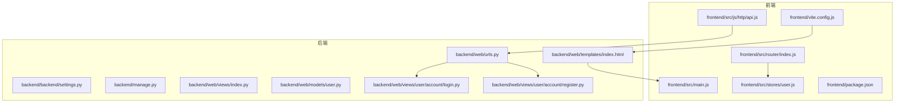
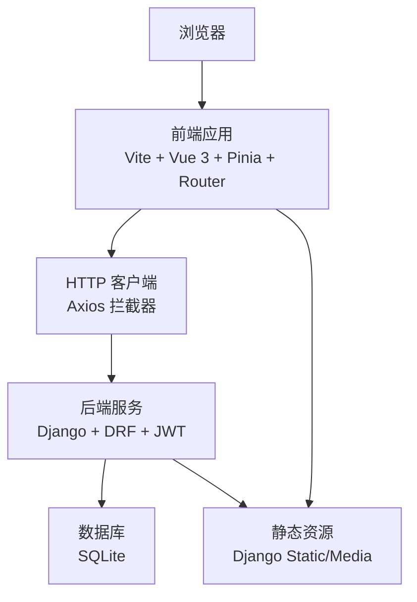
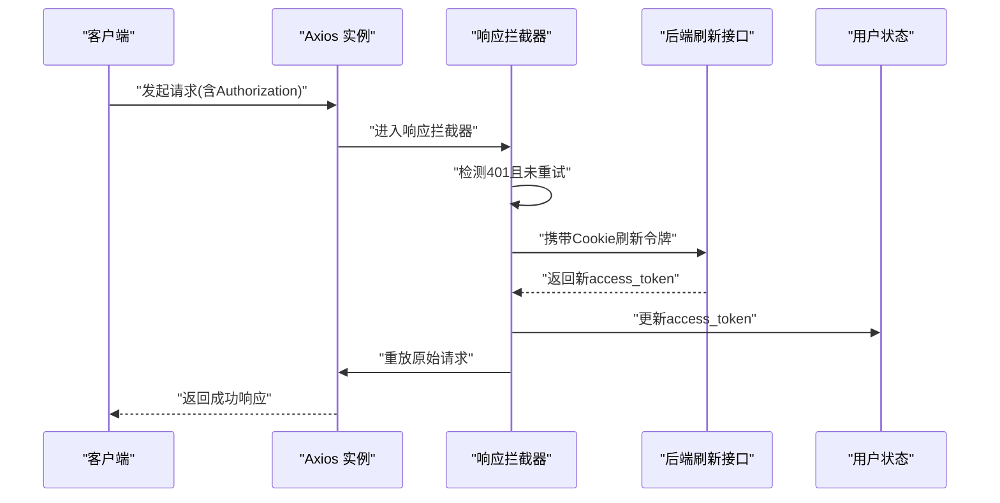
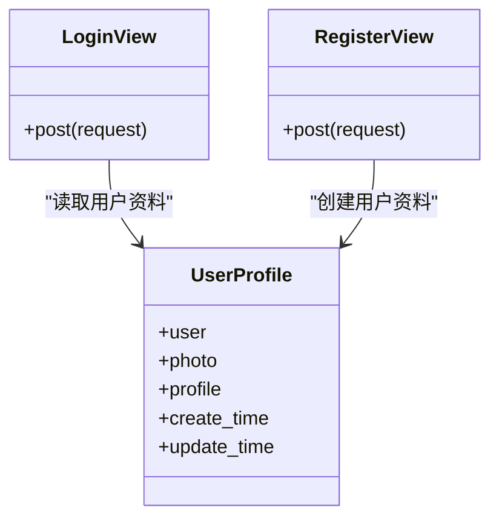
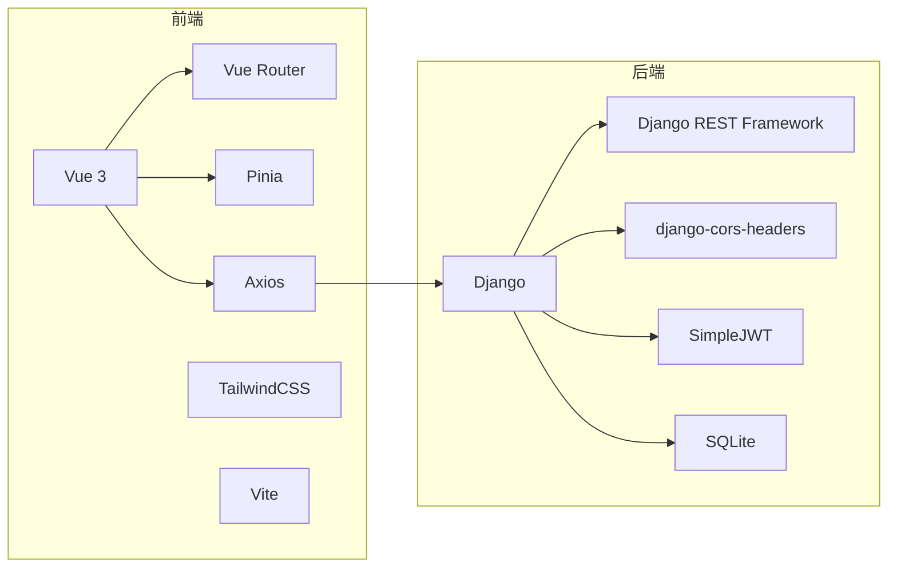

# 开发指南

<cite>
**本文引用的文件**
- [README.md](file://README.md)
- [backend/backend/settings.py](file://backend/backend/settings.py)
- [backend/manage.py](file://backend/manage.py)
- [backend/web/models/user.py](file://backend/web/models/user.py)
- [backend/web/views/index.py](file://backend/web/views/index.py)
- [backend/web/urls.py](file://backend/web/urls.py)
- [backend/web/views/user/account/login.py](file://backend/web/views/user/account/login.py)
- [backend/web/views/user/account/register.py](file://backend/web/views/user/account/register.py)
- [backend/web/templates/index.html](file://backend/web/templates/index.html)
- [frontend/package.json](file://frontend/package.json)
- [frontend/vite.config.js](file://frontend/vite.config.js)
- [frontend/src/main.js](file://frontend/src/main.js)
- [frontend/src/router/index.js](file://frontend/src/router/index.js)
- [frontend/src/stores/user.js](file://frontend/src/stores/user.js)
- [frontend/src/js/http/api.js](file://frontend/src/js/http/api.js)
</cite>

## 目录
1. [简介](#简介)
2. [项目结构](#项目结构)
3. [核心组件](#核心组件)
4. [架构总览](#架构总览)
5. [详细组件分析](#详细组件分析)
6. [依赖分析](#依赖分析)
7. [性能考虑](#性能考虑)
8. [故障排查指南](#故障排查指南)
9. [结论](#结论)
10. [附录](#附录)

## 简介
本开发指南面向 LLM_AIfriends 项目，目标是帮助开发者快速搭建开发环境、理解系统架构、掌握代码规范、调试技巧、测试策略、性能优化与安全注意事项，并完成部署准备。项目采用 Vue 3 + Vite 前端与 Django + Django REST Framework 后端的组合，通过 JWT 实现鉴权，前端资源由 Vite 构建并打包至 Django 的静态目录，由 Django 提供模板渲染与静态资源服务。

## 项目结构
项目分为前后端两个子工程：
- 后端 backend：Django 应用，包含应用 web、认证与路由、模型与视图等。
- 前端 frontend：Vue 3 应用，使用 Vite 构建，Pinia 状态管理，Vue Router 路由，Axios 封装统一请求与鉴权刷新。

图表来源
- [frontend/src/main.js:1-15](file://frontend/src/main.js#L1-L15)
- [frontend/src/router/index.js:1-104](file://frontend/src/router/index.js#L1-L104)
- [frontend/src/stores/user.js:1-59](file://frontend/src/stores/user.js#L1-L59)
- [frontend/src/js/http/api.js:1-92](file://frontend/src/js/http/api.js#L1-L92)
- [frontend/vite.config.js:1-26](file://frontend/vite.config.js#L1-L26)
- [frontend/package.json:1-30](file://frontend/package.json#L1-L30)
- [backend/backend/settings.py:1-158](file://backend/backend/settings.py#L1-L158)
- [backend/manage.py:1-23](file://backend/manage.py#L1-L23)
- [backend/web/urls.py:1-24](file://backend/web/urls.py#L1-L24)
- [backend/web/views/index.py:1-4](file://backend/web/views/index.py#L1-L4)
- [backend/web/templates/index.html:1-17](file://backend/web/templates/index.html#L1-L17)
- [backend/web/models/user.py:1-23](file://backend/web/models/user.py#L1-L23)
- [backend/web/views/user/account/login.py:1-92](file://backend/web/views/user/account/login.py#L1-L92)
- [backend/web/views/user/account/register.py:1-46](file://backend/web/views/user/account/register.py#L1-L46)

章节来源
- [README.md:1-1](file://README.md#L1-L1)
- [frontend/package.json:1-30](file://frontend/package.json#L1-L30)
- [backend/backend/settings.py:1-158](file://backend/backend/settings.py#L1-L158)

## 核心组件
- 前端应用入口与状态管理
  - 应用入口负责挂载 Vue 应用、注册 Pinia 与路由。
  - 用户状态管理使用 Pinia Store，保存登录态、用户信息与访问令牌。
- 前端路由与鉴权守卫
  - 路由定义页面与登录需求元信息，前置守卫根据登录状态与用户信息拉取状态进行跳转控制。
- 前端 HTTP 请求与令牌刷新
  - Axios 实例统一注入 Authorization 头；拦截器处理 401 未授权，使用 Cookie 中的 refresh_token 刷新 access_token，失败则登出。
- 后端设置与中间件
  - 开启 CORS、JWT 认证、静态与媒体文件路径、时区与语言设置。
- 后端路由与视图
  - 定义用户账户登录、注册、刷新令牌、登出与个人信息接口；兜底路由交由前端处理。
- 数据模型
  - 用户资料模型包含头像、个人简介与时间戳字段。

章节来源
- [frontend/src/main.js:1-15](file://frontend/src/main.js#L1-L15)
- [frontend/src/stores/user.js:1-59](file://frontend/src/stores/user.js#L1-L59)
- [frontend/src/router/index.js:1-104](file://frontend/src/router/index.js#L1-L104)
- [frontend/src/js/http/api.js:1-92](file://frontend/src/js/http/api.js#L1-L92)
- [backend/backend/settings.py:133-158](file://backend/backend/settings.py#L133-L158)
- [backend/web/urls.py:1-24](file://backend/web/urls.py#L1-L24)
- [backend/web/views/user/account/login.py:1-92](file://backend/web/views/user/account/login.py#L1-L92)
- [backend/web/views/user/account/register.py:1-46](file://backend/web/views/user/account/register.py#L1-L46)
- [backend/web/models/user.py:1-23](file://backend/web/models/user.py#L1-L23)

## 架构总览
前后端分离架构，前端通过 Axios 发起请求，后端提供 REST 接口与模板渲染，静态资源由 Django 统一托管。

图表来源
- [frontend/src/js/http/api.js:1-92](file://frontend/src/js/http/api.js#L1-L92)
- [backend/backend/settings.py:76-158](file://backend/backend/settings.py#L76-L158)
- [backend/web/templates/index.html:1-17](file://backend/web/templates/index.html#L1-L17)

## 详细组件分析

### 前端：应用入口与构建配置
- 应用入口初始化 Vue、Pinia、Router 并挂载根组件。
- Vite 配置将构建产物输出到 Django 的 static 目录，便于后端模板直接加载。
- 包管理脚本提供开发、构建与预览命令，依赖声明包含 Vue、Vue Router、Pinia、Axios、TailwindCSS 等。

章节来源
- [frontend/src/main.js:1-15](file://frontend/src/main.js#L1-L15)
- [frontend/vite.config.js:1-26](file://frontend/vite.config.js#L1-L26)
- [frontend/package.json:1-30](file://frontend/package.json#L1-L30)

### 前端：路由与鉴权守卫
- 路由表定义页面路径与“是否需要登录”的元信息。
- beforeEach 守卫检查目标路由是否需要登录，若用户未登录且未拉取过用户信息，则重定向到登录页。
- 登录成功后，前端会将 access_token 写入 Pinia Store，并在后续请求中通过 Axios 注入 Authorization 头。

章节来源
- [frontend/src/router/index.js:1-104](file://frontend/src/router/index.js#L1-L104)
- [frontend/src/stores/user.js:1-59](file://frontend/src/stores/user.js#L1-L59)

### 前端：HTTP 请求与令牌刷新机制
- Axios 实例配置基础 URL 与 withCredentials，自动在请求头注入 Bearer Token。
- 响应拦截器捕获 401 未授权：
  - 若首次遇到 401，使用 Cookie 中的 refresh_token 调用后端刷新接口获取新的 access_token。
  - 成功后重放原始请求；失败则清除本地登录状态并拒绝请求。
- 通过订阅队列避免并发刷新导致的重复请求。

图表来源
- [frontend/src/js/http/api.js:46-90](file://frontend/src/js/http/api.js#L46-L90)
- [backend/web/views/user/account/login.py:31-38](file://backend/web/views/user/account/login.py#L31-L38)

章节来源
- [frontend/src/js/http/api.js:1-92](file://frontend/src/js/http/api.js#L1-L92)

### 后端：设置与中间件
- 安全与跨域：启用 CORS 中间件，允许凭据与指定前端源。
- 认证：默认认证类为 JWT，SimpleJWT 配置包含访问令牌与刷新令牌生命周期、轮换与黑名单。
- 静态与媒体：开发阶段启用 STATICFILES_DIRS，媒体路径指向后端 media 目录。
- 时区与国际化：设置为 Asia/Shanghai，开启国际化。

章节来源
- [backend/backend/settings.py:133-158](file://backend/backend/settings.py#L133-L158)
- [backend/backend/settings.py:119-132](file://backend/backend/settings.py#L119-L132)
- [backend/backend/settings.py:45-54](file://backend/backend/settings.py#L45-L54)

### 后端：路由与模板
- 应用路由以 api 前缀区分用户账户与资料相关接口，同时保留兜底路由交由前端处理单页应用。
- 模板 index.html 引入构建后的前端资源，由 Django 渲染并提供静态资源服务。

章节来源
- [backend/web/urls.py:1-24](file://backend/web/urls.py#L1-L24)
- [backend/web/views/index.py:1-4](file://backend/web/views/index.py#L1-L4)
- [backend/web/templates/index.html:1-17](file://backend/web/templates/index.html#L1-L17)

### 后端：用户模型与视图
- 用户资料模型包含头像、个人简介与时间戳，头像上传路径按规则生成。
- 登录视图：校验用户名与密码，生成 JWT，返回 access_token 与用户信息，并设置 refresh_token Cookie。
- 注册视图：校验用户名唯一性，创建用户与用户资料，返回 access_token 与用户信息，并设置 refresh_token Cookie。

图表来源
- [backend/web/models/user.py:15-23](file://backend/web/models/user.py#L15-L23)
- [backend/web/views/user/account/login.py:9-46](file://backend/web/views/user/account/login.py#L9-L46)
- [backend/web/views/user/account/register.py:9-46](file://backend/web/views/user/account/register.py#L9-L46)

章节来源
- [backend/web/models/user.py:1-23](file://backend/web/models/user.py#L1-L23)
- [backend/web/views/user/account/login.py:1-92](file://backend/web/views/user/account/login.py#L1-L92)
- [backend/web/views/user/account/register.py:1-46](file://backend/web/views/user/account/register.py#L1-L46)

## 依赖分析
- 前端依赖
  - 运行时：Vue 3、Vue Router、Pinia、Axios、TailwindCSS。
  - 开发时：Vite、@vitejs/plugin-vue、vite-plugin-vue-devtools、daisyui。
  - Node 版本要求：>= 20.19.0 或 >= 22.12.0。
- 后端依赖
  - Django、djangorestframework、django-cors-headers、简单 JWT（SimpleJWT）。
  - 数据库：SQLite（默认）。

图表来源
- [frontend/package.json:11-25](file://frontend/package.json#L11-L25)
- [backend/backend/settings.py:33-43](file://backend/backend/settings.py#L33-L43)

章节来源
- [frontend/package.json:1-30](file://frontend/package.json#L1-L30)
- [backend/backend/settings.py:33-43](file://backend/backend/settings.py#L33-L43)

## 性能考虑
- 前端构建与缓存
  - 使用 Vite 构建，开发时利用热更新提升迭代效率；生产构建输出到 Django 静态目录，减少额外资源分发。
- 静态资源与媒体
  - 开发阶段启用 STATICFILES_DIRS，生产阶段建议调整为 STATIC_ROOT 并配合 Web 服务器缓存策略。
- 后端静态文件服务
  - 媒体文件路径指向后端 media 目录，注意生产环境需确保静态/媒体目录可被 Web 服务器访问。
- 认证与令牌
  - JWT 访问令牌短期有效，刷新令牌长期有效但支持轮换与黑名单，合理设置生命周期以平衡安全与体验。

章节来源
- [frontend/vite.config.js:16-19](file://frontend/vite.config.js#L16-L19)
- [backend/backend/settings.py:122-131](file://backend/backend/settings.py#L122-L131)
- [backend/backend/settings.py:143-151](file://backend/backend/settings.py#L143-L151)

## 故障排查指南
- 登录与鉴权问题
  - 确认前端 Axios 已注入 Authorization 头；检查后端 JWT 配置与 SIMPLE_JWT 参数。
  - 若出现 401，确认刷新令牌 Cookie 是否存在且未过期；检查后端刷新接口是否正常返回 access_token。
- 跨域与凭据
  - 确认 CORS 允许凭据与前端源地址；确保请求 withCredentials 为 true。
- 静态资源加载
  - 确认 Vite 构建产物已输出到 Django static 目录；模板中引入的资源路径与实际一致。
- 数据库与迁移
  - 使用 Django 管理命令执行迁移；默认 SQLite 文件位于项目根目录。

章节来源
- [frontend/src/js/http/api.js:14-19](file://frontend/src/js/http/api.js#L14-L19)
- [backend/backend/settings.py:153-158](file://backend/backend/settings.py#L153-L158)
- [frontend/vite.config.js:16-19](file://frontend/vite.config.js#L16-L19)
- [backend/manage.py:1-23](file://backend/manage.py#L1-L23)

## 结论
本指南提供了从环境搭建到开发调试、测试与部署的完整路径。建议在开发过程中遵循统一的代码风格与提交规范，结合前端 DevTools 与后端日志进行联合调试，持续关注性能与安全配置，确保系统稳定可靠地演进。

## 附录

### 开发环境搭建步骤
- 前端
  - 安装 Node.js（满足版本要求）。
  - 在 frontend 目录安装依赖并启动开发服务器。
- 后端
  - 创建 Python 虚拟环境，安装 Django、DRF、django-cors-headers、SimpleJWT 等依赖。
  - 初始化数据库并运行 Django 开发服务器。
- 资源构建
  - 前端构建产物输出到 Django 静态目录，由后端模板加载。

章节来源
- [frontend/package.json:26-28](file://frontend/package.json#L26-L28)
- [backend/manage.py:1-23](file://backend/manage.py#L1-L23)
- [frontend/vite.config.js:16-19](file://frontend/vite.config.js#L16-L19)

### 代码规范与最佳实践
- 前端
  - 统一使用 Vue 3 Composition API 与 TypeScript（如需）。
  - Pinia Store 分模块管理状态，保持单一职责。
  - 路由命名与 meta 字段规范化，便于鉴权与导航。
- 后端
  - 视图使用基于类的 APIView，保持接口幂等与清晰的错误返回。
  - 模型字段命名与默认值明确，上传路径与权限控制清晰。
- Git 提交
  - 提交信息遵循“类型: 内容”格式，变更类型可参考 feat、fix、docs、style、refactor、test、chore 等。

### 调试技巧与工具
- 前端
  - 使用 Vite DevTools 与浏览器开发者工具断点调试；观察网络面板中的请求与响应。
- 后端
  - 使用 Django 日志与调试模式；必要时在视图中添加日志输出。
- 联合调试
  - 前端 Axios 拦截器打印请求与响应；后端视图记录关键参数与流程。

### 测试策略
- 单元测试
  - 前端：对路由守卫、Store 方法与 API 封装进行单元测试。
  - 后端：对视图与序列化器进行单元测试，覆盖正常与异常分支。
- 集成测试
  - 使用 Django 测试客户端或第三方工具模拟登录、刷新令牌与资源访问流程。

### 安全考虑
- 传输安全
  - 生产环境启用 HTTPS；JWT Cookie 设置 secure 与 SameSite 属性。
- 输入验证
  - 对用户名与密码进行长度与格式校验；后端使用 Django 密码验证器。
- 权限控制
  - 路由守卫与后端权限类双重保障；敏感操作增加二次确认。

### 部署准备
- 前端
  - 生产构建并输出到 Django 静态目录；确保模板正确引用静态资源。
- 后端
  - 配置生产数据库、静态文件与媒体文件路径；关闭 DEBUG，设置 ALLOWED_HOSTS。
- 反向代理
  - 使用 Nginx/Apache 将静态资源与后端服务代理到同一域名下，减少跨域问题。