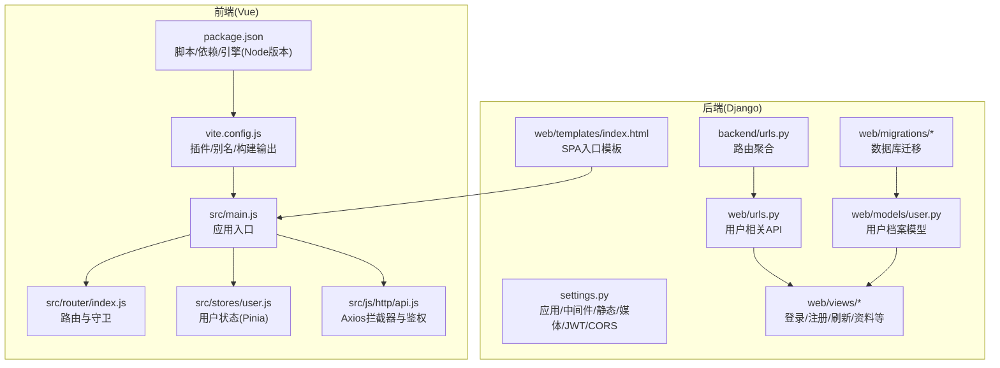
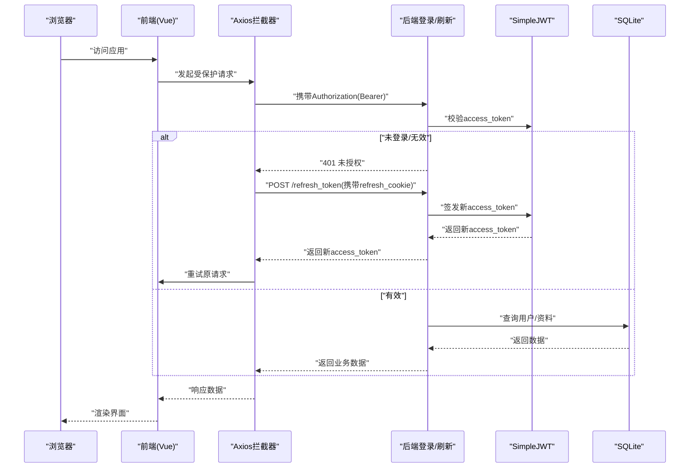
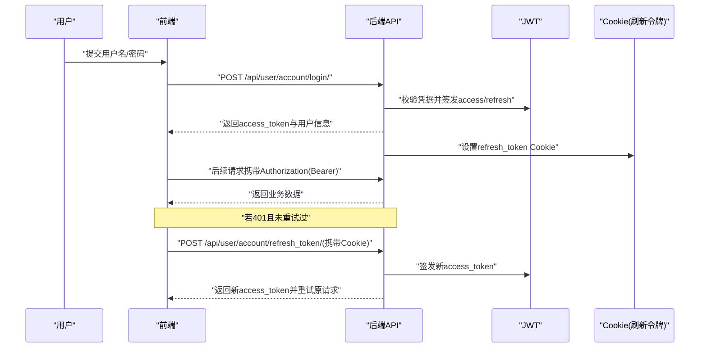

# 快速开始

<cite>
**本文引用的文件**
- [README.md](file://README.md)
- [backend/backend/settings.py](file://backend/backend/settings.py)
- [backend/manage.py](file://backend/manage.py)
- [backend/web/models/user.py](file://backend/web/models/user.py)
- [backend/web/views/user/account/register.py](file://backend/web/views/user/account/register.py)
- [backend/web/views/user/account/login.py](file://backend/web/views/user/account/login.py)
- [backend/web/urls.py](file://backend/web/urls.py)
- [backend/backend/urls.py](file://backend/backend/urls.py)
- [backend/web/migrations/0001_initial.py](file://backend/web/migrations/0001_initial.py)
- [backend/web/templates/index.html](file://backend/web/templates/index.html)
- [frontend/package.json](file://frontend/package.json)
- [frontend/vite.config.js](file://frontend/vite.config.js)
- [frontend/src/main.js](file://frontend/src/main.js)
- [frontend/src/router/index.js](file://frontend/src/router/index.js)
- [frontend/src/stores/user.js](file://frontend/src/stores/user.js)
- [frontend/src/js/http/api.js](file://frontend/src/js/http/api.js)
</cite>

## 目录
1. [简介](#简介)
2. [项目结构](#项目结构)
3. [核心组件](#核心组件)
4. [架构总览](#架构总览)
5. [详细组件分析](#详细组件分析)
6. [依赖关系分析](#依赖关系分析)
7. [性能考虑](#性能考虑)
8. [故障排查指南](#故障排查指南)
9. [结论](#结论)
10. [附录](#附录)

## 简介
本指南面向首次接触 LLM_AIfriends 的开发者，帮助你在本地快速完成环境准备、后端 Django 项目配置与数据库初始化、前端 Vue 项目依赖安装与开发服务器启动，并提供项目启动流程、访问方式、初始配置与常见问题排查建议，确保你能顺利运行并验证系统功能。

## 项目结构
项目采用前后端分离架构：
- 后端：Django + Django REST Framework + SimpleJWT + SQLite（默认）
- 前端：Vue 3 + Vite + Vue Router + Pinia + Axios
- 构建产物由 Vite 打包至 Django 的 static 目录，通过 Django 模板渲染入口页面，实现 SPA 与后端的统一部署入口

图表来源
- [backend/backend/settings.py:33-54](file://backend/backend/settings.py#L33-L54)
- [backend/backend/urls.py:23-26](file://backend/backend/urls.py#L23-L26)
- [backend/web/urls.py:10-23](file://backend/web/urls.py#L10-L23)
- [backend/web/models/user.py:15-23](file://backend/web/models/user.py#L15-L23)
- [backend/web/templates/index.html:1-17](file://backend/web/templates/index.html#L1-L17)
- [frontend/package.json:6-28](file://frontend/package.json#L6-L28)
- [frontend/vite.config.js:10-25](file://frontend/vite.config.js#L10-L25)
- [frontend/src/main.js:1-15](file://frontend/src/main.js#L1-L15)
- [frontend/src/router/index.js:12-104](file://frontend/src/router/index.js#L12-L104)
- [frontend/src/stores/user.js:4-59](file://frontend/src/stores/user.js#L4-L59)
- [frontend/src/js/http/api.js:14-19](file://frontend/src/js/http/api.js#L14-L19)

章节来源
- [README.md:1-1](file://README.md#L1-L1)
- [backend/backend/settings.py:79-84](file://backend/backend/settings.py#L79-L84)
- [backend/backend/urls.py:23-38](file://backend/backend/urls.py#L23-L38)
- [backend/web/urls.py:10-23](file://backend/web/urls.py#L10-L23)
- [frontend/package.json:6-28](file://frontend/package.json#L6-L28)
- [frontend/vite.config.js:10-25](file://frontend/vite.config.js#L10-L25)

## 核心组件
- 后端设置与认证
  - 默认使用 SQLite 数据库，静态资源与媒体资源路径配置，JWT 认证与 CORS 跨域配置
  - 参考：[settings.py:79-84](file://backend/backend/settings.py#L79-L84)，[settings.py:136-151](file://backend/backend/settings.py#L136-L151)，[settings.py:153-158](file://backend/backend/settings.py#L153-L158)
- 用户模型与迁移
  - 用户档案一对一关联 Django 内置 User，含头像、个人简介、创建/更新时间字段
  - 参考：[user.py:15-23](file://backend/web/models/user.py#L15-L23)，[0001_initial.py:18-29](file://backend/web/migrations/0001_initial.py#L18-L29)
- 用户相关 API
  - 登录、注册、刷新令牌、登出、获取用户信息、更新资料等接口
  - 参考：[login.py:9-46](file://backend/web/views/user/account/login.py#L9-L46)，[register.py:9-46](file://backend/web/views/user/account/register.py#L9-L46)，[web/urls.py:10-17](file://backend/web/urls.py#L10-L17)
- 前端入口与路由
  - SPA 应用入口、路由与导航守卫、用户状态管理、HTTP 请求拦截与自动刷新
  - 参考：[main.js:1-15](file://frontend/src/main.js#L1-L15)，[router/index.js:12-104](file://frontend/src/router/index.js#L12-L104)，[stores/user.js:4-59](file://frontend/src/stores/user.js#L4-L59)，[js/http/api.js:14-19](file://frontend/src/js/http/api.js#L14-L19)

章节来源
- [backend/backend/settings.py:79-84](file://backend/backend/settings.py#L79-L84)
- [backend/web/models/user.py:15-23](file://backend/web/models/user.py#L15-L23)
- [backend/web/views/user/account/login.py:9-46](file://backend/web/views/user/account/login.py#L9-L46)
- [backend/web/views/user/account/register.py:9-46](file://backend/web/views/user/account/register.py#L9-L46)
- [backend/web/urls.py:10-17](file://backend/web/urls.py#L10-L17)
- [frontend/src/main.js:1-15](file://frontend/src/main.js#L1-L15)
- [frontend/src/router/index.js:12-104](file://frontend/src/router/index.js#L12-L104)
- [frontend/src/stores/user.js:4-59](file://frontend/src/stores/user.js#L4-L59)
- [frontend/src/js/http/api.js:14-19](file://frontend/src/js/http/api.js#L14-L19)

## 架构总览
下图展示从浏览器到后端 API 的典型交互链路，包括登录、鉴权刷新与资源访问：

图表来源
- [frontend/src/js/http/api.js:46-90](file://frontend/src/js/http/api.js#L46-L90)
- [backend/web/views/user/account/login.py:20-39](file://backend/web/views/user/account/login.py#L20-L39)
- [backend/web/views/user/account/register.py:24-42](file://backend/web/views/user/account/register.py#L24-L42)
- [backend/backend/settings.py:136-151](file://backend/backend/settings.py#L136-L151)

## 详细组件分析

### 后端 Django 配置与数据库初始化
- 数据库
  - 默认使用 SQLite，数据库文件位于项目根目录下的 db.sqlite3
  - 参考：[settings.py:79-84](file://backend/backend/settings.py#L79-L84)
- 静态与媒体资源
  - 静态文件目录与媒体资源目录配置，开发阶段可直接通过 Django 提供静态资源
  - 参考：[settings.py:122-132](file://backend/backend/settings.py#L122-L132)，[backend/urls.py:29-37](file://backend/backend/urls.py#L29-L37)
- 认证与跨域
  - 使用 DRF SimpleJWT，配置访问令牌与刷新令牌生命周期，开启 CORS 并允许凭证
  - 参考：[settings.py:136-151](file://backend/backend/settings.py#L136-L151)，[settings.py:153-158](file://backend/backend/settings.py#L153-L158)
- 用户模型与迁移
  - 通过迁移创建用户档案表，包含头像、简介、时间戳等字段
  - 参考：[user.py:15-23](file://backend/web/models/user.py#L15-L23)，[0001_initial.py:18-29](file://backend/web/migrations/0001_initial.py#L18-L29)
- 启动与管理
  - 使用 manage.py 启动 Django 开发服务器
  - 参考：[manage.py:7-18](file://backend/manage.py#L7-L18)

章节来源
- [backend/backend/settings.py:79-84](file://backend/backend/settings.py#L79-L84)
- [backend/backend/settings.py:122-132](file://backend/backend/settings.py#L122-L132)
- [backend/backend/settings.py:136-151](file://backend/backend/settings.py#L136-L151)
- [backend/backend/settings.py:153-158](file://backend/backend/settings.py#L153-L158)
- [backend/web/models/user.py:15-23](file://backend/web/models/user.py#L15-L23)
- [backend/web/migrations/0001_initial.py:18-29](file://backend/web/migrations/0001_initial.py#L18-L29)
- [backend/backend/urls.py:29-37](file://backend/backend/urls.py#L29-L37)
- [backend/manage.py:7-18](file://backend/manage.py#L7-L18)

### 前端 Vue 项目配置与开发服务器
- Node.js 版本要求
  - package.json 中声明 Node 引擎版本范围，需满足要求
  - 参考：[package.json:26-28](file://frontend/package.json#L26-L28)
- 依赖与脚本
  - 包含 Vue 3、Vue Router、Pinia、Axios、TailwindCSS、Vite 插件等
  - 开发脚本 dev、构建脚本 build、预览脚本 preview
  - 参考：[package.json:6-25](file://frontend/package.json#L6-L25)
- 构建配置
  - Vite 将打包产物输出到 Django 的 static/frontend 目录，便于后端统一托管
  - 参考：[vite.config.js:16-19](file://frontend/vite.config.js#L16-L19)
- 应用入口与路由
  - main.js 初始化应用、挂载 Pinia 与 Router
  - router/index.js 定义页面路由与导航守卫
  - 参考：[src/main.js:1-15](file://frontend/src/main.js#L1-L15)，[src/router/index.js:12-104](file://frontend/src/router/index.js#L12-L104)
- 状态与鉴权
  - stores/user.js 维护登录状态与用户信息
  - js/http/api.js 统一注入 Authorization 头，处理 401 并自动刷新令牌
  - 参考：[src/stores/user.js:4-59](file://frontend/src/stores/user.js#L4-L59)，[src/js/http/api.js:14-19](file://frontend/src/js/http/api.js#L14-L19)

章节来源
- [frontend/package.json:6-28](file://frontend/package.json#L6-L28)
- [frontend/vite.config.js:16-19](file://frontend/vite.config.js#L16-L19)
- [frontend/src/main.js:1-15](file://frontend/src/main.js#L1-L15)
- [frontend/src/router/index.js:12-104](file://frontend/src/router/index.js#L12-L104)
- [frontend/src/stores/user.js:4-59](file://frontend/src/stores/user.js#L4-L59)
- [frontend/src/js/http/api.js:14-19](file://frontend/src/js/http/api.js#L14-L19)

### 关键流程：用户登录与令牌刷新

图表来源
- [backend/web/views/user/account/login.py:20-39](file://backend/web/views/user/account/login.py#L20-L39)
- [backend/web/views/user/account/register.py:24-42](file://backend/web/views/user/account/register.py#L24-L42)
- [frontend/src/js/http/api.js:46-90](file://frontend/src/js/http/api.js#L46-L90)

## 依赖关系分析
- 前端对后端的依赖
  - 前端通过 Axios 发起请求，后端提供 REST 接口与静态资源服务
  - 参考：[frontend/src/js/http/api.js:14-19](file://frontend/src/js/http/api.js#L14-L19)，[backend/web/urls.py:10-17](file://backend/web/urls.py#L10-L17)
- 前端构建对后端的集成
  - Vite 构建产物输出到 Django static 目录，Django 模板加载前端资源
  - 参考：[frontend/vite.config.js:16-19](file://frontend/vite.config.js#L16-L19)，[backend/web/templates/index.html:10-11](file://backend/web/templates/index.html#L10-L11)
- 后端对第三方库的依赖
  - DRF、SimpleJWT、CORS、SQLite 等
  - 参考：[backend/backend/settings.py:33-43](file://backend/backend/settings.py#L33-L43)，[backend/backend/settings.py:136-151](file://backend/backend/settings.py#L136-L151)

章节来源
- [frontend/src/js/http/api.js:14-19](file://frontend/src/js/http/api.js#L14-L19)
- [backend/web/urls.py:10-17](file://backend/web/urls.py#L10-L17)
- [frontend/vite.config.js:16-19](file://frontend/vite.config.js#L16-L19)
- [backend/web/templates/index.html:10-11](file://backend/web/templates/index.html#L10-L11)
- [backend/backend/settings.py:33-43](file://backend/backend/settings.py#L33-L43)
- [backend/backend/settings.py:136-151](file://backend/backend/settings.py#L136-L151)

## 性能考虑
- 开发阶段
  - 使用 SQLite 与 Django 开发服务器即可满足本地开发需求
  - 前端使用 Vite 的热更新提升开发体验
- 生产阶段
  - 静态资源与媒体资源应由 Nginx 等反向代理提供，减少 Django 负担
  - JWT 令牌生命周期合理配置，避免频繁刷新带来的额外开销
- 建议
  - 对于高频接口，可在后端增加缓存策略（如 Redis）以降低数据库压力
  - 前端按需加载与懒路由可减少首屏体积

## 故障排查指南
- 前端无法访问后端接口（CORS 错误）
  - 检查后端 CORS 配置与允许的源地址
  - 参考：[settings.py:153-158](file://backend/backend/settings.py#L153-L158)
- 登录后仍提示未授权或频繁 401
  - 确认前端 Axios 是否正确注入 Authorization 头
  - 确认后端是否正确设置 refresh_token Cookie
  - 参考：[api.js:21-27](file://frontend/src/js/http/api.js#L21-L27)，[login.py:31-39](file://backend/web/views/user/account/login.py#L31-L39)
- 刷新令牌失败导致无法继续请求
  - 检查刷新接口是否正常返回新 access_token
  - 参考：[api.js:68-84](file://frontend/src/js/http/api.js#L68-L84)，[login.py:20-39](file://backend/web/views/user/account/login.py#L20-L39)
- 媒体资源无法加载
  - 确认 MEDIA_URL 与 MEDIA_ROOT 配置，开发阶段由 Django 提供静态资源
  - 参考：[settings.py:130-132](file://backend/backend/settings.py#L130-L132)，[backend/urls.py:34-37](file://backend/backend/urls.py#L34-L37)
- 数据库迁移未生效
  - 确保执行了 migrate 命令，检查迁移文件是否存在
  - 参考：[0001_initial.py:11-12](file://backend/web/migrations/0001_initial.py#L11-L12)
- 前端构建产物未被 Django 加载
  - 确认 Vite 输出目录与 Django 静态资源路径一致
  - 参考：[vite.config.js:16-19](file://frontend/vite.config.js#L16-L19)，[index.html:10-11](file://backend/web/templates/index.html#L10-L11)

章节来源
- [backend/backend/settings.py:153-158](file://backend/backend/settings.py#L153-L158)
- [frontend/src/js/http/api.js:21-27](file://frontend/src/js/http/api.js#L21-L27)
- [backend/web/views/user/account/login.py:31-39](file://backend/web/views/user/account/login.py#L31-L39)
- [frontend/src/js/http/api.js:68-84](file://frontend/src/js/http/api.js#L68-L84)
- [backend/backend/settings.py:130-132](file://backend/backend/settings.py#L130-L132)
- [backend/backend/urls.py:34-37](file://backend/backend/urls.py#L34-L37)
- [backend/web/migrations/0001_initial.py:11-12](file://backend/web/migrations/0001_initial.py#L11-L12)
- [frontend/vite.config.js:16-19](file://frontend/vite.config.js#L16-L19)
- [backend/web/templates/index.html:10-11](file://backend/web/templates/index.html#L10-L11)

## 结论
通过本指南，你可以在本地完成 Python/Django、Node.js/Vite 的环境准备，正确配置后端 Django 与数据库，安装前端依赖并启动开发服务器。结合路由守卫与 Axios 拦截器，你可以完成登录、鉴权与资源访问的端到端验证。遇到问题时，可依据“故障排查指南”逐项定位并解决。

## 附录

### 环境与工具要求
- Python 与 Django
  - 使用 Python 3.x，安装 Django 与 DRF、SimpleJWT、CORS 等依赖
  - 参考：[settings.py:33-43](file://backend/backend/settings.py#L33-L43)
- Node.js 与前端
  - Node.js 版本需满足 package.json 中 engines 字段要求
  - 参考：[package.json:26-28](file://frontend/package.json#L26-L28)

章节来源
- [backend/backend/settings.py:33-43](file://backend/backend/settings.py#L33-L43)
- [frontend/package.json:26-28](file://frontend/package.json#L26-L28)

### 项目启动流程与访问方式
- 后端启动
  - 在 backend 目录下执行 Django 管理命令启动开发服务器
  - 参考：[manage.py:7-18](file://backend/manage.py#L7-L18)
- 前端启动
  - 在 frontend 目录下执行开发脚本启动 Vite 开发服务器
  - 参考：[package.json:6-10](file://frontend/package.json#L6-L10)
- 访问方式
  - 前端默认监听本地端口（Vite 默认端口），后端提供 API 与静态资源
  - 参考：[backend/backend/urls.py:29-37](file://backend/backend/urls.py#L29-L37)，[frontend/vite.config.js:16-19](file://frontend/vite.config.js#L16-L19)

章节来源
- [backend/manage.py:7-18](file://backend/manage.py#L7-L18)
- [frontend/package.json:6-10](file://frontend/package.json#L6-L10)
- [backend/backend/urls.py:29-37](file://backend/backend/urls.py#L29-L37)
- [frontend/vite.config.js:16-19](file://frontend/vite.config.js#L16-L19)