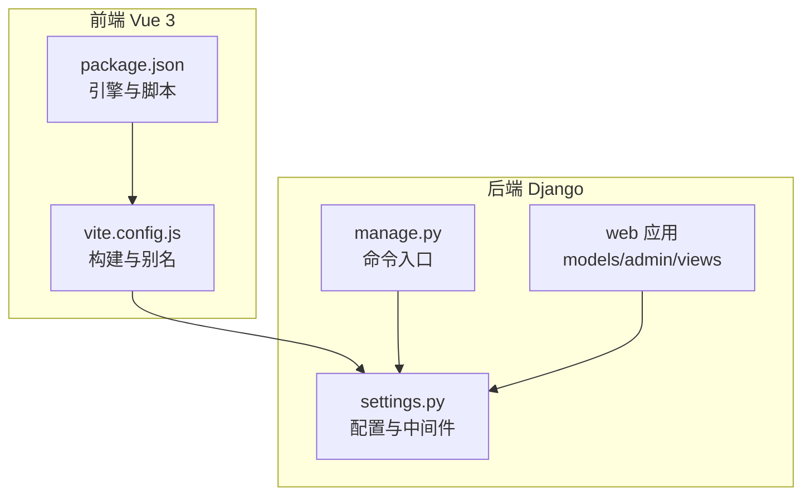
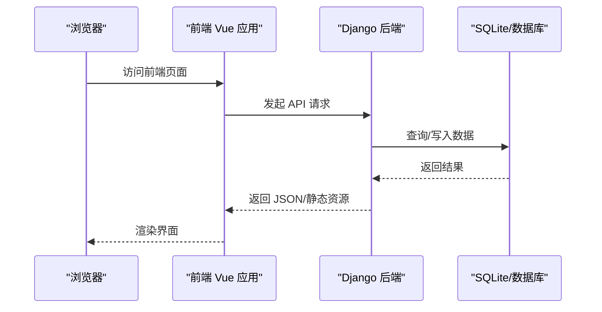
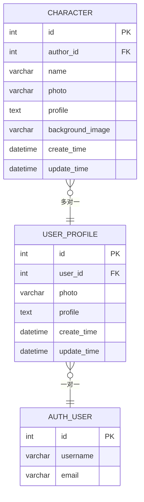
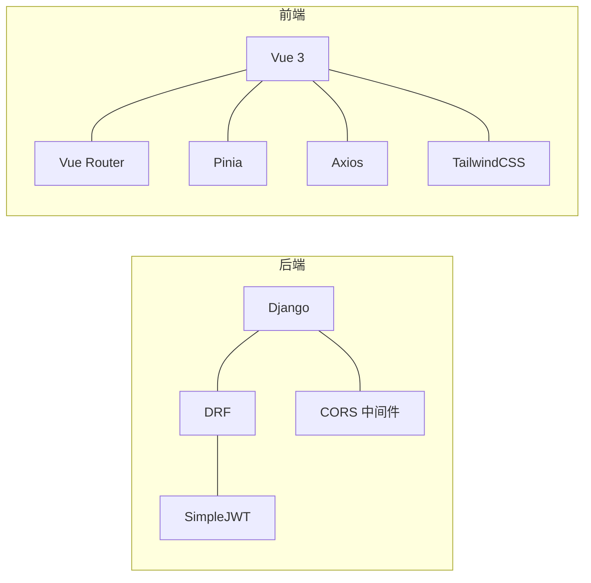

# 快速开始

<cite>
**本文引用的文件**
- [README.md](file://README.md)
- [backend/backend/settings.py](file://backend/backend/settings.py)
- [backend/manage.py](file://backend/manage.py)
- [backend/web/models/user.py](file://backend/web/models/user.py)
- [backend/web/models/character.py](file://backend/web/models/character.py)
- [backend/web/admin.py](file://backend/web/admin.py)
- [backend/web/views/index.py](file://backend/web/views/index.py)
- [frontend/package.json](file://frontend/package.json)
- [frontend/vite.config.js](file://frontend/vite.config.js)
</cite>

## 目录
1. [简介](#简介)
2. [项目结构](#项目结构)
3. [核心组件](#核心组件)
4. [架构总览](#架构总览)
5. [详细组件分析](#详细组件分析)
6. [依赖分析](#依赖分析)
7. [性能考虑](#性能考虑)
8. [故障排除指南](#故障排除指南)
9. [结论](#结论)
10. [附录](#附录)

## 简介
本指南面向新加入的开发者，帮助你在约30分钟内完成 LLM_AIfriends 项目的环境准备、后端 Django 与前端 Vue 3 应用的安装与启动，并成功在本地运行。你将获得从零到一的完整分步指引，以及常见问题的排查建议。

## 项目结构
该项目采用前后端分离架构：
- 后端：Django（Python）项目位于 backend 目录，包含 Django settings、应用 web、管理后台与数据库模型。
- 前端：Vue 3 项目位于 frontend 目录，使用 Vite 构建，打包产物输出至 Django 的 static 目录以便统一托管。

图表来源
- [backend/backend/settings.py:1-159](file://backend/backend/settings.py#L1-L159)
- [backend/manage.py:1-23](file://backend/manage.py#L1-L23)
- [frontend/package.json:1-30](file://frontend/package.json#L1-L30)
- [frontend/vite.config.js:1-26](file://frontend/vite.config.js#L1-L26)

章节来源
- [README.md:1-1](file://README.md#L1-L1)
- [backend/backend/settings.py:1-159](file://backend/backend/settings.py#L1-L159)
- [backend/manage.py:1-23](file://backend/manage.py#L1-L23)
- [frontend/package.json:1-30](file://frontend/package.json#L1-L30)
- [frontend/vite.config.js:1-26](file://frontend/vite.config.js#L1-L26)

## 核心组件
- 后端 Django
  - 默认使用 SQLite 数据库（开发环境），可通过设置切换为 PostgreSQL。
  - REST 框架集成 JWT 认证，支持跨域访问。
  - 提供用户资料与角色（Character）模型，支持图片上传与媒体资源访问。
- 前端 Vue 3
  - 使用 Vite 构建，开发服务器默认监听前端端口。
  - 打包产物输出到 Django static 目录，由 Django 统一提供静态资源服务。

章节来源
- [backend/backend/settings.py:76-84](file://backend/backend/settings.py#L76-L84)
- [backend/backend/settings.py:133-159](file://backend/backend/settings.py#L133-L159)
- [backend/web/models/user.py:1-23](file://backend/web/models/user.py#L1-L23)
- [backend/web/models/character.py:1-32](file://backend/web/models/character.py#L1-L32)
- [frontend/package.json:6-8](file://frontend/package.json#L6-L8)
- [frontend/vite.config.js:16-19](file://frontend/vite.config.js#L16-L19)

## 架构总览
下图展示了本地开发时的请求流：浏览器访问前端页面，前端通过 API 调用后端接口；后端返回数据并处理静态资源（如图片）。

图表来源
- [backend/backend/settings.py:129-131](file://backend/backend/settings.py#L129-L131)
- [backend/web/models/user.py:14-22](file://backend/web/models/user.py#L14-L22)
- [backend/web/models/character.py:21-31](file://backend/web/models/character.py#L21-L31)

## 详细组件分析

### 后端 Django 设置与数据库
- 数据库
  - 默认使用 SQLite（开发友好，无需额外安装）。
  - 如需使用 PostgreSQL，请在设置中替换数据库配置项。
- 静态与媒体资源
  - 静态文件目录与媒体根目录已配置，媒体访问地址为固定回环地址。
- 认证与跨域
  - 默认启用 JWT 认证与跨域允许，开发环境仅允许本地前端源。

章节来源
- [backend/backend/settings.py:76-84](file://backend/backend/settings.py#L76-L84)
- [backend/backend/settings.py:121-131](file://backend/backend/settings.py#L121-L131)
- [backend/backend/settings.py:133-159](file://backend/backend/settings.py#L133-L159)

### 用户与角色模型
- 用户资料模型
  - 关联 Django 内置 User，支持头像上传与个人简介。
- 角色模型
  - 外键关联用户资料，支持头像与背景图上传，记录创建与更新时间。

图表来源
- [backend/web/models/user.py:14-22](file://backend/web/models/user.py#L14-L22)
- [backend/web/models/character.py:21-31](file://backend/web/models/character.py#L21-L31)

章节来源
- [backend/web/models/user.py:1-23](file://backend/web/models/user.py#L1-L23)
- [backend/web/models/character.py:1-32](file://backend/web/models/character.py#L1-L32)

### 管理后台与首页视图
- 管理后台
  - 注册用户资料与角色模型，便于在后台查看与编辑。
- 首页视图
  - 提供模板渲染入口，用于承载前端单页应用。

章节来源
- [backend/web/admin.py:1-14](file://backend/web/admin.py#L1-L14)
- [backend/web/views/index.py:1-6](file://backend/web/views/index.py#L1-L6)

### 前端工程配置
- 引擎版本
  - Node.js 版本要求为特定范围，确保与工程兼容。
- 构建输出
  - Vite 打包产物输出到 Django static 目录，便于后端统一托管。
- 依赖
  - 包含 Vue 3、路由、状态管理、HTTP 客户端与样式工具等。

章节来源
- [frontend/package.json:6-8](file://frontend/package.json#L6-L8)
- [frontend/vite.config.js:16-19](file://frontend/vite.config.js#L16-L19)
- [frontend/package.json:14-28](file://frontend/package.json#L14-L28)

## 依赖分析
- 后端依赖
  - Django、Django REST Framework、SimpleJWT、CORS 头部中间件。
- 前端依赖
  - Vue 3、Vue Router、Pinia、Axios、TailwindCSS 及相关插件。

图表来源
- [backend/backend/settings.py:33-43](file://backend/backend/settings.py#L33-L43)
- [backend/backend/settings.py:136-151](file://backend/backend/settings.py#L136-L151)
- [frontend/package.json:14-28](file://frontend/package.json#L14-L28)

章节来源
- [backend/backend/settings.py:33-43](file://backend/backend/settings.py#L33-L43)
- [frontend/package.json:14-28](file://frontend/package.json#L14-L28)

## 性能考虑
- 开发阶段优先使用 SQLite，减少部署复杂度。
- 媒体文件存储在本地磁盘，建议在生产环境迁移到对象存储或 CDN。
- 前端构建产物直接由 Django 提供，避免额外反向代理配置。

## 故障排除指南
- Python 依赖安装失败
  - 确认已创建并激活虚拟环境后再安装依赖。
  - 若网络受限，可配置国内镜像源。
- Node.js 版本不匹配
  - 检查 package.json 中的 engines 字段，按要求安装 Node.js。
- 前端无法启动或热更新异常
  - 清理 node_modules 并重新安装依赖；确认 Vite 插件加载正常。
- Django 启动报错找不到模块
  - 确保 manage.py 的设置模块正确指向 backend.settings。
- 跨域或登录鉴权失败
  - 检查设置中的跨域允许来源与 JWT 过期策略。
- 媒体资源无法访问
  - 确认 MEDIA_URL 与 MEDIA_ROOT 配置一致，且静态文件目录可读。

章节来源
- [backend/manage.py:9-18](file://backend/manage.py#L9-L18)
- [backend/backend/settings.py:153-159](file://backend/backend/settings.py#L153-L159)
- [backend/backend/settings.py:129-131](file://backend/backend/settings.py#L129-L131)
- [frontend/package.json:6-8](file://frontend/package.json#L6-L8)

## 结论
按照本指南的步骤，你可以在短时间内完成环境准备、依赖安装与本地运行。若遇到问题，可参考“故障排除指南”逐项检查。后续如需扩展功能或迁移到生产环境，可逐步替换数据库、优化静态资源与鉴权策略。

## 附录

### 分步快速开始（30分钟）
- 环境准备
  - 安装 Python 3.8+，推荐使用虚拟环境隔离项目依赖。
  - 安装 Node.js（满足 package.json 中的引擎版本要求），安装包管理器。
  - 安装 PostgreSQL（可选，如需使用 PostgreSQL 则进行配置）。
- 克隆与后端设置
  - 在 backend 目录下创建并激活虚拟环境。
  - 安装 Python 依赖（Django、DRF、SimpleJWT、CORS 等）。
  - 初始化数据库（创建迁移文件并执行迁移）。
  - 创建 Django 管理员账号（如需后台管理）。
- 前端设置
  - 在 frontend 目录安装 Node 依赖。
  - 启动前端开发服务器。
- 本地运行
  - 启动 Django 开发服务器。
  - 在浏览器打开前端页面，完成登录与功能验证。
- 常见问题
  - 若出现跨域或鉴权错误，检查后端设置中的跨域与 JWT 配置。
  - 若媒体资源无法显示，检查 MEDIA_URL 与 MEDIA_ROOT 是否一致。

章节来源
- [backend/manage.py:1-23](file://backend/manage.py#L1-L23)
- [backend/backend/settings.py:76-84](file://backend/backend/settings.py#L76-L84)
- [backend/backend/settings.py:133-159](file://backend/backend/settings.py#L133-L159)
- [frontend/package.json:6-8](file://frontend/package.json#L6-L8)
- [frontend/vite.config.js:16-19](file://frontend/vite.config.js#L16-L19)