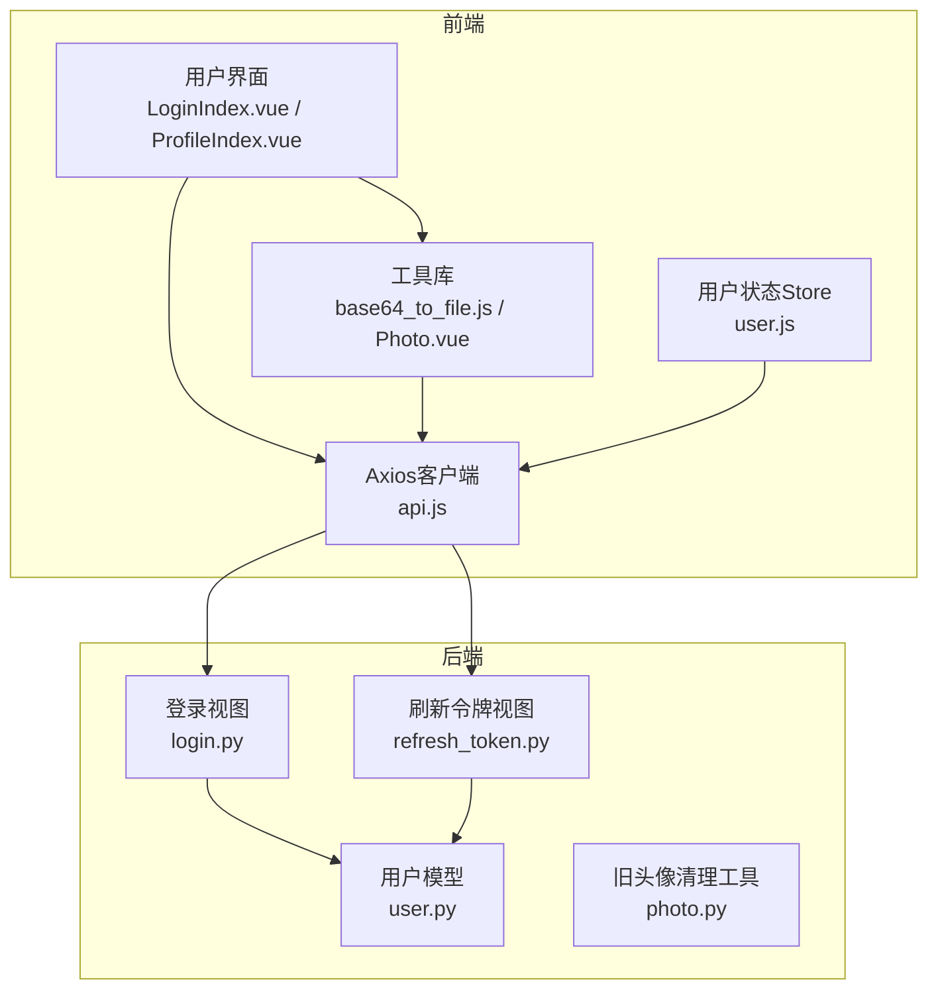
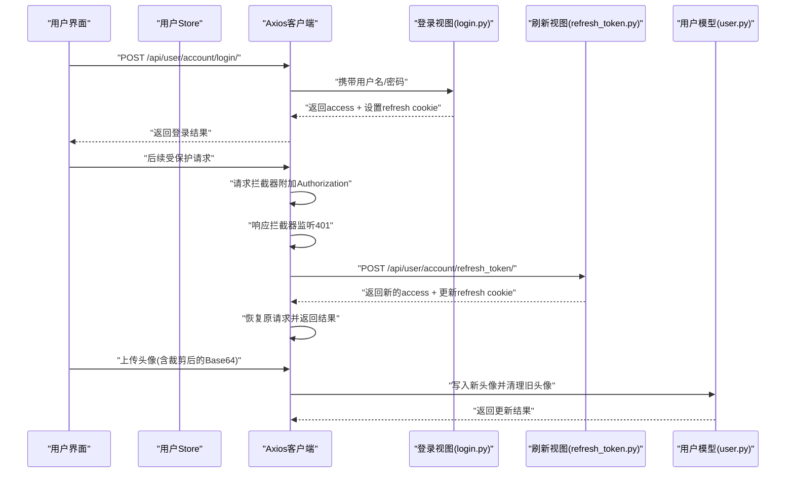
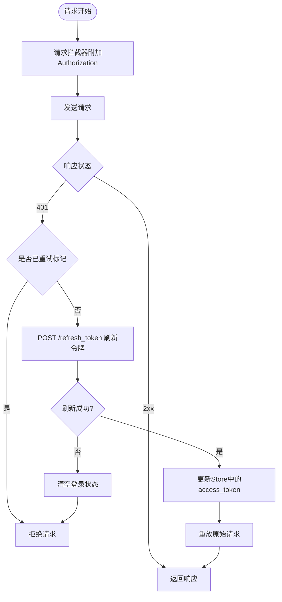
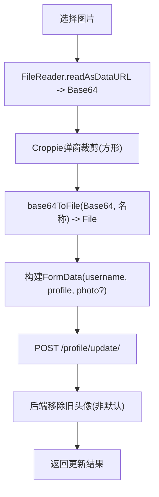
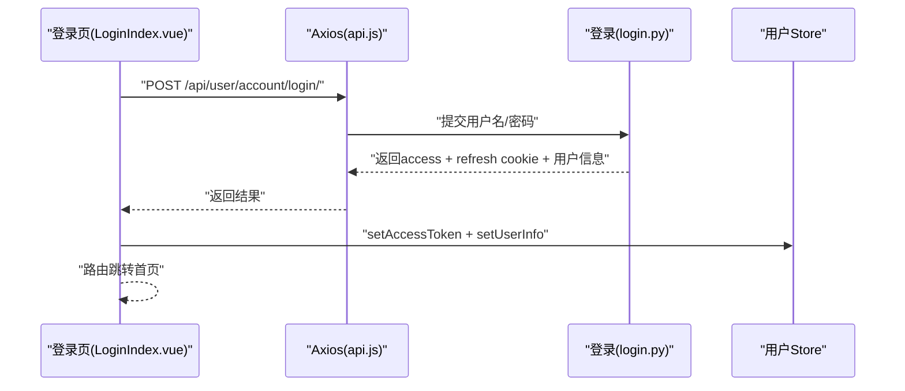
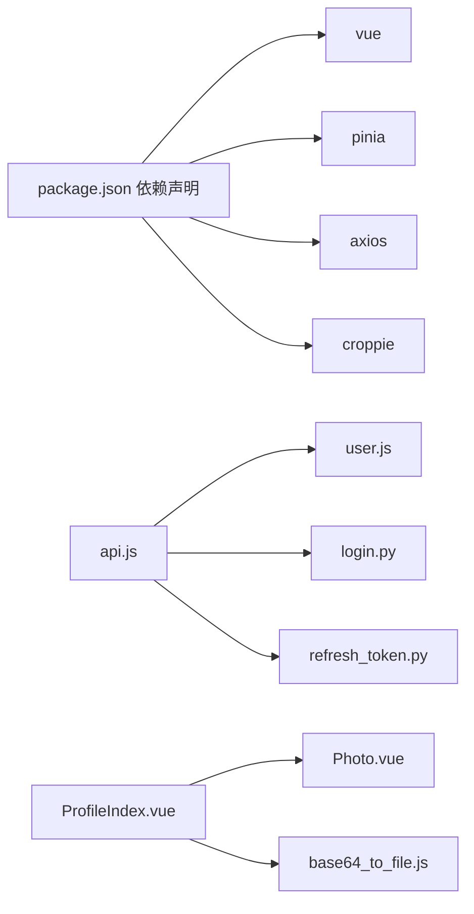

# API集成

<cite>
**本文引用的文件**
- [frontend/src/js/http/api.js](file://frontend/src/js/http/api.js)
- [frontend/src/stores/user.js](file://frontend/src/stores/user.js)
- [frontend/src/js/utils/base64_to_file.js](file://frontend/src/js/utils/base64_to_file.js)
- [frontend/src/views/user/account/LoginIndex.vue](file://frontend/src/views/user/account/LoginIndex.vue)
- [frontend/src/views/user/profile/ProfileIndex.vue](file://frontend/src/views/user/profile/ProfileIndex.vue)
- [frontend/src/views/user/profile/components/Photo.vue](file://frontend/src/views/user/profile/components/Photo.vue)
- [frontend/package.json](file://frontend/package.json)
- [backend/web/views/user/account/login.py](file://backend/web/views/user/account/login.py)
- [backend/web/views/user/account/refresh_token.py](file://backend/web/views/user/account/refresh_token.py)
- [backend/web/models/user.py](file://backend/web/models/user.py)
- [backend/web/views/utils/photo.py](file://backend/web/views/utils/photo.py)
</cite>

## 目录
1. [引言](#引言)
2. [项目结构](#项目结构)
3. [核心组件](#核心组件)
4. [架构总览](#架构总览)
5. [详细组件分析](#详细组件分析)
6. [依赖分析](#依赖分析)
7. [性能考量](#性能考量)
8. [故障排查指南](#故障排查指南)
9. [结论](#结论)
10. [附录](#附录)

## 引言
本文件面向LLM_AIfriends项目的前端开发者与集成工程师，系统性梳理API集成方案，重点覆盖：
- Axios客户端配置与拦截器封装
- JWT访问令牌的自动注入、刷新与过期处理
- 文件上传流程（Base64到文件转换、图片裁剪）
- 并发请求、缓存与重试策略建议
- 安全性、错误处理与用户体验优化
- 开发与调试方法

## 项目结构
前端采用Vue 3 + Vite + Pinia，后端采用Django + Django REST framework + SimpleJWT。API层通过Axios统一发起HTTP请求，并由拦截器完成鉴权与刷新逻辑；用户状态通过Pinia Store集中管理；文件上传结合Croppie进行图片裁剪与Base64到File转换。



图表来源
- [frontend/src/js/http/api.js:1-92](file://frontend/src/js/http/api.js#L1-L92)
- [frontend/src/stores/user.js:1-59](file://frontend/src/stores/user.js#L1-L59)
- [frontend/src/js/utils/base64_to_file.js:1-10](file://frontend/src/js/utils/base64_to_file.js#L1-L10)
- [frontend/src/views/user/account/LoginIndex.vue:1-69](file://frontend/src/views/user/account/LoginIndex.vue#L1-L69)
- [frontend/src/views/user/profile/ProfileIndex.vue:1-77](file://frontend/src/views/user/profile/ProfileIndex.vue#L1-L77)
- [frontend/src/views/user/profile/components/Photo.vue:1-109](file://frontend/src/views/user/profile/components/Photo.vue#L1-L109)
- [backend/web/views/user/account/login.py:1-92](file://backend/web/views/user/account/login.py#L1-L92)
- [backend/web/views/user/account/refresh_token.py:1-41](file://backend/web/views/user/account/refresh_token.py#L1-L41)
- [backend/web/models/user.py:1-23](file://backend/web/models/user.py#L1-L23)
- [backend/web/views/utils/photo.py:1-13](file://backend/web/views/utils/photo.py#L1-L13)

章节来源
- [frontend/package.json:1-30](file://frontend/package.json#L1-L30)

## 核心组件
- Axios客户端与拦截器：统一设置Authorization头、处理401未授权并触发刷新流程、并发请求的刷新去重。
- 用户状态Store：集中保存访问令牌、用户信息，提供登录态判断与登出清理。
- 登录与刷新接口：后端使用SimpleJWT生成access/refresh对，刷新时可轮换refresh token并延长有效期。
- 文件上传链路：前端通过Croppie裁剪图片生成Base64，再转换为File上传至后端。

章节来源
- [frontend/src/js/http/api.js:1-92](file://frontend/src/js/http/api.js#L1-L92)
- [frontend/src/stores/user.js:1-59](file://frontend/src/stores/user.js#L1-L59)
- [backend/web/views/user/account/login.py:1-92](file://backend/web/views/user/account/login.py#L1-L92)
- [backend/web/views/user/account/refresh_token.py:1-41](file://backend/web/views/user/account/refresh_token.py#L1-L41)

## 架构总览
下图展示从前端到后端的关键交互路径，包括登录、鉴权、刷新与文件上传。



图表来源
- [frontend/src/js/http/api.js:1-92](file://frontend/src/js/http/api.js#L1-L92)
- [frontend/src/views/user/account/LoginIndex.vue:1-69](file://frontend/src/views/user/account/LoginIndex.vue#L1-L69)
- [frontend/src/views/user/profile/ProfileIndex.vue:1-77](file://frontend/src/views/user/profile/ProfileIndex.vue#L1-L77)
- [backend/web/views/user/account/login.py:1-92](file://backend/web/views/user/account/login.py#L1-L92)
- [backend/web/views/user/account/refresh_token.py:1-41](file://backend/web/views/user/account/refresh_token.py#L1-L41)
- [backend/web/models/user.py:1-23](file://backend/web/models/user.py#L1-L23)

## 详细组件分析

### Axios客户端与拦截器
- 请求拦截器：从用户Store读取访问令牌，统一注入Authorization头。
- 响应拦截器：捕获401未授权错误，执行刷新流程：
  - 使用Cookie中的refresh_token调用刷新接口。
  - 刷新期间对同一时间内的并发请求进行订阅等待，避免重复刷新。
  - 刷新成功后重放原始请求；刷新失败则清空本地登录状态并拒绝请求。



图表来源
- [frontend/src/js/http/api.js:21-90](file://frontend/src/js/http/api.js#L21-L90)
- [frontend/src/stores/user.js:22-39](file://frontend/src/stores/user.js#L22-L39)

章节来源
- [frontend/src/js/http/api.js:1-92](file://frontend/src/js/http/api.js#L1-L92)
- [frontend/src/stores/user.js:1-59](file://frontend/src/stores/user.js#L1-L59)

### JWT令牌管理与刷新策略
- 登录：后端验证凭据，签发access_token，并将refresh_token以HttpOnly Cookie形式下发，设置安全属性与有效期。
- 刷新：前端检测401后触发刷新接口，后端校验refresh_token有效性，必要时轮换并延长refresh_token有效期，返回新的access_token与更新后的refresh cookie。
- 存储：前端仅保存access_token于Store；refresh_token由浏览器Cookie管理，避免XSS风险。

```mermaid
sequenceDiagram
participant C as "客户端"
participant J as "JWT服务"
participant B as "浏览器Cookie"
C->>J : "POST /login (用户名/密码)"
J-->>B : "Set-Cookie : refresh_token=...; HttpOnly; Secure; SameSite=Lax"
J-->>C : "返回access_token + 用户信息"
C->>J : "受保护请求(携带access_token)"
J-->>C : "401 Unauthorized"
C->>J : "POST /refresh_token (携带refresh_token Cookie)"
J-->>B : "Set-Cookie : refresh_token=... (可能轮换)"
J-->>C : "返回新的access_token"
```

图表来源
- [backend/web/views/user/account/login.py:31-38](file://backend/web/views/user/account/login.py#L31-L38)
- [backend/web/views/user/account/refresh_token.py:10-32](file://backend/web/views/user/account/refresh_token.py#L10-L32)
- [frontend/src/js/http/api.js:70-84](file://frontend/src/js/http/api.js#L70-L84)

章节来源
- [backend/web/views/user/account/login.py:1-92](file://backend/web/views/user/account/login.py#L1-L92)
- [backend/web/views/user/account/refresh_token.py:1-41](file://backend/web/views/user/account/refresh_token.py#L1-L41)
- [frontend/src/js/http/api.js:46-90](file://frontend/src/js/http/api.js#L46-L90)

### 文件上传与图片裁剪
- 图片选择与预览：通过FileReader将图片读为Base64，弹窗Croppie进行方形裁剪。
- Base64到File转换：将裁剪结果按标准格式拆分，解码为字节数组，构造File对象。
- 上传策略：仅当头像发生变化时才上传；后端接收FormData，写入新头像并清理旧头像（非默认头像）。



图表来源
- [frontend/src/views/user/profile/components/Photo.vue:43-66](file://frontend/src/views/user/profile/components/Photo.vue#L43-L66)
- [frontend/src/js/utils/base64_to_file.js:1-10](file://frontend/src/js/utils/base64_to_file.js#L1-L10)
- [frontend/src/views/user/profile/ProfileIndex.vue:33-49](file://frontend/src/views/user/profile/ProfileIndex.vue#L33-L49)
- [backend/web/views/utils/photo.py:9-13](file://backend/web/views/utils/photo.py#L9-L13)

章节来源
- [frontend/src/views/user/profile/components/Photo.vue:1-109](file://frontend/src/views/user/profile/components/Photo.vue#L1-L109)
- [frontend/src/js/utils/base64_to_file.js:1-10](file://frontend/src/js/utils/base64_to_file.js#L1-L10)
- [frontend/src/views/user/profile/ProfileIndex.vue:1-77](file://frontend/src/views/user/profile/ProfileIndex.vue#L1-L77)
- [backend/web/views/utils/photo.py:1-13](file://backend/web/views/utils/photo.py#L1-L13)
- [backend/web/models/user.py:1-23](file://backend/web/models/user.py#L1-L23)

### 登录与资料更新流程
- 登录：表单校验后调用登录接口，成功后保存access_token与用户信息并跳转首页。
- 资料更新：收集头像、用户名、简介，仅在头像变更时上传，后端返回成功则同步Store。



图表来源
- [frontend/src/views/user/account/LoginIndex.vue:15-41](file://frontend/src/views/user/account/LoginIndex.vue#L15-L41)
- [frontend/src/js/http/api.js:16-19](file://frontend/src/js/http/api.js#L16-L19)
- [backend/web/views/user/account/login.py:9-46](file://backend/web/views/user/account/login.py#L9-L46)

章节来源
- [frontend/src/views/user/account/LoginIndex.vue:1-69](file://frontend/src/views/user/account/LoginIndex.vue#L1-L69)
- [frontend/src/views/user/profile/ProfileIndex.vue:1-77](file://frontend/src/views/user/profile/ProfileIndex.vue#L1-L77)

## 依赖分析
- 前端依赖：Vue 3、Pinia、Axios、croppie、vue-router等。
- 关键耦合点：
  - api.js依赖user.js提供的访问令牌与登出能力。
  - ProfileIndex.vue依赖Photo.vue的裁剪结果与base64ToFile工具。
  - 后端login.py与refresh_token.py依赖Django SimpleJWT与Cookie配置。



图表来源
- [frontend/package.json:11-19](file://frontend/package.json#L11-L19)
- [frontend/src/js/http/api.js:11-12](file://frontend/src/js/http/api.js#L11-L12)
- [frontend/src/stores/user.js:1-59](file://frontend/src/stores/user.js#L1-L59)
- [frontend/src/views/user/profile/ProfileIndex.vue:1-77](file://frontend/src/views/user/profile/ProfileIndex.vue#L1-L77)
- [frontend/src/views/user/profile/components/Photo.vue:1-109](file://frontend/src/views/user/profile/components/Photo.vue#L1-L109)
- [frontend/src/js/utils/base64_to_file.js:1-10](file://frontend/src/js/utils/base64_to_file.js#L1-L10)
- [backend/web/views/user/account/login.py:1-92](file://backend/web/views/user/account/login.py#L1-L92)
- [backend/web/views/user/account/refresh_token.py:1-41](file://backend/web/views/user/account/refresh_token.py#L1-L41)

章节来源
- [frontend/package.json:1-30](file://frontend/package.json#L1-L30)

## 性能考量
- 并发控制：拦截器中通过“正在刷新标识”与订阅队列避免重复刷新，降低网络与服务器压力。
- 请求去重：对同一时间内的重复401场景，仅一次刷新，其余请求等待新token后重放。
- 上传优化：仅在头像变更时上传，减少不必要的IO与带宽消耗。
- 缓存策略：当前未实现HTTP缓存，建议对只读列表/静态资源引入ETag/Cache-Control；对受保护接口避免浏览器缓存敏感数据。
- 重试机制：当前未实现指数退避重试，可在网络不稳定场景增加有限次数的自动重试，但需避免对幂等性差的请求盲目重试。

## 故障排查指南
- 401未授权频繁出现
  - 检查刷新接口是否成功返回新的access_token与refresh cookie。
  - 确认浏览器Cookie中refresh_token存在且未过期。
  - 排查拦截器是否正确附加Authorization头。
- 刷新失败导致登出
  - 刷新接口返回401时，前端会清空登录状态；检查后端刷新逻辑与SimpleJWT配置。
- 头像上传无效
  - 确认裁剪后生成的Base64已转换为File并加入FormData。
  - 检查后端是否正确接收photo字段并调用旧头像清理逻辑。
- 调试方法
  - 打开浏览器Network面板，观察请求头Authorization与Cookie，确认刷新流程。
  - 在拦截器与Store中添加日志，定位token注入与刷新时机。
  - 使用后端日志查看登录/刷新接口的返回与异常分支。

章节来源
- [frontend/src/js/http/api.js:46-90](file://frontend/src/js/http/api.js#L46-L90)
- [frontend/src/stores/user.js:33-39](file://frontend/src/stores/user.js#L33-L39)
- [backend/web/views/user/account/refresh_token.py:10-14](file://backend/web/views/user/account/refresh_token.py#L10-L14)
- [backend/web/views/utils/photo.py:9-13](file://backend/web/views/utils/photo.py#L9-L13)

## 结论
本项目通过Axios拦截器实现了透明的JWT鉴权与自动刷新，配合Pinia集中管理用户状态，确保了良好的用户体验与安全性。文件上传链路结合Croppie与Base64转换，满足头像裁剪与上传需求。建议在现有基础上补充HTTP缓存与有限重试策略，进一步提升稳定性与性能。

## 附录
- 最佳实践清单
  - 严格区分访问令牌与刷新令牌的存储位置（前者在内存，后者在Cookie）。
  - 对受保护接口统一使用拦截器注入Authorization头。
  - 刷新期间对并发请求进行去重与等待，避免风暴效应。
  - 上传前进行前端基础校验，减少无效请求。
  - 对只读接口考虑引入缓存策略，对受保护接口避免缓存敏感数据。
  - 在网络不稳定场景谨慎引入重试，优先保证幂等性。