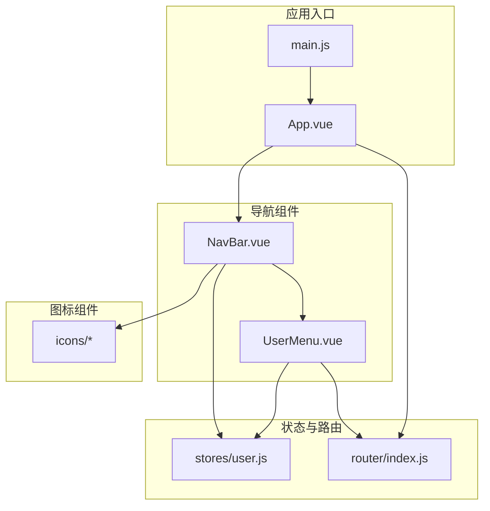
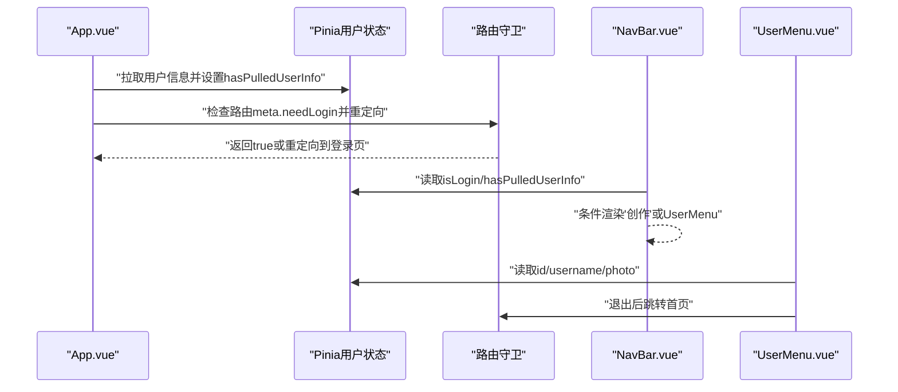
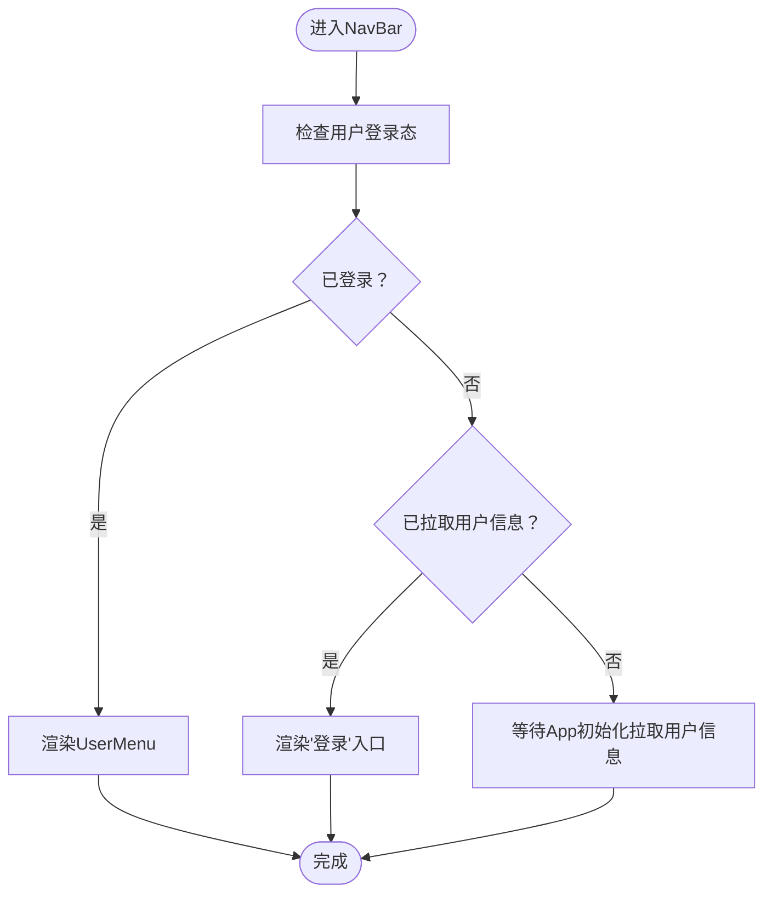
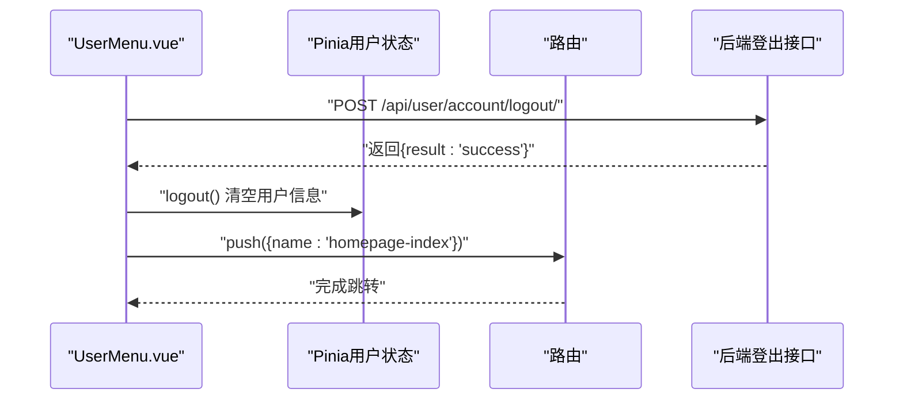
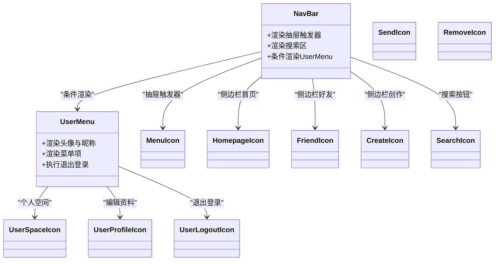
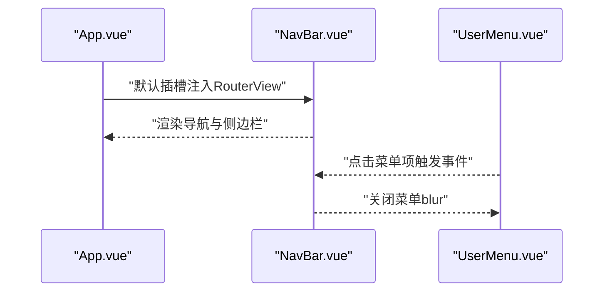
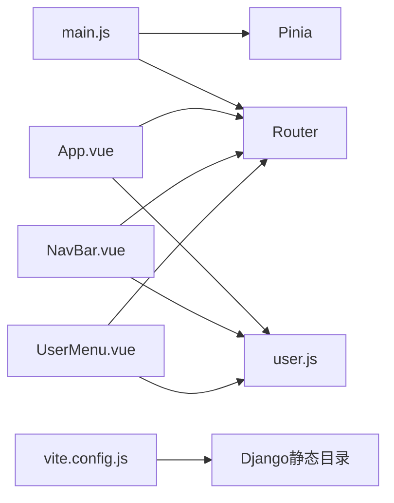

# Vue组件系统

<cite>
**本文引用的文件**
- [frontend/src/components/navbar/NavBar.vue](file://frontend/src/components/navbar/NavBar.vue)
- [frontend/src/components/navbar/UserMenu.vue](file://frontend/src/components/navbar/UserMenu.vue)
- [frontend/src/components/navbar/icons/MenuIcon.vue](file://frontend/src/components/navbar/icons/MenuIcon.vue)
- [frontend/src/components/navbar/icons/HomepageIcon.vue](file://frontend/src/components/navbar/icons/HomepageIcon.vue)
- [frontend/src/components/navbar/icons/FriendIcon.vue](file://frontend/src/components/navbar/icons/FriendIcon.vue)
- [frontend/src/components/navbar/icons/CreateIcon.vue](file://frontend/src/components/navbar/icons/CreateIcon.vue)
- [frontend/src/components/navbar/icons/SearchIcon.vue](file://frontend/src/components/navbar/icons/SearchIcon.vue)
- [frontend/src/components/navbar/icons/SendIcon.vue](file://frontend/src/components/navbar/icons/SendIcon.vue)
- [frontend/src/components/navbar/icons/RemoveIcon.vue](file://frontend/src/components/navbar/icons/RemoveIcon.vue)
- [frontend/src/components/navbar/icons/UserLogoutIcon.vue](file://frontend/src/components/navbar/icons/UserLogoutIcon.vue)
- [frontend/src/components/navbar/icons/UserProfileIcon.vue](file://frontend/src/components/navbar/icons/UserProfileIcon.vue)
- [frontend/src/components/navbar/icons/UserSpaceIcon.vue](file://frontend/src/components/navbar/icons/UserSpaceIcon.vue)
- [frontend/src/stores/user.js](file://frontend/src/stores/user.js)
- [frontend/src/router/index.js](file://frontend/src/router/index.js)
- [frontend/src/App.vue](file://frontend/src/App.vue)
- [frontend/src/main.js](file://frontend/src/main.js)
- [frontend/package.json](file://frontend/package.json)
- [frontend/vite.config.js](file://frontend/vite.config.js)
</cite>

## 目录
1. [简介](#简介)
2. [项目结构](#项目结构)
3. [核心组件](#核心组件)
4. [架构总览](#架构总览)
5. [详细组件分析](#详细组件分析)
6. [依赖关系分析](#依赖关系分析)
7. [性能考虑](#性能考虑)
8. [故障排查指南](#故障排查指南)
9. [结论](#结论)
10. [附录](#附录)

## 简介
本文件面向LLM_AIfriends前端的Vue组件系统，聚焦于Vue 3组合式API（Composition API）的使用模式与组件设计原则，系统梳理导航栏组件NavBar.vue与其子组件UserMenu.vue的实现细节，文档化图标组件体系，并说明组件间通信机制（Props、事件、插槽）、复用策略、样式封装与响应式设计。同时提供开发最佳实践与性能优化建议，帮助开发者高效维护与扩展该组件体系。

## 项目结构
前端采用Vite + Vue 3 + Pinia + vue-router + TailwindCSS + daisyUI的现代技术栈。组件集中在src/components/navbar目录下，配合Pinia状态管理与路由守卫实现统一的导航与用户态控制；应用入口通过App.vue挂载导航栏并注入RouterView内容，形成“容器组件+业务视图”的分层结构。

图表来源
- [frontend/src/main.js:1-15](file://frontend/src/main.js#L1-L15)
- [frontend/src/App.vue:1-43](file://frontend/src/App.vue#L1-L43)
- [frontend/src/components/navbar/NavBar.vue:1-83](file://frontend/src/components/navbar/NavBar.vue#L1-L83)
- [frontend/src/components/navbar/UserMenu.vue:1-81](file://frontend/src/components/navbar/UserMenu.vue#L1-L81)
- [frontend/src/stores/user.js:1-59](file://frontend/src/stores/user.js#L1-L59)
- [frontend/src/router/index.js:1-104](file://frontend/src/router/index.js#L1-L104)

章节来源
- [frontend/src/main.js:1-15](file://frontend/src/main.js#L1-L15)
- [frontend/src/App.vue:1-43](file://frontend/src/App.vue#L1-L43)
- [frontend/src/router/index.js:1-104](file://frontend/src/router/index.js#L1-L104)
- [frontend/src/stores/user.js:1-59](file://frontend/src/stores/user.js#L1-L59)

## 核心组件
- 导航栏容器NavBar.vue：负责顶部导航条、抽屉式侧边栏、搜索区与用户态切换（登录/登出），并提供默认插槽承载页面内容。
- 用户菜单UserMenu.vue：基于下拉菜单展示用户头像、昵称与快捷入口（个人空间、编辑资料、退出登录），并调用后端接口完成登出流程。
- 图标组件系统：以纯SVG实现的一组语义化图标，统一尺寸与描边风格，按功能拆分并在导航栏中复用。

章节来源
- [frontend/src/components/navbar/NavBar.vue:1-83](file://frontend/src/components/navbar/NavBar.vue#L1-L83)
- [frontend/src/components/navbar/UserMenu.vue:1-81](file://frontend/src/components/navbar/UserMenu.vue#L1-L81)

## 架构总览
组件系统围绕“状态驱动 + 路由守卫 + 组合式API”展开：
- 状态层：Pinia Store集中管理用户信息与登录态，供NavBar与UserMenu读取与更新。
- 视图层：App.vue在挂载时拉取用户信息并设置“已拉取”标记，随后根据路由元信息决定是否重定向至登录页。
- 导航层：NavBar根据用户登录态动态渲染“创作”入口或UserMenu；侧边栏菜单项与RouterLink绑定，支持移动端抽屉交互。
- 通信层：Props传入（如UserMenu接收用户头像等）、事件（点击关闭菜单）、插槽（NavBar默认插槽承载RouterView）。

图表来源
- [frontend/src/App.vue:13-31](file://frontend/src/App.vue#L13-L31)
- [frontend/src/stores/user.js:41-43](file://frontend/src/stores/user.js#L41-L43)
- [frontend/src/router/index.js:92-101](file://frontend/src/router/index.js#L92-L101)
- [frontend/src/components/navbar/NavBar.vue:40-47](file://frontend/src/components/navbar/NavBar.vue#L40-L47)
- [frontend/src/components/navbar/UserMenu.vue:19-31](file://frontend/src/components/navbar/UserMenu.vue#L19-L31)

## 详细组件分析

### 导航栏组件 NavBar.vue
- 功能定位
  - 顶部导航：左侧抽屉触发器与站点标题；中间区域放置搜索输入与按钮；右侧根据登录态显示“创作”入口或UserMenu。
  - 抽屉式侧边栏：在大屏使用抽屉打开/关闭，移动端自动收拢；菜单项包含首页、好友、创作，均与RouterLink绑定。
  - 插槽：提供默认插槽用于承载RouterView，实现页面内容的动态切换。
- 组合式API使用
  - 引入useUserStore读取登录态与用户信息，避免重复请求与跨组件传递Props。
- 响应式与交互
  - 使用daisyUI的drawer类名控制抽屉开合与侧边栏宽度变化；移动端工具类实现折叠态下的提示气泡与图标隐藏。
- 设计要点
  - 条件渲染：根据用户登录态与“已拉取用户信息”标记决定显示内容。
  - 无障碍：抽屉标签提供aria-label，确保可访问性。

图表来源
- [frontend/src/components/navbar/NavBar.vue:11-12](file://frontend/src/components/navbar/NavBar.vue#L11-L12)
- [frontend/src/components/navbar/NavBar.vue:40-47](file://frontend/src/components/navbar/NavBar.vue#L40-L47)

章节来源
- [frontend/src/components/navbar/NavBar.vue:1-83](file://frontend/src/components/navbar/NavBar.vue#L1-L83)

### 用户菜单组件 UserMenu.vue
- 功能定位
  - 下拉菜单展示当前用户头像与昵称；提供“个人空间”“编辑资料”“退出登录”等入口。
  - 退出登录：调用后端登出接口，成功后清空Store中的用户信息并跳转首页。
- 组合式API使用
  - useUserStore读取用户信息；useRouter进行路由跳转；api.post调用后端接口。
- 交互细节
  - 关闭菜单：主动blur当前元素，提升交互反馈。
  - 错误处理：异常捕获并打印日志，保证界面稳定。
- 设计要点
  - 使用RouterLink包裹菜单项，保持导航一致性与可测试性。
  - 通过params携带user_id，实现个人空间的动态路由。

图表来源
- [frontend/src/components/navbar/UserMenu.vue:19-31](file://frontend/src/components/navbar/UserMenu.vue#L19-L31)
- [frontend/src/stores/user.js:33-39](file://frontend/src/stores/user.js#L33-L39)
- [frontend/src/router/index.js:16-23](file://frontend/src/router/index.js#L16-L23)

章节来源
- [frontend/src/components/navbar/UserMenu.vue:1-81](file://frontend/src/components/navbar/UserMenu.vue#L1-L81)

### 图标组件系统
- 设计原则
  - 统一尺寸与描边：所有图标采用inline-block与size-6尺寸，stroke-width与stroke-line风格一致，确保视觉统一。
  - 语义化命名：CreateIcon、FriendIcon、HomepageIcon、MenuIcon、SearchIcon、SendIcon、RemoveIcon、UserLogoutIcon、UserProfileIcon、UserSpaceIcon，便于理解与维护。
  - SVG内联：无外部资源依赖，减少HTTP请求，利于SSR与离线场景。
- 使用方式
  - 在NavBar与UserMenu中直接作为子组件引入并渲染，无需额外Props。
  - 通过RouterLink的图标前缀增强可读性与一致性。
- 复用策略
  - 将常用图标抽象为独立组件，便于在多处共享；若未来出现大量相似图标，可考虑统一工厂或按需加载策略。

图表来源
- [frontend/src/components/navbar/NavBar.vue:3-9](file://frontend/src/components/navbar/NavBar.vue#L3-L9)
- [frontend/src/components/navbar/UserMenu.vue:5-7](file://frontend/src/components/navbar/UserMenu.vue#L5-L7)
- [frontend/src/components/navbar/icons/MenuIcon.vue:1-17](file://frontend/src/components/navbar/icons/MenuIcon.vue#L1-L17)
- [frontend/src/components/navbar/icons/HomepageIcon.vue:1-22](file://frontend/src/components/navbar/icons/HomepageIcon.vue#L1-L22)
- [frontend/src/components/navbar/icons/FriendIcon.vue:1-25](file://frontend/src/components/navbar/icons/FriendIcon.vue#L1-L25)
- [frontend/src/components/navbar/icons/CreateIcon.vue:1-26](file://frontend/src/components/navbar/icons/CreateIcon.vue#L1-L26)
- [frontend/src/components/navbar/icons/SearchIcon.vue:1-22](file://frontend/src/components/navbar/icons/SearchIcon.vue#L1-L22)
- [frontend/src/components/navbar/icons/SendIcon.vue:1-20](file://frontend/src/components/navbar/icons/SendIcon.vue#L1-L20)
- [frontend/src/components/navbar/icons/RemoveIcon.vue:1-26](file://frontend/src/components/navbar/icons/RemoveIcon.vue#L1-L26)
- [frontend/src/components/navbar/icons/UserLogoutIcon.vue:1-39](file://frontend/src/components/navbar/icons/UserLogoutIcon.vue#L1-L39)
- [frontend/src/components/navbar/icons/UserProfileIcon.vue:1-29](file://frontend/src/components/navbar/icons/UserProfileIcon.vue#L1-L29)
- [frontend/src/components/navbar/icons/UserSpaceIcon.vue:1-40](file://frontend/src/components/navbar/icons/UserSpaceIcon.vue#L1-L40)

章节来源
- [frontend/src/components/navbar/icons/MenuIcon.vue:1-17](file://frontend/src/components/navbar/icons/MenuIcon.vue#L1-L17)
- [frontend/src/components/navbar/icons/HomepageIcon.vue:1-22](file://frontend/src/components/navbar/icons/HomepageIcon.vue#L1-L22)
- [frontend/src/components/navbar/icons/FriendIcon.vue:1-25](file://frontend/src/components/navbar/icons/FriendIcon.vue#L1-L25)
- [frontend/src/components/navbar/icons/CreateIcon.vue:1-26](file://frontend/src/components/navbar/icons/CreateIcon.vue#L1-L26)
- [frontend/src/components/navbar/icons/SearchIcon.vue:1-22](file://frontend/src/components/navbar/icons/SearchIcon.vue#L1-L22)
- [frontend/src/components/navbar/icons/SendIcon.vue:1-20](file://frontend/src/components/navbar/icons/SendIcon.vue#L1-L20)
- [frontend/src/components/navbar/icons/RemoveIcon.vue:1-26](file://frontend/src/components/navbar/icons/RemoveIcon.vue#L1-L26)
- [frontend/src/components/navbar/icons/UserLogoutIcon.vue:1-39](file://frontend/src/components/navbar/icons/UserLogoutIcon.vue#L1-L39)
- [frontend/src/components/navbar/icons/UserProfileIcon.vue:1-29](file://frontend/src/components/navbar/icons/UserProfileIcon.vue#L1-L29)
- [frontend/src/components/navbar/icons/UserSpaceIcon.vue:1-40](file://frontend/src/components/navbar/icons/UserSpaceIcon.vue#L1-L40)

### 组件间通信机制
- Props传递
  - 当前实现未显式声明Props，图标组件通过内联SVG直接渲染；UserMenu通过Pinia读取用户信息，未使用Props传参。
- 事件处理
  - UserMenu在菜单项上使用@click事件关闭菜单；在退出登录时使用@click触发异步登出流程。
- 插槽使用
  - NavBar提供默认插槽，App.vue通过具名插槽向NavBar注入RouterView，实现页面内容的动态替换。

图表来源
- [frontend/src/App.vue:34-38](file://frontend/src/App.vue#L34-L38)
- [frontend/src/components/navbar/NavBar.vue](file://frontend/src/components/navbar/NavBar.vue#L50)
- [frontend/src/components/navbar/UserMenu.vue:14-17](file://frontend/src/components/navbar/UserMenu.vue#L14-L17)

章节来源
- [frontend/src/App.vue:34-38](file://frontend/src/App.vue#L34-L38)
- [frontend/src/components/navbar/NavBar.vue](file://frontend/src/components/navbar/NavBar.vue#L50)
- [frontend/src/components/navbar/UserMenu.vue:14-17](file://frontend/src/components/navbar/UserMenu.vue#L14-L17)

### 组件复用策略、样式封装与响应式设计
- 复用策略
  - 图标组件高度内聚，职责单一，便于在多处复用；未来可引入按需加载或图标库抽象，降低首屏体积。
  - NavBar与UserMenu通过Pinia共享状态，避免跨层级Props传递，提升可维护性。
- 样式封装
  - 所有组件使用scoped样式，避免样式泄漏；图标组件统一使用Tailwind类名与daisyUI组件类名，保证主题一致性。
- 响应式设计
  - 使用daisyUI的lg:drawer-open、is-drawer-close与is-drawer-open等工具类，实现桌面端抽屉常开、移动端折叠的自适应布局。

章节来源
- [frontend/src/components/navbar/NavBar.vue:52-76](file://frontend/src/components/navbar/NavBar.vue#L52-L76)
- [frontend/src/components/navbar/icons/*:1-17](file://frontend/src/components/navbar/icons/MenuIcon.vue#L1-L17)

## 依赖关系分析
- 应用启动：main.js注册Pinia与Router，挂载App.vue。
- 应用初始化：App.vue在mounted阶段拉取用户信息，设置“已拉取”标记，并根据路由元信息进行登录态校验与重定向。
- 导航与状态：NavBar与UserMenu均依赖Pinia用户Store；UserMenu依赖Router进行页面跳转。
- 构建与打包：Vite配置别名@指向src，构建输出到Django静态目录，便于后端集成。

图表来源
- [frontend/src/main.js:9-14](file://frontend/src/main.js#L9-L14)
- [frontend/src/App.vue:13-31](file://frontend/src/App.vue#L13-L31)
- [frontend/src/stores/user.js:4-59](file://frontend/src/stores/user.js#L4-L59)
- [frontend/src/router/index.js:12-90](file://frontend/src/router/index.js#L12-L90)
- [frontend/vite.config.js:16-25](file://frontend/vite.config.js#L16-L25)

章节来源
- [frontend/src/main.js:1-15](file://frontend/src/main.js#L1-L15)
- [frontend/src/App.vue:1-43](file://frontend/src/App.vue#L1-L43)
- [frontend/src/router/index.js:1-104](file://frontend/src/router/index.js#L1-L104)
- [frontend/vite.config.js:1-26](file://frontend/vite.config.js#L1-L26)

## 性能考虑
- 首屏优化
  - 图标组件均为轻量SVG，建议保持内联渲染，避免额外HTTP请求。
  - App.vue在mounted阶段一次性拉取用户信息，避免多次重复请求。
- 状态与渲染
  - 使用Pinia的响应式ref避免不必要的重渲染；在NavBar中仅根据登录态与“已拉取”标记进行条件渲染，减少分支复杂度。
- 路由守卫
  - 在router.beforeEach中对需要登录的路由进行快速判定，避免无效渲染与错误跳转。
- 打包与部署
  - Vite构建输出到Django静态目录，便于后端统一托管；可结合代码分割进一步优化大型视图组件的加载。

## 故障排查指南
- 登录态异常
  - 现象：进入受保护页面后被重定向至登录页。
  - 排查：确认App.vue是否正确设置hasPulledUserInfo；检查router.beforeEach逻辑与meta.needLogin配置。
- 退出登录无效
  - 现象：点击退出后仍停留在当前页且用户信息未清空。
  - 排查：确认UserMenu.vue的handleLogout返回值与Store的logout方法；检查后端登出接口返回格式。
- 图标显示异常
  - 现象：图标尺寸或颜色不符合预期。
  - 排查：检查图标组件的size类名与stroke属性；确认Tailwind与daisyUI版本兼容性。
- 抽屉交互问题
  - 现象：移动端抽屉无法正常打开/关闭。
  - 排查：确认drawer相关类名与id绑定；检查is-drawer-close/is-drawer-open工具类是否生效。

章节来源
- [frontend/src/App.vue:13-31](file://frontend/src/App.vue#L13-L31)
- [frontend/src/router/index.js:92-101](file://frontend/src/router/index.js#L92-L101)
- [frontend/src/components/navbar/UserMenu.vue:19-31](file://frontend/src/components/navbar/UserMenu.vue#L19-L31)
- [frontend/src/components/navbar/NavBar.vue:52-76](file://frontend/src/components/navbar/NavBar.vue#L52-L76)

## 结论
该Vue组件系统以组合式API为核心，结合Pinia状态管理与路由守卫，实现了清晰的导航与用户态控制。NavBar与UserMenu通过条件渲染与插槽机制解耦页面内容与导航行为；图标组件以SVG形式统一风格并提升复用性。建议后续在大型项目中引入图标库抽象、按需加载与更细粒度的组件拆分，以进一步提升可维护性与性能表现。

## 附录
- 技术栈与版本
  - Vue 3、Pinia、vue-router、TailwindCSS、daisyUI、Axios、Vite
- 构建与运行
  - 开发：npm run dev
  - 构建：npm run build
  - 预览：npm run preview

章节来源
- [frontend/package.json:11-25](file://frontend/package.json#L11-L25)
- [frontend/vite.config.js:1-26](file://frontend/vite.config.js#L1-L26)