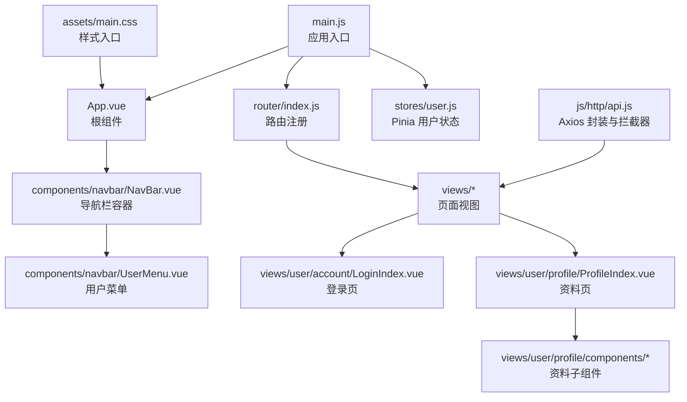
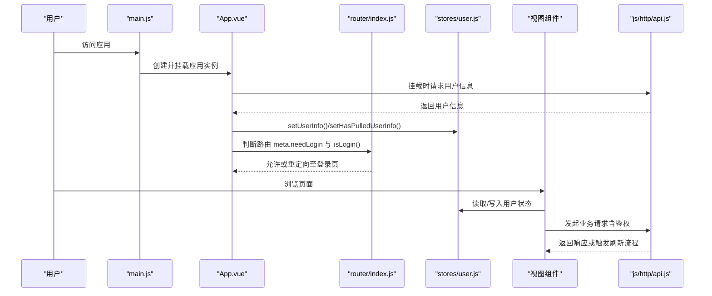
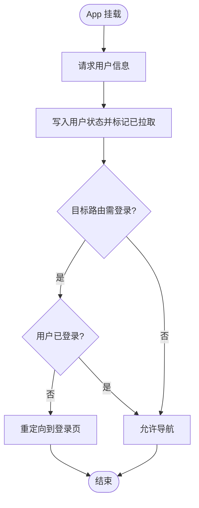
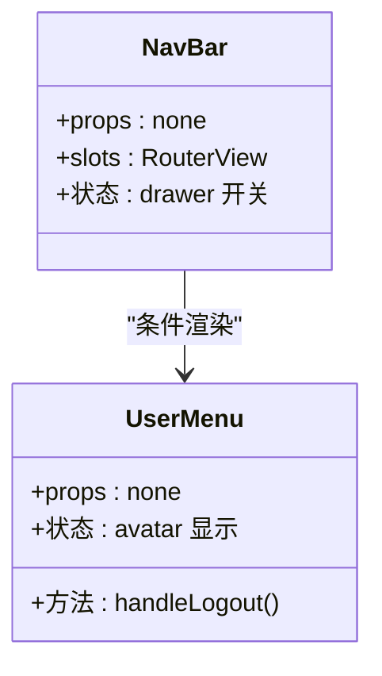
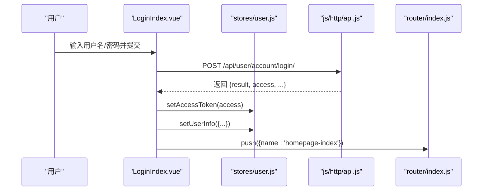
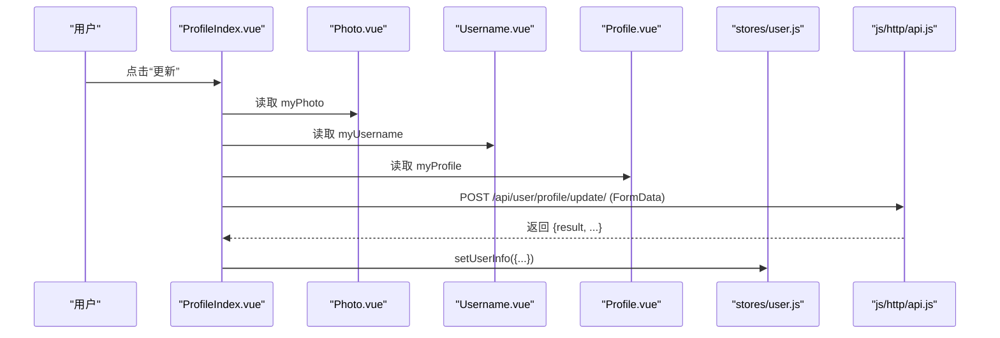
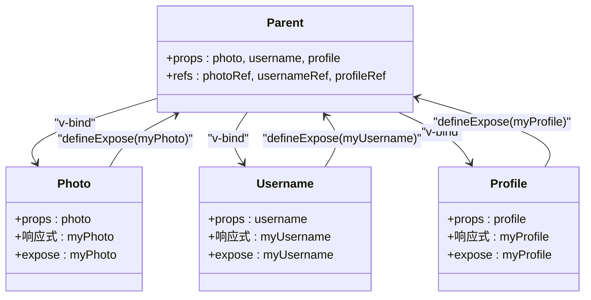
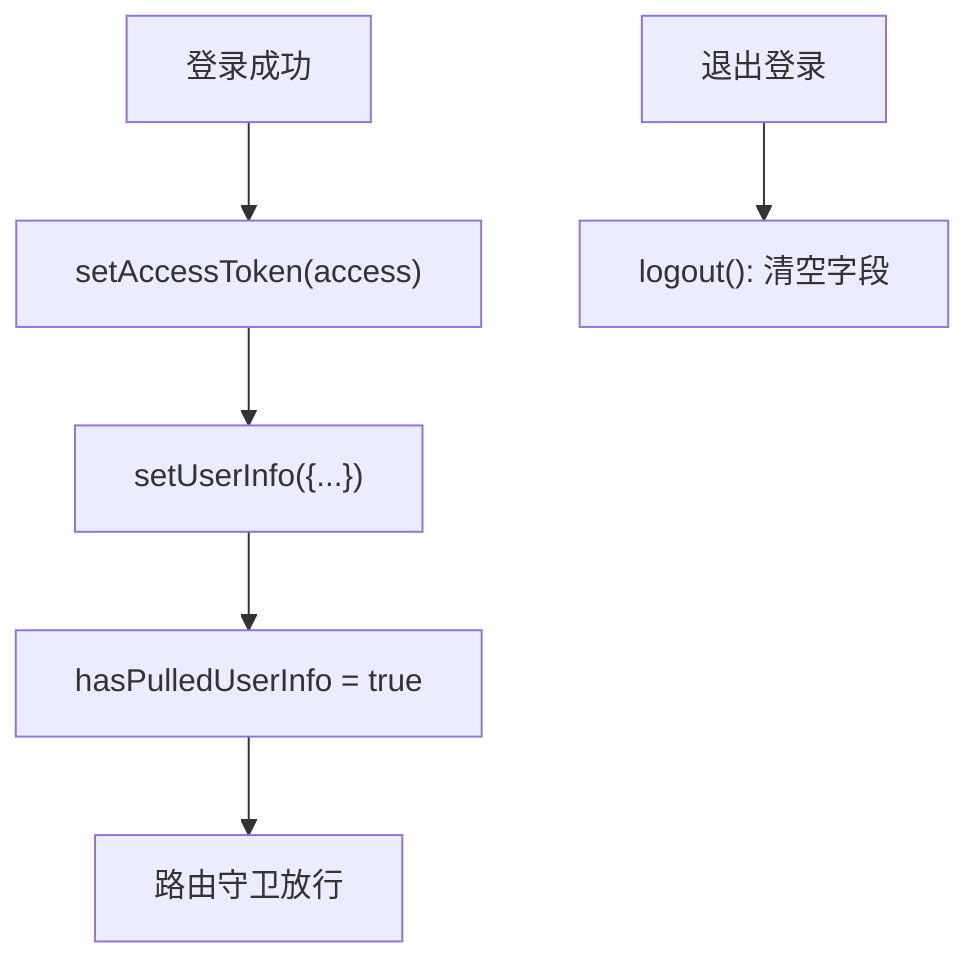
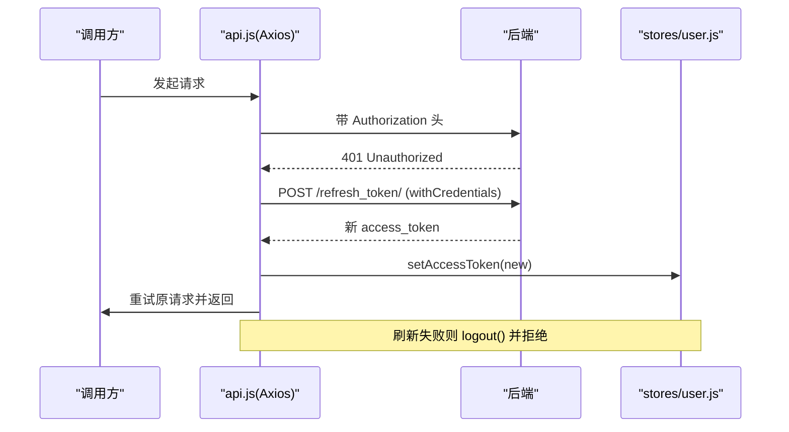
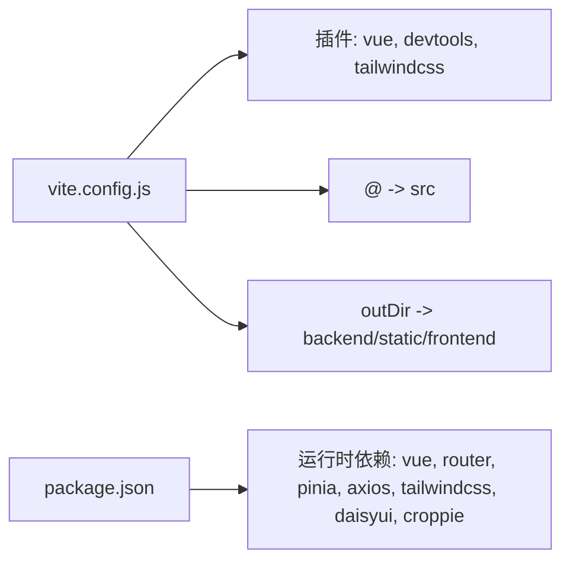

# 前端架构

<cite>
**本文引用的文件**
- [frontend/src/main.js](file://frontend/src/main.js)
- [frontend/vite.config.js](file://frontend/vite.config.js)
- [frontend/package.json](file://frontend/package.json)
- [frontend/src/App.vue](file://frontend/src/App.vue)
- [frontend/src/router/index.js](file://frontend/src/router/index.js)
- [frontend/src/stores/user.js](file://frontend/src/stores/user.js)
- [frontend/src/js/http/api.js](file://frontend/src/js/http/api.js)
- [frontend/src/components/navbar/NavBar.vue](file://frontend/src/components/navbar/NavBar.vue)
- [frontend/src/components/navbar/UserMenu.vue](file://frontend/src/components/navbar/UserMenu.vue)
- [frontend/src/views/user/account/LoginIndex.vue](file://frontend/src/views/user/account/LoginIndex.vue)
- [frontend/src/views/user/profile/ProfileIndex.vue](file://frontend/src/views/user/profile/ProfileIndex.vue)
- [frontend/src/views/user/profile/components/Photo.vue](file://frontend/src/views/user/profile/components/Photo.vue)
- [frontend/src/views/user/profile/components/Username.vue](file://frontend/src/views/user/profile/components/Username.vue)
- [frontend/src/views/user/profile/components/Profile.vue](file://frontend/src/views/user/profile/components/Profile.vue)
- [frontend/src/assets/main.css](file://frontend/src/assets/main.css)
</cite>

## 目录
1. [引言](#引言)
2. [项目结构](#项目结构)
3. [核心组件](#核心组件)
4. [架构总览](#架构总览)
5. [详细组件分析](#详细组件分析)
6. [依赖分析](#依赖分析)
7. [性能考虑](#性能考虑)
8. [故障排查指南](#故障排查指南)
9. [结论](#结论)
10. [附录](#附录)

## 引言
本文件面向 LLM_AIfriends 项目的前端团队与相关技术读者，系统化梳理基于 Vue 3 + Vite 的单页应用（SPA）架构设计。内容涵盖应用入口配置、组件系统设计、路由系统与状态管理，解释组件层次结构、父子组件通信机制（Props 与 expose）、事件处理与 Pinia 状态管理模式，并结合 Axios 拦截器实现鉴权与 Token 刷新流程。同时文档化构建配置、开发服务器设置与静态资源处理策略，给出组件设计原则、可复用性与性能优化建议。

## 项目结构
前端采用标准的 Vite + Vue 3 单页应用目录组织方式，核心模块如下：
- 应用入口与插件：main.js、vite.config.js、package.json
- 根组件与布局：App.vue、components/navbar/NavBar.vue
- 路由系统：router/index.js
- 状态管理：stores/user.js
- 网络层：js/http/api.js
- 视图与功能组件：views 下按功能域划分的页面与子组件
- 样式与主题：assets/main.css（集成 TailwindCSS 与 daisyUI）

图表来源
- [frontend/src/main.js:1-15](file://frontend/src/main.js#L1-L15)
- [frontend/src/App.vue:1-43](file://frontend/src/App.vue#L1-L43)
- [frontend/src/router/index.js:1-104](file://frontend/src/router/index.js#L1-L104)
- [frontend/src/stores/user.js:1-59](file://frontend/src/stores/user.js#L1-L59)
- [frontend/src/js/http/api.js:1-92](file://frontend/src/js/http/api.js#L1-L92)
- [frontend/src/assets/main.css:1-2](file://frontend/src/assets/main.css#L1-L2)

章节来源
- [frontend/src/main.js:1-15](file://frontend/src/main.js#L1-L15)
- [frontend/vite.config.js:1-26](file://frontend/vite.config.js#L1-L26)
- [frontend/package.json:1-30](file://frontend/package.json#L1-L30)

## 核心组件
- 应用入口与初始化
  - 在入口文件中完成 Vue 实例创建、Pinia 与路由插件注册，并挂载到 DOM。
- 根组件与布局
  - 根组件负责在挂载阶段拉取用户信息、标记已拉取状态，并根据路由元信息与用户登录态进行跳转控制。
- 导航栏与用户菜单
  - 导航栏作为抽屉式布局容器，根据用户登录态显示不同入口；用户菜单提供空间、资料、登出等操作。
- 页面视图
  - 登录页负责表单校验与登录请求；资料页聚合多个子组件并通过模板引用收集子组件暴露的数据进行统一提交。
- 状态管理
  - 使用组合式 Store 定义用户信息、登录态、访问令牌与“是否已拉取用户信息”状态，并提供设置与清理方法。
- 网络层
  - Axios 实例封装，自动注入 Authorization 头；对 401 响应进行拦截，使用刷新接口刷新 access_token，失败则清除本地登录状态。

章节来源
- [frontend/src/main.js:1-15](file://frontend/src/main.js#L1-L15)
- [frontend/src/App.vue:1-43](file://frontend/src/App.vue#L1-L43)
- [frontend/src/components/navbar/NavBar.vue:1-83](file://frontend/src/components/navbar/NavBar.vue#L1-L83)
- [frontend/src/components/navbar/UserMenu.vue:1-81](file://frontend/src/components/navbar/UserMenu.vue#L1-L81)
- [frontend/src/views/user/account/LoginIndex.vue:1-69](file://frontend/src/views/user/account/LoginIndex.vue#L1-L69)
- [frontend/src/views/user/profile/ProfileIndex.vue:1-77](file://frontend/src/views/user/profile/ProfileIndex.vue#L1-L77)
- [frontend/src/stores/user.js:1-59](file://frontend/src/stores/user.js#L1-L59)
- [frontend/src/js/http/api.js:1-92](file://frontend/src/js/http/api.js#L1-L92)

## 架构总览
下图展示从应用启动到页面渲染、路由守卫、状态管理与网络请求的整体交互：

图表来源
- [frontend/src/main.js:1-15](file://frontend/src/main.js#L1-L15)
- [frontend/src/App.vue:13-31](file://frontend/src/App.vue#L13-L31)
- [frontend/src/router/index.js:92-101](file://frontend/src/router/index.js#L92-L101)
- [frontend/src/stores/user.js:26-43](file://frontend/src/stores/user.js#L26-L43)
- [frontend/src/js/http/api.js:21-89](file://frontend/src/js/http/api.js#L21-L89)

## 详细组件分析

### 应用入口与初始化
- 插件注册顺序：先注册 Pinia，再注册路由，最后挂载。
- 入口文件简洁明确，确保应用生命周期可控。

章节来源
- [frontend/src/main.js:1-15](file://frontend/src/main.js#L1-L15)

### 根组件与路由守卫
- 挂载阶段逻辑：
  - 请求用户信息接口，成功则写入用户状态，失败记录错误；
  - 设置“已拉取用户信息”标志；
  - 若目标路由需要登录且用户未登录，则重定向到登录页。
- 路由守卫：
  - 在导航前检查目标路由 meta.needLogin 与用户状态，必要时阻止并重定向。

图表来源
- [frontend/src/App.vue:13-31](file://frontend/src/App.vue#L13-L31)
- [frontend/src/router/index.js:92-101](file://frontend/src/router/index.js#L92-L101)

章节来源
- [frontend/src/App.vue:1-43](file://frontend/src/App.vue#L1-L43)
- [frontend/src/router/index.js:1-104](file://frontend/src/router/index.js#L1-L104)

### 导航栏与用户菜单
- 导航栏：
  - 抽屉式布局，左侧菜单项通过 RouterLink 导航；
  - 右侧根据登录态显示“创作”、“登录”或用户菜单；
  - 支持搜索框与图标组件。
- 用户菜单：
  - 展示头像与用户名；
  - 提供个人空间、编辑资料、退出登录等入口；
  - 退出登录时调用后端接口并清理本地状态。

图表来源
- [frontend/src/components/navbar/NavBar.vue:1-83](file://frontend/src/components/navbar/NavBar.vue#L1-L83)
- [frontend/src/components/navbar/UserMenu.vue:1-81](file://frontend/src/components/navbar/UserMenu.vue#L1-L81)

章节来源
- [frontend/src/components/navbar/NavBar.vue:1-83](file://frontend/src/components/navbar/NavBar.vue#L1-L83)
- [frontend/src/components/navbar/UserMenu.vue:1-81](file://frontend/src/components/navbar/UserMenu.vue#L1-L81)

### 登录页与状态写入
- 表单校验：用户名与密码非空；
- 发起登录请求，成功后写入 access_token 与用户信息，跳转首页；
- 错误提示统一处理。

图表来源
- [frontend/src/views/user/account/LoginIndex.vue:15-41](file://frontend/src/views/user/account/LoginIndex.vue#L15-L41)
- [frontend/src/stores/user.js:22-31](file://frontend/src/stores/user.js#L22-L31)
- [frontend/src/js/http/api.js:16-19](file://frontend/src/js/http/api.js#L16-L19)

章节来源
- [frontend/src/views/user/account/LoginIndex.vue:1-69](file://frontend/src/views/user/account/LoginIndex.vue#L1-L69)
- [frontend/src/stores/user.js:1-59](file://frontend/src/stores/user.js#L1-L59)
- [frontend/src/js/http/api.js:1-92](file://frontend/src/js/http/api.js#L1-L92)

### 资料页与子组件通信
- 资料页通过模板引用收集三个子组件暴露的数据：
  - Photo：头像裁剪与 base64 结果；
  - Username：用户名；
  - Profile：个人简介。
- 统一校验后构造 FormData 提交更新请求，成功后同步用户状态。

图表来源
- [frontend/src/views/user/profile/ProfileIndex.vue:17-52](file://frontend/src/views/user/profile/ProfileIndex.vue#L17-L52)
- [frontend/src/views/user/profile/components/Photo.vue:74-76](file://frontend/src/views/user/profile/components/Photo.vue#L74-L76)
- [frontend/src/views/user/profile/components/Username.vue:16-18](file://frontend/src/views/user/profile/components/Username.vue#L16-L18)
- [frontend/src/views/user/profile/components/Profile.vue:14-16](file://frontend/src/views/user/profile/components/Profile.vue#L14-L16)
- [frontend/src/stores/user.js:26-31](file://frontend/src/stores/user.js#L26-L31)

章节来源
- [frontend/src/views/user/profile/ProfileIndex.vue:1-77](file://frontend/src/views/user/profile/ProfileIndex.vue#L1-L77)
- [frontend/src/views/user/profile/components/Photo.vue:1-109](file://frontend/src/views/user/profile/components/Photo.vue#L1-L109)
- [frontend/src/views/user/profile/components/Username.vue:1-30](file://frontend/src/views/user/profile/components/Username.vue#L1-L30)
- [frontend/src/views/user/profile/components/Profile.vue:1-28](file://frontend/src/views/user/profile/components/Profile.vue#L1-L28)

### 子组件 Props 与响应式通信
- Photo/Username/Profile 子组件均通过 defineProps 接收父组件传入的初始值；
- 内部维护响应式变量 myPhoto/myUsername/myProfile，并通过 watch 监听 props 的变化以保持双向同步；
- 通过 defineExpose 暴露内部响应式数据，供父组件通过模板引用读取。

图表来源
- [frontend/src/views/user/profile/components/Photo.vue:8-15](file://frontend/src/views/user/profile/components/Photo.vue#L8-L15)
- [frontend/src/views/user/profile/components/Username.vue:6-14](file://frontend/src/views/user/profile/components/Username.vue#L6-L14)
- [frontend/src/views/user/profile/components/Profile.vue:5-12](file://frontend/src/views/user/profile/components/Profile.vue#L5-L12)
- [frontend/src/views/user/profile/ProfileIndex.vue:12-14](file://frontend/src/views/user/profile/ProfileIndex.vue#L12-L14)

章节来源
- [frontend/src/views/user/profile/components/Photo.vue:1-109](file://frontend/src/views/user/profile/components/Photo.vue#L1-L109)
- [frontend/src/views/user/profile/components/Username.vue:1-30](file://frontend/src/views/user/profile/components/Username.vue#L1-L30)
- [frontend/src/views/user/profile/components/Profile.vue:1-28](file://frontend/src/views/user/profile/components/Profile.vue#L1-L28)
- [frontend/src/views/user/profile/ProfileIndex.vue:1-77](file://frontend/src/views/user/profile/ProfileIndex.vue#L1-L77)

### 状态管理与持久化
- 用户状态存储于 Pinia 组合式 Store，包含用户标识、用户名、头像、简介、访问令牌与“是否已拉取用户信息”标志；
- 登录成功写入 access_token 与用户信息；退出登录清空所有字段；
- “是否已拉取用户信息”标志用于避免重复请求与控制路由守卫逻辑。

图表来源
- [frontend/src/stores/user.js:18-43](file://frontend/src/stores/user.js#L18-L43)
- [frontend/src/App.vue:23-24](file://frontend/src/App.vue#L23-L24)

章节来源
- [frontend/src/stores/user.js:1-59](file://frontend/src/stores/user.js#L1-L59)
- [frontend/src/App.vue:1-43](file://frontend/src/App.vue#L1-L43)

### 网络层与鉴权刷新
- Axios 实例：
  - 自动注入 Authorization 头；
  - 对 401 响应拦截，使用刷新接口刷新 access_token；
  - 刷新成功则重试原请求；刷新失败则清除本地登录状态并拒绝请求。
- 该设计保证了前端在 Token 过期场景下的健壮性与用户体验。

图表来源
- [frontend/src/js/http/api.js:21-89](file://frontend/src/js/http/api.js#L21-L89)
- [frontend/src/stores/user.js:33-39](file://frontend/src/stores/user.js#L33-L39)

章节来源
- [frontend/src/js/http/api.js:1-92](file://frontend/src/js/http/api.js#L1-L92)
- [frontend/src/stores/user.js:1-59](file://frontend/src/stores/user.js#L1-L59)

## 依赖分析
- 构建与开发工具
  - Vite 作为开发服务器与打包工具，启用 Vue 插件、Vue DevTools 插件与 TailwindCSS 插件；
  - 路径别名 @ 指向 src 目录，便于模块导入；
  - 构建输出目录指向 Django 的 static 目录，便于后端统一托管。
- 运行时依赖
  - Vue 3、Vue Router、Pinia、Axios、TailwindCSS、daisyUI、croppie（头像裁剪）。

图表来源
- [frontend/vite.config.js:10-25](file://frontend/vite.config.js#L10-L25)
- [frontend/package.json:11-25](file://frontend/package.json#L11-L25)

章节来源
- [frontend/vite.config.js:1-26](file://frontend/vite.config.js#L1-L26)
- [frontend/package.json:1-30](file://frontend/package.json#L1-L30)

## 性能考虑
- 组件拆分与懒加载
  - 将大型页面与子组件拆分为独立模块，利用路由级懒加载减少首屏体积（可在路由定义中进一步扩展）。
- 图片与资源优化
  - 头像裁剪使用 croppie，建议在提交前压缩 Base64 或直接上传文件以降低传输体积；
  - TailwindCSS 与 daisyUI 按需引入，避免全量样式进入生产包。
- 状态与计算
  - Pinia Store 使用组合式 API，仅在需要时更新响应式字段，避免不必要的重渲染；
  - 在 App.vue 中仅在首次挂载时发起用户信息请求，配合 hasPulledUserInfo 防止重复请求。
- 构建产物
  - 输出目录直连 Django static，减少额外部署步骤；生产构建开启压缩与代码分割。

## 故障排查指南
- 登录后仍被重定向到登录页
  - 检查路由守卫逻辑与用户登录态标志位；
  - 确认 App.vue 是否正确设置 hasPulledUserInfo。
- 401 未授权频繁出现
  - 检查请求拦截器是否正确注入 Authorization；
  - 确认刷新接口可用且 Cookie 配置正确；
  - 观察刷新流程是否成功写入新 access_token。
- 退出登录后状态未清除
  - 确认退出接口返回成功并调用了 logout；
  - 检查路由跳转是否执行。
- 头像裁剪异常
  - 确保 croppie 实例在组件卸载时销毁，避免内存泄漏；
  - 检查文件选择与 FileReader 读取流程。

章节来源
- [frontend/src/router/index.js:92-101](file://frontend/src/router/index.js#L92-L101)
- [frontend/src/App.vue:13-31](file://frontend/src/App.vue#L13-L31)
- [frontend/src/js/http/api.js:21-89](file://frontend/src/js/http/api.js#L21-L89)
- [frontend/src/components/navbar/UserMenu.vue:19-31](file://frontend/src/components/navbar/UserMenu.vue#L19-L31)
- [frontend/src/views/user/profile/components/Photo.vue:69-71](file://frontend/src/views/user/profile/components/Photo.vue#L69-L71)

## 结论
本项目采用清晰的模块化架构：入口文件集中初始化，根组件承担初始化与守卫职责，路由系统与状态管理解耦，网络层通过拦截器实现鉴权与 Token 刷新。组件系统遵循 Props + expose 的父子通信约定，具备良好的可复用性与可维护性。结合 Vite 的高效构建与 TailwindCSS/daisyUI 的样式体系，整体前端体验流畅、扩展性强。

## 附录
- 样式入口
  - 通过 assets/main.css 引入 TailwindCSS 与 daisyUI，统一主题风格。
- 路由清单（简要）
  - 首页、好友、创作、404、登录、注册、个人空间、用户资料等页面，均支持 meta.needLogin 控制访问权限。

章节来源
- [frontend/src/assets/main.css:1-2](file://frontend/src/assets/main.css#L1-L2)
- [frontend/src/router/index.js:14-89](file://frontend/src/router/index.js#L14-L89)