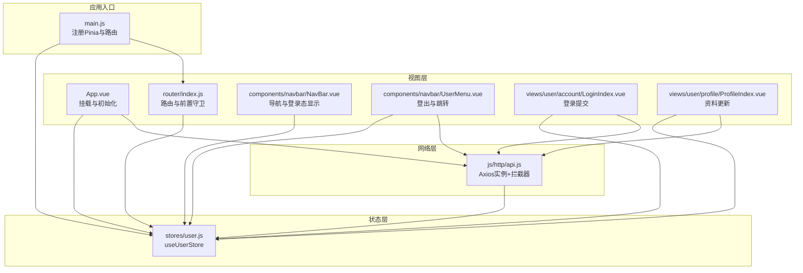
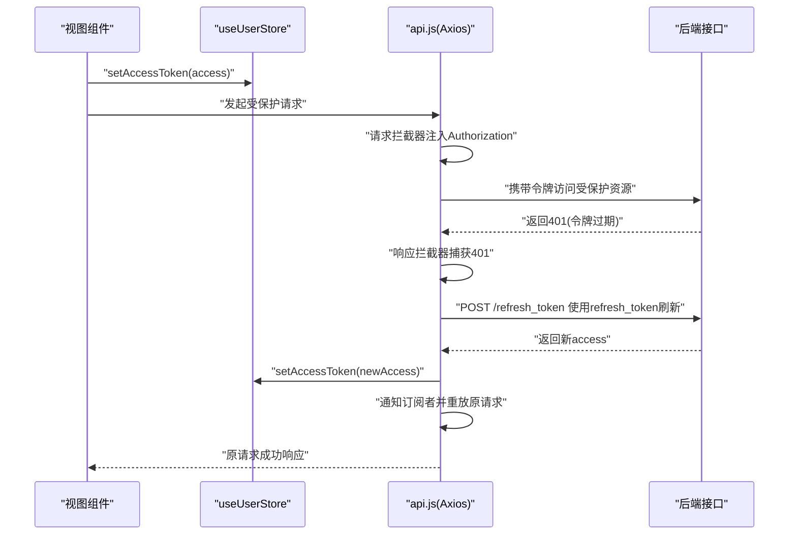
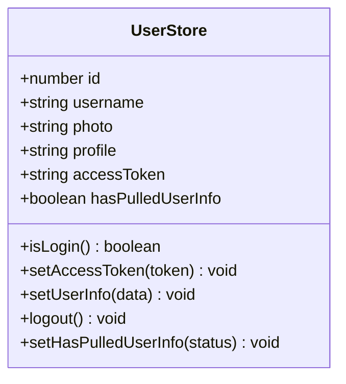
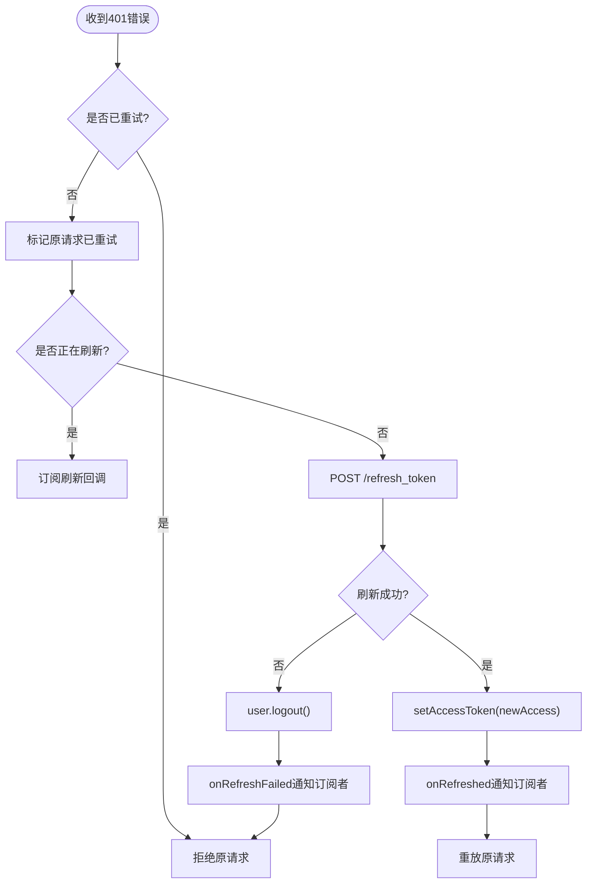
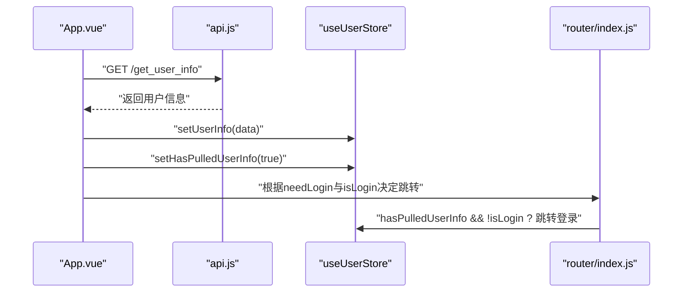
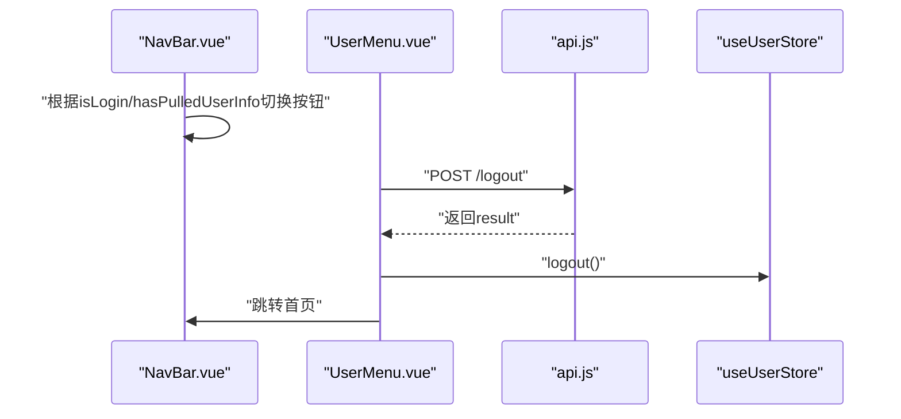
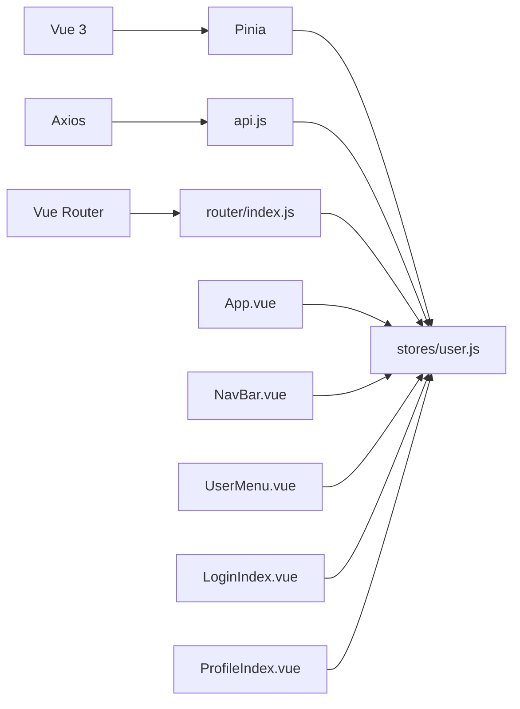

# 状态管理

<cite>
**本文引用的文件**
- [frontend/src/stores/user.js](file://frontend/src/stores/user.js)
- [frontend/src/js/http/api.js](file://frontend/src/js/http/api.js)
- [frontend/src/main.js](file://frontend/src/main.js)
- [frontend/src/App.vue](file://frontend/src/App.vue)
- [frontend/src/router/index.js](file://frontend/src/router/index.js)
- [frontend/src/components/navbar/NavBar.vue](file://frontend/src/components/navbar/NavBar.vue)
- [frontend/src/components/navbar/UserMenu.vue](file://frontend/src/components/navbar/UserMenu.vue)
- [frontend/src/views/user/account/LoginIndex.vue](file://frontend/src/views/user/account/LoginIndex.vue)
- [frontend/src/views/user/profile/ProfileIndex.vue](file://frontend/src/views/user/profile/ProfileIndex.vue)
- [frontend/package.json](file://frontend/package.json)
- [backend/web/views/user/account/get_user_info.py](file://backend/web/views/user/account/get_user_info.py)
</cite>

## 目录
1. [引言](#引言)
2. [项目结构](#项目结构)
3. [核心组件](#核心组件)
4. [架构总览](#架构总览)
5. [详细组件分析](#详细组件分析)
6. [依赖关系分析](#依赖关系分析)
7. [性能考量](#性能考量)
8. [故障排查指南](#故障排查指南)
9. [结论](#结论)
10. [附录](#附录)

## 引言
本文件面向LLM_AIfriends项目的前端状态管理，聚焦于基于Pinia的用户状态store设计与实现，系统阐述其数据模型、响应式更新机制、与API客户端的集成、错误状态处理、持久化策略、跨组件共享、最佳实践、性能优化与调试技巧，并提供可扩展的状态管理指南。读者无需深入源码即可理解整体工作流，同时也能通过“章节来源”定位到具体实现细节。

## 项目结构
前端采用Vue 3 + Pinia + Vue Router + Axios的组合：
- 应用入口在main.js中注册Pinia与路由。
- 用户状态store位于stores/user.js，导出useUserStore。
- API客户端封装在js/http/api.js，统一注入Authorization头、处理401刷新令牌、失败回退登出。
- 路由在router/index.js中定义，包含前置守卫，结合用户状态控制访问权限。
- 组件通过useUserStore读取与更新状态，如NavBar、UserMenu、LoginIndex、ProfileIndex等。

图表来源
- [frontend/src/main.js:1-15](file://frontend/src/main.js#L1-L15)
- [frontend/src/stores/user.js:1-59](file://frontend/src/stores/user.js#L1-L59)
- [frontend/src/js/http/api.js:1-92](file://frontend/src/js/http/api.js#L1-L92)
- [frontend/src/App.vue:1-43](file://frontend/src/App.vue#L1-L43)
- [frontend/src/router/index.js:1-104](file://frontend/src/router/index.js#L1-L104)
- [frontend/src/components/navbar/NavBar.vue:1-83](file://frontend/src/components/navbar/NavBar.vue#L1-L83)
- [frontend/src/components/navbar/UserMenu.vue:1-81](file://frontend/src/components/navbar/UserMenu.vue#L1-L81)
- [frontend/src/views/user/account/LoginIndex.vue:1-69](file://frontend/src/views/user/account/LoginIndex.vue#L1-L69)
- [frontend/src/views/user/profile/ProfileIndex.vue:1-77](file://frontend/src/views/user/profile/ProfileIndex.vue#L1-L77)

章节来源
- [frontend/src/main.js:1-15](file://frontend/src/main.js#L1-L15)
- [frontend/src/stores/user.js:1-59](file://frontend/src/stores/user.js#L1-L59)
- [frontend/src/js/http/api.js:1-92](file://frontend/src/js/http/api.js#L1-L92)
- [frontend/src/router/index.js:1-104](file://frontend/src/router/index.js#L1-L104)

## 核心组件
本节聚焦用户状态store的结构与方法，以及与API客户端的协作。

- 数据模型（响应式字段）
  - id：用户标识
  - username：用户名
  - photo：头像URL
  - profile：个人简介
  - accessToken：访问令牌
  - hasPulledUserInfo：是否已拉取过用户信息（用于路由守卫的条件判断）

- 方法
  - isLogin：根据accessToken是否存在判断登录态
  - setAccessToken：设置或更新访问令牌
  - setUserInfo：批量设置用户信息（id/username/photo/profile）
  - logout：清空所有用户信息与令牌
  - setHasPulledUserInfo：标记用户信息拉取完成

- 关键点
  - 所有字段均为ref，确保响应式更新与跨组件共享
  - hasPulledUserInfo用于避免路由守卫在初始阶段误判登录态
  - store返回值包含所有状态与方法，便于在模板与逻辑中直接使用

章节来源
- [frontend/src/stores/user.js:11-59](file://frontend/src/stores/user.js#L11-L59)

## 架构总览
用户状态与API客户端的交互流程如下：组件通过store读取/写入状态，API客户端在请求前注入Authorization头，响应拦截器处理401并触发令牌刷新；成功后重放原请求，失败则登出并回退到登录页。

图表来源
- [frontend/src/js/http/api.js:21-90](file://frontend/src/js/http/api.js#L21-L90)
- [frontend/src/stores/user.js:22-24](file://frontend/src/stores/user.js#L22-L24)

章节来源
- [frontend/src/js/http/api.js:1-92](file://frontend/src/js/http/api.js#L1-L92)
- [frontend/src/stores/user.js:1-59](file://frontend/src/stores/user.js#L1-L59)

## 详细组件分析

### 用户状态store（Pinia）
- 设计模式
  - 使用组合式API风格的defineStore，返回响应式状态与方法，便于在模板与逻辑中直接使用
  - 将状态与方法集中在一个store内，降低耦合度，提升可维护性
- 数据模型
  - 基于ref的响应式字段，支持自动追踪变更
  - hasPulledUserInfo作为“初始化完成标志”，配合路由守卫避免误判
- 方法职责
  - isLogin：轻量判断，避免显式比较字符串
  - setAccessToken：仅更新令牌，不涉及业务数据
  - setUserInfo：一次性更新用户信息，减少多次响应式更新
  - logout：统一清理，保证状态一致性
  - setHasPulledUserInfo：用于路由守卫的条件判断

图表来源
- [frontend/src/stores/user.js:4-59](file://frontend/src/stores/user.js#L4-L59)

章节来源
- [frontend/src/stores/user.js:1-59](file://frontend/src/stores/user.js#L1-L59)

### API客户端与状态集成
- 请求拦截器
  - 在请求头注入Authorization: Bearer <accessToken>，若存在
- 响应拦截器
  - 拦截401未授权：标记原请求为已重试，防止循环刷新
  - 并发刷新控制：isRefreshing避免重复发起刷新请求
  - 订阅刷新：subscribeTokenRefresh/onRefreshed/onRefreshFailed管理并发刷新后的请求重放
  - 刷新成功：setAccessToken更新store，onRefreshed通知订阅者重放原请求
  - 刷新失败：logout清空状态，拒绝原请求
- 与store的协作
  - 通过useUserStore读取/更新accessToken
  - 在刷新失败时调用logout，确保UI与状态一致

图表来源
- [frontend/src/js/http/api.js:46-90](file://frontend/src/js/http/api.js#L46-L90)
- [frontend/src/stores/user.js:33-39](file://frontend/src/stores/user.js#L33-L39)

章节来源
- [frontend/src/js/http/api.js:1-92](file://frontend/src/js/http/api.js#L1-L92)
- [frontend/src/stores/user.js:1-59](file://frontend/src/stores/user.js#L1-L59)

### 路由守卫与登录态控制
- App.vue在挂载时拉取用户信息并标记hasPulledUserInfo，随后根据needLogin与isLogin决定是否跳转至登录页
- router/index.js的beforeEach守卫在跳转前检查needLogin、hasPulledUserInfo与isLogin，必要时重定向至登录页
- 两者配合确保应用启动时的登录态校验与后续导航的安全性

图表来源
- [frontend/src/App.vue:13-31](file://frontend/src/App.vue#L13-L31)
- [frontend/src/router/index.js:92-101](file://frontend/src/router/index.js#L92-L101)
- [backend/web/views/user/account/get_user_info.py:8-24](file://backend/web/views/user/account/get_user_info.py#L8-L24)

章节来源
- [frontend/src/App.vue:1-43](file://frontend/src/App.vue#L1-L43)
- [frontend/src/router/index.js:1-104](file://frontend/src/router/index.js#L1-L104)
- [backend/web/views/user/account/get_user_info.py:1-24](file://backend/web/views/user/account/get_user_info.py#L1-L24)

### 导航栏与用户菜单
- NavBar根据isLogin与hasPulledUserInfo决定显示“创作”、“登录”或UserMenu
- UserMenu展示头像与用户名，提供个人空间、编辑资料与退出登录
- 退出登录时调用后端logout接口，成功后调用store.logout并跳转首页

图表来源
- [frontend/src/components/navbar/NavBar.vue:40-47](file://frontend/src/components/navbar/NavBar.vue#L40-L47)
- [frontend/src/components/navbar/UserMenu.vue:19-31](file://frontend/src/components/navbar/UserMenu.vue#L19-L31)
- [frontend/src/stores/user.js:33-39](file://frontend/src/stores/user.js#L33-L39)

章节来源
- [frontend/src/components/navbar/NavBar.vue:1-83](file://frontend/src/components/navbar/NavBar.vue#L1-L83)
- [frontend/src/components/navbar/UserMenu.vue:1-81](file://frontend/src/components/navbar/UserMenu.vue#L1-L81)
- [frontend/src/stores/user.js:1-59](file://frontend/src/stores/user.js#L1-L59)

### 登录与资料更新
- LoginIndex.vue负责登录表单校验与提交，成功后调用store.setAccessToken与store.setUserInfo，并跳转首页
- ProfileIndex.vue负责资料更新，构造FormData并调用store.setUserInfo以保持UI与状态同步

章节来源
- [frontend/src/views/user/account/LoginIndex.vue:15-41](file://frontend/src/views/user/account/LoginIndex.vue#L15-L41)
- [frontend/src/views/user/profile/ProfileIndex.vue:17-52](file://frontend/src/views/user/profile/ProfileIndex.vue#L17-L52)
- [frontend/src/stores/user.js:26-31](file://frontend/src/stores/user.js#L26-L31)

## 依赖关系分析
- 外部依赖
  - Vue 3：响应式系统与组合式API
  - Pinia：状态管理
  - Axios：HTTP客户端与拦截器
  - Vue Router：路由与守卫
- 内部依赖
  - api.js依赖useUserStore以读取/更新accessToken
  - App.vue、router/index.js、NavBar.vue、UserMenu.vue、LoginIndex.vue、ProfileIndex.vue均依赖useUserStore
  - 后端接口提供用户信息与登出能力

图表来源
- [frontend/package.json:11-19](file://frontend/package.json#L11-L19)
- [frontend/src/js/http/api.js:11-12](file://frontend/src/js/http/api.js#L11-L12)
- [frontend/src/stores/user.js:1-2](file://frontend/src/stores/user.js#L1-L2)
- [frontend/src/router/index.js:10](file://frontend/src/router/index.js#L10)

章节来源
- [frontend/package.json:1-30](file://frontend/package.json#L1-L30)
- [frontend/src/js/http/api.js:1-92](file://frontend/src/js/http/api.js#L1-L92)
- [frontend/src/stores/user.js:1-59](file://frontend/src/stores/user.js#L1-L59)
- [frontend/src/router/index.js:1-104](file://frontend/src/router/index.js#L1-L104)

## 性能考量
- 响应式粒度
  - 将用户信息聚合到setUserInfo，减少多次响应式更新带来的开销
  - 仅在必要时更新accessToken，避免不必要的渲染
- 并发控制
  - 响应拦截器中使用isRefreshing与订阅队列，避免重复刷新与请求堆积
- 路由守卫优化
  - hasPulledUserInfo作为“初始化完成”标志，避免在初始阶段进行无意义的登录态判断
- 网络层优化
  - withCredentials启用Cookie传递，简化鉴权流程
  - 刷新超时控制，避免长时间阻塞

[本节为通用指导，无需特定文件来源]

## 故障排查指南
- 常见问题
  - 登录后仍被重定向到登录页：检查App.vue是否正确调用setHasPulledUserInfo，确认router.beforeEach守卫逻辑
  - 401频繁出现：确认刷新令牌接口可用，检查isRefreshing并发控制是否生效
  - 退出登录后UI未更新：确认UserMenu.vue调用了store.logout并跳转首页
  - 头像/用户名未更新：确认ProfileIndex.vue调用了store.setUserInfo
- 调试建议
  - 在api.js中打印原始请求与响应，定位401触发时机
  - 在store中为关键方法增加日志，观察状态变化轨迹
  - 使用Vue Devtools观察store的响应式字段变化

章节来源
- [frontend/src/App.vue:13-31](file://frontend/src/App.vue#L13-L31)
- [frontend/src/router/index.js:92-101](file://frontend/src/router/index.js#L92-L101)
- [frontend/src/js/http/api.js:46-90](file://frontend/src/js/http/api.js#L46-L90)
- [frontend/src/components/navbar/UserMenu.vue:19-31](file://frontend/src/components/navbar/UserMenu.vue#L19-L31)
- [frontend/src/views/user/profile/ProfileIndex.vue:40-52](file://frontend/src/views/user/profile/ProfileIndex.vue#L40-L52)

## 结论
本项目采用Pinia组合式store管理用户状态，结合Axios拦截器实现自动鉴权与令牌刷新，配合路由守卫保障访问安全。通过聚合状态更新、并发控制与明确的生命周期标志位，实现了清晰、可维护且高性能的状态管理方案。建议在扩展时遵循现有模式：将状态与方法集中在store内，通过API客户端统一处理鉴权与错误，利用路由守卫与UI组件协同实现一致的用户体验。

[本节为总结，无需特定文件来源]

## 附录

### 状态持久化策略
- 当前实现
  - store内的状态为内存态，刷新即丢失
- 推荐方案
  - 使用本地存储（localStorage/sessionStorage）保存accessToken与必要用户信息
  - 在应用启动时优先从本地恢复store状态，再按需拉取最新用户信息
  - 注意：敏感信息（如refresh_token）不应存入localStorage，建议仅保存access_token并在后台自动刷新

[本节为通用指导，无需特定文件来源]

### 最佳实践清单
- 将状态与方法集中在store内，避免分散在多个组件
- 使用聚合方法（如setUserInfo）减少多次响应式更新
- 在路由守卫中结合hasPulledUserInfo与isLogin，避免误判
- 在API拦截器中统一处理401与刷新，保持UI与状态一致
- 对关键状态变更增加日志，便于调试与审计

[本节为通用指导，无需特定文件来源]

### 扩展指南
- 新增用户相关状态
  - 在store中新增ref字段，并提供对应的setter方法
  - 在需要的地方调用setter以保持UI与状态同步
- 新增受保护接口
  - 在api.js中确认拦截器已注入Authorization
  - 在组件中捕获401并提示用户重新登录
- 新增路由权限
  - 在router/index.js中为新路由设置meta.needLogin
  - 在App.vue或组件中完善hasPulledUserInfo与isLogin的判断

[本节为通用指导，无需特定文件来源]