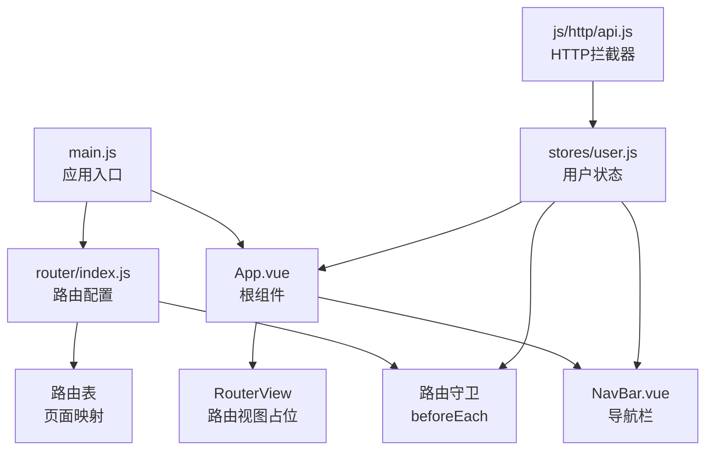
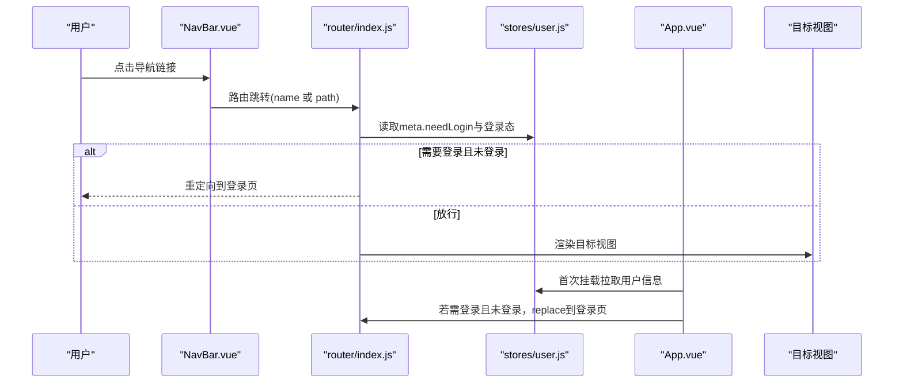
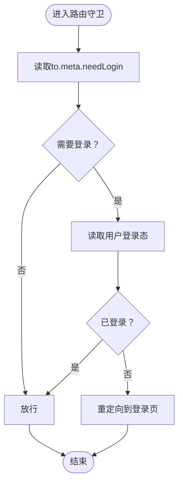
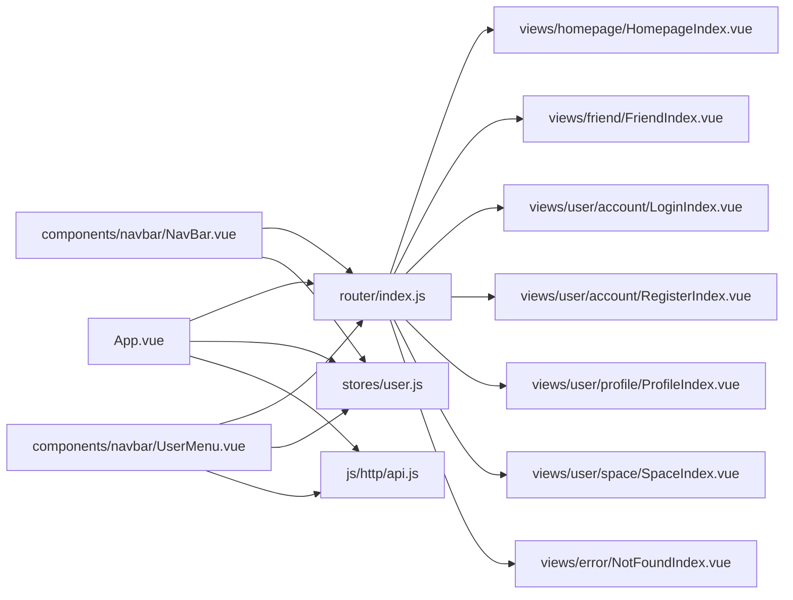

# 路由系统

<cite>
**本文引用的文件**
- [frontend/src/router/index.js](file://frontend/src/router/index.js)
- [frontend/src/main.js](file://frontend/src/main.js)
- [frontend/src/App.vue](file://frontend/src/App.vue)
- [frontend/src/stores/user.js](file://frontend/src/stores/user.js)
- [frontend/src/views/homepage/HomepageIndex.vue](file://frontend/src/views/homepage/HomepageIndex.vue)
- [frontend/src/views/friend/FriendIndex.vue](file://frontend/src/views/friend/FriendIndex.vue)
- [frontend/src/views/user/space/SpaceIndex.vue](file://frontend/src/views/user/space/SpaceIndex.vue)
- [frontend/src/views/user/profile/ProfileIndex.vue](file://frontend/src/views/user/profile/ProfileIndex.vue)
- [frontend/src/views/user/account/LoginIndex.vue](file://frontend/src/views/user/account/LoginIndex.vue)
- [frontend/src/views/user/account/RegisterIndex.vue](file://frontend/src/views/user/account/RegisterIndex.vue)
- [frontend/src/views/error/NotFoundIndex.vue](file://frontend/src/views/error/NotFoundIndex.vue)
- [frontend/src/components/navbar/NavBar.vue](file://frontend/src/components/navbar/NavBar.vue)
- [frontend/src/components/navbar/UserMenu.vue](file://frontend/src/components/navbar/UserMenu.vue)
- [frontend/src/js/http/api.js](file://frontend/src/js/http/api.js)
- [frontend/package.json](file://frontend/package.json)
</cite>

## 目录
1. [引言](#引言)
2. [项目结构](#项目结构)
3. [核心组件](#核心组件)
4. [架构总览](#架构总览)
5. [详细组件分析](#详细组件分析)
6. [依赖关系分析](#依赖关系分析)
7. [性能考虑](#性能考虑)
8. [故障排查指南](#故障排查指南)
9. [结论](#结论)
10. [附录](#附录)

## 引言
本文件面向 LLM_AIfriends 前端路由系统，系统性梳理 Vue Router 的配置与路由规则设计，覆盖页面路由映射、嵌套视图与导航体验、路由守卫与权限控制、动态路由参数与查询字符串处理、错误页与兜底策略、以及开发与优化最佳实践。读者无需深入源码即可理解路由如何驱动应用导航与安全边界。

## 项目结构
前端路由位于 frontend/src/router/index.js，应用入口在 frontend/src/main.js，根组件 App.vue 负责挂载导航栏与 RouterView。用户状态通过 Pinia store 管理，HTTP 层通过 axios 封装统一注入 Token 并处理刷新逻辑。

图表来源
- [frontend/src/main.js:1-15](file://frontend/src/main.js#L1-L15)
- [frontend/src/App.vue:1-43](file://frontend/src/App.vue#L1-L43)
- [frontend/src/router/index.js:1-104](file://frontend/src/router/index.js#L1-L104)
- [frontend/src/stores/user.js:1-59](file://frontend/src/stores/user.js#L1-L59)
- [frontend/src/js/http/api.js:1-92](file://frontend/src/js/http/api.js#L1-L92)

章节来源
- [frontend/src/main.js:1-15](file://frontend/src/main.js#L1-L15)
- [frontend/src/router/index.js:1-104](file://frontend/src/router/index.js#L1-L104)

## 核心组件
- 路由配置与守卫：集中于 router/index.js，定义路由表与全局前置守卫，基于 meta.needLogin 控制访问权限。
- 应用根组件：App.vue 在挂载阶段拉取用户信息并结合路由守卫完成二次校验与重定向。
- 用户状态：stores/user.js 提供登录态、用户信息、Token 等状态，被守卫与导航组件共享。
- 导航栏与菜单：NavBar.vue 与 UserMenu.vue 基于登录态显示不同导航项与功能入口。
- 视图组件：各页面视图组件负责具体业务展示与交互，如主页、好友页、个人资料页、用户空间、登录/注册、404 等。

章节来源
- [frontend/src/router/index.js:12-101](file://frontend/src/router/index.js#L12-L101)
- [frontend/src/App.vue:13-31](file://frontend/src/App.vue#L13-L31)
- [frontend/src/stores/user.js:4-59](file://frontend/src/stores/user.js#L4-L59)
- [frontend/src/components/navbar/NavBar.vue:1-83](file://frontend/src/components/navbar/NavBar.vue#L1-L83)
- [frontend/src/components/navbar/UserMenu.vue:1-81](file://frontend/src/components/navbar/UserMenu.vue#L1-L81)

## 架构总览
路由系统采用 Vue Router 5 的 History 模式，结合 Pinia 全局状态与 axios 拦截器实现“登录态 + Token 刷新”的统一安全策略。导航栏根据登录态动态渲染，路由守卫在跳转前进行权限校验，未登录访问受保护页面将被重定向至登录页。

图表来源
- [frontend/src/router/index.js:92-101](file://frontend/src/router/index.js#L92-L101)
- [frontend/src/App.vue:13-31](file://frontend/src/App.vue#L13-L31)
- [frontend/src/stores/user.js:18-20](file://frontend/src/stores/user.js#L18-L20)

## 详细组件分析

### 路由配置与页面映射
- 根路径与主页：路径“/”，名称“homepage-index”，不需要登录。
- 好友页：路径“/friend/”，名称“friend-index”，需要登录。
- 创作页：路径“/create/”，名称“create-index”，不需要登录。
- 登录页：路径“/user/account/login/”，名称“user-account-login-index”，不需要登录。
- 注册页：路径“/user/account/register/”，名称“user-account-register-index”，不需要登录。
- 个人资料页：路径“/user/profile/”，名称“user-profile-index”，需要登录。
- 用户空间：路径“/user/space/:user_id/”，名称“user-space-index”，不需要登录（动态路由）。
- 404 页面：路径“/:pathMatch(.*)*”，名称“not-found”，不需要登录。
- 默认 404：路径“/404/”，名称“404”，不需要登录。

章节来源
- [frontend/src/router/index.js:14-89](file://frontend/src/router/index.js#L14-L89)

### 权限控制与路由守卫
- 全局前置守卫：在跳转前检查目标路由 meta.needLogin 与用户登录态。若需要登录且未登录，则重定向到登录页。
- 应用级二次校验：App.vue 首次挂载时拉取用户信息并设置 hasPulledUserInfo 标志，随后再次校验当前路由是否需要登录且未登录，必要时 replace 到登录页。
- 用户状态：stores/user.js 提供 isLogin、setAccessToken、logout 等方法，作为守卫与组件的共同数据源。

图表来源
- [frontend/src/router/index.js:93-101](file://frontend/src/router/index.js#L93-L101)
- [frontend/src/App.vue:25-29](file://frontend/src/App.vue#L25-L29)
- [frontend/src/stores/user.js:18-20](file://frontend/src/stores/user.js#L18-L20)

章节来源
- [frontend/src/router/index.js:92-101](file://frontend/src/router/index.js#L92-L101)
- [frontend/src/App.vue:13-31](file://frontend/src/App.vue#L13-L31)
- [frontend/src/stores/user.js:18-20](file://frontend/src/stores/user.js#L18-L20)

### 动态路由与参数传递
- 动态路由：用户空间“/user/space/:user_id/”使用动态段 user_id 传递用户标识。
- 组件内读取：SpaceIndex.vue 通过 useRoute() 读取 route.params.user_id 并在模板中展示。
- 导航跳转：UserMenu.vue 使用 RouterLink 的 params 字段向动态路由传参，例如跳转到当前用户的空间。

章节来源
- [frontend/src/router/index.js:65-71](file://frontend/src/router/index.js#L65-L71)
- [frontend/src/views/user/space/SpaceIndex.vue:3-10](file://frontend/src/views/user/space/SpaceIndex.vue#L3-L10)
- [frontend/src/components/navbar/UserMenu.vue:45-46](file://frontend/src/components/navbar/UserMenu.vue#L45-L46)

### 查询字符串与路由参数处理
- 当前代码未显式声明查询参数解析规则，但 Vue Router 默认支持 query 对象访问。若业务需要，可在路由定义中增加 props 选项或在组件内通过 useRoute().query 读取。
- 建议：对重要查询参数在路由定义中明确类型与默认值，便于组件与测试层清晰约定。

（本节为通用建议，不直接分析具体文件）

### 错误页与兜底策略
- 显式 404：路径“/404/”指向 NotFoundIndex.vue。
- 通配符兜底：路径“/:pathMatch(.*)*”指向 NotFoundIndex.vue，确保未匹配路由统一跳转到 404。
- 设计原则：所有异常路径均应进入 404，保持用户体验一致。

章节来源
- [frontend/src/router/index.js:41-88](file://frontend/src/router/index.js#L41-L88)
- [frontend/src/views/error/NotFoundIndex.vue:1-11](file://frontend/src/views/error/NotFoundIndex.vue#L1-L11)

### 导航体验与嵌套路由
- 根组件 App.vue 包裹 NavBar.vue 并在其中放置 RouterView，形成“导航栏 + 内容区”的嵌套布局。
- NavBar.vue 依据登录态显示不同导航项，如创作、登录、个人空间、编辑资料、退出登录等。
- UserMenu.vue 作为用户下拉菜单，内部使用 RouterLink 实现无刷新跳转。

章节来源
- [frontend/src/App.vue:34-37](file://frontend/src/App.vue#L34-L37)
- [frontend/src/components/navbar/NavBar.vue:1-83](file://frontend/src/components/navbar/NavBar.vue#L1-L83)
- [frontend/src/components/navbar/UserMenu.vue:1-81](file://frontend/src/components/navbar/UserMenu.vue#L1-L81)

### 视图组件功能定位
- 主页：展示首页内容，不需要登录。
- 好友页：展示好友相关内容，需要登录。
- 创作页：展示创作入口，不需要登录。
- 登录页：提供用户名/密码登录，成功后跳转主页。
- 注册页：提供用户名/密码注册，成功后跳转主页。
- 个人资料页：展示并编辑用户头像、用户名、简介，需要登录。
- 用户空间：展示指定用户的空间内容，动态路由参数 user_id。
- 404 页面：未匹配路由的统一提示。

章节来源
- [frontend/src/views/homepage/HomepageIndex.vue:1-11](file://frontend/src/views/homepage/HomepageIndex.vue#L1-L11)
- [frontend/src/views/friend/FriendIndex.vue:1-11](file://frontend/src/views/friend/FriendIndex.vue#L1-L11)
- [frontend/src/views/user/account/LoginIndex.vue:1-69](file://frontend/src/views/user/account/LoginIndex.vue#L1-L69)
- [frontend/src/views/user/account/RegisterIndex.vue:1-76](file://frontend/src/views/user/account/RegisterIndex.vue#L1-L76)
- [frontend/src/views/user/profile/ProfileIndex.vue:1-77](file://frontend/src/views/user/profile/ProfileIndex.vue#L1-L77)
- [frontend/src/views/user/space/SpaceIndex.vue:1-14](file://frontend/src/views/user/space/SpaceIndex.vue#L1-L14)
- [frontend/src/views/error/NotFoundIndex.vue:1-11](file://frontend/src/views/error/NotFoundIndex.vue#L1-L11)

### HTTP 安全与 Token 刷新
- 请求拦截：api.js 在请求头注入 Bearer Token。
- 响应拦截：当返回 401 且未重试过时，使用 refresh_token 接口刷新 access_token，并重发原始请求；若刷新失败则登出并拒绝请求。
- 与路由配合：登录态变化影响路由守卫与导航栏显示，确保安全边界一致。

章节来源
- [frontend/src/js/http/api.js:21-89](file://frontend/src/js/http/api.js#L21-L89)
- [frontend/src/stores/user.js:32-39](file://frontend/src/stores/user.js#L32-L39)

## 依赖关系分析
- 路由依赖：router/index.js 依赖 stores/user.js 的登录态与 hasPulledUserInfo 标志；依赖各视图组件进行页面渲染。
- 根组件依赖：App.vue 依赖 stores/user.js 与 api.js 完成首次用户信息拉取与登录态同步；依赖 router/index.js 的守卫逻辑。
- 导航组件依赖：NavBar.vue 与 UserMenu.vue 依赖 stores/user.js 的登录态与用户信息；依赖 router/index.js 的命名路由进行跳转。
- 视图组件依赖：各页面视图组件依赖 stores/user.js 与 api.js 完成本页面业务逻辑。

图表来源
- [frontend/src/router/index.js:1-104](file://frontend/src/router/index.js#L1-L104)
- [frontend/src/App.vue:1-43](file://frontend/src/App.vue#L1-L43)
- [frontend/src/stores/user.js:1-59](file://frontend/src/stores/user.js#L1-L59)
- [frontend/src/js/http/api.js:1-92](file://frontend/src/js/http/api.js#L1-L92)
- [frontend/src/components/navbar/NavBar.vue:1-83](file://frontend/src/components/navbar/NavBar.vue#L1-L83)
- [frontend/src/components/navbar/UserMenu.vue:1-81](file://frontend/src/components/navbar/UserMenu.vue#L1-L81)

章节来源
- [frontend/src/router/index.js:1-104](file://frontend/src/router/index.js#L1-L104)
- [frontend/src/App.vue:1-43](file://frontend/src/App.vue#L1-L43)
- [frontend/src/stores/user.js:1-59](file://frontend/src/stores/user.js#L1-L59)
- [frontend/src/js/http/api.js:1-92](file://frontend/src/js/http/api.js#L1-L92)
- [frontend/src/components/navbar/NavBar.vue:1-83](file://frontend/src/components/navbar/NavBar.vue#L1-L83)
- [frontend/src/components/navbar/UserMenu.vue:1-81](file://frontend/src/components/navbar/UserMenu.vue#L1-L81)

## 性能考虑
- 路由懒加载：当前路由导入为同步导入，建议将大型视图组件改为异步动态导入，减少首屏包体与提升首屏速度。
- 重复请求避免：App.vue 首次挂载时拉取用户信息，完成后设置 hasPulledUserInfo，避免重复拉取。
- 导航切换：使用命名路由与 RouterLink，避免硬编码路径，提升可维护性与缓存命中率。
- 图片与资源：ProfileIndex.vue 的头像裁剪使用 Croppie，注意在组件卸载时销毁实例，避免内存泄漏。

（本节为通用建议，不直接分析具体文件）

## 故障排查指南
- 访问受保护页面被重定向到登录页
  - 检查路由 meta.needLogin 与 stores/user.js 的 isLogin 返回值。
  - 确认 App.vue 是否正确设置 hasPulledUserInfo 并执行 replace 逻辑。
- 登录/注册后未跳转主页
  - 检查 LoginIndex.vue 与 RegisterIndex.vue 的提交逻辑与路由跳转。
- 动态路由参数为空
  - 检查 UserMenu.vue 的 params 传参与 SpaceIndex.vue 的 route.params 读取。
- 404 页面频繁出现
  - 检查路由表是否遗漏末尾斜杠或正则匹配是否正确。
- Token 失效导致接口失败
  - 检查 api.js 的拦截器与刷新流程，确认刷新接口可用且返回新 access_token。

章节来源
- [frontend/src/router/index.js:92-101](file://frontend/src/router/index.js#L92-L101)
- [frontend/src/App.vue:13-31](file://frontend/src/App.vue#L13-L31)
- [frontend/src/views/user/account/LoginIndex.vue:15-41](file://frontend/src/views/user/account/LoginIndex.vue#L15-L41)
- [frontend/src/views/user/account/RegisterIndex.vue:16-45](file://frontend/src/views/user/account/RegisterIndex.vue#L16-L45)
- [frontend/src/components/navbar/UserMenu.vue:45-46](file://frontend/src/components/navbar/UserMenu.vue#L45-L46)
- [frontend/src/views/user/space/SpaceIndex.vue:5-6](file://frontend/src/views/user/space/SpaceIndex.vue#L5-L6)
- [frontend/src/js/http/api.js:46-89](file://frontend/src/js/http/api.js#L46-L89)

## 结论
本路由系统以“命名路由 + 全局守卫 + 登录态同步”为核心，结合导航栏与视图组件实现了清晰的权限边界与良好的导航体验。建议后续引入动态导入优化首屏性能，并完善查询参数与动态路由的类型约束，进一步提升可维护性与健壮性。

## 附录

### 路由开发指南与最佳实践
- 路由命名：统一使用语义化 name，便于跨组件跳转与调试。
- 权限标注：为每个路由明确 meta.needLogin，避免遗漏。
- 登录态同步：在根组件与守卫中协同完成首次拉取与二次校验。
- 动态路由：明确参数名与类型，组件内通过 useRoute 读取。
- 错误兜底：使用通配符路由统一 404，保持一致性。
- 性能优化：大组件采用异步导入，减少首屏体积。
- 导航体验：优先使用 RouterLink 与命名路由，避免硬编码路径。

章节来源
- [frontend/src/router/index.js:14-89](file://frontend/src/router/index.js#L14-L89)
- [frontend/src/App.vue:13-31](file://frontend/src/App.vue#L13-L31)
- [frontend/src/components/navbar/NavBar.vue:40-47](file://frontend/src/components/navbar/NavBar.vue#L40-L47)