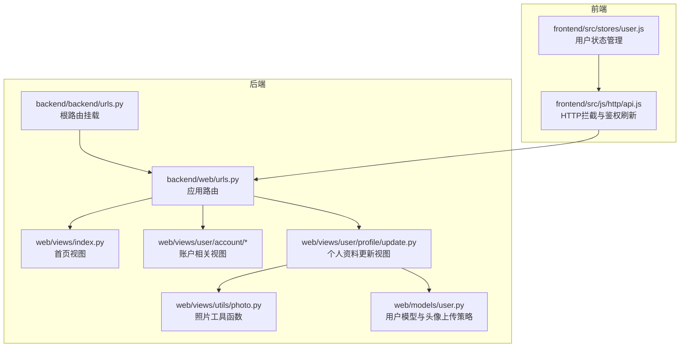
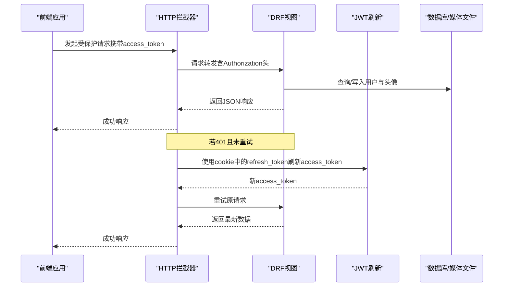
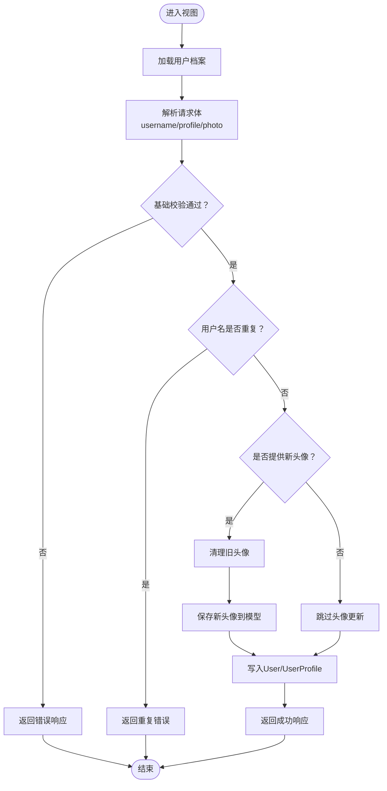
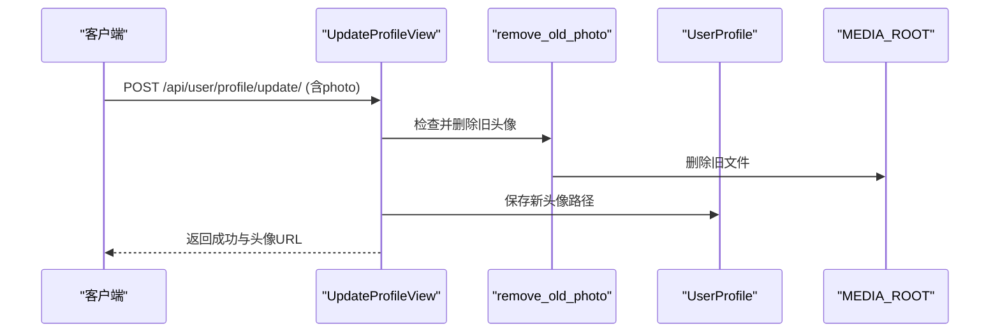
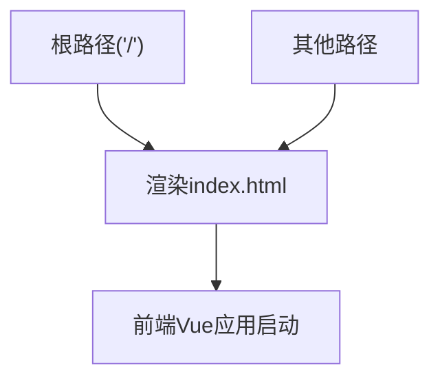
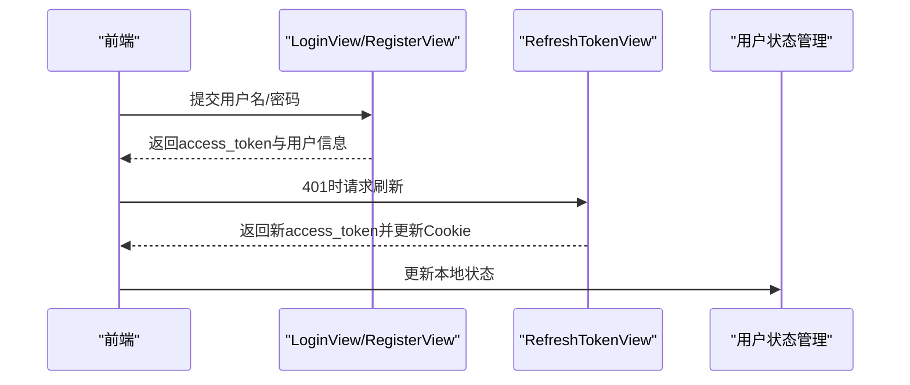
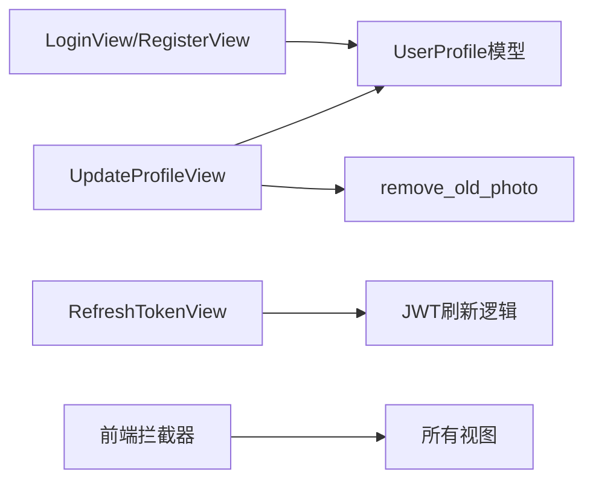

# API视图实现

<cite>
**本文引用的文件**
- [backend/web/views/index.py](file://backend/web/views/index.py)
- [backend/web/views/user/account/get_user_info.py](file://backend/web/views/user/account/get_user_info.py)
- [backend/web/views/user/account/login.py](file://backend/web/views/user/account/login.py)
- [backend/web/views/user/account/logout.py](file://backend/web/views/user/account/logout.py)
- [backend/web/views/user/account/refresh_token.py](file://backend/web/views/user/account/refresh_token.py)
- [backend/web/views/user/account/register.py](file://backend/web/views/user/account/register.py)
- [backend/web/views/user/profile/update.py](file://backend/web/views/user/profile/update.py)
- [backend/web/views/utils/photo.py](file://backend/web/views/utils/photo.py)
- [backend/web/models/user.py](file://backend/web/models/user.py)
- [backend/web/urls.py](file://backend/web/urls.py)
- [backend/backend/urls.py](file://backend/backend/urls.py)
- [frontend/src/js/http/api.js](file://frontend/src/js/http/api.js)
- [frontend/src/stores/user.js](file://frontend/src/stores/user.js)
- [backend/web/templates/index.html](file://backend/web/templates/index.html)
</cite>

## 目录
1. [引言](#引言)
2. [项目结构](#项目结构)
3. [核心组件](#核心组件)
4. [架构总览](#架构总览)
5. [详细组件分析](#详细组件分析)
6. [依赖分析](#依赖分析)
7. [性能考虑](#性能考虑)
8. [故障排查指南](#故障排查指南)
9. [结论](#结论)
10. [附录](#附录)

## 引言
本文件聚焦于LLM_AIfriends项目的Django REST Framework（DRF）API视图实现，系统性梳理基于类的视图（APIView）设计模式与实现细节，覆盖以下主题：
- 视图函数的参数处理、数据验证与响应格式
- 异常处理机制、错误响应与状态码管理
- 权限控制与序列化器使用建议
- 文件上传处理流程与性能优化策略
- 个人资料更新视图、文件上传处理与首页视图的具体实现
- 最佳实践与扩展指南

## 项目结构
后端采用Django应用“web”承载业务逻辑，视图层位于web/views下，按功能域划分账户（account）、个人资料（profile）等子目录；URL路由集中在web/urls.py，并由backend/urls.py统一挂载。

图表来源
- [backend/backend/urls.py:23-26](file://backend/backend/urls.py#L23-L26)
- [backend/web/urls.py:10-23](file://backend/web/urls.py#L10-L23)
- [backend/web/views/index.py:1-4](file://backend/web/views/index.py#L1-L4)
- [backend/web/views/user/profile/update.py:1-63](file://backend/web/views/user/profile/update.py#L1-L63)
- [backend/web/views/utils/photo.py:1-13](file://backend/web/views/utils/photo.py#L1-L13)
- [backend/web/models/user.py:15-23](file://backend/web/models/user.py#L15-L23)
- [frontend/src/js/http/api.js:14-92](file://frontend/src/js/http/api.js#L14-L92)
- [frontend/src/stores/user.js:1-59](file://frontend/src/stores/user.js#L1-L59)

章节来源
- [backend/backend/urls.py:23-26](file://backend/backend/urls.py#L23-L26)
- [backend/web/urls.py:10-23](file://backend/web/urls.py#L10-L23)

## 核心组件
- 账户相关视图：登录、注册、刷新令牌、登出、获取当前用户信息
- 个人资料视图：更新用户名、简介与头像
- 工具函数：旧头像清理
- 模型：用户档案与头像上传策略
- 前端拦截器：统一注入Authorization头、401时使用refresh_token刷新access_token

章节来源
- [backend/web/views/user/account/login.py:9-46](file://backend/web/views/user/account/login.py#L9-L46)
- [backend/web/views/user/account/register.py:9-46](file://backend/web/views/user/account/register.py#L9-L46)
- [backend/web/views/user/account/refresh_token.py:7-41](file://backend/web/views/user/account/refresh_token.py#L7-L41)
- [backend/web/views/user/account/logout.py:7-16](file://backend/web/views/user/account/logout.py#L7-L16)
- [backend/web/views/user/account/get_user_info.py:8-25](file://backend/web/views/user/account/get_user_info.py#L8-L25)
- [backend/web/views/user/profile/update.py:12-63](file://backend/web/views/user/profile/update.py#L12-L63)
- [backend/web/views/utils/photo.py:9-13](file://backend/web/views/utils/photo.py#L9-L13)
- [backend/web/models/user.py:15-23](file://backend/web/models/user.py#L15-L23)
- [frontend/src/js/http/api.js:46-90](file://frontend/src/js/http/api.js#L46-L90)

## 架构总览
下图展示前后端交互与DRF视图职责：

图表来源
- [frontend/src/js/http/api.js:46-90](file://frontend/src/js/http/api.js#L46-L90)
- [backend/web/views/user/account/refresh_token.py:7-41](file://backend/web/views/user/account/refresh_token.py#L7-L41)
- [backend/web/views/user/account/login.py:9-46](file://backend/web/views/user/account/login.py#L9-L46)
- [backend/web/views/user/profile/update.py:12-63](file://backend/web/views/user/profile/update.py#L12-L63)

## 详细组件分析

### 个人资料更新视图（UpdateProfileView）
- 设计模式：基于APIView，使用IsAuthenticated权限，POST方法处理更新请求
- 参数处理与验证：
  - 从请求体读取username、profile、photo（可选）
  - 基础校验：非空、唯一性（用户名重复检测）
  - 内容截断：简介最大长度限制
- 数据库写入：
  - 更新User与UserProfile字段，记录更新时间
  - 头像替换：若提供新文件，先清理旧头像再保存新文件
- 响应格式：统一返回result字段与业务数据；头像需返回完整URL
- 异常处理：捕获异常并返回系统提示；未显式抛出异常时保持一致性

图表来源
- [backend/web/views/user/profile/update.py:15-61](file://backend/web/views/user/profile/update.py#L15-L61)
- [backend/web/views/utils/photo.py:9-13](file://backend/web/views/utils/photo.py#L9-L13)
- [backend/web/models/user.py:15-23](file://backend/web/models/user.py#L15-L23)

章节来源
- [backend/web/views/user/profile/update.py:12-63](file://backend/web/views/user/profile/update.py#L12-L63)
- [backend/web/views/utils/photo.py:9-13](file://backend/web/views/utils/photo.py#L9-L13)
- [backend/web/models/user.py:15-23](file://backend/web/models/user.py#L15-L23)

### 文件上传处理（头像更新）
- 上传入口：UpdateProfileView接收multipart/form-data，读取FILES中的photo键
- 存储策略：自定义upload_to函数，生成唯一文件名并按用户ID分类存储
- 清理策略：remove_old_photo在替换头像前删除旧文件，避免数据库冗余
- 安全与健壮性：对默认头像进行保护，不删除默认路径文件

图表来源
- [backend/web/views/user/profile/update.py:39-46](file://backend/web/views/user/profile/update.py#L39-L46)
- [backend/web/views/utils/photo.py:9-13](file://backend/web/views/utils/photo.py#L9-L13)
- [backend/web/models/user.py:10-13](file://backend/web/models/user.py#L10-L13)

章节来源
- [backend/web/views/user/profile/update.py:39-46](file://backend/web/views/user/profile/update.py#L39-L46)
- [backend/web/views/utils/photo.py:9-13](file://backend/web/views/utils/photo.py#L9-L13)
- [backend/web/models/user.py:10-13](file://backend/web/models/user.py#L10-L13)

### 首页视图（SPA入口）
- 作用：渲染前端单页应用入口模板，供前端路由接管
- 路由：根路径与兜底路由均指向index视图，确保前端路由正常工作

图表来源
- [backend/web/urls.py:19-22](file://backend/web/urls.py#L19-L22)
- [backend/web/views/index.py:1-4](file://backend/web/views/index.py#L1-L4)
- [backend/web/templates/index.html:1-17](file://backend/web/templates/index.html#L1-L17)

章节来源
- [backend/web/urls.py:19-22](file://backend/web/urls.py#L19-L22)
- [backend/web/views/index.py:1-4](file://backend/web/views/index.py#L1-L4)
- [backend/web/templates/index.html:1-17](file://backend/web/templates/index.html#L1-L17)

### 登录/注册/刷新/登出视图
- 登录（LoginView）：校验凭据，签发JWT，设置refresh_token Cookie，返回用户信息与头像URL
- 注册（RegisterView）：校验用户名唯一性，创建用户与默认档案，签发JWT并设置Cookie
- 刷新（RefreshTokenView）：从Cookie读取refresh_token，校验有效性并刷新access_token，必要时轮换refresh_token并更新Cookie
- 登出（LogoutView）：强制登录态，删除refresh_token Cookie

图表来源
- [frontend/src/js/http/api.js:46-90](file://frontend/src/js/http/api.js#L46-L90)
- [backend/web/views/user/account/login.py:9-46](file://backend/web/views/user/account/login.py#L9-L46)
- [backend/web/views/user/account/register.py:9-46](file://backend/web/views/user/account/register.py#L9-L46)
- [backend/web/views/user/account/refresh_token.py:7-41](file://backend/web/views/user/account/refresh_token.py#L7-L41)
- [frontend/src/stores/user.js:22-31](file://frontend/src/stores/user.js#L22-L31)

章节来源
- [backend/web/views/user/account/login.py:9-46](file://backend/web/views/user/account/login.py#L9-L46)
- [backend/web/views/user/account/register.py:9-46](file://backend/web/views/user/account/register.py#L9-L46)
- [backend/web/views/user/account/refresh_token.py:7-41](file://backend/web/views/user/account/refresh_token.py#L7-L41)
- [backend/web/views/user/account/logout.py:7-16](file://backend/web/views/user/account/logout.py#L7-L16)
- [frontend/src/js/http/api.js:46-90](file://frontend/src/js/http/api.js#L46-L90)
- [frontend/src/stores/user.js:22-31](file://frontend/src/stores/user.js#L22-L31)

### 获取当前用户信息（GetUserInfoView）
- 权限：IsAuthenticated
- 流程：读取request.user关联的UserProfile，返回用户基本信息与头像URL
- 异常：捕获异常并返回系统提示

章节来源
- [backend/web/views/user/account/get_user_info.py:8-25](file://backend/web/views/user/account/get_user_info.py#L8-L25)

## 依赖分析
- 视图与模型耦合：UpdateProfileView依赖UserProfile模型的ImageField与upload_to策略
- 视图与工具函数：旧头像清理通过remove_old_photo实现
- 前后端协作：前端通过axios拦截器统一注入Authorization头，401时自动刷新access_token
- 路由组织：web/urls.py集中声明各API端点，backend/urls.py挂载至根路径

图表来源
- [backend/web/views/user/profile/update.py:8-9](file://backend/web/views/user/profile/update.py#L8-L9)
- [backend/web/views/utils/photo.py:9-13](file://backend/web/views/utils/photo.py#L9-L13)
- [backend/web/models/user.py:15-23](file://backend/web/models/user.py#L15-L23)
- [frontend/src/js/http/api.js:46-90](file://frontend/src/js/http/api.js#L46-L90)

章节来源
- [backend/web/urls.py:10-17](file://backend/web/urls.py#L10-L17)
- [backend/backend/urls.py:23-26](file://backend/backend/urls.py#L23-L26)

## 性能考虑
- 数据库查询优化
  - 使用select_related或prefetch_related减少N+1查询（建议在复杂场景引入）
  - 对频繁读取的字段建立索引（如用户名唯一索引）
- 文件存储与清理
  - 旧头像清理避免磁盘膨胀，建议定期任务清理异常文件
- 序列化与响应
  - 统一响应结构，避免过度嵌套；对大字段（如简介）按需返回
- 缓存策略
  - 对只读用户信息可引入短期缓存（如Redis），降低数据库压力
- 并发与幂等
  - 对更新接口增加幂等键与乐观锁，避免并发覆盖

## 故障排查指南
- 常见错误与状态码
  - 400：用户名/密码为空、用户名重复、必填字段缺失
  - 401：access_token过期或无效；refresh_token缺失或过期
  - 500：系统异常（捕获异常后的通用提示）
- 建议的日志与监控
  - 记录关键操作（登录、注册、头像更新）与异常堆栈
  - 监控刷新令牌成功率与失败原因
- 前端联动
  - 401时自动触发刷新流程，刷新失败则清空本地登录状态
  - 确保Cookie安全标志（secure、httponly、sameSite）正确配置

章节来源
- [backend/web/views/user/account/login.py:14-46](file://backend/web/views/user/account/login.py#L14-L46)
- [backend/web/views/user/account/register.py:14-46](file://backend/web/views/user/account/register.py#L14-L46)
- [backend/web/views/user/account/refresh_token.py:10-41](file://backend/web/views/user/account/refresh_token.py#L10-L41)
- [frontend/src/js/http/api.js:46-90](file://frontend/src/js/http/api.js#L46-L90)

## 结论
本项目采用DRF的APIView模式构建REST接口，配合JWT与Cookie实现鉴权与会话管理，视图层职责清晰、异常处理一致。个人资料更新视图实现了头像上传与旧文件清理，首页视图支持前端SPA路由。建议后续引入序列化器、分页与缓存策略，进一步提升可维护性与性能。

## 附录

### API端点一览（节选）
- 登录：POST /api/user/account/login/
- 注册：POST /api/user/account/register/
- 刷新令牌：POST /api/user/account/refresh_token/
- 登出：POST /api/user/account/logout/
- 获取当前用户信息：GET /api/user/account/get_user_info/
- 更新个人资料：POST /api/user/profile/update/

章节来源
- [backend/web/urls.py:12-17](file://backend/web/urls.py#L12-L17)