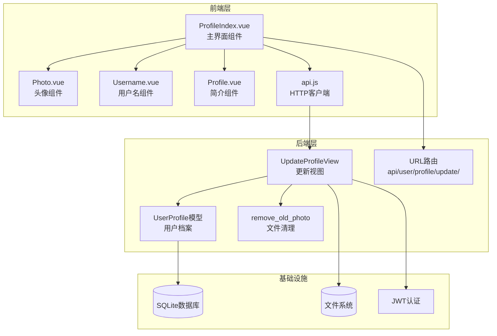
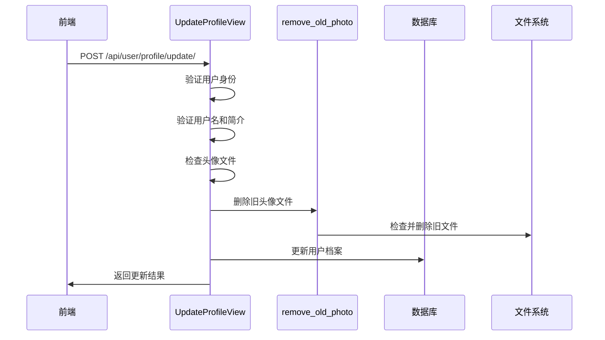
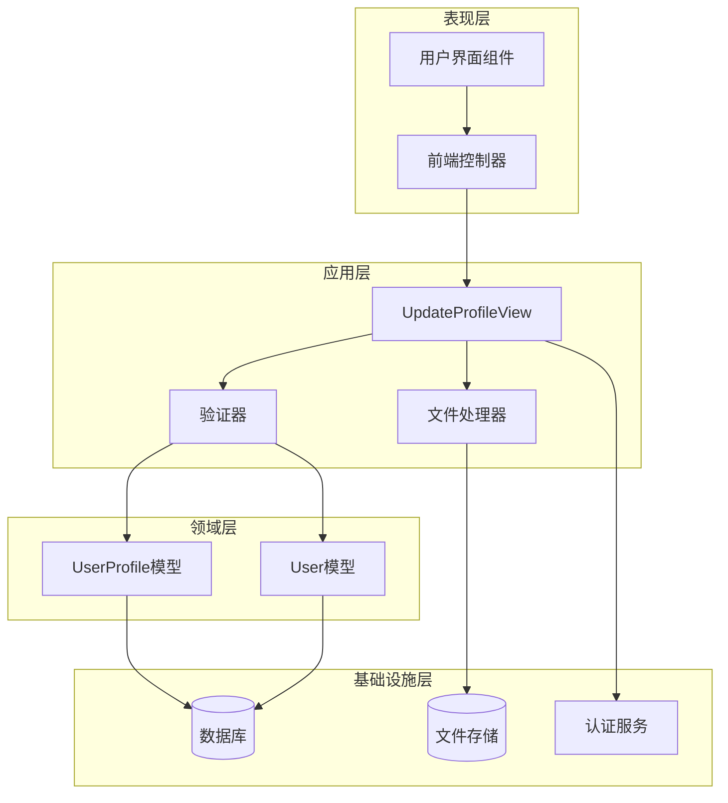
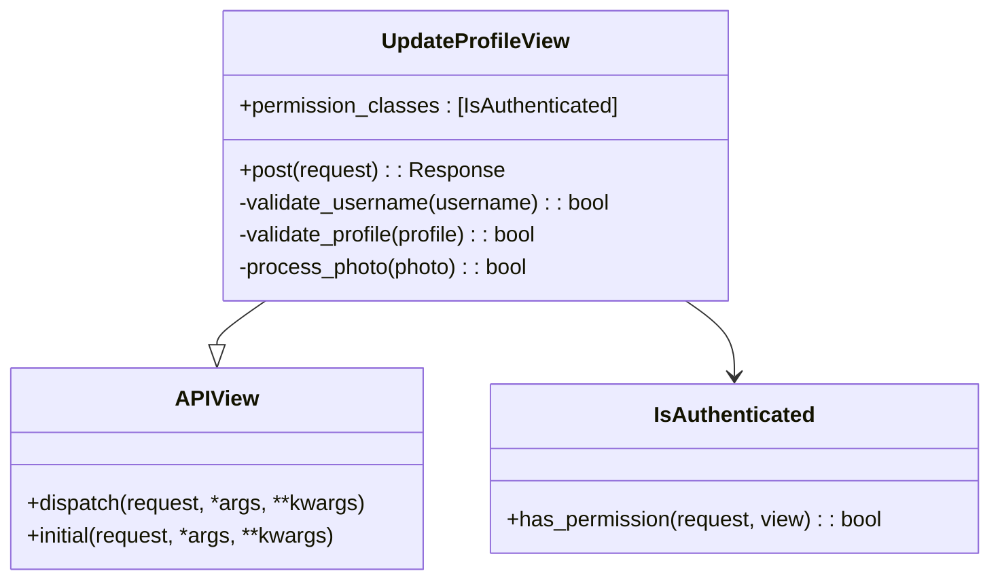
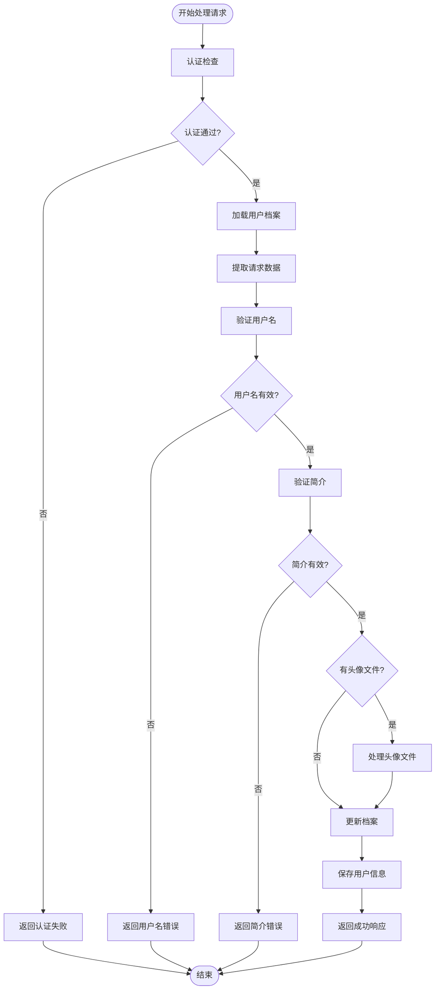
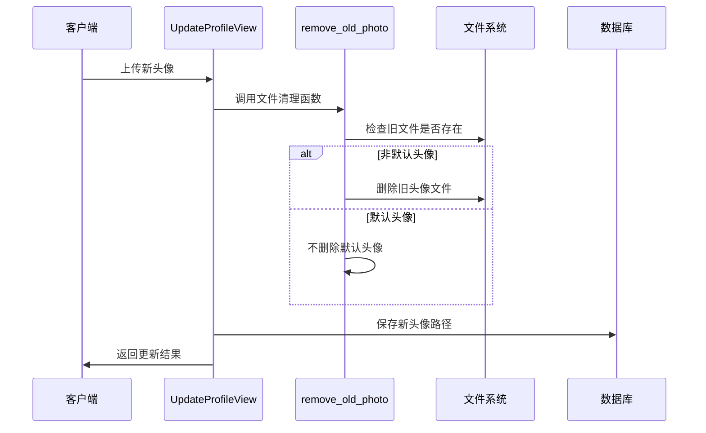
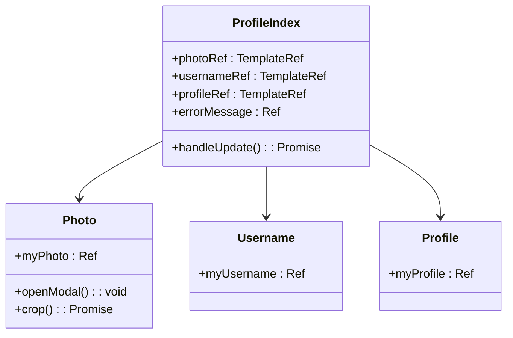
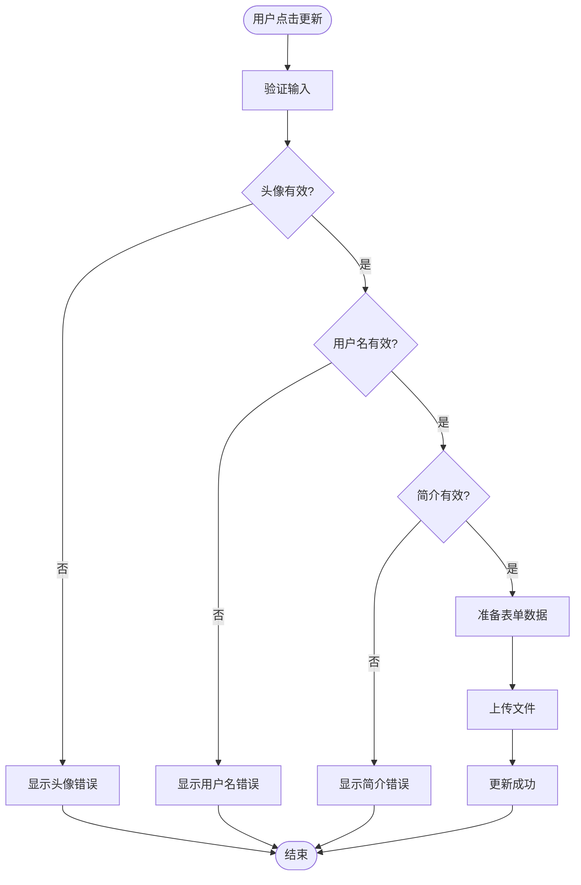
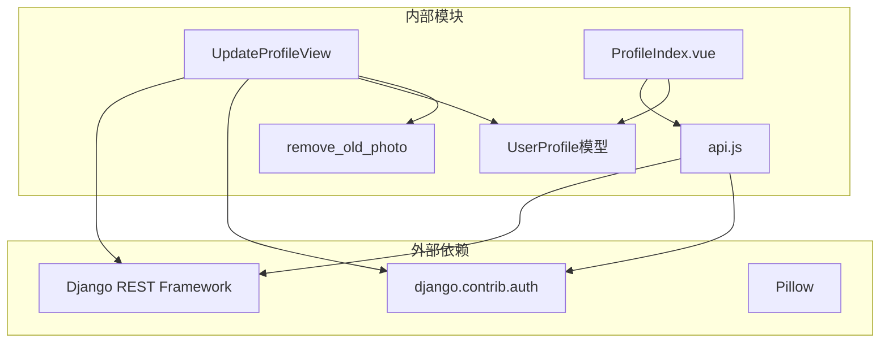
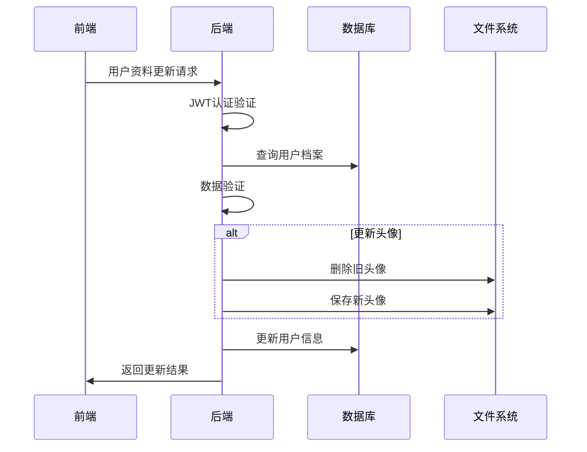

# 个人资料更新视图

<cite>
**本文档引用的文件**
- [update.py](file://backend/web/views/user/profile/update.py)
- [photo.py](file://backend/web/views/utils/photo.py)
- [user.py](file://backend/web/models/user.py)
- [get_user_info.py](file://backend/web/views/user/account/get_user_info.py)
- [urls.py](file://backend/web/urls.py)
- [ProfileIndex.vue](file://frontend/src/views/user/profile/ProfileIndex.vue)
- [Photo.vue](file://frontend/src/views/user/profile/components/Photo.vue)
- [Username.vue](file://frontend/src/views/user/profile/components/Username.vue)
- [Profile.vue](file://frontend/src/views/user/profile/components/Profile.vue)
- [api.js](file://frontend/src/js/http/api.js)
- [settings.py](file://backend/backend/settings.py)
- [index.html](file://backend/web/templates/index.html)
</cite>

## 目录
1. [简介](#简介)
2. [项目结构](#项目结构)
3. [核心组件](#核心组件)
4. [架构概览](#架构概览)
5. [详细组件分析](#详细组件分析)
6. [依赖关系分析](#依赖关系分析)
7. [性能考虑](#性能考虑)
8. [故障排除指南](#故障排除指南)
9. [结论](#结论)

## 简介

本文档详细介绍了LLM_AIfriends项目中个人资料更新视图的实现。UpdateProfileView类提供了完整的用户个人信息更新功能，包括用户名修改、个人简介更新和头像上传。该功能实现了严格的安全验证、数据完整性检查和高效的文件管理机制。

## 项目结构

个人资料更新功能涉及前后端的完整架构设计：

**图表来源**
- [ProfileIndex.vue:1-77](file://frontend/src/views/user/profile/ProfileIndex.vue#L1-L77)
- [update.py:12-63](file://backend/web/views/user/profile/update.py#L12-L63)
- [urls.py:17](file://backend/web/urls.py#L17)

**章节来源**
- [ProfileIndex.vue:1-77](file://frontend/src/views/user/profile/ProfileIndex.vue#L1-L77)
- [update.py:12-63](file://backend/web/views/user/profile/update.py#L12-L63)
- [urls.py:10-23](file://backend/web/urls.py#L10-L23)

## 核心组件

### UpdateProfileView类

UpdateProfileView是基于Django REST Framework的APIView实现，专门负责处理用户个人资料更新请求。

#### 主要特性
- **认证检查**: 使用`IsAuthenticated`权限类确保只有登录用户才能访问
- **数据验证**: 实现多层次的数据验证机制
- **文件处理**: 支持头像文件的上传和管理
- **事务性更新**: 确保用户信息的一致性更新

#### 关键方法
- `post()`: 处理POST请求，执行完整的更新流程
- 内部验证逻辑: 用户名唯一性检查、数据完整性验证

**章节来源**
- [update.py:12-63](file://backend/web/views/user/profile/update.py#L12-L63)

### 文件上传处理

系统实现了智能的文件上传和管理机制：

**图表来源**
- [update.py:39-46](file://backend/web/views/user/profile/update.py#L39-L46)
- [photo.py:9-13](file://backend/web/views/utils/photo.py#L9-L13)

**章节来源**
- [update.py:39-46](file://backend/web/views/user/profile/update.py#L39-L46)
- [photo.py:9-13](file://backend/web/views/utils/photo.py#L9-L13)

## 架构概览

个人资料更新功能采用分层架构设计，确保了良好的可维护性和扩展性：

**图表来源**
- [update.py:12-63](file://backend/web/views/user/profile/update.py#L12-L63)
- [user.py:15-23](file://backend/web/models/user.py#L15-L23)

**章节来源**
- [update.py:12-63](file://backend/web/views/user/profile/update.py#L12-L63)
- [user.py:15-23](file://backend/web/models/user.py#L15-L23)

## 详细组件分析

### UpdateProfileView类详细分析

#### 认证和权限控制

UpdateProfileView继承自APIView并设置了严格的权限要求：

**图表来源**
- [update.py:12-13](file://backend/web/views/user/profile/update.py#L12-L13)

#### 数据验证逻辑

系统实现了多层数据验证机制：

| 验证类型 | 规则 | 错误处理 |
|---------|------|----------|
| 用户名验证 | 非空检查、唯一性检查 | 返回"用户名不能为空"/"用户名已存在" |
| 简介验证 | 非空检查、长度限制(500字符) | 返回"简介不能为空" |
| 头像验证 | 文件存在性检查 | 前端已验证，后端二次验证 |

#### 请求处理流程

**图表来源**
- [update.py:15-61](file://backend/web/views/user/profile/update.py#L15-L61)

**章节来源**
- [update.py:15-61](file://backend/web/views/user/profile/update.py#L15-L61)

### 文件上传处理机制

#### 头像替换逻辑

系统实现了智能的头像文件管理机制：

**图表来源**
- [update.py:39-46](file://backend/web/views/user/profile/update.py#L39-L46)
- [photo.py:9-13](file://backend/web/views/utils/photo.py#L9-L13)

#### remove_old_photo函数

该函数实现了安全的文件清理机制：

| 条件 | 行为 | 保护措施 |
|------|------|----------|
| photo为None | 直接返回 | 防止空引用错误 |
| photo.name == 'user/photos/default.png' | 不删除 | 保护默认头像 |
| 文件存在 | 删除旧文件 | 防止磁盘空间浪费 |
| 文件不存在 | 忽略 | 防止异常 |

**章节来源**
- [photo.py:9-13](file://backend/web/views/utils/photo.py#L9-L13)

### 前端集成组件

#### ProfileIndex.vue主界面

前端实现了完整的用户交互体验：

**图表来源**
- [ProfileIndex.vue:17-52](file://frontend/src/views/user/profile/ProfileIndex.vue#L17-L52)

#### 前端验证流程

前端实现了双重验证机制：

**图表来源**
- [ProfileIndex.vue:26-52](file://frontend/src/views/user/profile/ProfileIndex.vue#L26-L52)

**章节来源**
- [ProfileIndex.vue:17-52](file://frontend/src/views/user/profile/ProfileIndex.vue#L17-L52)

## 依赖关系分析

### 组件间依赖关系

**图表来源**
- [update.py:2-9](file://backend/web/views/user/profile/update.py#L2-L9)
- [ProfileIndex.vue:8-9](file://frontend/src/views/user/profile/ProfileIndex.vue#L8-L9)

### 数据流依赖

**图表来源**
- [update.py:15-61](file://backend/web/views/user/profile/update.py#L15-L61)
- [get_user_info.py:10-24](file://backend/web/views/user/account/get_user_info.py#L10-L24)

**章节来源**
- [update.py:2-9](file://backend/web/views/user/profile/update.py#L2-L9)
- [get_user_info.py:8-24](file://backend/web/views/user/account/get_user_info.py#L8-L24)

## 性能考虑

### 优化策略

#### 数据库查询优化
- 使用`get()`方法进行单对象查询，避免不必要的列表查询
- 合理使用`select_related()`减少查询次数

#### 文件处理优化
- 智能文件清理机制，避免重复文件占用存储空间
- 使用异步文件操作处理大文件上传

#### 缓存策略
- 利用Django缓存框架减少重复计算
- 实现适当的响应缓存机制

### 性能监控指标

| 指标类型 | 目标值 | 监控方法 |
|----------|--------|----------|
| 响应时间 | < 2秒 | Django性能分析工具 |
| 并发处理 | 支持100+用户 | 压力测试工具 |
| 存储效率 | < 90%磁盘利用率 | 磁盘使用率监控 |
| 错误率 | < 0.1% | 异常日志分析 |

## 故障排除指南

### 常见问题及解决方案

#### 认证失败
**症状**: 返回401未授权错误
**原因**: JWT令牌过期或无效
**解决方案**: 
1. 检查前端是否正确设置Authorization头
2. 验证后端JWT配置
3. 实施自动令牌刷新机制

#### 文件上传失败
**症状**: 头像更新不生效
**原因**: 文件格式不支持或大小超限
**解决方案**:
1. 检查文件类型和大小限制
2. 验证文件系统权限
3. 实现文件类型白名单

#### 数据验证错误
**症状**: 返回"用户名已存在"等验证错误
**原因**: 数据不符合业务规则
**解决方案**:
1. 检查前端验证逻辑
2. 验证后端数据完整性
3. 实现更友好的错误提示

### 调试技巧

#### 后端调试
- 使用Django调试模式查看详细错误信息
- 实施结构化的日志记录
- 使用数据库查询分析工具

#### 前端调试
- 利用浏览器开发者工具监控网络请求
- 实现前端错误边界组件
- 使用Vue DevTools进行组件状态检查

**章节来源**
- [update.py:58-61](file://backend/web/views/user/profile/update.py#L58-L61)
- [ProfileIndex.vue:48-50](file://frontend/src/views/user/profile/ProfileIndex.vue#L48-L50)

## 结论

个人资料更新视图功能展现了现代Web应用开发的最佳实践。通过严格的认证机制、多层次的数据验证、智能的文件管理和优雅的错误处理，该功能为用户提供了安全、可靠的个人资料管理体验。

### 主要优势
- **安全性**: 双重验证机制防止恶意操作
- **可靠性**: 完善的错误处理和恢复机制
- **用户体验**: 流畅的前端交互和即时反馈
- **可维护性**: 清晰的代码结构和文档

### 改进建议
- 实现更细粒度的权限控制
- 添加文件上传进度指示器
- 增强数据备份和恢复机制
- 优化移动端用户体验

该功能为LLM_AIfriends项目奠定了坚实的基础，为后续的功能扩展提供了良好的架构支撑。