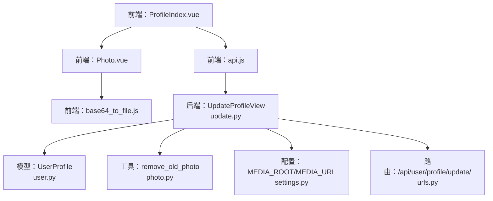
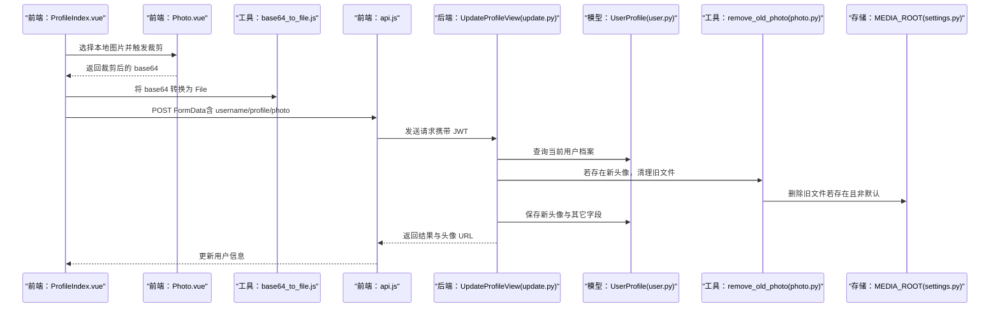
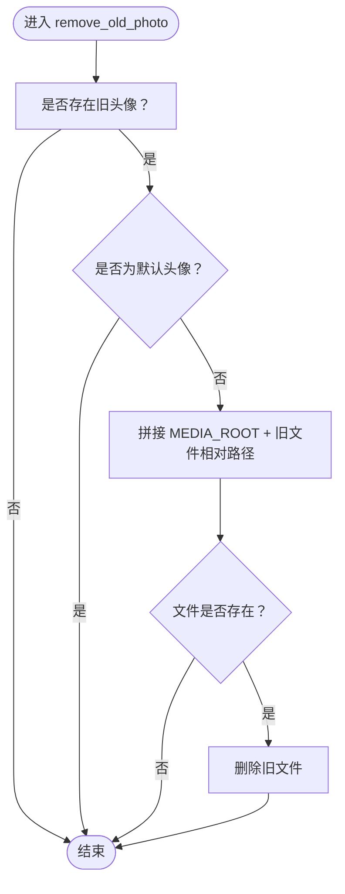
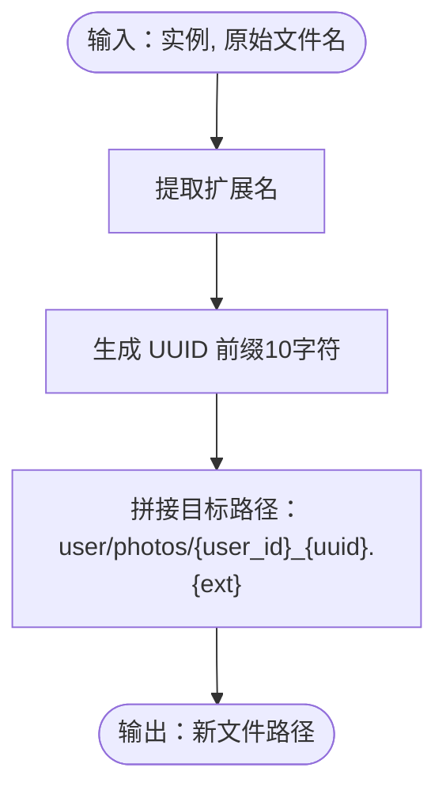
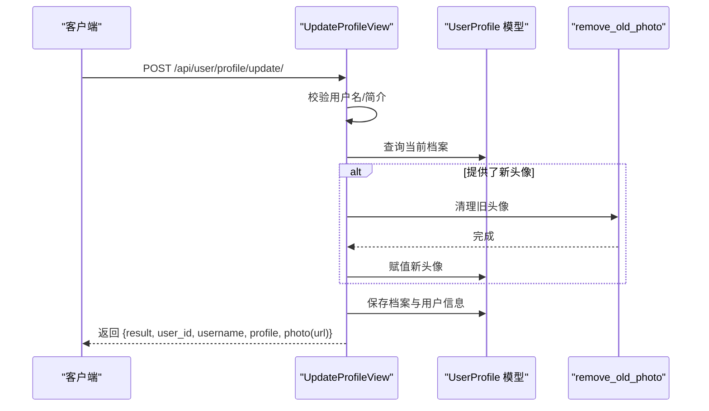
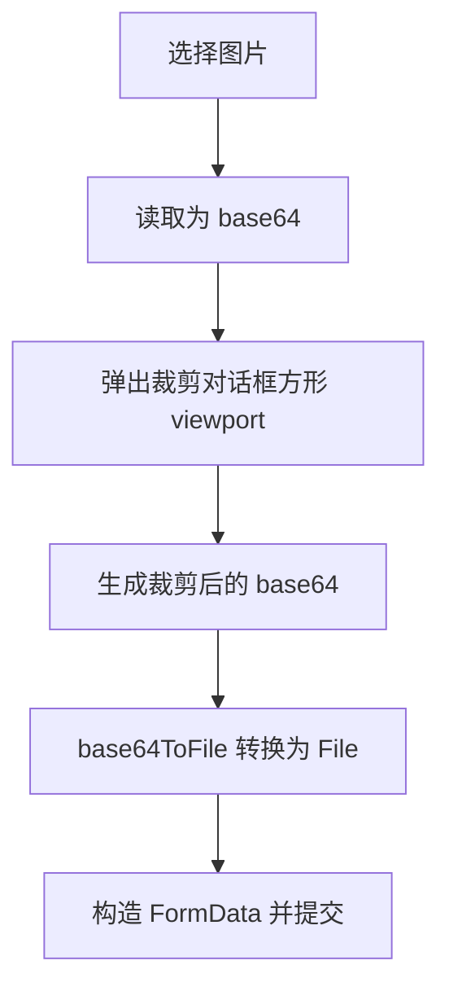
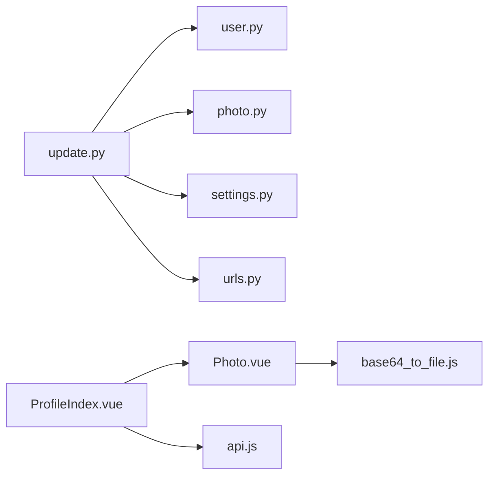

# 文件上传处理器

<cite>
**本文引用的文件**
- [photo.py](file://backend/web/views/utils/photo.py)
- [user.py](file://backend/web/models/user.py)
- [update.py](file://backend/web/views/user/profile/update.py)
- [settings.py](file://backend/backend/settings.py)
- [urls.py](file://backend/web/urls.py)
- [Photo.vue](file://frontend/src/views/user/profile/components/Photo.vue)
- [ProfileIndex.vue](file://frontend/src/views/user/profile/ProfileIndex.vue)
- [base64_to_file.js](file://frontend/src/js/utils/base64_to_file.js)
- [api.js](file://frontend/src/js/http/api.js)
- [register.py](file://backend/web/views/user/account/register.py)
- [login.py](file://backend/web/views/user/account/login.py)
</cite>

## 目录
1. [引言](#引言)
2. [项目结构](#项目结构)
3. [核心组件](#核心组件)
4. [架构总览](#架构总览)
5. [详细组件分析](#详细组件分析)
6. [依赖分析](#依赖分析)
7. [性能考量](#性能考量)
8. [故障排查指南](#故障排查指南)
9. [结论](#结论)
10. [附录](#附录)

## 引言
本文件针对 LLM_AIfriends 项目的“文件上传处理器”进行系统化文档化，重点覆盖以下方面：
- 照片处理工具函数的实现与职责边界
- 旧文件清理机制与存储空间管理策略
- 文件上传的安全考虑、类型与大小限制现状与建议
- 文件命名策略、存储路径配置与异常处理机制
- 最佳实践与性能优化建议

## 项目结构
围绕文件上传的关键模块分布如下：
- 前端
  - 图片裁剪与预览组件：Photo.vue
  - 头像更新入口：ProfileIndex.vue
  - 工具函数：base64_to_file.js
  - HTTP 客户端封装：api.js
- 后端
  - 模型与上传路径策略：user.py
  - 上传处理与旧图清理：photo.py、update.py
  - 配置与路由：settings.py、urls.py
  - 登录/注册接口返回头像 URL：login.py、register.py

图表来源
- [ProfileIndex.vue:17-52](file://frontend/src/views/user/profile/ProfileIndex.vue#L17-L52)
- [Photo.vue:43-76](file://frontend/src/views/user/profile/components/Photo.vue#L43-L76)
- [base64_to_file.js:1-10](file://frontend/src/js/utils/base64_to_file.js#L1-L10)
- [api.js:14-27](file://frontend/src/js/http/api.js#L14-L27)
- [update.py:12-62](file://backend/web/views/user/profile/update.py#L12-L62)
- [user.py:9-23](file://backend/web/models/user.py#L9-L23)
- [photo.py:9-13](file://backend/web/views/utils/photo.py#L9-L13)
- [settings.py:130-131](file://backend/backend/settings.py#L130-L131)
- [urls.py](file://backend/web/urls.py#L17)

章节来源
- [ProfileIndex.vue:1-77](file://frontend/src/views/user/profile/ProfileIndex.vue#L1-L77)
- [Photo.vue:1-109](file://frontend/src/views/user/profile/components/Photo.vue#L1-L109)
- [base64_to_file.js:1-10](file://frontend/src/js/utils/base64_to_file.js#L1-L10)
- [api.js:1-92](file://frontend/src/js/http/api.js#L1-L92)
- [update.py:1-63](file://backend/web/views/user/profile/update.py#L1-L63)
- [user.py:1-23](file://backend/web/models/user.py#L1-L23)
- [photo.py:1-13](file://backend/web/views/utils/photo.py#L1-L13)
- [settings.py:122-131](file://backend/backend/settings.py#L122-L131)
- [urls.py:1-24](file://backend/web/urls.py#L1-L24)

## 核心组件
- 旧文件清理工具：remove_old_photo
  - 作用：在用户上传新头像后，删除旧头像文件，避免磁盘冗余
  - 规则：若旧文件不是默认头像，则删除；否则保留默认头像
- 上传路径策略：photo_upload_to
  - 作用：生成唯一文件名与目标存储路径
  - 策略：UUID 前缀 + 原扩展名；路径包含用户 ID 与分组目录
- 更新视图：UpdateProfileView
  - 作用：接收表单数据（含头像文件），执行校验与保存
  - 流程：校验用户名/简介非空与唯一性；可选更新头像；调用旧图清理；保存模型；返回结果与头像 URL

章节来源
- [photo.py:9-13](file://backend/web/views/utils/photo.py#L9-L13)
- [user.py:9-23](file://backend/web/models/user.py#L9-L23)
- [update.py:12-62](file://backend/web/views/user/profile/update.py#L12-L62)

## 架构总览
从前端到后端的完整上传链路如下：

图表来源
- [ProfileIndex.vue:17-52](file://frontend/src/views/user/profile/ProfileIndex.vue#L17-L52)
- [Photo.vue:43-76](file://frontend/src/views/user/profile/components/Photo.vue#L43-L76)
- [base64_to_file.js:1-10](file://frontend/src/js/utils/base64_to_file.js#L1-L10)
- [api.js:14-27](file://frontend/src/js/http/api.js#L14-L27)
- [update.py:12-62](file://backend/web/views/user/profile/update.py#L12-L62)
- [user.py:15-23](file://backend/web/models/user.py#L15-L23)
- [photo.py:9-13](file://backend/web/views/utils/photo.py#L9-L13)
- [settings.py:130-131](file://backend/backend/settings.py#L130-L131)

## 详细组件分析

### 组件一：旧文件清理工具 remove_old_photo
- 设计要点
  - 仅在新头像上传时触发，避免默认头像被误删
  - 通过 MEDIA_ROOT 与文件相对路径拼接定位旧文件
  - 存在性检查后再删除，避免异常
- 复杂度与性能
  - 时间复杂度：O(1)，仅一次文件系统查询与删除
  - 空间复杂度：O(1)
- 错误处理
  - 未显式捕获异常，若文件系统异常将冒泡至调用方
- 可优化点
  - 建议增加日志记录与异常捕获，便于运维追踪
  - 可引入异步删除或队列，避免阻塞主流程

图表来源
- [photo.py:9-13](file://backend/web/views/utils/photo.py#L9-L13)

章节来源
- [photo.py:1-13](file://backend/web/views/utils/photo.py#L1-L13)

### 组件二：上传路径策略 photo_upload_to
- 设计要点
  - 生成短 UUID 前缀（10 字符）保证唯一性
  - 保留原始扩展名，确保兼容性
  - 路径格式：user/photos/{user_id}_{uuid}.{ext}
- 复杂度与性能
  - 时间复杂度：O(1)，字符串拆分与拼接
  - 空间复杂度：O(1)
- 安全性
  - UUID 降低碰撞概率，减少同名覆盖风险
  - 路径按用户隔离，避免跨用户访问

图表来源
- [user.py:9-23](file://backend/web/models/user.py#L9-L23)

章节来源
- [user.py:1-23](file://backend/web/models/user.py#L1-L23)

### 组件三：更新视图 UpdateProfileView
- 请求处理流程
  - 认证：基于 JWT 的 IsAuthenticated 权限
  - 参数校验：用户名/简介非空与唯一性
  - 可选头像：若提供新头像，先清理旧图，再赋值新文件
  - 保存：更新档案与用户信息，返回结果与头像 URL
- 异常处理
  - try-except 包裹整个流程，统一返回“系统异常，稍后重试”
  - 建议细化异常分支，区分业务异常与系统异常
- 安全性
  - 后端对前端传参进行二次校验，防止绕过前端的恶意请求
  - 未实现文件类型与大小限制，存在潜在风险

图表来源
- [update.py:12-62](file://backend/web/views/user/profile/update.py#L12-L62)
- [photo.py:9-13](file://backend/web/views/utils/photo.py#L9-L13)
- [user.py:15-23](file://backend/web/models/user.py#L15-L23)

章节来源
- [update.py:1-63](file://backend/web/views/user/profile/update.py#L1-L63)

### 组件四：前端上传链路（裁剪与提交）
- 图片裁剪与预览
  - Photo.vue 使用 croppie 对 base64 图片进行方形裁剪
  - 支持旋转与边界约束，提升用户体验
- 数据转换与提交
  - ProfileIndex.vue 将裁剪后的 base64 转换为 File，再以 FormData 提交
  - 仅当头像发生变化时才上传，避免不必要的网络传输
- 安全性
  - 前端对必填项进行即时提示，后端仍需进行二次校验

图表来源
- [Photo.vue:43-76](file://frontend/src/views/user/profile/components/Photo.vue#L43-L76)
- [base64_to_file.js:1-10](file://frontend/src/js/utils/base64_to_file.js#L1-L10)
- [ProfileIndex.vue:17-52](file://frontend/src/views/user/profile/ProfileIndex.vue#L17-L52)

章节来源
- [Photo.vue:1-109](file://frontend/src/views/user/profile/components/Photo.vue#L1-L109)
- [base64_to_file.js:1-10](file://frontend/src/js/utils/base64_to_file.js#L1-L10)
- [ProfileIndex.vue:1-77](file://frontend/src/views/user/profile/ProfileIndex.vue#L1-L77)

## 依赖分析
- 组件耦合
  - UpdateProfileView 依赖 UserProfile 模型与 remove_old_photo 工具
  - Photo.vue 与 base64_to_file.js 协作完成前端裁剪与文件转换
- 外部依赖
  - Django settings 提供 MEDIA_ROOT/MEDIA_URL，决定文件存储位置与访问 URL
  - Django REST Framework 提供权限控制与视图封装
  - Vue + Axios 提供前端交互与认证拦截

图表来源
- [update.py:12-62](file://backend/web/views/user/profile/update.py#L12-L62)
- [user.py:15-23](file://backend/web/models/user.py#L15-L23)
- [photo.py:9-13](file://backend/web/views/utils/photo.py#L9-L13)
- [Photo.vue:1-109](file://frontend/src/views/user/profile/components/Photo.vue#L1-L109)
- [base64_to_file.js:1-10](file://frontend/src/js/utils/base64_to_file.js#L1-L10)
- [ProfileIndex.vue:1-77](file://frontend/src/views/user/profile/ProfileIndex.vue#L1-L77)
- [api.js:1-92](file://frontend/src/js/http/api.js#L1-L92)
- [settings.py:130-131](file://backend/backend/settings.py#L130-L131)
- [urls.py](file://backend/web/urls.py#L17)

章节来源
- [update.py:1-63](file://backend/web/views/user/profile/update.py#L1-L63)
- [user.py:1-23](file://backend/web/models/user.py#L1-L23)
- [photo.py:1-13](file://backend/web/views/utils/photo.py#L1-L13)
- [Photo.vue:1-109](file://frontend/src/views/user/profile/components/Photo.vue#L1-L109)
- [base64_to_file.js:1-10](file://frontend/src/js/utils/base64_to_file.js#L1-L10)
- [ProfileIndex.vue:1-77](file://frontend/src/views/user/profile/ProfileIndex.vue#L1-L77)
- [api.js:1-92](file://frontend/src/js/http/api.js#L1-L92)
- [settings.py:122-131](file://backend/backend/settings.py#L122-L131)
- [urls.py:1-24](file://backend/web/urls.py#L1-L24)

## 性能考量
- 前端
  - 仅在头像变更时上传，减少带宽占用
  - 裁剪在前端完成，降低后端计算压力
- 后端
  - 旧文件删除为 O(1) 操作，影响极小
  - 建议将文件写入与旧文件删除放入事务或异步任务，避免阻塞请求
- 存储
  - MEDIA_ROOT 位于项目根目录，开发阶段方便调试；生产环境建议迁移到独立存储并开启 CDN

## 故障排查指南
- 常见问题
  - 上传后头像未更新：确认前端是否真的附加了 photo 字段；检查后端是否命中清理与保存逻辑
  - 默认头像被删除：检查清理条件，确保默认头像路径不触发删除
  - 文件路径不可访问：核对 MEDIA_URL 与 MEDIA_ROOT 配置，确保静态文件服务正确映射
  - 401 未授权：确认前端是否正确注入 Authorization 头，后端 JWT 是否有效
- 建议
  - 在 remove_old_photo 中增加日志记录，便于定位删除行为
  - 在 UpdateProfileView 中细化异常分支，返回更明确的错误码
  - 前端对文件大小与类型进行限制，后端再次校验

章节来源
- [update.py:27-61](file://backend/web/views/user/profile/update.py#L27-L61)
- [photo.py:9-13](file://backend/web/views/utils/photo.py#L9-L13)
- [settings.py:130-131](file://backend/backend/settings.py#L130-L131)
- [api.js:46-89](file://frontend/src/js/http/api.js#L46-L89)

## 结论
本项目在文件上传方面实现了清晰的前后端协作：前端负责裁剪与转换，后端负责校验、命名与清理。现有实现具备良好的可维护性与安全性基础，但仍可在文件类型/大小限制、异常细化与日志可观测性等方面进一步完善。

## 附录

### 文件命名策略与存储路径
- 命名策略
  - UUID 前缀（10 字符） + 原扩展名，确保唯一性与兼容性
- 存储路径
  - user/photos/{user_id}_{uuid}.{ext}，按用户隔离
- 访问路径
  - 由 MEDIA_URL + 相对路径构成，后端返回给前端

章节来源
- [user.py:9-23](file://backend/web/models/user.py#L9-L23)
- [settings.py:130-131](file://backend/backend/settings.py#L130-L131)

### 文件上传的安全考虑与建议
- 类型与大小限制
  - 当前未在后端实现显式的 MIME 类型与大小校验，建议在视图层增加：
    - 白名单类型（如 image/jpeg、image/png）
    - 文件大小阈值（例如 5MB）
- CSRF 与鉴权
  - 已启用 JWT 与 IsAuthenticated 权限，建议配合 CSRF 中间件与 CORS 配置
- 默认头像保护
  - 已在清理逻辑中排除默认头像，确保用户初始状态稳定

章节来源
- [update.py:25-41](file://backend/web/views/user/profile/update.py#L25-L41)
- [photo.py:9-13](file://backend/web/views/utils/photo.py#L9-L13)
- [settings.py:45-54](file://backend/backend/settings.py#L45-L54)

### 异常处理机制
- 后端
  - UpdateProfileView 使用全局 try-except，统一返回“系统异常，稍后重试”
  - 建议拆分为业务异常与系统异常两类，便于前端友好提示
- 前端
  - api.js 自动处理 401 并尝试刷新令牌，提升可用性
  - ProfileIndex.vue 对必填项进行即时校验，改善交互体验

章节来源
- [update.py:58-61](file://backend/web/views/user/profile/update.py#L58-L61)
- [api.js:46-89](file://frontend/src/js/http/api.js#L46-L89)
- [ProfileIndex.vue:26-32](file://frontend/src/views/user/profile/ProfileIndex.vue#L26-L32)